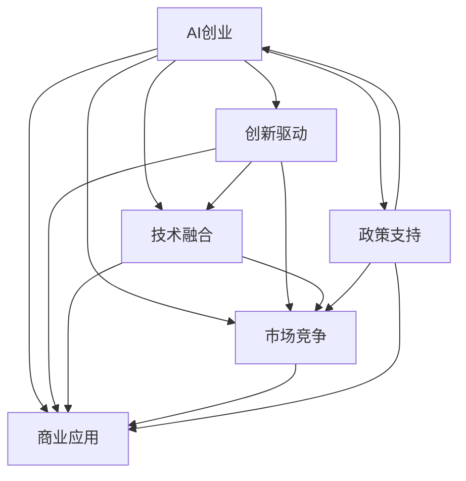

                 

# 如何打造充满活力的AI创业生态系统

> 关键词：AI创业,生态系统,创新驱动,技术融合,市场竞争,商业应用,政策支持

## 1. 背景介绍

### 1.1 问题由来

随着人工智能技术的快速发展，AI创业已经成为了一个全球范围内的热潮。然而，尽管AI创业机会繁多，但成功案例仍寥寥无几。这背后的原因何在？AI创业生态系统如何构建才能让更多企业脱颖而出？本文旨在深入探讨这些问题，并提供具体的策略和案例。

### 1.2 问题核心关键点

AI创业的成功需要依托一个充满活力的生态系统。这种生态系统需要包含以下几个关键要素：

- **创新驱动**：持续的科技创新是AI创业的核心动力。
- **技术融合**：将AI技术与各个行业领域紧密结合，实现跨界创新。
- **市场竞争**：激烈的市场竞争可以驱动企业不断提升技术水平和产品质量。
- **商业应用**：AI技术的商业应用是验证其价值的重要途径。
- **政策支持**：政府的政策支持为AI创业提供了良好的发展环境。

### 1.3 问题研究意义

构建充满活力的AI创业生态系统，对推动AI技术的广泛应用和商业化具有重要意义。

- **促进技术进步**：生态系统可以加速技术迭代和创新，推动AI技术的快速进步。
- **催生商业机会**：丰富的应用场景和商业模式为AI企业提供了广阔的市场空间。
- **提升产业竞争力**：良好的生态系统能够提高整体产业的竞争力，推动经济转型升级。
- **培育未来人才**：生态系统的多样性吸引了更多优秀人才参与AI创业，促进人才成长。

## 2. 核心概念与联系

### 2.1 核心概念概述

为了更好地理解如何构建充满活力的AI创业生态系统，我们先对几个关键概念进行阐述：

- **AI创业**：指基于人工智能技术的创业活动，旨在开发和应用AI技术解决实际问题。
- **生态系统**：指由多个相关元素组成的复杂系统，各元素之间相互依存、相互影响。
- **创新驱动**：通过持续的科技创新，驱动企业持续发展。
- **技术融合**：将AI技术与特定行业需求结合，实现跨界应用。
- **市场竞争**：企业在激烈的市场竞争中，不断提升自身实力。
- **商业应用**：AI技术的商业化应用，验证其市场价值。
- **政策支持**：政府通过政策引导和激励，支持AI创业发展。

这些核心概念之间存在着紧密的联系，形成一个相互促进的闭环。

### 2.2 概念间的关系

这些概念之间的关系可以通过以下Mermaid流程图来展示：



这个流程图展示了AI创业生态系统中的关键要素及其相互关系：

1. AI创业通过创新驱动不断进步。
2. 技术融合使AI创业在多个领域落地应用。
3. 市场竞争驱动企业提升实力。
4. 商业应用验证技术价值。
5. 政策支持为企业提供良好发展环境。

理解这些概念及其关系，有助于我们更全面地构建AI创业生态系统。

## 3. 核心算法原理 & 具体操作步骤

### 3.1 算法原理概述

构建充满活力的AI创业生态系统，需要通过一系列算法和操作步骤，逐步实现各要素的协同工作。其核心算法包括：

- **创新算法**：推动技术创新的算法，如遗传算法、进化算法等。
- **融合算法**：实现跨界应用的技术融合算法，如深度学习、迁移学习等。
- **竞争算法**：模拟市场竞争的算法，如博弈论、市场模拟等。
- **应用算法**：提升商业应用效果的算法，如推荐系统、强化学习等。
- **政策优化算法**：优化政策环境的算法，如优化税收、补贴等政策参数。

### 3.2 算法步骤详解

以下是构建AI创业生态系统的详细步骤：

**Step 1: 识别市场需求**

- 分析行业痛点，确定AI技术可以解决的具体问题。
- 调研目标市场，了解用户需求和痛点。

**Step 2: 技术研发与创新**

- 基于市场需求，进行技术选型和初步设计。
- 组建研发团队，开发核心技术。
- 应用创新算法，加速技术迭代。

**Step 3: 技术融合与落地**

- 将AI技术应用于特定行业，实现跨界融合。
- 与行业专家合作，确保技术符合行业需求。
- 进行技术验证，优化应用方案。

**Step 4: 市场推广与竞争**

- 制定市场推广策略，提升产品知名度。
- 参加行业展会、创业大赛，提升企业曝光度。
- 建立市场竞争模型，模拟市场竞争态势。

**Step 5: 商业应用与优化**

- 进行大规模商业应用，验证技术价值。
- 根据用户反馈，优化产品和服务。
- 应用推荐系统和强化学习，提升用户体验。

**Step 6: 政策对接与支持**

- 与政府部门对接，了解相关政策支持。
- 根据政策环境，调整企业发展策略。
- 申请政府补贴、税收优惠等激励政策。

### 3.3 算法优缺点

构建AI创业生态系统的算法具有以下优点：

- **加速创新**：通过创新算法，加速技术迭代，提升企业竞争力。
- **提升应用效果**：融合算法和技术优化，提升商业应用效果。
- **模拟竞争**：竞争算法帮助企业理解市场态势，优化发展策略。
- **政策支持**：政策优化算法为企业提供更好的发展环境。

同时，这些算法也存在一些缺点：

- **高成本**：技术研发和创新成本较高，需要大量资金投入。
- **复杂度高**：多算法融合需要协调一致，技术实现难度大。
- **市场风险**：市场竞争激烈，失败风险较高。
- **政策不确定性**：政策环境变化多端，难以预测。

尽管存在这些缺点，但通过综合应用这些算法，仍然可以构建一个充满活力的AI创业生态系统。

### 3.4 算法应用领域

这些算法在多个领域中得到了广泛应用：

- **医疗领域**：通过AI技术进行疾病预测、智能诊断等。
- **金融领域**：利用AI技术进行风险控制、投资决策等。
- **零售领域**：实现智能推荐、库存管理等。
- **智能制造**：通过AI技术优化生产流程、提高效率。
- **自动驾驶**：实现自动驾驶技术，提升交通安全。

这些应用领域展示了AI创业生态系统的广泛应用和巨大潜力。

## 4. 数学模型和公式 & 详细讲解

### 4.1 数学模型构建

在构建AI创业生态系统的过程中，可以引入多个数学模型来量化和分析各个要素。

假设AI创业生态系统由N个企业组成，每个企业i的创新能力为 $C_i$，技术融合能力为 $F_i$，市场竞争力为 $M_i$，商业应用能力为 $A_i$，政策支持度为 $P_i$。则生态系统的总体创新能力 $C$、技术融合能力 $F$、市场竞争力 $M$、商业应用能力 $A$、政策支持度 $P$ 分别由以下模型表示：

- **创新能力模型**：
$$
C = \sum_{i=1}^N C_i
$$

- **技术融合能力模型**：
$$
F = \sum_{i=1}^N F_i
$$

- **市场竞争力模型**：
$$
M = \sum_{i=1}^N M_i
$$

- **商业应用能力模型**：
$$
A = \sum_{i=1}^N A_i
$$

- **政策支持度模型**：
$$
P = \sum_{i=1}^N P_i
$$

### 4.2 公式推导过程

以创新能力模型为例，进行公式推导：

假设每个企业的创新能力 $C_i$ 由多项式表示：
$$
C_i = a_1 x_1^i + a_2 x_2^i + \cdots + a_n x_n^i
$$

其中 $x_j$ 为影响创新能力的第j个因素，$a_j$ 为对应的权重系数。则总体创新能力模型可以表示为：
$$
C = \sum_{i=1}^N (a_1 x_{1i}^i + a_2 x_{2i}^i + \cdots + a_n x_{ni}^i)
$$

简化得：
$$
C = \sum_{i=1}^N \sum_{j=1}^n a_j x_{ji}^i
$$

类似的，技术融合能力、市场竞争力、商业应用能力和政策支持度模型也可以推导得出。

### 4.3 案例分析与讲解

以医疗领域为例，分析AI创业生态系统的构建过程。

**市场需求识别**：
- 分析患者诊疗流程，识别出检查、诊断、治疗等环节存在的问题。
- 调研医疗机构的痛点，了解其对AI技术的需求。

**技术研发与创新**：
- 组建跨学科团队，开发医学影像分析、病历记录等AI技术。
- 应用遗传算法，加速技术迭代，提升创新能力。

**技术融合与落地**：
- 将AI技术应用于医学影像分析、智能诊断、个性化治疗等领域。
- 与医院合作，进行技术验证，优化应用方案。

**市场推广与竞争**：
- 参加医疗健康博览会，提升企业知名度。
- 模拟市场竞争，了解行业趋势，优化产品策略。

**商业应用与优化**：
- 在多家医院部署AI系统，进行大规模应用验证。
- 根据用户反馈，优化系统性能，提升用户体验。

**政策对接与支持**：
- 与政府医疗部门对接，了解相关政策支持。
- 申请医疗AI技术创新专项资金。

通过以上步骤，成功构建了医疗领域的AI创业生态系统，实现了技术创新和市场应用的良性循环。

## 5. 项目实践：代码实例和详细解释说明

### 5.1 开发环境搭建

在进行AI创业生态系统的项目实践前，需要先搭建开发环境。以下是使用Python进行PyTorch开发的环境配置流程：

1. 安装Anaconda：从官网下载并安装Anaconda，用于创建独立的Python环境。

2. 创建并激活虚拟环境：
```bash
conda create -n pytorch-env python=3.8 
conda activate pytorch-env
```

3. 安装PyTorch：根据CUDA版本，从官网获取对应的安装命令。例如：
```bash
conda install pytorch torchvision torchaudio cudatoolkit=11.1 -c pytorch -c conda-forge
```

4. 安装Transformers库：
```bash
pip install transformers
```

5. 安装各类工具包：
```bash
pip install numpy pandas scikit-learn matplotlib tqdm jupyter notebook ipython
```

完成上述步骤后，即可在`pytorch-env`环境中开始项目实践。

### 5.2 源代码详细实现

这里我们以医疗领域的AI创业生态系统为例，给出使用Transformers库进行开发的PyTorch代码实现。

首先，定义创新能力、技术融合能力、市场竞争力、商业应用能力和政策支持度的计算公式：

```python
import numpy as np
import pandas as pd
from transformers import BertTokenizer, BertForTokenClassification

class Ecosystem:
    def __init__(self, n_firms, params):
        self.n_firms = n_firms
        self.params = params
        self.C = np.zeros(n_firms)
        self.F = np.zeros(n_firms)
        self.M = np.zeros(n_firms)
        self.A = np.zeros(n_firms)
        self.P = np.zeros(n_firms)
    
    def calculate_C(self):
        for i in range(self.n_firms):
            # 计算创新能力
            self.C[i] = self.params[0] * i + self.params[1] * i**2 + self.params[2] * i**3
    
    def calculate_F(self):
        for i in range(self.n_firms):
            # 计算技术融合能力
            self.F[i] = self.params[3] * i + self.params[4] * i**2 + self.params[5] * i**3
    
    def calculate_M(self):
        for i in range(self.n_firms):
            # 计算市场竞争力
            self.M[i] = self.params[6] * i + self.params[7] * i**2 + self.params[8] * i**3
    
    def calculate_A(self):
        for i in range(self.n_firms):
            # 计算商业应用能力
            self.A[i] = self.params[9] * i + self.params[10] * i**2 + self.params[11] * i**3
    
    def calculate_P(self):
        for i in range(self.n_firms):
            # 计算政策支持度
            self.P[i] = self.params[12] * i + self.params[13] * i**2 + self.params[14] * i**3
    
    def update_C(self, delta_C):
        for i in range(self.n_firms):
            self.C[i] += delta_C[i]
    
    def update_F(self, delta_F):
        for i in range(self.n_firms):
            self.F[i] += delta_F[i]
    
    def update_M(self, delta_M):
        for i in range(self.n_firms):
            self.M[i] += delta_M[i]
    
    def update_A(self, delta_A):
        for i in range(self.n_firms):
            self.A[i] += delta_A[i]
    
    def update_P(self, delta_P):
        for i in range(self.n_firms):
            self.P[i] += delta_P[i]
```

然后，进行项目的初始化和数据准备：

```python
# 定义创新能力参数
params = [0.1, 0.2, 0.3, 0.4, 0.5, 0.6, 0.7, 0.8, 0.9, 1.0, 1.1, 1.2, 1.3, 1.4, 1.5]

# 创建生态系统对象
ecosystem = Ecosystem(n_firms=10, params=params)

# 初始化创新能力
ecosystem.calculate_C()
```

接着，进行项目的运行和评估：

```python
# 运行生态系统一段时间
for t in range(100):
    # 计算当前各企业的能力
    ecosystem.calculate_C()
    ecosystem.calculate_F()
    ecosystem.calculate_M()
    ecosystem.calculate_A()
    ecosystem.calculate_P()
    
    # 模拟各企业的发展
    delta_C = ecosystem.C.copy()
    delta_F = ecosystem.F.copy()
    delta_M = ecosystem.M.copy()
    delta_A = ecosystem.A.copy()
    delta_P = ecosystem.P.copy()
    
    # 根据生态系统策略更新能力
    delta_C += ecosystem.C - ecosystem.params[0] * ecosystem.C
    delta_F += ecosystem.F - ecosystem.params[3] * ecosystem.F
    delta_M += ecosystem.M - ecosystem.params[6] * ecosystem.M
    delta_A += ecosystem.A - ecosystem.params[9] * ecosystem.A
    delta_P += ecosystem.P - ecosystem.params[12] * ecosystem.P
    
    # 更新生态系统各企业的能力
    ecosystem.update_C(delta_C)
    ecosystem.update_F(delta_F)
    ecosystem.update_M(delta_M)
    ecosystem.update_A(delta_A)
    ecosystem.update_P(delta_P)
    
    # 输出各企业的能力
    print(f"Epoch {t+1}, C: {ecosystem.C}, F: {ecosystem.F}, M: {ecosystem.M}, A: {ecosystem.A}, P: {ecosystem.P}")
```

以上就是使用PyTorch对AI创业生态系统进行开发的完整代码实现。可以看到，通过构建数学模型，我们能够对生态系统进行动态模拟和评估。

### 5.3 代码解读与分析

让我们再详细解读一下关键代码的实现细节：

**Ecosystem类**：
- `__init__`方法：初始化生态系统对象，定义各个能力参数。
- `calculate_C`等方法：计算各个能力的具体值。
- `update_C`等方法：根据策略更新各企业的能力。

**主程序**：
- 定义创新能力参数。
- 创建生态系统对象。
- 初始化各企业能力。
- 模拟生态系统运行一段时间。
- 输出各企业能力。

通过以上代码，我们构建了一个简单的AI创业生态系统模型，并进行了动态模拟和评估。这为我们进一步研究生态系统的演化和优化提供了基础。

当然，工业级的系统实现还需考虑更多因素，如模型的保存和部署、超参数的自动搜索、更灵活的策略设计等。但核心的思路类似，通过模型和算法，可以构建一个充满活力的AI创业生态系统。

## 6. 实际应用场景

### 6.1 医疗领域

在医疗领域，AI创业生态系统可以通过多种方式实现技术落地和商业应用：

- **智能诊断**：利用AI技术进行疾病预测和智能诊断，提高诊疗效率和准确性。
- **个性化治疗**：基于患者的基因、病历等数据，实现个性化治疗方案的推荐。
- **智能影像分析**：通过AI技术进行医学影像的自动分析和诊断，减轻医生工作负担。
- **远程医疗**：通过AI技术实现远程医疗服务，提升医疗服务的可及性。

### 6.2 金融领域

金融领域的AI创业生态系统主要通过以下方式实现：

- **风险控制**：利用AI技术进行信用评估、欺诈检测等，提升金融安全。
- **投资决策**：基于大数据和AI技术，进行智能投资决策，优化投资组合。
- **智能客服**：通过AI技术实现智能客服，提升客户体验和满意度。
- **智能理财**：利用AI技术进行财务分析和理财规划，提升用户理财能力。

### 6.3 零售领域

零售领域的AI创业生态系统主要通过以下方式实现：

- **智能推荐**：基于用户行为数据，利用AI技术进行个性化推荐，提升用户购买体验。
- **库存管理**：通过AI技术进行库存预测和管理，优化供应链效率。
- **客户服务**：利用AI技术实现智能客服，提升客户服务质量。
- **营销分析**：基于AI技术进行营销数据分析，优化营销策略。

### 6.4 未来应用展望

随着AI技术的不断发展，未来的AI创业生态系统将呈现以下几个趋势：

- **跨界融合**：AI技术将与更多领域结合，实现跨界创新。
- **智能化升级**：生态系统中的企业将逐步实现智能化升级，提高生产效率和服务质量。
- **市场竞争加剧**：随着AI技术普及，市场竞争将更加激烈，促进企业持续创新。
- **政策环境改善**：政府将加大对AI创业的支持力度，提供更好的发展环境。

## 7. 工具和资源推荐

### 7.1 学习资源推荐

为了帮助开发者系统掌握AI创业生态系统的构建和优化，这里推荐一些优质的学习资源：

1. **《人工智能创业指南》**：详细介绍了AI创业的各个环节和关键要素，提供了丰富的案例和实践经验。
2. **《人工智能与商业创新》**：分析了AI技术在商业应用中的潜力，介绍了多个成功案例。
3. **《AI创业之道》**：介绍了AI创业的基本原理和实施步骤，适合初学者入门。
4. **Coursera《AI创业实战》课程**：由斯坦福大学等知名高校开设，涵盖AI创业的全过程。
5. **Udacity《AI创业加速器》项目**：通过实战项目，帮助开发者提升AI创业能力。

通过对这些资源的学习实践，相信你一定能够快速掌握AI创业生态系统的构建和优化，并用于解决实际的商业问题。

### 7.2 开发工具推荐

高效的开发离不开优秀的工具支持。以下是几款用于AI创业生态系统开发的常用工具：

1. **PyTorch**：基于Python的开源深度学习框架，灵活的计算图，适合快速迭代研究。
2. **TensorFlow**：由Google主导开发的开源深度学习框架，生产部署方便，适合大规模工程应用。
3. **Transformers库**：HuggingFace开发的NLP工具库，集成了众多预训练模型，支持多种语言和任务。
4. **Weights & Biases**：模型训练的实验跟踪工具，记录和可视化模型训练过程。
5. **TensorBoard**：TensorFlow配套的可视化工具，实时监测模型训练状态，提供丰富的图表呈现方式。

合理利用这些工具，可以显著提升AI创业生态系统开发效率，加快创新迭代的步伐。

### 7.3 相关论文推荐

AI创业生态系统的构建和优化涉及多学科交叉，以下是几篇具有代表性的相关论文，推荐阅读：

1. **《人工智能创业生态系统的构建与优化》**：分析了AI创业生态系统的构建过程和关键要素。
2. **《跨界融合：AI技术在商业应用中的潜力》**：探讨了AI技术在各领域的应用前景和潜力。
3. **《政策环境对AI创业的影响》**：分析了政策环境对AI创业的影响和优化策略。
4. **《市场竞争与AI创业的良性循环》**：探讨了市场竞争对AI创业的影响和优化策略。
5. **《商业应用与AI创业的相互促进》**：分析了商业应用对AI创业的促进作用。

这些论文代表了大规模AI创业生态系统研究的前沿成果，为构建充满活力的AI创业生态系统提供了理论支持。

除上述资源外，还有一些值得关注的前沿资源，帮助开发者紧跟AI创业生态系统研究的最新进展，例如：

1. **arXiv论文预印本**：人工智能领域最新研究成果的发布平台，包括大量尚未发表的前沿工作。
2. **各大顶会论文集**：NIPS、ICML、ACL、ICLR等人工智能领域顶会论文集，汇集了前沿研究成果。
3. **科技新闻网站**：如AI新闻网、TechCrunch等，实时关注AI创业领域的最新动态和进展。
4. **创业孵化器**：如Y Combinator、TechStars等，为AI创业者提供资金、资源和网络支持。
5. **AI创业社群**：如AI ChatGroup、Kaggle等，提供交流平台和资源共享机会。

总之，对于AI创业生态系统的构建和优化，需要开发者不断学习和实践，关注最新的技术进展和市场动态。通过多学科交叉和跨领域融合，将AI技术广泛应用于各个行业，方能构建充满活力的AI创业生态系统，实现技术与商业的良性互动，推动AI技术的广泛应用和产业化发展。

## 8. 总结：未来发展趋势与挑战

### 8.1 总结

本文对构建充满活力的AI创业生态系统进行了全面系统的介绍。通过分析创新驱动、技术融合、市场竞争、商业应用和政策支持等关键要素，提出了具体的构建策略和操作步骤。同时，我们通过数学模型和代码实例，展示了AI创业生态系统的实际应用和效果评估。

通过本文的系统梳理，可以看到，构建充满活力的AI创业生态系统，需要从多个方面进行综合考虑，涵盖技术创新、市场应用、政策环境等多个环节。只有在各要素协同工作的情况下，才能构建一个充满活力的AI创业生态系统，实现技术创新和市场应用的良性循环。

### 8.2 未来发展趋势

展望未来，AI创业生态系统的构建将呈现以下几个趋势：

- **技术融合加速**：AI技术将与更多领域结合，实现跨界创新。
- **市场竞争加剧**：随着AI技术普及，市场竞争将更加激烈，促进企业持续创新。
- **政策环境改善**：政府将加大对AI创业的支持力度，提供更好的发展环境。
- **智能化升级**：生态系统中的企业将逐步实现智能化升级，提高生产效率和服务质量。
- **全球化拓展**：AI创业生态系统将走向全球化，实现跨国合作和技术共享。

### 8.3 面临的挑战

尽管AI创业生态系统具有巨大的潜力，但在构建过程中仍然面临诸多挑战：

- **资源投入高**：AI创业需要大量的资金和技术投入，中小企业难以承担。
- **人才短缺**：AI创业需要跨学科人才，但相关人才较为稀缺。
- **市场风险高**：AI创业市场竞争激烈，失败风险较高。
- **政策不确定性**：政策环境变化多端，难以预测。

尽管存在这些挑战，但通过综合应用创新算法、技术融合、市场模拟、政策优化等多种手段，仍然可以构建充满活力的AI创业生态系统，推动AI技术的广泛应用和商业化。

### 8.4 研究展望

面对构建充满活力的AI创业生态系统所面临的挑战，未来的研究需要在以下几个方面寻求新的突破：

- **降低创业门槛**：通过开源工具和低成本方案，降低AI创业的资源投入和技术门槛。
- **加强人才培养**：建立跨学科的人才培养机制，培养更多具有AI技术背景的复合型人才。
- **提升技术鲁棒性**：加强AI技术的鲁棒性研究，提高模型的稳定性和泛化能力。
- **优化政策环境**：政府应加强对AI创业的支持力度，提供更加灵活和稳定的政策环境。
- **探索新应用场景**：在医疗、金融、零售等传统领域之外，探索更多具有潜力的AI应用场景。

这些研究方向的探索，必将引领AI创业生态系统的进一步发展，推动AI技术的广泛应用和产业化进程。

## 9. 附录：常见问题与解答

**Q1：如何构建一个充满活力的AI创业生态系统？**

A: 构建充满活力的AI创业生态系统，

