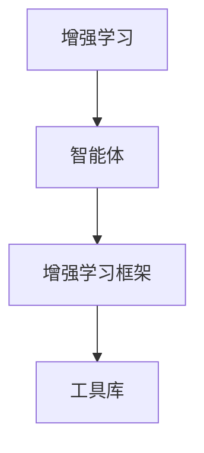

                 

## 1. 背景介绍

在当今复杂多变的世界中，智能体（Agents）被广泛应用于各个领域，包括游戏、金融、医疗、自动驾驶等。然而，单个智能体往往难以应对如此复杂的现实场景，因此需要引入增强学习（Reinforcement Learning, RL）技术，通过与环境的交互不断优化决策策略。然而，增强学习算法在处理高维连续动作空间、非凸优化问题、稀疏奖励信号等方面面临着诸多挑战。本文将探讨如何通过使用各种工具和资源，有效增强智能体的能力，提升其在复杂环境中的表现。

## 2. 核心概念与联系

### 2.1 核心概念概述

为了更好地理解本文的内容，我们首先需要了解一些核心概念和它们之间的联系：

- **增强学习**：一种通过与环境互动学习最优策略的机器学习方法。智能体通过执行一系列动作，观察环境的反馈（奖励或惩罚），逐步优化策略以获得最优结果。
- **智能体**：一个能够感知环境、执行动作、接收反馈并更新策略的决策实体。智能体可以是简单的规则，也可以是复杂的深度学习模型。
- **强化学习框架**：为智能体提供了训练和评估的基础环境。包括环境、智能体、奖励函数、状态转移函数等关键组件。
- **工具库**：指用于辅助智能体训练和优化的一组软件工具和资源。例如，OpenAI Gym、TensorFlow、PyTorch等。

这些概念之间存在着紧密的联系：智能体通过与环境交互学习最优策略，而增强学习框架为这种交互提供了结构和指导，工具库则提供了高效的算法实现和环境模拟能力。通过它们之间的协同工作，我们可以构建更加强大和灵活的智能体。

### 2.2 概念间的关系

我们可以通过以下Mermaid流程图来展示这些概念之间的关系：



这个流程图展示了一个基本的增强学习系统。智能体通过与环境（C）互动，利用工具库（D）提供的技术，在增强学习框架（C）的指导下进行学习和优化。

## 3. 核心算法原理 & 具体操作步骤
### 3.1 算法原理概述

增强学习的核心在于通过智能体与环境的交互，学习最优策略。其基本原理如下：

1. **环境建模**：定义环境的结构、状态空间、动作空间、奖励函数等，为智能体的学习提供基础。
2. **智能体设计**：选择合适的智能体模型（如Q-learning、Policy Gradient等），设计其感知、决策、更新策略的过程。
3. **算法实现**：使用具体的增强学习算法（如Q-learning、SARSA、Deep Q-Networks等），实现智能体的训练和优化。
4. **策略评估**：通过测试和评估，确定智能体的性能，进行迭代优化。

### 3.2 算法步骤详解

#### 3.2.1 环境设置

- **状态空间**：定义环境的状态空间，可以是连续的、离散的，或是混合的。例如，对于无人驾驶，状态空间可能包括车辆位置、速度、周围障碍物的位置和类型等。
- **动作空间**：定义智能体的动作空间，可以是离散的（如左转、右转）或是连续的（如转向角度）。
- **奖励函数**：定义智能体执行动作后得到的奖励。奖励可以是即时的（如游戏得分）或是累计的（如车辆行驶距离）。

#### 3.2.2 智能体设计

- **感知模块**：负责从环境获取状态信息，并将其转换为智能体可处理的格式。例如，使用传感器捕捉车辆位置和速度。
- **决策模块**：根据当前状态，选择最合适的动作。例如，使用规则或深度学习模型预测转向角度。
- **策略更新**：根据当前状态和动作，更新智能体的策略。例如，使用经验回放缓冲区或在线学习算法更新Q值或策略参数。

#### 3.2.3 算法实现

- **Q-learning**：基于价值函数的学习算法，通过观察和奖励信号，更新Q值以优化策略。
- **SARSA**：一种基于状态-动作-奖励-状态-动作（SARSA）的学习算法，通过模拟智能体的动作和奖励，逐步优化策略。
- **Deep Q-Networks（DQN）**：结合深度神经网络和经验回放缓冲区的算法，适用于处理高维动作空间和连续状态空间。

#### 3.2.4 策略评估

- **测试集**：使用与训练集不同的数据集，评估智能体的性能。
- **指标选择**：选择适当的评估指标（如平均奖励、成功率、学习速度等），评估智能体的表现。
- **迭代优化**：根据评估结果，调整智能体的策略和参数，进行迭代优化。

### 3.3 算法优缺点

#### 3.3.1 优点

- **自适应性强**：智能体可以在与环境的交互中不断学习，适应新的变化。
- **可扩展性好**：通过组合和优化不同的组件，可以实现多样化的智能体模型。
- **鲁棒性高**：通过合理的奖励函数和状态空间设计，可以避免陷入局部最优。

#### 3.3.2 缺点

- **训练时间较长**：需要大量的交互数据和计算资源，训练时间较长。
- **数据需求高**：需要大量的标注数据和多样化的环境设置，难以处理稀疏奖励信号。
- **模型复杂度高**：需要选择合适的智能体模型和算法，设计复杂的感知和决策模块。

### 3.4 算法应用领域

增强学习算法已经在诸多领域取得了显著成果，包括：

- **游戏AI**：如AlphaGo、Dota 2中的AI玩家，通过增强学习实现复杂决策。
- **机器人控制**：如无人机、工业机器人，通过增强学习优化动作选择。
- **自动驾驶**：如特斯拉的自动驾驶系统，通过增强学习学习环境感知和决策。
- **金融交易**：通过增强学习优化投资策略，实现自动交易。
- **自然语言处理**：如聊天机器人、文本生成等，通过增强学习优化语言模型。

## 4. 数学模型和公式 & 详细讲解
### 4.1 数学模型构建

增强学习的数学模型可以简化为以下形式：

- **状态**：$s_t$，表示环境在时间$t$的状态。
- **动作**：$a_t$，表示智能体在时间$t$选择的动作。
- **奖励**：$r_{t+1}$，表示智能体在时间$t$执行动作后得到的环境反馈。
- **下一个状态**：$s_{t+1}$，表示智能体在时间$t+1$的状态。

增强学习的目标是最小化未来奖励的期望值，即：

$$
\max_{\pi} \mathbb{E}_{\pi}[G_t] = \max_{\pi} \sum_{t=0}^{\infty} \gamma^t r_{t+1}
$$

其中，$G_t$ 表示从时间$t$开始未来所有奖励的期望值，$\gamma$ 是折扣因子，表示未来奖励的重要性。

### 4.2 公式推导过程

基于价值函数的增强学习算法，如Q-learning，其更新公式为：

$$
Q(s_t,a_t) \leftarrow Q(s_t,a_t) + \alpha (r_{t+1} + \gamma \max_a Q(s_{t+1},a) - Q(s_t,a_t))
$$

其中，$Q(s_t,a_t)$ 表示在状态$s_t$下执行动作$a_t$的价值，$\alpha$ 是学习率，$\max_a Q(s_{t+1},a)$ 表示在下一个状态$s_{t+1}$下，选择最佳动作的价值。

### 4.3 案例分析与讲解

以AlphaGo为例，其核心在于通过增强学习训练出高效的策略网络，能够在围棋游戏中不断优化决策。AlphaGo通过蒙特卡罗树搜索和深度学习相结合，实现了对人类围棋高手的超越。其数学模型和算法实现具有高度的复杂性和多样性，展示了增强学习在解决复杂决策问题上的巨大潜力。

## 5. 项目实践：代码实例和详细解释说明
### 5.1 开发环境搭建

为了开始增强学习的实践，我们需要搭建相应的开发环境。以下是一些建议：

- **环境**：安装Python 3.7及以上版本，安装必要的依赖包，如TensorFlow、PyTorch、Gym等。
- **工具库**：安装OpenAI Gym，这是一个常用的环境模拟和测试平台，提供了丰富的环境和算法库。
- **数据集**：准备需要模拟的环境和数据集，确保能够提供足够的训练和测试数据。

### 5.2 源代码详细实现

下面是一个简单的Q-learning算法的实现示例：

```python
import gym
import numpy as np

env = gym.make('CartPole-v1')
state_dim = env.observation_space.shape[0]
action_dim = env.action_space.n

Q = np.zeros([state_dim, action_dim])
learning_rate = 0.1
discount_factor = 0.99
epsilon = 0.1
num_episodes = 2000

for episode in range(num_episodes):
    state = env.reset()
    done = False
    total_reward = 0

    while not done:
        if np.random.uniform() < epsilon:
            action = env.action_space.sample()
        else:
            action = np.argmax(Q[state])

        next_state, reward, done, _ = env.step(action)
        Q[state, action] += learning_rate * (reward + discount_factor * np.max(Q[next_state, :]) - Q[state, action])
        state = next_state
        total_reward += reward

    print(f"Episode {episode+1} reward: {total_reward}")

env.close()
```

### 5.3 代码解读与分析

- **环境模拟**：使用Gym模拟CartPole-v1环境，这是一个经典的控制问题，用于测试增强学习算法的表现。
- **初始化Q值**：初始化Q值为全零，用于存储状态-动作的价值。
- **学习过程**：在每个时间步，根据当前状态和动作计算奖励和下一个状态，使用Q-learning更新Q值。
- **探索与利用**：在每次选择动作时，使用$\epsilon$-greedy策略，平衡探索和利用，避免陷入局部最优。

### 5.4 运行结果展示

运行上述代码，可以得到智能体在CartPole-v1环境中的学习过程和奖励变化情况，展示增强学习算法的实际效果。

## 6. 实际应用场景
### 6.4 未来应用展望

增强学习算法在未来的应用前景广阔，包括：

- **自适应控制**：在自动化制造、智能家居等场景中，通过增强学习优化控制系统，实现自适应调节。
- **智能推荐**：如电商推荐系统、新闻推送等，通过增强学习优化推荐策略，提升用户体验。
- **交互式教育**：通过增强学习设计个性化学习路径，提高学习效果。
- **虚拟助手**：如智能客服、虚拟助理等，通过增强学习优化对话策略，提高交互质量。

## 7. 工具和资源推荐
### 7.1 学习资源推荐

为了深入理解增强学习的原理和实践，推荐以下学习资源：

- **书籍**：《强化学习：算法、理论与应用》，Richard S. Sutton和Andrew G. Barto，是强化学习领域的经典教材。
- **在线课程**：Coursera上的“Reinforcement Learning”课程，由David Silver讲授，深入浅出地介绍了增强学习的原理和算法。
- **博客和论文**：Arxiv上的最新研究论文，如AlphaGo论文、DQN论文等，展示增强学习的最新进展。

### 7.2 开发工具推荐

以下是一些常用的增强学习开发工具：

- **OpenAI Gym**：提供丰富的环境模拟和测试平台，支持多种增强学习算法。
- **TensorFlow**：提供高效的神经网络库，支持深度Q网络和策略梯度等算法。
- **PyTorch**：提供灵活的深度学习框架，支持多种增强学习算法实现。
- **PyBullet**：提供物理引擎和环境模拟工具，适用于机器人控制和仿真。

### 7.3 相关论文推荐

为了了解最新的增强学习研究成果，推荐以下论文：

- **AlphaGo论文**：DeepMind发表的AlphaGo论文，展示了使用深度神经网络和增强学习解决围棋问题的技术。
- **DQN论文**：DeepMind发表的DQN论文，介绍了深度Q网络和经验回放缓冲区的实现。
- **A3C论文**：OpenAI发表的A3C论文，展示了异步训练和分布式训练的增强学习算法。

## 8. 总结：未来发展趋势与挑战
### 8.1 研究成果总结

本文对增强学习算法的基本原理和实践进行了介绍，展示了其在高维动作空间、稀疏奖励信号等复杂环境中的应用。通过合理使用工具和资源，可以显著提升智能体的能力，解决实际问题。

### 8.2 未来发展趋势

未来增强学习将呈现以下发展趋势：

- **多智能体学习**：通过多智能体协同工作，优化复杂系统，实现自适应控制。
- **深度强化学习**：结合深度神经网络和增强学习，解决更加复杂的问题，如自动驾驶、机器人控制等。
- **分布式训练**：通过分布式训练和异步更新，提升训练效率和模型性能。
- **对抗学习**：通过引入对抗训练，提高智能体的鲁棒性和安全性。

### 8.3 面临的挑战

尽管增强学习取得了显著成果，但仍面临诸多挑战：

- **训练时间较长**：需要大量的交互数据和计算资源，训练时间较长。
- **数据需求高**：需要大量的标注数据和多样化的环境设置，难以处理稀疏奖励信号。
- **模型复杂度高**：需要选择合适的智能体模型和算法，设计复杂的感知和决策模块。

### 8.4 研究展望

未来，增强学习需要进一步探索以下方向：

- **自适应控制**：在自动化制造、智能家居等场景中，通过增强学习优化控制系统，实现自适应调节。
- **智能推荐**：如电商推荐系统、新闻推送等，通过增强学习优化推荐策略，提升用户体验。
- **交互式教育**：通过增强学习设计个性化学习路径，提高学习效果。
- **虚拟助手**：如智能客服、虚拟助理等，通过增强学习优化对话策略，提高交互质量。

## 9. 附录：常见问题与解答

**Q1: 增强学习算法有哪些优点和缺点？**

**A:** 增强学习的优点包括自适应性强、可扩展性好、鲁棒性高。缺点则包括训练时间较长、数据需求高、模型复杂度高。

**Q2: 如何选择合适的增强学习算法？**

**A:** 应根据具体问题和环境特点选择算法，例如：
- **高维动作空间**：可以选择深度Q网络（DQN）或策略梯度（PG）等。
- **稀疏奖励信号**：可以使用蒙特卡罗树搜索（MCTS）或策略迭代（PI）等。
- **非凸优化问题**：可以尝试策略梯度（PG）或进化策略（ES）等。

**Q3: 增强学习算法有哪些经典案例？**

**A:** 增强学习算法在许多领域取得了显著成果，例如：
- **游戏AI**：如AlphaGo、Dota 2中的AI玩家。
- **机器人控制**：如无人机、工业机器人。
- **自动驾驶**：如特斯拉的自动驾驶系统。
- **金融交易**：如自动交易策略。
- **自然语言处理**：如聊天机器人、文本生成。

通过理解增强学习算法的基本原理和实际应用，结合合适的工具和资源，可以显著提升智能体的能力，解决实际问题。随着技术的发展，增强学习将在更多领域发挥重要作用，推动人工智能技术不断进步。

