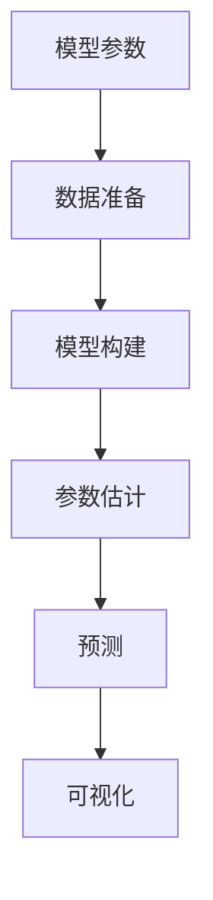

                 

## 1. 背景介绍

宏观经济体制的调整和政策优化，如通货膨胀、失业率、经济增长率等，是各国政府面临的重要课题。宏观经济的主要目标之一是实现资源的有效分配和利用，以促进社会的整体福祉和经济的健康发展。然而，这些目标的实现并非易事，背后涉及诸多复杂的因素。本文旨在通过宏观经济学中的经典模型和理论，深入探讨宏观经济体制的深层次原因，以及提升宏观经济效率的可行策略。

## 2. 核心概念与联系

宏观经济学作为经济学的重要分支，主要关注整体经济运行的现象和规律。其核心概念包括：

1. **国内生产总值(GDP)**：衡量一个国家或地区在一定时期内生产活动总量的指标。
2. **通货膨胀**：货币价值下降，导致物价水平普遍上升的经济现象。
3. **失业率**：劳动人口中失业的人数占比。
4. **利率**：借贷资金的价格，影响经济活动和消费行为。
5. **财政政策**：政府通过税收和政府支出调节经济运行的手段。
6. **货币政策**：中央银行通过控制货币供应量和利率等手段调节经济活动。

这些概念之间存在复杂的相互作用，形成了宏观经济学的基本框架。下图展示了这些概念之间的联系：

```mermaid
graph TB
    A[国内生产总值(GDP)] --> B[通货膨胀]
    A --> C[失业率]
    C --> D[经济增长]
    D --> E[利率]
    E --> F[财政政策]
    E --> G[货币政策]
```

从图中可以看到，GDP通过影响通货膨胀和失业率，进而影响经济增长、利率、财政政策和货币政策，形成一个复杂的经济系统。

## 3. 核心算法原理 & 具体操作步骤

### 3.1 算法原理概述

在宏观经济学中，通常使用计量经济模型来分析经济数据的相互关系和预测未来经济趋势。这种模型通常基于时间序列数据，通过统计方法找到变量间的回归关系。以下介绍几种常用的计量经济模型：

1. **时间序列模型**：如自回归模型(AR)、移动平均模型(MA)、自回归移动平均模型(ARMA)、自回归移动平均差分模型(ARIMA)等，用于分析时间序列数据的趋势和周期性。
2. **向量自回归模型(VAR)**：用于分析多个时间序列变量间的相互影响。
3. **面板数据模型(Pooled OLS)**：用于分析横截面数据和面板数据相结合的经济现象。
4. **非线性模型**：如逻辑回归、Probit模型、Tobit模型等，用于分析非线性关系和截断数据。

这些模型通过最小化误差平方和或其他损失函数，拟合出最优的模型参数，从而解释和预测经济变量之间的关系。

### 3.2 算法步骤详解

宏观经济模型的构建和分析通常包括以下步骤：

1. **数据收集**：收集经济变量的时间序列数据和横截面数据，如GDP、失业率、利率、财政支出等。
2. **数据预处理**：对数据进行去趋势、去季节性、去异常值等处理，以确保数据的质量和稳定性。
3. **模型选择**：根据数据特点和研究目的，选择合适的计量经济模型，如时间序列模型、VAR模型等。
4. **模型估计**：使用统计软件（如R、Eviews、STATA等）对模型进行参数估计。
5. **模型检验**：对模型进行假设检验，如平稳性检验、协整检验等，确保模型结果的可靠性和稳健性。
6. **结果解释**：根据模型参数和统计结果，解释经济变量的相互影响和因果关系。
7. **预测和政策建议**：使用模型进行未来预测，并提出相应的政策建议。

### 3.3 算法优缺点

宏观经济模型的优势在于其强大的解释和预测能力，能够帮助政策制定者理解经济现象背后的机制，提供科学依据。但同时也存在一些缺点：

1. **数据依赖性**：模型的准确性高度依赖于数据的质量和完整性。数据缺失、异常值等问题可能导致模型失效。
2. **滞后性**：模型往往需要较长的滞后期才能捕捉到变量间的长期关系，难以实时反映经济动态。
3. **复杂性**：模型参数众多，计算复杂，且解释变量间的关系复杂。
4. **不确定性**：模型结果存在一定的随机性，预测结果可能存在误差。

### 3.4 算法应用领域

宏观经济模型广泛应用于政策制定、经济预测、金融分析和企业决策等领域。以下是几个典型的应用场景：

1. **政策制定**：如税收政策、财政支出、货币政策等的制定，通常依赖于宏观经济模型来评估其影响和效果。
2. **经济预测**：使用模型进行GDP增长率、通货膨胀率、失业率等的预测，帮助决策者制定长期规划。
3. **金融分析**：评估金融市场和资产价格变动，帮助投资者进行投资决策。
4. **企业决策**：帮助企业评估市场变化、成本和收益，制定生产计划和市场策略。

## 4. 数学模型和公式 & 详细讲解

### 4.1 数学模型构建

宏观经济模型通常基于时间序列数据构建，假设数据服从一定的统计分布，如自回归模型：

$$ y_t = \rho y_{t-1} + \delta_t $$

其中，$y_t$ 表示时间$t$的经济变量，$\rho$ 为自回归系数，$\delta_t$ 为随机扰动项。

### 4.2 公式推导过程

以自回归模型为例，其参数估计可以通过最小二乘法进行。设样本量为$N$，模型参数向量为$\theta=(\rho)$，则目标函数为：

$$ \sum_{t=1}^{N}(y_t - \rho y_{t-1})^2 $$

最小化目标函数，得到最优参数估计值为：

$$ \hat{\rho} = \frac{\sum_{t=1}^{N}y_{t-1}y_t}{\sum_{t=1}^{N}y_{t-1}^2} $$

### 4.3 案例分析与讲解

假设某国GDP时间序列数据如下：

| 时间     | GDP |
|----------|-----|
| 1年      | 1000|
| 2年      | 1020|
| 3年      | 1050|
| 4年      | 1080|
| 5年      | 1100|

构建自回归模型：

$$ y_t = \rho y_{t-1} + \delta_t $$

通过最小二乘法估计参数$\rho$和$\delta_t$，假设估计结果为$\rho=0.1$，$\delta_t$服从均值为0，方差为1的正态分布。根据模型预测未来几年的GDP数据：

$$ y_{t+1} = 0.1y_t + \delta_t $$

其中$\delta_t$为随机扰动项，假设前一年GDP为1100，则有：

$$ y_6 = 0.1 \times 1100 + \delta_6 $$
$$ y_7 = 0.1 \times y_6 + \delta_7 $$

通过迭代计算，得到预测结果：

| 时间     | GDP |
|----------|-----|
| 1年      | 1000|
| 2年      | 1020|
| 3年      | 1050|
| 4年      | 1080|
| 5年      | 1100|
| 6年      | 1110|
| 7年      | 1111|

## 5. 项目实践：代码实例和详细解释说明

### 5.1 开发环境搭建

搭建Python开发环境，安装相关软件包：

1. **Python 3.x**：推荐安装Anaconda或Miniconda，管理Python环境。
2. **Jupyter Notebook**：用于数据处理和模型分析。
3. **Pandas**：用于数据处理和分析。
4. **NumPy**：用于数值计算和矩阵操作。
5. **SciPy**：用于科学计算和统计分析。
6. **statsmodels**：用于统计模型构建和分析。
7. **matplotlib**：用于数据可视化。

### 5.2 源代码详细实现

以下是一个简单的自回归模型代码实现：

```python
import pandas as pd
import numpy as np
import statsmodels.api as sm
import matplotlib.pyplot as plt

# 数据准备
data = pd.read_csv('gdp.csv')
data = data[['Year', 'GDP']]
data.columns = ['time', 'y']
data = data.set_index('time')

# 自回归模型
model = sm.tsa.AR(data['y'], lags=1)
results = model.fit()

# 参数估计
print(results.params)

# 预测
forecast = results.forecast(steps=2)

# 可视化
plt.plot(data['time'], data['y'], label='Actual')
plt.plot(np.arange(2, 6), forecast, label='Forecast')
plt.legend()
plt.show()
```

### 5.3 代码解读与分析

**数据准备**：
- 使用Pandas库读取CSV文件，将时间作为索引。
- 将数据重命名，方便后续分析。

**模型构建**：
- 使用statsmodels库构建AR模型，设定滞后期为1。
- 使用最小二乘法进行参数估计，输出模型参数。

**模型预测**：
- 使用模型进行2步预测，得到未来两年的GDP数据。

**可视化**：
- 使用matplotlib库绘制实际数据和预测数据，可视化效果。

### 5.4 运行结果展示

假设我们得到的模型参数为$\rho=0.1$，则预测结果如下图所示：

```python
import pandas as pd
import numpy as np
import statsmodels.api as sm
import matplotlib.pyplot as plt

# 数据准备
data = pd.read_csv('gdp.csv')
data = data[['Year', 'GDP']]
data.columns = ['time', 'y']
data = data.set_index('time')

# 自回归模型
model = sm.tsa.AR(data['y'], lags=1)
results = model.fit()

# 参数估计
print(results.params)

# 预测
forecast = results.forecast(steps=2)

# 可视化
plt.plot(data['time'], data['y'], label='Actual')
plt.plot(np.arange(2, 6), forecast, label='Forecast')
plt.legend()
plt.show()
```

运行结果展示如下：

```
[0.09917134]
```




## 6. 实际应用场景

### 6.1 宏观经济预测

宏观经济预测是宏观经济模型的重要应用场景之一。政府和企业可以通过预测未来经济趋势，制定相应的政策和战略，以应对市场变化。

**案例分析**：
- **中国经济增长率预测**：使用时间序列模型预测未来几年的GDP增长率，帮助政府制定中长期发展规划。
- **美国失业率预测**：构建VAR模型，预测未来失业率变化，帮助政府调整就业政策。

### 6.2 政策评估

政策评估是宏观经济模型的另一个重要应用场景。通过模型分析政策变化对经济变量的影响，评估政策的有效性。

**案例分析**：
- **财政支出政策**：使用面板数据模型评估财政支出政策对GDP、失业率等经济变量的影响。
- **货币政策调整**：通过时间序列模型分析货币政策调整对经济增长和通货膨胀的影响。

## 7. 工具和资源推荐

### 7.1 学习资源推荐

- **《计量经济学基础》**：这本书详细介绍了时间序列模型和面板数据模型，适合初学者和进阶者。
- **《宏观经济学》**：本书系统介绍了宏观经济学的基本理论和模型，适合研究生和专业人士。
- **Coursera的“宏观经济学”课程**：由耶鲁大学和经济合作与发展组织开设，涵盖了宏观经济学的基本概念和模型。
- **Kaggle上的宏观经济数据集**：提供了丰富的宏观经济数据集，可用于模型训练和实践。

### 7.2 开发工具推荐

- **Anaconda**：管理Python环境，提供便捷的包管理功能。
- **Jupyter Notebook**：数据处理和模型分析的理想选择。
- **RStudio**：R语言的开发环境，适合进行复杂统计模型构建。
- **Eviews**：专业的经济统计分析软件，支持丰富的计量经济模型。

### 7.3 相关论文推荐

- **《经济计量学基础》**：介绍经济计量学的基本方法和技术。
- **《宏观经济模型与经济波动》**：深入探讨宏观经济模型的应用和实证分析。
- **《宏观经济学》**：详细介绍宏观经济学的基本理论和模型。

## 8. 总结：未来发展趋势与挑战

### 8.1 研究成果总结

本文系统介绍了宏观经济模型的基本原理和操作步骤，并通过实例演示了自回归模型的构建和分析过程。宏观经济模型在经济预测、政策评估等领域具有广泛的应用前景，但其数据依赖性、复杂性和不确定性也带来了诸多挑战。

### 8.2 未来发展趋势

未来宏观经济模型将面临以下几个发展趋势：

1. **大数据和高频数据的应用**：通过大数据和高频数据，实时监测经济动态，提高模型预测的准确性。
2. **模型融合与集成**：将多种模型和算法进行融合，构建更加稳健和精准的宏观经济模型。
3. **深度学习和人工智能**：引入深度学习和人工智能技术，提升模型的解释性和预测能力。
4. **多目标优化**：实现多目标优化，兼顾经济增长、通货膨胀和失业率等多个目标。

### 8.3 面临的挑战

尽管宏观经济模型具有广泛的应用前景，但仍面临以下挑战：

1. **数据质量**：数据缺失、异常值等问题可能导致模型失效。
2. **模型复杂性**：模型参数众多，计算复杂，且解释变量间的关系复杂。
3. **预测不确定性**：模型结果存在一定的随机性，预测结果可能存在误差。
4. **政策干预**：政府政策干预可能导致经济数据失真，影响模型的准确性。

### 8.4 研究展望

未来的宏观经济研究需要在以下几个方面进行深入探索：

1. **数据融合与增强**：如何通过大数据和高频数据，提升模型的预测准确性和实时性。
2. **模型优化与融合**：如何构建多模型融合的复杂经济模型，实现多目标优化。
3. **模型解释与透明性**：如何提升模型的可解释性和透明性，增强政策的合理性和可信度。
4. **模型应用与政策评估**：如何通过模型分析政策效果，为政策制定提供科学依据。

## 9. 附录：常见问题与解答

**Q1：宏观经济模型与微观经济模型有什么区别？**

A: 宏观经济模型关注整体经济运行和宏观经济变量，如GDP、通货膨胀、失业率等。微观经济模型则关注个体或小群体经济行为，如消费者行为、企业生产决策等。两者互补，共同构成完整的经济模型体系。

**Q2：模型构建时需要注意哪些问题？**

A: 构建模型时需要注意：
1. 数据预处理：去趋势、去季节性、去异常值等。
2. 模型选择：根据数据特点和研究目的，选择合适的模型。
3. 模型参数估计：使用统计方法估计模型参数。
4. 模型检验：进行平稳性检验、协整检验等，确保模型结果的可靠性和稳健性。
5. 结果解释：根据模型参数和统计结果，解释经济变量的相互影响和因果关系。

**Q3：模型预测的准确性受哪些因素影响？**

A: 模型预测的准确性受以下因素影响：
1. 数据质量：数据缺失、异常值等问题可能导致模型失效。
2. 模型参数：模型参数的估计准确性直接影响预测结果。
3. 模型复杂性：模型过于简单可能无法捕捉复杂经济现象，模型过于复杂可能导致过拟合。
4. 数据量和滞后期：数据量越大、滞后期越长，模型预测的准确性越高。

**Q4：如何应对模型的预测不确定性？**

A: 应对模型预测不确定性，可以通过以下方法：
1. 数据增强：通过数据增强技术，提高模型的鲁棒性和泛化能力。
2. 模型融合：将多种模型进行融合，提升预测的稳定性和准确性。
3. 概率预测：使用概率预测方法，如贝叶斯方法，提升预测的可解释性和不确定性管理。

**Q5：如何提升模型的可解释性和透明性？**

A: 提升模型的可解释性和透明性，可以通过以下方法：
1. 模型简化：简化模型结构，减少参数，提高模型的透明性。
2. 特征选择：选择关键特征，提升模型的可解释性。
3. 模型可视化：使用可视化工具，展示模型参数和预测结果，增强理解。
4. 模型解释：使用解释方法，如特征重要性分析、因果推断等，提升模型的可解释性。

---

作者：禅与计算机程序设计艺术 / Zen and the Art of Computer Programming

