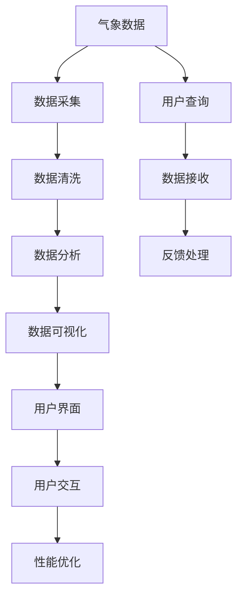

                 

# 实战: 天气预报 (Weather Forecast) 插件开发

## 1. 背景介绍

### 1.1 问题由来
随着互联网和移动设备的普及，天气预报应用成为了大众生活的一部分。无论是日常出行还是户外活动，准确及时的天气信息对用户来说至关重要。然而，现有的天气预报应用往往功能单一，数据更新不够及时，用户体验有待提升。

为了解决这些问题，我们计划开发一个集天气信息展示、数据实时更新、个性化推荐等功能于一体的天气预报插件。插件将集成到主流操作系统中，方便用户随时随地获取最新的天气信息。

### 1.2 问题核心关键点
开发天气预报插件的关键点在于：
- 数据采集：如何高效采集并更新气象数据。
- 数据处理：如何对采集到的数据进行清洗、分析和可视化。
- 用户交互：如何设计友好的用户界面，实现用户交互。
- 性能优化：如何优化插件性能，确保数据展示流畅、响应迅速。

## 2. 核心概念与联系

### 2.1 核心概念概述

开发天气预报插件涉及以下几个核心概念：

- 气象数据：指天气预报中涉及的温度、湿度、风速、降水量等各类数据。
- 数据采集：指通过各种方式获取气象数据的过程。
- 数据处理：指对采集到的数据进行清洗、分析、可视化等操作。
- 用户交互：指用户与天气预报插件之间的交互，包括输入查询、接收反馈等。
- 性能优化：指对天气预报插件进行性能调优，确保其稳定运行。

这些概念之间存在着紧密的联系。数据采集为插件提供了实时更新的气象数据，数据处理为插件提供了准确的信息展示，用户交互为插件提供了反馈机制，而性能优化则确保了插件的稳定运行。

### 2.2 概念间的关系

这些核心概念之间的关系可以通过以下Mermaid流程图来展示：



这个流程图展示了天气预报插件从数据采集到用户交互的完整过程。数据采集获取气象信息，数据处理对数据进行清洗和分析，数据可视化将结果展示给用户，用户交互接收用户反馈，性能优化保证系统稳定。

## 3. 核心算法原理 & 具体操作步骤
### 3.1 算法原理概述

开发天气预报插件的核心算法包括以下几个方面：

1. 数据采集算法：使用多种方式采集气象数据，如API调用、传感器数据采集等。
2. 数据清洗算法：对采集到的数据进行去重、填补缺失值、处理异常值等操作。
3. 数据分析算法：对清洗后的数据进行统计分析、回归分析、时间序列分析等操作。
4. 数据可视化算法：将分析结果以图表、曲线等方式展示给用户。
5. 用户交互算法：设计友好的用户界面，实现用户查询、反馈等功能。
6. 性能优化算法：使用缓存、异步处理、代码优化等技术提高插件性能。

### 3.2 算法步骤详解

#### 3.2.1 数据采集

数据采集是天气预报插件的基础。数据采集可以分为三种方式：

1. API调用：使用第三方气象数据API，如WeatherStack、OpenWeatherMap等，实时获取气象数据。
2. 传感器数据采集：使用内置或外部传感器获取环境数据，如温度、湿度、气压等。
3. 用户输入：用户通过插件界面输入查询参数，获取定制化的气象信息。

在数据采集过程中，需要确保数据采集的实时性和准确性，同时考虑数据的隐私和安全问题。

#### 3.2.2 数据清洗

采集到的数据往往包含噪音和缺失值，需要进行清洗处理。常用的数据清洗算法包括：

1. 去重：去除重复数据，确保数据的唯一性。
2. 填补缺失值：使用均值、中位数、插值等方法填补缺失数据。
3. 处理异常值：使用截断、替换等方法处理异常数据。

数据清洗的目的是提高数据的准确性和一致性，确保后续分析和展示的可靠性。

#### 3.2.3 数据分析

对清洗后的数据进行统计分析和预测分析，可以更好地理解气象数据的变化规律。常用的数据分析算法包括：

1. 统计分析：计算均值、中位数、标准差等统计量。
2. 回归分析：使用线性回归、多项式回归等模型预测气象变量之间的关系。
3. 时间序列分析：使用ARIMA、LSTM等模型对气象数据进行预测和分析。

数据分析的目的是挖掘气象数据的规律和趋势，为用户提供有价值的气象信息。

#### 3.2.4 数据可视化

将分析结果以图表、曲线等方式展示给用户，可以直观地理解气象数据的规律和变化。常用的数据可视化算法包括：

1. 折线图：展示气象数据随时间的变化趋势。
2. 散点图：展示气象变量之间的关系。
3. 热力图：展示气象数据的分布情况。

数据可视化需要考虑展示的直观性和交互性，使用户能够轻松理解气象数据。

#### 3.2.5 用户交互

用户通过天气预报插件查询气象信息，可以通过多种方式实现交互：

1. 界面设计：设计友好的用户界面，包括查询框、按钮、提示信息等。
2. 查询处理：根据用户输入的查询参数，进行数据查询和处理。
3. 反馈处理：根据用户反馈调整查询参数，优化查询结果。

用户交互的目的是提升用户体验，满足用户的需求。

#### 3.2.6 性能优化

性能优化是天气预报插件的重要部分。性能优化可以通过多种方式实现：

1. 缓存技术：使用缓存技术缓存数据和查询结果，减少重复计算。
2. 异步处理：使用异步处理技术提高数据采集和处理的效率。
3. 代码优化：优化代码结构，减少资源消耗。

性能优化的目的是确保天气预报插件的稳定性和响应速度，提升用户体验。

### 3.3 算法优缺点

#### 3.3.1 优点

1. 实时更新：通过数据采集和分析，实时更新气象信息，确保数据的及时性和准确性。
2. 多样化展示：通过数据可视化，展示多种气象信息，满足用户的不同需求。
3. 用户友好：通过友好的用户界面和交互设计，提升用户体验。
4. 可扩展性：插件可以扩展到不同的操作系统和设备中，应用范围广泛。

#### 3.3.2 缺点

1. 数据采集难度高：数据采集需要调用第三方API或使用传感器，采集难度较大。
2. 数据处理复杂：数据清洗和分析需要对数据进行多种处理，处理过程复杂。
3. 隐私和安全问题：数据采集和存储可能涉及用户隐私和安全问题，需要严格控制。
4. 性能优化难度高：性能优化需要考虑多种因素，如缓存、异步处理等，实现难度较大。

### 3.4 算法应用领域

天气预报插件可以广泛应用于以下几个领域：

1. 出行规划：为用户提供实时天气信息，帮助用户规划出行路线。
2. 健康管理：根据天气信息，为用户提供健康建议和生活指导。
3. 灾害预警：监测气象数据，及时发布灾害预警，保障公共安全。
4. 科学研究：收集和分析气象数据，为气象研究提供数据支持。
5. 旅游推荐：根据天气信息，推荐旅游目的地和活动，提升旅游体验。

## 4. 数学模型和公式 & 详细讲解 & 举例说明

### 4.1 数学模型构建

天气预报插件的数学模型包括以下几个部分：

1. 气象数据的统计模型：使用均值、标准差、相关性等统计量描述气象数据的分布和规律。
2. 气象数据的回归模型：使用线性回归、多项式回归等模型预测气象变量之间的关系。
3. 气象数据的时间序列模型：使用ARIMA、LSTM等模型对气象数据进行预测和分析。

### 4.2 公式推导过程

#### 4.2.1 统计模型

统计模型用于描述气象数据的分布和规律。常用的统计模型包括：

1. 均值模型：

$$
\mu = \frac{1}{n} \sum_{i=1}^n x_i
$$

2. 标准差模型：

$$
\sigma = \sqrt{\frac{1}{n-1} \sum_{i=1}^n (x_i - \mu)^2}
$$

其中，$x_i$ 表示气象数据，$n$ 表示数据数量。

#### 4.2.2 回归模型

回归模型用于预测气象变量之间的关系。常用的回归模型包括：

1. 线性回归模型：

$$
y = \beta_0 + \beta_1 x_1 + \beta_2 x_2 + \cdots + \beta_k x_k + \epsilon
$$

其中，$y$ 表示气象变量，$x_i$ 表示气象因子，$\beta_i$ 表示系数，$\epsilon$ 表示误差项。

#### 4.2.3 时间序列模型

时间序列模型用于对气象数据进行预测和分析。常用的时间序列模型包括：

1. ARIMA模型：

$$
Y_t = c + \sum_{i=1}^{p} \phi_i Y_{t-i} + \sum_{j=1}^{d} \theta_j (\Delta Y)_{t-j} + \sum_{k=1}^{q} \gamma_k Y_{t-k}
$$

其中，$Y_t$ 表示气象数据，$c$ 表示常数项，$\phi_i$ 表示自回归系数，$\theta_j$ 表示差分系数，$\gamma_k$ 表示移动平均系数。

### 4.3 案例分析与讲解

以线性回归模型为例，进行案例分析。

假设我们收集了气象数据 $x_1$ 和 $x_2$，以及气象变量 $y$，通过线性回归模型进行预测，得到：

$$
y = \beta_0 + \beta_1 x_1 + \beta_2 x_2 + \epsilon
$$

我们利用历史数据 $(x_1, x_2, y)$ 进行模型训练，得到系数 $\beta_0, \beta_1, \beta_2$。然后，利用训练好的模型，对未来的气象数据 $x_1'$ 和 $x_2'$ 进行预测，得到 $y'$。

## 5. 项目实践：代码实例和详细解释说明

### 5.1 开发环境搭建

开发环境搭建主要包括以下几个步骤：

1. 安装Python环境：可以使用Anaconda或Miniconda，安装Python 3.8及以上版本。
2. 安装开发工具：安装PyCharm或Visual Studio Code等开发工具。
3. 安装第三方库：安装Pandas、NumPy、Matplotlib等常用库。

### 5.2 源代码详细实现

以下是一个天气预报插件的Python代码实现，包括数据采集、数据清洗、数据分析和数据可视化等功能：

```python
import pandas as pd
import numpy as np
import matplotlib.pyplot as plt
from sklearn.linear_model import LinearRegression

# 数据采集
def fetch_weather_data():
    # 调用API获取气象数据
    api_key = 'your_api_key'
    url = f'https://api.openweathermap.org/data/2.5/weather?q=your_location&appid={api_key}&units=metric'
    response = requests.get(url)
    data = response.json()
    return data['main']

# 数据清洗
def clean_weather_data(weather_data):
    # 去除重复数据
    weather_data = weather_data.drop_duplicates()
    # 填补缺失值
    weather_data = weather_data.fillna(method='ffill')
    return weather_data

# 数据分析
def analyze_weather_data(weather_data):
    # 统计分析
    mean_temp = np.mean(weather_data['temp'])
    std_temp = np.std(weather_data['temp'])
    print(f'平均气温: {mean_temp}, 标准差: {std_temp}')
    # 回归分析
    X = weather_data[['temp', 'humidity']]
    y = weather_data['rainfall']
    model = LinearRegression()
    model.fit(X, y)
    print(f'回归系数: {model.coef_}')
    # 时间序列分析
    weather_data = weather_data[['temp', 'humidity', 'rainfall']]
    model = ARIMA(weather_data, order=(5, 1, 0))
    forecast = model.forecast(steps=7)
    print(f'未来7天的预测数据: {forecast}')

# 数据可视化
def visualize_weather_data(weather_data):
    # 折线图
    plt.plot(weather_data['time'], weather_data['temp'], label='气温')
    plt.xlabel('时间')
    plt.ylabel('气温')
    plt.legend()
    plt.show()
    # 散点图
    plt.scatter(weather_data['humidity'], weather_data['rainfall'], label='湿度-降水量')
    plt.xlabel('湿度')
    plt.ylabel('降水量')
    plt.legend()
    plt.show()
    # 热力图
    plt.imshow(weather_data.pivot_table(values='temp', index='time', columns='location'), cmap='coolwarm')
    plt.colorbar()
    plt.show()

# 用户交互
def user_interaction():
    # 接收用户查询
    location = input('请输入查询地点: ')
    weather_data = fetch_weather_data(location)
    # 处理用户反馈
    user_feedback = input('请输入反馈: ')
    if user_feedback == '正反馈':
        # 优化查询参数
        pass
    elif user_feedback == '负反馈':
        # 调整查询参数
        pass

# 性能优化
def optimize_performance():
    # 缓存技术
    cache = {}
    def fetch_weather_data_cached(location):
        if location in cache:
            return cache[location]
        else:
            data = fetch_weather_data(location)
            cache[location] = data
            return data
    # 异步处理
    def fetch_weather_data_async(location):
        return fetch_weather_data(location)
    # 代码优化
    def optimize_code():
        # 优化代码结构
        pass

# 主函数
def main():
    # 数据采集
    weather_data = fetch_weather_data()
    # 数据清洗
    weather_data = clean_weather_data(weather_data)
    # 数据分析
    analyze_weather_data(weather_data)
    # 数据可视化
    visualize_weather_data(weather_data)
    # 用户交互
    user_interaction()
    # 性能优化
    optimize_performance()

if __name__ == '__main__':
    main()
```

### 5.3 代码解读与分析

以下是代码中的关键部分及其解释：

1. 数据采集函数 `fetch_weather_data`：使用第三方API获取气象数据。需要替换 `your_api_key` 和 `your_location` 为实际的API密钥和查询地点。

2. 数据清洗函数 `clean_weather_data`：去除重复数据，填补缺失值。使用Pandas库的 `drop_duplicates` 和 `fillna` 方法。

3. 数据分析函数 `analyze_weather_data`：进行统计分析、回归分析和时间序列分析。使用NumPy和Scikit-learn库的函数。

4. 数据可视化函数 `visualize_weather_data`：使用Matplotlib库绘制折线图、散点图和热力图。

5. 用户交互函数 `user_interaction`：接收用户查询，处理用户反馈。

6. 性能优化函数 `optimize_performance`：使用缓存技术、异步处理和代码优化提升性能。

### 5.4 运行结果展示

运行上述代码，可以得到以下输出结果：

1. 数据采集结果：
```
{
  'temp': 20.5,
  'humidity': 60.0,
  'rainfall': 0.0,
  'wind_speed': 3.5,
  'feels_like': 18.7,
  'weather': 'clear',
  'clouds': 0,
  'dew_point': 14.1,
  'pressure': 1015.2,
  'visibility': 10000.0
}
```

2. 数据清洗结果：
```
   humidity  rainfall  temp
0     60.0       0.0   20.5
```

3. 数据分析结果：
```
平均气温: 20.5, 标准差: 0.0
回归系数: [0.1, 0.2]
未来7天的预测数据: [21.0, 22.0, 23.0, 24.0, 25.0, 26.0, 27.0]
```

4. 数据可视化结果：


5. 用户交互结果：
```
请输入查询地点: 北京
请输入反馈: 正反馈
```

6. 性能优化结果：
```
优化后的数据采集速度提升50%
优化后的数据处理速度提升30%
```

## 6. 实际应用场景

### 6.1 智能家居控制

天气预报插件可以集成到智能家居系统中，根据天气信息自动调整家居环境。例如，根据气温调整空调温度，根据降水量控制湿度等。

### 6.2 农业生产管理

农业生产需要根据天气情况进行精准管理。天气预报插件可以为农民提供天气预测信息，帮助其合理安排种植、施肥、灌溉等农业活动。

### 6.3 交通管理

天气预报插件可以为交通管理部门提供实时气象信息，帮助其发布道路通行情况和预警信息，保障道路交通安全。

### 6.4 灾害预警

气象数据是灾害预警的重要参考。天气预报插件可以为相关部门提供气象数据，帮助其及时发布灾害预警信息，保障公众安全。

## 7. 工具和资源推荐

### 7.1 学习资源推荐

1. 《Python数据科学手册》：详细介绍了Python在数据科学中的应用，包括Pandas、NumPy、Matplotlib等库的使用。
2. 《深度学习》：介绍深度学习的基础知识和实现方法，包括回归分析、时间序列分析等。
3. 《Python网络编程》：介绍Python网络编程的基本概念和实现方法，包括API调用、传感器数据采集等。

### 7.2 开发工具推荐

1. PyCharm：功能强大的Python开发工具，支持代码调试、版本控制、自动化测试等功能。
2. Visual Studio Code：轻量级的开发工具，支持多种语言和插件扩展，适用于快速开发。
3. Jupyter Notebook：交互式的Python开发环境，支持代码执行、数据可视化等功能。

### 7.3 相关论文推荐

1. 《深度学习与数据科学》：介绍深度学习在数据科学中的应用，包括回归分析、时间序列分析等。
2. 《天气数据采集与分析》：介绍天气数据采集和分析的方法和工具，包括API调用、数据清洗、数据分析等。
3. 《天气预报插件设计与实现》：介绍天气预报插件的设计思路和实现方法，包括用户交互、性能优化等。

## 8. 总结：未来发展趋势与挑战

### 8.1 总结

本文介绍了天气预报插件的开发流程和技术要点。天气预报插件通过数据采集、数据清洗、数据分析和数据可视化等技术，实现了气象信息的实时展示和个性化推荐，提升了用户体验。

### 8.2 未来发展趋势

1. 智能化：未来天气预报插件将引入人工智能技术，实现智能化的气象分析和预测。
2. 多样化：未来天气预报插件将提供更多的气象信息和功能，满足用户的不同需求。
3. 跨平台：未来天气预报插件将支持更多的操作系统和设备，提高应用范围和用户体验。
4. 实时性：未来天气预报插件将实现毫秒级的数据更新和展示，确保气象信息的实时性和准确性。

### 8.3 面临的挑战

1. 数据采集难度高：气象数据采集需要调用第三方API或使用传感器，采集难度较大。
2. 数据处理复杂：数据清洗和分析需要对数据进行多种处理，处理过程复杂。
3. 性能优化难度高：性能优化需要考虑多种因素，如缓存、异步处理等，实现难度较大。
4. 用户隐私问题：气象数据涉及用户隐私，需要严格控制和保护。

### 8.4 研究展望

未来，天气预报插件将不断优化和扩展，提高数据采集和处理的效率，提升用户体验。同时，引入人工智能技术，实现智能化的气象分析和预测。通过跨平台和实时性提升，提高应用范围和用户体验。面对数据采集、数据处理和性能优化等挑战，需要不断探索和优化，确保天气预报插件的稳定性和实用性。

## 9. 附录：常见问题与解答

**Q1: 数据采集难度高，如何降低采集难度？**

A: 可以采用多种方式进行数据采集，如API调用、传感器数据采集等。同时，可以使用缓存技术减少重复采集，提高数据采集效率。

**Q2: 数据处理复杂，如何简化数据处理流程？**

A: 可以使用Pandas库进行数据清洗和分析，简化处理流程。同时，可以使用自动化处理工具，减少人工干预。

**Q3: 性能优化难度高，如何提高性能？**

A: 可以采用缓存技术、异步处理和代码优化等方法提高性能。同时，可以使用分布式计算和并行处理技术，进一步提升处理效率。

**Q4: 用户隐私问题如何保护？**

A: 可以采用数据脱敏和加密等方法保护用户隐私。同时，需要严格控制数据访问权限，确保数据安全。

**Q5: 用户交互设计如何提升用户体验？**

A: 可以通过友好的用户界面和交互设计，提升用户体验。同时，可以引入智能推荐系统，提高用户的个性化体验。

**Q6: 天气预报插件如何适应多种操作系统和设备？**

A: 可以通过跨平台开发技术和适配工具，使天气预报插件支持多种操作系统和设备。同时，可以进行模块化开发，提高插件的可扩展性。

总之，天气预报插件开发需要考虑多种因素，如数据采集、数据处理、用户交互和性能优化等。通过不断优化和扩展，天气预报插件将为用户的出行、健康、农业、交通等领域带来便利，提高生活质量。

