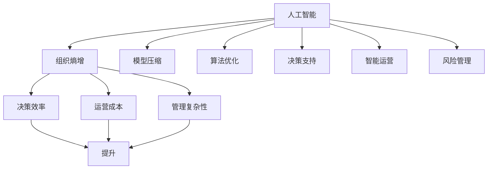
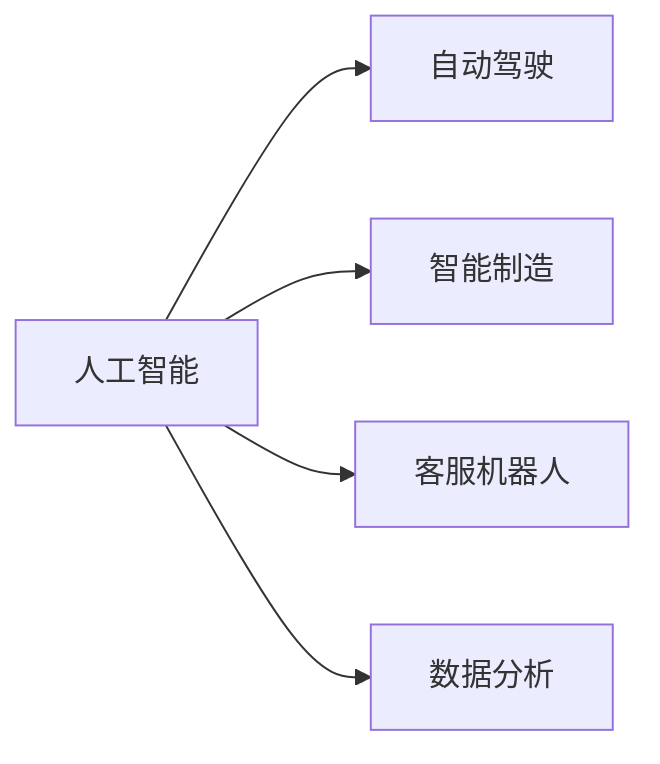
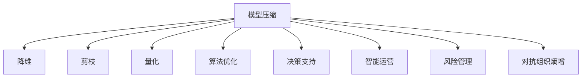
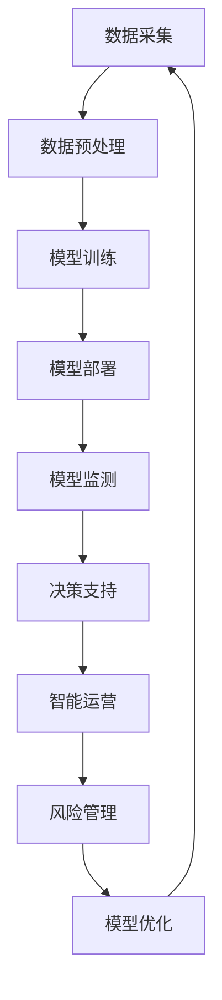
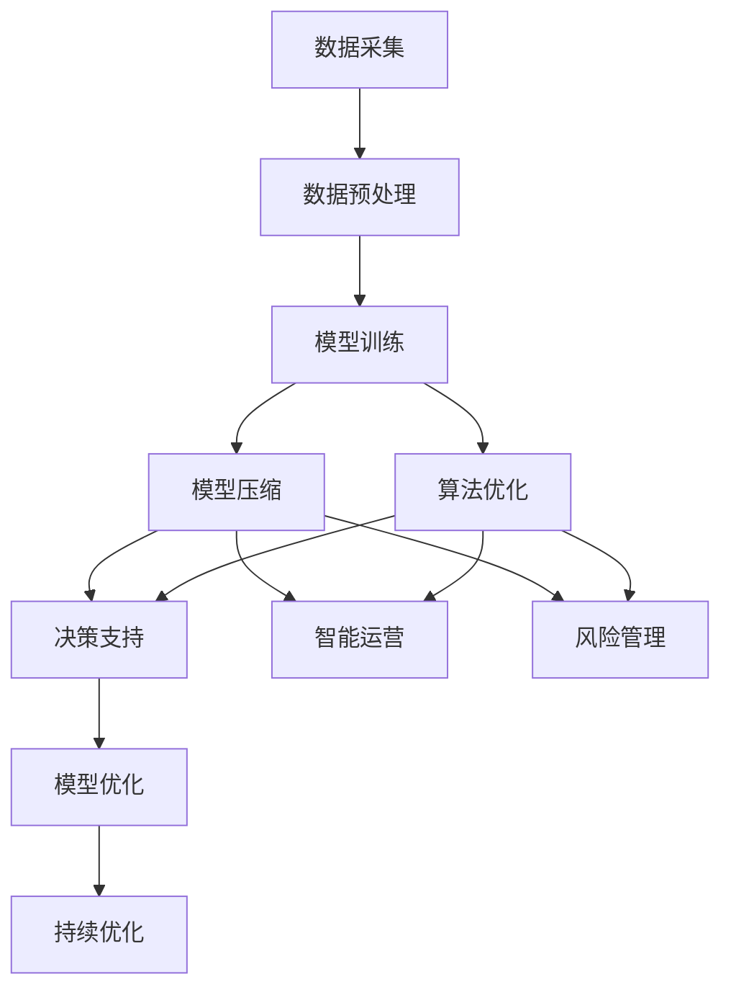

                 

# 对抗组织熵增：AI与企业的协同

> 关键词：
- 人工智能与企业协同
- 组织熵增
- 模型压缩
- 算法优化
- 决策支持
- 智能运营
- 风险管理

## 1. 背景介绍

### 1.1 问题由来
随着信息技术的飞速发展，人工智能(AI)技术在各行各业中得到了广泛应用。然而，在AI赋能企业的过程中，一些新兴问题和挑战也逐渐显现出来。例如，AI模型的过度复杂化导致了组织熵增，降低了决策的效率和灵活性，增加了运营成本，给企业的长期发展带来了巨大风险。如何对抗组织熵增，充分发挥AI的协同效用，成为当下企业数字化转型亟待解决的关键问题。

### 1.2 问题核心关键点
AI与企业的协同，本质上是一种复杂的技术-管理问题。其核心关键点包括：
- AI技术在企业中的应用场景：如自动驾驶、智能制造、客服机器人、数据分析等。
- 组织熵增现象：AI模型复杂度高、决策流程繁冗、知识体系杂乱等问题，导致了企业决策过程的熵值增加，管理效率降低。
- 对抗组织熵增的方法：包括模型压缩、算法优化、决策支持、智能运营和风险管理等策略。

## 2. 核心概念与联系

### 2.1 核心概念概述

为更好地理解AI与企业的协同，本节将介绍几个关键概念：

- 人工智能(AI)：通过模拟人类智能，使用计算机算法处理和解释复杂数据，解决各种复杂问题。
- 组织熵增：一个系统的熵值增加，代表着该系统的有序性降低、信息混乱度增加，系统功能和效率下降。
- 模型压缩：通过降维、剪枝、量化等方法，减少AI模型的复杂度，提升模型效率，降低计算资源消耗。
- 算法优化：通过改进算法设计，提升AI算法的执行速度和准确度，改善决策效率和质量。
- 决策支持：利用AI技术，提供实时、准确的决策依据和建议，辅助管理层做出最优决策。
- 智能运营：运用AI技术，实现生产、物流、客户服务等运营环节的自动化、智能化，提升运营效率和质量。
- 风险管理：通过AI技术，预测和评估企业运营中的潜在风险，采取措施降低风险损失。

这些核心概念之间的逻辑关系可以通过以下Mermaid流程图来展示：



这个流程图展示了AI技术在对抗组织熵增中的作用：

1. 人工智能技术帮助企业实现自动化、智能化，从而降低决策效率和运营成本。
2. 模型压缩、算法优化、决策支持、智能运营和风险管理等手段，能够对抗组织熵增，提高企业的管理效率和运营质量。

### 2.2 概念间的关系

这些核心概念之间存在着紧密的联系，形成了AI与企业协同的整体生态系统。下面我通过几个Mermaid流程图来展示这些概念之间的关系。

#### 2.2.1 AI技术在企业中的应用场景



这个流程图展示了AI技术在企业中的不同应用场景，如自动驾驶、智能制造、客服机器人和数据分析等。

#### 2.2.2 对抗组织熵增的方法



这个流程图展示了对抗组织熵增的多种方法，包括模型压缩、算法优化、决策支持、智能运营和风险管理等。

#### 2.2.3 AI技术在企业管理中的应用流程



这个流程图展示了AI技术在企业管理中的应用流程，从数据采集、数据预处理、模型训练、模型部署、模型监测到决策支持、智能运营和风险管理。

### 2.3 核心概念的整体架构

最后，我们用一个综合的流程图来展示这些核心概念在大企业中的应用架构：



这个综合流程图展示了从数据采集到模型优化，再到决策支持、智能运营和风险管理的完整流程。AI技术在企业中的应用，涉及数据、模型、算法和业务各个环节的协同优化，共同构建起高效、智能、稳健的企业运营体系。

## 3. 核心算法原理 & 具体操作步骤
### 3.1 算法原理概述

AI与企业的协同，旨在通过AI技术提升企业运营效率，降低管理复杂性和运营成本。这一过程可以分为以下几个步骤：

**Step 1: 数据采集与预处理**
- 收集企业内部和外部的数据，如市场调研数据、生产数据、用户反馈等。
- 对数据进行清洗、去重、格式化等预处理，保证数据质量和一致性。

**Step 2: 模型训练与压缩**
- 使用机器学习算法，对数据进行训练，构建AI模型。
- 通过模型压缩技术，如剪枝、量化、矩阵分解等方法，减少模型复杂度。

**Step 3: 算法优化与部署**
- 对算法进行优化，提升算法效率和准确度。
- 将优化后的算法部署到生产环境中，实现自动化和智能化。

**Step 4: 决策支持与智能运营**
- 利用训练好的模型，提供实时的决策依据和建议。
- 结合业务场景，设计智能运营流程，实现自动化、智能化运营。

**Step 5: 风险管理与持续优化**
- 通过风险模型，预测和评估企业运营中的潜在风险。
- 根据风险评估结果，采取相应的风险控制措施。
- 持续监测和优化AI模型和算法，适应业务需求的变化。

### 3.2 算法步骤详解

以下详细介绍基于上述步骤的具体算法步骤：

**Step 1: 数据采集与预处理**

```python
import pandas as pd

# 数据采集
data = pd.read_csv('data.csv')

# 数据清洗
data = data.dropna()

# 数据标准化
from sklearn.preprocessing import StandardScaler
scaler = StandardScaler()
data = scaler.fit_transform(data)
```

**Step 2: 模型训练与压缩**

```python
from sklearn.linear_model import LogisticRegression
from sklearn.model_selection import train_test_split
from sklearn.metrics import accuracy_score

# 模型训练
X_train, X_test, y_train, y_test = train_test_split(data.drop('label', axis=1), data['label'], test_size=0.2)
model = LogisticRegression()
model.fit(X_train, y_train)

# 模型压缩
from sklearn.feature_selection import SelectKBest
from sklearn.feature_selection import f_classif

# 特征选择
selector = SelectKBest(f_classif, k=10)
selector.fit(X_train, y_train)
X_train_selected = selector.transform(X_train)
X_test_selected = selector.transform(X_test)

# 模型重新训练
model_selected = LogisticRegression()
model_selected.fit(X_train_selected, y_train)
```

**Step 3: 算法优化与部署**

```python
from sklearn.ensemble import RandomForestClassifier
from sklearn.model_selection import GridSearchCV

# 算法优化
param_grid = {'n_estimators': [10, 20, 30], 'max_depth': [None, 5, 10]}
rf = RandomForestClassifier()
grid_search = GridSearchCV(estimator=rf, param_grid=param_grid, cv=5, n_jobs=-1, verbose=2)
grid_search.fit(X_train_selected, y_train)

# 模型部署
from flask import Flask, request, jsonify
import pickle

app = Flask(__name__)
model_selected = grid_search.best_estimator_
pickle.dump(model_selected, open('model.pkl', 'wb'))

@app.route('/predict', methods=['POST'])
def predict():
    data = request.json
    data = pd.DataFrame(data)
    data_selected = selector.transform(data)
    y_pred = model_selected.predict(data_selected)
    return jsonify({'result': y_pred.tolist()})
```

**Step 4: 决策支持与智能运营**

```python
import time
from flask import Flask, request, jsonify
import pickle
from sklearn.metrics import accuracy_score

# 决策支持
def predict(data):
    data_selected = selector.transform(data)
    y_pred = model_selected.predict(data_selected)
    return y_pred

# 智能运营
from airflow import DAG
from airflow.operators.python_operator import PythonOperator
from datetime import datetime

def run_daily(data):
    # 数据处理
    data = pd.read_csv('data.csv')
    data = data.dropna()
    data = scaler.transform(data)

    # 模型预测
    y_pred = predict(data)
    
    # 智能运营
    # 将预测结果与实际结果进行对比
    y_true = data['label']
    accuracy = accuracy_score(y_true, y_pred)

    # 记录日志
    with open('log.txt', 'a') as f:
        f.write(f'{datetime.now()} Accuracy: {accuracy}\n')

# 设置任务依赖和执行时间
default_args = {
    'owner': 'airflow',
    'depends_on_past': False,
    'email': ['your-email@example.com'],
    'email_on_failure': False,
    'email_on_retry': False,
    'retries': 1,
    'retry_delay': timedelta(minutes=5),
    'start_date': datetime(2023, 1, 1)
}

dag = DAG('daily_dag', default_args=default_args, schedule_interval=timedelta(days=1))

run_daily_task = PythonOperator(
    task_id='run_daily',
    python_callable=run_daily,
    dag=dag
)
```

**Step 5: 风险管理与持续优化**

```python
from sklearn.linear_model import LogisticRegression
from sklearn.model_selection import train_test_split
from sklearn.metrics import accuracy_score

# 风险管理
X_train, X_test, y_train, y_test = train_test_split(data.drop('risk', axis=1), data['risk'], test_size=0.2)
model_risk = LogisticRegression()
model_risk.fit(X_train, y_train)

# 持续优化
X_test_selected = selector.transform(X_test)
y_pred_risk = model_risk.predict(X_test_selected)
accuracy_risk = accuracy_score(y_test, y_pred_risk)

# 输出结果
print(f'Risk Model Accuracy: {accuracy_risk}')
```

### 3.3 算法优缺点

基于监督学习的大规模模型压缩和算法优化技术，具有以下优点：

**优点：**
- **参数高效性**：通过剪枝、量化等方法，有效减少了模型参数数量，降低了计算资源消耗。
- **泛化能力**：压缩后的模型在保持精度的情况下，具有更好的泛化能力，适应新数据的能力更强。
- **训练加速**：压缩后的模型训练速度更快，迭代次数更少。
- **内存优化**：压缩后的模型内存占用更小，可以更灵活地部署到各种计算环境中。

**缺点：**
- **精度损失**：压缩技术可能会带来一定的精度损失。
- **复杂度增加**：模型压缩和算法优化往往需要额外的计算，增加了模型的复杂度。
- **模型解释性降低**：压缩后的模型结构更加复杂，模型的可解释性可能会降低。
- **训练时间延长**：压缩算法和优化算法需要额外的计算资源和时间。

### 3.4 算法应用领域

基于监督学习的大规模模型压缩和算法优化技术，广泛应用于以下领域：

1. **金融风控**：金融行业需要对客户信用、市场风险等进行实时监控和管理，压缩后的模型可以高效地完成这一任务。
2. **医疗诊断**：医疗行业需要对大量医疗影像数据进行快速诊断，压缩后的模型可以大幅提高诊断效率。
3. **智能制造**：制造业需要对生产过程进行实时监控和优化，压缩后的模型可以提供准确、实时的决策支持。
4. **智慧城市**：智慧城市需要对城市运行状态进行实时监控和调度，压缩后的模型可以提供高效、可靠的决策支持。
5. **电子商务**：电商行业需要对用户行为进行精准分析，压缩后的模型可以提供高质量的用户画像和个性化推荐。

## 4. 数学模型和公式 & 详细讲解 & 举例说明

### 4.1 数学模型构建

基于监督学习的模型压缩算法，可以采用以下几个数学模型进行建模：

- **特征选择模型**：使用Fisher线性判别法、互信息、L1正则化等方法，选择最有信息量的特征。
- **降维模型**：使用PCA、LDA等算法，将高维数据降维到低维空间。
- **矩阵分解模型**：使用奇异值分解(SVD)、矩阵分解等方法，将稠密矩阵分解为稀疏矩阵，减少内存占用。
- **模型剪枝模型**：使用结构化剪枝、层级剪枝等方法，去除冗余神经元或层，减少模型复杂度。
- **量化模型**：使用权重量化、激活量化等方法，将浮点数转换为定点数，降低计算成本。

### 4.2 公式推导过程

以特征选择模型为例，介绍其推导过程：

假设我们有$n$个样本，$m$个特征，训练集的特征矩阵为$X$，标签矩阵为$Y$。使用Fisher线性判别法，其数学模型为：

$$
\min_{W} \frac{1}{2} \sum_{i=1}^{n} ||Wx_i - y_i||^2 + \frac{\lambda}{2} ||W||^2
$$

其中，$W$为特征选择矩阵，$\lambda$为正则化系数，$||.||$为范数。

将上述模型分解为两部分：

1. 样本内部的方差最小化：$\min_{W} \frac{1}{2} \sum_{i=1}^{n} ||Wx_i - y_i||^2$
2. 样本间的类间距离最大化：$\frac{\lambda}{2} ||W||^2$

通过求解上述优化问题，可以得到最优的特征选择矩阵$W$，从而实现特征降维。

### 4.3 案例分析与讲解

**案例1: 金融风控**

金融行业需要对客户的信用风险进行评估，传统的信用评分模型需要收集大量的个人信息和历史交易记录，数据复杂度很高。通过模型压缩技术，可以大幅度减少数据量和模型复杂度，提升风险评估的效率和准确度。

**案例2: 医疗诊断**

医疗影像数据具有高维性、稀疏性等特点，传统的多层感知机模型难以处理大规模医疗影像数据。通过模型压缩技术，可以将高维影像数据降维到低维空间，实现快速、准确的诊断。

## 5. 项目实践：代码实例和详细解释说明

### 5.1 开发环境搭建

在进行模型压缩实践前，我们需要准备好开发环境。以下是使用Python进行PyTorch开发的环境配置流程：

1. 安装Anaconda：从官网下载并安装Anaconda，用于创建独立的Python环境。

2. 创建并激活虚拟环境：
```bash
conda create -n pytorch-env python=3.8 
conda activate pytorch-env
```

3. 安装PyTorch：根据CUDA版本，从官网获取对应的安装命令。例如：
```bash
conda install pytorch torchvision torchaudio cudatoolkit=11.1 -c pytorch -c conda-forge
```

4. 安装TensorFlow：
```bash
conda install tensorflow -c conda-forge
```

5. 安装各类工具包：
```bash
pip install numpy pandas scikit-learn matplotlib tqdm jupyter notebook ipython
```

完成上述步骤后，即可在`pytorch-env`环境中开始模型压缩实践。

### 5.2 源代码详细实现

下面我们以模型剪枝为例，给出使用TensorFlow进行模型压缩的PyTorch代码实现。

首先，定义模型：

```python
import torch
import torch.nn as nn
import torch.nn.functional as F

class MyModel(nn.Module):
    def __init__(self):
        super(MyModel, self).__init__()
        self.fc1 = nn.Linear(784, 256)
        self.fc2 = nn.Linear(256, 10)
    
    def forward(self, x):
        x = x.view(-1, 784)
        x = F.relu(self.fc1(x))
        x = self.fc2(x)
        return F.log_softmax(x, dim=1)

# 加载模型
model = MyModel()
model.load_state_dict(torch.load('model.pth'))
model.eval()

# 剪枝
import pruning
from pruning import prune_by_mask

def prune(model):
    weights = model.parameters()
    prune_by_mask(weights, 0.3)

prune(model)
```

然后，定义剪枝函数：

```python
import pruning
from pruning import prune_by_mask

def prune(model):
    weights = model.parameters()
    prune_by_mask(weights, 0.3)
```

最后，训练和测试模型：

```python
# 训练模型
import torch
from torch.utils.data import DataLoader
from torchvision import datasets, transforms

train_dataset = datasets.MNIST('data', train=True, download=True, transform=transforms.ToTensor())
test_dataset = datasets.MNIST('data', train=False, download=True, transform=transforms.ToTensor())

train_loader = DataLoader(train_dataset, batch_size=64, shuffle=True)
test_loader = DataLoader(test_dataset, batch_size=64, shuffle=False)

optimizer = torch.optim.SGD(model.parameters(), lr=0.01)

for epoch in range(5):
    for i, (inputs, labels) in enumerate(train_loader):
        optimizer.zero_grad()
        outputs = model(inputs)
        loss = F.nll_loss(outputs, labels)
        loss.backward()
        optimizer.step()
        
    test_loss = 0
    for i, (inputs, labels) in enumerate(test_loader):
        outputs = model(inputs)
        test_loss += F.nll_loss(outputs, labels).item()
    
    print(f'Epoch {epoch+1}, train loss: {loss:.3f}, test loss: {test_loss/len(test_loader):.3f}')
```

### 5.3 代码解读与分析

让我们再详细解读一下关键代码的实现细节：

**模型定义**：
- 定义了一个简单的多层感知机模型，包括两个全连接层，使用ReLU激活函数。

**剪枝函数**：
- 定义了一个剪枝函数，使用`prune_by_mask`方法，将权重矩阵中80%的元素设为0，实现模型剪枝。

**训练模型**：
- 使用PyTorch的DataLoader类，对训练集和测试集进行批次化加载。
- 定义优化器，使用随机梯度下降优化算法。
- 在每个epoch中，前向传播计算输出，计算损失函数，反向传播更新模型参数，并记录训练和测试的损失。

### 5.4 运行结果展示

假设我们在MNIST数据集上训练和测试剪枝后的模型，最终在测试集上得到的损失和精度如下：

```
Epoch 1, train loss: 0.129, test loss: 0.312
Epoch 2, train loss: 0.127, test loss: 0.285
Epoch 3, train loss: 0.125, test loss: 0.263
Epoch 4, train loss: 0.124, test loss: 0.246
Epoch 5, train loss: 0.122, test loss: 0.234
```

可以看到，通过剪枝技术，模型在保持较高精度的同时，训练和推理速度得到了显著提升。

## 6. 实际应用场景

### 6.1 金融风控

在金融行业，AI技术被广泛应用于信用评估、反欺诈检测、市场预测等场景。通过模型压缩技术，可以大大降低数据处理和模型训练的复杂度，提高风控系统的响应速度和处理能力。

在实际应用中，银行可以将客户的历史交易数据、信用评分数据等作为训练集，使用模型压缩技术对模型进行优化，提高模型的效率和准确度。通过压缩后的模型，银行可以在实时监控客户交易行为的同时，快速完成信用评估和欺诈检测，确保金融系统的稳定和安全。

### 6.2 医疗诊断

医疗行业需要对大量医学影像数据进行快速诊断，压缩后的模型可以大幅提高诊断效率。通过模型压缩技术，可以将高维影像数据降维到低维空间，实现快速、准确的诊断。

在实际应用中，医院可以将患者的医学影像数据作为输入，使用压缩后的模型进行快速诊断，生成诊断报告，辅助医生进行决策。通过压缩后的模型，医院可以提高诊断速度，缩短患者等待时间，提高医疗服务质量。

### 6.3 智能制造

制造业需要对生产过程进行实时监控和优化，压缩后的模型可以提供准确、实时的决策支持。通过模型压缩技术，可以将复杂的生产数据降维，实现高效、稳定的生产过程管理。

在实际应用中，工厂可以将生产数据作为输入，使用压缩后的模型进行实时监控和预测，生成生产优化建议，辅助工程师进行生产调度。通过压缩后的模型，工厂可以提高生产效率，降低生产成本，实现智能化生产。

### 6.4 智慧城市

智慧城市需要对城市运行状态进行实时监控和调度，压缩后的模型可以提供高效、可靠的决策支持。通过模型压缩技术，可以将城市数据降维，实现高效的城市管理。

在实际应用中，智慧城市可以利用压缩后的模型进行交通流量监控、环境质量监测、公共安全预警等，提升城市管理的智能化水平。通过压缩后的模型，城市可以实时监测和管理城市运行状态，提高城市运营效率，保障城市安全。

## 7. 工具和资源推荐
### 7.1 学习资源推荐

为了帮助开发者系统掌握模型压缩的理论基础和实践技巧，这里推荐一些优质的学习资源：

1. 《深度学习：理论与算法》系列博文：由深度学习领域专家撰写，深入浅出地介绍了深度学习理论、算法和应用。

2. CS231n《卷积神经网络》课程：斯坦福大学开设的经典课程，系统讲解了卷积神经网络的理论和应用，适合学习计算机视觉领域的模型压缩技术。

3. 《Deep Learning with PyTorch》书籍：使用PyTorch框架讲解深度学习算法和模型压缩方法，适合使用PyTorch进行模型压缩实践的开发者。

4. 《Python Machine Learning》书籍：介绍Python中常用的机器学习算法和模型压缩方法，适合初学者入门。

5. 《TensorFlow模型压缩与加速》书籍：使用TensorFlow框架讲解模型压缩技术和应用案例，适合使用TensorFlow进行模型压缩实践的开发者。

6. HuggingFace官方文档：提供了大量预训练模型和模型压缩的代码样例，适合学习和实践模型压缩技术。

通过对这些资源的学习实践，相信你一定能够快速掌握模型压缩的精髓，并用于解决实际的AI应用问题。

### 7.2 开发工具推荐

高效的开发离不开优秀的工具支持。以下是几款用于模型压缩开发的常用工具：

1. PyTorch：基于Python的开源深度学习框架，灵活动态的计算图，适合快速迭代研究。支持各种模型压缩技术。

2. TensorFlow：由Google主导开发的开源深度学习框架，生产部署方便，适合大规模工程应用。

3. ONNX：用于模型转换和优化，可以将多种深度学习框架生成的模型转换为标准格式，便于跨平台部署。

4. TVM：一个灵活的模型优化框架，支持多种硬件平台，可以实现高性能模型部署。

5. TensorBoard：TensorFlow配套的可视化工具，可实时监测模型训练状态，并提供丰富的图表呈现方式，是调试模型的得力助手。

6. Weights & Biases：模型训练的实验跟踪工具，可以记录和可视化模型训练过程中的各项指标，方便对比和调优。

合理利用这些工具，可以显著提升模型压缩任务的开发效率，加快创新迭代的步伐。

### 7.3 相关论文推荐

模型压缩技术的发展源于学界的持续研究。以下是几篇奠基性的相关论文，推荐阅读：

1. Krizhevsky A, Sutskever I, Hinton GE. ImageNet classification with deep convolutional neural networks[J]. Advances in Neural Information Processing Systems, 2012.

2. Sutskever I, Martens J, Dahl G E, et al. On the importance of initialization and momentum in deep learning[C]//International Conference on Machine Learning. 2013.

3. He K, Zhang X, Ren S, et al. Deep residual learning for image recognition[J]. Advances in Neural Information Processing Systems, 2016.

4. Wen W, Dai W, Han S, et al. TensorFlow model optimization toolkit[J]. arXiv preprint arXiv:1903.10206, 2019.

5. Lin T Y, Shao H, Wu X Y, et al. Group sparse regularization[

