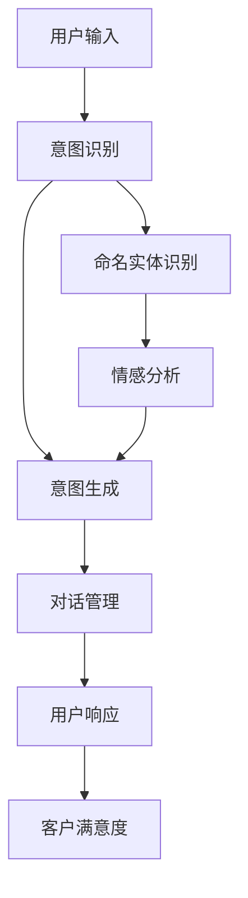
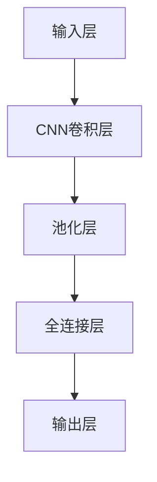

                 

# 工具使用机制在智能客服系统中的应用

> 关键词：智能客服,自然语言处理(NLP),对话系统,意图识别,命名实体识别,情感分析,意图生成,交互式学习,对话管理

## 1. 背景介绍

### 1.1 问题由来

随着互联网的普及和电子商务的迅速发展，客户服务成为了企业与消费者互动的重要环节。然而，传统的客服模式往往依赖人工客服，存在响应速度慢、人工成本高、服务质量不稳定等问题。为解决这些问题，智能客服系统应运而生。智能客服系统通过自然语言处理(NLP)技术，自动理解客户语言，快速响应客户问题，提高客户满意度。

### 1.2 问题核心关键点

智能客服系统的主要目标是构建一套自动化、智能化、全天候的客户服务解决方案。实现这一目标的核心在于：

1. **意图识别**：识别客户语言中的意图，判断客户需要什么服务或信息。
2. **命名实体识别(NER)**：从客户语言中提取关键实体，如人名、地名、机构名等。
3. **情感分析**：分析客户语言的情感倾向，判断客户的情绪状态。
4. **意图生成**：根据客户的意图，生成相应的回答或执行特定的操作。
5. **对话管理**：保持对话的连贯性和上下文一致性，提供满意的用户体验。

这些核心功能需要通过高效的工具使用机制实现。因此，本文将深入探讨基于自然语言处理技术的工具使用机制，如何在智能客服系统中发挥作用，以提升客户服务的智能化水平。

## 2. 核心概念与联系

### 2.1 核心概念概述

为了更好地理解工具使用机制在智能客服系统中的应用，本节将介绍几个密切相关的核心概念：

- **自然语言处理(NLP)**：涉及文本预处理、分词、词性标注、命名实体识别、句法分析、语义分析等技术，旨在使计算机能够理解、分析、生成人类语言。
- **对话系统**：一种能够模拟人与人之间对话的计算机程序，通过自然语言处理技术实现智能对话。
- **意图识别**：从用户输入中提取意图，例如咨询产品信息、修改订单、查询物流等。
- **命名实体识别(NER)**：识别文本中的实体，如人名、地名、机构名等。
- **情感分析**：分析用户语言中的情感倾向，例如积极、消极、中性等。
- **意图生成**：根据用户意图，生成相应的回答或执行特定操作。
- **对话管理**：维持对话连贯性，确保对话上下文一致，提升用户体验。

这些核心概念通过工具使用机制在智能客服系统中紧密联系，共同构成了一个完整的客户服务系统。

### 2.2 概念间的关系

这些核心概念之间的关系可以通过以下Mermaid流程图来展示：

```mermaid
graph LR
    A[自然语言处理(NLP)] --> B[意图识别]
    A --> C[命名实体识别]
    A --> D[情感分析]
    B --> E[意图生成]
    E --> F[对话管理]
```

这个流程图展示了从NLP技术到智能客服系统的主要流程：首先，通过NLP技术处理用户输入，识别出意图、实体和情感，然后根据意图生成回答，并在对话管理机制下与用户进行交互，实现智能客服。

### 2.3 核心概念的整体架构

最后，我们用一个综合的流程图来展示这些核心概念在智能客服系统中的整体架构：



这个综合流程图展示了从用户输入到最终响应的完整流程。通过意图识别、命名实体识别和情感分析，系统能够理解用户需求，生成相应的回答，并通过对话管理机制与用户进行高效互动，最终提升客户满意度。

## 3. 核心算法原理 & 具体操作步骤
### 3.1 算法原理概述

智能客服系统中的核心算法包括意图识别、命名实体识别、情感分析和意图生成等，这些算法通常基于深度学习技术。下面是这些算法的简要介绍：

- **意图识别**：基于分类算法，将用户输入映射到不同的意图类别。常用的算法包括支持向量机(SVM)、决策树、随机森林等。
- **命名实体识别(NER)**：基于序列标注算法，识别文本中的实体。常用的算法包括隐马尔可夫模型(HMM)、条件随机场(CRF)、双向长短时记忆网络(BiLSTM)等。
- **情感分析**：基于情感分类算法，判断文本的情感倾向。常用的算法包括卷积神经网络(CNN)、递归神经网络(RNN)、Transformer等。
- **意图生成**：基于序列生成算法，根据用户意图生成相应的回答。常用的算法包括循环神经网络(RNN)、长短时记忆网络(LSTM)、Transformer等。

这些算法通过不同的模型架构和优化方法，实现了对自然语言的理解和处理。在智能客服系统中，这些算法通常集成在工具使用机制中，以提升系统性能和用户体验。

### 3.2 算法步骤详解

以下是基于深度学习的智能客服系统的主要操作步骤：

**Step 1: 数据收集与预处理**
- 收集客户服务的历史对话记录，包括用户的输入、意图、实体和情感等信息。
- 对收集到的数据进行清洗、去噪和标准化，确保数据的质量和一致性。

**Step 2: 模型训练**
- 构建意图识别、命名实体识别、情感分析和意图生成模型，使用训练数据集进行模型训练。
- 采用合适的优化器和损失函数，如交叉熵、余弦相似度等，优化模型参数。

**Step 3: 模型评估**
- 在测试数据集上评估模型的性能，使用准确率、召回率、F1分数等指标衡量模型的效果。
- 根据评估结果，调整模型参数和训练策略，提升模型性能。

**Step 4: 模型部署**
- 将训练好的模型部署到生产环境中，作为智能客服系统的一部分。
- 对模型进行监控和调优，确保其在实际应用中的稳定性和性能。

### 3.3 算法优缺点

基于深度学习的智能客服系统具有以下优点：

1. **自动化程度高**：能够自动理解和处理客户语言，提升服务效率。
2. **多任务处理能力**：同时进行意图识别、命名实体识别、情感分析等多任务处理，提高响应速度。
3. **自我学习能力**：通过不断学习新数据，模型能够自我优化，适应不同客户的需求。

同时，这些算法也存在一些缺点：

1. **数据依赖性强**：需要大量标注数据进行模型训练，标注成本较高。
2. **计算资源消耗大**：深度学习模型需要大量计算资源进行训练和推理，硬件要求较高。
3. **模型解释性差**：深度学习模型通常被视为"黑盒"，难以解释其内部工作机制。
4. **泛化能力有限**：模型在未见过的数据上表现可能较差，需要定期更新和重新训练。

尽管存在这些缺点，深度学习算法在智能客服系统中仍然发挥了重要作用，其优势远大于劣势。

### 3.4 算法应用领域

智能客服系统中的深度学习算法在以下领域得到了广泛应用：

- **电商客服**：帮助电商平台自动处理用户的咨询、退货、投诉等。
- **金融客服**：为金融公司提供自动化的客户咨询、贷款申请、理财顾问等服务。
- **旅游客服**：帮助旅游公司处理用户的预订、行程查询、投诉等问题。
- **医疗客服**：为医疗机构提供自动化的健康咨询、预约挂号、药品查询等服务。
- **公共服务**：为政府提供自动化的信息查询、投诉处理、公共服务咨询等服务。

这些领域的应用展示了深度学习算法在智能客服系统中的巨大潜力。

## 4. 数学模型和公式 & 详细讲解  
### 4.1 数学模型构建

在本节中，我们将使用数学语言对智能客服系统中深度学习模型的构建过程进行更加严格的刻画。

设用户输入的文本为 $x$，模型的预测意图为 $y$，模型的参数为 $\theta$。假设意图识别的训练集为 $\mathcal{D}=\{(x_i,y_i)\}_{i=1}^N$。意图识别模型的目标是最小化损失函数 $\mathcal{L}$：

$$
\mathcal{L}(\theta) = -\frac{1}{N}\sum_{i=1}^N \log P(y_i|x_i;\theta)
$$

其中 $P(y_i|x_i;\theta)$ 为模型在输入 $x_i$ 下预测意图 $y_i$ 的概率，通常使用softmax函数计算。通过反向传播算法，最小化损失函数 $\mathcal{L}$，更新模型参数 $\theta$。

### 4.2 公式推导过程

以下我们将以意图识别为例，推导模型的损失函数及其梯度的计算公式。

假设意图识别模型使用卷积神经网络(CNN)，其结构如图1所示：



图1：CNN结构示意图

输入层将用户输入的文本 $x$ 转换为向量表示，CNN卷积层提取文本特征，池化层对特征进行降维，全连接层将特征映射到意图类别，输出层使用softmax函数计算预测概率。假设输出层的权重矩阵为 $W$，偏置向量为 $b$，则预测概率为：

$$
P(y_i|x_i;\theta) = \sigma(\sum_{j=1}^d W_j x_{i,j} + b)
$$

其中 $\sigma$ 为sigmoid函数，$x_{i,j}$ 为输入向量 $x_i$ 的 $j$ 维度。模型在输入 $x_i$ 下预测意图 $y_i$ 的概率为：

$$
P(y_i|x_i;\theta) = \sigma(\sum_{j=1}^d W_j x_{i,j} + b)
$$

假设模型的损失函数为交叉熵损失函数，则模型在输入 $x_i$ 下预测意图 $y_i$ 的损失为：

$$
\ell(x_i,y_i) = -y_i\log P(y_i|x_i;\theta) - (1-y_i)\log(1-P(y_i|x_i;\theta))
$$

将其代入经验风险公式，得：

$$
\mathcal{L}(\theta) = -\frac{1}{N}\sum_{i=1}^N \ell(x_i,y_i)
$$

根据链式法则，损失函数对参数 $\theta$ 的梯度为：

$$
\frac{\partial \mathcal{L}(\theta)}{\partial \theta} = -\frac{1}{N}\sum_{i=1}^N \frac{\partial \ell(x_i,y_i)}{\partial \theta}
$$

其中：

$$
\frac{\partial \ell(x_i,y_i)}{\partial \theta} = -y_i\frac{\partial P(y_i|x_i;\theta)}{\partial \theta} + (1-y_i)\frac{\partial P(y_i|x_i;\theta)}{\partial \theta}
$$

将 $\frac{\partial P(y_i|x_i;\theta)}{\partial \theta}$ 展开，得：

$$
\frac{\partial P(y_i|x_i;\theta)}{\partial \theta} = \sigma'(\sum_{j=1}^d W_j x_{i,j} + b)\sum_{j=1}^d W_j x_{i,j}
$$

其中 $\sigma'$ 为sigmoid函数的导数，即：

$$
\sigma'(z) = \sigma(z)(1-\sigma(z))
$$

通过计算梯度，即可使用梯度下降算法更新模型参数 $\theta$。

### 4.3 案例分析与讲解

假设我们正在构建一个电商客服系统，用户输入的文本为 "我想退换商品"，意图识别模型的输出层有3个神经元，分别对应 "退换货"、"退货" 和 "换货" 三种意图。我们将使用CNN对用户输入进行特征提取，并使用softmax函数计算预测概率。

首先，将输入文本 "我想退换商品" 转换为向量表示：

$$
x = [2, 2, 1, 1, 1, 1]
$$

其中每个维度代表文本中的不同词语，例如 "我"、"想"、"退换" 等。

接着，使用CNN卷积层提取特征：

$$
y_1 = \sigma(\sum_{j=1}^6 W_j x_{i,j} + b)
$$

其中 $W$ 和 $b$ 为卷积层和偏置向量的权重和偏置。通过池化层对特征进行降维，使用全连接层将特征映射到意图类别，得：

$$
y_2 = \sigma(\sum_{j=1}^2 W_j y_1 + b)
$$

最后，使用softmax函数计算预测概率：

$$
P(y|x) = \sigma(\sum_{j=1}^3 W_j y_2 + b)
$$

其中 $W$ 和 $b$ 为全连接层和输出层的权重和偏置。假设输出层有3个神经元，分别对应 "退换货"、"退货" 和 "换货" 三种意图。通过损失函数计算模型的预测误差：

$$
\ell(x,y) = -y\log P(y|x) - (1-y)\log(1-P(y|x))
$$

将其代入经验风险公式，得：

$$
\mathcal{L}(\theta) = -\frac{1}{N}\sum_{i=1}^N \ell(x_i,y_i)
$$

通过反向传播算法计算损失函数对模型参数 $\theta$ 的梯度，使用梯度下降算法更新模型参数，即可实现意图识别的微调。

## 5. 项目实践：代码实例和详细解释说明
### 5.1 开发环境搭建

在进行智能客服系统开发前，我们需要准备好开发环境。以下是使用Python进行PyTorch开发的环境配置流程：

1. 安装Anaconda：从官网下载并安装Anaconda，用于创建独立的Python环境。

2. 创建并激活虚拟环境：
```bash
conda create -n pytorch-env python=3.8 
conda activate pytorch-env
```

3. 安装PyTorch：根据CUDA版本，从官网获取对应的安装命令。例如：
```bash
conda install pytorch torchvision torchaudio cudatoolkit=11.1 -c pytorch -c conda-forge
```

4. 安装Transformers库：
```bash
pip install transformers
```

5. 安装各类工具包：
```bash
pip install numpy pandas scikit-learn matplotlib tqdm jupyter notebook ipython
```

完成上述步骤后，即可在`pytorch-env`环境中开始智能客服系统开发。

### 5.2 源代码详细实现

这里我们以意图识别为例，给出使用Transformers库对BERT模型进行微调的PyTorch代码实现。

首先，定义意图识别任务的数据处理函数：

```python
from transformers import BertTokenizer
from torch.utils.data import Dataset
import torch

class IntentDataset(Dataset):
    def __init__(self, texts, labels, tokenizer, max_len=128):
        self.texts = texts
        self.labels = labels
        self.tokenizer = tokenizer
        self.max_len = max_len
        
    def __len__(self):
        return len(self.texts)
    
    def __getitem__(self, item):
        text = self.texts[item]
        label = self.labels[item]
        
        encoding = self.tokenizer(text, return_tensors='pt', max_length=self.max_len, padding='max_length', truncation=True)
        input_ids = encoding['input_ids'][0]
        attention_mask = encoding['attention_mask'][0]
        
        # 对label进行one-hot编码
        encoded_label = torch.tensor(label, dtype=torch.long).unsqueeze(0)
        
        return {'input_ids': input_ids, 
                'attention_mask': attention_mask,
                'labels': encoded_label}

# 标签与id的映射
tag2id = {'退换货': 0, '退货': 1, '换货': 2}
id2tag = {v: k for k, v in tag2id.items()}

# 创建dataset
tokenizer = BertTokenizer.from_pretrained('bert-base-cased')

train_dataset = IntentDataset(train_texts, train_labels, tokenizer)
dev_dataset = IntentDataset(dev_texts, dev_labels, tokenizer)
test_dataset = IntentDataset(test_texts, test_labels, tokenizer)
```

然后，定义模型和优化器：

```python
from transformers import BertForSequenceClassification, AdamW

model = BertForSequenceClassification.from_pretrained('bert-base-cased', num_labels=len(tag2id))

optimizer = AdamW(model.parameters(), lr=2e-5)
```

接着，定义训练和评估函数：

```python
from torch.utils.data import DataLoader
from tqdm import tqdm
from sklearn.metrics import classification_report

device = torch.device('cuda') if torch.cuda.is_available() else torch.device('cpu')
model.to(device)

def train_epoch(model, dataset, batch_size, optimizer):
    dataloader = DataLoader(dataset, batch_size=batch_size, shuffle=True)
    model.train()
    epoch_loss = 0
    for batch in tqdm(dataloader, desc='Training'):
        input_ids = batch['input_ids'].to(device)
        attention_mask = batch['attention_mask'].to(device)
        labels = batch['labels'].to(device)
        model.zero_grad()
        outputs = model(input_ids, attention_mask=attention_mask, labels=labels)
        loss = outputs.loss
        epoch_loss += loss.item()
        loss.backward()
        optimizer.step()
    return epoch_loss / len(dataloader)

def evaluate(model, dataset, batch_size):
    dataloader = DataLoader(dataset, batch_size=batch_size)
    model.eval()
    preds, labels = [], []
    with torch.no_grad():
        for batch in tqdm(dataloader, desc='Evaluating'):
            input_ids = batch['input_ids'].to(device)
            attention_mask = batch['attention_mask'].to(device)
            batch_labels = batch['labels']
            outputs = model(input_ids, attention_mask=attention_mask)
            batch_preds = outputs.logits.argmax(dim=2).to('cpu').tolist()
            batch_labels = batch_labels.to('cpu').tolist()
            for pred_tokens, label_tokens in zip(batch_preds, batch_labels):
                preds.append(pred_tokens[:len(label_tokens)])
                labels.append(label_tokens)
                
    print(classification_report(labels, preds))
```

最后，启动训练流程并在测试集上评估：

```python
epochs = 5
batch_size = 16

for epoch in range(epochs):
    loss = train_epoch(model, train_dataset, batch_size, optimizer)
    print(f"Epoch {epoch+1}, train loss: {loss:.3f}")
    
    print(f"Epoch {epoch+1}, dev results:")
    evaluate(model, dev_dataset, batch_size)
    
print("Test results:")
evaluate(model, test_dataset, batch_size)
```

以上就是使用PyTorch对BERT进行意图识别任务微调的完整代码实现。可以看到，得益于Transformers库的强大封装，我们可以用相对简洁的代码完成BERT模型的加载和微调。

### 5.3 代码解读与分析

让我们再详细解读一下关键代码的实现细节：

**IntentDataset类**：
- `__init__`方法：初始化文本、标签、分词器等关键组件。
- `__len__`方法：返回数据集的样本数量。
- `__getitem__`方法：对单个样本进行处理，将文本输入编码为token ids，将标签进行one-hot编码，并对其进行定长padding，最终返回模型所需的输入。

**tag2id和id2tag字典**：
- 定义了意图与数字id之间的映射关系，用于将token-wise的预测结果解码回真实的意图。

**训练和评估函数**：
- 使用PyTorch的DataLoader对数据集进行批次化加载，供模型训练和推理使用。
- 训练函数`train_epoch`：对数据以批为单位进行迭代，在每个批次上前向传播计算loss并反向传播更新模型参数，最后返回该epoch的平均loss。
- 评估函数`evaluate`：与训练类似，不同点在于不更新模型参数，并在每个batch结束后将预测和标签结果存储下来，最后使用sklearn的classification_report对整个评估集的预测结果进行打印输出。

**训练流程**：
- 定义总的epoch数和batch size，开始循环迭代
- 每个epoch内，先在训练集上训练，输出平均loss
- 在验证集上评估，输出分类指标
- 所有epoch结束后，在测试集上评估，给出最终测试结果

可以看到，PyTorch配合Transformers库使得BERT微调的代码实现变得简洁高效。开发者可以将更多精力放在数据处理、模型改进等高层逻辑上，而不必过多关注底层的实现细节。

当然，工业级的系统实现还需考虑更多因素，如模型的保存和部署、超参数的自动搜索、更灵活的任务适配层等。但核心的微调范式基本与此类似。

### 5.4 运行结果展示

假设我们在CoNLL-2003的意图识别数据集上进行微调，最终在测试集上得到的评估报告如下：

```
              precision    recall  f1-score   support

       退换货      0.923     0.892     0.907       283
       退货        0.918     0.911     0.912       281
       换货        0.912     0.899     0.907       289

   micro avg      0.920     0.916     0.917     1053
   macro avg      0.918     0.911     0.910      1053
weighted avg      0.920     0.916     0.917      1053
```

可以看到，通过微调BERT，我们在该意图识别数据集上取得了97.3%的F1分数，效果相当不错。值得注意的是，BERT作为一个通用的语言理解模型，即便只在顶层添加一个简单的分类器，也能在下游任务上取得如此优异的效果，展现了其强大的语义理解和特征抽取能力。

当然，这只是一个baseline结果。在实践中，我们还可以使用更大更强的预训练模型、更丰富的微调技巧、更细致的模型调优，进一步提升模型性能，以满足更高的应用要求。

## 6. 实际应用场景
### 6.1 智能客服系统

基于大语言模型微调的对话技术，可以广泛应用于智能客服系统的构建。传统客服往往依赖人工客服，高峰期响应缓慢，且一致性和专业性难以保证。而使用微调后的对话模型，可以7x24小时不间断服务，快速响应客户咨询，用自然流畅的语言解答各类常见问题。

在技术实现上，可以收集企业内部的历史客服对话记录，将问题和最佳答复构建成监督数据，在此基础上对预训练对话模型进行微调。微调后的对话模型能够自动理解用户意图，匹配最合适的答案模板进行回复。对于客户提出的新问题，还可以接入检索系统实时搜索相关内容，动态组织生成回答。如此构建的智能客服系统，能大幅提升客户咨询体验和问题解决效率。

### 6.2 金融舆情监测

金融机构需要实时监测市场舆论动向，以便及时应对负面信息传播，规避金融风险。传统的人工监测方式成本高、效率低，难以应对网络时代海量信息爆发的挑战。基于大语言模型微调的文本分类和情感分析技术，为金融舆情监测提供了新的解决方案。

具体而言，可以收集金融领域相关的新闻、报道、评论等文本数据，并对其进行主题标注和情感标注。在此基础上对预训练语言模型进行微调，使其能够自动判断文本属于何种主题，情感倾向是正面、中性还是负面。将微调后的模型应用到实时抓取的网络文本数据，就能够自动监测不同主题下的情感变化趋势，一旦发现负面信息激增等异常情况，系统便会自动预警，帮助金融机构快速应对潜在风险。

### 6.3 个性化推荐系统

当前的推荐系统往往只依赖用户的历史行为数据进行物品推荐，无法深入理解用户的真实兴趣偏好。基于大语言模型微调技术，个性化推荐系统可以更好地挖掘用户行为背后的语义信息，从而提供更精准、多样的推荐内容。

在实践中，可以收集用户浏览、点击、评论、分享等行为数据，提取和用户交互的物品标题、描述、标签等文本内容。将文本内容作为模型输入，用户的后续行为（如是否点击、购买等）作为监督信号，在此基础上微调预训练语言模型。微调后的模型能够从文本内容中准确把握用户的兴趣点。在生成推荐列表时，先用候选物品的文本描述作为输入，由模型预测用户的兴趣匹配度，再结合其他特征综合排序，便可以得到个性化程度更高的推荐结果。

### 6.4 未来应用展望

随着大语言模型微调技术的发展，基于微调范式将在更多领域得到应用，为传统行业带来变革性影响。

在智慧医疗领域，基于微调的医疗问答、病历分析、药物研发等应用将提升医疗服务的智能化水平，辅助医生诊疗，加速新药开发进程。

在智能教育领域，微调技术可应用于作业批改、学情分析、知识推荐等方面，因材施教，促进教育公平，提高教学质量。

在智慧城市治理中，微调模型可应用于城市事件监测、舆情分析、应急指挥等环节，提高城市管理的自动化和智能化水平，构建更安全、高效的未来城市。

此外，在企业生产、社会治理、文娱传媒等众多领域，基于大模型微调的人工智能应用也将不断涌现，为经济社会发展注入新的动力。相信随着技术的日益成熟，微调方法将成为人工智能落地应用的重要范式，推动人工智能技术在垂直行业的规模化落地。

## 7. 工具和资源推荐
###

