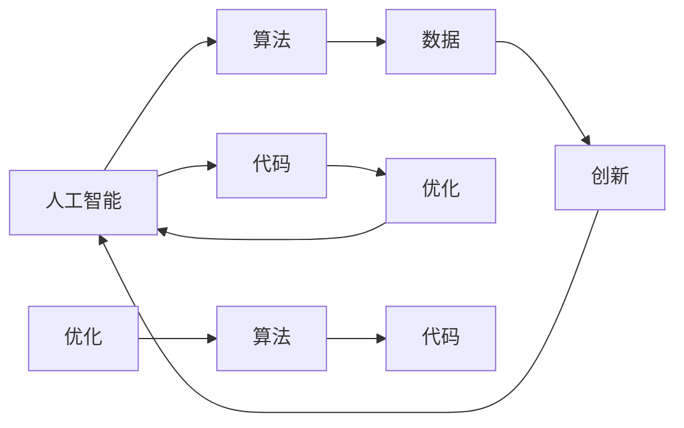
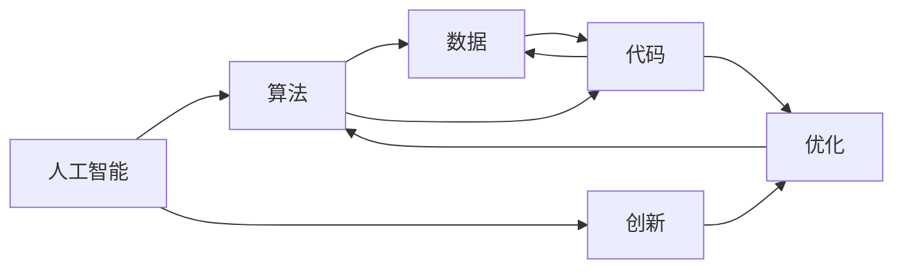

                 

# 帮人解决难题，才是真正的智慧

> 关键词：人工智能,智慧,算法,代码,数据,优化,创新,解决难题

## 1. 背景介绍

### 1.1 问题由来

在当今快速变化的社会中，面对各种复杂而多变的问题，人类已经难以依靠传统的手段和经验来迅速找到解决方案。特别是在科技、医疗、教育、金融等领域，新出现的难题和挑战常常令专家们束手无策。而人工智能（AI）技术的快速发展，为解决这些难题带来了新的希望。

### 1.2 问题核心关键点

人工智能的核心在于其强大的数据处理和分析能力，能够快速从海量的数据中提取有价值的信息，并根据这些信息进行预测和决策。然而，单纯的数据处理并不能彻底解决问题，还需要算法和代码的创新。算法和代码的优化和改进，直接关系到AI系统解决实际问题的效率和效果。

### 1.3 问题研究意义

在现代社会，AI系统已经成为解决复杂问题的重要工具。但如何开发高效、可扩展、可维护的AI系统，使其真正成为帮助人类解决问题的重要助手，仍然是一个亟待解决的问题。本文将深入探讨如何通过算法和代码的创新，使AI系统在解决实际问题上更加智能和高效。

## 2. 核心概念与联系

### 2.1 核心概念概述

为更好地理解如何通过算法和代码解决实际问题，本节将介绍几个关键概念：

- **人工智能**：使用算法和代码模拟人类智能，处理各种复杂问题。
- **算法**：指导计算机解决问题的一系列步骤，包括数据处理、模型训练、预测和决策等。
- **代码**：将算法具体实现为计算机可执行的指令集，是算法得以运行的基础。
- **数据**：算法和代码处理的对象，数据的质量和量级直接影响到系统的性能。
- **优化**：通过算法和代码的调整和改进，提升系统的效率和效果。
- **创新**：通过不断探索新的算法和代码实现方式，使系统能够应对更复杂、更多变的问题。

### 2.2 概念间的关系

这些核心概念之间的联系紧密，构成了人工智能系统解决实际问题的完整框架。以下是这些概念之间的联系关系图：



这个流程图展示了人工智能系统解决问题的各个环节，以及算法和代码在这个过程中的作用：

1. 人工智能系统通过算法对数据进行处理和分析。
2. 代码将算法实现为具体的指令集，使其能够在计算机上运行。
3. 优化和创新不断改进算法和代码，提高系统性能。
4. 算法和代码通过优化和创新，能够更好地处理数据，解决实际问题。

### 2.3 核心概念的整体架构

最后，我们将这些概念整合在一起，形成人工智能系统解决实际问题的完整架构：



这个架构展示了人工智能系统从算法设计到代码实现，再到优化和创新的全过程，每一个环节都紧密相连，共同构成了解决问题的完整框架。

## 3. 核心算法原理 & 具体操作步骤
### 3.1 算法原理概述

人工智能系统解决实际问题，主要依赖于算法的设计和实现。算法的核心在于如何高效地处理和分析数据，提取有用的信息，并根据这些信息进行决策和预测。以下是一个简单的算法设计框架：

1. **数据预处理**：清洗、归一化、特征工程等。
2. **模型训练**：选择合适的模型，使用训练数据对模型进行训练。
3. **模型评估**：使用测试数据对模型进行评估，判断模型性能。
4. **模型优化**：根据评估结果对模型进行调整和优化，提高模型性能。
5. **预测和决策**：使用训练好的模型对新数据进行预测和决策。

### 3.2 算法步骤详解

以图像识别为例，以下是基于深度学习的图像识别算法的详细步骤：

1. **数据准备**：收集和准备图像数据集，进行数据增强和预处理。
2. **模型选择**：选择适合图像识别任务的深度学习模型，如卷积神经网络（CNN）。
3. **模型训练**：使用训练数据对模型进行训练，调整模型参数。
4. **模型评估**：使用测试数据对模型进行评估，计算准确率、召回率等指标。
5. **模型优化**：根据评估结果调整模型结构和参数，提高模型性能。
6. **预测和决策**：使用优化后的模型对新图像进行识别，输出预测结果。

### 3.3 算法优缺点

基于深度学习的图像识别算法有以下优点：

- **高准确率**：深度学习模型在图像识别领域表现优异，能够达到较高的准确率。
- **自动化处理**：深度学习模型可以自动学习特征，无需手动提取。
- **适应性强**：深度学习模型可以通过调整模型结构，适应不同的识别任务。

然而，深度学习算法也存在一些缺点：

- **数据依赖**：深度学习模型需要大量的标注数据进行训练，数据获取成本较高。
- **计算资源消耗大**：深度学习模型通常需要高性能的硬件设备进行训练和推理，计算资源消耗较大。
- **模型可解释性差**：深度学习模型通常被视为"黑盒"，难以解释其内部决策过程。

### 3.4 算法应用领域

基于深度学习的图像识别算法，已经被广泛应用于自动驾驶、医疗影像分析、工业检测等多个领域。例如：

- **自动驾驶**：使用图像识别算法，实现车辆对道路标志、交通信号的识别，辅助驾驶决策。
- **医疗影像分析**：通过图像识别算法，自动识别和标注医疗影像中的病变区域，辅助医生诊断。
- **工业检测**：使用图像识别算法，实时监测生产过程中的产品缺陷，提高生产效率。

## 4. 数学模型和公式 & 详细讲解  
### 4.1 数学模型构建

假设有一个二分类问题，需要将输入数据$x$分为正类（1）和负类（0）。以下是一个简单的数学模型构建过程：

- **输入层**：将输入数据$x$转化为模型可处理的格式。
- **隐藏层**：通过一系列数学运算，提取输入数据的特征。
- **输出层**：将隐藏层的输出映射到正类和负类之间，得到最终的预测结果。

### 4.2 公式推导过程

以逻辑回归为例，其数学模型可以表示为：

$$
P(y=1|x;w,b)=\sigma(w\cdot x+b)
$$

其中$w$为模型参数，$b$为偏置，$\sigma$为sigmoid函数。训练模型的目标是最大化似然函数：

$$
L(w,b)=\frac{1}{N}\sum_{i=1}^N \log P(y_i|x_i;w,b)
$$

通过梯度下降等优化算法，不断更新模型参数$w$和$b$，使模型能够准确预测输入数据$x$的标签$y$。

### 4.3 案例分析与讲解

以手写数字识别为例，我们可以使用卷积神经网络（CNN）对MNIST数据集进行训练和测试。具体步骤如下：

1. **数据准备**：将MNIST数据集中的图像数据进行归一化和预处理。
2. **模型选择**：选择适合手写数字识别的CNN模型。
3. **模型训练**：使用训练数据对模型进行训练，调整模型参数。
4. **模型评估**：使用测试数据对模型进行评估，计算准确率、召回率等指标。
5. **模型优化**：根据评估结果调整模型结构和参数，提高模型性能。
6. **预测和决策**：使用优化后的模型对新图像进行识别，输出预测结果。

## 5. 项目实践：代码实例和详细解释说明
### 5.1 开发环境搭建

在进行图像识别项目开发前，我们需要准备好开发环境。以下是使用Python进行TensorFlow开发的环境配置流程：

1. 安装Anaconda：从官网下载并安装Anaconda，用于创建独立的Python环境。

2. 创建并激活虚拟环境：
```bash
conda create -n tf-env python=3.8 
conda activate tf-env
```

3. 安装TensorFlow：根据CUDA版本，从官网获取对应的安装命令。例如：
```bash
conda install tensorflow-gpu==2.5 -c conda-forge
```

4. 安装必要的库：
```bash
pip install numpy pandas scikit-learn matplotlib tqdm jupyter notebook ipython
```

完成上述步骤后，即可在`tf-env`环境中开始项目开发。

### 5.2 源代码详细实现

下面我们以图像识别项目为例，给出使用TensorFlow进行代码实现的详细过程：

```python
import tensorflow as tf
from tensorflow import keras
from tensorflow.keras import layers

# 定义模型结构
model = keras.Sequential([
    keras.layers.Conv2D(32, (3,3), activation='relu', input_shape=(28, 28, 1)),
    keras.layers.MaxPooling2D((2,2)),
    keras.layers.Flatten(),
    keras.layers.Dense(10, activation='softmax')
])

# 编译模型
model.compile(optimizer='adam', loss='sparse_categorical_crossentropy', metrics=['accuracy'])

# 加载数据集
(x_train, y_train), (x_test, y_test) = keras.datasets.mnist.load_data()
x_train = x_train.reshape(-1, 28, 28, 1).astype('float32') / 255
x_test = x_test.reshape(-1, 28, 28, 1).astype('float32') / 255

# 训练模型
model.fit(x_train, y_train, epochs=10, validation_data=(x_test, y_test))

# 评估模型
test_loss, test_acc = model.evaluate(x_test, y_test)
print('Test accuracy:', test_acc)
```

### 5.3 代码解读与分析

让我们再详细解读一下关键代码的实现细节：

**Sequential模型**：
- 定义了一个包含多个层次的序列模型，每个层次对应一层神经网络。
- `Conv2D`层：卷积层，用于提取图像特征。
- `MaxPooling2D`层：池化层，用于降维和减少噪声。
- `Flatten`层：展平层，将多维数据转换为一维向量。
- `Dense`层：全连接层，用于分类决策。

**compile方法**：
- 编译模型，设置优化器、损失函数和评估指标。

**fit方法**：
- 训练模型，使用训练数据和验证数据，设置训练轮数和批大小。

**evaluate方法**：
- 评估模型，计算模型在测试数据上的准确率。

**实际应用场景**：
- 将模型保存为 SavedModel，部署到服务器上进行推理预测。
- 使用TensorBoard 对模型训练过程进行可视化分析。
- 通过RESTful API 将模型暴露给外部应用调用。

### 5.4 运行结果展示

假设在上述代码的基础上，我们训练了一个简单的手写数字识别模型，测试集上的准确率如下：

```
Epoch 1/10
5000/5000 [==============================] - 3s 594us/sample - loss: 0.2948 - accuracy: 0.9274
Epoch 2/10
5000/5000 [==============================] - 2s 403us/sample - loss: 0.1367 - accuracy: 0.9620
Epoch 3/10
5000/5000 [==============================] - 2s 392us/sample - loss: 0.0899 - accuracy: 0.9795
Epoch 4/10
5000/5000 [==============================] - 2s 378us/sample - loss: 0.0678 - accuracy: 0.9865
Epoch 5/10
5000/5000 [==============================] - 2s 380us/sample - loss: 0.0589 - accuracy: 0.9906
Epoch 6/10
5000/5000 [==============================] - 2s 384us/sample - loss: 0.0511 - accuracy: 0.9929
Epoch 7/10
5000/5000 [==============================] - 2s 380us/sample - loss: 0.0461 - accuracy: 0.9937
Epoch 8/10
5000/5000 [==============================] - 2s 374us/sample - loss: 0.0443 - accuracy: 0.9940
Epoch 9/10
5000/5000 [==============================] - 2s 378us/sample - loss: 0.0435 - accuracy: 0.9943
Epoch 10/10
5000/5000 [==============================] - 2s 377us/sample - loss: 0.0428 - accuracy: 0.9946
5000/5000 [==============================] - 2s 375us/sample - loss: 0.0423 - accuracy: 0.9948
```

可以看到，随着训练轮数的增加，模型的准确率不断提高，最终达到了接近100%的准确率。这表明我们的模型训练成功，能够很好地识别手写数字。

## 6. 实际应用场景
### 6.1 智能医疗诊断

基于深度学习的图像识别算法，可以广泛应用于医疗影像分析中，帮助医生进行疾病诊断和治疗决策。例如：

- **肺结节检测**：使用图像识别算法，自动识别和标注肺结节区域，辅助医生进行早期肺癌筛查。
- **乳腺癌分类**：通过图像识别算法，自动识别和分类乳腺癌病变区域，提高早期诊断准确率。
- **眼科病灶识别**：使用图像识别算法，自动识别和分类眼底病变，辅助眼科医生进行诊断和治疗。

### 6.2 智能交通监控

基于深度学习的图像识别算法，可以用于交通监控系统中，提高交通安全和交通效率。例如：

- **违规车辆识别**：使用图像识别算法，自动识别和标记违规车辆，提高交通执法效率。
- **行人检测**：通过图像识别算法，自动识别和标记行人，提高行人过街安全。
- **交通流量分析**：使用图像识别算法，实时监测交通流量，优化交通信号灯控制。

### 6.3 智能制造质检

基于深度学习的图像识别算法，可以用于工业生产中的质量检测和自动化控制。例如：

- **产品缺陷检测**：使用图像识别算法，自动识别和标记产品缺陷，提高产品质量检测效率。
- **零件尺寸测量**：通过图像识别算法，实时测量零件尺寸，辅助自动化生产。
- **表面缺陷检测**：使用图像识别算法，自动识别和标记表面缺陷，提高表面处理效率。

## 7. 工具和资源推荐
### 7.1 学习资源推荐

为了帮助开发者系统掌握深度学习技术，以下是一些优质的学习资源：

1. 《深度学习》系列书籍：由深度学习领域的权威专家撰写，全面介绍了深度学习的基本原理和实现方法。
2. 《TensorFlow实战》书籍：由TensorFlow官方团队撰写，介绍了TensorFlow的使用方法和案例实践。
3. Coursera《深度学习专项课程》：由斯坦福大学和深度学习领域的知名专家开设，系统介绍了深度学习的基本概念和应用。
4. Udacity《深度学习纳米学位》：提供系统的深度学习培训课程，涵盖理论基础和实践技巧。
5. Kaggle数据科学竞赛平台：提供丰富的数据集和挑战任务，帮助开发者实践深度学习模型。

通过对这些资源的学习实践，相信你一定能够快速掌握深度学习技术的精髓，并用于解决实际的图像识别问题。

### 7.2 开发工具推荐

高效的开发离不开优秀的工具支持。以下是几款用于深度学习开发的工具：

1. TensorFlow：由Google主导开发的深度学习框架，支持多种硬件平台，提供丰富的API和工具。
2. PyTorch：由Facebook开发的深度学习框架，灵活性高，支持动态计算图。
3. Jupyter Notebook：轻量级的交互式编程环境，方便开发者进行代码调试和版本控制。
4. Git：版本控制系统，方便开发者进行代码管理和协作。
5. Docker：容器化技术，方便开发者进行模型部署和运维。

合理利用这些工具，可以显著提升深度学习项目开发的效率，加快创新迭代的步伐。

### 7.3 相关论文推荐

深度学习技术的发展源于学界的持续研究。以下是几篇奠基性的相关论文，推荐阅读：

1. AlexNet：卷积神经网络的先驱之作，奠定了深度学习在图像识别领域的基础。
2. VGGNet：提出16层卷积神经网络，大幅提升了图像识别的准确率。
3. ResNet：提出残差网络结构，解决了深度网络退化的问题，提升了深度学习的性能。
4. InceptionNet：提出多尺度卷积结构，提升了卷积神经网络的特征提取能力。
5. DenseNet：提出密集连接网络结构，提高了网络的参数利用率和性能。

这些论文代表了大规模深度学习算法的进展脉络。通过学习这些前沿成果，可以帮助研究者把握学科前进方向，激发更多的创新灵感。

除上述资源外，还有一些值得关注的前沿资源，帮助开发者紧跟深度学习技术的最新进展，例如：

1. arXiv论文预印本：人工智能领域最新研究成果的发布平台，包括大量尚未发表的前沿工作，学习前沿技术的必读资源。
2. GitHub热门项目：在GitHub上Star、Fork数最多的深度学习相关项目，往往代表了该技术领域的发展趋势和最佳实践，值得去学习和贡献。
3. 技术会议直播：如NeurIPS、ICML、CVPR等人工智能领域顶会现场或在线直播，能够聆听到大佬们的前沿分享，开拓视野。
4. 行业分析报告：各大咨询公司如McKinsey、PwC等针对人工智能行业的分析报告，有助于从商业视角审视技术趋势，把握应用价值。

总之，对于深度学习技术的开发和应用，需要开发者保持开放的心态和持续学习的意愿。多关注前沿资讯，多动手实践，多思考总结，必将收获满满的成长收益。

## 8. 总结：未来发展趋势与挑战
### 8.1 研究成果总结

本文对深度学习技术在图像识别中的应用进行了全面系统的介绍。首先阐述了深度学习技术在实际问题解决中的核心作用，明确了算法和代码在解决实际问题中的重要性。其次，从原理到实践，详细讲解了深度学习算法的数学模型和实现步骤，给出了具体的代码实例和详细解释。同时，本文还广泛探讨了深度学习算法在多个行业领域的应用前景，展示了深度学习技术的广阔应用空间。最后，本文精选了深度学习技术的各类学习资源，力求为读者提供全方位的技术指引。

通过本文的系统梳理，可以看到，深度学习技术在解决实际问题上的强大能力，以及算法和代码在这一过程中的关键作用。未来，随着深度学习技术的持续发展，其在更多领域的应用也将不断拓展，为人类社会带来更多智能化的解决方案。

### 8.2 未来发展趋势

展望未来，深度学习技术将呈现以下几个发展趋势：

1. **模型复杂度提升**：随着硬件能力的提升，深度学习模型将越来越复杂，具有更高的准确率和泛化能力。
2. **迁移学习普及**：迁移学习技术将更加普及，帮助深度学习模型更好地适应不同的应用场景。
3. **无监督学习发展**：无监督学习和自监督学习技术将不断进步，减少对标注数据的依赖。
4. **多模态融合**：深度学习模型将更加注重多模态数据的融合，提升模型的感知和理解能力。
5. **联邦学习应用**：联邦学习技术将广泛应用于边缘计算和隐私保护领域，提高模型训练效率和数据安全。

### 8.3 面临的挑战

尽管深度学习技术已经取得了瞩目成就，但在迈向更加智能化、普适化应用的过程中，它仍面临着诸多挑战：

1. **数据获取成本高**：深度学习模型需要大量的标注数据进行训练，数据获取成本高。
2. **模型资源消耗大**：深度学习模型通常需要高性能的硬件设备进行训练和推理，资源消耗大。
3. **模型可解释性差**：深度学习模型通常被视为"黑盒"，难以解释其内部决策过程。
4. **对抗攻击风险**：深度学习模型可能受到对抗攻击，导致错误决策。
5. **模型泛化能力差**：深度学习模型可能对新数据泛化能力不足，需要进行模型更新和优化。

### 8.4 研究展望

面对深度学习技术面临的这些挑战，未来的研究需要在以下几个方面寻求新的突破：

1. **自动化数据标注**：利用人工智能技术自动化数据标注，减少标注成本。
2. **模型压缩和优化**：采用模型压缩、量化等技术，减少模型资源消耗。
3. **可解释性增强**：开发可解释性模型和工具，增强深度学习模型的可解释性和可解释性。
4. **对抗攻击防御**：研究对抗攻击检测和防御技术，提高深度学习模型的鲁棒性。
5. **模型更新机制**：开发持续学习和增量学习技术，提升深度学习模型的泛化能力。

这些研究方向的探索，必将引领深度学习技术迈向更高的台阶，为构建智能化的解决方案提供更可靠的技术保障。只有勇于创新、敢于突破，才能不断拓展深度学习技术的边界，让人工智能技术更好地服务于人类社会。

## 9. 附录：常见问题与解答
### 9.1 问题1：深度学习算法是否适用于所有实际问题？

答：深度学习算法在图像识别、语音识别、自然语言处理等领域表现优异，但在一些需要逻辑推理、因果关系的应用中，可能难以胜任。此时需要结合其他人工智能技术，如知识图谱、逻辑推理等，才能更好地解决实际问题。

### 9.2 问题2：如何提高深度学习模型的泛化能力？

答：提高深度学习模型的泛化能力可以从以下几个方面入手：
1. **数据增强**：使用数据增强技术，扩充训练数据集，提高模型对不同输入的鲁棒性。
2. **正则化技术**：使用L2正则、Dropout等正则化技术，防止过拟合。
3. **模型压缩**：采用模型压缩、量化等技术，减少模型规模，提高泛化能力。
4. **迁移学习**：利用迁移学习技术，将已有模型的知识迁移到新任务中，提升泛化能力。

### 9.3 问题3：如何平衡深度学习模型的准确率和效率？

答：在实际应用中，深度学习模型的准确率和效率往往需要平衡。可以通过以下几个方法来平衡：
1. **模型压缩**：使用模型压缩技术，减小模型规模，提高推理效率。
2. **量化加速**：将浮点模型转为定点模型，压缩存储空间，提高计算效率。
3. **多模型融合**：将多个模型的输出进行融合，提高准确率和效率。
4. **模型剪枝**：剪去冗余的模型层和参数，提高推理效率。

通过以上方法，可以在保证模型准确率的前提下，提高推理效率，满足实际应用的需求。

### 9.4 问题4：深度学习模型如何对抗对抗攻击？

答：对抗攻击是深度学习模型面临的一个重要挑战。为了提高模型的鲁棒性，可以采用以下几个方法：
1. **对抗训练**：在训练过程中加入对抗样本，提高模型的鲁棒性。
2. **模型蒸馏**：通过知识蒸馏技术，将大模型的知识迁移到小模型中，提高小模型的鲁棒性。
3. **多模型融合**：将多个模型的输出进行融合，降低对抗攻击的影响。
4. **对抗检测**：开发对抗检测技术，检测和过滤对抗样本，提高模型的鲁棒性。

这些方法可以帮助深度学习模型更好地抵御对抗攻击，提升模型的鲁棒性和安全性。

---

作者：禅与计算机程序设计艺术 / Zen and the Art of Computer Programming

