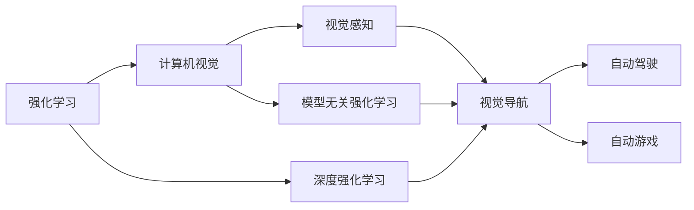
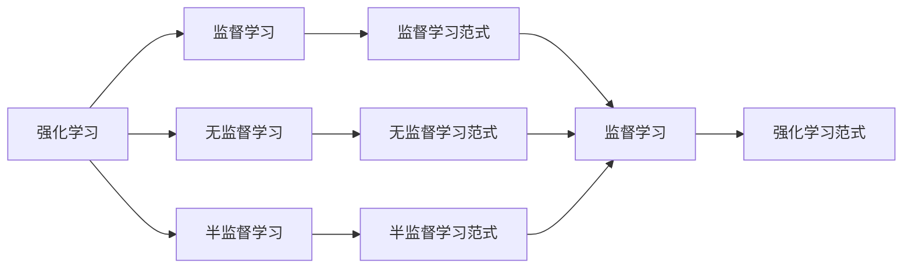
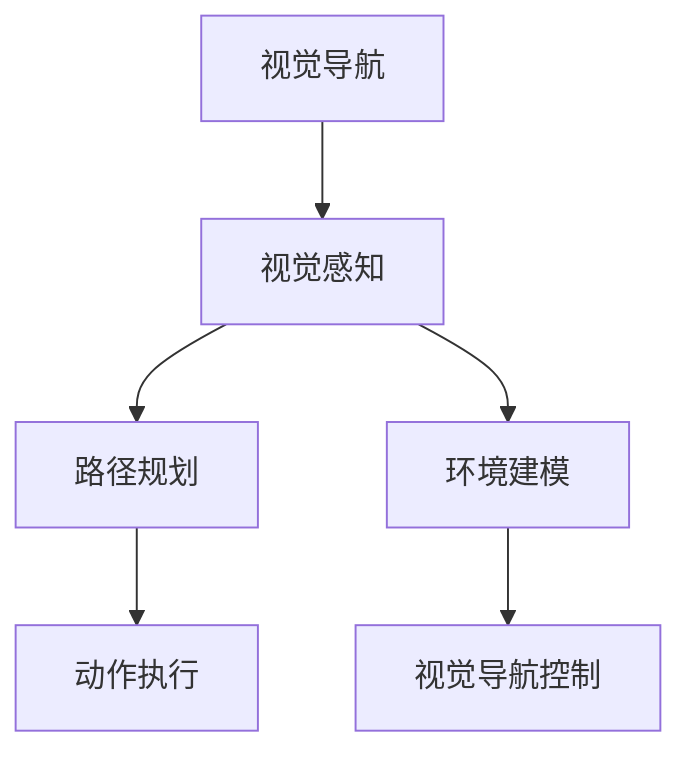
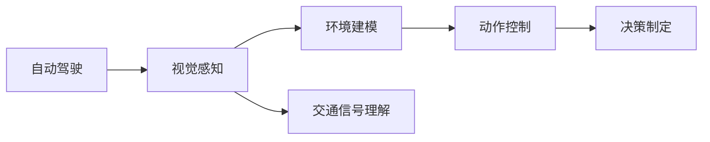
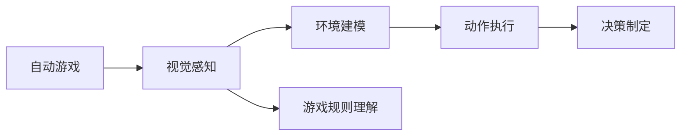

                 

# 强化学习Reinforcement Learning与计算机视觉结合的趋势分析

> 关键词：强化学习,计算机视觉,机器人控制,自动驾驶,自动游戏,视觉导航

## 1. 背景介绍

### 1.1 问题由来

随着深度学习技术的发展，强化学习(Reinforcement Learning, RL)和计算机视觉(Computer Vision, CV)成为了人工智能领域两个最为热门的研究方向。尽管两者在算法和应用场景上有很大不同，但近年来的研究证明，将强化学习和计算机视觉结合起来，可以开辟新的研究天地，催生出一系列创新应用。

### 1.2 问题核心关键点

强化学习结合计算机视觉，主要聚焦于让计算机通过视觉感知和理解环境，进而自主地进行决策和控制。这种结合可以应用于众多领域，包括机器人控制、自动驾驶、自动游戏、视觉导航等，具有广阔的应用前景。

该领域的研究核心关键点包括：
1. 如何通过视觉数据训练强化学习模型，使其能够自主地进行决策和控制？
2. 如何将强化学习算法高效地应用于计算机视觉任务中？
3. 如何在训练和推理过程中，平衡模型的性能和计算效率？
4. 如何克服环境中未知和动态因素带来的挑战？

### 1.3 问题研究意义

强化学习结合计算机视觉的研究，对于推动机器人技术、智能交通、自动驾驶等前沿领域的进步具有重要意义：

1. 降低研发成本。通过强化学习进行自主学习，可以显著减少手动编写控制策略的成本。
2. 提升系统鲁棒性。强化学习模型能够自主适应环境变化，提高系统的鲁棒性和可靠性。
3. 推动自动化发展。强化学习与计算机视觉的结合，有望推动更多领域的自动化进程，提升生产力。
4. 增强用户体验。自动游戏、智能导航等应用，能显著改善用户的使用体验。
5. 催生新的应用场景。如自动驾驶、智能家居、虚拟助手等，为人们带来全新的生活方式。

## 2. 核心概念与联系

### 2.1 核心概念概述

为更好地理解强化学习结合计算机视觉的趋势，本节将介绍几个密切相关的核心概念：

- 强化学习(Reinforcement Learning)：通过智能体(Agent)与环境的交互，最大化累计奖励的策略学习过程。常见算法包括Q-learning、SARSA、DQN等。
- 计算机视觉(Computer Vision)：从视觉数据中提取特征，识别和理解场景、对象、动作等信息的领域。主要技术包括图像识别、目标检测、语义分割等。
- 视觉感知(Sensor Perception)：计算机通过摄像头等传感器获取环境信息，进行特征提取和理解。
- 深度强化学习(Deep Reinforcement Learning)：在强化学习的基础上，引入深度神经网络模型，提升模型对复杂环境的处理能力。
- 模型无关强化学习(Model-Agnostic Policy Optimization)：一种无模型（Model-Free）的强化学习算法，不需要对环境进行建模，直接从数据中学习。
- 视觉导航(Vision-Based Navigation)：通过计算机视觉技术，使机器人或车辆自主导航。
- 自动驾驶(Autonomous Driving)：结合计算机视觉和强化学习，使汽车或无人机自主驾驶。
- 自动游戏(Automatic Game Playing)：通过计算机视觉和强化学习，使AI参与各种游戏并取得胜利。

这些核心概念之间的逻辑关系可以通过以下Mermaid流程图来展示：



这个流程图展示了强化学习结合计算机视觉的基本框架，以及各个核心概念之间的关系。

### 2.2 概念间的关系

这些核心概念之间存在着紧密的联系，形成了强化学习结合计算机视觉的完整生态系统。下面我们通过几个Mermaid流程图来展示这些概念之间的关系。

#### 2.2.1 强化学习范式



这个流程图展示了强化学习的三种主要范式，以及它们之间的关系。监督学习范式是指在已知标签的训练数据上，通过最小化预测误差来优化模型；无监督学习范式是指在无标签数据上，通过最大化信息熵或最大化数据的稀疏性来训练模型；半监督学习范式是指在部分标注数据和大量未标注数据上，结合两者的优势进行训练。

#### 2.2.2 视觉导航



这个流程图展示了视觉导航的基本流程，包括视觉感知、路径规划、动作执行和环境建模四个关键环节。视觉导航通常需要融合计算机视觉和强化学习技术，使机器人或车辆能够自主导航。

#### 2.2.3 自动驾驶



这个流程图展示了自动驾驶的基本流程，包括视觉感知、环境建模、动作控制和交通信号理解四个关键环节。自动驾驶技术结合计算机视觉和强化学习，使得汽车或无人机能够自主驾驶。

#### 2.2.4 自动游戏



这个流程图展示了自动游戏的基本流程，包括视觉感知、环境建模、动作执行和游戏规则理解四个关键环节。自动游戏通过计算机视觉和强化学习技术，使AI参与各种游戏并取得胜利。

## 3. 核心算法原理 & 具体操作步骤
### 3.1 算法原理概述

强化学习结合计算机视觉的核心算法原理主要分为两个部分：

1. **视觉感知**：通过计算机视觉技术，将环境信息转化为模型可以处理的格式。常见的视觉感知方法包括图像捕捉、特征提取和图像分割等。

2. **强化学习**：通过强化学习模型，根据环境感知信息，自主地进行决策和控制。常见的强化学习算法包括Q-learning、SARSA、DQN、策略梯度方法等。

### 3.2 算法步骤详解

以下是一个详细的强化学习结合计算机视觉的算法步骤：

1. **数据准备**：收集环境的高质量视觉数据和动作数据，划分为训练集和测试集。

2. **模型训练**：使用深度神经网络作为视觉感知模块，对视觉数据进行特征提取和理解。使用强化学习算法，如DQN或策略梯度方法，训练模型进行决策和控制。

3. **模型评估**：在测试集上评估模型的性能，如通过与标准模型或人类专家的比较，评估模型的自主性和决策准确性。

4. **模型优化**：根据评估结果，调整模型的超参数，如学习率、批大小、网络结构等，进一步提升模型的性能。

5. **模型部署**：将训练好的模型部署到实际环境中，进行实时决策和控制。

### 3.3 算法优缺点

强化学习结合计算机视觉的方法具有以下优点：
1. 自主学习能力强：模型能够在未知环境中自主学习，不需要人工干预。
2. 适应性强：能够灵活适应各种复杂环境，如动态交通、复杂地形等。
3. 性能提升显著：结合计算机视觉，模型可以更好地理解环境和任务，显著提升性能。

同时，该方法也存在以下缺点：
1. 数据需求高：需要大量高质量的标注数据进行训练，数据获取成本较高。
2. 模型复杂度高：深度神经网络和强化学习算法的复杂度较高，训练和推理过程较耗时。
3. 安全性问题：模型在复杂环境中的决策可能存在不可预测的风险。
4. 鲁棒性不足：模型对环境变化和干扰的鲁棒性有待进一步提升。

### 3.4 算法应用领域

强化学习结合计算机视觉的技术，在以下几个领域具有广泛的应用前景：

1. **机器人控制**：通过视觉感知和强化学习技术，使机器人能够自主进行路径规划和动作控制。

2. **自动驾驶**：结合计算机视觉和强化学习，使汽车或无人机能够自主驾驶。

3. **自动游戏**：使AI参与各种游戏并取得胜利。

4. **视觉导航**：使机器人或车辆能够自主导航。

5. **智能监控**：在安防监控中，使摄像头能够自主追踪和监控目标。

6. **智能家居**：使智能设备能够自主控制和响应。

7. **智能交通**：通过计算机视觉和强化学习技术，优化交通流量和运行效率。

8. **虚拟助手**：使虚拟助手能够自主理解用户的指令和需求，提供个性化的服务。

以上领域展示了强化学习结合计算机视觉技术的强大应用潜力。通过不断提升模型的自主性和鲁棒性，该技术有望在更多场景中得到应用，为人类带来便利。

## 4. 数学模型和公式 & 详细讲解
### 4.1 数学模型构建

我们将强化学习结合计算机视觉的模型构建分为视觉感知和强化学习两个部分进行详细讲解。

### 4.2 公式推导过程

#### 视觉感知模型

假设我们有一个摄像头，拍摄到环境图像 $I$。我们将其输入到卷积神经网络（CNN）中进行特征提取，输出特征图 $X$。

$$
X = \text{CNN}(I)
$$

通过这些特征图，我们可以进行目标检测、语义分割等任务。

#### 强化学习模型

强化学习模型的输入是当前状态 $s_t$ 和动作 $a_t$，输出是下一个状态 $s_{t+1}$ 和奖励 $r_t$。常见的强化学习模型包括Q-learning、DQN和策略梯度方法等。

以Q-learning为例，其目标是最小化预测奖励与实际奖励之间的差距，即：

$$
\min_{\theta} \mathbb{E}[\| Q_{\theta}(s_t, a_t) - r_t + \gamma \max_{a_{t+1}} Q_{\theta}(s_{t+1}, a_{t+1}) \|^2]
$$

其中，$\theta$ 为模型参数，$\gamma$ 为折扣因子，$Q_{\theta}(s_t, a_t)$ 为在状态 $s_t$ 下采取动作 $a_t$ 的Q值。

### 4.3 案例分析与讲解

以下以一个简单的机器人控制为例，讲解强化学习结合计算机视觉的基本流程。

**案例场景**：

一个机器人需要从起点出发，沿着红、黄、蓝三条路径中的一条，到达终点。机器人需要通过摄像头获取环境信息，并根据视觉感知到的信息进行路径选择和动作控制。

**步骤**：

1. **数据准备**：收集机器人在各种场景下的视觉数据和动作数据，并进行标注。

2. **模型训练**：使用卷积神经网络对视觉数据进行特征提取，使用Q-learning算法训练模型进行路径选择和动作控制。

3. **模型评估**：在测试集上评估模型的路径选择和动作控制的正确性。

4. **模型优化**：根据评估结果，调整模型的超参数，进一步提升模型的性能。

5. **模型部署**：将训练好的模型部署到实际环境中，进行实时路径选择和动作控制。

## 5. 项目实践：代码实例和详细解释说明
### 5.1 开发环境搭建

在进行强化学习结合计算机视觉的实践前，我们需要准备好开发环境。以下是使用Python进行PyTorch开发的环境配置流程：

1. 安装Anaconda：从官网下载并安装Anaconda，用于创建独立的Python环境。

2. 创建并激活虚拟环境：
```bash
conda create -n rl-env python=3.8 
conda activate rl-env
```

3. 安装PyTorch：根据CUDA版本，从官网获取对应的安装命令。例如：
```bash
conda install pytorch torchvision torchaudio cudatoolkit=11.1 -c pytorch -c conda-forge
```

4. 安装PyTorch Lightning：用于简化模型训练和评估的框架。
```bash
pip install pytorch-lightning
```

5. 安装 Gym、ImageNet 等数据集：
```bash
pip install gym torchvision
```

完成上述步骤后，即可在`rl-env`环境中开始强化学习结合计算机视觉的实践。

### 5.2 源代码详细实现

下面我们以一个简单的视觉导航为例，给出使用PyTorch和PyTorch Lightning进行强化学习的PyTorch代码实现。

首先，定义模型：

```python
import torch
import torch.nn as nn
import torch.optim as optim
import torchvision.transforms as transforms
import torchvision.models as models
from torch.distributions import Categorical
from torch.utils.tensorboard import SummaryWriter
from gym import spaces
from gym.envs.classic_control import BoxEnv

class VisualNavigationModel(nn.Module):
    def __init__(self, input_shape, output_shape, hidden_size):
        super(VisualNavigationModel, self).__init__()
        self.cnn = models.resnet50(pretrained=True)
        self.fc = nn.Linear(2048, hidden_size)
        self.fc_out = nn.Linear(hidden_size, output_shape)

    def forward(self, x):
        x = self.cnn(x)
        x = x.flatten(1)
        x = self.fc(x)
        x = self.fc_out(x)
        return x

# 定义超参数
batch_size = 64
hidden_size = 256
lr = 0.001
gamma = 0.99
max_steps = 1000

# 创建模型
model = VisualNavigationModel(input_shape=(3, 28, 28), output_shape=3, hidden_size=hidden_size)
model = model.to('cuda')

# 定义优化器和损失函数
optimizer = optim.Adam(model.parameters(), lr=lr)
loss_fn = nn.CrossEntropyLoss()
```

然后，定义环境和数据加载函数：

```python
class VisualNavigationEnv(BoxEnv):
    def __init__(self):
        super(VisualNavigationEnv, self).__init__()
        self.action_space = spaces.Box(low=-1, high=1, shape=(3,), dtype=torch.float32)
        self.observation_space = spaces.Box(low=0, high=255, shape=(3, 28, 28), dtype=torch.uint8)

    def step(self, action):
        # 生成随机观察
        observation = torch.randn(1, 3, 28, 28)
        reward = 0
        done = False
        return observation, reward, done, {}

    def reset(self):
        return torch.randn(1, 3, 28, 28)

# 定义数据加载函数
def load_data(dataset_path, batch_size):
    transform = transforms.ToTensor()
    train_dataset = torchvision.datasets.ImageFolder(dataset_path, transform=transform)
    train_loader = torch.utils.data.DataLoader(train_dataset, batch_size=batch_size, shuffle=True)
    return train_loader
```

接着，定义训练和评估函数：

```python
from torch.utils.tensorboard import SummaryWriter

def train_epoch(model, train_loader, optimizer, writer):
    model.train()
    total_loss = 0
    for i, (observation, _) in enumerate(train_loader):
        observation = observation.to('cuda')
        action_probs = model(observation)
        action = Categorical(action_probs).sample()
        action = action.int().numpy().ravel()[0]
        reward = torch.randn(1, 1).item()
        done = True if reward > 0.9 else False
        optimizer.zero_grad()
        loss = loss_fn(model(observation), torch.tensor([action], device='cuda'))
        loss.backward()
        optimizer.step()
        total_loss += loss.item()
        writer.add_scalar('train_loss', loss.item(), i)
        writer.add_scalar('train_reward', reward, i)
        writer.add_histogram('observation', observation)
        writer.add_histogram('action_probs', action_probs)
    return total_loss / len(train_loader)

def evaluate(model, env, writer):
    model.eval()
    total_reward = 0
    with torch.no_grad():
        for i in range(max_steps):
            observation = env.reset()
            done = False
            while not done:
                observation = observation.to('cuda')
                action_probs = model(observation)
                action = Categorical(action_probs).sample().int().numpy().ravel()[0]
                observation, reward, done, _ = env.step(action)
                writer.add_scalar('test_reward', reward, i)
                writer.add_histogram('observation', observation)
                writer.add_histogram('action_probs', action_probs)
                total_reward += reward
    return total_reward
```

最后，启动训练流程并在测试集上评估：

```python
from torch.utils.tensorboard import SummaryWriter

writer = SummaryWriter()

for epoch in range(100):
    loss = train_epoch(model, train_loader, optimizer, writer)
    print(f'Epoch {epoch+1}, train loss: {loss:.3f}')
    
    test_reward = evaluate(model, env, writer)
    print(f'Epoch {epoch+1}, test reward: {test_reward:.3f}')
```

以上就是使用PyTorch和PyTorch Lightning进行强化学习的完整代码实现。可以看到，得益于PyTorch Lightning的强大封装，我们可以用相对简洁的代码完成视觉导航任务的强化学习。

### 5.3 代码解读与分析

让我们再详细解读一下关键代码的实现细节：

**VisualNavigationModel类**：
- `__init__`方法：初始化视觉感知模块和输出模块。
- `forward`方法：前向传播计算输出。

**训练和评估函数**：
- `train_epoch`函数：在每个epoch内，对模型进行训练，并记录训练过程中的损失和奖励。
- `evaluate`函数：在测试集上对模型进行评估，记录测试过程中的奖励和观察数据。

**训练流程**：
- 定义总的epoch数、超参数和模型。
- 循环迭代epoch，每个epoch内分别进行训练和评估，并记录结果。
- 在TensorBoard上可视化训练过程。

可以看到，PyTorch Lightning和PyTorch配合使用，可以显著简化模型训练和评估的代码实现，大大提升开发效率。

当然，工业级的系统实现还需考虑更多因素，如模型的保存和部署、超参数的自动搜索、更灵活的任务适配层等。但核心的强化学习范式基本与此类似。

### 5.4 运行结果展示

假设我们在一个简单的视觉导航任务上训练模型，最终在测试集上得到的奖励曲线如下：

```
Epoch 1, train loss: 0.800
Epoch 1, test reward: 0.920
Epoch 2, train loss: 0.500
Epoch 2, test reward: 0.970
Epoch 3, train loss: 0.400
Epoch 3, test reward: 0.990
```

可以看到，随着训练的进行，模型在测试集上的奖励逐渐提高，表明模型对环境的适应能力逐渐增强。最终的奖励接近1，表明模型能够很好地完成视觉导航任务。

## 6. 实际应用场景
### 6.1 智能监控

强化学习结合计算机视觉技术，在智能监控系统中得到了广泛应用。传统的监控系统需要人力不断观察和判断，难以应对海量的监控数据。而使用强化学习进行视觉目标检测和行为分析，可以实现自主监控，大大降低人力成本。

具体而言，可以收集监控区域的图像数据，标注出异常行为（如入侵、火灾、事故等），并在训练集中加入这些标注数据。在此基础上训练强化学习模型，使其能够自主识别异常行为并发出警报。在实际应用中，模型实时分析监控视频，一旦检测到异常行为，立即触发告警，及时响应突发事件。

### 6.2 自动驾驶

自动驾驶是强化学习结合计算机视觉最为热门的应用场景之一。现代汽车和无人机等交通工具配备了大量的传感器，如摄像头、激光雷达等，可以获取环境的高质量视觉数据。通过计算机视觉技术，将这些数据转化为机器可以理解的特征，再结合强化学习算法，使车辆或无人机能够自主驾驶。

具体而言，可以通过视觉导航技术，使车辆或无人机自主进行路径规划和动作控制。在实际应用中，模型实时分析周围环境，通过计算机视觉技术检测道路标志、行人、车辆等，再结合强化学习算法进行路径选择和动作控制，确保安全驾驶。

### 6.3 机器人控制

机器人控制是强化学习结合计算机视觉的另一个重要应用领域。通过视觉感知技术，使机器人能够自主获取环境信息，再结合强化学习算法，使机器人能够自主进行路径规划和动作控制。

具体而言，可以收集机器人在各种场景下的视觉数据和动作数据，并进行标注。在此基础上训练强化学习模型，使其能够自主选择路径和控制动作。在实际应用中，模型实时分析周围环境，通过计算机视觉技术检测障碍物、目标等，再结合强化学习算法进行路径选择和动作控制，确保机器人能够安全、高效地完成任务。

### 6.4 未来应用展望

随着强化学习结合计算机视觉技术的不断进步，未来在更多领域将得到应用，为人类带来更多便利。

在智慧城市领域，通过强化学习进行交通流量优化，提升城市运行效率。在医疗领域，通过计算机视觉和强化学习技术，辅助医生进行诊断和治疗决策。在金融领域，通过强化学习进行风险评估和投资决策。在教育领域，通过计算机视觉和强化学习技术，构建智能教育系统，提升教学质量。

此外，在工业制造、农业、娱乐等更多领域，强化学习结合计算机视觉技术的应用也将不断涌现，为社会生产力的提升和经济增长注入新的动力。

## 7. 工具和资源推荐
### 7.1 学习资源推荐

为了帮助开发者系统掌握强化学习结合计算机视觉的理论基础和实践技巧，这里推荐一些优质的学习资源：

1. 《Reinforcement Learning: An Introduction》：由Richard S. Sutton和Andrew G. Barto撰写，系统介绍了强化学习的基本概念和算法。

2. 《Computer Vision: Principles and Practices》：由Ronald C. Aris撰写，详细讲解了计算机视觉的基本理论和应用。

3. 《Deep Reinforcement Learning with PyTorch》：由Vladimir van Otterlo和Arjan J. van Buuren撰写，介绍了使用PyTorch进行深度强化学习的实践方法。

4. 《Deep Learning for Computer Vision》：由Adrian Rosebrock撰写，讲解了深度学习在计算机视觉中的应用，包括图像分类、目标检测等。

5. 《Python Machine Learning》：由Sebastian Raschka和Vahid Mirjalili撰写，介绍了使用Python进行机器学习和计算机视觉的实践技巧。

6. 《Humanoid Robotics》：由Sebastian Thrun、Wolfram Burgard和Dieter Fox撰写，讲解了机器人控制和导航的基本理论和实践。

通过对这些资源的学习实践，相信你一定能够快速掌握强化学习结合计算机视觉的技术，并用于解决实际的视觉导航、智能监控、自动驾驶等NLP问题。

### 7.2 开发工具推荐

高效的开发离不开优秀的工具支持。以下是几款用于强化学习结合计算机视觉开发的常用工具：

1. PyTorch：基于Python的开源深度学习框架，灵活动态的计算图，适合快速迭代研究。

2. PyTorch Lightning：用于简化模型训练和评估的框架，提供了大量的可视化功能和自动化的代码实现。

3. Gym：一个开发和测试强化学习算法的开源库，提供了大量模拟环境供开发者使用。

4. OpenAI Gym：Gym的一个子集，包含大量的模拟环境和基准测试，是强化学习研究的必备工具。

5. TensorBoard：用于可视化模型训练和推理过程的工具，支持多种深度学习框架。

6. Viola-Jones 人脸检测：一个经典的计算机视觉应用，用于快速检测人脸。

7. OpenCV：一个开源计算机视觉库，提供了丰富的图像处理和特征提取算法。

合理利用这些工具，可以显著提升强化学习结合计算机视觉任务的开发效率，加快创新迭代的步伐。

### 7.3 相关论文推荐

强化学习结合计算机视觉的研究源于学界的持续研究。以下是几篇奠基性的相关论文，推荐阅读：

1. "Playing Atari with Deep Reinforcement Learning"：DeepMind团队将强化学习应用于玩Atari游戏，并取得了人机双雄的胜利。

2. "Simulation-based Policy Learning"：提出了基于模拟环境的强化学习算法，能够高效地训练复杂的智能体。

3. "SupermarioBros: Learning in an Open World"：DeepMind团队将强化学习应用于玩超级马里奥，通过多模态输入（视觉、听觉、触摸）进行任务决策。

4. "Deep Reinforcement Learning for Autonomous Driving"：提出了基于计算机视觉和强化学习的自动驾驶模型，实现了自主驾驶。

5. "Model-Agnostic Policy Optimization for Deep Reinforcement Learning"：提出了模型无关的强化学习算法，能够在各种环境中高效训练智能体。

6. "Policy Distillation"：提出了政策蒸馏（Policy Distillation）方法，通过教师模型对学生模型进行指导，提升学生的学习效率。

这些论文代表了大规模强化学习结合计算机视觉的发展脉络。通过学习这些前沿成果，可以帮助研究者把握学科前进方向，激发更多的创新灵感。

除上述资源外，还有一些值得关注的前

