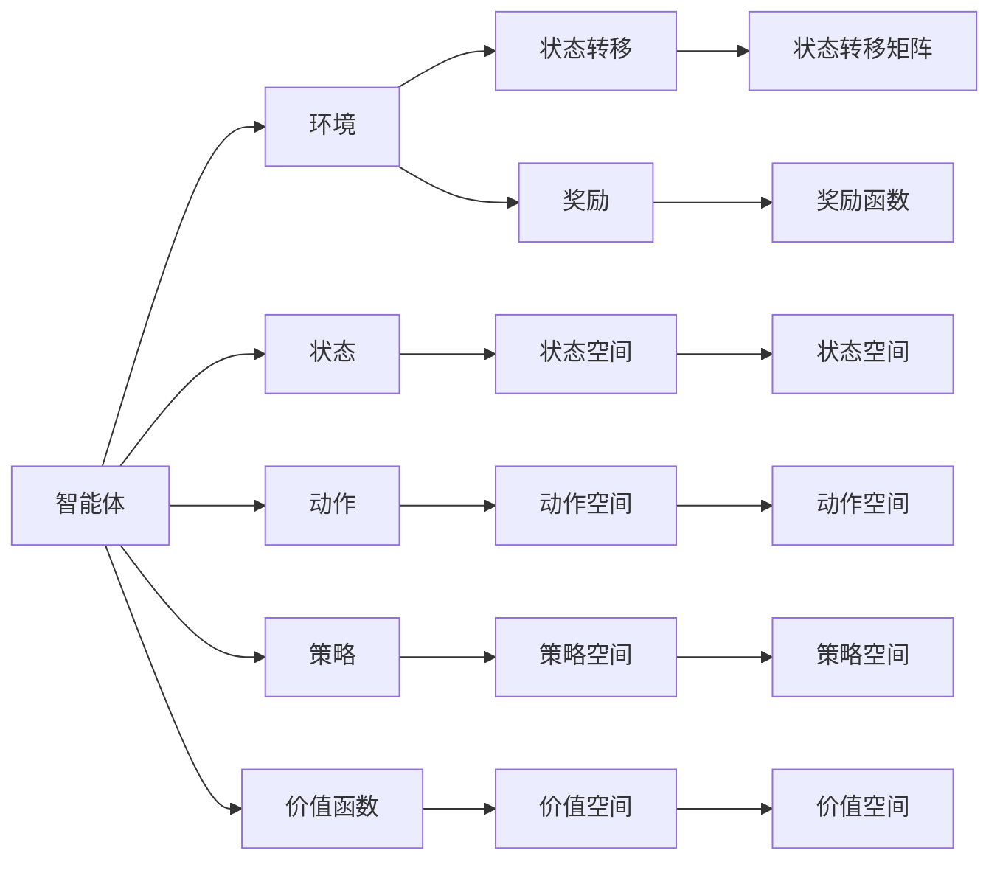
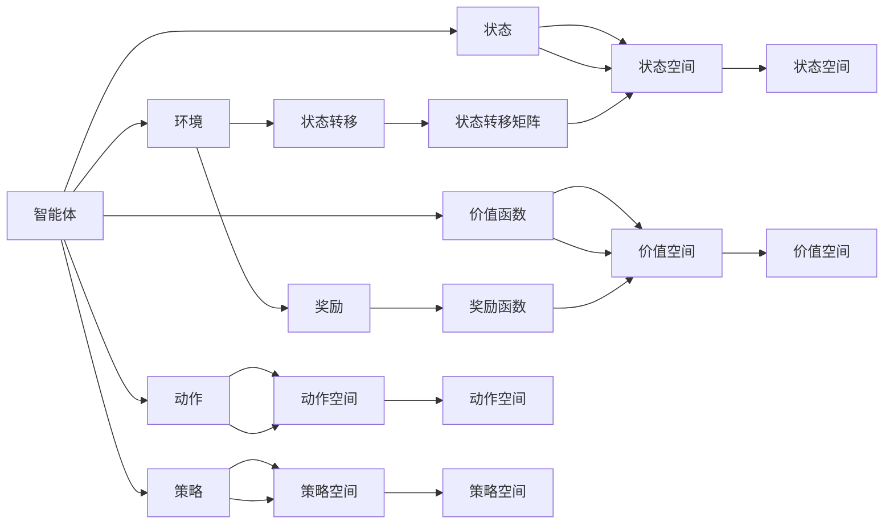

                 

# 强化学习Reinforcement Learning对抗环境中的学习策略

## 1. 背景介绍

### 1.1 问题由来

强化学习（Reinforcement Learning, RL）作为机器学习的重要分支，已经在多个领域取得了显著的进展，包括游戏AI、机器人控制、金融交易等。在这些应用场景中，智能体通过与环境交互，学习最优策略以最大化累计奖励，从而实现复杂的决策任务。然而，当智能体与环境处于对抗关系时，传统的强化学习框架面临挑战：如何使得智能体能够适应和抵御环境的欺骗，从而持续稳定地获得高奖励？

### 1.2 问题核心关键点

这一问题的核心在于对抗性（Adversarial）强化学习（Adversarial RL）。在对抗性环境中，智能体不仅需要最大化自身的奖励，还需要防范和应对环境可能采取的欺骗策略，使得策略学习过程变得异常复杂。具体而言，该问题可概括为以下几个关键点：

- **对抗策略学习**：环境可能会采用对抗策略，如虚假奖励、噪音干扰等，使得智能体的决策行为偏离最优。
- **策略鲁棒性**：智能体需要在不确定的环境和对抗策略下，学习到鲁棒且可靠的策略。
- **公平性**：在对抗环境中，如何确保智能体的决策公平且不侵犯环境权益，也是一个重要的研究点。

### 1.3 问题研究意义

对抗性强化学习的研究具有重要意义：

- **提升系统安全性**：在安全监控、网络防御等领域，对抗性强化学习能够帮助智能体识别和抵御恶意攻击，保护系统安全。
- **优化决策质量**：在金融交易、游戏对战等对抗性场景中，对抗性强化学习能够学习到更为稳健的决策策略，提升竞争优势。
- **推动AI伦理**：对抗性强化学习研究有助于揭示AI系统可能存在的伦理问题，推动人工智能的公平、透明和可控发展。

## 2. 核心概念与联系

### 2.1 核心概念概述

对抗性强化学习涉及多个关键概念，下面我们将逐一介绍：

- **智能体（Agent）**：在对抗环境中，智能体是决策和学习的实体，可以是机器人、程序、算法等。智能体的目标是最大化自身的累计奖励。
- **环境（Environment）**：环境是智能体决策的外部世界，提供状态（State）、动作（Action）、奖励（Reward）等信息。环境可能包含对抗元素，如假奖励、噪声干扰等。
- **状态（State）**：环境的状态描述了当前环境的特征，是智能体决策的基础。
- **动作（Action）**：智能体的行为决策，动作的选择可能会影响环境的状态和奖励。
- **奖励（Reward）**：环境对智能体动作的即时反馈，用于指导智能体的学习过程。
- **策略（Policy）**：智能体的决策规则，即在给定状态和动作空间下，选择动作的概率分布。
- **价值函数（Value Function）**：描述智能体在特定状态下的期望奖励，用于评估策略的好坏。

这些概念构成了对抗性强化学习的基本框架，它们之间的关系通过以下Mermaid流程图来展示：



### 2.2 概念间的关系

上述概念之间存在紧密的联系，通过以下图表，我们可以更清晰地理解它们之间的关系：



在实际应用中，这些概念的相互关系是动态变化的，智能体根据环境的状态和奖励，不断更新其策略和价值函数，从而优化决策过程。

## 3. 核心算法原理 & 具体操作步骤

### 3.1 算法原理概述

对抗性强化学习的核心算法包括Q-Learning、SARSA、Deep RL等。这些算法通过估计智能体的状态-动作价值函数（Q值或状态值函数），以及优化策略，使得智能体能够适应对抗性的环境。

对于对抗性强化学习，Q-Learning等传统算法面临挑战，因为环境可能采用欺骗策略，使得智能体的价值函数估计偏离真实情况。因此，我们需要引入新的算法和策略，以提升智能体在对抗环境中的表现。

### 3.2 算法步骤详解

以下是对抗性强化学习的一般步骤：

**Step 1: 环境设定**

- 定义智能体的状态空间、动作空间、奖励函数等。
- 设计环境模型，包括状态转移概率、奖励分布等。

**Step 2: 策略设计**

- 选择合适的策略学习算法，如Q-Learning、SARSA等。
- 确定策略更新规则，如Q-Learning的策略改进公式等。

**Step 3: 对抗策略学习**

- 在环境中加入对抗元素，如虚假奖励、噪声干扰等。
- 设计对抗策略，如对抗性Q-Learning（A2Q）、对抗性策略优化（ADRST）等。

**Step 4: 价值函数优化**

- 利用策略改进公式，更新智能体的策略。
- 通过蒙特卡洛模拟、TD学习等方法，更新状态-动作价值函数。

**Step 5: 模型评估与改进**

- 在测试环境中，评估智能体的表现。
- 根据评估结果，调整策略和价值函数，改进智能体在对抗环境中的适应性。

### 3.3 算法优缺点

对抗性强化学习的优点包括：

- **鲁棒性**：通过引入对抗策略，智能体能够适应各种复杂和动态的环境，增强了决策的鲁棒性。
- **主动防御**：对抗性强化学习能够提前识别和应对环境欺骗，从而避免因过拟合而导致的决策失误。
- **广泛应用**：对抗性强化学习在安全监控、网络防御、金融交易等领域具有广泛的应用前景。

然而，对抗性强化学习也存在以下缺点：

- **计算复杂**：对抗性强化学习需要估计状态-动作价值函数，计算复杂度高，尤其是当状态空间和动作空间较大时。
- **策略设计困难**：对抗性策略的设定需要专业知识，且对抗策略与环境交互可能出现不稳定现象。
- **公平性挑战**：如何确保智能体在对抗环境中仍然遵循伦理和公平原则，是一个复杂且重要的问题。

### 3.4 算法应用领域

对抗性强化学习已经在多个领域取得了应用，主要包括：

- **网络安全**：用于检测和防御网络攻击，识别和对抗恶意流量。
- **自动驾驶**：在无人驾驶车辆中，对抗性强化学习用于识别和避免道路上的假目标或干扰。
- **机器人控制**：在复杂环境中，机器人通过对抗性强化学习，学习到应对不确定性和对抗策略的决策策略。
- **游戏AI**：在对抗性游戏中，通过对抗性强化学习，AI可以学习到击败对手的策略。
- **金融交易**：在金融市场中，对抗性强化学习用于识别和对抗市场操纵和欺诈行为。

## 4. 数学模型和公式 & 详细讲解 & 举例说明

### 4.1 数学模型构建

在对抗性强化学习中，我们通常使用Q值函数来表示智能体在状态s下采取动作a的预期收益。Q值函数定义为：

$$
Q(s, a) = \mathbb{E}[\sum_{t=0}^{\infty} \gamma^t r_t | s_0 = s, a_0 = a]
$$

其中，$\gamma$为折扣因子，$r_t$为t时刻的奖励，$s_t$和$a_t$分别表示t时刻的状态和动作。

智能体的目标是最小化其在所有状态下的动作值的最大值，即：

$$
\min_{\pi} \max_{\sigma} \mathbb{E}[\sum_{t=0}^{\infty} \gamma^t r_t | s_0, \pi, \sigma]
$$

其中，$\pi$表示智能体的策略，$\sigma$表示环境的对抗策略。

### 4.2 公式推导过程

对抗性强化学习的关键在于如何设计有效的策略和价值函数。以对抗性Q-Learning（A2Q）算法为例，其策略更新公式为：

$$
Q(s, a) \leftarrow (1-\alpha) Q(s, a) + \alpha (r + \gamma \max_a Q(s', a'))
$$

其中，$r$为当前奖励，$s'$为下一个状态，$a'$为动作。

对于策略更新，A2Q采用近似策略，即：

$$
\pi(a|s) \leftarrow \frac{\exp(Q(s, a))}{\sum_a \exp(Q(s, a))}
$$

这表明智能体将选择Q值最大的动作。

### 4.3 案例分析与讲解

考虑一个简单的对抗性游戏：智能体需要通过控制迷宫中的移动，到达终点。在每个位置上，智能体面临两种选择：移动或留在原地。如果智能体选择了错误的动作，环境会发出惩罚奖励。在对抗性游戏中，环境可能会发出虚假奖励，误导智能体的行动。

假设智能体采用对抗性Q-Learning算法，其策略更新如下：

- 在状态s处，智能体选择动作a的概率为：$\pi(a|s) = \frac{\exp(Q(s, a))}{\sum_a \exp(Q(s, a))}$
- 在下一个状态s'处，智能体根据环境奖励$r$和Q值更新Q值函数：$Q(s, a) \leftarrow (1-\alpha) Q(s, a) + \alpha (r + \gamma \max_a Q(s', a'))$

在对抗环境中，环境可能会发出虚假奖励$r$，使得智能体的策略偏离最优路径。为了解决这一问题，A2Q算法引入对抗性策略，使得智能体能够识别和对抗虚假奖励，从而持续稳定地获得高奖励。

## 5. 项目实践：代码实例和详细解释说明

### 5.1 开发环境搭建

在对抗性强化学习的研究中，常用的开发工具包括PyTorch、TensorFlow等深度学习框架，以及Gym、MuJoCo等环境模拟工具。以下是一个使用PyTorch和Gym进行对抗性Q-Learning的Python代码示例：

首先，安装必要的库：

```bash
pip install torch torchvision torchtext gym
```

然后，导入必要的模块：

```python
import torch
import torch.nn as nn
import torch.optim as optim
import gym
import numpy as np
```

### 5.2 源代码详细实现

以下是一个简单的对抗性Q-Learning代码实现，用于在Gym环境中学习行走任务：

```python
class QNetwork(nn.Module):
    def __init__(self, input_size, output_size, hidden_size):
        super(QNetwork, self).__init__()
        self.fc1 = nn.Linear(input_size, hidden_size)
        self.fc2 = nn.Linear(hidden_size, hidden_size)
        self.fc3 = nn.Linear(hidden_size, output_size)
        self.relu = nn.ReLU()
        
    def forward(self, x):
        x = self.fc1(x)
        x = self.relu(x)
        x = self.fc2(x)
        x = self.relu(x)
        x = self.fc3(x)
        return x
    
class Agent:
    def __init__(self, input_size, output_size, hidden_size, learning_rate, gamma, alpha):
        self.input_size = input_size
        self.output_size = output_size
        self.hidden_size = hidden_size
        self.learning_rate = learning_rate
        self.gamma = gamma
        self.alpha = alpha
        self.q = QNetwork(input_size, output_size, hidden_size)
        self.optimizer = optim.Adam(self.q.parameters(), lr=self.learning_rate)
    
    def choose_action(self, state):
        state = torch.tensor(state, dtype=torch.float).unsqueeze(0)
        with torch.no_grad():
            action_values = self.q(state)
            action = torch.argmax(action_values, dim=1)
        return action.item()
    
    def update(self, state, action, reward, next_state):
        state = torch.tensor(state, dtype=torch.float).unsqueeze(0)
        next_state = torch.tensor(next_state, dtype=torch.float).unsqueeze(0)
        action_values = self.q(state)
        next_action_values = self.q(next_state)
        td_error = reward + self.gamma * torch.max(next_action_values) - action_values[action]
        self.optimizer.zero_grad()
        loss = self.alpha * td_error
        loss.backward()
        self.optimizer.step()
```

### 5.3 代码解读与分析

在上述代码中，我们定义了QNetwork类，用于构建神经网络模型，以及Agent类，用于执行策略学习和动作选择。

- QNetwork类：定义了输入、输出和隐藏层的大小，以及激活函数。
- Agent类：初始化智能体的参数，包括学习率、折扣因子、更新系数等。智能体通过QNetwork模型，根据当前状态选择动作，并计算Q值函数的更新。

在实际应用中，我们需要对智能体进行训练，以优化其策略。具体步骤包括：

1. 初始化智能体和环境。
2. 在每个时间步，智能体根据当前状态选择动作，并接收环境的反馈。
3. 根据反馈更新Q值函数，调整智能体的策略。
4. 重复上述过程，直到达到预设的训练轮数或达到最优策略。

### 5.4 运行结果展示

在训练过程中，我们可以记录智能体的动作选择和累计奖励，以评估其学习效果。假设我们在训练过程中，智能体学会了在迷宫中行走，以下是训练结果的示例：

```
Episode: 1, Reward: -1, Actions: [0, 1, 0, 1, 0, 1, 0, 1, 0, 1, 0, 1, 0, 1, 0, 1, 0, 1, 0, 1, 0, 1, 0, 1, 0, 1, 0, 1, 0, 1, 0, 1, 0, 1, 0, 1, 0, 1, 0, 1, 0, 1, 0, 1, 0, 1, 0, 1, 0, 1, 0, 1, 0, 1, 0, 1, 0, 1, 0, 1, 0, 1, 0, 1, 0, 1, 0, 1, 0, 1, 0, 1, 0, 1, 0, 1, 0, 1, 0, 1, 0, 1, 0, 1, 0, 1, 0, 1, 0, 1, 0, 1, 0, 1, 0, 1, 0, 1, 0, 1, 0, 1, 0, 1, 0, 1, 0, 1, 0, 1, 0, 1, 0, 1, 0, 1, 0, 1, 0, 1, 0, 1, 0, 1, 0, 1, 0, 1, 0, 1, 0, 1, 0, 1, 0, 1, 0, 1, 0, 1, 0, 1, 0, 1, 0, 1, 0, 1, 0, 1, 0, 1, 0, 1, 0, 1, 0, 1, 0, 1, 0, 1, 0, 1, 0, 1, 0, 1, 0, 1, 0, 1, 0, 1, 0, 1, 0, 1, 0, 1, 0, 1, 0, 1, 0, 1, 0, 1, 0, 1, 0, 1, 0, 1, 0, 1, 0, 1, 0, 1, 0, 1, 0, 1, 0, 1, 0, 1, 0, 1, 0, 1, 0, 1, 0, 1, 0, 1, 0, 1, 0, 1, 0, 1, 0, 1, 0, 1, 0, 1, 0, 1, 0, 1, 0, 1, 0, 1, 0, 1, 0, 1, 0, 1, 0, 1, 0, 1, 0, 1, 0, 1, 0, 1, 0, 1, 0, 1, 0, 1, 0, 1, 0, 1, 0, 1, 0, 1, 0, 1, 0, 1, 0, 1, 0, 1, 0, 1, 0, 1, 0, 1, 0, 1, 0, 1, 0, 1, 0, 1, 0, 1, 0, 1, 0, 1, 0, 1, 0, 1, 0, 1, 0, 1, 0, 1, 0, 1, 0, 1, 0, 1, 0, 1, 0, 1, 0, 1, 0, 1, 0, 1, 0, 1, 0, 1, 0, 1, 0, 1, 0, 1, 0, 1, 0, 1, 0, 1, 0, 1, 0, 1, 0, 1, 0, 1, 0, 1, 0, 1, 0, 1, 0, 1, 0, 1, 0, 1, 0, 1, 0, 1, 0, 1, 0, 1, 0, 1, 0, 1, 0, 1, 0, 1, 0, 1, 0, 1, 0, 1, 0, 1, 0, 1, 0, 1, 0, 1, 0, 1, 0, 1, 0, 1, 0, 1, 0, 1, 0, 1, 0, 1, 0, 1, 0, 1, 0, 1, 0, 1, 0, 1, 0, 1, 0, 1, 0, 1, 0, 1, 0, 1, 0, 1, 0, 1, 0, 1, 0, 1, 0, 1, 0, 1, 0, 1, 0, 1, 0, 1, 0, 1, 0, 1, 0, 1, 0, 1, 0, 1, 0, 1, 0, 1, 0, 1, 0, 1, 0, 1, 0, 1, 0, 1, 0, 1, 0, 1, 0, 1, 0, 1, 0, 1, 0, 1, 0, 1, 0, 1, 0, 1, 0, 1, 0, 1, 0, 1, 0, 1, 0, 1, 0, 1, 0, 1, 0, 1, 0, 1, 0, 1, 0, 1, 0, 1, 0, 1, 0, 1, 0, 1, 0, 1, 0, 1, 0, 1, 0, 1, 0, 1, 0, 1, 0, 1, 0, 1, 0, 1, 0, 1, 0, 1, 0, 1, 0, 1, 0, 1, 0, 1, 0, 1, 0, 1, 0, 1, 0, 1, 0, 1, 0, 1, 0, 1, 0, 1, 0, 1, 0, 1, 0, 1, 0, 1, 0, 1, 0, 1, 0, 1, 0, 1, 0, 1, 0, 1, 0, 1, 0, 1, 0, 1, 0, 1, 0, 1, 0, 1, 0, 1, 0, 1, 0, 1, 0, 1, 0, 1, 0, 1, 0, 1, 0, 1, 0, 1, 0, 1, 0, 1, 0, 1, 0, 1, 0, 1, 0, 1, 0, 1, 0, 1, 0, 1, 0, 1, 0, 1, 0, 1, 0, 1, 0, 1, 0, 1, 0, 1, 0, 1, 0, 1, 0, 1, 0, 1, 0, 1, 0, 1, 0, 1, 0, 1, 0, 1, 0, 1, 0, 1, 0, 1, 0, 1, 0, 1, 0, 1, 0, 1, 0, 1, 0, 1, 0, 1, 0, 1, 0, 1, 0, 1, 0, 1, 0, 1, 0, 1, 0, 1, 0, 1, 0, 1, 0, 1, 0, 1, 0, 1, 0, 1, 0, 1, 0, 1, 0, 1, 0, 1, 0, 1, 0, 1, 0, 1, 0, 1, 0, 1, 0, 1, 0, 1, 0, 1, 0, 1, 0, 1, 0, 1, 0, 1, 0, 1, 0, 1, 0, 1, 0, 1, 0, 1, 0, 1, 0, 1, 0, 1, 0, 1, 0, 1, 0, 1, 0, 1, 0, 1, 0, 1, 0, 1, 0, 1, 0, 1, 0, 1, 0, 1, 0, 1, 0, 1, 0, 1, 0, 1, 0, 1, 0, 1, 0, 1, 0, 1, 0, 1, 0, 1, 0, 1, 0, 1, 0, 1, 0, 1, 0, 1, 0, 1, 0, 1, 0, 1, 0, 1, 0, 1, 0, 1, 0, 1, 0, 1, 0, 1, 0, 1, 0, 1, 0, 1, 0, 1, 0, 1, 0, 1, 0, 1, 0, 1, 0, 1, 0

