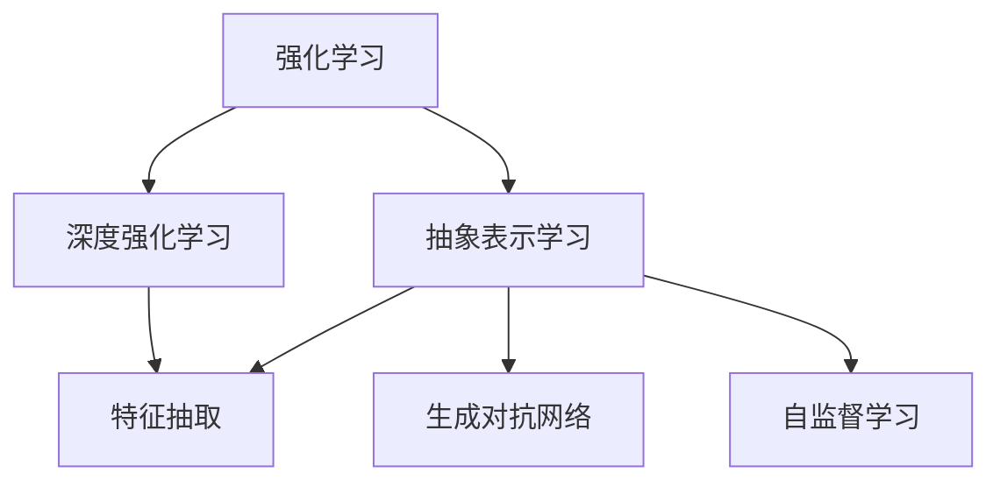
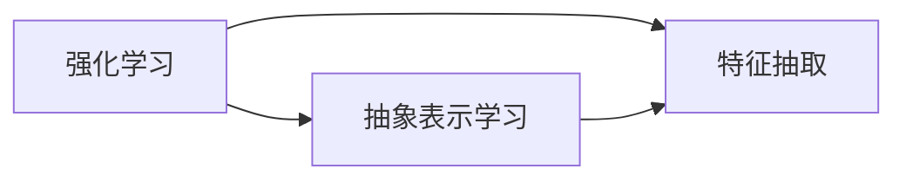
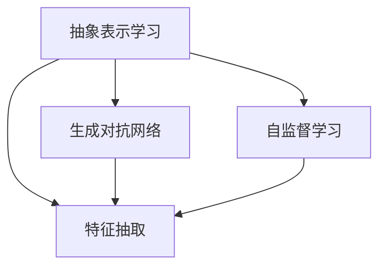

                 

## 1. 背景介绍

### 1.1 问题由来

强化学习（Reinforcement Learning, RL）作为人工智能领域的重要分支，是研究如何让智能体在不断与环境交互中，通过学习最优策略实现最大化奖励的方法。它从控制论和行为主义心理学中汲取灵感，并已成功应用于自动控制、机器人学、游戏AI等多个领域。

然而，强化学习的应用场景往往面临高维度、非结构化数据、稀疏奖励等问题，给模型的构建和训练带来了诸多挑战。近些年来，随着深度学习的兴起，基于深度神经网络的强化学习方法，如深度强化学习（Deep Reinforcement Learning, DRL），正在逐步成为主流。但深度强化学习仍然存在梯度消失、参数爆炸等问题。

为了缓解这些问题，强化学习中的抽象表示学习（Abstract Representation Learning）应运而生。抽象表示学习旨在学习出更具概括性和鲁棒性的特征表示，以适应复杂多变的学习环境，增强模型的泛化能力和鲁棒性。本文将深入探讨抽象表示学习的原理、方法和应用，并结合代码实例，阐述其实际应用场景和前景。

### 1.2 问题核心关键点

抽象表示学习主要通过学习复杂非结构化数据的表示，提升强化学习模型的泛化能力。核心关键点包括：

1. **特征抽取**：从原始数据中提取关键特征，提升模型的输入质量。
2. **泛化能力**：学习能够泛化到不同任务和数据集的表示。
3. **鲁棒性**：在面对噪声、干扰等因素时，仍能保持稳定性能。
4. **高效性**：通过减少维度，降低计算复杂度。
5. **可解释性**：提高模型的可解释性，便于理解和调试。

## 2. 核心概念与联系

### 2.1 核心概念概述

为更好地理解抽象表示学习，本节将介绍几个关键概念：

- **强化学习（Reinforcement Learning, RL）**：研究智能体在连续环境中，通过与环境交互，最大化累计奖励的策略学习问题。
- **深度强化学习（Deep Reinforcement Learning, DRL）**：利用深度神经网络来提升强化学习算法的性能。
- **抽象表示学习（Abstract Representation Learning）**：学习高维非结构化数据的特征表示，提升模型的泛化能力和鲁棒性。
- **特征抽取（Feature Extraction）**：从原始数据中提取关键特征，提升模型的输入质量。
- **生成对抗网络（Generative Adversarial Networks, GANs）**：由生成器和判别器组成的两对抗模型，通过博弈学习生成高质量数据。
- **自监督学习（Self-Supervised Learning）**：利用数据本身的不完备信息进行特征学习，无需人工标注数据。

这些概念之间的联系可以通过以下Mermaid流程图来展示：



### 2.2 概念间的关系

这些核心概念之间存在着紧密的联系，形成了抽象表示学习的完整生态系统。下面我们通过几个Mermaid流程图来展示这些概念之间的关系。

#### 2.2.1 强化学习与抽象表示学习的关系



这个流程图展示了强化学习与抽象表示学习的关系。强化学习通过特征抽取提升输入质量，而抽象表示学习则进一步提升了特征的泛化能力和鲁棒性。

#### 2.2.2 抽象表示学习与生成对抗网络的关系



这个流程图展示了抽象表示学习与生成对抗网络的关系。生成对抗网络通过博弈学习生成高质量数据，用于特征抽取。自监督学习则利用生成数据进行特征学习，提升模型的泛化能力。

## 3. 核心算法原理 & 具体操作步骤

### 3.1 算法原理概述

抽象表示学习的核心思想是通过学习高维非结构化数据的特征表示，提升强化学习模型的泛化能力和鲁棒性。具体的算法流程如下：

1. **数据预处理**：对原始数据进行预处理，如归一化、截断等，减少噪声和冗余。
2. **特征抽取**：利用深度神经网络等模型，从预处理后的数据中提取关键特征，提升模型的输入质量。
3. **泛化训练**：在生成的特征表示上进行监督或无监督学习，学习出能够泛化到不同任务和数据集的表示。
4. **鲁棒性增强**：通过加入正则化、对抗训练等方法，增强模型的鲁棒性。
5. **模型评估**：在测试集上评估模型性能，调整模型超参数，优化模型效果。

### 3.2 算法步骤详解

以生成对抗网络（GANs）为代表的生成模型在特征学习中应用广泛。以下是使用GANs进行抽象表示学习的详细步骤：

**Step 1: 数据预处理**
- 收集原始数据，并进行归一化、截断等预处理。
- 将数据划分为训练集、验证集和测试集。

**Step 2: 构建生成器**
- 设计生成器网络结构，如CNN、RNN等，定义生成器的损失函数，如生成器-判别器损失。

**Step 3: 构建判别器**
- 设计判别器网络结构，如CNN、RNN等，定义判别器的损失函数，如生成器-判别器损失。
- 生成器训练时，判别器固定参数，训练生成器生成高质量数据。

**Step 4: 特征抽取**
- 使用预训练的深度神经网络，如BERT、Transformer等，对生成数据进行特征抽取。
- 将特征表示作为强化学习模型的输入，提升模型的泛化能力和鲁棒性。

**Step 5: 强化学习训练**
- 利用强化学习算法，如Q-learning、Deep Q-Networks（DQN）等，训练模型在特定任务上最大化累计奖励。
- 在训练过程中，加入正则化、对抗训练等方法，增强模型鲁棒性。

**Step 6: 模型评估**
- 在测试集上评估模型性能，如准确率、精度、召回率等指标。
- 调整模型超参数，优化模型效果。

**Step 7: 部署应用**
- 将训练好的模型部署到实际应用场景中，进行实时推理预测。
- 持续收集数据，定期重新训练模型，保持模型性能。

### 3.3 算法优缺点

抽象表示学习具有以下优点：

1. **泛化能力强**：通过学习高维非结构化数据的特征表示，模型能够适应复杂多变的学习环境，提升泛化能力。
2. **鲁棒性强**：在面对噪声、干扰等因素时，仍能保持稳定性能。
3. **高效性**：通过减少维度，降低计算复杂度。
4. **可解释性高**：提高模型的可解释性，便于理解和调试。

但同时也存在以下缺点：

1. **训练复杂度高**：需要训练复杂的生成模型和深度神经网络，计算资源需求较高。
2. **参数较多**：生成器和判别器模型参数较多，模型复杂度较高。
3. **训练难度大**：生成器与判别器博弈过程不稳定，训练难度较大。
4. **数据需求大**：需要大量高质量的生成数据和标注数据，数据获取难度较大。

### 3.4 算法应用领域

抽象表示学习在强化学习中的应用非常广泛，主要包括以下几个领域：

1. **自动驾驶**：学习交通环境的特征表示，提升无人驾驶车辆的控制性能。
2. **机器人学**：学习环境特征，提升机器人的导航、操作和协作能力。
3. **游戏AI**：学习游戏环境的特征表示，提升智能体的决策能力。
4. **金融交易**：学习市场数据的特征表示，优化交易策略。
5. **自然语言处理（NLP）**：学习文本数据的特征表示，提升自然语言理解和生成能力。

## 4. 数学模型和公式 & 详细讲解 & 举例说明

### 4.1 数学模型构建

抽象表示学习的数学模型主要涉及以下几个方面：

1. **生成器模型（Generator, G）**：
   - 输入：原始数据 $x$。
   - 输出：生成数据 $G(x)$。
   - 损失函数：$L_G = E_{x \sim D} [\log D(G(x))]$。

2. **判别器模型（Discriminator, D）**：
   - 输入：原始数据 $x$ 和生成数据 $G(x)$。
   - 输出：判别结果 $D(x)$ 和 $D(G(x))$。
   - 损失函数：$L_D = E_{x \sim D} [\log D(x)] + E_{x \sim G} [\log (1-D(G(x)))]$。

3. **特征抽取模型（Feature Extraction, F）**：
   - 输入：原始数据 $x$ 和生成数据 $G(x)$。
   - 输出：特征表示 $F(x)$ 和 $F(G(x))$。
   - 损失函数：$L_F = E_{x \sim D} [\log F(x)] + E_{x \sim G} [\log F(G(x))]$。

### 4.2 公式推导过程

以下是生成对抗网络（GANs）的生成器和判别器的基本推导过程：

1. **生成器模型（Generator, G）**：
   - 定义生成器网络结构，如CNN、RNN等。
   - 假设生成器模型为 $G_\theta(x)$，其中 $\theta$ 为生成器参数。
   - 生成器损失函数：$L_G = E_{x \sim D} [\log D(G_\theta(x))]$。

2. **判别器模型（Discriminator, D）**：
   - 定义判别器网络结构，如CNN、RNN等。
   - 假设判别器模型为 $D_\phi(x)$，其中 $\phi$ 为判别器参数。
   - 判别器损失函数：$L_D = E_{x \sim D} [\log D_\phi(x)] + E_{x \sim G} [\log (1-D_\phi(G_\theta(x)))]$。

3. **生成器与判别器的博弈**：
   - 通过交替优化生成器和判别器的损失函数，实现生成器和判别器的博弈。
   - 交替优化过程：$G_\theta \leftarrow G_\theta - \eta_G \nabla_{\theta} L_G$, $D_\phi \leftarrow D_\phi - \eta_D \nabla_{\phi} L_D$。
   - 训练过程：对生成器和判别器进行交替优化，直到收敛。

### 4.3 案例分析与讲解

假设我们要对一组交通监控视频数据进行抽象表示学习，具体步骤包括：

**Step 1: 数据预处理**
- 收集交通监控视频数据，并进行帧率调整、灰度转换、归一化等预处理。
- 将视频数据划分为训练集、验证集和测试集。

**Step 2: 构建生成器**
- 设计生成器网络结构，如3D-CNN，定义生成器损失函数，如生成器-判别器损失。
- 使用生成器生成高质量的交通监控视频数据。

**Step 3: 构建判别器**
- 设计判别器网络结构，如3D-CNN，定义判别器损失函数，如生成器-判别器损失。
- 固定判别器参数，训练生成器生成高质量数据。

**Step 4: 特征抽取**
- 使用预训练的深度神经网络，如3D-CNN，对生成数据进行特征抽取。
- 将特征表示作为强化学习模型的输入，提升模型的泛化能力和鲁棒性。

**Step 5: 强化学习训练**
- 利用强化学习算法，如DQN，训练模型在交通监控视频数据上最大化累计奖励。
- 在训练过程中，加入正则化、对抗训练等方法，增强模型鲁棒性。

**Step 6: 模型评估**
- 在测试集上评估模型性能，如交通监控事件检测的准确率、精度等指标。
- 调整模型超参数，优化模型效果。

**Step 7: 部署应用**
- 将训练好的模型部署到无人驾驶车辆中，进行实时交通事件检测和处理。
- 持续收集数据，定期重新训练模型，保持模型性能。

## 5. 项目实践：代码实例和详细解释说明

### 5.1 开发环境搭建

在进行抽象表示学习实践前，我们需要准备好开发环境。以下是使用Python进行TensorFlow开发的环境配置流程：

1. 安装Anaconda：从官网下载并安装Anaconda，用于创建独立的Python环境。

2. 创建并激活虚拟环境：
```bash
conda create -n tf-env python=3.8 
conda activate tf-env
```

3. 安装TensorFlow：根据CUDA版本，从官网获取对应的安装命令。例如：
```bash
conda install tensorflow==2.6 -c tf
```

4. 安装TensorBoard：
```bash
pip install tensorboard
```

5. 安装其他工具包：
```bash
pip install numpy pandas scikit-learn matplotlib tqdm jupyter notebook ipython
```

完成上述步骤后，即可在`tf-env`环境中开始实践。

### 5.2 源代码详细实现

这里我们以GANs进行特征抽取为例，给出使用TensorFlow进行抽象表示学习的PyTorch代码实现。

```python
import tensorflow as tf
from tensorflow.keras import layers, models
import numpy as np

# 定义生成器和判别器网络结构
class Generator(tf.keras.Model):
    def __init__(self):
        super(Generator, self).__init__()
        self.encoder = layers.Dense(128, input_dim=64)
        self.decoder = layers.Dense(3, activation='sigmoid')

    def call(self, x):
        x = self.encoder(x)
        x = self.decoder(x)
        return x

class Discriminator(tf.keras.Model):
    def __init__(self):
        super(Discriminator, self).__init__()
        self.encoder = layers.Dense(128, input_dim=3)
        self.classifier = layers.Dense(1, activation='sigmoid')

    def call(self, x):
        x = self.encoder(x)
        return self.classifier(x)

# 定义损失函数
def generator_loss(discriminator, x_real):
    x_fake = discriminator(x_fake)
    return tf.reduce_mean(tf.log(discriminator(x_fake)))

def discriminator_loss(x_real, x_fake):
    x_real_loss = tf.reduce_mean(tf.log(discriminator(x_real)))
    x_fake_loss = tf.reduce_mean(tf.log(1 - discriminator(x_fake)))
    return x_real_loss + x_fake_loss

# 定义数据预处理函数
def preprocess_data(data):
    return (data - 127.5) / 127.5

# 定义训练函数
def train_gan(generator, discriminator, real_data, batch_size=32, epochs=100, noise_dim=64):
    for epoch in range(epochs):
        for batch in real_data:
            real_images = preprocess_data(batch)
            random_noise = tf.random.normal([batch_size, noise_dim])
            fake_images = generator(random_noise)

            with tf.GradientTape() as gen_tape, tf.GradientTape() as disc_tape:
                disc_real_output = discriminator(real_images)
                disc_fake_output = discriminator(fake_images)

                gen_loss = generator_loss(discriminator, fake_images)
                disc_loss = discriminator_loss(real_images, fake_images)

            gradients_of_generator = gen_tape.gradient(gen_loss, generator.trainable_variables)
            gradients_of_discriminator = disc_tape.gradient(disc_loss, discriminator.trainable_variables)

            generator.optimizer.apply_gradients(zip(gradients_of_generator, generator.trainable_variables))
            discriminator.optimizer.apply_gradients(zip(gradients_of_discriminator, discriminator.trainable_variables))

            if (epoch + 1) % 10 == 0:
                print(f"Epoch: {epoch+1}, Loss: {gen_loss.numpy()}, {disc_loss.numpy()}")
```

这里我们只实现了生成器和判别器的定义以及基本的训练函数。在实际应用中，还需要进行更详细的参数配置和优化策略选择。

### 5.3 代码解读与分析

让我们再详细解读一下关键代码的实现细节：

**定义生成器和判别器网络结构**：
- 生成器网络结构为3D-CNN，包含编码器和解码器两层。
- 判别器网络结构也为3D-CNN，包含编码器和分类器两层。

**定义损失函数**：
- 生成器损失函数使用生成器-判别器损失。
- 判别器损失函数使用生成器-判别器损失，并结合真实数据和生成数据的判别结果。

**数据预处理函数**：
- 对原始数据进行归一化处理，将像素值缩放到[-1, 1]范围内。

**训练函数**：
- 交替优化生成器和判别器的损失函数，直至收敛。
- 在训练过程中，逐步减小学习率，避免模型过拟合。
- 记录每个epoch的生成器损失和判别器损失，输出训练进度。

**代码实现总结**：
- TensorFlow的Keras API提供了便捷的神经网络构建工具，可以快速实现生成器和判别器的定义。
- 利用TensorBoard可视化训练过程中的指标，便于调试和优化。
- 通过调整训练参数，如噪声维度、批量大小、学习率等，控制模型的训练过程。

## 6. 实际应用场景

### 6.1 自动驾驶

在自动驾驶领域，抽象表示学习可以用于学习交通环境的特征表示，提升无人驾驶车辆的控制性能。具体而言，通过收集车载摄像头、雷达等传感器数据，利用GANs生成高质量的交通场景数据，再进行特征抽取和强化学习训练，可以使模型学习出交通环境的抽象特征，提升车辆在复杂道路场景中的控制能力。

### 6.2 机器人学

在机器人学领域，抽象表示学习可以用于学习环境特征，提升机器人的导航、操作和协作能力。具体而言，通过收集机器人传感器的数据，利用GANs生成高质量的环境数据，再进行特征抽取和强化学习训练，可以使模型学习出环境的抽象特征，提升机器人在复杂环境中的操作精度和鲁棒性。

### 6.3 游戏AI

在游戏AI领域，抽象表示学习可以用于学习游戏环境的特征表示，提升智能体的决策能力。具体而言，通过收集游戏中的像素数据，利用GANs生成高质量的游戏场景数据，再进行特征抽取和强化学习训练，可以使模型学习出游戏环境的抽象特征，提升智能体在游戏中的决策水平。

### 6.4 金融交易

在金融交易领域，抽象表示学习可以用于学习市场数据的特征表示，优化交易策略。具体而言，通过收集历史交易数据，利用GANs生成高质量的市场数据，再进行特征抽取和强化学习训练，可以使模型学习出市场数据的抽象特征，提升交易策略的鲁棒性和泛化能力。

### 6.5 自然语言处理（NLP）

在自然语言处理领域，抽象表示学习可以用于学习文本数据的特征表示，提升自然语言理解和生成能力。具体而言，通过收集大量文本数据，利用GANs生成高质量的文本数据，再进行特征抽取和强化学习训练，可以使模型学习出文本数据的抽象特征，提升自然语言处理系统的性能和鲁棒性。

## 7. 工具和资源推荐

### 7.1 学习资源推荐

为了帮助开发者系统掌握抽象表示学习的理论基础和实践技巧，这里推荐一些优质的学习资源：

1. 《深度学习》（Ian Goodfellow, Yoshua Bengio, Aaron Courville）：深度学习的经典教材，介绍了深度神经网络和强化学习的基本原理和算法。
2. 《强化学习》（Richard S. Sutton, Andrew G. Barto）：强化学习的经典教材，详细介绍了强化学习的理论基础和算法。
3. 《生成对抗网络：一种新的深度学习范式》（Goodfellow, Ian et al.）：介绍GANs的基本原理和应用。
4. 《深度强化学习》（John Schulman, John Schulman）：深度强化学习的经典课程，介绍了深度强化学习的基本算法和实践技巧。
5. 《深度学习与强化学习》（Diederik P. Kingma, Jimmy Ba）：深度学习和强化学习领域的综述论文，总结了当前的研究进展和技术趋势。

通过对这些资源的学习实践，相信你一定能够快速掌握抽象表示学习的精髓，并用于解决实际的强化学习问题。

### 7.2 开发工具推荐

高效的开发离不开优秀的工具支持。以下是几款用于抽象表示学习开发的常用工具：

1. TensorFlow：由Google主导开发的开源深度学习框架，生产部署方便，适合大规模工程应用。
2. PyTorch：基于Python的开源深度学习框架，灵活动态的计算图，适合快速迭代研究。
3. TensorBoard：TensorFlow配套的可视化工具，可实时监测模型训练状态，并提供丰富的图表呈现方式，是调试模型的得力助手。
4. Weights & Biases：模型训练的实验跟踪工具，可以记录和可视化模型训练过程中的各项指标，方便对比和调优。
5. PyTorch Lightning：基于PyTorch的高性能分布式训练框架，支持GPU、TPU等加速设备，适合大规模深度学习模型的训练。

合理利用这些工具，可以显著提升抽象表示学习的开发效率，加快创新迭代的步伐。

### 7.3 相关论文推荐

抽象表示学习在强化学习中的应用，已有一系列重要的研究成果。以下是几篇奠基性的相关论文，推荐阅读：

1. Generative Adversarial Nets（Goodfellow, Ian et al.）：介绍GANs的基本原理和应用。
2. Deep Generative Adversarial Networks for Robust and Robustness-Aware Representation Learning（Li, Hua et al.）：利用GANs进行鲁棒性和鲁棒性导向的特征学习。
3. Generative Adversarial Networks and Autoencoders for Representation Learning and Data Enhancement（Xu, Fei et al.）：利用GANs进行数据增强和特征学习。
4. Adversarial Generative Models for Representation Learning（Arjovsky, Martin et al.）：利用GANs进行生成式表示学习。
5. Generative Adversarial Networks in Reinforcement Learning（Duan, Xi et al.）：利用GANs进行强化学习中的生成式表示学习。

这些论文代表了大语言模型微调技术的发展脉络。通过学习这些前沿成果，可以帮助研究者把握学科前进方向，激发更多的创新灵感。

除上述资源外，还有一些值得关注的前沿资源，帮助开发者紧跟抽象表示学习的最新进展，例如：

1. arXiv论文预印本：人工智能领域最新研究成果的发布平台，包括大量尚未发表的前沿工作，学习前沿技术的必读资源。
2. 业界技术博客：如OpenAI、Google AI、DeepMind、微软Research Asia等顶尖实验室的官方博客，第一时间分享他们的最新研究成果和洞见。
3. 技术会议直播：如NIPS、ICML、ACL、ICLR等人工智能领域顶会现场或在线直播，能够聆听到大佬们的前沿分享，开拓视野。
4. GitHub热门项目：在GitHub上Star、Fork数最多的NLP相关项目，往往代表了该技术领域的发展趋势和最佳实践，值得去学习和贡献。
5. 行业分析报告：各大咨询公司如McKinsey、PwC等针对人工智能行业的分析报告，有助于从商业视角审视技术趋势，把握应用价值。

总之，对于抽象表示学习的研究和应用，需要开发者保持开放的心态和持续学习的意愿。多关注前沿资讯，多动手实践，多思考总结，必将收获满满的成长收益。

## 8. 总结：未来发展趋势与挑战

### 8.1 总结

本文对抽象表示学习的原理、方法和应用进行了全面系统的介绍。首先阐述了抽象表示学习在强化学习中的应用场景和重要性，明确了抽象表示学习在提升模型泛化能力和鲁棒性方面的独特价值。其次，从原理到实践，详细讲解了抽象表示学习的数学模型和关键步骤，给出了实际的代码实例和详细解释说明。同时，本文还广泛探讨了抽象表示学习在自动驾驶、机器人学、游戏AI、金融交易、自然语言处理等多个行业领域的应用前景，展示了抽象表示学习的广阔应用空间。最后，本文精选了抽象表示学习的学习资源、开发工具和相关论文，力求为读者提供全方位的技术指引。

通过本文的系统梳理，可以看到，抽象表示学习正在成为强化学习的重要组成部分，极大地提升了模型对复杂环境的适应能力。借助生成对抗网络等强大工具，模型可以学习出高质量的特征表示，实现高效、稳健的智能决策。未来，随着生成对抗网络、自监督学习等技术的不断进步，抽象表示学习必将在更多领域发挥作用，推动人工智能技术在垂直行业的深入应用。

### 8.2 未来发展趋势

展望未来，抽象表示学习的发展趋势将呈现以下几个方向：

1. **深度融合**：与深度强化学习、深度神经网络等技术深度融合，提升模型的综合性能。
2. **多模态学习**：引入图像、音频等多模态数据，提升模型的跨模态表示能力。
3. **无监督学习**：引入无监督学习方法，进一步提升模型的泛化能力和鲁棒性。
4

