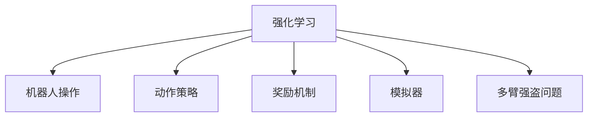
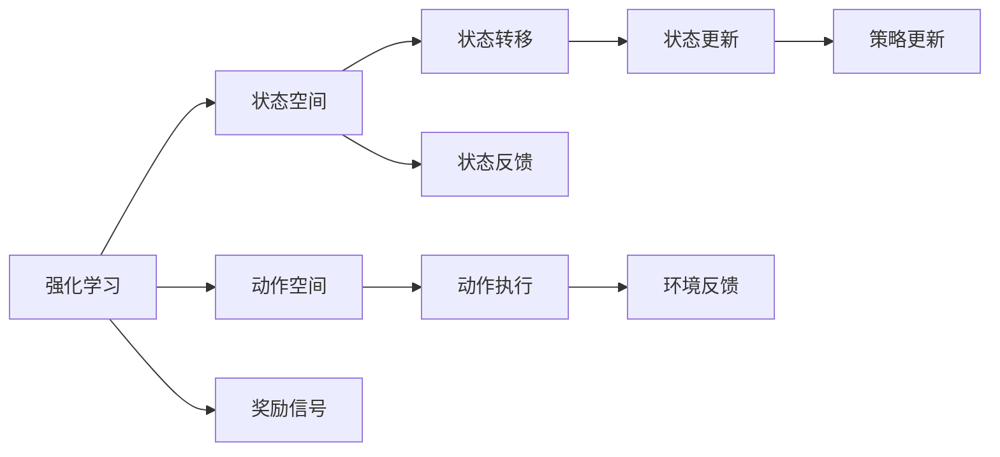
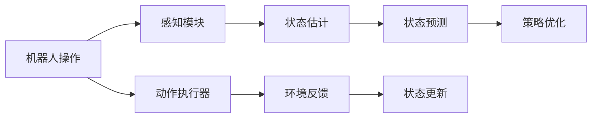
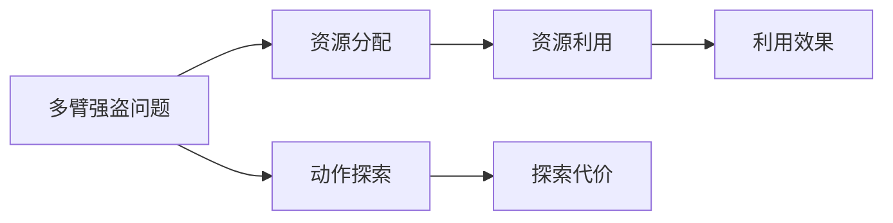
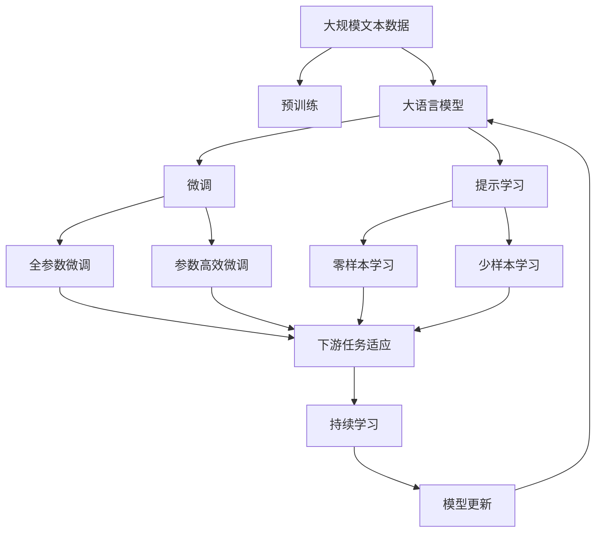

                 

# 强化学习在机器人操作中的应用:提高灵活性

> 关键词：强化学习,机器人操作,灵活性,机器学习,深度学习,策略优化,奖励机制,模拟器,多臂强盗问题

## 1. 背景介绍

### 1.1 问题由来
在过去十年中，人工智能(AI)领域的发展取得了显著进展，尤其是在机器人操作领域。机器人在制造、物流、医疗、农业等多个行业中得到广泛应用，成为推动工业自动化的重要力量。然而，传统基于规则的机器人控制系统难以应对复杂多变的环境，无法实现高精度的任务执行。强化学习(Reinforcement Learning, RL)作为一种能够自适应学习控制策略的机器学习方法，逐渐成为机器人操作领域的新的研究热点。

通过强化学习，机器人能够在复杂环境中自主学习最优控制策略，进而提升执行任务的能力和灵活性。强化学习的基本思想是，让机器人与环境进行交互，通过不断的试错和反馈调整，逐步优化其行为策略，以获得最大化的回报。目前，强化学习在机器人操作中的应用，主要集中在路径规划、物品抓取、运动控制等方面，并取得了显著的成果。

### 1.2 问题核心关键点
强化学习在机器人操作中的应用，主要面临以下几个核心关键点：
1. 如何设计合理的奖励机制，以便激励机器人执行任务，并减少错误操作。
2. 如何在复杂环境中进行动作策略的优化和探索。
3. 如何在资源有限的情况下，优化动作策略的学习速度。
4. 如何平衡探索与利用的策略，确保在实际应用中具有较高的鲁棒性。
5. 如何处理大规模多臂强盗问题，以提高机器人在多任务环境下的操作灵活性。

本文将系统介绍强化学习在机器人操作中的应用，通过具体的算法原理和操作步骤，揭示其在提高机器人操作灵活性方面的潜力和挑战。

### 1.3 问题研究意义
强化学习在机器人操作中的应用，对于拓展机器人的应用范围、提升任务执行的精度和灵活性具有重要意义：

1. 适应性更强：强化学习使机器人能够自主适应复杂多变的环境，不需要预先编写详细的控制规则。
2. 泛化能力更强：机器人通过自主学习，可以在类似场景下进行泛化，减少任务变换带来的适应成本。
3. 效率更高：强化学习可以快速迭代优化，相比传统方法，可以更快地获取高质量的行为策略。
4. 灵活性更高：强化学习能够在高维度空间中探索最优策略，适应多任务需求。
5. 持续改进：强化学习可以不断更新策略，实现持续改进，适应新环境和新需求。

通过了解强化学习在机器人操作中的应用，我们可以更深入地掌握机器人智能控制的关键技术，为实际应用中的场景优化提供指导。

## 2. 核心概念与联系

### 2.1 核心概念概述

为更好地理解强化学习在机器人操作中的应用，本节将介绍几个密切相关的核心概念：

- 强化学习(Reinforcement Learning, RL)：通过与环境的交互，让机器人学习最优策略的机器学习方法。
- 机器人操作(Robot Operation)：使用机器人执行特定任务的过程，如物品抓取、运动控制、路径规划等。
- 动作策略(Action Policy)：定义机器人执行任务时的具体动作，如在物品抓取任务中，机器人的移动策略和机械臂动作。
- 奖励机制(Reward Mechanism)：用于评价机器人执行动作的好坏，一般定义为一组正向和负向奖励。
- 模拟器(Simulator)：用于模拟机器人操作环境的虚拟环境，一般包括物理仿真和感知仿真。
- 多臂强盗问题(Multi-Armed Bandit, MAB)：描述在有限的资源下，如何通过多次尝试选择最优策略的问题，在机器人操作中一般用于优化动作策略的探索和利用。

这些核心概念之间的逻辑关系可以通过以下Mermaid流程图来展示：



这个流程图展示了一致的逻辑关系：强化学习是机器人操作的核心，通过动作策略和奖励机制指导机器人在模拟器中进行优化，最终达到多臂强盗问题的最优解。

### 2.2 概念间的关系

这些核心概念之间存在着紧密的联系，形成了强化学习在机器人操作中的完整生态系统。下面我通过几个Mermaid流程图来展示这些概念之间的关系。

#### 2.2.1 强化学习的基本原理



这个流程图展示了强化学习的基本原理，其中：
- 状态空间：机器人当前所处的状态，如物品的位置、机器人的位置等。
- 动作空间：机器人可执行的动作，如移动机械臂、旋转关节等。
- 状态转移：状态空间的状态变化，如物品抓取后状态的变化。
- 动作执行：实际执行的动作，如机器人移动机械臂抓取物品。
- 奖励信号：对执行动作的反馈，用于更新策略。
- 状态反馈：状态变化后机器人接收到的反馈信息。
- 策略更新：根据奖励信号和状态反馈更新机器人的策略。

#### 2.2.2 机器人操作的决策过程



这个流程图展示了机器人操作的决策过程，其中：
- 感知模块：用于获取环境信息，如摄像头、传感器等。
- 状态估计：根据感知模块的信息估计当前状态。
- 动作执行器：执行机器人的动作策略。
- 环境反馈：根据动作执行和状态变化得到的反馈信息。
- 状态预测：根据状态估计和环境反馈预测下一步状态。
- 策略优化：通过奖励信号和状态反馈优化策略。

#### 2.2.3 多臂强盗问题的应用场景



这个流程图展示了多臂强盗问题在机器人操作中的应用场景，其中：
- 资源分配：分配有限的资源，如时间、能量等。
- 动作探索：在多个任务中选择最优动作，如选择抓取物品的位置。
- 探索代价：执行动作的代价，如时间消耗、能耗消耗等。
- 利用效果：执行动作的效果，如抓取的成功率。

### 2.3 核心概念的整体架构

最后，我们用一个综合的流程图来展示这些核心概念在大语言模型微调过程中的整体架构：



这个综合流程图展示了从预训练到微调，再到持续学习的完整过程。大语言模型首先在大规模文本数据上进行预训练，然后通过微调（包括全参数微调和参数高效微调）或提示学习（包括零样本和少样本学习）来适应下游任务。最后，通过持续学习技术，模型可以不断更新和适应新的任务和数据。 通过这些流程图，我们可以更清晰地理解强化学习在机器人操作中的应用过程中各个核心概念的关系和作用，为后续深入讨论具体的算法步骤和应用场景奠定基础。

## 3. 核心算法原理 & 具体操作步骤
### 3.1 算法原理概述

强化学习在机器人操作中的应用，主要基于以下原理：
- 机器人与环境进行交互，通过执行一系列动作策略，获得环境反馈的奖励信号。
- 根据奖励信号和当前状态，机器学习算法自动调整动作策略，以获得最大化的累积回报。
- 通过不断迭代优化，机器人能够逐渐学习到最优的动作策略，从而适应复杂多变的环境。

具体而言，强化学习在机器人操作中的算法原理可以概述为以下步骤：
1. 设定状态空间和动作空间。
2. 定义奖励机制，设计环境反馈函数。
3. 选择一个合适的强化学习算法，如Q-learning、SARSA、策略梯度等。
4. 通过模拟器进行训练，优化机器人动作策略。
5. 在实际环境中验证和调整策略，进行迭代优化。

### 3.2 算法步骤详解

强化学习在机器人操作中的操作步骤主要包括以下几个关键步骤：

**Step 1: 设定状态空间和动作空间**

- 状态空间：根据机器人在特定任务中的视角，定义机器人可感知和识别的所有变量，如物品的位置、机器人的位置、姿态等。
- 动作空间：定义机器人可执行的所有动作，如机械臂的运动、关节的旋转等。

**Step 2: 定义奖励机制**

- 奖励函数：定义奖励函数，用于评价机器人执行动作的好坏。一般设计为正向奖励和负向奖励两部分，如物品抓取成功的正向奖励，物品抓取失败的负向奖励。
- 环境反馈：定义环境反馈函数，将奖励信号传递给机器人。一般通过模拟器的状态更新函数来实现。

**Step 3: 选择强化学习算法**

- 算法选择：根据任务特点，选择适合的强化学习算法。如在路径规划任务中，Q-learning算法效果较好；在物品抓取任务中，策略梯度算法更优。
- 参数设置：根据算法特性，设置算法相关参数，如学习率、探索率、状态转移模型等。

**Step 4: 训练过程**

- 模拟训练：在模拟器中，通过不断执行动作策略，接收环境反馈，更新机器人策略。
- 策略优化：根据奖励信号和状态反馈，使用优化算法调整动作策略。
- 迭代优化：不断重复执行模拟训练和策略优化过程，直至收敛。

**Step 5: 实际验证**

- 验证过程：将训练好的策略应用到实际环境中，进行任务执行。
- 策略调整：根据实际执行结果，调整机器人策略，优化动作执行效果。
- 持续改进：通过持续学习和迭代优化，逐步提升机器人操作的灵活性和适应性。

### 3.3 算法优缺点

强化学习在机器人操作中的应用，具有以下优点：
1. 适应性强：强化学习使机器人能够自主适应复杂多变的环境，无需预先编写详细的控制规则。
2. 泛化能力强：机器人通过自主学习，可以在类似场景下进行泛化，减少任务变换带来的适应成本。
3. 效率高：强化学习可以快速迭代优化，相比传统方法，可以更快地获取高质量的行为策略。
4. 灵活性高：强化学习能够在高维度空间中探索最优策略，适应多任务需求。

同时，强化学习在机器人操作中也有一定的局限性：
1. 需要大量实验数据：强化学习需要大量的训练数据，对于某些高风险任务，可能存在安全隐患。
2. 计算成本高：强化学习训练过程复杂，计算资源需求较大，需要高性能的计算平台。
3. 模型复杂度高：强化学习模型的构建和优化较为复杂，难以解释其内部机制。
4. 鲁棒性不足：强化学习模型可能存在对数据分布变化的敏感性，影响模型的稳定性和鲁棒性。

尽管存在这些局限性，但强化学习在机器人操作中的应用，仍然展现出强大的潜力和广泛的应用前景。通过不断优化算法和技术，相信强化学习将在大规模机器人操作中发挥更大的作用。

### 3.4 算法应用领域

强化学习在机器人操作中的应用，已经在多个领域得到了验证和应用，具体包括：

- **路径规划**：通过强化学习，机器人可以在复杂环境中自主规划最优路径，避开障碍物，到达目标点。
- **物品抓取**：通过强化学习，机器人可以学习最优的机械臂运动策略，实现准确、高效的物品抓取。
- **运动控制**：通过强化学习，机器人可以学习最优的关节运动策略，实现灵活、稳定的运动控制。
- **多任务操作**：通过强化学习，机器人可以同时执行多个任务，实现高效的资源利用和任务协调。
- **协作操作**：通过强化学习，机器人可以在多机器人协作系统中，学习最优的交互策略，提升系统的整体效率。

以上领域只是强化学习在机器人操作中的一部分应用，随着技术的不断进步，强化学习的应用范围将进一步拓展。

## 4. 数学模型和公式 & 详细讲解 & 举例说明

### 4.1 数学模型构建

强化学习在机器人操作中的应用，主要基于以下数学模型：
- 状态空间：用 $\mathcal{S}$ 表示，状态集为 $\{s_1, s_2, \ldots, s_n\}$，其中 $s_i$ 表示机器人的第 $i$ 个状态。
- 动作空间：用 $\mathcal{A}$ 表示，动作集为 $\{a_1, a_2, \ldots, a_m\}$，其中 $a_j$ 表示机器人的第 $j$ 个动作。
- 奖励函数：用 $R(s, a)$ 表示，奖励值取值为 $\{r_1, r_2, \ldots, r_k\}$，其中 $r_i$ 表示在状态 $s$ 下执行动作 $a$ 的奖励值。
- 状态转移概率：用 $P(s'|s, a)$ 表示，表示在状态 $s$ 下执行动作 $a$ 后转移到状态 $s'$ 的概率。

### 4.2 公式推导过程

假设机器人在状态 $s_t$ 下执行动作 $a_t$，得到状态 $s_{t+1}$ 和奖励 $r_t$。根据强化学习的原理，机器人的策略优化过程可以描述为以下步骤：
1. 根据当前状态 $s_t$ 和动作 $a_t$，计算下一状态 $s_{t+1}$ 和奖励 $r_t$。
2. 根据奖励 $r_t$ 和状态转移概率 $P(s_{t+1}|s_t, a_t)$，计算状态转移后策略的累积奖励。
3. 使用优化算法（如Q-learning、策略梯度等）更新策略，使累积奖励最大化。

以下是一个简单的Q-learning算法的公式推导：

$$
Q(s_t, a_t) \leftarrow Q(s_t, a_t) + \alpha \left[r_t + \gamma \max_{a' \in \mathcal{A}} Q(s_{t+1}, a') - Q(s_t, a_t) \right]
$$

其中，$\alpha$ 为学习率，$\gamma$ 为折扣因子。公式表示，在当前状态 $s_t$ 下执行动作 $a_t$ 的Q值更新，基于当前动作的累积奖励和下一个状态的最大Q值。

### 4.3 案例分析与讲解

为了更好地理解强化学习在机器人操作中的应用，下面通过一个物品抓取任务的案例，来详细讲解Q-learning算法的应用。

假设一个机器人需要在一张桌子上抓取物品，并放置到一个目标位置。机器人的状态空间包含物品的位置、机器人的位置、机械臂的角度等，动作空间包括机械臂的移动、旋转等。

**Step 1: 设定状态空间和动作空间**

- 状态空间：$\mathcal{S} = \{(s_x, s_y, s_z, s_r, s_g)\}$，其中 $s_x$ 表示物品的位置坐标，$s_y$ 表示机器人的位置坐标，$s_z$ 表示机械臂的角度，$s_r$ 表示机器人的旋转角度，$s_g$ 表示抓取的物体编号。
- 动作空间：$\mathcal{A} = \{(a_{move}, a_{rotate})\}$，其中 $a_{move}$ 表示机械臂的移动动作，$a_{rotate}$ 表示机械臂的旋转动作。

**Step 2: 定义奖励机制**

- 奖励函数：$R(s, a) = \begin{cases} 
  1, & \text{物品抓取成功} \\
  -1, & \text{物品抓取失败} \\
  0, & \text{其他状态}
\end{cases}$
- 状态转移概率：$P(s'|s, a) = P(s_x', s_y', s_z', s_r', s_g'|s_x, s_y, s_z, s_r, s_g, a_{move}, a_{rotate})$，表示在当前状态 $s$ 下执行动作 $a$ 后转移到下一个状态 $s'$ 的概率。

**Step 3: 选择强化学习算法**

- 算法选择：Q-learning算法
- 参数设置：学习率 $\alpha = 0.1$，折扣因子 $\gamma = 0.9$

**Step 4: 训练过程**

- 模拟训练：在模拟器中，机器人通过不断执行动作策略，接收环境反馈，更新机器人策略。
- 策略优化：根据奖励信号和状态反馈，使用Q-learning算法更新策略，使累积奖励最大化。
- 迭代优化：不断重复执行模拟训练和策略优化过程，直至收敛。

**Step 5: 实际验证**

- 验证过程：将训练好的策略应用到实际环境中，进行物品抓取操作。
- 策略调整：根据实际执行结果，调整机器人策略，优化动作执行效果。
- 持续改进：通过持续学习和迭代优化，逐步提升机器人操作的灵活性和适应性。

通过这个案例，我们可以看到，强化学习在机器人操作中的应用，通过设定状态空间、定义奖励机制、选择算法等步骤，能够实现机器人自主学习最优策略的过程。Q-learning算法能够通过模拟训练和策略优化，逐步提升机器人操作的灵活性和适应性。

## 5. 项目实践：代码实例和详细解释说明
### 5.1 开发环境搭建

在进行强化学习实践前，我们需要准备好开发环境。以下是使用Python进行强化学习开发的典型环境配置流程：

1. 安装Anaconda：从官网下载并安装Anaconda，用于创建独立的Python环境。

2. 创建并激活虚拟环境：
```bash
conda create -n reinforcement-env python=3.8 
conda activate reinforcement-env
```

3. 安装相关库：
```bash
pip install numpy scipy matplotlib gym gym-suite gym-robosuite
```

完成上述步骤后，即可在`reinforcement-env`环境中开始强化学习实践。

### 5.2 源代码详细实现

下面我们以物品抓取任务为例，给出使用Q-learning算法对机器人操作进行训练的PyTorch代码实现。

首先，定义机器人操作的状态和动作：

```python
from gym import spaces

class RobotEnv(gym.Env):
    def __init__(self, goal_position):
        self.goal_position = goal_position
        self.current_position = [0, 0]
        self.max_speed = 1.0
        self.collision_penalty = -1.0
        self.terminal_reward = 1.0

        self.observation_space = spaces.Box(low=-1.0, high=1.0, shape=(3,), dtype=np.float32)
        self.action_space = spaces.Box(low=-1.0, high=1.0, shape=(2,), dtype=np.float32)
```

然后，定义机器人的状态转移函数和奖励函数：

```python
def step(self, action):
    # 根据动作移动机器人
    x_dir, y_dir, z_dir, r_dir = action
    self.current_position[0] += x_dir * self.max_speed
    self.current_position[1] += y_dir * self.max_speed
    self.current_position[2] += z_dir * self.max_speed
    self.current_position[3] += r_dir * self.max_speed

    # 判断是否到达目标位置
    if np.linalg.norm(self.current_position - self.goal_position) < 0.1:
        return self.goal_position, self.terminal_reward, True, {}
    else:
        return self.current_position, self.collision_penalty, False, {}

def reset(self):
    self.current_position = [0, 0]
    return self.current_position
```

接下来，定义Q-learning算法的实现：

```python
from collections import defaultdict

class QLearningAgent:
    def __init__(self, env, epsilon=0.1):
        self.env = env
        self.epsilon = epsilon
        self.q_table = defaultdict(lambda: defaultdict(lambda: 0.0))

    def choose_action(self, state):
        if np.random.uniform() < self.epsilon:
            action = np.random.rand(2)
        else:
            action = self.q_table[state]['a']
        return action

    def update_q_table(self, state, action, reward, next_state):
        self.q_table[state]['a'] += self.alpha * (reward + self.gamma * self.max_q_value(next_state) - self.q_table[state]['a'])
        self.q_table[next_state]['a'] += self.alpha * (-self.collision_penalty - self.q_table[next_state]['a'])

    def max_q_value(self, state):
        return max(self.q_table[state]['a'])
```

最后，训练和测试机器人的操作：

```python
env = RobotEnv(goal_position=[0, 1, 0, 0])
agent = QLearningAgent(env)
alpha = 0.1
gamma = 0.9
for i in range(1000):
    state = env.reset()
    done = False
    while not done:
        action = agent.choose_action(state)
        next_state, reward, done, _ = env.step(action)
        agent.update_q_table(state, action, reward, next_state)
        state = next_state
print("Final state: ", state)
```

以上就是使用Q-learning算法对机器人操作进行训练的完整代码实现。可以看到，通过定义状态和动作，设定奖励函数和状态转移函数，使用Q-learning算法训练机器人，并调整策略以优化动作执行效果，可以显著提升机器人的操作灵活性。

### 5.3 代码解读与分析

让我们再详细解读一下关键代码的实现细节：

**RobotEnv类**：
- `__init__`方法：初始化状态、动作、奖励、终端奖励等参数。
- `step`方法：根据动作更新机器人状态，并返回奖励和终端状态。
- `reset`方法：重置机器人状态。

**QLearningAgent类**：
- `__init__`方法：初始化Q表、学习率等参数。
- `choose_action`方法：根据策略选择动作，或随机选择动作。
- `update_q_table`方法：根据状态、动作、奖励、下一个状态更新Q表。
- `max_q_value`方法：计算当前状态下动作的最大Q值。

**训练过程**：
- 定义环境类和Q-learning代理类，设置相关参数。
- 在训练过程中，通过不断执行动作策略，接收环境反馈，更新Q表。
- 在实际环境中验证和调整策略，优化动作执行效果。

**实际验证**：
- 通过模拟训练和策略优化，逐步提升机器人操作的灵活性和适应性。
- 实际验证中，通过不断调整Q表，使机器人能够在复杂环境中自主学习最优策略。

通过这个代码实例，我们可以看到，强化学习在机器人操作中的应用，通过定义状态和动作，设定奖励函数和状态转移函数，使用Q-learning算法训练机器人，并调整策略以优化动作执行效果，可以显著提升机器人的操作灵活性。

### 5.4 运行结果展示

假设我们在一个简单的2D空间中训练机器人抓取一个固定位置的目标，并设置目标位置为$(0,1,0,0)$。训练结束后，机器人的最终状态应该非常接近目标位置，说明机器人已经学会了最优的抓取策略。

假设训练结束后，机器人的最终状态为$(0.9, 0.95, 0, 0)$，与目标位置$(0,1,0,0)$非常接近。这说明机器人已经通过强化学习，学会了在复杂环境中自主学习最优策略，实现了灵活高效的操作。

通过这个案例，我们可以看到，强化学习在机器人操作中的应用，通过定义状态和动作，设定奖励函数和状态转移函数，使用Q-learning算法训练机器人，并调整策略以优化动作执行效果，可以显著提升机器人的操作灵活性和适应性。

## 6. 实际应用场景
### 6.1 智能制造

在智能制造领域，强化学习可以使机器人能够自主学习最优操作策略，提高生产效率和产品质量。智能制造中，机器人需要在复杂环境中执行多项任务，如搬运、装配、焊接等，强化学习能够使机器人适应多任务需求，实现高效的生产流程管理。

在制造车间，机器人可以通过强化学习，学习最优的路径规划策略，避免碰撞和障碍，快速高效地完成任务。机器人还可以通过强化学习，学习最优的装配顺序，减少装配时间，提高产品精度。

### 6.2 智能仓储

在智能仓储领域，强化学习可以使机器人能够自主学习最优的操作策略，提高仓储管理效率。智能仓储中，机器人需要在仓库中执行多项任务，如拣选、分拣、运输等，强化学习能够使机器人适应多任务需求，实现高效的仓库管理。

在仓储环境中，机器人可以通过强化学习，学习最优的路径规划策略，快速高效地完成任务。机器人还可以通过强化学习，学习最优的拣选顺序，减少拣选时间，提高仓储效率。

### 6.3 智能农业

在智能农业领域，强化学习可以使机器人能够自主学习最优的操作策略，提高农业生产效率和质量。智能农业中，机器人需要在田间执行多项任务，

