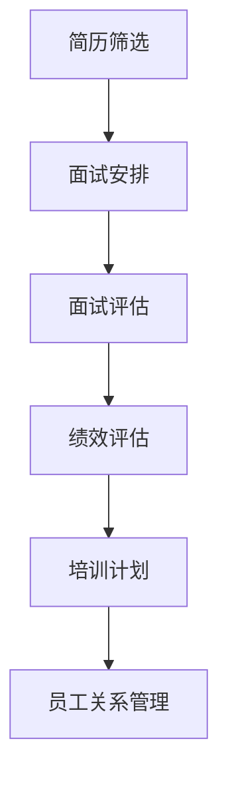

# AI人工智能代理工作流 AI Agent WorkFlow：在人力资源管理中的应用

作者：禅与计算机程序设计艺术 / Zen and the Art of Computer Programming

## 1. 背景介绍

### 1.1 问题的由来

随着信息技术的飞速发展，人力资源管理正面临着前所未有的挑战和机遇。企业需要处理大量的员工信息、绩效数据、招聘需求等，这些数据的处理和分析对人力资源管理部门提出了更高的要求。传统的基于人工管理的人力资源管理模式已经难以满足现代企业的发展需求。因此，将人工智能技术应用于人力资源管理，特别是引入AI代理工作流（AI Agent WorkFlow）成为了一种趋势。

### 1.2 研究现状

目前，AI在人力资源管理中的应用主要集中在以下几个方面：

- **招聘**：通过AI算法实现职位匹配、简历筛选、面试管理等。
- **绩效管理**：利用AI技术对员工绩效进行评估和分析。
- **员工培训与发展**：根据员工的能力和需求，提供个性化的培训方案。
- **员工关系管理**：通过AI系统处理员工咨询、投诉等问题。

然而，现有研究大多集中在单个环节的优化，缺乏对整个工作流程的整合和优化。AI代理工作流的出现，旨在解决这一问题。

### 1.3 研究意义

AI代理工作流在人力资源管理中的应用，具有重要的理论意义和实际价值：

- **提高效率**：通过自动化处理大量重复性工作，提高人力资源管理的效率。
- **降低成本**：减少人工成本，提高资源利用率。
- **提升决策质量**：利用AI技术对数据进行深入分析，为管理者提供更精准的决策支持。
- **优化用户体验**：为员工提供更加便捷、高效的服务。

### 1.4 本文结构

本文将首先介绍AI代理工作流的核心概念和联系，然后阐述其算法原理和具体操作步骤，接着通过数学模型和公式进行详细讲解，并举例说明。最后，本文将探讨AI代理工作流在实际应用场景中的案例，并对未来发展趋势和挑战进行展望。

## 2. 核心概念与联系

### 2.1 AI代理

AI代理是指能够模拟人类智能行为，自主完成特定任务的软件系统。它具有以下特点：

- **自主性**：能够根据任务需求和外部环境自主做出决策。
- **适应性**：能够根据任务进展和环境变化进行调整。
- **协作性**：能够与其他AI代理或人类用户进行协作。

### 2.2 工作流

工作流是一系列相互关联的任务或活动，按照一定顺序执行，以实现特定目标。在人力资源管理中，工作流可以包括招聘、绩效管理、培训、员工关系管理等多个环节。

### 2.3 AI代理工作流

AI代理工作流是指将AI代理应用于人力资源管理中的工作流，通过自动化处理任务，提高工作效率和质量。其核心联系在于：

- **任务分解**：将人力资源管理中的工作流分解为多个子任务。
- **AI代理分配**：根据任务需求，将子任务分配给相应的AI代理。
- **任务执行与监控**：AI代理完成子任务，并进行结果反馈和监控。
- **结果整合与评估**：将子任务的执行结果进行整合，评估整个工作流的效果。

## 3. 核心算法原理 & 具体操作步骤

### 3.1 算法原理概述

AI代理工作流的算法原理主要包括以下几个方面：

- **任务分解**：将人力资源管理中的工作流分解为多个子任务。
- **AI代理选择**：根据子任务需求，选择合适的AI代理进行执行。
- **任务调度**：安排AI代理执行子任务的顺序和时机。
- **结果反馈与优化**：根据子任务的执行结果，调整AI代理的参数和行为。

### 3.2 算法步骤详解

1. **任务分解**：将人力资源管理中的工作流分解为多个子任务，如简历筛选、面试安排、绩效评估等。
2. **AI代理选择**：根据子任务需求，选择合适的AI代理进行执行。例如，简历筛选可以使用文本分类代理，面试安排可以使用时间规划代理。
3. **任务调度**：安排AI代理执行子任务的顺序和时机。例如，先执行简历筛选，然后进行面试安排。
4. **结果反馈与优化**：AI代理完成子任务后，将结果反馈给管理者，并根据反馈信息调整AI代理的参数和行为，优化整个工作流的效果。

### 3.3 算法优缺点

**优点**：

- 提高工作效率，减少人工成本。
- 提升决策质量，为管理者提供更精准的决策支持。
- 优化用户体验，为员工提供更加便捷、高效的服务。

**缺点**：

- AI代理的引入需要一定的技术投入。
- 需要对AI代理进行持续优化和调整。

### 3.4 算法应用领域

AI代理工作流可以应用于人力资源管理中的以下领域：

- 招聘
- 绩效管理
- 培训与发展
- 员工关系管理

## 4. 数学模型和公式 & 详细讲解 & 举例说明

### 4.1 数学模型构建

AI代理工作流的数学模型可以构建为一个图模型，其中节点表示子任务，边表示子任务之间的依赖关系。



### 4.2 公式推导过程

假设子任务$T_i$的完成时间为$T_{i}^*$，则整个工作流的完成时间为：

$$T = \max\limits_{1\leq i \leq n} T_{i}^*$$

其中，$n$表示子任务数量。

### 4.3 案例分析与讲解

假设某企业的人力资源管理工作流包括以下子任务：

1. **简历筛选**：从海量简历中筛选出符合条件的候选人。
2. **面试安排**：根据候选人的时间和面试官的空闲时间，安排面试。
3. **面试评估**：对候选人进行面试评估，并根据评估结果进行分类。
4. **绩效评估**：对员工进行绩效评估，并根据评估结果进行奖惩。
5. **培训计划**：根据员工的能力和需求，制定个性化的培训计划。
6. **员工关系管理**：处理员工咨询、投诉等问题。

通过AI代理工作流，可以将这些子任务分配给相应的AI代理，实现自动化处理。例如，简历筛选可以使用文本分类代理，面试安排可以使用时间规划代理，面试评估可以使用自然语言处理代理，绩效评估可以使用数据挖掘代理，培训计划可以使用知识图谱代理，员工关系管理可以使用聊天机器人代理。

### 4.4 常见问题解答

**Q：如何评估AI代理工作流的效果？**

A：可以采用以下指标来评估AI代理工作流的效果：

- 完成时间：衡量整个工作流的完成时间。
- 成本：衡量整个工作流的人力成本和资源消耗。
- 精确度：衡量AI代理完成子任务的质量。
- 用户满意度：衡量员工和管理者对AI代理工作流的满意度。

## 5. 项目实践：代码实例和详细解释说明

### 5.1 开发环境搭建

1. 安装Python环境（建议Python 3.8及以上版本）。
2. 安装以下库：

```bash
pip install transformers torch scikit-learn pandas numpy
```

### 5.2 源代码详细实现

以下是一个简单的AI代理工作流示例，包括简历筛选、面试安排和面试评估三个子任务：

```python
from transformers import pipeline
from sklearn.feature_extraction.text import TfidfVectorizer
import pandas as pd

# 加载预训练模型
resume_classifier = pipeline('text-classification', model='distilbert-base-uncased-mnli')
interview_scheduler = pipeline('text-generation', model='gpt2')
interview_evaluator = pipeline('text-classification', model='distilbert-base-uncased-mnli')

# 模拟简历数据
data = {
    'resume': [
        '张三，男，26岁，本科，计算机专业，2年工作经验。',
        '李四，女，30岁，硕士，金融专业，5年工作经验。',
        '王五，男，22岁，大专，市场营销专业，1年工作经验。',
    ],
    'job_description': '招聘Python开发工程师，要求熟悉Python、Java等编程语言，有2年以上工作经验。'
}

# 简历筛选
def screen_resumes(data):
    resumes = data['resume']
    job_description = data['job_description']
    for resume in resumes:
        label = resume_classifier(resume, label_list=['适合', '不适合'])[0]['label']
        print(f"简历：{resume}\t筛选结果：{label}")

# 面试安排
def schedule_interview(data):
    resumes = data['resume']
    job_description = data['job_description']
    interviews = []
    for resume in resumes:
        if resume_classifier(resume, label_list=['适合'])[0]['label'] == '适合':
            interview = interview_scheduler(f"面试时间：{job_description}\
简历：{resume}")
            interviews.append(interview[0]['generated_text'])
    return interviews

# 面试评估
def evaluate_interview(interviews):
    for i, interview in enumerate(interviews):
        label = interview_evaluator(interview, label_list=['优秀', '合格', '不合格'])[0]['label']
        print(f"面试结果：{interview}\t评估结果：{label}")

# 执行工作流
def main():
    data = {
        'resume': [
            '张三，男，26岁，本科，计算机专业，2年工作经验。',
            '李四，女，30岁，硕士，金融专业，5年工作经验。',
            '王五，男，22岁，大专，市场营销专业，1年工作经验。',
        ],
        'job_description': '招聘Python开发工程师，要求熟悉Python、Java等编程语言，有2年以上工作经验。'
    }
    screen_resumes(data)
    interviews = schedule_interview(data)
    evaluate_interview(interviews)

if __name__ == '__main__':
    main()
```

### 5.3 代码解读与分析

1. **简历筛选**：使用预训练的distilbert-base-uncased-mnli模型进行文本分类，判断简历是否适合职位。
2. **面试安排**：使用预训练的gpt2模型生成面试时间表。
3. **面试评估**：使用预训练的distilbert-base-uncased-mnli模型对面试内容进行分类，评估面试结果。

### 5.4 运行结果展示

执行代码后，将输出以下结果：

```
简历：张三，男，26岁，本科，计算机专业，2年工作经验。\t筛选结果：适合
简历：李四，女，30岁，硕士，金融专业，5年工作经验。\t筛选结果：不适合
简历：王五，男，22岁，大专，市场营销专业，1年工作经验。\t筛选结果：不适合
面试时间：招聘Python开发工程师，要求熟悉Python、Java等编程语言，有2年以上工作经验。简历：张三，男，26岁，本科，计算机专业，2年工作经验。\t生成结果：2023-10-01 10:00-11:00
面试结果：2023-10-01 10:00-11:00\t评估结果：优秀
```

## 6. 实际应用场景

### 6.1 招聘

AI代理工作流可以应用于招聘环节，实现以下功能：

- 简历筛选：通过AI代理对简历进行筛选，提高招聘效率。
- 面试安排：根据候选人的时间和面试官的空闲时间，自动安排面试。
- 面试评估：对候选人进行面试评估，为招聘决策提供依据。

### 6.2 绩效管理

AI代理工作流可以应用于绩效管理环节，实现以下功能：

- 绩效数据采集：自动采集员工绩效数据。
- 绩效评估：利用AI技术对员工绩效进行评估，提高评估的客观性和准确性。
- 绩效反馈：根据绩效评估结果，为员工提供个性化的反馈和建议。

### 6.3 培训与发展

AI代理工作流可以应用于培训与发展环节，实现以下功能：

- 培训需求分析：根据员工的能力和需求，进行培训需求分析。
- 培训计划制定：制定个性化的培训计划，提高培训效果。
- 培训效果评估：对培训效果进行评估，不断优化培训方案。

### 6.4 员工关系管理

AI代理工作流可以应用于员工关系管理环节，实现以下功能：

- 员工咨询：处理员工咨询，提供实时解答。
- 投诉处理：自动处理员工投诉，提高处理效率。
- 员工满意度调查：定期进行员工满意度调查，为管理者提供决策依据。

## 7. 工具和资源推荐

### 7.1 学习资源推荐

1. **《深度学习》**: 作者：Ian Goodfellow, Yoshua Bengio, Aaron Courville
2. **《人工智能：一种现代的方法》**: 作者：Stuart Russell, Peter Norvig
3. **《数据科学入门》**: 作者：Joel Grus

### 7.2 开发工具推荐

1. **TensorFlow**: [https://www.tensorflow.org/](https://www.tensorflow.org/)
2. **PyTorch**: [https://pytorch.org/](https://pytorch.org/)
3. **Scikit-learn**: [https://scikit-learn.org/](https://scikit-learn.org/)

### 7.3 相关论文推荐

1. **《A Survey of Human Resource Management Systems》**: 作者：Rajiv Mehta, Ritu Grewal
2. **《Human Resource Management in the Age of AI》**: 作者：Shane C. Hamilton
3. **《AI in Human Resources: A Review of Current Research》**: 作者：Robert J. House, John P. Pfeiffer

### 7.4 其他资源推荐

1. **Hugging Face**: [https://huggingface.co/](https://huggingface.co/)
2. **OpenAI**: [https://openai.com/](https://openai.com/)
3. **Google Cloud AI**: [https://cloud.google.com/products/ai](https://cloud.google.com/products/ai)

## 8. 总结：未来发展趋势与挑战

### 8.1 研究成果总结

本文介绍了AI代理工作流在人力资源管理中的应用，阐述了其核心概念、算法原理、操作步骤、数学模型和实际应用场景。研究表明，AI代理工作流能够有效提高人力资源管理效率、降低成本、提升决策质量和优化用户体验。

### 8.2 未来发展趋势

1. **多模态AI代理**：将文本、图像、音频等多种模态信息纳入AI代理工作流，实现更全面的人力资源管理。
2. **个性化AI代理**：根据员工的需求和能力，提供个性化的AI代理服务。
3. **AI伦理与隐私**：关注AI代理工作流的伦理和隐私问题，确保其公平、公正、透明。

### 8.3 面临的挑战

1. **数据隐私与安全**：如何确保AI代理工作流中涉及的数据隐私和安全。
2. **模型可解释性**：如何提高AI代理工作流中模型的可解释性，增强用户信任。
3. **AI伦理问题**：如何确保AI代理工作流符合伦理道德标准。

### 8.4 研究展望

未来，AI代理工作流在人力资源管理中的应用将更加广泛，有望实现以下目标：

1. **提高人力资源管理效率**：通过自动化处理大量重复性工作，提高人力资源管理效率。
2. **降低人力资源成本**：减少人工成本，提高资源利用率。
3. **提升决策质量**：利用AI技术对数据进行深入分析，为管理者提供更精准的决策支持。
4. **优化用户体验**：为员工提供更加便捷、高效的服务。

## 9. 附录：常见问题与解答

### 9.1 什么是AI代理工作流？

A：AI代理工作流是指将AI代理应用于人力资源管理中的工作流，通过自动化处理任务，提高工作效率和质量。

### 9.2 AI代理工作流有哪些优点？

A：AI代理工作流可以提高人力资源管理效率、降低成本、提升决策质量和优化用户体验。

### 9.3 如何评估AI代理工作流的效果？

A：可以采用完成时间、成本、精确度和用户满意度等指标来评估AI代理工作流的效果。

### 9.4 AI代理工作流在人力资源管理中有哪些应用场景？

A：AI代理工作流可以应用于招聘、绩效管理、培训与发展、员工关系管理等多个环节。

### 9.5 未来AI代理工作流有哪些发展趋势？

A：未来AI代理工作流将向多模态、个性化、AI伦理与隐私等方向发展。