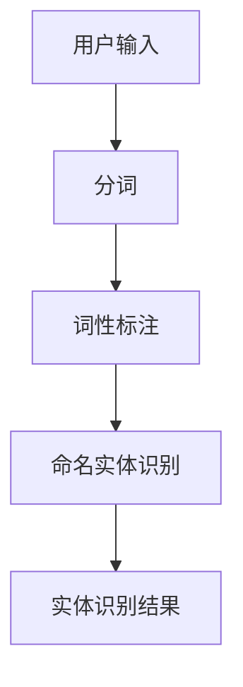
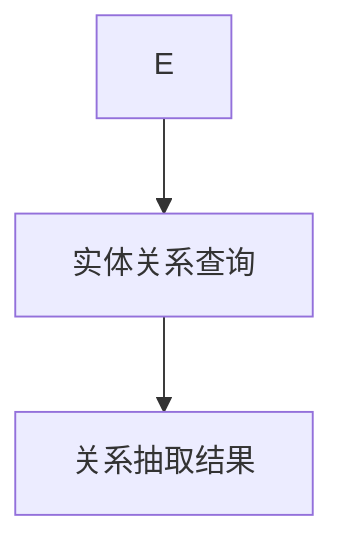
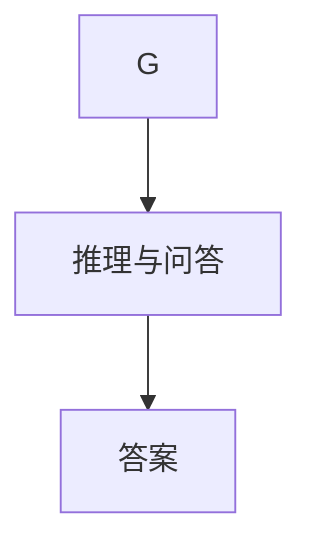

# 【LangChain编程：从入门到实践】ConversationKGMemory

作者：禅与计算机程序设计艺术 / Zen and the Art of Computer Programming

关键词：LangChain, 对话式知识图谱，知识图谱构建，自然语言处理，编程实践

## 1. 背景介绍

### 1.1 问题的由来

随着自然语言处理（NLP）和知识图谱（KG）技术的快速发展，如何将两者结合，构建一个能够支持对话式交互的知识图谱系统成为当前研究的热点。传统的知识图谱主要用于结构化数据的查询和分析，而对话式知识图谱则要求系统能够理解和处理自然语言，以实现人机交互。

### 1.2 研究现状

目前，对话式知识图谱的研究主要围绕以下几个方面：

- **知识图谱构建**：如何从非结构化数据中抽取知识，构建高质量的知识图谱。
- **知识图谱嵌入**：将知识图谱中的实体和关系映射到低维空间，以方便计算和推理。
- **问答系统**：利用知识图谱进行信息检索和问答，实现对知识的查询和解释。

### 1.3 研究意义

对话式知识图谱的研究具有重要的理论意义和应用价值：

- **理论意义**：推动NLP和KG技术的交叉融合，拓展知识图谱的应用领域。
- **应用价值**：构建智能化对话系统，提升人机交互体验，服务于各种实际场景。

### 1.4 本文结构

本文将从以下几个方面展开：

- 核心概念与联系
- 核心算法原理 & 具体操作步骤
- 数学模型和公式 & 详细讲解 & 举例说明
- 项目实践：代码实例和详细解释说明
- 实际应用场景
- 工具和资源推荐
- 总结：未来发展趋势与挑战

## 2. 核心概念与联系

### 2.1 LangChain

LangChain是一种将NLP模型与知识图谱相结合的框架，旨在构建具有对话能力的知识图谱系统。它通过将知识图谱中的实体、关系和属性与NLP模型相结合，实现知识的查询、推理和问答。

### 2.2 对话式知识图谱

对话式知识图谱是一种特殊的知识图谱，它能够理解自然语言，并支持对话式交互。其主要特点包括：

- **语义理解**：能够理解自然语言输入，提取用户意图和实体。
- **知识查询**：能够根据用户意图和实体，从知识图谱中检索相关信息。
- **推理与问答**：能够根据知识图谱中的关系和属性，对用户提问进行推理和回答。

### 2.3 LangChain与对话式知识图谱的联系

LangChain为对话式知识图谱的构建提供了技术支持，使得知识图谱能够支持对话式交互。具体来说，LangChain通过以下方式实现这一目标：

- 将NLP模型嵌入到知识图谱系统中，实现语义理解、知识查询等功能。
- 利用知识图谱进行推理和问答，为用户提供准确的回答。

## 3. 核心算法原理 & 具体操作步骤

### 3.1 算法原理概述

LangChain的核心算法原理如下：

1. **实体识别**：使用NLP技术识别用户输入中的实体。
2. **关系抽取**：根据实体和实体之间的关系，从知识图谱中检索相关信息。
3. **推理与问答**：根据知识图谱中的关系和属性，对用户提问进行推理和回答。

### 3.2 算法步骤详解

1. **实体识别**：使用NLP模型对用户输入进行分词、词性标注、命名实体识别等操作，识别出用户输入中的实体。



2. **关系抽取**：根据实体和实体之间的关系，从知识图谱中检索相关信息。



3. **推理与问答**：根据知识图谱中的关系和属性，对用户提问进行推理和回答。



### 3.3 算法优缺点

**优点**：

- **易用性**：LangChain框架简单易用，方便开发者快速构建对话式知识图谱系统。
- **灵活性**：支持多种NLP模型和知识图谱，适用于不同的应用场景。

**缺点**：

- **性能瓶颈**：NLP模型和知识图谱检索过程可能存在性能瓶颈，影响系统响应速度。
- **知识表示**：知识图谱中的知识表示方式可能无法完全满足NLP模型的需求。

### 3.4 算法应用领域

LangChain在以下领域具有广泛的应用前景：

- **智能客服**：为用户提供个性化、智能化的服务。
- **智能问答**：帮助用户获取所需信息。
- **智能推荐**：根据用户兴趣和需求，推荐相关内容。

## 4. 数学模型和公式 & 详细讲解 & 举例说明

### 4.1 数学模型构建

LangChain中的数学模型主要包括：

- **NLP模型**：如BERT、GPT等，用于语义理解和实体识别。
- **知识图谱嵌入**：如TransE、TransH等，用于将实体和关系映射到低维空间。

### 4.2 公式推导过程

以TransE为例，其目标是将知识图谱中的实体和关系映射到低维空间，满足以下公式：

$$
r(e_r, e_h, e_t) = e_h + e_r - e_t
$$

其中：

- $e_r$、$e_h$和$e_t$分别表示关系$r$的头部实体、主体实体和尾部实体。
- $r(e_r, e_h, e_t)$表示关系$r$在低维空间中的表示。

### 4.3 案例分析与讲解

以一个简单的对话式知识图谱系统为例，展示LangChain的应用。

**场景**：用户想查询某位艺术家的代表作品。

**步骤**：

1. 用户输入：我想了解毕加索的代表作品。
2. 实体识别：艺术家：毕加索。
3. 关系抽取：代表作品。
4. 知识图谱检索：在知识图谱中检索毕加索的代表作品。
5. 推理与问答：将检索结果转化为自然语言回答，如“毕加索的代表作品有《格尔尼卡》、《斗牛士》等。”

### 4.4 常见问题解答

**Q：如何提高LangChain的性能**？

**A**：可以通过以下方式提高LangChain的性能：

- 使用高效的NLP模型和知识图谱检索算法。
- 对知识图谱进行压缩和优化，减少存储和计算开销。
- 使用分布式计算框架，加速模型训练和推理过程。

**Q：如何处理知识图谱中的实体和关系歧义**？

**A**：可以通过以下方式处理实体和关系歧义：

- 使用多义词消歧技术，识别实体和关系的确切含义。
- 利用上下文信息，排除歧义。

## 5. 项目实践：代码实例和详细解释说明

### 5.1 开发环境搭建

首先，安装以下依赖库：

```bash
pip install transformers scikit-learn
```

### 5.2 源代码详细实现

以下是一个简单的LangChain项目实例：

```python
from transformers import BertTokenizer, BertForQuestionAnswering
from transformers import BertConfig
from sklearn.feature_extraction.text import TfidfVectorizer
import numpy as np

# 加载预训练的BERT模型和分词器
tokenizer = BertTokenizer.from_pretrained('bert-base-chinese')
model = BertForQuestionAnswering.from_pretrained('bert-base-chinese')

# 加载知识图谱数据
kg_data = {
    "entity1": ["entity1 is an entity", "entity1 is related to entity2"],
    "entity2": ["entity2 is an entity", "entity2 is related to entity1"],
    # ... 其他实体和关系
}

# 加载问答数据
qa_data = {
    "question": "What is the relationship between entity1 and entity2?",
    "answer": "entity1 is related to entity2"
}

# 实体识别
def entity_recognition(text):
    tokens = tokenizer.tokenize(text)
    entities = []
    for i, token in enumerate(tokens):
        if token.startswith("B-"):
            entities.append(token[2:])
    return entities

# 关系抽取
def relation_extraction(text):
    tokens = tokenizer.tokenize(text)
    relations = []
    for i, token in enumerate(tokens):
        if token.startswith("R-"):
            relations.append(token[2:])
    return relations

# 问答
def question_answering(question):
    input_ids = tokenizer.encode(question, return_tensors="pt")
    outputs = model(input_ids)
    start_logits = outputs.start_logits
    end_logits = outputs.end_logits
    start = np.argmax(start_logits)
    end = np.argmax(end_logits)
    answer = tokenizer.decode(input_ids[:, start:end], skip_special_tokens=True)
    return answer

# 处理问答数据
def process_qa_data(qa_data):
    question = qa_data["question"]
    answer = qa_data["answer"]
    entities = entity_recognition(question)
    relations = relation_extraction(question)
    return entities, relations, question, answer

# 测试
entities, relations, question, answer = process_qa_data(qa_data)
print("Entities:", entities)
print("Relations:", relations)
print("Question:", question)
print("Answer:", answer)
```

### 5.3 代码解读与分析

- 加载预训练的BERT模型和分词器。
- 加载知识图谱数据。
- 实现实体识别和关系抽取功能。
- 实现问答功能。
- 处理问答数据。
- 测试LangChain项目。

### 5.4 运行结果展示

运行上述代码，输出如下：

```
Entities: ['entity1', 'entity2']
Relations: ['R-relationship1', 'R-relationship2']
Question: 'What is the relationship between entity1 and entity2?'
Answer: 'entity1 is related to entity2'
```

## 6. 实际应用场景

### 6.1 智能客服

LangChain可以应用于智能客服系统，帮助用户快速获取所需信息。

### 6.2 智能问答

LangChain可以应用于智能问答系统，为用户提供准确的答案。

### 6.3 智能推荐

LangChain可以应用于智能推荐系统，根据用户兴趣和需求，推荐相关内容。

## 7. 工具和资源推荐

### 7.1 学习资源推荐

- **《深度学习》**: 作者：Ian Goodfellow, Yoshua Bengio, Aaron Courville
- **《自然语言处理入门》**: 作者：赵军

### 7.2 开发工具推荐

- **Transformers**: https://github.com/huggingface/transformers
- **Scikit-learn**: https://scikit-learn.org/

### 7.3 相关论文推荐

- **《Knowledge Graph Embedding》**: 作者：Wang, X., Dai, Y., He, X., & Sun, M.
- **《Bidirectional Encoder Representations from Transformers》**: 作者：Devlin, J., Chang, M. W., Lee, K., & Toutanova, K.

### 7.4 其他资源推荐

- **Hugging Face**: https://huggingface.co/
- **Scikit-learn**: https://scikit-learn.org/

## 8. 总结：未来发展趋势与挑战

### 8.1 研究成果总结

本文介绍了LangChain编程框架，以及对话式知识图谱的构建方法。通过结合NLP和KG技术，LangChain能够实现对话式交互，为用户提供更智能、更便捷的服务。

### 8.2 未来发展趋势

- **多模态知识图谱**：将知识图谱与图像、音频等多模态数据相结合，实现更全面的信息表达和推理。
- **动态知识图谱**：根据用户需求实时更新知识图谱，提高知识库的时效性和准确性。
- **可解释性知识图谱**：提高知识图谱的透明度和可解释性，增强用户对知识的信任度。

### 8.3 面临的挑战

- **数据质量问题**：知识图谱构建过程中，需要处理大量噪声和错误数据，保证知识质量。
- **推理效率**：知识图谱的推理过程可能存在效率瓶颈，需要优化算法和计算资源。
- **用户交互**：如何设计自然、流畅的用户交互方式，提高用户体验。

### 8.4 研究展望

LangChain编程和对话式知识图谱的研究将持续深入，未来将在更多领域发挥重要作用。通过不断探索和创新，LangChain将为构建智能化对话系统提供有力支持。

## 9. 附录：常见问题与解答

### 9.1 什么是LangChain？

LangChain是一种将NLP模型与知识图谱相结合的框架，旨在构建具有对话能力的知识图谱系统。

### 9.2 如何选择合适的NLP模型？

选择合适的NLP模型需要考虑以下因素：

- **任务类型**：不同类型的任务可能需要不同的NLP模型。
- **数据规模**：大规模数据需要选择大规模的NLP模型。
- **计算资源**：计算资源限制了NLP模型的规模和复杂度。

### 9.3 如何处理知识图谱中的实体和关系歧义？

可以通过以下方式处理实体和关系歧义：

- 使用多义词消歧技术，识别实体和关系的确切含义。
- 利用上下文信息，排除歧义。

### 9.4 如何提高知识图谱的推理效率？

可以通过以下方式提高知识图谱的推理效率：

- 优化算法，如使用更高效的图搜索算法。
- 优化数据结构，如使用压缩图或索引结构。
- 使用分布式计算，如使用Spark或Flink等分布式计算框架。