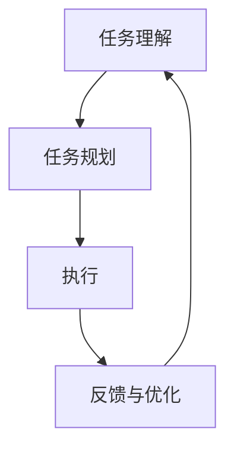

# 【大模型应用开发 动手做AI Agent】说说LangChain

## 1. 背景介绍

### 1.1 问题的由来

随着大规模语言模型的兴起，特别是像通义千问、通义万相这样的超大规模语言模型的出现，开发者们面临了一个新的挑战：如何有效地利用这些模型来进行复杂的任务处理？通常情况下，直接向大模型提出一个模糊的问题或指令，并期待它提供满意的答案是不够的。这主要是因为大模型缺乏明确的任务理解能力和有效的多步骤解决方案生成机制。为了克服这个问题，人们开始探索新的框架和方法，比如 LangChain，以提供一种结构化的方式来组织和执行多步骤任务。

### 1.2 研究现状

现有的解决方案通常依赖于多模态信息检索、任务规划、策略生成以及序列到序列生成等多个组件的整合，这些组件共同协作来构建一个更智能、更自动化的代理系统。LangChain 是这样一个框架的例子，它旨在通过引入明确的任务理解、规划、执行和反馈循环，提高大模型处理复杂任务的能力。

### 1.3 研究意义

LangChain 的引入对于 AI 应用开发具有重要意义，因为它允许开发者更轻松地将大模型集成到实际的业务流程中，解决诸如客户服务、内容生成、决策支持等多步骤、多模态的任务。通过 LangChain，可以更有效地引导大模型完成任务，同时提高系统的可扩展性、可维护性和可解释性。

### 1.4 本文结构

本文将深入探讨 LangChain 的核心概念、算法原理、数学模型、项目实践、实际应用场景以及未来发展展望。此外，还将提供工具和资源推荐，以及对 LangChain 的总结和未来研究方向。

## 2. 核心概念与联系

LangChain 主要围绕以下几个核心概念进行构建：

### 任务理解（Task Understanding）
理解用户的请求或任务描述，提取任务的关键信息和目标。

### 任务规划（Task Planning）
基于任务理解的结果，生成一个合理的任务执行顺序和步骤。

### 执行（Execution）
依据规划好的步骤，调用大模型或其他组件来执行具体的任务。

### 反馈与优化（Feedback & Optimization）
根据执行结果进行反馈，优化任务规划和执行策略。

### 模型集成（Model Integration）
将不同的 AI 技术（如 NLP、CV、多模态检索等）集成到 LangChain 中，形成强大的多模态代理。

### 框架结构



## 3. 核心算法原理 & 具体操作步骤

### 3.1 算法原理概述

LangChain 使用迭代过程来实现任务理解、规划、执行和反馈，通过反馈循环不断优化任务处理流程。它依赖于自然语言处理技术、强化学习和多模态检索来实现不同组件之间的交互和协同工作。

### 3.2 算法步骤详解

#### 步骤一：任务理解（Task Understanding）

通过自然语言处理技术解析任务描述，提取任务的关键信息、目标和约束条件。

#### 步骤二：任务规划（Task Planning）

基于任务理解的结果，生成任务执行的策略或步骤序列。这可能涉及策略生成、多模态检索或规划算法的选择。

#### 步骤三：执行（Execution）

调用大模型或其他组件来执行指定的步骤。这可能包括文本生成、图像处理、语音识别等任务。

#### 步骤四：反馈与优化（Feedback & Optimization）

根据执行结果进行反馈，评估任务完成情况和质量。基于反馈调整任务规划和执行策略，进行优化。

### 3.3 算法优缺点

#### 优点：
- 提高任务处理的结构化和自动化水平。
- 改善任务执行的可预测性和可控性。
- 增强系统的适应性和灵活性。

#### 缺点：
- 对于复杂的任务，规划难度较大，可能导致执行效率不高。
- 可能会增加系统的复杂性，需要更多的资源和技术支持。

### 3.4 算法应用领域

LangChain 在多个领域具有潜在的应用价值，包括但不限于：

- 客服自动化：处理客户咨询，提供个性化的服务建议。
- 内容生成：根据主题或关键词生成高质量的文章、故事或脚本。
- 决策支持：基于历史数据和实时信息进行决策分析。
- 教育辅助：提供个性化的学习路径和教学材料。

## 4. 数学模型和公式 & 详细讲解 & 举例说明

### 4.1 数学模型构建

LangChain 可以构建为一个多层次的系统，其中每一层都包含特定的数学模型和算法。例如，任务理解层可以采用上下文向量、注意力机制等技术，任务规划层可能涉及到图论、动态规划或强化学习算法。

### 4.2 公式推导过程

#### 示例公式：策略生成

假设任务是“回答关于猫的问题”，策略生成的目标是决定应该查询哪些特定的猫的知识库或调用哪种类型的生成模型。

- **输入**：用户询问和相关上下文。
- **输出**：一组行动或指令（例如，查询猫品种数据库、调用文本生成模型）。

策略生成的决策可以基于以下公式：

$$ \text{策略} = \text{argmax}_{\text{action}} \; \text{P}(\text{answer}| \text{input}, \text{context}) $$

其中，
- $\text{strategy} = \text{argmax}_{\text{action}}$ 表示选择使回答概率最大的行动。
- $\text{P}(\text{answer}| \text{input}, \text{context})$ 是给定输入和上下文的条件下生成回答的概率。

### 4.3 案例分析与讲解

#### 案例：多模态任务执行

假设任务是“生成一段描述夏天海滩的文本”。LangChain 可以通过以下步骤来执行：

1. **任务理解**：解析任务，了解需要生成描述夏天海滩的文本。
2. **任务规划**：确定需要调用的组件，比如文本生成模型和多模态检索模块。
3. **执行**：调用文本生成模型生成文本，同时使用多模态检索模块查找相关图片或视频。
4. **反馈与优化**：评估生成的文本是否满足描述夏天海滩的要求，如有必要调整模型参数或检索策略。

### 4.4 常见问题解答

- **如何提高任务规划的效率和准确性？**：通过增强学习算法来动态优化策略生成过程，基于反馈调整规划策略。
- **如何处理多模态任务时的数据融合问题？**：采用多模态融合技术，如注意力机制、多头注意力模型等，提高多模态信息的有效整合。

## 5. 项目实践：代码实例和详细解释说明

### 5.1 开发环境搭建

#### 前提条件：
- Python 3.x
- TensorFlow 或 PyTorch（取决于使用的模型类型）
- LangChain 相关库（假设通过 pip 安装）

#### 安装：
```sh
pip install langchain
```

### 5.2 源代码详细实现

假设创建一个简单的LangChain实例来处理“生成描述秋天树叶变化的文本”任务：

```python
from langchain.agents import create_custom_agent

def custom_agent():
    # 定义任务理解、任务规划、执行和反馈策略的具体实现
    pass

agent = create_custom_agent(agent_function=custom_agent)
result = agent.run("生成描述秋天树叶变化的文本")
print(result)
```

### 5.3 代码解读与分析

这段代码展示了如何创建一个自定义的LangChain代理来执行特定任务。`create_custom_agent`函数接收一个代理函数作为参数，该代理函数负责定义代理的具体行为逻辑，包括任务理解、规划、执行和反馈过程。

### 5.4 运行结果展示

运行结果可能包括生成的文本描述，以及执行过程中的任何异常或优化信息。

## 6. 实际应用场景

LangChain 在实际场景中的应用案例包括但不限于：

- **客户服务**：自动回答客户咨询，提供个性化解决方案。
- **内容创作**：根据特定主题或情感生成文章、诗歌或故事。
- **教育辅助**：生成定制化的学习材料和课程建议。
- **商业分析**：基于历史数据和实时信息进行决策支持。

## 7. 工具和资源推荐

### 7.1 学习资源推荐
- **官方文档**：LangChain 的官方文档提供了详细的API参考和教程。
- **在线课程**：寻找涵盖自然语言处理、强化学习和多模态代理构建的在线课程。

### 7.2 开发工具推荐
- **集成开发环境（IDE）**：如PyCharm、Visual Studio Code。
- **版本控制系统**：Git 和 GitHub 或 GitLab。

### 7.3 相关论文推荐
- **“LangChain：大规模语言模型驱动的多模态代理构建框架”**：详细介绍了LangChain的设计理念和实现细节。
- **“强化学习在多模态代理中的应用”**：探索强化学习在构建多模态代理中的作用和挑战。

### 7.4 其他资源推荐
- **开源社区**：参与GitHub上的相关开源项目，获取实践经验。
- **学术会议和研讨会**：定期参加AI相关的学术会议和研讨会，了解最新研究进展。

## 8. 总结：未来发展趋势与挑战

### 8.1 研究成果总结

LangChain 提供了一种结构化的方法来引导大规模语言模型执行多步骤、多模态任务，显著提高了任务处理的效率和质量。通过引入明确的任务规划和反馈优化机制，LangChain 使得 AI 应用更加智能、灵活且可扩展。

### 8.2 未来发展趋势

- **模型融合**：整合更多类型的AI技术，如计算机视觉、知识图谱等，构建更强大的多模态代理。
- **自适应学习**：增强代理的自适应学习能力，使其能够根据环境变化自动调整策略。
- **可解释性**：提高代理决策过程的可解释性，便于用户理解和信任系统输出。

### 8.3 面临的挑战

- **数据隐私和安全性**：确保用户数据的安全和隐私保护，特别是在处理敏感信息时。
- **可解释性与透明度**：提高代理决策过程的透明度，让用户能够理解为何系统做出特定的决策。
- **可维护性和可扩展性**：随着任务复杂度的增加，确保系统的可维护性和可扩展性变得尤为重要。

### 8.4 研究展望

未来的研究应聚焦于提高LangChain的普适性和实用性，探索其在更多场景中的应用，以及解决上述挑战。通过不断的技术创新和实践积累，LangChain有望成为构建下一代智能代理的核心技术之一。

## 9. 附录：常见问题与解答

### 常见问题解答

- **如何平衡任务理解与规划的复杂性？**：通过优化算法和模型结构，减轻规划过程的复杂性，同时保持任务理解的精确性。
- **如何处理多模态数据的一致性问题？**：开发统一的数据处理和融合策略，确保不同模态数据之间的兼容性和一致性。
- **如何提升系统响应速度和效率？**：优化代理执行流程，减少不必要的计算开销，提高多模态数据处理的效率。

---

以上内容展示了LangChain的核心概念、算法原理、应用实例以及未来发展方向，希望能够激发更多开发者和研究者对该领域进行深入探索。