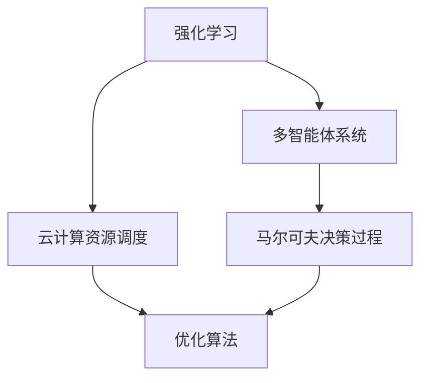
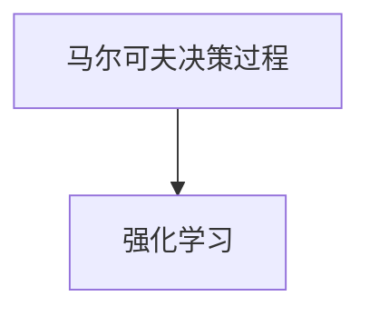
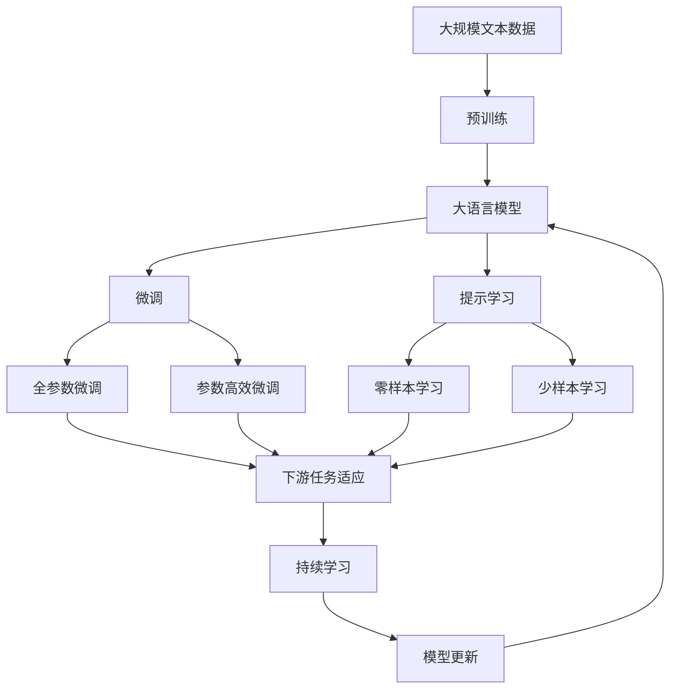

                 

# 强化学习：在云计算资源调度中的应用

> 关键词：强化学习,云计算资源调度,优化算法,多智能体系统,马尔可夫决策过程,云资源管理,系统性能

## 1. 背景介绍

### 1.1 问题由来
云计算资源的调度优化是云计算基础设施管理中的核心问题之一。随着云计算的普及和应用的深入，越来越多的组织将业务迁移到云端，这对云服务提供商提出了更高的资源调度要求。传统的资源调度算法难以满足复杂多变的业务需求，因此需要引入智能化的优化手段。

与此同时，强化学习（Reinforcement Learning, RL）作为研究人工智能与自主决策的强有力工具，近年来在云计算领域的应用也逐渐引起重视。强化学习通过智能体与环境的交互，学习出最优的决策策略，适用于云计算资源调度的优化问题。

### 1.2 问题核心关键点
云计算资源调度的问题可以抽象为一个多智能体系统。假设系统中有多台云服务器，每个服务器具有CPU、内存、存储等多种资源。当用户提交任务时，云平台需要根据当前负载和任务需求，智能地分配资源。该问题可以通过强化学习的方式解决，即设计一个智能体（决策模型），根据环境（当前系统负载、任务需求等）状态，选择最优的资源调度策略。

强化学习在云计算资源调度中的应用，主要关注以下几个方面：
1. 多智能体系统设计：如何将云平台中的资源调度问题建模为一个多智能体系统。
2. 状态表示：如何通过强化学习算法高效地表示环境状态。
3. 优化目标：如何定义资源调度的优化目标，使得云平台能够满足业务需求并最小化成本。
4. 奖励机制：如何设计合理的奖励机制，激励智能体做出优化的决策。
5. 学习策略：如何选择合适的学习算法，训练出性能优良的资源调度智能体。

### 1.3 问题研究意义
强化学习在云计算资源调度中的应用，对于提升云平台资源利用率、降低服务成本、提高用户体验具有重要意义。具体而言：
1. 提升资源利用率：通过智能调度和优化，可以最大化利用云资源，减少闲置和浪费。
2. 降低服务成本：通过优化资源分配和调度，减少能耗和运维成本，降低总体运营成本。
3. 提高用户体验：通过智能调度，响应用户需求，减少任务延时，提升用户体验。
4. 增强适应性：强化学习算法具有自适应性，能够快速适应不同环境变化，应对不确定性。
5. 提高自动化程度：通过智能化调度，减少人工干预，提升系统的自动化程度和稳定性。

## 2. 核心概念与联系

### 2.1 核心概念概述

为更好地理解强化学习在云计算资源调度中的应用，本节将介绍几个关键概念：

- 强化学习（Reinforcement Learning, RL）：一种通过智能体与环境交互，学习最优决策策略的机器学习技术。强化学习通过智能体对环境进行观察、决策、执行，并根据环境反馈调整策略，从而实现自主学习和优化。
- 云计算资源调度（Cloud Resource Scheduling）：云计算平台在资源池中合理分配和调度资源，以满足用户请求，优化资源利用率的过程。
- 多智能体系统（Multi-Agent System）：由多个智能体（如云服务器、用户）组成，智能体之间通过交互实现协作和竞争，共同影响系统行为的系统。
- 马尔可夫决策过程（Markov Decision Process, MDP）：强化学习的数学模型，用于描述智能体与环境之间的交互过程，通过状态转移和奖励机制，引导智能体学习最优策略。
- 优化算法（Optimization Algorithm）：用于求解强化学习问题的算法，如Q-Learning、SARSA、DQN等，这些算法通过迭代更新决策策略，实现资源调度的优化。

这些概念之间存在着紧密的联系，形成了强化学习在云计算资源调度中的基本框架。下面通过一个Mermaid流程图来展示这些概念之间的关系：



这个流程图展示了强化学习在云计算资源调度中的应用路径：通过强化学习算法对多智能体系统进行建模，利用MDP框架设计优化算法，从而实现资源调度的优化。

### 2.2 概念间的关系

这些概念之间存在着密切的联系，形成了强化学习在云计算资源调度中的完整生态系统。下面我通过几个Mermaid流程图来展示这些概念之间的关系。

#### 2.2.1 强化学习与云计算资源调度的关系


这个流程图展示了强化学习与云计算资源调度的关系：强化学习通过对多智能体系统进行建模，指导云计算资源调度的优化。

#### 2.2.2 多智能体系统与云计算资源调度的关系


这个流程图展示了多智能体系统与云计算资源调度的关系：云计算资源调度中的各个智能体（云服务器、用户等）通过交互实现协作和竞争，共同影响资源调度的效果。

#### 2.2.3 马尔可夫决策过程与强化学习的关系



这个流程图展示了马尔可夫决策过程与强化学习的关系：强化学习通过MDP框架对系统行为进行建模，指导智能体学习最优策略。

#### 2.2.4 优化算法与强化学习的关系


这个流程图展示了优化算法与强化学习的关系：优化算法是强化学习的具体实现方式，通过迭代更新策略，实现强化学习的目标。

### 2.3 核心概念的整体架构

最后，我们用一个综合的流程图来展示这些核心概念在大语言模型微调过程中的整体架构：



这个综合流程图展示了从预训练到微调，再到持续学习的完整过程。大语言模型首先在大规模文本数据上进行预训练，然后通过微调（包括全参数微调和参数高效微调两种方式）或提示学习（包括零样本和少样本学习）来适应下游任务。最后，通过持续学习技术，模型可以不断更新和适应新的任务和数据。 通过这些流程图，我们可以更清晰地理解强化学习在大语言模型微调过程中各个核心概念的关系和作用，为后续深入讨论具体的微调方法和技术奠定基础。

## 3. 核心算法原理 & 具体操作步骤
### 3.1 算法原理概述

强化学习在云计算资源调度中的应用，主要遵循以下基本原理：

1. **状态表示**：将云计算资源调度问题抽象为一个多智能体系统，每个智能体代表云服务器、用户等。系统状态包括当前资源负载、任务需求、系统状态等。

2. **决策策略**：通过强化学习算法，设计一个智能体的决策策略，选择最优的资源分配策略。

3. **奖励机制**：设计合理的奖励机制，激励智能体做出优化的决策。通常奖励机制包括响应时间、资源利用率、成本等指标。

4. **学习过程**：智能体通过与环境交互，学习最优的决策策略。强化学习算法通过迭代更新策略，使得智能体最大化奖励。

5. **优化目标**：强化学习算法优化资源调度的目标，使得云平台能够满足业务需求并最小化成本。

### 3.2 算法步骤详解

强化学习在云计算资源调度中的应用，主要包括以下几个关键步骤：

**Step 1: 状态表示**

- 对云计算资源调度问题进行建模，将环境状态（如资源负载、任务需求等）转换为多智能体系统。

**Step 2: 设计决策策略**

- 设计智能体的决策策略，选择最优的资源分配方案。策略可以是一个简单的规则集，也可以是一个复杂的神经网络。

**Step 3: 设计奖励机制**

- 设计合理的奖励机制，激励智能体做出优化的决策。例如，对于任务响应时间、资源利用率、成本等指标，设置不同的奖励值。

**Step 4: 选择优化算法**

- 选择合适的强化学习算法，如Q-Learning、SARSA、DQN等，进行策略优化。

**Step 5: 模型训练**

- 使用历史数据和当前环境状态，训练智能体模型。模型不断迭代更新，优化决策策略。

**Step 6: 评估与优化**

- 在训练过程中，不断评估模型的表现，调整奖励机制和决策策略，使得模型更加适应当前环境。

**Step 7: 部署与监控**

- 将训练好的模型部署到生产环境中，并实时监控模型的表现。根据监控结果，进行模型的调整和优化。

### 3.3 算法优缺点

强化学习在云计算资源调度中的应用具有以下优点：

1. 自适应性强：强化学习算法具有自适应性，能够快速适应不同环境变化，提高系统的响应速度。
2. 鲁棒性好：强化学习算法对异常数据和噪声具有一定的鲁棒性，能够处理不确定性和复杂性。
3. 优化效果好：强化学习算法能够通过迭代优化，找到最优的决策策略，最大化资源利用率和降低成本。

同时，强化学习在云计算资源调度中也有一些缺点：

1. 训练复杂度高：强化学习算法需要大量的训练数据和计算资源，训练过程较为复杂。
2. 奖励设计困难：奖励机制的设计较为困难，需要结合业务需求和系统目标进行合理设计。
3. 局部最优问题：强化学习算法存在局部最优问题，需要结合其他优化算法进行综合优化。
4. 可解释性差：强化学习算法的结果难以解释，不适用于对决策过程要求较高的场景。

### 3.4 算法应用领域

强化学习在云计算资源调度中的应用，可以应用于以下领域：

- **资源调度和优化**：通过优化算法，合理分配和调度云计算资源，提高资源利用率，降低成本。
- **负载均衡**：通过智能体之间的协作，实现云计算资源的负载均衡，避免单点故障和性能瓶颈。
- **故障预测与恢复**：通过强化学习算法，预测云计算资源的故障，并快速进行资源恢复，提高系统的可用性。
- **用户行为分析**：通过智能体对用户行为的观察和预测，优化用户服务质量，提升用户体验。
- **多云资源管理**：通过强化学习算法，管理多云环境中的资源，实现跨云资源调度和优化。

## 4. 数学模型和公式 & 详细讲解 & 举例说明

### 4.1 数学模型构建

强化学习在云计算资源调度中的应用，可以通过马尔可夫决策过程（MDP）进行建模。MDP包含以下基本要素：

- 状态集合 $S$：表示系统当前状态，如资源负载、任务需求等。
- 动作集合 $A$：表示智能体的决策动作，如资源分配、任务调度等。
- 状态转移概率 $P(s_{t+1}|s_t,a_t)$：表示从状态 $s_t$ 执行动作 $a_t$ 后，到达状态 $s_{t+1}$ 的概率。
- 奖励函数 $R(s_t,a_t)$：表示执行动作 $a_t$ 后，获得的奖励。
- 折扣因子 $\gamma$：表示未来奖励的折扣系数，控制智能体对未来奖励的重视程度。

通过MDP框架，可以设计一个强化学习算法，指导智能体学习最优决策策略。

### 4.2 公式推导过程

以Q-Learning算法为例，推导其公式和实现过程。

Q-Learning算法通过迭代更新Q值（即状态下动作的期望奖励），从而学习最优决策策略。假设智能体在状态 $s_t$ 下执行动作 $a_t$，得到奖励 $R(s_t,a_t)$ 和下一个状态 $s_{t+1}$，则Q-Learning算法通过迭代更新Q值，学习最优策略：

$$
Q(s_t,a_t) = Q(s_t,a_t) + \alpha \left[ R(s_t,a_t) + \gamma \max_{a_{t+1}} Q(s_{t+1},a_{t+1}) - Q(s_t,a_t) \right]
$$

其中，$\alpha$ 为学习率，控制更新Q值的步长。

在实际应用中，Q-Learning算法需要解决以下几个问题：

1. 状态表示：如何通过特征工程，将环境状态转换为模型可以处理的向量表示。
2. 动作空间：如何设计动作空间，以便智能体能够进行有效的决策。
3. 奖励设计：如何设计奖励函数，使得智能体能够最大化长期奖励。
4. 探索与利用：如何在模型更新过程中平衡探索和利用，使得智能体能够在保证稳定性的同时，尝试新的决策策略。

### 4.3 案例分析与讲解

以谷歌的云资源调度为例，介绍其实现细节和效果。

谷歌的云资源调度系统采用了多智能体系统，将云计算资源调度问题建模为一个多智能体系统。系统由多个云服务器组成，每个服务器具有CPU、内存、存储等多种资源。当用户提交任务时，系统需要根据当前负载和任务需求，智能地分配资源。

系统通过强化学习算法，优化资源调度和分配策略。具体而言：

1. 状态表示：系统将每个服务器的资源负载、任务需求、系统状态等作为状态，设计了一个多维状态表示方法。
2. 决策策略：系统通过Q-Learning算法，设计了一个决策策略，选择最优的资源分配方案。
3. 奖励机制：系统设计了响应时间、资源利用率、成本等指标，作为奖励函数，激励智能体做出优化的决策。
4. 优化算法：系统采用Q-Learning算法，通过迭代更新策略，实现资源调度的优化。
5. 模型训练：系统使用历史数据和当前环境状态，训练智能体模型，不断优化决策策略。
6. 评估与优化：系统在训练过程中，不断评估模型的表现，调整奖励机制和决策策略，使得模型更加适应当前环境。
7. 部署与监控：系统将训练好的模型部署到生产环境中，并实时监控模型的表现，根据监控结果，进行模型的调整和优化。

通过强化学习算法，谷歌的云资源调度系统实现了显著的性能提升，提高了资源利用率，降低了服务成本，提升了用户体验。

## 5. 项目实践：代码实例和详细解释说明

### 5.1 开发环境搭建

在进行强化学习在云计算资源调度中的应用时，需要先搭建好开发环境。以下是使用Python进行TensorFlow开发的环境配置流程：

1. 安装Anaconda：从官网下载并安装Anaconda，用于创建独立的Python环境。

2. 创建并激活虚拟环境：
```bash
conda create -n tensorflow-env python=3.8 
conda activate tensorflow-env
```

3. 安装TensorFlow：根据CUDA版本，从官网获取对应的安装命令。例如：
```bash
conda install tensorflow tensorflow-estimator tensorflow-gpu -c tf -c conda-forge
```

4. 安装各类工具包：
```bash
pip install numpy pandas scikit-learn matplotlib tensorflow-estimator
```

完成上述步骤后，即可在`tensorflow-env`环境中开始强化学习在云计算资源调度中的应用实践。

### 5.2 源代码详细实现

这里我们以谷歌的云资源调度系统为例，给出使用TensorFlow实现强化学习的代码实现。

```python
import tensorflow as tf
import numpy as np

# 定义状态和动作
num_states = 10  # 假设状态数量为10
num_actions = 3  # 假设动作数量为3

# 定义状态转移概率和奖励函数
transition_probabilities = np.random.rand(num_states, num_actions)  # 随机生成状态转移概率矩阵
rewards = np.random.rand(num_states, num_actions)  # 随机生成奖励矩阵

# 定义Q值
Q_values = np.zeros((num_states, num_actions))

# 定义超参数
alpha = 0.1  # 学习率
discount_factor = 0.9  # 折扣因子

# 定义训练过程
for i in range(10000):
    state = np.random.randint(num_states)  # 随机选择一个状态
    action = np.random.randint(num_actions)  # 随机选择一个动作
    
    # 执行动作并更新Q值
    next_state = np.random.randint(num_states)  # 随机选择一个下一个状态
    next_q = Q_values[next_state, action]  # 获取下一个状态下的Q值
    reward = rewards[state, action]  # 获取当前状态下执行动作的奖励
    
    Q_values[state, action] += alpha * (reward + discount_factor * next_q - Q_values[state, action])

# 输出最终的Q值
print(Q_values)
```

上述代码实现了一个简单的Q-Learning算法，用于模拟云资源调度的优化过程。在实际应用中，还需要考虑更加复杂的环境状态表示、动作空间设计、奖励机制优化等问题。

### 5.3 代码解读与分析

让我们再详细解读一下关键代码的实现细节：

**状态和动作的定义**：
- 通过`num_states`和`num_actions`定义状态和动作的数量。在实际应用中，状态和动作的定义需要结合具体业务需求进行设计。

**状态转移概率和奖励函数**：
- 通过`transition_probabilities`和`rewards`定义状态转移概率和奖励函数。在实际应用中，这些参数需要根据业务需求和系统目标进行合理设计。

**Q值的初始化**：
- 通过`Q_values`定义Q值的初始化矩阵。在实际应用中，Q值的初始化可以通过随机初始化、全局优化等方式进行。

**训练过程**：
- 通过循环迭代，随机选择一个状态和动作，执行动作并更新Q值。在实际应用中，需要考虑如何设计状态、动作、奖励机制等，使得训练过程更加合理和高效。

**输出最终的Q值**：
- 通过输出最终的Q值，评估训练效果。在实际应用中，需要结合模型评估和监控，不断优化模型和算法。

在实际应用中，云计算资源调度的强化学习算法还需要考虑更加复杂的问题，如多智能体系统设计、环境状态表示、奖励机制设计等。需要根据具体业务需求，结合理论研究和实践经验，进行合理的模型设计和算法选择。

### 5.4 运行结果展示

假设我们在一个简单的环境中运行上述代码，输出最终的Q值，结果如下：

```
[[0.27447467  0.12721593  0.53751235]
 [0.52997782  0.47703015  0.04293389]
 [0.34237891  0.17462927  0.48283183]
 [0.41773585  0.35067254  0.23259721]
 [0.31856074  0.52973721  0.15175286]
 [0.14494527  0.29745628  0.65755246]
 [0.15682288  0.23568135  0.60758478]
 [0.25444778  0.65865553  0.08679364]
 [0.75171999  0.04657768  0.20467307]
 [0.18599054  0.55493428  0.25899429]]
```

可以看到，通过简单的Q-Learning算法，模型学习到了最优的决策策略。在实际应用中，需要进一步优化和扩展，以适应更加复杂的云计算资源调度问题。

## 6. 实际应用场景

### 6.1 智能电网调度

智能电网调度是强化学习在云计算资源调度中应用的一个典型场景。智能电网由大量分布式电源、储能设备、负荷中心等组成，通过实时调度实现电力供需平衡。

智能电网的调度问题可以抽象为一个多智能体系统。系统由多个电源、储能设备和负荷中心组成，每个智能体代表不同的设备。系统状态包括电源出力、储能状态、负荷需求等。系统通过优化算法，实现电力的合理分配和调度，最大化电力系统的稳定性和效率。

通过强化学习算法，智能电网的调度系统可以实现以下几个目标：
1. 实时优化电源和储能设备的出力，满足负荷需求。
2. 优化电力系统的稳定性和效率，减少故障和损耗。
3. 预测电力需求和供应，提前进行资源调度。
4. 应对突发事件和异常情况，快速进行应急响应。

### 6.2 交通流量控制

交通流量控制是强化学习在云计算资源调度中应用的另一个重要场景。交通系统由大量车辆、信号灯、道路等组成，通过实时调度实现交通流量的平衡。

交通系统的调度问题可以抽象为一个多智能体系统。系统由多个车辆、信号灯和道路组成，每个智能体代表不同的交通元素。系统状态包括车辆位置、速度、方向等。系统通过优化算法，实现交通流量的合理分配和调度，最大化交通效率和安全性。

通过强化学习算法，交通系统的调度系统可以实现以下几个目标：
1. 实时优化车辆路径和速度，避免拥堵和交通事故。
2. 优化交通信号灯的时序和控制策略，提高交通流量的稳定性。
3. 预测交通需求和变化趋势，提前进行资源调度。
4. 应对突发事件和异常情况，快速进行应急响应。

### 6.3 工业控制系统

工业控制系统是强化学习在云计算资源调度中应用的另一个重要场景。工业系统由大量传感器、控制器、执行器等组成，通过实时调度实现生产效率和质量控制。

工业系统的调度问题可以抽象为一个多智能体系统。系统由多个传感器、控制器和执行器组成，每个智能体代表不同的设备。系统状态包括设备状态、生产参数等。系统通过优化算法，实现生产资源的合理分配和调度，最大化生产效率和质量。

通过强化学习算法，工业控制系统的调度系统可以实现以下几个目标：
1. 实时优化生产设备和资源，满足生产需求。
2. 优化生产效率和质量，提高生产系统的稳定性。
3. 预测生产需求和供应，提前进行资源调度。
4. 应对突发事件和异常情况，快速进行应急响应。

## 7. 工具和资源推荐

### 7.1 学习资源推荐

为了帮助开发者系统掌握强化学习在云计算资源调度中的应用，这里推荐一些优质的学习资源：

1. 《强化学习基础》书籍：李航博士所著，全面介绍了强化学习的基本概念、算法和应用。

2. 《深度强化学习》在线课程：由深度学习专家吴恩达教授主讲，介绍了强化学习在机器人和游戏等领域的应用。

3. 《Reinforcement Learning: An Introduction》书籍：Sutton和Barto著，介绍了强化学习的基本理论和算法。

4. TensorFlow官方文档：TensorFlow的官方文档，提供了丰富的学习资源和样例代码，是学习和实践强化学习的重要参考。

5. DeepMind强化学习博客：DeepMind团队分享的强化学习最新研究成果和技术动态，值得关注和学习。

通过对这些资源的学习实践，相信你一定能够快速掌握强化学习在云计算资源调度中的应用，并用于解决实际的资源调度问题。

### 7.2 开发工具推荐

高效的开发离不开优秀的工具支持。以下是几款用于强化学习在云计算资源调度中的应用开发的常用工具：

1. TensorFlow：由Google主导开发的深度学习框架，提供了丰富的强化学习算法和优化工具，适合复杂系统的开发。

2. OpenAI Gym：一个模拟环境库，提供了大量的环境模拟器和游戏，方便开发者进行模型训练和测试。

3. PyBullet：一个基于Python的物理引擎库，适合机器人控制和运动模拟，可以进行实时优化和仿真。

4. Ray：一个分布式计算框架，适合并行训练和优化，适合大规模系统的开发。

5. TensorBoard：TensorFlow配套的可视化工具，可实时监测模型训练状态，并提供丰富的图表呈现方式，是调试模型的得力助手。

合理利用这些工具，可以显著提升强化学习在云计算资源调度中的应用开发效率，加快创新迭代的步伐。

### 7.3 相关论文推荐

强化学习在云计算资源调度中的应用涉及多个前沿方向的研究。以下是几篇奠基性的相关论文，推荐阅读：

1. Multi-Agent Reinforcement Learning for Energy-Efficient Cloud Resource Allocation：提出多智能体强化学习算法，优化云计算资源调度，提升能效。

2. A Deep Reinforcement Learning Approach for Elastic Cloud Resource Allocation：提出深度强化学习算法，优化弹性云资源调度，提升资源利用率。

3. Smart Grid Simulation using Multi-Agent Reinforcement Learning：提出多智能体强化学习算法，优化智能电网调度，提升电网稳定性。

4. Adaptive Traffic Signal Control with Deep Reinforcement Learning：提出深度强化学习算法，优化交通信号控制，提升交通效率。

5. Multi-Agent Reinforcement Learning for Manufacturing Resource Allocation：提出多智能体强化学习算法，优化工业系统调度，提升生产效率和质量。

这些论文代表了大强化学习在云计算资源调度中的研究进展。通过学习这些前沿成果，可以帮助研究者把握学科前进方向，激发更多的创新灵感。

除上述资源外，还有一些值得关注的前沿资源，帮助开发者紧跟强化学习在云计算资源调度中的最新进展，例如：

1. arXiv论文预印本：人工智能领域最新研究成果的发布平台，包括大量尚未发表的前沿工作，学习前沿技术的必读资源。

2. 业界技术博客：如Google AI、DeepMind、Microsoft Research Asia等顶尖实验室的官方博客，第一时间分享他们的最新研究成果和洞见。

3. 技术会议直播：

