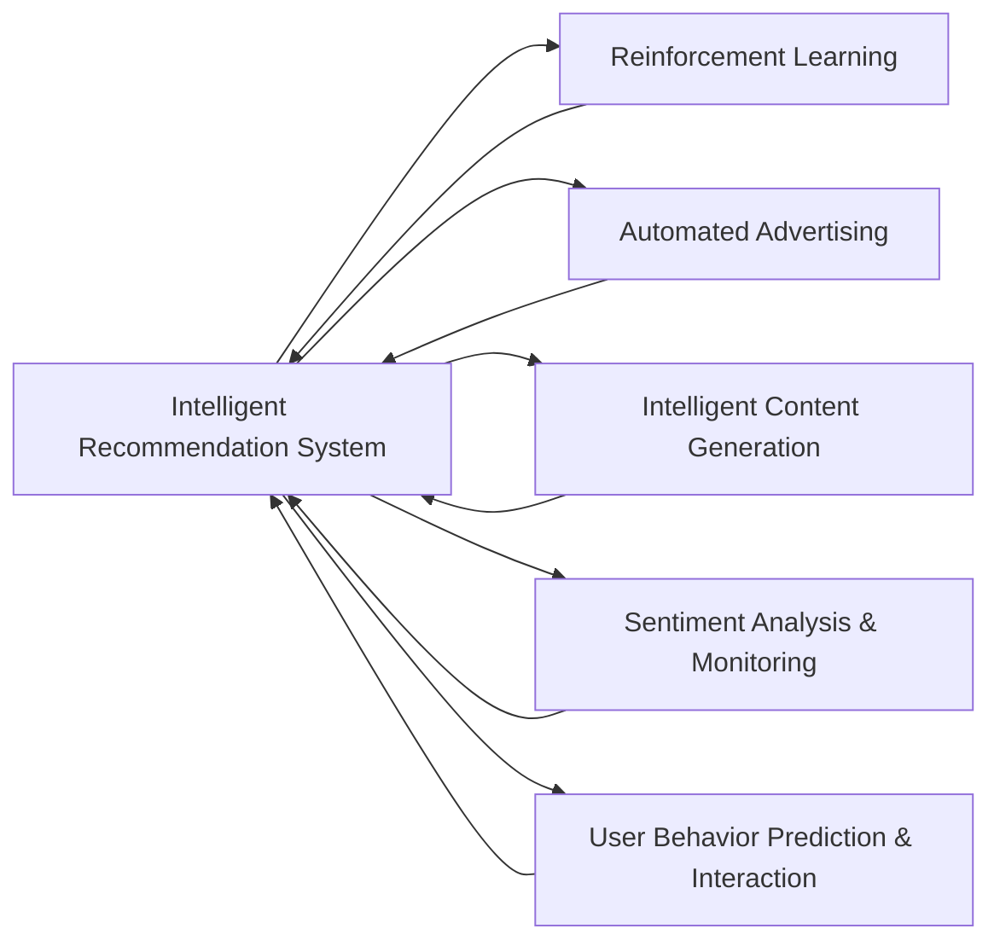

                 

# 强化学习：在媒体行业中的应用

## 1. 背景介绍

随着互联网和信息技术的飞速发展，媒体行业发生了翻天覆地的变化。传统的内容生产、分发和互动模式正在被大数据、云计算、人工智能等新兴技术所颠覆。在新的技术浪潮中，如何通过智能化手段提升媒体产品的内容质量、传播效率和用户体验，成为业界关注的焦点。

强化学习作为一种基于试错训练机器的智能算法，其决策过程与媒体行业的运作模式高度契合。通过构建模拟环境，强化学习可以自动优化内容推荐、广告投放、用户行为预测等多个环节的策略，极大地提升了媒体行业的智能化水平。

### 1.1 问题由来

强化学习在媒体行业的应用，起源于早期对推荐系统、广告投放等场景的研究。推荐系统通过学习用户历史行为，预测用户对未接触过的内容的喜好，从而实现个性化推荐。广告投放则通过不断调整投放策略，最大化广告点击率和转化率。这些应用展示了强化学习在智能推荐和自动化广告优化上的强大能力。

随后，强化学习在内容生成、舆情监测、用户互动等更多媒体领域得到了拓展应用。例如，通过强化学习，智能内容生成器可以自动生成新闻报道、文章摘要、音乐歌词等高质量内容，提升内容创作效率和创新性。舆情监测系统可以实时跟踪分析海量文本数据，及时发现并处理负面舆情，保障媒体组织的声誉安全。互动聊天机器人则通过学习用户的对话历史，实现更自然、高效的用户互动，提升用户体验。

这些应用展示了强化学习在媒体行业的广泛价值，激发了对其更深入研究的热情。本文将详细介绍强化学习的基本原理、操作步骤、优缺点和应用领域，并结合具体案例和代码实现，帮助读者深入理解强化学习在媒体行业中的应用。

### 1.2 问题核心关键点

强化学习在媒体行业应用的核心关键点如下：

- **智能推荐系统**：通过优化推荐算法，提升内容推荐的相关性和用户体验。
- **自动化广告投放**：通过不断调整广告策略，最大化广告效果和ROI。
- **智能内容生成**：通过学习大量文本数据，生成高质量的内容。
- **舆情监测与应对**：通过实时跟踪分析舆情数据，及时发现并处理负面舆情。
- **用户行为预测与互动**：通过学习用户互动历史，提升聊天机器人的智能水平和用户体验。

这些关键点构成了强化学习在媒体行业应用的基础，通过深入研究，可以帮助媒体机构在各个环节提升智能化水平，更好地服务用户。

## 2. 核心概念与联系

### 2.1 核心概念概述

在强化学习中，有几个关键概念需要详细解释：

- **强化学习**：通过智能体与环境的交互，通过不断试错，学习最优决策策略的过程。
- **智能体**：执行决策的实体，可以是人、机器人、程序等。
- **环境**：智能体作用的虚拟或实际环境，包含状态和反馈机制。
- **状态**：环境当前的状态，智能体决策的依据。
- **动作**：智能体对环境的作用，影响环境的状态。
- **奖励**：环境对智能体动作的反馈，用于评估动作的价值。
- **策略**：智能体在各个状态下选择动作的策略，如策略$\Pi(a|s)$表示在状态$s$下选择动作$a$的概率。

这些概念通过环境、智能体和奖励的交互，共同构成强化学习的基本框架。

### 2.2 概念间的关系

强化学习与媒体行业的联系可以通过以下Mermaid流程图来展示：



这个流程图展示了强化学习在媒体行业各应用场景中的应用，并说明了它们之间的联系。

## 3. 核心算法原理 & 具体操作步骤

### 3.1 算法原理概述

强化学习的核心目标是学习一个策略，使智能体在特定环境中获得最大化的长期奖励。其基本原理可以概括为：

1. **环境建模**：构建环境的数学模型，定义状态空间和动作空间。
2. **智能体设计**：选择合适的智能体模型，如Q-learning、SARSA、Deep Q-Network等。
3. **策略学习**：通过试错训练，学习最优策略$\Pi^*$，使得智能体在各个状态下选择最优动作，最大化长期奖励。

强化学习的目标是找到最优策略$\Pi^*$，使得对于任意状态$s$，智能体采取的动作$a$满足$\Pi^*(a|s)=1$，且期望长期奖励最大化。

### 3.2 算法步骤详解

强化学习的具体操作步骤如下：

1. **初始化环境**：定义状态空间和动作空间，随机初始化智能体的状态$s_0$。
2. **选择动作**：根据当前状态$s_t$和智能体的策略$\Pi$，选择动作$a_t$。
3. **执行动作**：将动作$a_t$应用于环境，观察下一个状态$s_{t+1}$和奖励$r_{t+1}$。
4. **更新策略**：根据当前状态$s_t$、动作$a_t$、下一个状态$s_{t+1}$和奖励$r_{t+1}$，更新智能体的策略$\Pi$。
5. **重复执行**：重复以上步骤，直到策略收敛。

### 3.3 算法优缺点

强化学习的优点包括：

- **适应性强**：通过试错训练，适应各种复杂环境。
- **自驱动力强**：智能体通过奖励信号驱动，能够不断优化策略。
- **学习效果显著**：在推荐系统、广告投放等场景中，强化学习能够显著提升效果和效率。

强化学习的缺点包括：

- **探索与利用矛盾**：智能体需要在探索新动作和利用已有策略之间找到平衡。
- **易受状态空间影响**：在复杂或高维度状态空间中，强化学习的训练难度较大。
- **难以解释**：强化学习的决策过程复杂，难以解释和调试。

### 3.4 算法应用领域

强化学习在媒体行业中的应用领域广泛，具体如下：

- **推荐系统**：通过学习用户行为数据，优化推荐策略，提升内容相关性和用户体验。
- **广告投放**：通过不断调整投放策略，最大化广告点击率和转化率。
- **内容生成**：通过学习大量文本数据，生成高质量的内容。
- **舆情监测**：通过实时跟踪分析舆情数据，及时发现并处理负面舆情。
- **用户互动**：通过学习用户互动历史，提升聊天机器人的智能水平和用户体验。

## 4. 数学模型和公式 & 详细讲解 & 举例说明

### 4.1 数学模型构建

强化学习的数学模型包括状态空间、动作空间、状态转移概率和奖励函数。以下定义一个简单的马尔可夫决策过程：

- **状态空间**：$\mathcal{S}$，包含所有可能的状态。
- **动作空间**：$\mathcal{A}$，包含所有可能的动作。
- **状态转移概率**：$p(s_{t+1}|s_t,a_t)$，表示在状态$s_t$下采取动作$a_t$后，下一个状态$s_{t+1}$的概率。
- **奖励函数**：$r(s_t,a_t)$，表示在状态$s_t$下采取动作$a_t$后，环境的奖励。

强化学习的目标是找到最优策略$\Pi^*$，使得期望长期奖励最大化。

### 4.2 公式推导过程

以Q-learning算法为例，推导其更新公式。Q-learning算法通过学习状态-动作值函数$Q(s_t,a_t)$，来评估智能体在状态$s_t$下采取动作$a_t$的价值。状态-动作值函数的更新公式为：

$$
Q(s_t,a_t) \leftarrow Q(s_t,a_t) + \alpha(r_t + \gamma \max_{a} Q(s_{t+1},a) - Q(s_t,a_t))
$$

其中$\alpha$为学习率，$\gamma$为折扣因子。

### 4.3 案例分析与讲解

假设有一个简单的新闻推荐系统，智能体需要根据用户的历史浏览记录，推荐最受欢迎的新闻。具体步骤如下：

1. **环境建模**：定义状态为用户的历史浏览记录，动作为用户浏览某一新闻的行为，奖励为用户浏览新闻的点击率和停留时间。
2. **智能体设计**：使用Q-learning算法，学习用户浏览记录与新闻选择之间的关联。
3. **策略学习**：通过试错训练，智能体逐渐学习到哪些新闻最能吸引用户，选择最优的新闻推荐策略。

## 5. 项目实践：代码实例和详细解释说明

### 5.1 开发环境搭建

在使用Python进行强化学习开发时，首先需要安装相关依赖包，如TensorFlow、PyTorch、OpenAI Gym等。可以通过以下命令进行安装：

```bash
pip install tensorflow pytorch gym openai gym[atari]
```

完成安装后，可以通过Jupyter Notebook或Google Colab等环境进行开发。

### 5.2 源代码详细实现

以下是一个简单的新闻推荐系统的Q-learning实现示例：

```python
import numpy as np
import gym

class NewsRecommender:
    def __init__(self, env, alpha=0.1, gamma=0.9, epsilon=0.1):
        self.env = env
        self.alpha = alpha
        self.gamma = gamma
        self.epsilon = epsilon
        self.q_table = np.zeros([self.env.observation_space.n, self.env.action_space.n])

    def choose_action(self, state):
        if np.random.uniform(0, 1) < self.epsilon:
            action = self.env.action_space.sample()
        else:
            action = np.argmax(self.q_table[state, :])
        return action

    def update_q_table(self, state, action, reward, next_state):
        q_pred = self.q_table[state, action]
        q_next = np.max(self.q_table[next_state, :])
        self.q_table[state, action] += self.alpha * (reward + self.gamma * q_next - q_pred)

    def train(self, num_episodes):
        for episode in range(num_episodes):
            state = self.env.reset()
            done = False
            while not done:
                action = self.choose_action(state)
                next_state, reward, done, _ = self.env.step(action)
                self.update_q_table(state, action, reward, next_state)
                state = next_state
```

在上述代码中，我们定义了一个新闻推荐系统，使用Q-learning算法更新状态-动作值函数$q_table$。

### 5.3 代码解读与分析

代码中，我们首先定义了智能体的类`NewsRecommender`，初始化了环境、学习率、折扣因子和探索率等参数。

在`choose_action`方法中，我们根据当前状态和探索率，选择最优动作或随机动作。

在`update_q_table`方法中，我们使用Q-learning的更新公式，根据当前状态、动作、奖励和下一个状态，更新状态-动作值函数$q_table$。

在`train`方法中，我们使用循环训练智能体，每次迭代选择一个动作，观察下一个状态和奖励，并更新状态-动作值函数。

### 5.4 运行结果展示

在训练完毕后，我们可以通过观察智能体在不同状态下的动作选择，来评估其学习效果。以下是一个简单的可视化展示：

```python
import matplotlib.pyplot as plt

plt.plot(self.q_table[:, self.env.action_space.n-1])
plt.xlabel('Episode')
plt.ylabel('Q-value')
plt.show()
```

## 6. 实际应用场景

### 6.1 智能推荐系统

智能推荐系统是强化学习在媒体行业应用的重要场景。通过学习用户历史行为数据，智能推荐系统可以优化推荐策略，提升内容相关性和用户体验。

具体而言，智能推荐系统可以实时分析用户浏览历史、点击记录、评分数据等，通过强化学习算法，学习用户偏好和兴趣点，生成个性化的推荐内容。在推荐过程中，智能推荐系统不断调整推荐策略，以最大化用户的满意度。

### 6.2 自动化广告投放

自动化广告投放是强化学习的另一大应用场景。通过不断调整广告投放策略，智能体可以实现最大化广告效果和ROI。

在实际应用中，广告投放系统可以根据实时数据（如用户行为、设备信息、地理位置等），动态调整广告投放的渠道、频率和时间，以最大化点击率和转化率。智能广告投放系统通过强化学习算法，学习最优的广告投放策略，实现广告效果的持续优化。

### 6.3 智能内容生成

智能内容生成是强化学习在媒体行业的新兴应用。通过学习大量文本数据，智能内容生成器可以自动生成高质量的内容，如新闻报道、文章摘要、音乐歌词等。

在实际应用中，智能内容生成器可以实时生成内容，并通过自然语言处理技术进行语法和语义检查，确保生成的内容质量。智能内容生成器通过强化学习算法，学习最优的内容生成策略，提升内容的创新性和吸引力。

### 6.4 舆情监测与应对

舆情监测是强化学习在媒体行业的另一重要应用。通过实时跟踪分析舆情数据，智能体可以及时发现并处理负面舆情，保障媒体组织的声誉安全。

在实际应用中，舆情监测系统可以实时分析社交媒体、新闻报道、论坛评论等海量文本数据，通过强化学习算法，学习舆情变化规律，及时发现和处理负面舆情。智能舆情监测系统通过不断优化监测策略，提高舆情处理的效率和效果。

### 6.5 用户行为预测与互动

用户行为预测与互动是强化学习在媒体行业的另一重要应用。通过学习用户互动历史，智能体可以实现更自然、高效的用户互动，提升用户体验。

在实际应用中，智能聊天机器人可以实时分析用户对话历史，通过强化学习算法，学习用户的对话偏好和行为模式，生成更自然、准确的回答。智能聊天机器人通过不断优化对话策略，提升用户互动的满意度和体验。

## 7. 工具和资源推荐

### 7.1 学习资源推荐

1. **《强化学习：一种现代方法》**：Richard S. Sutton 和 Andrew G. Barto 的经典教材，全面介绍了强化学习的理论基础和算法实现。
2. **《深度强化学习》**：Ian Osband 等人合著的书籍，介绍了深度强化学习的最新进展和应用实例。
3. **《Reinforcement Learning: An Introduction》**：Richard S. Sutton 和 Andrew G. Barto 的入门书籍，适合初学者了解强化学习的核心概念和算法。
4. **Google DeepMind 博客**：DeepMind 的官方博客，发布了大量前沿研究成果和应用案例，适合学习最新的强化学习技术。
5. **OpenAI Gym**：OpenAI Gym 是一个流行的强化学习环境，包含多种环境和任务，适合实验和实践。

### 7.2 开发工具推荐

1. **TensorFlow**：Google 开发的深度学习框架，支持多种算法和模型，适合大规模应用开发。
2. **PyTorch**：Facebook 开发的深度学习框架，灵活易用，适合研究和实验。
3. **Gym**：OpenAI Gym 是一个流行的强化学习环境，支持多种环境和任务，适合实验和实践。
4. **Jupyter Notebook**：一个交互式笔记本，支持多种编程语言和数据可视化，适合学习和实践。
5. **Google Colab**：Google 提供的免费 Jupyter Notebook 环境，支持GPU/TPU计算，适合研究和实验。

### 7.3 相关论文推荐

1. **"Q-learning for Profit"**：Tom M. Mitchell，探讨了Q-learning在推荐系统中的应用。
2. **"Deep Reinforcement Learning for Personalized News Recommendation"**：Qing Liu 等，介绍了一种基于深度强化学习的个性化新闻推荐系统。
3. **"Deep Q-Network for Personalized Video Recommendation"**：Qing Liu 等，介绍了一种基于深度 Q-Network 的个性化视频推荐系统。
4. **"Deep Reinforcement Learning for Automated Advertising"**：Wenhao Zeng 等，探讨了深度强化学习在自动化广告投放中的应用。
5. **"Reinforcement Learning for Content Creation"**：Tao Lin 等，介绍了一种基于强化学习的内容生成系统。

## 8. 总结：未来发展趋势与挑战

### 8.1 研究成果总结

本文详细介绍了强化学习在媒体行业中的应用，包括智能推荐系统、自动化广告投放、智能内容生成、舆情监测与应对、用户行为预测与互动等多个方面。通过详细讲解强化学习的基本原理、操作步骤和优缺点，帮助读者深入理解强化学习的核心思想和应用场景。

### 8.2 未来发展趋势

强化学习在媒体行业的应用前景广阔，未来将呈现以下几个发展趋势：

1. **个性化推荐系统**：通过深度强化学习，实现更准确、更高效的个性化推荐，提升用户体验和满意度。
2. **自动化广告投放**：通过强化学习算法，实现更智能、更精准的广告投放策略，最大化广告效果和ROI。
3. **智能内容生成**：通过强化学习算法，自动生成高质量的内容，提升内容创作效率和创新性。
4. **舆情监测与应对**：通过强化学习算法，实时监测舆情数据，及时发现并处理负面舆情，保障媒体组织的声誉安全。
5. **用户行为预测与互动**：通过强化学习算法，实现更自然、高效的用户互动，提升用户体验。

### 8.3 面临的挑战

尽管强化学习在媒体行业的应用取得了显著进展，但仍面临诸多挑战：

1. **探索与利用矛盾**：在复杂环境中，智能体需要在探索新动作和利用已有策略之间找到平衡。
2. **状态空间复杂**：在复杂或高维度状态空间中，强化学习的训练难度较大。
3. **奖励设计**：奖励函数的设计需要考虑多方面因素，如点击率、转化率、用户满意度等。
4. **可解释性不足**：强化学习的决策过程复杂，难以解释和调试。
5. **资源消耗**：大规模强化学习任务需要大量计算资源，难以实时部署。

### 8.4 研究展望

未来，强化学习在媒体行业的研究需要解决以下几个问题：

1. **探索与利用平衡**：研究新的算法和策略，解决探索与利用的矛盾，提升智能体的学习效率。
2. **状态空间优化**：研究高效的状态表示方法，降低状态空间维度，提升训练效率。
3. **奖励函数设计**：研究更有效的奖励函数设计方法，提升智能体的学习效果和策略质量。
4. **可解释性增强**：研究新的可解释性技术，增强强化学习模型的可解释性和可调试性。
5. **资源优化**：研究高效的算法和模型压缩方法，提升强化学习系统的资源利用率和实时性。

总之，强化学习在媒体行业的应用前景广阔，但也面临着诸多挑战。通过不断探索和优化，相信强化学习技术将能够更好地服务于媒体行业，提升内容质量、传播效率和用户体验。

## 9. 附录：常见问题与解答

**Q1: 强化学习与传统推荐系统有什么区别？**

A: 强化学习与传统推荐系统的主要区别在于训练方式和决策策略。传统推荐系统通常基于用户历史行为数据，通过机器学习模型预测用户对未接触过内容的喜好。而强化学习通过试错训练，动态调整策略，最大化长期奖励。强化学习推荐系统能够更好地应对复杂环境，动态优化推荐策略，提升用户满意度。

**Q2: 强化学习在媒体行业有哪些应用？**

A: 强化学习在媒体行业有以下几个主要应用：
1. 智能推荐系统：通过学习用户行为数据，优化推荐策略，提升内容相关性和用户体验。
2. 自动化广告投放：通过不断调整投放策略，最大化广告效果和ROI。
3. 智能内容生成：通过学习大量文本数据，生成高质量的内容。
4. 舆情监测与应对：通过实时跟踪分析舆情数据，及时发现并处理负面舆情。
5. 用户行为预测与互动：通过学习用户互动历史，提升聊天机器人的智能水平和用户体验。

**Q3: 如何选择合适的强化学习算法？**

A: 选择合适的强化学习算法需要考虑以下几个因素：
1. 任务复杂度：简单任务可以使用Q-learning、SARSA等基本算法，复杂任务需要使用如Deep Q-Network、Actor-Critic等深度强化学习算法。
2. 状态空间大小：高维度状态空间需要使用深度强化学习算法，如Deep Q-Network、Deep Deterministic Policy Gradient (DDPG)等。
3. 数据可得性：如果数据量较小，可以使用基于模型的强化学习算法，如Q-learning、SARSA；如果数据量较大，可以使用基于数据的强化学习算法，如Deep Q-Network。

总之，选择合适的强化学习算法需要根据具体任务和数据特点进行综合考虑，以达到最优的学习效果。

**Q4: 强化学习在媒体行业面临哪些挑战？**

A: 强化学习在媒体行业面临以下几个挑战：
1. 探索与利用矛盾：在复杂环境中，智能体需要在探索新动作和利用已有策略之间找到平衡。
2. 状态空间复杂：在复杂或高维度状态空间中，强化学习的训练难度较大。
3. 奖励设计：奖励函数的设计需要考虑多方面因素，如点击率、转化率、用户满意度等。
4. 可解释性不足：强化学习的决策过程复杂，难以解释和调试。
5. 资源消耗：大规模强化学习任务需要大量计算资源，难以实时部署。

解决这些挑战需要不断探索和优化，研究新的算法和策略，提升强化学习模型的学习效果和可解释性。

**Q5: 强化学习在媒体行业有哪些优势？**

A: 强化学习在媒体行业有以下几个主要优势：
1. 适应性强：通过试错训练，适应各种复杂环境。
2. 自驱动力强：智能体通过奖励信号驱动，能够不断优化策略。
3. 学习效果显著：在推荐系统、广告投放等场景中，强化学习能够显著提升效果和效率。

总之，强化学习在媒体行业的应用前景广阔，通过不断探索和优化，能够更好地服务于媒体行业，提升内容质量、传播效率和用户体验。

---

作者：禅与计算机程序设计艺术 / Zen and the Art of Computer Programming

