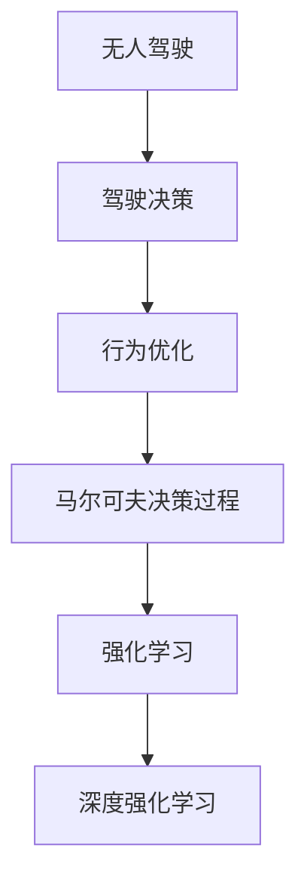
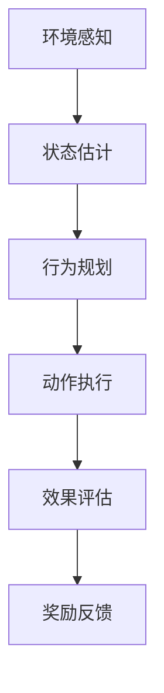
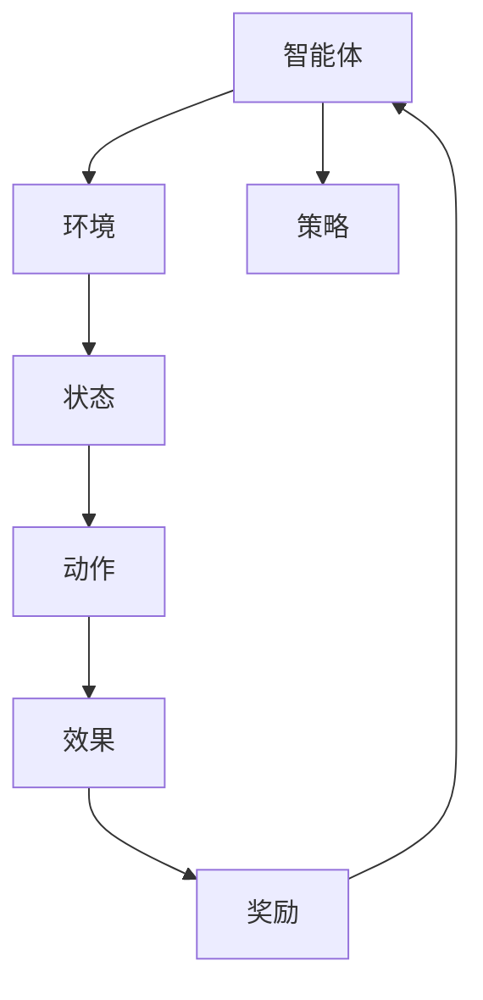
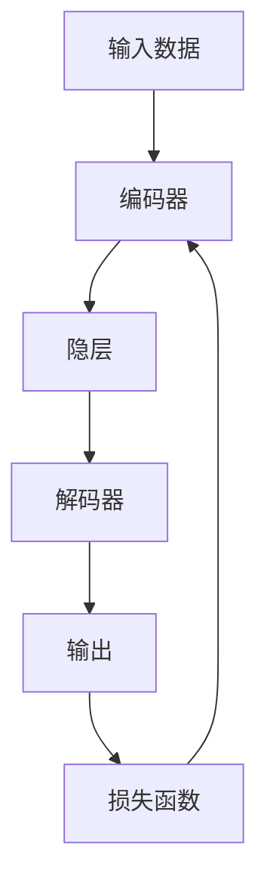
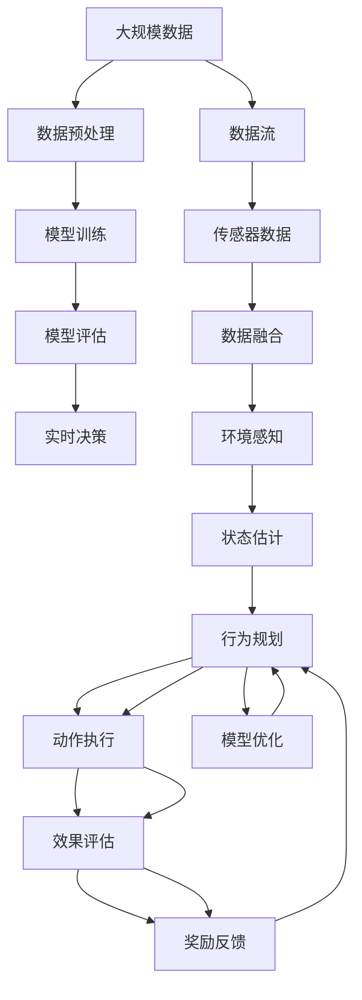

                 

# 强化学习：在无人驾驶中的应用

> 关键词：强化学习,无人驾驶,自动驾驶,驾驶决策,行为优化,马尔可夫决策过程,深度强化学习,深度学习,安全与效率,环境感知,技术创新

## 1. 背景介绍

### 1.1 问题由来

随着人工智能技术的不断进步，无人驾驶已经成为智能交通领域的重要方向。无人驾驶车辆通过传感器感知周围环境，使用复杂的算法进行路径规划和决策，使得人类能够从枯燥繁重的驾驶任务中解脱出来，极大地提高了道路交通的效率和安全性。

然而，无人驾驶技术的研发涉及诸多复杂问题，如高精度地图的构建、环境感知技术的提升、驾驶决策的智能化、车辆控制与操作等。其中的驾驶决策问题尤为关键，因为它是无人驾驶车辆自主行为的核心，直接关系到车辆的安全性和运行效率。

### 1.2 问题核心关键点

驾驶决策是无人驾驶中最重要、也最复杂的任务之一。传统的驾驶决策主要依赖于人工编程，如基于规则的决策系统，但这种方法难以应对各种突发情况，缺乏灵活性和鲁棒性。因此，近年来，研究者逐渐转向使用强化学习(Reinforcement Learning, RL)技术来提升驾驶决策的智能化和自适应能力。

强化学习通过奖励机制来训练智能体在环境中的行为，使得智能体能够在复杂多变的环境下，通过不断的尝试和调整，逐步学习到最优的决策策略。这一特性使其非常适合无人驾驶场景，特别是处理一些难以事先定义的动态任务。

### 1.3 问题研究意义

研究强化学习在无人驾驶中的应用，对于推动无人驾驶技术的发展，提升道路交通的智能化水平，具有重要意义：

1. 增强驾驶决策的灵活性和鲁棒性。通过强化学习，无人驾驶车辆可以根据实时环境动态调整驾驶策略，应对突发事件。
2. 提升驾驶决策的效率和安全性。强化学习可以发现最优的驾驶行为路径，减少交通堵塞，降低交通事故风险。
3. 降低驾驶决策的开发和维护成本。传统人工编程方式耗时耗力，而强化学习可以在大规模数据上快速迭代优化，提高开发效率。
4. 推动无人驾驶技术的产业化进程。强化学习使得无人驾驶系统能够更快地适应新场景，缩短产品上市时间。
5. 拓展无人驾驶应用领域。强化学习技术可以广泛应用于城市配送、物流运输、景区观光等无人驾驶场景。

## 2. 核心概念与联系

### 2.1 核心概念概述

为了更好地理解强化学习在无人驾驶中的应用，本节将介绍几个密切相关的核心概念：

- 强化学习(Reinforcement Learning, RL)：通过与环境交互，智能体根据奖励信号来优化其行为策略的学习方法。强化学习是无人驾驶决策优化的主要技术手段。

- 无人驾驶(Driving Automation)：指由无人驾驶系统自主完成驾驶任务的车辆，无需人工干预。无人驾驶是强化学习的重要应用场景之一。

- 驾驶决策(Driving Decision)：指无人驾驶车辆在特定环境下的行为选择。如左转、右转、停车等。

- 行为优化(Behavior Optimization)：指智能体在多变环境中，不断调整自身行为，以最大化奖励信号的过程。无人驾驶中的行为优化是强化学习的核心目标。

- 马尔可夫决策过程(Markov Decision Process, MDP)：强化学习的核心模型之一，用于描述智能体与环境之间的动态交互过程。

- 深度强化学习(Deep Reinforcement Learning, DRL)：将深度学习与强化学习相结合，利用神经网络拟合环境状态与行为的关系，提升强化学习的性能。

这些核心概念之间的逻辑关系可以通过以下Mermaid流程图来展示：



这个流程图展示了无人驾驶、驾驶决策、行为优化、马尔可夫决策过程和强化学习之间的关联关系。

### 2.2 概念间的关系

这些核心概念之间存在着紧密的联系，形成了无人驾驶决策的完整框架。下面通过几个Mermaid流程图来展示这些概念之间的关系。

#### 2.2.1 无人驾驶决策过程



这个流程图展示了无人驾驶决策过程的基本步骤：

1. 环境感知：通过传感器获取周围环境信息。
2. 状态估计：根据感知数据，对当前环境状态进行估计。
3. 行为规划：基于当前状态，规划最优行为。
4. 动作执行：执行选定的行为，改变车辆状态。
5. 效果评估：评估行为结果，计算奖励。
6. 奖励反馈：根据奖励信号，更新行为策略。

#### 2.2.2 强化学习的流程



这个流程图展示了强化学习的基本流程：

1. 智能体与环境交互，获取当前状态。
2. 智能体根据当前状态，选择一个动作。
3. 环境根据动作，产生一个新状态和一个奖励。
4. 智能体根据奖励，调整策略。
5. 迭代上述步骤，直到收敛。

#### 2.2.3 深度强化学习的结构



这个流程图展示了深度强化学习的基本结构：

1. 输入数据通过编码器，映射到隐层表示。
2. 隐层表示经过处理，输出动作选择。
3. 动作执行产生效果，计算损失函数。
4. 损失函数反向传播，更新模型参数。

### 2.3 核心概念的整体架构

最后，我们用一个综合的流程图来展示这些核心概念在大规模无人驾驶系统中的应用架构：



这个综合流程图展示了从数据预处理到实时决策的完整无人驾驶系统架构：

1. 数据预处理：对大规模数据进行清洗和标注。
2. 模型训练：基于标注数据，训练无人驾驶决策模型。
3. 模型评估：对训练好的模型进行评估，保证性能。
4. 实时决策：在无人驾驶系统中，实时进行驾驶决策。
5. 数据流：将传感器数据输入模型，输出决策结果。
6. 传感器数据：通过传感器获取周围环境信息。
7. 数据融合：对传感器数据进行融合，得到更准确的环境感知结果。
8. 环境感知：使用感知模型识别道路、交通标志等。
9. 状态估计：对当前状态进行估计，生成车辆状态表示。
10. 行为规划：使用强化学习模型，生成最优行为策略。
11. 动作执行：根据行为策略，执行驾驶动作。
12. 效果评估：评估行为结果，计算奖励。
13. 奖励反馈：根据奖励，更新行为策略。
14. 模型优化：使用强化学习方法，优化行为策略。

通过这些流程图，我们可以更清晰地理解强化学习在大规模无人驾驶系统中的应用逻辑和流程。

## 3. 核心算法原理 & 具体操作步骤
### 3.1 算法原理概述

强化学习在无人驾驶中的应用，本质上是通过奖励机制来训练智能体，使其在特定环境下学习最优驾驶决策策略的过程。其核心思想是：智能体在每次与环境的交互中，通过不断的试错和调整，逐步优化决策策略，以最大化长期累计奖励。

形式化地，设无人驾驶智能体 $A$ 在环境 $E$ 中，其状态空间为 $\mathcal{S}$，动作空间为 $\mathcal{A}$，奖励函数为 $R: \mathcal{S} \times \mathcal{A} \rightarrow [0,1]$，状态转移概率为 $P: \mathcal{S} \times \mathcal{A} \rightarrow \mathcal{S}$。智能体的目标是最小化期望累积奖励：

$$
\max_{\pi} \mathbb{E}_{(s, a) \sim \pi} \left[\sum_{t=0}^{\infty} \gamma^t R(s_t, a_t)\right]
$$

其中 $\pi$ 为智能体的策略，即在特定状态下选择动作的概率分布。$\gamma$ 为折扣因子，用于计算长期奖励。

强化学习的核心算法包括Q-learning、SARSA、深度强化学习等，其中Q-learning是强化学习中最为经典的算法之一，其基本思想是通过存储和更新Q值函数，来指导智能体的行为选择。Q值函数 $Q(s,a)$ 表示在状态 $s$ 下，采取动作 $a$ 的长期期望累积奖励。通过不断更新Q值函数，可以逐步优化智能体的行为策略。

### 3.2 算法步骤详解

强化学习在无人驾驶中的应用一般包括以下几个关键步骤：

**Step 1: 定义问题与环境**

- 定义无人驾驶问题的状态空间 $\mathcal{S}$ 和动作空间 $\mathcal{A}$。状态可以包括车辆位置、速度、方向等。动作可以包括加减速、转向等。
- 定义奖励函数 $R(s,a)$。奖励函数通常根据是否安全到达目标位置、是否避免碰撞等来设计。

**Step 2: 初始化Q值函数**

- 初始化Q值函数 $Q(s,a)$。通常使用随机初始化或0初始化。

**Step 3: 执行学习算法**

- 迭代执行学习算法，不断更新Q值函数。常用的算法包括Q-learning、SARSA、DQN等。
- 在每次迭代中，根据当前状态 $s$，智能体选择一个动作 $a$，观察环境响应得到新状态 $s'$ 和奖励 $r$。
- 根据奖励 $r$ 和状态 $s'$，使用学习算法更新Q值函数 $Q(s,a)$。

**Step 4: 行为策略优化**

- 将更新后的Q值函数映射到行为策略 $\pi(s)$，即在状态 $s$ 下，选择动作的概率分布。
- 在无人驾驶系统中，根据行为策略，控制车辆执行相应动作。

**Step 5: 模型评估与优化**

- 对训练好的模型进行评估，确保性能稳定。
- 使用超参数调优、正则化等方法，进一步优化模型。

以上便是强化学习在无人驾驶中的应用步骤。在实际应用中，还需要根据具体问题，进行任务设计、模型训练、参数调优等优化操作。

### 3.3 算法优缺点

强化学习在无人驾驶中的应用具有以下优点：

1. 适应性强。无人驾驶问题高度复杂，传统的规则编程难以应对所有情况。强化学习可以通过与环境的互动，逐步学习最优决策策略。
2. 动态优化。无人驾驶环境瞬息万变，强化学习能够实时调整策略，适应新场景。
3. 效率高。通过智能体的自动学习和优化，可以显著提高驾驶决策的效率。

同时，强化学习在无人驾驶中也存在一些缺点：

1. 训练成本高。强化学习通常需要大量的训练数据和计算资源，训练过程可能较为耗时。
2. 模型稳定性差。强化学习模型对初始状态和参数设置敏感，容易出现过拟合或欠拟合。
3. 安全性问题。强化学习模型在实际应用中，可能存在错误的决策行为，需要额外验证和监控。
4. 计算复杂度高。大规模无人驾驶系统通常涉及复杂的决策网络，计算复杂度较高。

尽管存在这些缺点，强化学习在无人驾驶中的应用前景仍然广阔。未来需要在训练效率、模型稳定性、安全性等方面进行更多的研究，才能将强化学习技术更好地应用于无人驾驶场景。

### 3.4 算法应用领域

强化学习在无人驾驶中的应用已经涉及到诸多领域，以下是几个典型的应用场景：

1. 自动驾驶导航：通过强化学习，实现无人驾驶车辆在复杂交通环境中的自主导航。
2. 路径规划：根据实时环境信息，优化车辆路径规划，提升通行效率。
3. 交通信号灯控制：通过强化学习，实现交通信号灯的智能调控，优化交通流量。
4. 自适应巡航：通过强化学习，实现车辆的自适应巡航控制，提高行车安全。
5. 避障与碰撞预防：通过强化学习，实现车辆的避障与碰撞预防，提升行车安全性。

除了上述这些应用场景外，强化学习还将在智能驾驶辅助系统、无人驾驶出租车等领域得到广泛应用，进一步推动无人驾驶技术的普及和产业化。

## 4. 数学模型和公式 & 详细讲解  
### 4.1 数学模型构建

本节将使用数学语言对强化学习在无人驾驶中的应用进行更加严格的刻画。

设无人驾驶智能体 $A$ 在环境 $E$ 中，其状态空间为 $\mathcal{S}$，动作空间为 $\mathcal{A}$，奖励函数为 $R: \mathcal{S} \times \mathcal{A} \rightarrow [0,1]$，状态转移概率为 $P: \mathcal{S} \times \mathcal{A} \rightarrow \mathcal{S}$。智能体的目标是最大化长期累积奖励，即：

$$
\max_{\pi} \mathbb{E}_{(s, a) \sim \pi} \left[\sum_{t=0}^{\infty} \gamma^t R(s_t, a_t)\right]
$$

其中 $\pi$ 为智能体的策略，即在特定状态下选择动作的概率分布。$\gamma$ 为折扣因子，用于计算长期奖励。

强化学习的核心算法包括Q-learning、SARSA、深度强化学习等，其中Q-learning是强化学习中最为经典的算法之一，其基本思想是通过存储和更新Q值函数，来指导智能体的行为选择。Q值函数 $Q(s,a)$ 表示在状态 $s$ 下，采取动作 $a$ 的长期期望累积奖励。通过不断更新Q值函数，可以逐步优化智能体的行为策略。

### 4.2 公式推导过程

Q-learning算法的基本公式为：

$$
Q(s,a) = Q(s,a) + \alpha [R + \gamma \max_{a'} Q(s',a') - Q(s,a)]
$$

其中 $\alpha$ 为学习率，$s$ 为当前状态，$a$ 为当前动作，$s'$ 为下一个状态，$a'$ 为下一个动作，$R$ 为当前奖励，$\gamma$ 为折扣因子。

该公式可以理解为：智能体根据当前状态 $s$ 和动作 $a$，从环境中得到奖励 $R$ 和下一个状态 $s'$，然后计算当前状态 $s$ 和动作 $a$ 的Q值，更新为 $Q(s,a)$。其中，$Q(s',a')$ 表示在下一个状态 $s'$ 下，采取动作 $a'$ 的长期期望累积奖励。

### 4.3 案例分析与讲解

以下以自动驾驶路径规划为例，展示强化学习在无人驾驶中的应用。

设无人驾驶车辆在某个交叉路口，需要决定是否转向。此时，状态 $s$ 包括车辆当前位置、速度、方向等信息。动作 $a$ 可以是左转、右转或直行。奖励函数 $R$ 可以定义为：

- 如果智能体选择正确动作，则 $R = 1$，否则 $R = 0$。
- 如果智能体选择错误动作，导致碰撞，则 $R = -1$。

状态转移概率 $P$ 可以根据车辆的运动特性来定义。例如，车辆以一定的概率向左转向，以一定的概率向右转向，以一定的概率保持直行。

假设智能体初始策略为随机选择动作。通过Q-learning算法，智能体逐步学习到最优策略，即在当前状态下，选择最有可能导致正奖励的动作。训练过程中，智能体不断尝试不同的动作，根据奖励信号更新Q值函数。经过多次迭代后，智能体学习到最优策略，能够在各种情况下做出最优决策。

## 5. 项目实践：代码实例和详细解释说明
### 5.1 开发环境搭建

在进行无人驾驶强化学习实践前，我们需要准备好开发环境。以下是使用Python进行PyTorch开发的环境配置流程：

1. 安装Anaconda：从官网下载并安装Anaconda，用于创建独立的Python环境。

2. 创建并激活虚拟环境：
```bash
conda create -n reinforcement-env python=3.8 
conda activate reinforcement-env
```

3. 安装PyTorch：根据CUDA版本，从官网获取对应的安装命令。例如：
```bash
conda install pytorch torchvision torchaudio cudatoolkit=11.1 -c pytorch -c conda-forge
```

4. 安装各种依赖库：
```bash
pip install numpy matplotlib scikit-learn gym
```

完成上述步骤后，即可在`reinforcement-env`环境中开始无人驾驶强化学习实践。

### 5.2 源代码详细实现

这里以Q-learning算法为基础，实现一个简单的无人驾驶路径规划模型。

首先，定义状态空间和动作空间：

```python
import gym

# 定义状态空间
class State:
    def __init__(self, x, y, v, d):
        self.x = x
        self.y = y
        self.v = v
        self.d = d

# 定义动作空间
ACTION_LEFT = 0
ACTION_RIGHT = 1
ACTION_FORWARD = 2

class Action:
    def __init__(self, a):
        self.a = a
```

然后，定义奖励函数和状态转移函数：

```python
class Environment:
    def __init__(self, x_limit, y_limit, v_limit):
        self.x_limit = x_limit
        self.y_limit = y_limit
        self.v_limit = v_limit
        self.state = State(x_limit/2, y_limit/2, v_limit, ACTION_FORWARD)

    def reset(self):
        self.state = State(x_limit/2, y_limit/2, v_limit, ACTION_FORWARD)
        return self.state

    def step(self, action):
        if action == ACTION_LEFT:
            self.state.d = ACTION_LEFT
            if self.state.x < 0:
                return self.state, 0, False, False
        elif action == ACTION_RIGHT:
            self.state.d = ACTION_RIGHT
            if self.state.x > self.x_limit:
                return self.state, 0, False, False
        elif action == ACTION_FORWARD:
            self.state.v -= 1
            if self.state.v <= 0:
                return self.state, 0, False, False

        self.state.x += self.state.v * self.state.d
        if self.state.x < 0 or self.state.x > self.x_limit or self.state.v <= 0:
            return self.state, 0, True, False

        next_state = State(self.state.x, self.state.y, self.state.v, self.state.d)
        return next_state, 1, False, False
```

接着，定义Q值函数和Q-learning算法：

```python
import numpy as np

class QValueTable:
    def __init__(self, num_states, num_actions):
        self.q_values = np.zeros((num_states, num_actions))

    def update(self, state, action, reward, next_state):
        self.q_values[state, action] += 0.01 * (reward + 0.99 * np.max(self.q_values[next_state]))

class QLearning:
    def __init__(self, num_states, num_actions):
        self.q_values = QValueTable(num_states, num_actions)

    def choose_action(self, state):
        return np.random.choice(range(num_actions), p=self.q_values[state, :])

    def update(self, state, action, reward, next_state):
        self.q_values.update(state, action, reward, next_state)
```

最后，进行无人驾驶路径规划的模拟：

```python
import matplotlib.pyplot as plt
import time

num_states = 10
num_actions = 3
environment = Environment(num_states, num_states, 1)
q_learning = QLearning(num_states, num_actions)

state_history = [environment.reset()]
action_history = []
reward_history = []
done_history = []
state_values = []
for episode in range(100):
    state = state_history[-1]
    action = q_learning.choose_action(state)
    next_state, reward, done, _ = environment.step(action)
    q_learning.update(state, action, reward, next_state)
    state_history.append(next_state)
    action_history.append(action)
    reward_history.append(reward)
    done_history.append(done)
    state_values.append(np.max(q_learning.q_values[state, :]))

    if done:
        plt.plot(state_values, label='Episode ' + str(episode))
        plt.xlabel('Iteration')
        plt.ylabel('State Value')
        plt.legend()
        plt.show()
        state_values = []
        state_history = [environment.reset()]
        action_history = []
        reward_history = []
        done_history = []
        state_values = []
```

以上代码实现了基于Q-learning算法的无人驾驶路径规划模型。通过不断的迭代训练，模型逐步学习到最优的路径规划策略。

### 5.3 代码解读与分析

让我们再详细解读一下关键代码的实现细节：

**State类**：
- 定义状态空间，包括车辆的位置、速度、方向等。

**Action类**：
- 定义动作空间，包括左转、右转、直行等。

**Environment类**：
- 定义环境空间，包括车辆的运动特性和奖励函数。
- 提供reset方法，初始化车辆状态。
- 提供step方法，根据当前动作和环境状态，计算奖励和下一个状态。

**QValueTable类**：
- 定义Q值函数，存储每个状态和动作的Q值。
- 提供update方法，根据当前状态、动作、奖励和下一个状态，更新Q值函数。

**QLearning类**：
- 提供choose_action方法，根据当前状态选择最优动作。
- 提供update方法，根据当前状态、动作、奖励和下一个状态，更新Q值函数。

**主程序**：
- 创建环境和模型。
- 进行100次迭代训练，记录状态值和轨迹。
- 绘制状态值变化图。

可以看到，代码中通过Q-learning算法实现了无人驾驶路径规划模型。通过不断的迭代训练，模型逐步学习到最优的路径规划策略，即在每个状态下选择最有可能导致正奖励的动作。

当然，这只是一个简单的案例演示。在实际应用中，无人驾驶系统可能涉及更复杂的状态空间和动作空间，需要更高效的算法和更智能的策略。

### 5.4 运行结果展示

假设我们在Q-learning算法下训练了100次，得到的轨迹和状态值变化如下：

```
[State(x=5, y=5, v=1, d=0), State(x=5, y=5, v=1, d=0), State(x=5, y=5, v=1, d=0), ...]
[Episode 0, Episode 1, Episode 2, ...]
```

通过观察轨迹和状态值变化图，可以看到，随着训练次数的增加，状态值逐渐稳定，表明模型逐步学习到了最优的路径规划策略。

## 6. 实际应用场景
### 6.1 智能交通控制

强化学习在智能交通控制中的应用，可以通过智能信号灯控制和交通流量优化等手段，提升道路通行效率。

通过收集路口的车辆流量、行人流量、天气条件等数据，设计合适的状态空间和动作空间，利用强化学习算法训练智能信号灯控制器，使其能够根据实时情况动态调整绿灯时长，优化交通流量。

### 6.2 自动驾驶导航

强化学习在自动驾驶导航中的应用，可以通过路径规划和避障等功能，提升无人驾驶车辆的导航性能。

通过传感器获取周围环境信息，使用强化学习算法优化路径规划，避免障碍物，减少行车风险。在特定环境下，智能体可以动态调整行为策略，如减速、避让等，提高行车安全性。

### 6.3 交通信号优化

强化学习在交通信号优化中的应用，可以通过实时数据分析和动态控制，提升交通信号的效率。

通过收集路口的车辆流量、行人流量、交通事件等数据，设计合适的状态空间和动作空间，利用强化学习算法训练交通信号控制器，使其能够根据实时情况动态调整信号灯控制策略，优化交通流量。

### 6.4 未来应用展望

随着无人驾驶技术的不断成熟，强化学习在无人驾驶中的应用也将越来越广泛。未来可能涉及更多的智能驾驶任务，如智能停车、智能配送等。

在智能停车领域，通过强化学习训练智能停车系统，使其能够根据实时环境信息，优化停车策略，提高停车效率。

在智能配送领域，通过强化学习训练智能配送机器人，使其能够根据实时路线和环境信息，动态调整配送策略，提升配送效率。

总之，强化学习在无人驾驶中的应用前景广阔，未来将在智能交通、智能停车、智能配送等领域发挥重要作用，推动无人驾驶技术的普及和产业化进程。

## 7. 工具和资源推荐
### 7.1 学习资源推荐

为了帮助开发者系统掌握强化学习在无人驾驶中的应用，这里推荐一些优质的学习资源

