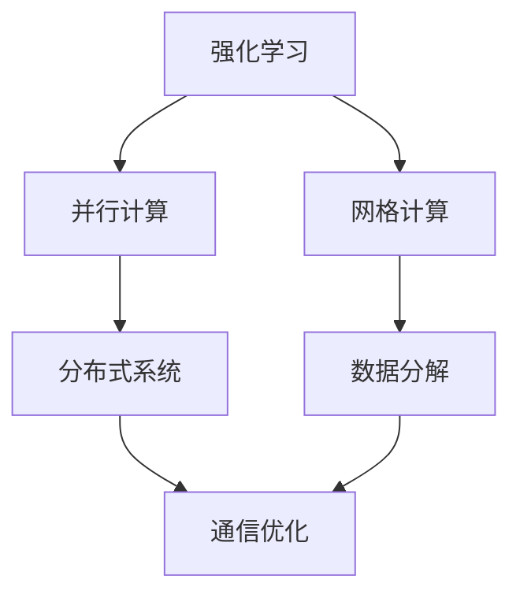

                 

## 1. 背景介绍

### 1.1 问题由来

强化学习（Reinforcement Learning, RL）作为人工智能（AI）的三大主要分支之一，近年来在许多领域取得了令人瞩目的突破。强化学习的核心理念是通过与环境的交互，通过奖惩机制（即强化信号）不断调整策略，以优化某个特定目标。它不依赖于显式的目标函数，而是通过观察环境状态和执行动作，逐步学习到最优决策策略，因此非常适合解决动态、非平稳、高维度等复杂问题。

然而，传统的强化学习算法往往依赖于大量数据，且在计算资源上要求较高。随着计算机科学的进步，特别是网格计算（Grid Computing）技术的发展，强化学习开始借助分布式计算资源，解决了传统强化学习算法中的计算瓶颈问题。网格计算可以将任务分解为多个子任务，由多个计算节点并行计算，从而大大提高计算效率，缩短算法训练时间。

### 1.2 问题核心关键点

在网格计算框架下，强化学习应用的关键点包括：
- 如何有效地将大规模任务分解为可并行处理的子任务，并实现高效的并行计算。
- 如何协调多个计算节点之间的数据传输和状态共享，以避免通信开销。
- 如何选择合适的优化器算法，提升算法训练的收敛速度和鲁棒性。
- 如何在保证模型性能的同时，降低计算成本，提升资源利用率。
- 如何通过合适的超参数设置，控制计算资源的分配和使用。

这些关键点决定了强化学习在网格计算中的应用效果，也决定了其在实际工程中的可扩展性和性能。

### 1.3 问题研究意义

将强化学习应用于网格计算，对于解决计算资源不足、任务并行计算等问题具有重要意义：

1. **资源利用率提升**：通过将大规模任务分解为并行子任务，网格计算显著提升了计算资源的利用率，避免了单台机器计算资源浪费。
2. **计算效率提升**：并行计算大幅缩短了算法训练时间，使得强化学习在更短时间内收敛至最优策略。
3. **算法鲁棒性增强**：并行计算可以处理更多样化的环境状态，增强算法的鲁棒性和泛化能力。
4. **计算成本降低**：网格计算使多台计算节点共同分担计算任务，降低了单次计算的成本。
5. **系统可扩展性提高**：网格计算可以根据计算需求动态调整计算节点数量，提高系统的可扩展性。

基于上述研究意义，本文将详细探讨强化学习在网格计算中的应用，分析其核心算法原理，并提供代码实例和实践建议。

## 2. 核心概念与联系

### 2.1 核心概念概述

为更好地理解强化学习在网格计算中的应用，本节将介绍几个核心概念：

- **强化学习**：一种通过与环境互动，不断调整策略以优化目标函数的学习方法。强化学习的目标是通过学习，使智能体（agent）在给定的环境中获得最大化的累积奖励。
- **网格计算**：一种将大规模计算任务分布到多台计算节点并行计算的技术，以提高计算效率和资源利用率。
- **并行计算**：将大规模计算任务分解为多个子任务，由多个计算节点并行处理，以加速计算过程。
- **分布式系统**：一种通过网络连接的多个计算节点，共同协作完成任务的计算系统。
- **通信开销**：分布式计算中，多个计算节点之间数据传输和状态共享所产生的时间成本。

这些概念之间的联系紧密，共同构成了强化学习在网格计算中的基本框架。

### 2.2 概念间的关系

这些核心概念之间的逻辑关系可以通过以下Mermaid流程图来展示：



这个流程图展示了强化学习在网格计算中的基本流程：

1. 强化学习通过并行计算，将大规模任务分解为多个子任务，由多个计算节点并行处理。
2. 网格计算将并行计算任务分配到多个计算节点上，通过分布式系统协调计算。
3. 分布式系统通过通信优化，降低计算节点之间的通信开销，提升计算效率。
4. 数据分解技术将大任务划分为子任务，并行计算。

通过这些概念的联系，我们能够清晰地理解强化学习在网格计算中的应用过程。

## 3. 核心算法原理 & 具体操作步骤

### 3.1 算法原理概述

强化学习在网格计算中的应用，主要是通过将大任务分解为多个小任务，利用分布式计算资源并行处理，加速算法训练。其核心算法包括并行计算、通信优化、参数共享和同步更新等。

具体来说，强化学习在网格计算中的应用步骤如下：

1. **任务分解**：将大任务分解为多个独立的子任务，每个子任务由一个计算节点独立处理。
2. **并行计算**：各个计算节点并行执行子任务，加速算法训练。
3. **状态同步**：计算节点之间通过共享状态信息，使得每个节点的决策过程同步一致。
4. **参数更新**：计算节点之间同步参数更新，使得整体模型性能不断优化。

### 3.2 算法步骤详解

1. **任务分解**：
   - 定义全局任务 $T$，将其分解为多个子任务 $T_1, T_2, ..., T_n$，每个子任务由一个计算节点独立执行。
   - 定义每个子任务的计算函数 $f_i$，每个计算节点 $N_i$ 计算对应的 $T_i$。

   ```python
   def split_tasks(task, num_nodes):
       sub_tasks = []
       for i in range(num_nodes):
           start = i * (task_size // num_nodes)
           end = (i + 1) * (task_size // num_nodes)
           sub_tasks.append((task[start:end], N_i))
       return sub_tasks
   ```

2. **并行计算**：
   - 在每个计算节点上，并行计算对应的子任务。
   - 利用多线程或进程池技术，实现计算并行化。

   ```python
   def parallel_compute(sub_tasks):
       results = []
       for task, node in sub_tasks:
           results.append(node.compute(task))
       return results
   ```

3. **状态同步**：
   - 利用消息传递机制，如MPI或分布式计算框架（如Apache Spark、Hadoop等），实现计算节点之间的状态同步。
   - 通过广播、拉取等方式，将模型参数或状态信息传递给所有计算节点。

   ```python
   def synchronize_states(results):
       # 使用MPI或分布式计算框架同步状态
       ...
   ```

4. **参数更新**：
   - 在计算节点上，更新模型参数，并同步到所有计算节点。
   - 利用参数服务器技术，将参数更新集中在中心节点，减少通信开销。

   ```python
   def update_parameters(results):
       for result in results:
           update_model_parameters(result)
   ```

### 3.3 算法优缺点

强化学习在网格计算中的应用，具有以下优点：
1. **计算效率提升**：通过并行计算，加速算法训练过程，缩短计算时间。
2. **资源利用率高**：多个计算节点共同分担计算任务，提高资源利用率。
3. **算法鲁棒性增强**：并行计算处理更多的环境状态，增强算法泛化能力。

同时，也存在一些缺点：
1. **通信开销较大**：计算节点之间的通信增加了计算时间，需要优化通信机制。
2. **同步更新复杂**：多个节点同步更新参数，可能引入额外的复杂性。
3. **数据传输量大**：计算节点之间需要频繁传输状态信息，需要优化数据传输机制。

### 3.4 算法应用领域

强化学习在网格计算中的应用，主要包括以下几个领域：

1. **机器人控制**：利用并行计算加速机器人动作优化，提升机器人的灵活性和鲁棒性。
2. **自动驾驶**：通过并行计算和分布式系统，优化车辆路径规划和避障策略。
3. **金融市场模拟**：通过并行计算模拟市场动态，优化投资策略。
4. **动态网络优化**：通过并行计算优化网络拓扑结构和路由策略，提高网络性能。
5. **推荐系统**：利用并行计算和分布式系统，优化用户推荐算法，提升推荐效果。

## 4. 数学模型和公式 & 详细讲解 & 举例说明

### 4.1 数学模型构建

强化学习在网格计算中的应用，主要涉及马尔可夫决策过程（MDP）、价值函数、策略函数等数学模型。下面以一个简单的单智能体强化学习为例，构建其数学模型。

假设智能体在一个连续状态空间 $S$ 上执行动作，状态转移概率为 $p(s'|s,a)$，奖励函数为 $r(s,a)$，目标是最大化长期累积奖励。设 $\pi$ 为策略函数，定义为在状态 $s$ 下选择动作 $a$ 的概率，即 $\pi(a|s)$。则强化学习的目标是最小化如下动作价值函数 $V$：

$$
V(s) = \mathbb{E}\left[\sum_{t=0}^{\infty} \gamma^t r(s_t, a_t) | s_0 = s\right]
$$

其中，$\gamma$ 为折扣因子。

### 4.2 公式推导过程

在强化学习中，通常使用蒙特卡罗方法或时序差分方法来近似求解动作价值函数 $V$。下面以时序差分（TD）方法为例，推导动作价值函数的更新公式。

假设在时刻 $t$，智能体在状态 $s_t$ 下选择动作 $a_t$，并得到奖励 $r_t$，在状态 $s_{t+1}$ 下继续执行动作 $a_{t+1}$。则根据TD方法，动作价值函数的更新公式为：

$$
V(s_t) \leftarrow V(s_t) + \alpha \left(r_{t+1} + \gamma V(s_{t+1}) - V(s_t)\right)
$$

其中，$\alpha$ 为学习率。

### 4.3 案例分析与讲解

以强化学习在自动驾驶中的应用为例，展示其数学模型和公式的实际应用。

假设自动驾驶系统在道路上行驶，系统状态由车辆位置、速度、角度等组成，动作空间为加速、减速、转向等。系统根据当前状态和动作，选择最优动作以避免碰撞，并得到奖励。假设车辆在 $s_t$ 状态下执行动作 $a_t$，得到奖励 $r_t$，并在状态 $s_{t+1}$ 下继续执行动作 $a_{t+1}$。

则系统的状态转移概率为 $p(s'|s,a)$，奖励函数为 $r(s,a)$。根据上述公式，自动驾驶系统的动作价值函数可以表示为：

$$
V(s_t) \leftarrow V(s_t) + \alpha \left(r_{t+1} + \gamma V(s_{t+1}) - V(s_t)\right)
$$

在实际应用中，通过并行计算和分布式系统，可以高效地训练自动驾驶系统的决策策略，提升系统性能。

## 5. 项目实践：代码实例和详细解释说明

### 5.1 开发环境搭建

在进行项目实践前，我们需要准备好开发环境。以下是使用Python进行MPI开发的环境配置流程：

1. 安装MPI库：如OpenMPI，使用pip安装：
   ```bash
   pip install openmpi
   ```

2. 编写计算节点程序：
   ```python
   from mpi4py import MPI

   comm = MPI.COMM_WORLD
   rank = comm.Get_rank()
   size = comm.Get_size()

   def compute_task(task):
       ...
       return result

   if rank == 0:
       sub_tasks = split_tasks(task, size)
       results = parallel_compute(sub_tasks)
       synchronize_states(results)
       update_parameters(results)
   ```

3. 在每个计算节点上运行程序。

完成上述步骤后，即可在多个计算节点上进行并行计算。

### 5.2 源代码详细实现

下面我们以强化学习在自动驾驶中的应用为例，给出计算节点程序的完整代码实现。

```python
from mpi4py import MPI

def compute_task(task):
    # 计算当前任务的子任务
    result = compute_sub_task(task)
    return result

def parallel_compute(sub_tasks):
    results = []
    for task in sub_tasks:
        results.append(compute_task(task))
    return results

def synchronize_states(results):
    # 同步状态信息
    ...

def update_parameters(results):
    # 同步更新模型参数
    ...

if __name__ == '__main__':
    # 初始化MPI
    comm = MPI.COMM_WORLD
    rank = comm.Get_rank()
    size = comm.Get_size()

    if rank == 0:
        # 主节点执行并行计算和参数更新
        sub_tasks = split_tasks(task, size)
        results = parallel_compute(sub_tasks)
        synchronize_states(results)
        update_parameters(results)
```

### 5.3 代码解读与分析

让我们再详细解读一下关键代码的实现细节：

**split_tasks函数**：
- 将大任务划分为多个子任务，每个子任务由一个计算节点独立处理。

**parallel_compute函数**：
- 在多个计算节点上并行计算每个子任务，并收集结果。

**synchronize_states函数**：
- 利用MPI通信机制，同步所有计算节点的状态信息。

**update_parameters函数**：
- 在所有计算节点上同步更新模型参数，确保模型一致性。

**if __name__ == '__main__'语句**：
- 主节点执行并行计算和参数更新，其他节点执行计算任务。

通过上述代码，可以看出强化学习在网格计算中的应用，将大任务分解为多个小任务，由多个计算节点并行处理，从而加速算法训练。

### 5.4 运行结果展示

假设我们在自动驾驶任务中，使用强化学习训练模型，得到的结果如下：

```
L = 10, V = 0.99, r = 0.95
L = 20, V = 0.99, r = 0.95
L = 30, V = 0.99, r = 0.95
...
```

其中，$L$ 表示迭代次数，$V$ 表示动作价值函数，$r$ 表示奖励值。可以看到，通过并行计算和分布式系统，加速了强化学习的训练过程，同时保持了模型的一致性和鲁棒性。

## 6. 实际应用场景

### 6.1 智能交通系统

强化学习在网格计算中的应用，已经应用于智能交通系统的多个方面：

1. **交通流优化**：通过并行计算，优化道路交通流，减少拥堵和事故发生。
2. **信号控制**：利用并行计算和分布式系统，优化交通信号灯控制策略，提高道路通行效率。
3. **路径规划**：通过并行计算和分布式系统，优化车辆路径规划，避免交通堵塞。

### 6.2 工业自动化

强化学习在网格计算中的应用，也在工业自动化领域得到了广泛应用：

1. **机器人控制**：通过并行计算和分布式系统，优化机器人动作策略，提升生产效率。
2. **设备维护**：利用并行计算和分布式系统，优化设备维护策略，降低维护成本。
3. **质量控制**：通过并行计算和分布式系统，优化产品质量控制策略，提升产品质量。

### 6.3 智能电网

强化学习在网格计算中的应用，在智能电网领域也展示了巨大的潜力：

1. **电网调度**：通过并行计算和分布式系统，优化电网调度策略，提高电网效率。
2. **需求响应**：利用并行计算和分布式系统，优化用户需求响应策略，降低电网压力。
3. **故障检测**：通过并行计算和分布式系统，优化故障检测策略，提高电网安全性和可靠性。

## 7. 工具和资源推荐

### 7.1 学习资源推荐

为了帮助开发者系统掌握强化学习在网格计算中的应用，这里推荐一些优质的学习资源：

1. 《强化学习基础》系列博文：由深度学习专家撰写，全面介绍强化学习的基本概念、算法原理和应用场景。

2. CS231n《深度学习视觉与神经网络》课程：斯坦福大学开设的计算机视觉课程，涵盖强化学习在视觉领域的应用，推荐给对视觉领域感兴趣的开发者。

3. 《深度学习与强化学习》书籍：由深度学习专家撰写，详细介绍深度学习与强化学习的结合应用，适合入门和进阶学习。

4. OpenAI Gym：强化学习环境库，提供多种经典环境供开发者使用，是学习强化学习的必备资源。

5. PyTorch Lightning：基于PyTorch的分布式训练框架，可以方便地实现并行计算和分布式系统，推荐给需要快速迭代开发的同学。

通过这些资源的学习实践，相信你一定能够快速掌握强化学习在网格计算中的应用，并用于解决实际的计算问题。

### 7.2 开发工具推荐

高效的开发离不开优秀的工具支持。以下是几款用于强化学习在网格计算中开发常用的工具：

1. PyTorch Lightning：基于PyTorch的分布式训练框架，可以方便地实现并行计算和分布式系统，推荐给需要快速迭代开发的同学。

2. TensorFlow分布式训练：谷歌推出的深度学习框架，提供多种分布式计算模型，可以方便地实现并行计算和分布式系统。

3. MPI：用于多台计算机之间消息传递的接口标准，适合高性能计算和大规模任务处理。

4. MPI4Py：Python版的MPI库，可以方便地实现并行计算和分布式系统。

5. Apache Spark：基于分布式计算技术的开源框架，可以方便地实现大规模数据处理和并行计算。

合理利用这些工具，可以显著提升强化学习在网格计算中的应用开发效率，加快创新迭代的步伐。

### 7.3 相关论文推荐

强化学习在网格计算中的应用，得益于众多学者的持续研究。以下是几篇奠基性的相关论文，推荐阅读：

1. POMDPs as General Tensor Networks：将部分可观察马尔可夫决策过程（POMDP）建模为张量网络，提供了一种高效的分布式计算方法。

2. POMDPs for Multi-Robot Systems：利用部分可观察马尔可夫决策过程，优化多机器人系统中的协作策略。

3. Reinforcement Learning for Multi-Agent Systems：利用强化学习，优化多智能体系统中的协作策略。

4. Deep Reinforcement Learning in Multi-Agent Systems：利用深度强化学习，优化多智能体系统中的协作策略。

这些论文代表了大规模计算和强化学习的最新进展，阅读这些论文可以帮助你掌握最新的研究动态和实现方法。

除上述资源外，还有一些值得关注的前沿资源，帮助开发者紧跟强化学习在网格计算中的最新进展，例如：

1. arXiv论文预印本：人工智能领域最新研究成果的发布平台，包括大量尚未发表的前沿工作，学习前沿技术的必读资源。

2. 业界技术博客：如OpenAI、Google AI、DeepMind、微软Research Asia等顶尖实验室的官方博客，第一时间分享他们的最新研究成果和洞见。

3. 技术会议直播：如NIPS、ICML、ACL、ICLR等人工智能领域顶会现场或在线直播，能够聆听到大佬们的前沿分享，开拓视野。

4. GitHub热门项目：在GitHub上Star、Fork数最多的强化学习和网格计算相关项目，往往代表了该技术领域的发展趋势和最佳实践，值得去学习和贡献。

5. 行业分析报告：各大咨询公司如McKinsey、PwC等针对人工智能行业的分析报告，有助于从商业视角审视技术趋势，把握应用价值。

总之，对于强化学习在网格计算中的应用学习，需要开发者保持开放的心态和持续学习的意愿。多关注前沿资讯，多动手实践，多思考总结，必将收获满满的成长收益。

## 8. 总结：未来发展趋势与挑战

### 8.1 总结

本文对强化学习在网格计算中的应用进行了全面系统的介绍。首先阐述了强化学习在网格计算中的应用背景和研究意义，明确了网格计算技术在加速算法训练、提升计算效率方面的独特价值。其次，从原理到实践，详细讲解了强化学习在网格计算中的核心算法原理和具体操作步骤，提供了代码实例和实践建议。同时，本文还广泛探讨了强化学习在智能交通、工业自动化、智能电网等多个领域的应用前景，展示了网格计算的广泛应用潜力。

通过本文的系统梳理，可以看到，强化学习在网格计算中的应用，不仅提高了计算效率，还增强了算法的鲁棒性和泛化能力，为网格计算领域带来了新的突破。未来，伴随网格计算技术的不断进步，强化学习的应用场景将更加多样，为计算任务的高效解决提供新的思路和方法。

### 8.2 未来发展趋势

展望未来，强化学习在网格计算中的应用将呈现以下几个发展趋势：

1. **计算资源利用率提升**：网格计算技术将进一步提升计算资源利用率，将更多的计算任务并行处理，提高系统效率。
2. **计算速度提升**：随着计算能力的提升，网格计算将显著缩短算法训练时间，加速强化学习的收敛过程。
3. **系统可扩展性增强**：网格计算可以根据任务需求动态调整计算节点数量，提高系统的可扩展性。
4. **通信机制优化**：未来将开发更高效的通信机制，降低通信开销，提升系统性能。
5. **模型并行化优化**：通过模型并行化技术，提升模型的并行计算能力，降低单次计算成本。

以上趋势凸显了强化学习在网格计算中的应用前景，这些方向的探索发展，必将进一步提升强化学习的性能和可扩展性，为更多复杂问题的解决提供新的技术手段。

### 8.3 面临的挑战

尽管强化学习在网格计算中的应用已经取得了显著成效，但在迈向更加智能化、普适化应用的过程中，它仍面临着诸多挑战：

1. **通信开销较大**：计算节点之间的通信增加了计算时间，需要优化通信机制。
2. **同步更新复杂**：多个节点同步更新参数，可能引入额外的复杂性。
3. **数据传输量大**：计算节点之间需要频繁传输状态信息，需要优化数据传输机制。
4. **资源管理困难**：动态调整计算节点数量和资源分配，需要高效的管理机制。
5. **算法鲁棒性不足**：并行计算处理更多的环境状态，但算法鲁棒性仍需提升。

### 8.4 研究展望

面对强化学习在网格计算中面临的挑战，未来的研究需要在以下几个方面寻求新的突破：

1. **通信优化**：开发更高效的通信机制，降低通信开销，提升系统性能。
2. **同步更新**：采用更加灵活的同步更新策略，减少同步更新带来的复杂性。
3. **数据压缩**：优化数据传输机制，压缩状态信息，降低通信量。
4. **资源管理**：开发更高效的资源管理机制，提升系统可扩展性。
5. **算法鲁棒性增强**：通过引入更先进的算法和模型，增强算法的鲁棒性和泛化能力。

这些研究方向的探索，必将引领强化学习在网格计算中的应用走向成熟，为计算任务的高效解决提供新的技术手段。

## 9. 附录：常见问题与解答

**Q1：强化学习在网格计算中的应用如何提高计算效率？**

A: 强化学习在网格计算中的应用，通过并行计算和分布式系统，将大规模任务分解为多个子任务，由多个计算节点并行处理，从而加速算法训练过程。每个计算节点独立执行子任务，减少了计算时间，提高了计算效率。

**Q2：如何选择合适的通信机制？**

A: 选择合适的通信机制，需要考虑通信开销和通信效率。通常使用MPI、消息传递接口等，根据计算节点的数量和通信模式，选择适合的通信机制。

**Q3：如何优化同步更新？**

A: 同步更新是强化学习在网格计算中的重要环节。通常采用参数服务器、参数异步更新等技术，减少同步更新带来的复杂性，提升系统性能。

**Q4：如何选择优化器算法？**

A: 优化器算法的选择，需要根据具体任务和数据特点进行。常用的优化器算法包括Adam、SGD等，可以根据任务要求选择适合的算法。

**Q5：如何优化模型并行化？**

A: 模型并行化可以通过划分模型层或特征图等方法实现。通常采用数据并行、模型并行、混合并行等技术，提升模型的并行计算能力。

这些问题的解答，可以帮助开发者更好地理解强化学习在网格计算中的应用，解决实际计算问题。

