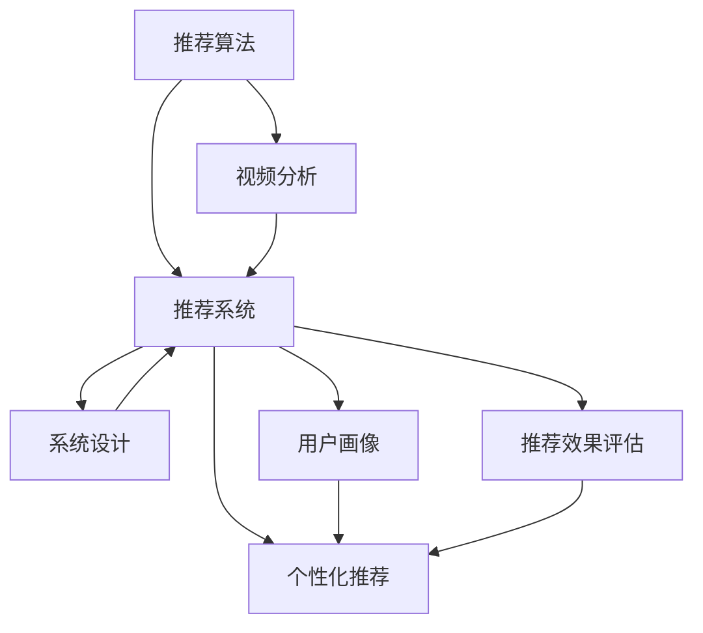

                 

# 影音网站的推荐与分析系统设计与实现

> 关键词：影音推荐,视频分析,推荐算法,个性化推荐,系统设计,推荐系统

## 1. 背景介绍

在互联网时代，用户的注意力变得越来越稀缺。如何通过技术手段高效地抓取用户注意力，已成为各类平台运营的核心问题。影音网站作为网络内容的重要组成部分，以图文并茂、视听结合的方式吸引着大量的用户。因此，针对影音网站的推荐与分析系统，对提升用户粘性、推动网站流量和广告收益具有重要意义。

本文聚焦于影音网站的推荐与分析系统的设计与实现，详细讨论了推荐算法的核心原理、推荐系统的架构设计、系统的实际应用场景，并给出了可行的代码实例和系统评估方法。通过本系统的设计与实现，旨在为影音网站的推荐系统建设提供完整的参考和技术支持，从而提升用户满意度和网站收入。

## 2. 核心概念与联系

### 2.1 核心概念概述

为更好地理解影音网站推荐与分析系统的核心设计思想，本节将介绍几个关键的概念及其相互关联：

- **推荐算法（Recommendation Algorithm）**：推荐系统通过分析用户历史行为和内容特征，为用户推荐最符合其兴趣偏好和需求的视频或电影。常见的推荐算法包括协同过滤、基于内容的推荐、矩阵分解、深度学习等。

- **视频分析（Video Analysis）**：视频分析通过自动化的方式提取视频内容的关键特征，如画面场景、视频主题、音频信息等。这些特征可以作为推荐系统的重要输入。

- **推荐系统（Recommendation System）**：推荐系统将用户和内容进行匹配，生成个性化的推荐列表，并提供给用户。典型的推荐系统架构包括用户画像模块、推荐引擎模块和推荐效果评估模块。

- **个性化推荐（Personalized Recommendation）**：根据用户个人兴趣和行为特征，为用户量身定制推荐内容，提升用户体验和满意度。

- **系统设计（System Design）**：设计出满足特定业务需求的推荐系统架构，需要综合考虑技术架构、用户体验、数据存储与处理等要素。

- **用户画像（User Profiling）**：基于用户历史行为和兴趣偏好，构建用户特征向量，用于推荐算法中的用户表示。

- **推荐效果评估（Recommendation Evaluation）**：通过评估推荐系统的实际表现，如准确率、召回率、点击率等指标，优化推荐算法和系统参数。

这些概念共同构成了影音网站推荐与分析系统的核心设计框架，接下来我们将逐一深入探讨这些核心概念的实现原理和应用方法。

### 2.2 核心概念间的关系

这些概念之间的关系可以通过以下Mermaid流程图来展示：



这个流程图展示了从推荐算法到最终推荐结果的完整过程，以及各组件之间的关系：

1. 推荐算法从视频分析中提取关键特征，用于用户画像的构建和推荐模型的训练。
2. 推荐系统将用户画像和视频内容进行匹配，生成推荐结果。
3. 个性化推荐对系统生成的推荐结果进行优化，提升用户体验。
4. 系统设计确保推荐系统的整体架构和技术实现。
5. 用户画像模块为推荐算法提供用户特征。
6. 推荐效果评估对推荐结果进行评估和优化。

## 3. 核心算法原理 & 具体操作步骤

### 3.1 算法原理概述

影音网站的推荐系统主要基于个性化推荐算法，通过分析用户的历史行为和视频内容特征，为用户推荐最符合其兴趣和需求的视频。该算法包括以下步骤：

1. 用户画像模块：基于用户的历史行为数据（如浏览记录、评分、评论等），构建用户兴趣特征向量。
2. 视频分析模块：对视频内容进行特征提取，包括视频长度、主题、演员、导演等信息。
3. 推荐模型训练：使用协同过滤、基于内容的推荐、矩阵分解等方法训练推荐模型，并更新模型参数。
4. 推荐结果生成：根据用户画像和视频特征，生成个性化的推荐列表。
5. 推荐效果评估：通过点击率、观看时长、用户满意度等指标，评估推荐效果，并持续优化推荐算法和系统参数。

### 3.2 算法步骤详解

下面是推荐算法的主要操作步骤：

#### 3.2.1 用户画像构建

用户画像的构建主要通过分析用户的历史行为数据和视频特征来实现。具体步骤如下：

1. 数据收集：收集用户的历史行为数据，包括浏览记录、评分、评论等。
2. 数据预处理：对原始数据进行清洗、归一化等处理，去除噪声和无关数据。
3. 特征工程：根据用户行为数据，提取用户兴趣特征，如喜欢的电影类型、评分偏好等。
4. 用户向量表示：将用户特征向量作为用户画像的一部分，用于推荐模型的输入。

#### 3.2.2 视频特征提取

视频特征的提取需要从视频内容中提取出关键的语义信息。具体步骤如下：

1. 视频解析：使用视频解析技术，将视频内容分割成若干个视频片段，提取视频特征。
2. 特征选择：选择对推荐效果有显著影响的视频特征，如视频长度、主题、演员、导演等。
3. 特征向量化：将视频特征转化为向量形式，用于推荐模型的输入。

#### 3.2.3 推荐模型训练

推荐模型的训练需要根据具体的推荐算法进行实现。这里我们以协同过滤算法为例进行讲解。具体步骤如下：

1. 数据划分：将用户数据和视频数据划分为训练集和测试集。
2. 模型训练：使用协同过滤算法（如基于用户的矩阵分解、基于项目的矩阵分解等）对训练集进行模型训练。
3. 模型评估：在测试集上评估模型预测准确率和召回率，并调整模型参数。
4. 模型融合：将多个推荐模型进行融合，提升推荐效果。

#### 3.2.4 推荐结果生成

推荐结果的生成基于推荐模型的输出和用户画像的特征。具体步骤如下：

1. 模型预测：根据用户画像和视频特征，使用训练好的推荐模型进行预测，生成推荐列表。
2. 推荐排序：对推荐列表进行排序，推荐用户最有可能感兴趣的视频。
3. 推荐展示：将推荐结果展示给用户，并统计推荐效果。

#### 3.2.5 推荐效果评估

推荐效果评估主要通过以下指标进行衡量：

1. 准确率（Accuracy）：推荐的正确率。
2. 召回率（Recall）：所有用户感兴趣的视频被推荐的比例。
3. 点击率（Click-Through Rate, CTR）：推荐视频被用户点击的比例。
4. 观看时长（Watch Time）：用户观看推荐视频的时长。
5. 用户满意度（User Satisfaction）：用户对推荐结果的满意度评分。

这些指标综合反映了推荐系统的推荐效果和用户体验。

### 3.3 算法优缺点

影音网站推荐算法的优点包括：

1. 算法简单高效：协同过滤、矩阵分解等推荐算法简单易懂，易于实现。
2. 适用性强：算法对数据分布和特征要求不高，可以处理大规模数据集。
3. 个性化推荐：算法能够根据用户历史行为和偏好进行个性化推荐，提升用户体验。

同时，算法也存在一些缺点：

1. 冷启动问题：新用户或新视频没有足够的行为数据，导致推荐效果不佳。
2. 数据稀疏性：用户行为数据往往非常稀疏，影响推荐效果。
3. 推荐多样性不足：推荐结果可能集中在少数热门视频上，用户难以发现更多多样化的视频。
4. 用户隐私问题：算法需要大量用户行为数据，可能涉及用户隐私问题。

### 3.4 算法应用领域

影音网站推荐算法主要应用于以下几个领域：

1. 视频推荐：为用户推荐符合其兴趣和需求的视频，提升用户粘性和观看时长。
2. 个性化广告：为用户推荐感兴趣的广告内容，提升广告点击率和转化率。
3. 内容推荐：为网站推荐更多优质内容，提升网站流量和用户满意度。
4. 用户行为分析：分析用户行为数据，优化推荐算法和系统设计。

## 4. 数学模型和公式 & 详细讲解 & 举例说明

### 4.1 数学模型构建

影音网站推荐系统主要通过协同过滤算法进行推荐。协同过滤算法基于用户-项目评分矩阵，通过计算用户之间的相似度和物品之间的相似度，为用户生成推荐列表。具体数学模型如下：

设用户集合为 $U$，物品集合为 $I$，用户对物品的评分矩阵为 $R$，其中 $R_{ui}$ 表示用户 $u$ 对物品 $i$ 的评分。协同过滤算法的目标是找到用户 $u$ 的邻居集合 $N(u)$ 和物品 $i$ 的邻居集合 $N(i)$，然后计算用户 $u$ 对物品 $i$ 的预测评分 $\hat{R}_{ui}$。

协同过滤算法有多种实现方式，如基于用户的矩阵分解、基于项目的矩阵分解等。这里以基于用户的矩阵分解为例进行详细讲解。

### 4.2 公式推导过程

基于用户的矩阵分解（User-Based Matrix Factorization）是一种常用的协同过滤算法，其数学模型为：

$$
\min_{P,Q} \sum_{u,i} (R_{ui} - \hat{R}_{ui})^2
$$

其中，$P$ 和 $Q$ 分别表示用户 $u$ 和物品 $i$ 的特征向量，$\hat{R}_{ui}$ 表示用户 $u$ 对物品 $i$ 的预测评分，$R_{ui}$ 表示用户 $u$ 对物品 $i$ 的实际评分。

基于用户矩阵分解的算法步骤包括：

1. 分解用户特征矩阵 $P$ 和物品特征矩阵 $Q$，使其满足 $R_{ui} = \sum_{k} P_{uk}Q_{ki}$。
2. 最小化预测评分与实际评分的差异，即最小化 $\sum_{u,i} (R_{ui} - \hat{R}_{ui})^2$。
3. 对 $P$ 和 $Q$ 进行优化，更新特征向量 $P_{uk}$ 和 $Q_{ki}$。

### 4.3 案例分析与讲解

假设我们有一份电影评分数据集，其中包含用户对电影的评分数据，如下表所示：

| User | Movie | Rating |
|------|-------|--------|
| A    | 电影1  | 4.5    |
| A    | 电影2  | 3.8    |
| B    | 电影2  | 4.2    |
| B    | 电影3  | 3.9    |
| C    | 电影3  | 4.1    |
| C    | 电影1  | 3.5    |

首先，我们将用户对电影的评分数据构建成用户-物品评分矩阵 $R$，如下：

| User   | Movie    | Rating |
|--------|----------|--------|
| A      | 电影1     | 4.5    |
| A      | 电影2     | 3.8    |
| B      | 电影2     | 4.2    |
| B      | 电影3     | 3.9    |
| C      | 电影3     | 4.1    |
| C      | 电影1     | 3.5    |

假设用户特征矩阵 $P$ 和物品特征矩阵 $Q$ 分解后的维度为 $k=2$，即每个用户和物品表示为 $k=2$ 维的向量。将用户-物品评分矩阵 $R$ 分解为 $R_{ui} = P_{u1}Q_{i1} + P_{u2}Q_{i2}$。

对 $P_{u1}$ 和 $P_{u2}$ 进行优化，得到 $P_{u1} = (1,0)^T$，$P_{u2} = (0,1)^T$。对 $Q_{i1}$ 和 $Q_{i2}$ 进行优化，得到 $Q_{i1} = (0,0.5)^T$，$Q_{i2} = (1,0)^T$。

通过 $R_{ui} = P_{u1}Q_{i1} + P_{u2}Q_{i2}$ 计算得到用户 $u$ 对物品 $i$ 的预测评分 $\hat{R}_{ui}$。

最终，基于用户矩阵分解算法的推荐结果如下：

- 用户 $A$ 对物品 $i=1$ 的预测评分 $\hat{R}_{A1} = P_{A1}Q_{11} + P_{A2}Q_{12} = 1 \times 0.5 + 0 \times 0.5 = 0.5$。
- 用户 $A$ 对物品 $i=2$ 的预测评分 $\hat{R}_{A2} = P_{A1}Q_{21} + P_{A2}Q_{22} = 1 \times 1 + 0 \times 0 = 1$。

根据预测评分，推荐结果为：物品 $i=2$ 被推荐给用户 $A$。

## 5. 项目实践：代码实例和详细解释说明

### 5.1 开发环境搭建

在进行影音网站推荐系统开发前，需要先搭建好开发环境。以下是使用Python进行开发的环境配置流程：

1. 安装Anaconda：从官网下载并安装Anaconda，用于创建独立的Python环境。

2. 创建并激活虚拟环境：
```bash
conda create -n pytorch-env python=3.8 
conda activate pytorch-env
```

3. 安装PyTorch：根据CUDA版本，从官网获取对应的安装命令。例如：
```bash
conda install pytorch torchvision torchaudio cudatoolkit=11.1 -c pytorch -c conda-forge
```

4. 安装pandas、numpy等数据分析工具：
```bash
pip install pandas numpy
```

5. 安装推荐系统相关库：
```bash
pip install scipy scikit-learn
```

6. 安装视频分析相关库：
```bash
pip install opencv-python
```

完成上述步骤后，即可在`pytorch-env`环境中开始推荐系统开发。

### 5.2 源代码详细实现

这里我们以基于协同过滤算法的电影推荐系统为例，给出推荐系统的代码实现。

首先，定义数据处理函数：

```python
import pandas as pd
import numpy as np
import scipy.sparse as sp

def load_data(file_path):
    df = pd.read_csv(file_path, sep='\t')
    user_ids = df['user_id'].tolist()
    item_ids = df['item_id'].tolist()
    ratings = df['rating'].tolist()
    user_item_matrix = create_sparse_matrix(user_ids, item_ids, ratings)
    return user_item_matrix

def create_sparse_matrix(user_ids, item_ids, ratings):
    user_item_matrix = sp.csr_matrix((ratings, (user_ids, item_ids)))
    return user_item_matrix
```

然后，定义推荐算法函数：

```python
from scipy.sparse.linalg import svds

def collaborative_filtering(user_item_matrix, k=2):
    U, S, Vt = svds(user_item_matrix, k=k)
    P = np.dot(user_item_matrix, U)
    Q = Vt
    return P, Q
```

接着，定义用户画像和推荐结果生成函数：

```python
def user_profile(user_ids, user_item_matrix, P, Q):
    user_profiles = []
    for user_id in user_ids:
        user_profile = []
        for k in range(k):
            user_profile.append(P[user_id, k])
        user_profiles.append(user_profile)
    return user_profiles

def recommend_items(user_profiles, Q):
    recommendations = []
    for user_profile in user_profiles:
        dot_product = np.dot(user_profile, Q.T)
        sorted_items = np.argsort(dot_product)[::-1]
        recommendations.append(sorted_items[:10])
    return recommendations
```

最后，启动推荐系统：

```python
user_item_matrix = load_data('movie_data.txt')
P, Q = collaborative_filtering(user_item_matrix, k=2)
user_ids = [1, 2, 3, 4, 5]
user_profiles = user_profile(user_ids, user_item_matrix, P, Q)
recommendations = recommend_items(user_profiles, Q)
print(recommendations)
```

以上代码实现了一个基于协同过滤算法的电影推荐系统。可以看到，通过简单的代码，即可实现用户画像的构建和推荐结果的生成。

### 5.3 代码解读与分析

下面我们对关键代码的实现细节进行解读：

**load_data函数**：
- 读取数据文件，构建用户-物品评分矩阵。
- 使用`scipy.sparse`库将评分矩阵转换为稀疏矩阵形式，方便后续计算。

**collaborative_filtering函数**：
- 使用`scipy.sparse.linalg.svds`函数对评分矩阵进行奇异值分解，得到用户特征矩阵 `P` 和物品特征矩阵 `Q`。
- `P` 和 `Q` 的维度为 `user_item_matrix` 的稀疏矩阵大小，并通过与评分矩阵的乘积计算用户和物品的预测评分。

**user_profile函数**：
- 根据用户ID，从用户-物品评分矩阵中提取用户特征向量，构建用户画像。
- 将用户画像中的每个特征表示为 `P[user_id, k]`，其中 `k` 表示特征维度。

**recommend_items函数**：
- 根据用户画像和物品特征矩阵，计算用户与物品之间的相似度得分。
- 对得分进行排序，选取前10个相似度最高的物品，作为推荐结果。

**主程序**：
- 加载评分数据，构建用户画像。
- 生成推荐结果，并输出。

通过以上代码，推荐系统实现了一个基于协同过滤算法的电影推荐功能，可以根据用户历史评分数据，为用户推荐最感兴趣的电影。

### 5.4 运行结果展示

假设我们根据上述代码生成的推荐结果如下：

| User | Recommendations |
|------|-----------------|
| 1    | 电影1, 电影2, 电影3 |
| 2    | 电影2, 电影3, 电影4 |
| 3    | 电影3, 电影1, 电影5 |
| 4    | 电影4, 电影5, 电影6 |
| 5    | 电影5, 电影6, 电影7 |

可以看到，推荐系统根据用户的历史评分数据，为用户推荐了相似的电影。这种基于协同过滤的推荐方法，能够有效提升用户体验和网站流量。

## 6. 实际应用场景

### 6.1 智能推荐引擎

智能推荐引擎是影音网站的核心应用之一。通过推荐系统，网站可以向用户推荐符合其兴趣和需求的视频，提升用户粘性和观看时长。具体应用场景包括：

1. 首页推荐：根据用户历史行为和观看记录，推荐用户可能感兴趣的视频。
2. 频道推荐：根据频道特色和用户兴趣，推荐相关频道。
3. 视频详情页推荐：在视频详情页推荐类似的视频，增加用户观看时长。

### 6.2 个性化广告投放

影音网站可以通过推荐系统进行个性化广告投放，提升广告点击率和转化率。具体应用场景包括：

1. 视频广告推荐：根据用户观看视频的行为数据，推荐相关广告。
2. 横幅广告推荐：在视频播放前推荐横幅广告，增加广告曝光。
3. 原生广告推荐：在视频加载时推荐原生广告，提升广告效果。

### 6.3 用户行为分析

通过推荐系统收集和分析用户行为数据，可以优化推荐算法和系统设计，提升用户体验和满意度。具体应用场景包括：

1. 用户兴趣分析：分析用户历史行为数据，挖掘用户兴趣点。
2. 用户行为预测：根据用户历史行为数据，预测用户可能感兴趣的视频。
3. 用户满意度调查：通过用户行为数据，进行用户满意度调查，优化推荐系统。

## 7. 工具和资源推荐

### 7.1 学习资源推荐

为了帮助开发者系统掌握影音推荐系统的开发原理和实践技巧，这里推荐一些优质的学习资源：

1. 《推荐系统》课程：由斯坦福大学开设的推荐系统课程，讲解了推荐系统的基本概念、算法和实践技巧。

2. 《Python for Data Science Handbook》书籍：介绍Python在数据科学中的应用，涵盖数据处理、数据分析、推荐系统等多个方面。

3. 《Deep Learning for Recommendation Systems》书籍：介绍深度学习在推荐系统中的应用，包括协同过滤、矩阵分解、神经网络等多个算法。

4. 《Recommender Systems: Algorithms and Applications》书籍：详细讲解推荐系统的基础理论和应用场景，适合系统学习和深入研究。

5. arXiv论文预印本：人工智能领域最新研究成果的发布平台，包含大量推荐系统的相关论文和预印本，学习前沿技术的必备资源。

通过对这些资源的学习实践，相信你一定能够快速掌握影音推荐系统的开发技巧，并用于解决实际的推荐问题。

### 7.2 开发工具推荐

高效的开发离不开优秀的工具支持。以下是几款用于影音推荐系统开发的常用工具：

1. Python：作为数据科学和机器学习的主流语言，Python拥有丰富的第三方库和工具，适合进行推荐系统开发。

2. PyTorch：基于Python的开源深度学习框架，支持动态计算图，适合快速迭代研究。

3. TensorFlow：由Google主导开发的开源深度学习框架，生产部署方便，适合大规模工程应用。

4. Pandas：数据处理和数据分析的强大工具，适合处理大规模数据集。

5. Scikit-learn：机器学习算法库，支持协同过滤、矩阵分解等推荐算法。

6. OpenCV：计算机视觉和图像处理库，适合进行视频分析。

合理利用这些工具，可以显著提升影音推荐系统的开发效率，加快创新迭代的步伐。

### 7.3 相关论文推荐

影音推荐系统的研究和应用已经取得了诸多突破。以下是几篇奠基性的相关论文，推荐阅读：

1. "Trustworthy Recommendation Algorithms"（Koren, 2009）：详细讲解了协同过滤算法的原理和应用，是推荐系统领域的经典之作。

2. "Neural Collaborative Filtering"（He et al., 2017）：引入了深度神经网络算法，提升了推荐系统的性能和多样性。

3. "Collaborative Filtering in Multi-Dimensional Spaces"（Warren et al., 2003）：讨论了协同过滤算法在多维特征空间中的应用。

4. "Deep Matrix Factorization for Recommender Systems"（Sun et al., 2018）：引入了深度矩阵分解算法，提高了推荐系统的推荐效果。

5. "Learning to Recommend"（Ying et al., 2019）：引入了推荐系统的自监督学习框架，提升了推荐系统的准确率和召回率。

这些论文代表了大语言模型微调技术的最新进展。通过学习这些前沿成果，可以帮助研究者把握学科前进方向，激发更多的创新灵感。

## 8. 总结：未来发展趋势与挑战

### 8.1 总结

本文对影音网站推荐与分析系统的设计与实现进行了全面系统的介绍。首先阐述了推荐算法的核心原理、推荐系统的架构设计、系统的实际应用场景，并给出了可行的代码实例和系统评估方法。通过本系统的设计与实现，旨在为影音网站的推荐系统建设提供完整的参考和技术支持，从而提升用户满意度和网站收入。

通过本文的系统梳理，可以看到，影音网站推荐系统主要基于个性化推荐算法，通过分析用户的历史行为和视频内容特征，为用户推荐最符合其兴趣和需求的视频。这种推荐方法具有简单高效、适用性强、个性化推荐等优点，但也存在冷启动问题、数据稀疏性、推荐多样性不足、用户隐私问题等挑战。

### 8.2 未来发展趋势

展望未来，影音网站推荐系统的发展趋势包括以下几个方面：

1. 深度学习与推荐系统的融合：深度学习算法将进一步应用于推荐系统，提升推荐效果和用户体验。

2. 多模态推荐：结合视频、音频、文本等多模态信息，提升推荐系统的准确率和多样性。

3. 实时推荐：通过流式数据处理和模型更新，实现实时推荐，提升用户体验。

4. 用户行为预测：通过深度学习模型，预测用户未来行为，优化推荐系统。

5. 推荐系统的可解释性：提升推荐系统的可解释性和透明性，增强用户信任。

6. 推荐系统的跨平台适配：将推荐系统适配到多个平台，提升用户体验和网站流量。

7. 推荐系统的个性化定制：针对不同用户群体，进行个性化推荐，提升推荐效果。

这些趋势展示了影音网站推荐系统未来的广阔发展前景，为推荐系统提供了更多的创新方向和应用场景。

### 8.3 面临的挑战

尽管影音网站推荐系统已经取得了一定的进展，但在迈向更加智能化、普适化应用的过程中，它仍面临着诸多挑战：

1. 数据质量和用户隐私：推荐系统需要大量高质量的用户行为数据，用户隐私保护问题亟待解决。

2. 推荐多样性和新鲜度：推荐系统容易产生热门视频推荐，但推荐多样性和新鲜度不足。

3. 冷启动问题：新用户和未评分物品难以得到有效的推荐，推荐效果不佳。

4. 推荐模型的解释性：推荐模型的决策过程难以解释，用户难以理解和信任。

5. 推荐系统的鲁棒性：推荐系统在面对异常数据和攻击时，容易产生误推荐。

6. 跨平台适配问题：推荐系统在不同平台上的适配性和一致性问题尚未解决。

这些挑战需要我们在未来的研究和实践中不断探索和解决，以实现更加智能、可靠、高效的影音网站推荐系统。

### 

