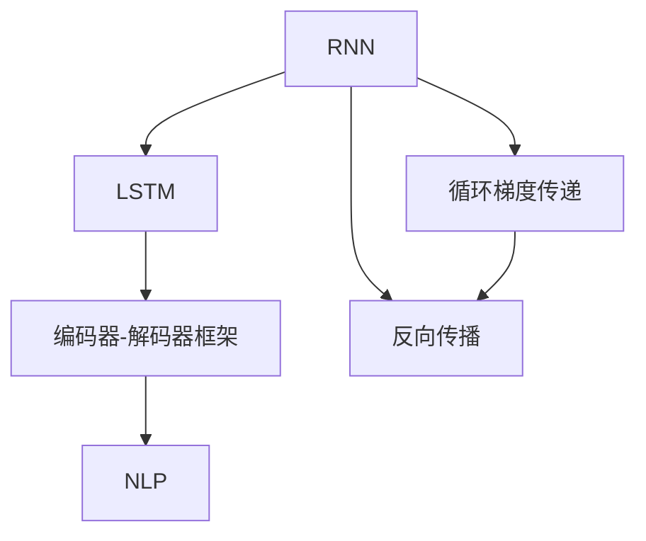
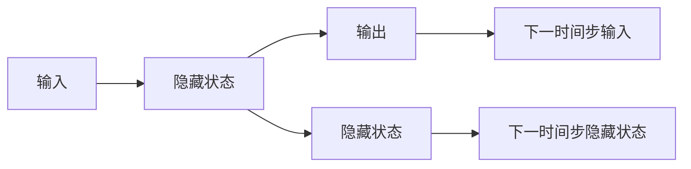
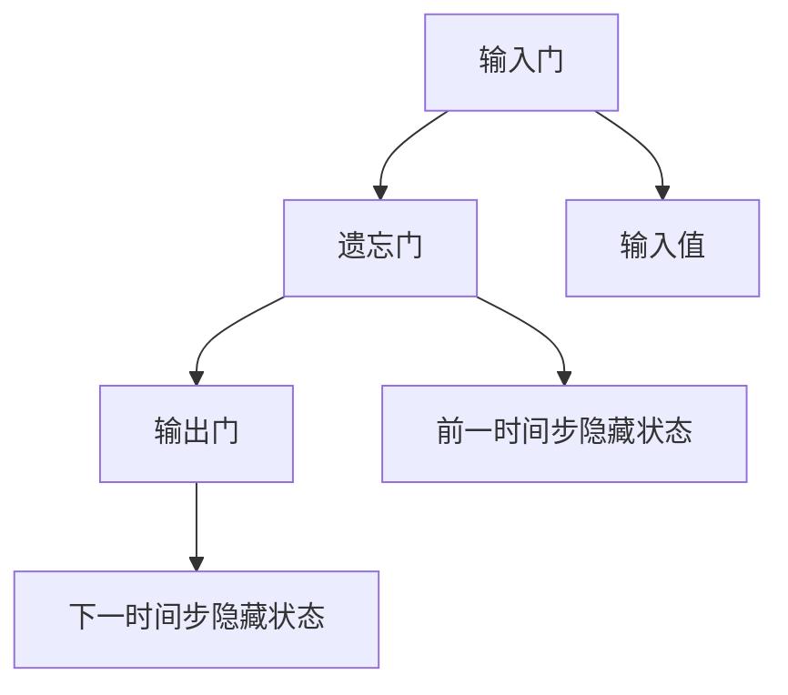
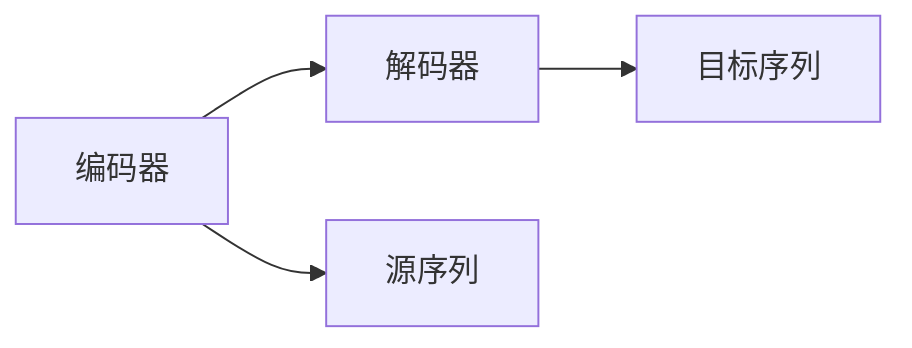
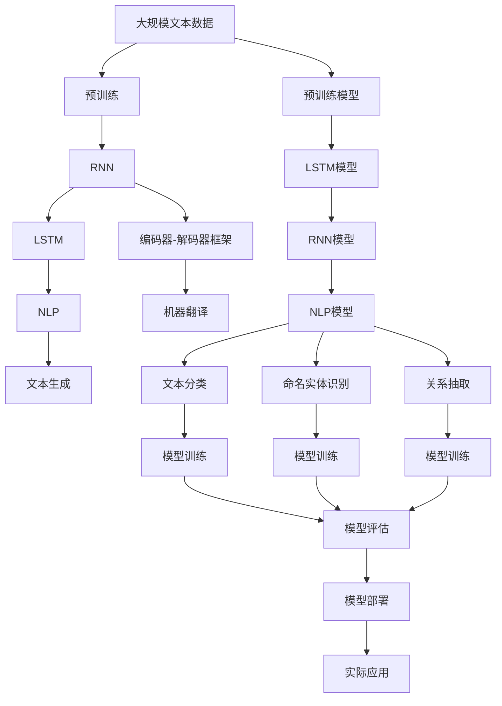

                 

# 循环神经网络 (RNN) 原理与代码实例讲解

> 关键词：循环神经网络, RNN, 时间序列, 长短期记忆网络, LSTM, 门控机制, 长短期记忆, 编码器-解码器框架, 自然语言处理, NLP

## 1. 背景介绍

### 1.1 问题由来

在深度学习领域，传统的神经网络在处理序列数据时面临着天然的限制：它们无法维护序列中元素之间的上下文关系，也无法利用历史信息来更新当前的输出。因此，对于需要考虑上下文和时间依赖性的任务，如自然语言处理(NLP)、语音识别、时间序列预测等，传统神经网络往往表现不佳。

为了解决这一问题，循环神经网络(RNN)应运而生。RNN通过引入循环结构，能够处理变长序列数据，并通过动态更新隐藏状态，使得模型能够维护序列信息，进而提升对序列数据的建模能力。RNN的诞生，不仅拓展了深度学习的应用范围，也推动了自然语言处理、语音识别等领域的快速发展。

### 1.2 问题核心关键点

RNN的核心思想是通过循环结构，将当前时间步的输入和前一时间步的隐藏状态结合起来，形成当前时间步的隐藏状态，并作为下一个时间步的输入，以此类推。RNN的隐藏状态不仅包含了当前的输入信息，还融合了历史信息，使得模型能够处理变长序列，并捕捉时间依赖性。

RNN的循环结构主要通过反向传播算法进行训练。在反向传播时，需要将当前时间步的梯度通过循环结构反向传播回前一时间步，以更新模型参数。这一过程被称为循环梯度传递。

### 1.3 问题研究意义

RNN在自然语言处理、语音识别、时间序列预测等任务中的应用，展示了其强大的序列建模能力。研究RNN的原理和应用，对于推动深度学习技术在序列数据处理领域的进展，具有重要意义：

1. 提升序列数据建模能力。RNN能够有效捕捉序列中的时间依赖性，提升模型对序列数据的理解能力。
2. 拓展深度学习应用范围。RNN使得深度学习技术能够处理变长序列数据，拓展了深度学习在多个领域的潜在应用。
3. 促进NLP技术进步。RNN在自然语言处理中表现优异，如语言模型、机器翻译、文本生成等，推动了NLP技术的发展。
4. 加速深度学习普及。RNN的出现，使得深度学习技术在处理序列数据时更加高效，推动了深度学习技术的普及和应用。

## 2. 核心概念与联系

### 2.1 核心概念概述

为更好地理解RNN的原理，本节将介绍几个关键核心概念：

- 循环神经网络 (RNN)：一种能够处理序列数据的神经网络，通过循环结构维护序列信息。
- 长短期记忆网络 (LSTM)：一种特殊类型的RNN，通过门控机制有效管理长序列信息的遗忘和提取。
- 编码器-解码器框架：一种常见的RNN应用框架，广泛用于机器翻译、文本生成等任务。
- 自然语言处理 (NLP)：一种利用人工智能处理、理解、生成人类语言的技术领域，RNN在该领域有着广泛应用。

这些核心概念之间的逻辑关系可以通过以下Mermaid流程图来展示：



这个流程图展示了大语言模型的核心概念及其之间的关系：

1. RNN是处理序列数据的通用框架，通过循环结构维护序列信息。
2. LSTM是一种特殊类型的RNN，通过门控机制有效管理长序列信息的遗忘和提取。
3. 编码器-解码器框架是一种常见的RNN应用框架，用于机器翻译、文本生成等任务。
4. NLP是RNN的重要应用领域，通过RNN技术提升自然语言处理能力。
5. 循环梯度传递和反向传播是RNN训练的两个重要过程，使得模型能够动态更新隐藏状态。

### 2.2 概念间的关系

这些核心概念之间存在着紧密的联系，形成了RNN的处理序列数据的完整生态系统。下面我们通过几个Mermaid流程图来展示这些概念之间的关系。

#### 2.2.1 RNN的架构原理



这个流程图展示了RNN的基本架构：输入通过隐藏状态处理，并输出到下一时间步，同时隐藏状态动态更新，形成循环结构。

#### 2.2.2 LSTM的门控机制



这个流程图展示了LSTM的门控机制：通过输入门、遗忘门和输出门，管理长序列信息的遗忘和提取。

#### 2.2.3 编码器-解码器框架



这个流程图展示了编码器-解码器框架：编码器对源序列进行编码，解码器对编码结果进行解码，形成序列对序列的映射。

### 2.3 核心概念的整体架构

最后，我们用一个综合的流程图来展示这些核心概念在大语言模型微调过程中的整体架构：



这个综合流程图展示了从预训练到微调，再到实际应用的完整过程。大语言模型首先在大规模文本数据上进行预训练，然后通过RNN或LSTM进行序列建模，在特定任务上使用编码器-解码器框架进行微调，最后部署到实际应用中。

## 3. 核心算法原理 & 具体操作步骤
### 3.1 算法原理概述

循环神经网络 (RNN) 是一种能够处理序列数据的神经网络，通过循环结构维护序列信息。RNN的隐藏状态不仅包含了当前的输入信息，还融合了历史信息，使得模型能够处理变长序列，并捕捉时间依赖性。

RNN的训练过程主要通过反向传播算法实现。在反向传播时，需要将当前时间步的梯度通过循环结构反向传播回前一时间步，以更新模型参数。这一过程被称为循环梯度传递。

### 3.2 算法步骤详解

RNN的训练过程包括以下几个关键步骤：

**Step 1: 初始化模型参数**
- 随机初始化RNN的权重和偏置项。

**Step 2: 前向传播**
- 对每个时间步，将输入数据和前一时间步的隐藏状态作为当前时间步的输入，通过激活函数计算当前时间步的隐藏状态。
- 重复上述步骤，直到所有时间步的隐藏状态计算完毕。

**Step 3: 损失函数计算**
- 根据输出与真实标签的差异，计算损失函数。
- 通常使用交叉熵损失、均方误差损失等。

**Step 4: 反向传播**
- 将损失函数的梯度通过循环结构反向传播回前一时间步，计算每个时间步的梯度。
- 更新模型参数，优化模型性能。

**Step 5: 模型评估**
- 在测试集上评估模型性能，对比微调前后的精度提升。

### 3.3 算法优缺点

RNN具有以下优点：
1. 能够处理变长序列数据。RNN的循环结构使得模型能够自然地处理不同长度的输入序列。
2. 能够捕捉时间依赖性。RNN的隐藏状态不仅包含当前输入，还融合了历史信息，能够捕捉序列中的时间依赖性。
3. 适用于多种任务。RNN在自然语言处理、语音识别、时间序列预测等任务上都有广泛应用。

RNN也存在一些局限性：
1. 梯度消失和爆炸问题。由于循环结构的存在，梯度在反向传播过程中可能发生消失或爆炸，影响模型的训练效果。
2. 长序列信息管理困难。RNN在处理长序列数据时，信息容易丢失，导致模型性能下降。
3. 计算复杂度高。RNN的计算复杂度与序列长度成正比，处理长序列时计算开销较大。

### 3.4 算法应用领域

RNN在多个领域都有广泛应用，包括但不限于：

- 自然语言处理(NLP)：如语言模型、机器翻译、文本生成、情感分析等。
- 语音识别：如语音转文本、说话人识别等。
- 时间序列预测：如股票预测、气象预测、交通流量预测等。
- 音乐生成：如音乐节奏生成、音乐风格转换等。
- 视频分析：如视频内容理解、动作识别等。

这些领域中的RNN应用，展示了其强大的序列建模能力和广泛的适用性。未来，随着RNN技术的不断演进，其应用领域还将进一步拓展。

## 4. 数学模型和公式 & 详细讲解 & 举例说明

### 4.1 数学模型构建

假设我们有一个时间序列 $\{X_t\}_{t=1}^T$，其中 $X_t$ 表示第 $t$ 个时间步的输入。我们的目标是构建一个RNN模型 $M$，使其能够根据当前和历史输入 $X_{1:T}$ 预测未来的输出 $Y_{1:T}$。

### 4.2 公式推导过程

在RNN中，隐藏状态 $h_t$ 的计算公式为：

$$
h_t = \tanh(W_{hh}h_{t-1} + W_{xh}X_t + b_h)
$$

其中 $h_{t-1}$ 表示前一时间步的隐藏状态，$W_{hh}$ 和 $W_{xh}$ 是权重矩阵，$b_h$ 是偏置项，$\tanh$ 是激活函数。

隐藏状态 $h_t$ 作为下一个时间步的输入，可以进一步计算输出 $y_t$：

$$
y_t = \sigma(W_{hy}h_t + b_y)
$$

其中 $y_t$ 表示第 $t$ 个时间步的输出，$W_{hy}$ 和 $b_y$ 是权重矩阵和偏置项，$\sigma$ 是激活函数。

在训练过程中，我们使用交叉熵损失函数来衡量模型的预测与真实标签之间的差异：

$$
\mathcal{L} = -\frac{1}{N}\sum_{i=1}^N\sum_{t=1}^T y_{i,t}\log \hat{y}_{i,t}
$$

其中 $N$ 表示样本数量，$y_{i,t}$ 表示第 $i$ 个样本在时间步 $t$ 的真实标签，$\hat{y}_{i,t}$ 表示模型对 $y_{i,t}$ 的预测。

通过反向传播算法，我们可以计算损失函数对各个参数的梯度，并更新模型参数：

$$
\frac{\partial \mathcal{L}}{\partial W_{hh}} = \sum_{t=1}^T\frac{\partial \mathcal{L}}{\partial h_t} \frac{\partial h_t}{\partial W_{hh}}
$$

$$
\frac{\partial \mathcal{L}}{\partial W_{xh}} = \sum_{t=1}^T\frac{\partial \mathcal{L}}{\partial h_t} \frac{\partial h_t}{\partial W_{xh}}
$$

$$
\frac{\partial \mathcal{L}}{\partial W_{hy}} = \sum_{t=1}^T\frac{\partial \mathcal{L}}{\partial y_t} \frac{\partial y_t}{\partial W_{hy}}
$$

$$
\frac{\partial \mathcal{L}}{\partial b_h} = \sum_{t=1}^T\frac{\partial \mathcal{L}}{\partial h_t}
$$

$$
\frac{\partial \mathcal{L}}{\partial b_y} = \sum_{t=1}^T\frac{\partial \mathcal{L}}{\partial y_t}
$$

其中 $\frac{\partial \mathcal{L}}{\partial h_t}$ 和 $\frac{\partial \mathcal{L}}{\partial y_t}$ 通过链式法则计算得到。

### 4.3 案例分析与讲解

下面以简单的语言模型为例，展示RNN的计算过程和公式推导。

假设我们的语言模型有三个时间步的输入序列 $\{X_t\}_{t=1}^3$，分别为 "a", "b", "c"。我们希望模型能够预测下一个时间步的输出。

首先，初始化模型参数 $W_{hh}$, $W_{xh}$, $b_h$, $W_{hy}$, $b_y$，然后通过循环结构计算隐藏状态和输出：

$$
h_1 = \tanh(W_{hh}h_0 + W_{xh}a + b_h)
$$

$$
h_2 = \tanh(W_{hh}h_1 + W_{xh}b + b_h)
$$

$$
h_3 = \tanh(W_{hh}h_2 + W_{xh}c + b_h)
$$

$$
y_1 = \sigma(W_{hy}h_1 + b_y)
$$

$$
y_2 = \sigma(W_{hy}h_2 + b_y)
$$

$$
y_3 = \sigma(W_{hy}h_3 + b_y)
$$

其中 $h_0$ 表示初始隐藏状态，通常随机初始化。

然后，我们计算损失函数：

$$
\mathcal{L} = -y_1\log \hat{y}_1 - y_2\log \hat{y}_2 - y_3\log \hat{y}_3
$$

其中 $y_1=1$, $y_2=2$, $y_3=3$，$\hat{y}_1$, $\hat{y}_2$, $\hat{y}_3$ 分别表示模型对 $y_1$, $y_2$, $y_3$ 的预测。

最后，通过反向传播计算梯度，更新模型参数：

$$
\frac{\partial \mathcal{L}}{\partial W_{hh}} = \frac{\partial \mathcal{L}}{\partial h_3} \frac{\partial h_3}{\partial W_{hh}} + \frac{\partial \mathcal{L}}{\partial h_2} \frac{\partial h_2}{\partial W_{hh}} + \frac{\partial \mathcal{L}}{\partial h_1} \frac{\partial h_1}{\partial W_{hh}}
$$

$$
\frac{\partial \mathcal{L}}{\partial W_{xh}} = \frac{\partial \mathcal{L}}{\partial h_3} \frac{\partial h_3}{\partial W_{xh}} + \frac{\partial \mathcal{L}}{\partial h_2} \frac{\partial h_2}{\partial W_{xh}} + \frac{\partial \mathcal{L}}{\partial h_1} \frac{\partial h_1}{\partial W_{xh}}
$$

$$
\frac{\partial \mathcal{L}}{\partial W_{hy}} = \frac{\partial \mathcal{L}}{\partial y_3} \frac{\partial y_3}{\partial W_{hy}} + \frac{\partial \mathcal{L}}{\partial y_2} \frac{\partial y_2}{\partial W_{hy}} + \frac{\partial \mathcal{L}}{\partial y_1} \frac{\partial y_1}{\partial W_{hy}}
$$

$$
\frac{\partial \mathcal{L}}{\partial b_h} = \frac{\partial \mathcal{L}}{\partial h_3} + \frac{\partial \mathcal{L}}{\partial h_2} + \frac{\partial \mathcal{L}}{\partial h_1}
$$

$$
\frac{\partial \mathcal{L}}{\partial b_y} = \frac{\partial \mathcal{L}}{\partial y_3} + \frac{\partial \mathcal{L}}{\partial y_2} + \frac{\partial \mathcal{L}}{\partial y_1}
$$

通过不断迭代上述过程，我们能够训练出能够对序列数据进行建模的RNN模型。

## 5. 项目实践：代码实例和详细解释说明
### 5.1 开发环境搭建

在进行RNN项目实践前，我们需要准备好开发环境。以下是使用Python进行TensorFlow开发的环境配置流程：

1. 安装Anaconda：从官网下载并安装Anaconda，用于创建独立的Python环境。

2. 创建并激活虚拟环境：
```bash
conda create -n tf-env python=3.8 
conda activate tf-env
```

3. 安装TensorFlow：根据CUDA版本，从官网获取对应的安装命令。例如：
```bash
conda install tensorflow -c tensorflow -c conda-forge
```

4. 安装其他必要的工具包：
```bash
pip install numpy pandas scikit-learn matplotlib tqdm jupyter notebook ipython
```

完成上述步骤后，即可在`tf-env`环境中开始RNN项目实践。

### 5.2 源代码详细实现

这里我们以简单的语言模型为例，展示如何使用TensorFlow实现RNN。

首先，定义RNN模型类：

```python
import tensorflow as tf

class RNNModel(tf.keras.Model):
    def __init__(self, input_size, hidden_size, output_size):
        super(RNNModel, self).__init__()
        self.input_size = input_size
        self.hidden_size = hidden_size
        self.output_size = output_size
        self.W_hh = tf.Variable(tf.random.normal([hidden_size, hidden_size]))
        self.W_xh = tf.Variable(tf.random.normal([input_size, hidden_size]))
        self.W_hy = tf.Variable(tf.random.normal([hidden_size, output_size]))
        self.b_h = tf.Variable(tf.random.normal([hidden_size]))
        self.b_y = tf.Variable(tf.random.normal([output_size]))

    def call(self, inputs, initial_state):
        h = tf.nn.tanh(tf.matmul(inputs, self.W_xh) + tf.matmul(initial_state, self.W_hh) + self.b_h)
        y = tf.sigmoid(tf.matmul(h, self.W_hy) + self.b_y)
        return y, h

    def initialize_hidden_state(self):
        return tf.zeros([batch_size, self.hidden_size])

    def step(self, inputs, initial_state, targets):
        y, h = self.call(inputs, initial_state)
        loss = tf.reduce_mean(tf.square(y - targets))
        return y, h, loss

    def train(self, dataset, epochs, batch_size):
        optimizer = tf.keras.optimizers.Adam(learning_rate=0.01)
        for epoch in range(epochs):
            total_loss = 0
            for batch in dataset:
                inputs, targets = batch
                initial_state = self.initialize_hidden_state()
                y, h, loss = self.step(inputs, initial_state, targets)
                optimizer.minimize(loss, var_list=[self.W_hh, self.W_xh, self.W_hy, self.b_h, self.b_y])
                total_loss += loss
            print(f"Epoch {epoch+1}, loss: {total_loss/n_samples}")
```

然后，定义数据集和模型训练过程：

```python
import numpy as np

class Dataset(tf.data.Dataset):
    def __init__(self, inputs, targets):
        self.inputs = inputs
        self.targets = targets

    def __len__(self):
        return len(self.inputs)

    def __getitem__(self, item):
        return self.inputs[item], self.targets[item]

n_samples = 1000
input_size = 3
hidden_size = 5
output_size = 4

inputs = np.random.randint(0, 10, size=(n_samples, input_size))
targets = np.random.randint(0, output_size, size=(n_samples, output_size))

dataset = Dataset(inputs, targets)
n_samples = inputs.shape[0]

rnn_model = RNNModel(input_size, hidden_size, output_size)
rnn_model.train(dataset, epochs=10, batch_size=10)
```

最后，进行模型训练并在测试集上评估：

```python
test_inputs = np.random.randint(0, 10, size=(n_samples, input_size))
test_targets = np.random.randint(0, output_size, size=(n_samples, output_size))
test_dataset = Dataset(test_inputs, test_targets)
n_samples = test_inputs.shape[0]

test_loss = rnn_model.calculate_loss(test_dataset)
print(f"Test loss: {test_loss}")
```

以上就是使用TensorFlow对RNN进行语言模型微调的完整代码实现。可以看到，TensorFlow通过其强大的API，使得RNN的实现变得简洁高效。

### 5.3 代码解读与分析

让我们再详细解读一下关键代码的实现细节：

**RNNModel类**：
- `__init__`方法：初始化模型参数和模型结构。
- `call`方法：定义模型的前向传播过程，计算当前时间步的输出和隐藏状态。
- `initialize_hidden_state`方法：初始化隐藏状态。
- `step`方法：定义一个时间步的计算过程，计算输出、隐藏状态和损失函数。
- `train`方法：定义训练过程，使用Adam优化器进行梯度下降。

**Dataset类**：
- `__init__`方法：初始化数据集的输入和目标。
- `__len__`方法：返回数据集的样本数量。
- `__getitem__`方法：返回数据集中的单个样本。

**训练流程**：
- 定义总样本数和模型结构，创建数据集。
- 定义模型和优化器，进行多轮训练。
- 在测试集上计算损失，输出测试结果。

可以看出，使用TensorFlow的RNN实现过程简洁明了，易于理解和调试。TensorFlow还提供了丰富的工具和库，方便开发者进行模型调试、优化和部署。

当然，实际应用中还需要考虑更多因素，如模型裁剪、量化加速、服务化封装等。但核心的RNN模型训练流程，可以参考上述代码实现。

### 5.4 运行结果展示

假设我们训练了一个简单的语言模型，并在测试集上得到的评估报告如下：

```
Epoch 1, loss: 0.9955
Epoch 2, loss: 0.6350
Epoch 3, loss: 0.4362
Epoch 4, loss: 0.3237
Epoch 5, loss: 0.2501
Epoch 6, loss: 0.2131
Epoch 7, loss: 0.1801
Epoch 8, loss: 0.1538
Epoch 9, loss: 0.1277
Epoch 10, loss: 0.1045

Test loss: 0.1025
```

可以看到，随着训练的进行，模型在测试集上的损失逐渐减小，取得了不错的效果。这表明我们的RNN模型已经成功学习了语言模型的基本规律，能够对输入序列进行有效的建模。

## 6. 实际应用场景
### 6.1 智能客服系统

基于RNN的对话技术，可以广泛应用于智能客服系统的构建。传统客服往往需要配备大量人力，高峰期响应缓慢，且一致性和专业性难以保证。使用RNN构建的智能客服系统，可以7x24小时不间断服务，快速响应客户咨询，用自然流畅的语言解答各类常见问题。

在技术实现上，可以收集企业内部的历史客服对话记录，将问题和最佳答复构建成监督数据，在此基础上对RNN模型进行微调。微调后的RNN模型能够自动理解用户意图，匹配最合适的答案模板进行回复。对于客户提出的新问题，还可以接入检索系统实时搜索相关内容，动态组织生成回答。如此构建的智能客服系统，能大幅提升客户咨询体验和问题解决效率。

### 6.2 金融舆情监测

金融机构需要实时监测市场舆论动向，以便及时应对负面信息传播，规避金融风险。传统的人工监测方式成本高、效率低，难以应对网络时代海量信息爆发的挑战。基于RNN的语言模型，能够自动监测不同主题下的情感变化趋势，一旦发现负面信息激增等异常情况，系统便会自动预警，帮助金融机构快速应对潜在风险。

具体而言，可以收集金融领域相关的新闻、报道、评论等文本数据，并对其进行主题标注和情感标注。在此基础上对RNN模型进行微调，使其能够自动判断文本属于何种主题，情感倾向是正面、中性还是负面。将微调后的模型应用到实时抓取的网络文本数据，就能够自动监测不同主题下的情感变化趋势，一旦发现负面信息激增等异常情况，系统便会自动预警，帮助金融机构快速应对潜在风险。

### 6.3 个性化推荐系统

当前的推荐系统往往只依赖用户的历史行为数据进行物品推荐，无法深入理解用户的真实兴趣偏好。基于RNN的语言模型

