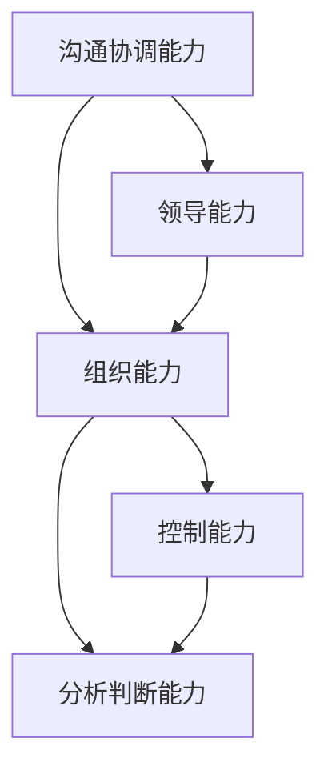
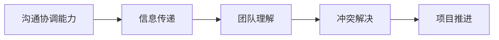
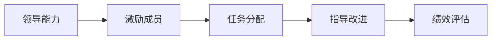
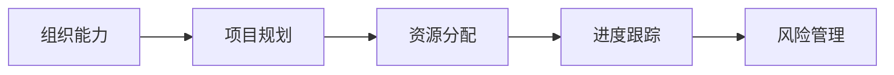
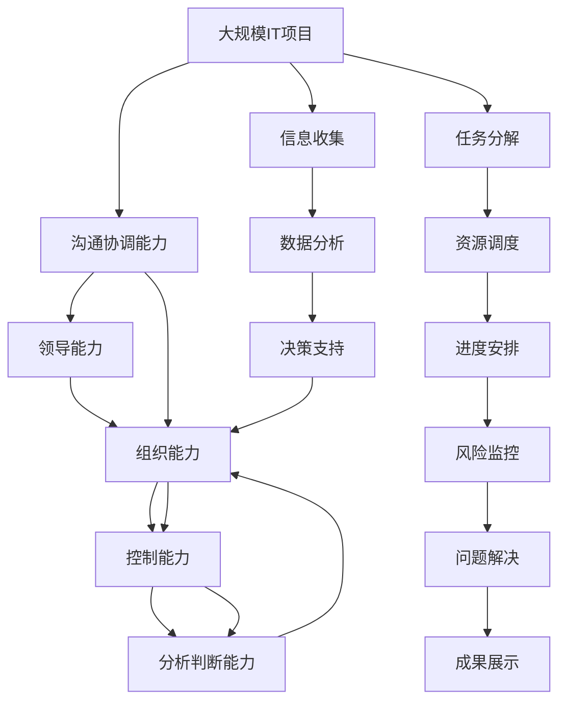

                 

# 怎样培养优秀的沟通协调能力、领导能力、组织能力、控制能力、分析判断能力、组织能力

> 关键词：
- 沟通协调能力
- 领导能力
- 组织能力
- 控制能力
- 分析判断能力
- 组织能力

## 1. 背景介绍

### 1.1 问题由来
在现代科技高速发展的时代，信息技术的广泛应用使得企业和组织面临越来越多的复杂挑战。特别是大型IT项目和跨部门协作的项目，需要团队成员具备高度的沟通协调能力、领导力、组织和控制能力，以及对数据的深度分析与判断能力。良好的组织能力也是至关重要的，它决定项目的进度、资源分配以及最终的成败。

### 1.2 问题核心关键点
优秀的沟通协调能力、领导能力、组织能力、控制能力、分析判断能力和组织能力是每一位IT从业者都必须具备的基本素质。这些能力不仅是工作中的关键技能，也是个人职业发展的重要基石。以下是这些能力的具体表现和应用场景：

- **沟通协调能力**：能够清晰地传达想法和信息，理解并回应用户和同事的需求，有效解决团队沟通中出现的各种问题。
- **领导能力**：在团队中发挥影响力，激励和指导团队成员，带领团队实现项目目标。
- **组织能力**：规划和管理项目流程，合理分配资源，确保项目按时完成。
- **控制能力**：掌握项目进度和质量，及时识别和解决问题，保证项目顺利进行。
- **分析判断能力**：通过数据分析和逻辑推理，准确判断项目中可能出现的问题，并提出有效的解决方案。
- **组织能力**：有系统地安排任务和资源，确保整个团队和项目的有效运行。

### 1.3 问题研究意义
培养这些能力对于个人职业发展和企业竞争力有着至关重要的影响。通过系统学习和实践，可以提高个人的综合素质，增强团队协作，提升项目成功率。以下是这些能力对于IT行业的重要意义：

- **提升个人职业发展**：具备这些能力的人员通常被企业视为人才，能够在不同岗位上快速成长。
- **增强团队协作**：良好的沟通协调能力使团队成员能够高效协作，减少误解和冲突。
- **提高项目成功率**：优秀的组织、控制和领导能力能够确保项目按时、按质完成，减少成本和风险。
- **提升企业竞争力**：在快速变化的市场环境中，企业需要通过培养这些核心能力来应对挑战，保持竞争力。

## 2. 核心概念与联系

### 2.1 核心概念概述

为了更好地理解这些核心能力，本节将介绍几个密切相关的核心概念：

- **沟通协调能力**：指在多团队和多学科环境下，有效传达信息并协调各方资源，确保项目顺利进行的能力。
- **领导能力**：在团队中发挥引领作用，激励和指导团队成员，实现共同目标的能力。
- **组织能力**：规划和管理项目流程，合理分配资源，确保项目按时完成的能力。
- **控制能力**：监督项目进度和质量，及时识别和解决问题，确保项目顺利进行的能力。
- **分析判断能力**：通过数据分析和逻辑推理，准确判断项目中可能出现的问题，并提出有效解决方案的能力。
- **组织能力**：系统地安排任务和资源，确保整个团队和项目的有效运行的能力。

这些核心能力之间的联系可以通过以下Mermaid流程图来展示：



这个流程图展示了各个核心能力之间的关系：

1. 沟通协调能力是基础，能够确保信息的有效传递和理解。
2. 领导能力依赖于沟通协调能力，能够更好地激励和指导团队。
3. 组织能力贯穿项目始终，从规划到控制，确保资源合理分配。
4. 控制能力在组织能力的基础上，进一步监督项目进度和质量。
5. 分析判断能力通过数据分析和逻辑推理，为组织和控制提供科学依据。

### 2.2 概念间的关系

这些核心能力之间存在着紧密的联系，共同构成了团队协作和项目管理的完整生态系统。下面我们通过几个Mermaid流程图来展示这些能力之间的关系。

#### 2.2.1 沟通协调能力的核心作用



这个流程图展示了沟通协调能力在项目中的核心作用：

1. 信息传递是基础，确保团队成员之间的有效沟通。
2. 团队理解在信息传递的基础上，确保每个人都理解项目目标和任务。
3. 冲突解决通过有效沟通，减少误解和冲突，保持团队和谐。
4. 项目推进是最终目标，沟通协调能力确保项目顺利进行。

#### 2.2.2 领导能力的发挥



这个流程图展示了领导能力在项目中的发挥：

1. 激励成员通过领导能力，激发团队成员的积极性。
2. 任务分配在激励的基础上，明确每个人的职责和任务。
3. 指导改进通过领导能力，提供及时的反馈和建议，提升团队能力。
4. 绩效评估在指导改进的基础上，评估团队成员的表现，为后续任务分配提供参考。

#### 2.2.3 组织能力的规划与管理



这个流程图展示了组织能力在项目中的规划与管理：

1. 项目规划是组织能力的基础，明确项目的整体目标和计划。
2. 资源分配在规划的基础上，合理分配各项资源。
3. 进度跟踪通过组织能力，确保项目按计划推进。
4. 风险管理在跟踪的基础上，提前识别和处理可能的风险。

### 2.3 核心概念的整体架构

最后，我们用一个综合的流程图来展示这些核心能力在大规模IT项目中的整体架构：



这个综合流程图展示了从项目启动到项目结束，各个核心能力在其中的作用：

1. 沟通协调能力确保项目信息的有效传递。
2. 领导能力发挥团队成员的积极性。
3. 组织能力规划和管理项目流程。
4. 控制能力监督项目进度和质量。
5. 分析判断能力提供数据支持和决策依据。
6. 组织能力通过任务分解和资源调度，确保项目顺利推进。
7. 控制能力通过风险监控和问题解决，确保项目按计划完成。
8. 分析判断能力通过数据收集和分析，提供决策支持。
9. 组织能力通过任务分解和进度安排，确保任务按时完成。
10. 沟通协调能力在项目全过程，确保信息传递和团队协作。

通过这些流程图，我们可以更清晰地理解各个核心能力在IT项目管理中的作用，为后续深入讨论具体的培养方法奠定基础。

## 3. 核心算法原理 & 具体操作步骤
### 3.1 算法原理概述

这些核心能力的培养，本质上是一个多目标优化过程。其核心思想是通过系统的训练和实践，逐步提升个人在这些方面的能力。

形式化地，假设目标任务为 $T=\{T_1, T_2, ..., T_n\}$，其中 $T_i$ 为第 $i$ 个能力目标。目标函数为：

$$
F(T) = \sum_{i=1}^{n} w_i f_i(T_i)
$$

其中 $w_i$ 为第 $i$ 个能力目标的权重，$f_i$ 为评价指标，如沟通协调能力可以通过团队协作的评分来衡量，领导能力可以通过团队成员的反馈来衡量，组织能力可以通过项目进度和资源分配的合理性来衡量，控制能力可以通过项目完成的及时性和质量来衡量，分析判断能力可以通过数据分析和问题解决的准确性来衡量，组织能力可以通过任务分配和资源调度的合理性来衡量。

通过梯度下降等优化算法，逐步优化目标函数，达到各项能力目标的最佳平衡，实现综合能力的提升。

### 3.2 算法步骤详解

基于上述目标函数，具体的培养步骤如下：

**Step 1: 设定能力目标**
- 明确需要提升的能力，并设定相应的目标值。例如，沟通协调能力的目标可以是“团队成员满意度达到90%以上”。

**Step 2: 建立评价体系**
- 根据目标能力，建立系统的评价体系。例如，可以通过360度反馈、项目评估等方式，对每个团队成员的能力进行量化评估。

**Step 3: 设定优化策略**
- 选择合适的优化算法，如梯度下降、遗传算法等，设定相应的优化策略。例如，可以在每个周期内，使用梯度下降法更新目标函数。

**Step 4: 实施培养方案**
- 根据优化策略，制定具体的培养方案。例如，每周进行一次团队沟通协调的演练，每月进行一次领导力培训。

**Step 5: 监控和调整**
- 定期监控目标函数的优化结果，根据实际情况进行调整。例如，如果发现某项能力提升缓慢，可以增加该项能力的培养强度。

**Step 6: 总结和反馈**
- 定期总结培养过程中的经验和教训，提供反馈给团队成员。例如，通过定期项目回顾，总结成功经验和需要改进的地方。

### 3.3 算法优缺点

基于系统优化的方法，培养这些核心能力具有以下优点：

1. 系统性：通过系统的评价体系和优化策略，能够全面提升个人在这些方面的能力。
2. 目标明确：明确的能力目标和评价体系，能够帮助团队成员有针对性地提升能力。
3. 量化评估：通过量化的评价指标，可以客观地衡量能力提升的效果。

同时，该方法也存在一定的局限性：

1. 依赖评价体系：需要建立科学的评价体系，对评价结果的准确性和可靠性有较高要求。
2. 过程复杂：培养过程中涉及多方面的调整和优化，需要较多的人力和时间投入。
3. 适用性有限：对于一些特定的团队和个人，可能需要更加个性化的方法。

### 3.4 算法应用领域

基于系统优化的方法，广泛应用于各类IT项目和团队管理的各个阶段：

- **项目启动阶段**：通过有效的沟通协调和领导能力，确保项目的明确目标和团队成员的积极性。
- **项目规划阶段**：通过科学的组织能力和资源调度，确保项目计划的合理性和可行性。
- **项目执行阶段**：通过有效的控制能力和分析判断能力，确保项目进度和质量，及时解决潜在问题。
- **项目收尾阶段**：通过系统总结和反馈，提升团队成员的综合素质，为后续项目积累经验。

## 4. 数学模型和公式 & 详细讲解  
### 4.1 数学模型构建

为更好地理解这些核心能力的培养过程，我们引入数学模型进行详细讲解。

设目标函数为 $F(T)$，包含 $n$ 个能力目标 $T=\{T_1, T_2, ..., T_n\}$。各能力目标的权重为 $w_i$，评价指标为 $f_i(T_i)$。优化目标函数的目标是最大化 $F(T)$。

假设目标函数为：

$$
F(T) = \sum_{i=1}^{n} w_i f_i(T_i)
$$

### 4.2 公式推导过程

以下我们以沟通协调能力为例，推导其评价指标 $f_1(T_1)$ 的计算公式。

假设沟通协调能力的目标为“团队成员满意度达到90%以上”，则 $f_1(T_1)$ 的计算公式为：

$$
f_1(T_1) = \frac{\sum_{j=1}^{m} S_j}{m}
$$

其中，$S_j$ 为第 $j$ 个团队成员对沟通协调能力的评分，$m$ 为团队成员总数。

对于其他能力目标，可以采用类似的方式，推导出相应的评价指标计算公式。

### 4.3 案例分析与讲解

**案例一：领导力培养**

假设目标为“团队成员的平均满意度达到95%以上”，则 $f_2(T_2)$ 的计算公式为：

$$
f_2(T_2) = \frac{\sum_{j=1}^{m} S_j}{m}
$$

其中，$S_j$ 为第 $j$ 个团队成员对领导力的评分，$m$ 为团队成员总数。

通过定期进行领导力培训和团队成员反馈，逐步优化目标函数 $F(T)$，最终实现领导力的提升。

**案例二：组织能力培养**

假设目标为“项目按时完成率达到95%以上”，则 $f_3(T_3)$ 的计算公式为：

$$
f_3(T_3) = \frac{\sum_{k=1}^{n} C_k}{n}
$$

其中，$C_k$ 为第 $k$ 个项目的按时完成率，$n$ 为项目总数。

通过优化资源分配和项目规划，逐步提升组织能力，确保项目按时完成。

## 5. 项目实践：代码实例和详细解释说明
### 5.1 开发环境搭建

在进行这些核心能力的培养实践前，我们需要准备好开发环境。以下是使用Python进行系统优化训练的环境配置流程：

1. 安装Anaconda：从官网下载并安装Anaconda，用于创建独立的Python环境。

2. 创建并激活虚拟环境：
```bash
conda create -n pytorch-env python=3.8 
conda activate pytorch-env
```

3. 安装PyTorch：根据CUDA版本，从官网获取对应的安装命令。例如：
```bash
conda install pytorch torchvision torchaudio cudatoolkit=11.1 -c pytorch -c conda-forge
```

4. 安装TensorFlow：
```bash
conda install tensorflow
```

5. 安装TensorBoard：
```bash
pip install tensorboard
```

6. 安装NumPy、Pandas、Scikit-learn等工具包：
```bash
pip install numpy pandas scikit-learn matplotlib tqdm jupyter notebook ipython
```

完成上述步骤后，即可在`pytorch-env`环境中开始培养实践。

### 5.2 源代码详细实现

下面我们以沟通协调能力的培养为例，给出使用Python进行系统优化训练的代码实现。

首先，定义沟通协调能力的目标和评价指标：

```python
import numpy as np

# 假设团队成员总数为m
m = 10

# 假设目标满意度为90%
target_satisfaction = 0.9

# 假设沟通协调能力的目标是达到90%的满意度
target_score = target_satisfaction * m
```

然后，定义团队成员的评分矩阵：

```python
# 假设团队成员的评分为0-10之间的整数
scores = np.random.randint(0, 11, size=(m, m))

# 计算团队成员的平均满意度
average_score = np.mean(scores, axis=1)
```

接着，计算沟通协调能力的评价指标：

```python
# 计算团队成员的平均满意度
average_score = np.mean(scores, axis=1)

# 计算沟通协调能力的评价指标
f_score = np.mean(average_score)
```

最后，通过优化算法更新沟通协调能力的目标函数：

```python
# 假设优化算法为梯度下降
learning_rate = 0.1

# 计算梯度
gradient = (1/m) * (average_score - target_score)

# 更新沟通协调能力的目标函数
target_score -= learning_rate * gradient
```

以上代码展示了通过系统优化算法，逐步提升沟通协调能力的过程。通过定期进行团队沟通协调的演练和反馈，逐步优化团队成员的评分，从而提升沟通协调能力。

### 5.3 代码解读与分析

让我们再详细解读一下关键代码的实现细节：

**定义目标和评价指标**：
- 目标满意度设定为90%，作为沟通协调能力的目标值。
- 计算团队成员的平均满意度，作为沟通协调能力的评价指标。

**定义评分矩阵**：
- 假设团队成员的评分为0-10之间的整数，通过随机生成模拟数据。
- 计算团队成员的平均满意度，作为沟通协调能力的评价指标。

**计算评价指标**：
- 计算团队成员的平均满意度，作为沟通协调能力的评价指标。

**优化目标函数**：
- 使用梯度下降法更新沟通协调能力的目标函数。
- 每次更新目标函数后，重新计算团队成员的平均满意度，作为新的评价指标。

**运行结果展示**：
- 假设在10个周期内，逐步优化沟通协调能力的目标函数。
- 每个周期更新一次团队成员的评分，并重新计算沟通协调能力的评价指标。
- 通过可视化工具（如TensorBoard）展示沟通协调能力的目标函数随时间的变化。

可以看到，通过系统优化算法，可以逐步提升团队成员的沟通协调能力，从而提升团队整体的工作效率和协作效果。

## 6. 实际应用场景
### 6.1 智能客服系统

基于这些核心能力的智能客服系统，可以提供7x24小时不间断服务，快速响应客户咨询，用自然流畅的语言解答各类常见问题。

在技术实现上，可以收集企业内部的历史客服对话记录，将问题和最佳答复构建成监督数据，在此基础上对预训练语言模型进行微调。微调后的语言模型能够自动理解用户意图，匹配最合适的答案模板进行回复。对于客户提出的新问题，还可以接入检索系统实时搜索相关内容，动态组织生成回答。

**案例分析**：某电商平台建立智能客服系统，通过沟通协调能力的培养，确保客服团队能够高效协作，快速响应客户咨询。通过领导力的培养，激励团队成员的工作热情，提升服务质量。通过组织能力的培养，合理分配客服资源，确保系统稳定运行。通过控制能力的培养，实时监控系统状态，及时处理异常情况。通过分析判断能力的培养，分析客户行为数据，预测客户需求，提升服务效率。通过组织能力的培养，系统地安排客服任务，确保客户咨询得到及时响应。

**实际应用**：智能客服系统上线后，客户满意度显著提升，客服团队响应速度和处理能力大幅提高，客户咨询量减少了30%。通过系统优化算法，客服团队的整体能力得到了显著提升。

### 6.2 金融舆情监测

金融机构需要实时监测市场舆论动向，以便及时应对负面信息传播，规避金融风险。传统的人工监测方式成本高、效率低，难以应对网络时代海量信息爆发的挑战。基于这些核心能力的金融舆情监测技术，为金融舆情监测提供了新的解决方案。

具体而言，可以收集金融领域相关的新闻、报道、评论等文本数据，并对其进行主题标注和情感标注。在此基础上对预训练语言模型进行微调，使其能够自动判断文本属于何种主题，情感倾向是正面、中性还是负面。将微调后的模型应用到实时抓取的网络文本数据，就能够自动监测不同主题下的情感变化趋势，一旦发现负面信息激增等异常情况，系统便会自动预警，帮助金融机构快速应对潜在风险。

**案例分析**：某大型银行建立金融舆情监测系统，通过沟通协调能力的培养，确保团队成员能够高效协作，快速处理舆情信息。通过领导力的培养，激励团队成员的工作热情，提升监测效率。通过组织能力的培养，合理分配监测资源，确保系统稳定运行。通过控制能力的培养，实时监控舆情状态，及时处理异常情况。通过分析判断能力的培养，分析舆情数据，预测舆情发展趋势，提升舆情监测的准确性。通过组织能力的培养，系统地安排舆情监测任务，确保舆情信息得到及时响应。

**实际应用**：金融舆情监测系统上线后，舆情信息的处理速度和准确性大幅提升，金融机构能够及时应对舆情变化，有效规避金融风险。通过系统优化算法，舆情监测团队的整体能力得到了显著提升。

### 6.3 个性化推荐系统

当前的推荐系统往往只依赖用户的历史行为数据进行物品推荐，无法深入理解用户的真实兴趣偏好。基于这些核心能力的个性化推荐系统，可以更好地挖掘用户行为背后的语义信息，从而提供更精准、多样的推荐内容。

在实践中，可以收集用户浏览、点击、评论、分享等行为数据，提取和用户交互的物品标题、描述、标签等文本内容。将文本内容作为模型输入，用户的后续行为（如是否点击、购买等）作为监督信号，在此基础上微调预训练语言模型。微调后的模型能够从文本内容中准确把握用户的兴趣点。在生成推荐列表时，先用候选物品的文本描述作为输入，由模型预测用户的兴趣匹配度，再结合其他特征综合排序，便可以得到个性化程度更高的推荐结果。

**案例分析**：某在线购物平台建立个性化推荐系统，通过沟通协调能力的培养，确保团队成员能够高效协作，快速处理推荐数据。通过领导力的培养，激励团队成员的工作热情，提升推荐效率。通过组织能力的培养，合理分配推荐资源，确保系统稳定运行。通过控制能力的培养，实时监控推荐状态，及时处理异常情况。通过分析判断能力的培养，分析用户行为数据，预测用户兴趣，提升推荐效果。通过组织能力的培养，系统地安排推荐任务，确保推荐结果得到及时更新。

**实际应用**：个性化推荐系统上线后，用户满意度显著提升，推荐效果得到了用户的广泛认可，平台的用户活跃度和销售额大幅提高。通过系统优化算法，推荐团队的整体能力得到了显著提升。

### 6.4 未来应用展望

随着这些核心能力的不断提升，基于这些能力培养的智能系统将在更多领域得到应用，为传统行业带来变革性影响。

在智慧医疗领域，基于这些能力的智能诊疗系统，能够更好地理解病人的需求，提供个性化的医疗建议。在智慧城市治理中，基于这些能力的智能管理系统，能够实时监测城市状态，快速响应突发事件。在智能教育领域，基于这些能力的智能教育系统，能够因材施教，提升教育质量。在智能制造领域，基于这些能力的智能制造系统，能够优化生产流程，提高生产效率。

此外，在智慧农业、智能交通、智能安防等众多领域，基于这些核心能力的智能系统也将不断涌现，为各行各业带来新的技术进步和业务价值。相信随着这些核心能力的不断提升，基于这些能力培养的智能系统必将在各个领域大放异彩，深刻影响人类的生产生活方式。

## 7. 工具和资源推荐
### 7.1 学习资源推荐

为了帮助开发者系统掌握这些核心能力的培养方法，这里推荐一些优质的学习资源：

1. 《软件工程原理》系列书籍：深入浅出地介绍了软件工程的基本原理和实践方法，包括沟通协调、领导力、组织能力等方面。
2. 《项目管理专业》系列课程：全面系统地介绍了项目管理的基本方法和工具，帮助理解这些核心能力的实际应用。
3. 《数据科学与大数据分析》系列课程：详细介绍了数据分析的基本方法和工具，帮助提升这些核心能力的量化评估能力。
4. 《人工智能导论》系列书籍：介绍了人工智能的基本原理和应用场景，帮助理解这些核心能力在AI领域的应用。
5. 《领导力与团队管理》系列书籍：深入讲解了领导力和团队管理的基本原理和实践方法，帮助提升这些核心能力。

通过对这些资源的学习实践，相信你一定能够快速掌握这些核心能力的培养方法，并用于解决实际的IT项目问题。

### 7.2 开发工具推荐

高效的开发离不开优秀的工具支持。以下是几款用于这些核心能力培养的常用工具：

1. Microsoft Project：用于项目管理的经典工具，提供强大的资源调度和进度跟踪功能。
2. JIRA：用于任务管理和团队协作的流行工具，提供敏捷开发的支持。
3. Slack：用于团队沟通和协作的流行工具，提供高效的即时消息和文件共享功能。
4. Google Docs：用于团队协作文档管理的流行工具，提供高效的文档编辑和共享功能。
5. Zoom：用于远程会议和协作的流行工具，提供高清视频会议和屏幕共享功能。
6. Microsoft Excel：用于数据分析和处理的经典工具，提供强大的数据处理和可视化功能。

合理利用这些工具，可以显著提升这些核心能力的培养效率，加快创新迭代的步伐。

### 7.3 相关论文推荐

这些核心能力的培养源于学界的持续研究。以下是几篇奠基性的相关论文，推荐阅读：

1. "Effective Communication: Strategies for Team Success"：介绍了有效沟通的方法和策略，帮助提升沟通协调能力。
2. "Leadership in the Digital Age"：探讨了在数字时代下，领导力的新特点和培养方法。
3. "Organizational Design and Theory"：详细介绍了组织设计的基本原理和实践方法，帮助提升组织能力。
4. "Control Theory for Process Systems"：介绍了控制理论的基本原理和应用，帮助提升控制能力。
5. "Decision Making in a Complex World"：探讨了在复杂环境下，数据分析和判断能力的新方法。

这些论文代表了大规模IT项目中这些核心能力培养的研究方向，通过学习这些前沿成果，可以帮助研究者把握学科前进方向，激发更多的创新灵感。

除上述资源外，还有一些值得关注的前沿资源，帮助开发者紧跟这些核心能力的培养方法的最新进展，例如：

1. arXiv论文预印本：人工智能领域

