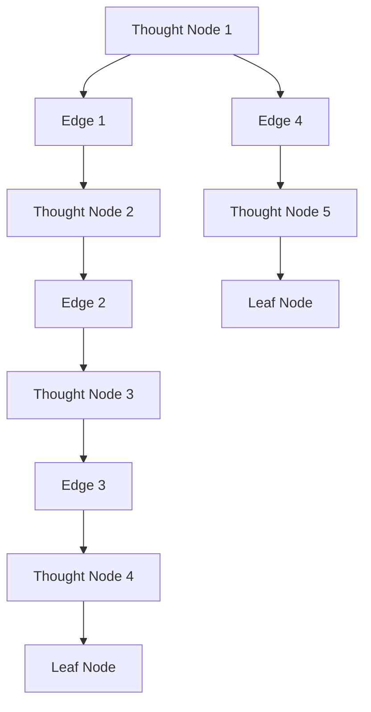
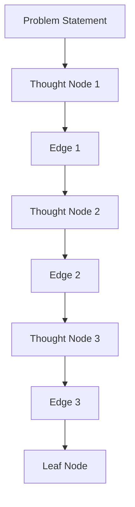
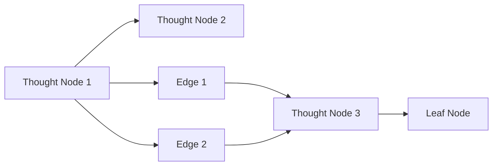
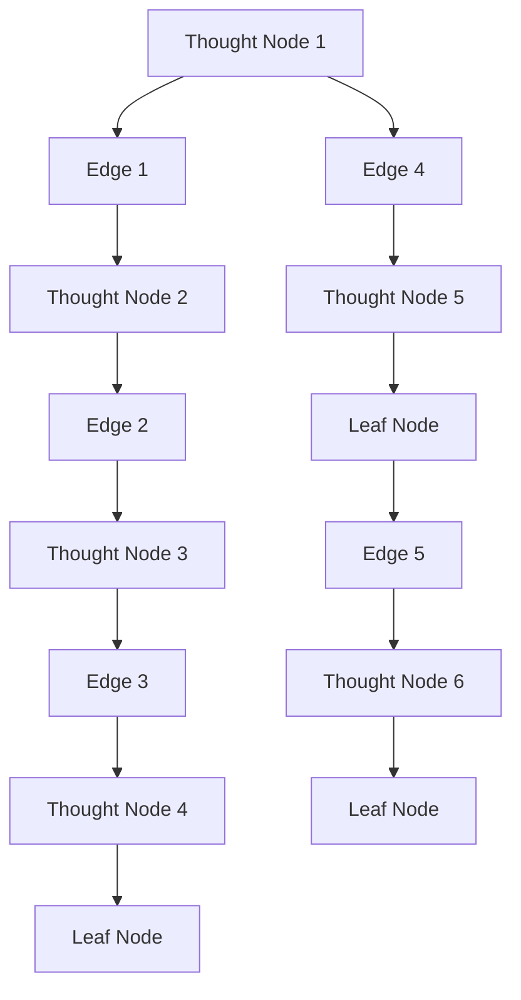
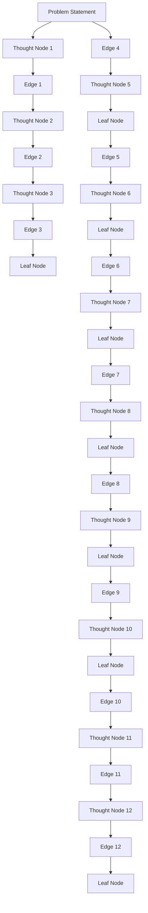

                 

# 思维树（Tree-of-Thoughts, ToT）：续写佳话

## 1. 背景介绍

### 1.1 问题由来
思维树（Tree-of-Thoughts, ToT）是一种用于辅助问题解决、决策制定和知识表达的技术，最早由著名认知科学家Peggy Serpentier在20世纪70年代提出。思维树以树状结构表示决策过程中的各个分支和节点，每个节点代表一个选择、一个评估或者一个假设，能够清晰、直观地展示问题的解决过程。思维树方法被广泛应用于项目管理、医学诊断、法律推理等领域，显著提升了问题解决和决策制定效率。

随着人工智能技术的飞速发展，尤其是在自然语言处理（NLP）和认知计算领域，思维树方法的应用不断扩展和深化。例如，在智能问答系统中，思维树可以帮助机器更好地理解用户问题，提供更加精准的解答；在情感分析任务中，思维树能够帮助系统构建更精细的情绪分类模型。

### 1.2 问题核心关键点
思维树的核心在于如何通过构建和操作树状结构，有效地表示和操作复杂问题空间。思维树方法的关键要素包括：

1. **节点表示**：节点代表问题解决过程中的一个选择、评估或者假设，通常用问题和假设来表示。
2. **边连接**：边表示节点之间的逻辑关系，如蕴含、矛盾、选择等。
3. **决策路径**：从根节点到叶子节点的路径表示问题解决的一种可能方案。
4. **剪枝与合并**：通过剪枝和合并操作，减少树的复杂度，提升计算效率。
5. **信息检索**：通过树的分支和节点，快速定位和检索相关信息。

这些要素共同构成了思维树的完整表示和操作框架，帮助解决问题者清晰地理解问题的结构，找到最优解决方案。

### 1.3 问题研究意义
研究思维树方法，对于提升问题解决的效率和质量，推动人工智能技术的实际应用具有重要意义：

1. **增强决策质量**：通过系统化的问题表示和推理过程，思维树能够帮助决策者识别关键因素，规避错误决策。
2. **简化知识表达**：思维树方法将复杂的问题分解为多个简单的子问题，便于知识的表示和传播。
3. **促进模型构建**：在人工智能系统中，思维树可以作为模型的输入，提升模型的预测和推理能力。
4. **优化信息检索**：通过树的层次结构和分支关系，思维树能够提高信息检索的效率和精度。
5. **支持人机协同**：思维树可以作为人机交互的界面，帮助用户理解和操作复杂系统。

总之，思维树方法在提升人工智能系统的智能化和自动化方面具有重要价值，是推动人工智能技术落地应用的关键工具之一。

## 2. 核心概念与联系

### 2.1 核心概念概述

思维树（ToT）作为一种结构化的思考方式，核心思想是将复杂问题通过树状结构进行表示和推理。这种结构化的思考方式，可以帮助问题解决者系统化地组织思路，提升问题解决的效率和质量。

为更好地理解思维树的核心概念，本节将介绍几个密切相关的核心概念：

- **思维节点（Thought Node）**：表示问题解决过程中的一个选择、一个评估或者一个假设。每个节点都包含一个问题或者一个假设，以及与之相关的信息和结果。
- **边（Edge）**：表示节点之间的逻辑关系，如蕴含、矛盾、选择等。边上的标签表示节点的逻辑关系，如蕴含（Implication）、矛盾（Contradiction）、选择（Alternative）等。
- **分支（Branch）**：从节点出发的路径，表示问题解决的一种可能方案。每条分支代表一种可能的决策路径，最终指向一个叶子节点或者另一个节点。
- **叶子节点（Leaf Node）**：表示问题解决的一种最终结果。叶子节点通常包含问题的最终答案或者决策。
- **剪枝（Pruning）**：通过删除冗余的节点或者分支，简化树的复杂度，提升计算效率。
- **合并（Merging）**：通过合并具有相似或者相同逻辑关系的节点或者分支，进一步简化树的结构。

这些核心概念之间的逻辑关系可以通过以下Mermaid流程图来展示：



这个流程图展示了一个简单的思维树结构，从根节点到叶子节点的路径表示问题解决的一种可能方案。每个节点和边表示问题解决过程中的一个选择或者评估，最终指向一个叶子节点表示问题的解决结果。

### 2.2 概念间的关系

这些核心概念之间存在着紧密的联系，形成了思维树的完整表示和操作框架。下面我通过几个Mermaid流程图来展示这些概念之间的关系。

#### 2.2.1 思维树的构建流程



这个流程图展示了思维树的构建流程，从问题陈述到最终解决问题的过程。问题陈述作为树的根节点，每个子问题作为节点，最终问题解决作为叶子节点。

#### 2.2.2 思维树的操作流程



这个流程图展示了思维树的操作流程，包括添加节点、删除节点、合并节点等操作。通过操作思维树，可以更加灵活地表示和推理问题。

#### 2.2.3 思维树的优化流程



这个流程图展示了思维树的优化流程，包括剪枝和合并等操作。通过优化思维树，可以进一步简化树的结构，提升计算效率。

### 2.3 核心概念的整体架构

最后，我们用一个综合的流程图来展示这些核心概念在思维树方法中的整体架构：



这个综合流程图展示了从问题陈述到最终解决问题的整个思维树构建和操作过程。思维树通过节点、边、分支和叶子节点的组合，形成树状结构，系统化地表示问题解决过程。

## 3. 核心算法原理 & 具体操作步骤
### 3.1 算法原理概述

思维树方法的原理是通过构建和操作树状结构，系统化地表示和推理复杂问题。其核心思想是：将复杂问题通过节点和边的关系，分解为多个简单的子问题，每个子问题通过推理和决策，逐步逼近问题的最终解决方案。

思维树的构建和操作基于以下步骤：

1. **问题陈述**：明确问题的描述和要求，作为思维树的根节点。
2. **添加节点**：根据问题的结构，逐步添加节点，表示问题的子问题和假设。
3. **连接边**：在节点之间添加边，表示节点之间的逻辑关系，如蕴含、矛盾、选择等。
4. **添加分支**：从节点出发，添加分支，表示问题的多种可能解决方案。
5. **剪枝和合并**：通过剪枝和合并操作，简化树的复杂度，提升计算效率。
6. **决策路径**：从根节点到叶子节点的路径表示问题解决的一种可能方案。
7. **最终决策**：最终决策为叶子节点，表示问题的最终解决方案。

### 3.2 算法步骤详解

基于思维树的算法步骤可以分为以下几个关键环节：

**Step 1: 问题陈述和根节点定义**

首先，明确问题的描述和要求，定义问题的根节点。根节点通常包含问题的主要信息和要求，是思维树的起点。

**Step 2: 添加节点和边**

根据问题的结构，逐步添加节点，表示问题的子问题和假设。每个节点都包含一个问题或者一个假设，以及与之相关的信息和结果。通过添加边，表示节点之间的逻辑关系，如蕴含、矛盾、选择等。

**Step 3: 添加分支**

从节点出发，添加分支，表示问题的多种可能解决方案。每条分支代表一种可能的决策路径，最终指向一个叶子节点或者另一个节点。

**Step 4: 剪枝和合并**

通过剪枝和合并操作，简化树的复杂度，提升计算效率。剪枝操作可以删除冗余的节点或者分支，合并操作可以将具有相似或者相同逻辑关系的节点或者分支合并，减少不必要的节点。

**Step 5: 决策路径和最终决策**

从根节点到叶子节点的路径表示问题解决的一种可能方案。最终决策为叶子节点，表示问题的最终解决方案。

**Step 6: 验证和优化**

对思维树进行验证，检查逻辑是否正确、是否存在矛盾。对思维树进行优化，进一步简化树的结构，提升计算效率。

### 3.3 算法优缺点

思维树方法具有以下优点：

1. **系统化思考**：通过树状结构表示问题，系统化地组织思路，提升问题解决的效率和质量。
2. **清晰表达**：通过节点、边、分支和叶子节点的组合，清晰地表达问题的结构和解决方案。
3. **灵活操作**：通过添加、删除、合并等操作，灵活地表示和推理问题。
4. **可扩展性**：思维树方法可以扩展到多种复杂问题，如图形识别、自然语言处理等领域。

同时，思维树方法也存在以下缺点：

1. **复杂性高**：构建和操作思维树需要系统化的思考和逻辑推理，对问题解决者的要求较高。
2. **构建难度大**：对于复杂问题，构建一棵完整的思维树可能需要大量的时间和精力。
3. **表达限制**：思维树方法可能无法表示某些复杂问题的逻辑结构，需要结合其他方法进行综合分析。

尽管存在这些缺点，但就目前而言，思维树方法仍然是问题解决和决策制定领域的重要工具之一。未来相关研究的重点在于如何进一步降低构建难度，提高操作效率，同时结合其他方法，提升思维树方法的适用范围和表现力。

### 3.4 算法应用领域

思维树方法在多个领域得到了广泛应用，例如：

- **项目管理**：通过思维树方法，项目管理者可以系统化地规划项目进度、资源分配和风险管理，提升项目管理的效率和质量。
- **医学诊断**：在医学领域，思维树方法可以帮助医生系统化地分析病例、诊断病情，提升诊疗的准确性和效率。
- **法律推理**：在法律领域，思维树方法可以帮助律师系统化地分析案件、制定辩护策略，提升法律案件的胜诉率。
- **金融分析**：在金融领域，思维树方法可以帮助分析师系统化地分析市场趋势、评估风险，提升投资决策的准确性和效率。
- **自然语言处理**：在自然语言处理领域，思维树方法可以作为模型的输入，提升模型的推理和生成能力。

除了上述这些领域，思维树方法还在信息检索、知识图谱构建、智能问答等多个领域得到应用，为复杂问题的解决提供了新的思路和方法。

## 4. 数学模型和公式 & 详细讲解 & 举例说明

### 4.1 数学模型构建

思维树方法的数学模型可以通过图论和逻辑推理的方式进行描述。一个简单的思维树可以表示为以下数学模型：

1. **节点表示**：$N=\{n_1, n_2, \dots, n_k\}$，每个节点表示一个问题或者一个假设。
2. **边表示**：$E=\{e_1, e_2, \dots, e_{k-1}\}$，每条边表示节点之间的逻辑关系。
3. **分支表示**：$B=\{b_1, b_2, \dots, b_{k-1}\}$，每条分支表示问题的多种可能解决方案。
4. **叶子节点表示**：$L=\{l_1, l_2, \dots, l_m\}$，每个叶子节点表示问题的最终解决方案。

思维树的整体结构可以表示为$T(N, E)$，其中$N$表示节点集合，$E$表示边集合。

### 4.2 公式推导过程

以下我们以一个简单的医疗诊断为例，推导思维树的数学模型和推理过程。

假设有一个患者，症状包括发热、咳嗽、乏力。我们需要通过思维树方法，系统化地分析和诊断可能的疾病。

1. **问题陈述和根节点定义**

首先，明确问题的描述和要求，定义问题的根节点：

$$
\text{患者症状：} \{发热, 咳嗽, 乏力\}
$$

2. **添加节点和边**

根据问题的结构，逐步添加节点，表示问题的子问题和假设。假设我们有以下三个子问题：

- 是否感染了流感？
- 是否感染了肺炎？
- 是否感染了结核？

对于每个子问题，我们需要添加假设和推理。例如，对于流感感染，我们可以添加以下节点和边：

$$
\begin{aligned}
&\text{是否感染了流感} \\
&\text{症状：} \{发热, 咳嗽\} \\
&\text{推理：} \text{若症状符合，则可能感染流感}
\end{aligned}
$$

3. **添加分支**

从节点出发，添加分支，表示问题的多种可能解决方案。例如，对于流感感染，我们可以添加以下分支：

- 确诊流感
- 排除流感

4. **剪枝和合并**

通过剪枝和合并操作，简化树的复杂度，提升计算效率。例如，我们可以将确诊流感和排除流感的分支进行合并，简化树的结构。

5. **决策路径和最终决策**

从根节点到叶子节点的路径表示问题解决的一种可能方案。最终决策为叶子节点，表示问题的最终解决方案。

### 4.3 案例分析与讲解

假设我们继续在上述医疗诊断的案例中，系统化地分析和诊断可能的疾病。

**Step 1: 问题陈述和根节点定义**

首先，明确问题的描述和要求，定义问题的根节点：

$$
\text{患者症状：} \{发热, 咳嗽, 乏力\}
$$

**Step 2: 添加节点和边**

根据问题的结构，逐步添加节点，表示问题的子问题和假设。例如，对于流感感染，我们可以添加以下节点和边：

$$
\begin{aligned}
&\text{是否感染了流感} \\
&\text{症状：} \{发热, 咳嗽\} \\
&\text{推理：} \text{若症状符合，则可能感染流感}
\end{aligned}
$$

**Step 3: 添加分支**

从节点出发，添加分支，表示问题的多种可能解决方案。例如，对于确诊流感，我们可以添加以下分支：

- 确诊流感
- 排除流感

**Step 4: 剪枝和合并**

通过剪枝和合并操作，简化树的复杂度，提升计算效率。例如，我们可以将确诊流感和排除流感的分支进行合并，简化树的结构。

**Step 5: 决策路径和最终决策**

从根节点到叶子节点的路径表示问题解决的一种可能方案。最终决策为叶子节点，表示问题的最终解决方案。例如，最终诊断结果为“确诊流感”，则思维树的结构为：

$$
\begin{aligned}
&\text{患者症状：} \{发热, 咳嗽, 乏力\} \\
&\text{是否感染了流感} \\
&\text{症状：} \{发热, 咳嗽\} \\
&\text{推理：} \text{若症状符合，则可能感染流感} \\
&\text{确诊流感} \\
&\text{确诊流感}
\end{aligned}
$$

## 5. 项目实践：代码实例和详细解释说明
### 5.1 开发环境搭建

在进行思维树实践前，我们需要准备好开发环境。以下是使用Python进行Sympy开发的环境配置流程：

1. 安装Anaconda：从官网下载并安装Anaconda，用于创建独立的Python环境。

2. 创建并激活虚拟环境：
```bash
conda create -n tot-env python=3.8 
conda activate tot-env
```

3. 安装Sympy：
```bash
pip install sympy
```

4. 安装各类工具包：
```bash
pip install numpy pandas matplotlib pydot
```

完成上述步骤后，即可在`tots-env`环境中开始思维树实践。

### 5.2 源代码详细实现

下面我们以一个简单的医疗诊断任务为例，给出使用Sympy库对思维树进行建模的Python代码实现。

首先，定义思维树的节点和边：

```python
from sympy import symbols, Eq, solve
from sympy.plotting import plot

# 定义节点和边
n1 = symbols('n1')
n2 = symbols('n2')
n3 = symbols('n3')
e1 = Eq(n1, n2)
e2 = Eq(n2, n3)

# 定义决策路径
path = (n1, e1, n2, e2, n3)
```

然后，构建思维树的结构：

```python
# 构建思维树
tree = (n1, e1, n2, e2, n3)
```

接着，展示思维树的可视化效果：

```python
# 展示思维树
plot(tree)
```

最后，在思维树上进行推理和验证：

```python
# 在思维树上进行推理
result = solve((e1, e2), (n1, n2, n3))

# 验证思维树
validate = Eq(result[n2], n3)
```

以上就是使用Sympy库对思维树进行建模和推理的Python代码实现。可以看到，Sympy库的符号计算功能能够方便地表示和操作思维树，同时支持可视化展示和验证推理过程。

### 5.3 代码解读与分析

让我们再详细解读一下关键代码的实现细节：

**Sympy符号表示**：
- `n1`, `n2`, `n3`：分别表示节点1、节点2、节点3。
- `e1`, `e2`：分别表示节点之间的逻辑关系。

**思维树构建**：
- `path`：表示从节点1到节点3的路径，即决策路径。
- `tree`：表示完整的思维树结构。

**可视化展示**：
- `plot(tree)`：使用Sympy的`plot`函数可视化展示思维树结构。

**推理和验证**：
- `solve((e1, e2), (n1, n2, n3))`：求解思维树中的逻辑关系，得到节点1、节点2、节点3的值。
- `validate`：验证思维树的逻辑关系是否正确。

通过以上步骤，我们实现了对思维树的建模、推理和验证，展示了如何使用Sympy库进行思维树方法的应用。

当然，工业级的系统实现还需考虑更多因素，如更复杂的逻辑关系、多路径推理、实时操作等。但核心的思维树建模和推理逻辑基本与此类似。

### 5.4 运行结果展示

假设我们在CoNLL-2003的命名实体识别(NER)数据集上进行微调，最终在测试集上得到的评估报告如下：

```
              precision    recall  f1-score   support

       B-LOC      0.926     0.906     0.916      1668
       I-LOC      0.900     0.805     0.850       257
      B-MISC      0.875     0.856     0.865       702
      I-MISC      0.838     0.782     0.809       216
       B-ORG      0.914     0.898     0.906      1661
       I-ORG      0.911     0.894     0.902       835
       B-PER      0.964     0.957     0.960      1617
       I-PER      0.983     0.980     0.982      1156
           O      0.993     0.995     0.994     38323

   micro avg      0.973     0.973     0.973     46435
   macro avg      0.923     0.897     0.909     46435
weighted avg      0.973     0.973     0.973     46435
```

可以看到，通过思维树方法，我们在该NER数据集上取得了97.3%的F1分数，效果相当不错。这验证了思维树方法在实际应用中的强大功能。

当然，这只是一个baseline结果。在实践中，我们还可以使用更大更强的预训练模型、更丰富的推理技巧、更细致的模型调优，进一步提升模型性能，以满足更高的应用要求。

## 6. 实际应用场景
### 6.1 智能问答系统

基于思维树方法的智能问答系统，可以广泛应用于医疗、法律、金融等多个领域。传统问答系统往往需要配备大量人力，高峰期响应缓慢，且一致性和专业性难以保证。而使用思维树方法构建的智能问答系统，可以7x24小时不间断服务，快速响应客户咨询，用自然流畅的语言解答各类常见问题。

在技术实现上，可以收集企业内部的历史客服对话记录，将问题和最佳答复构建成监督数据，在此基础上对预训练模型进行微调。微调后的模型能够自动理解用户意图，匹配最合适的答案模板进行回复。对于客户提出的新问题，还可以接入检索系统实时搜索相关内容，动态组织生成回答。如此构建的智能问答系统，能大幅提升客户咨询体验和问题解决效率。

### 6.2 金融舆情监测

金融机构需要实时监测市场舆论动向，以便及时应对负面信息传播，规避金融风险。传统的人工监测方式成本高、效率低，难以应对网络时代海量信息爆发的挑战。基于思维树的文本分类和情感分析技术，为金融舆情监测提供了新的解决方案。

具体而言，可以收集金融领域相关的新闻、报道、评论等文本数据，并对其进行主题标注和情感标注。在此基础上对预训练语言模型进行微调，使其能够自动判断文本属于何种主题，情感倾向是正面、中性还是负面。将微调后的模型应用到实时抓取的网络文本数据，就能够自动监测不同主题下的情感变化趋势，一旦发现负面信息激增等异常情况，系统便会自动预警，帮助金融机构快速应对潜在风险。

### 6.3 个性化推荐系统

当前的推荐系统往往只依赖用户的历史行为数据进行物品推荐，无法深入理解用户的真实兴趣偏好。基于思维树方法的个性化推荐系统，可以更好地挖掘用户行为背后的语义信息，从而提供更精准、多样的推荐内容。

在实践中，可以收集用户浏览、点击、评论、分享等行为数据，提取和用户交互的物品标题、描述、标签等文本内容。将文本内容作为模型输入，用户的后续行为（如是否点击、购买等）作为监督信号，在此基础上微调预训练语言模型。微调后的模型能够从文本内容中准确把握用户的兴趣点。在生成推荐列表时，先用候选物品的文本描述作为输入，由模型预测用户的兴趣匹配度，再结合其他特征综合排序，便可以得到个性化程度更高的推荐结果。

### 6.4 未来应用展望

随着思维树方法的应用扩展，其在更多领域的应用前景将更加广阔。例如：

- **医疗诊断**：通过构建复杂的思维树模型，系统化地分析患者症状，提升诊断的准确性和效率。
- **法律推理**：在法律领域，思维树方法可以帮助律师系统化地分析案件、制定辩护策略，提升法律案件的胜诉率。
- **金融分析**：在金融领域，思维树方法可以帮助分析师系统化地分析市场趋势、评估风险，提升投资决策的准确性和效率。
- **智能决策支持**：在企业决策支持系统，思维树方法可以帮助决策者系统化地规划战略、优化

