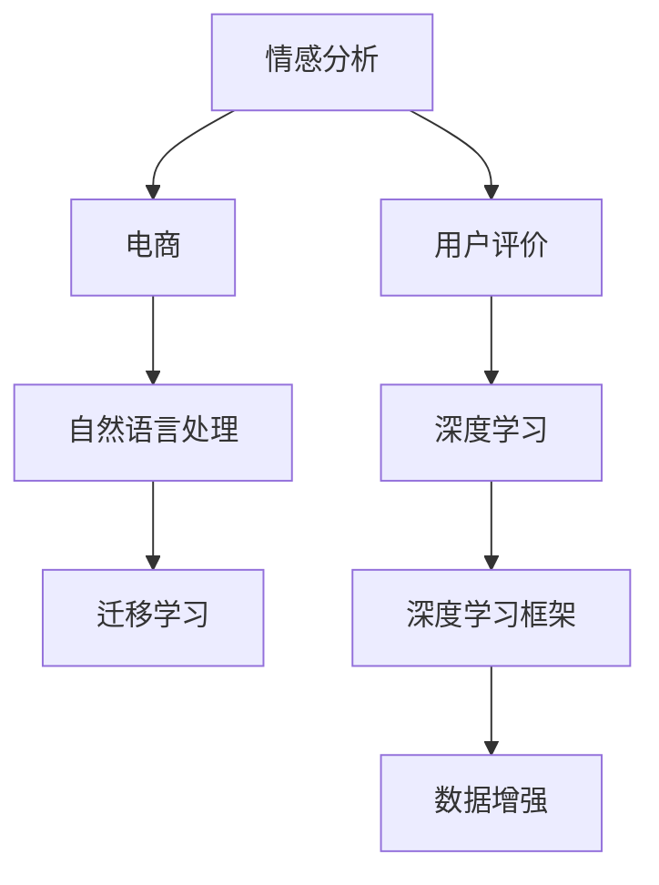
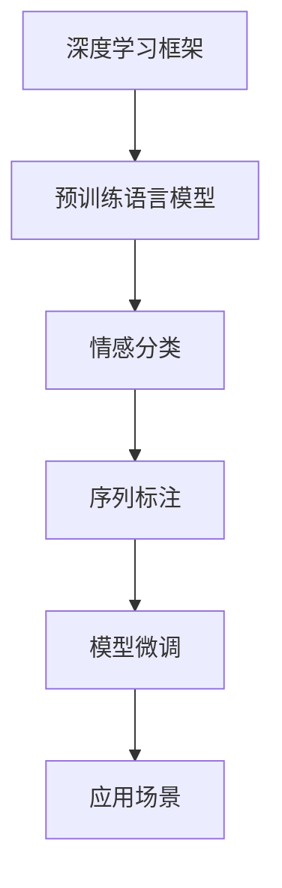
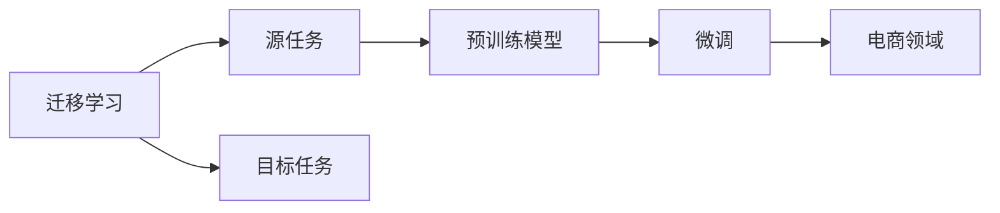
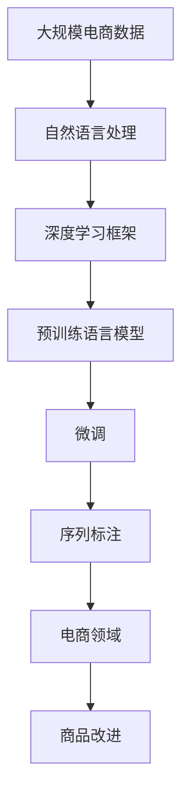

                 

# 情感分析在电商领域的应用：从用户评价到商品改进

> 关键词：情感分析, 电商, 用户评价, 商品改进, 自然语言处理(NLP), 深度学习, 迁移学习, 深度学习框架, 数据增强

## 1. 背景介绍

在当今电商领域，用户评价对于商品销量的影响日益显著。对于商家而言，如何有效利用用户评价中的情感信息，优化商品品质，提升用户体验，从而进一步提高销售额和品牌信誉，成为了一个重要课题。本文将探讨如何通过情感分析技术，深入挖掘用户评价中的情感倾向，从而指导商家进行商品改进。

### 1.1 问题由来

随着电子商务的迅猛发展，商家面临着越来越激烈的市场竞争。用户评价作为电商平台重要的反馈机制，不仅影响了商家的销量和排名，也成为品牌建设的关键要素。研究表明，用户评价中的情感信息能够显著影响消费者的购买决策。因此，利用情感分析技术，从海量用户评价中提取出情感信息，对于商家优化商品、提升用户满意度具有重要意义。

### 1.2 问题核心关键点

核心问题在于如何构建高效的情感分析模型，准确识别并提取用户评价中的情感倾向，从而为商家提供有价值的数据洞察。具体而言，包括以下几个关键点：

- 收集高质量的用户评价数据。
- 选择合适的情感分析模型，如基于机器学习的分类模型、基于深度学习的序列模型等。
- 设计有效的特征提取方法，以增强模型的识别能力。
- 对模型进行参数调优，提升模型的泛化性能。
- 将模型应用于实际场景，指导商品改进和用户反馈优化。

### 1.3 问题研究意义

进行情感分析不仅可以帮助商家优化商品，提升用户满意度，还有助于电商平台进行智能推荐，减少退换货率，降低运营成本。此外，情感分析作为NLP技术的重要应用之一，对于推动NLP技术的普及和商业化具有重要意义。

## 2. 核心概念与联系

### 2.1 核心概念概述

为更好地理解情感分析在电商领域的应用，本节将介绍几个密切相关的核心概念：

- 情感分析(Sentiment Analysis)：指通过自然语言处理技术，识别文本中的情感倾向，如正面、负面或中性。
- 电商(E-commerce)：指通过互联网进行的商品买卖交易活动，包括B2B、B2C、C2C等多种模式。
- 用户评价(User Review)：指消费者对商品或服务的评价和反馈，包括文字评论、评分、图片等。
- 自然语言处理(NLP)：指利用计算机技术处理和分析人类语言，包括文本预处理、特征提取、模型训练等。
- 深度学习(Deep Learning)：指利用深度神经网络模型进行复杂任务处理的技术，如情感分析。
- 迁移学习(Transfer Learning)：指将一个领域学到的知识，迁移到另一个不同但相关的领域，以提高模型在新领域的性能。

这些核心概念之间的逻辑关系可以通过以下Mermaid流程图来展示：



这个流程图展示了大语言模型微调过程中各个核心概念的关系：

1. 电商领域的用户评价数据通过自然语言处理，被转换为计算机可处理的文本数据。
2. 利用深度学习框架中的预训练语言模型，对文本数据进行特征提取和情感分析。
3. 通过迁移学习，将预训练模型迁移到电商领域，实现对特定任务的高效微调。
4. 利用数据增强等技术，提升模型的泛化性能。

### 2.2 概念间的关系

这些核心概念之间存在着紧密的联系，形成了情感分析在电商领域应用的整体框架。下面我们通过几个Mermaid流程图来展示这些概念之间的关系。

#### 2.2.1 电商领域情感分析的流程


这个流程图展示了电商领域情感分析的基本流程：

1. 电商平台的交易数据通过用户评价生成。
2. 自然语言处理技术对用户评价进行文本处理，提取出有效的文本信息。
3. 深度学习模型对文本进行特征提取和情感分析，输出情感倾向。
4. 根据情感分析结果，对商品进行反馈优化和改进。

#### 2.2.2 深度学习框架在情感分析中的应用



这个流程图展示了深度学习框架在情感分析中的应用：

1. 使用深度学习框架进行预训练语言模型的构建。
2. 对预训练模型进行微调，以适应特定的情感分类任务。
3. 在微调后的模型上进行序列标注，输出具体的情感倾向。
4. 将模型应用于电商领域的实际场景，指导商品改进。

#### 2.2.3 迁移学习在电商情感分析中的应用



这个流程图展示了迁移学习在电商情感分析中的应用：

1. 从源任务（如通用文本情感分析）中提取知识，构建预训练模型。
2. 将预训练模型迁移到电商领域，进行微调。
3. 在电商领域进行序列标注，输出具体的情感倾向。
4. 根据情感倾向，指导商品改进。

### 2.3 核心概念的整体架构

最后，我们用一个综合的流程图来展示这些核心概念在大语言模型微调过程中的整体架构：



这个综合流程图展示了从电商数据到商品改进的完整流程：

1. 电商数据通过自然语言处理转化为文本数据。
2. 利用深度学习框架中的预训练语言模型，对文本数据进行特征提取和情感分析。
3. 对预训练模型进行微调，以适应电商领域的情感分析任务。
4. 在微调后的模型上进行序列标注，输出具体的情感倾向。
5. 根据情感倾向，指导商品改进。

## 3. 核心算法原理 & 具体操作步骤
### 3.1 算法原理概述

情感分析的核心算法包括文本预处理、特征提取、模型训练和序列标注等步骤。其主要思想是通过自然语言处理技术，将用户评价转换为计算机可处理的向量形式，然后利用深度学习模型进行情感分类或序列标注。具体而言：

1. 文本预处理：将原始文本转换为计算机可处理的向量形式。
2. 特征提取：利用深度学习模型，提取文本中的特征向量。
3. 模型训练：在标注数据上训练情感分类或序列标注模型，优化模型参数。
4. 序列标注：将训练好的模型应用于新的文本数据，输出情感倾向。

### 3.2 算法步骤详解

情感分析在电商领域的具体实现步骤如下：

**Step 1: 数据收集与预处理**

1. 收集电商平台的交易数据，包括用户评价、评分、图片等。
2. 对文本数据进行清洗和预处理，去除噪音和无用信息。
3. 对文本进行分词、去除停用词、词干提取等操作，转换为计算机可处理的向量形式。

**Step 2: 特征提取**

1. 利用深度学习模型，提取文本中的特征向量。常用的特征提取方法包括Word2Vec、GloVe、BERT等。
2. 通过Bag of Words、TF-IDF等方法，将文本特征向量化，方便模型训练。

**Step 3: 模型训练**

1. 选择合适的情感分析模型，如基于机器学习的分类模型、基于深度学习的序列模型等。
2. 利用标注数据，训练模型，优化模型参数。常用的模型包括朴素贝叶斯、支持向量机、卷积神经网络、循环神经网络等。
3. 利用交叉验证等技术，评估模型的泛化性能，调整模型参数。

**Step 4: 序列标注**

1. 将训练好的模型应用于新的文本数据，进行序列标注，输出情感倾向。
2. 根据情感倾向，生成情感分析报告，指导商品改进。

**Step 5: 反馈与优化**

1. 将情感分析结果反馈给商家，指导商品改进。
2. 对改进后的商品进行测试，评估情感分析的效果。
3. 根据测试结果，进一步优化模型和特征提取方法。

### 3.3 算法优缺点

情感分析在电商领域的应用具有以下优点：

1. 识别准确度高。通过深度学习模型进行特征提取和情感分类，能够准确识别文本中的情感倾向。
2. 可操作性强。通过序列标注，可以输出具体的情感倾向，方便商家进行商品改进。
3. 效果显著。情感分析可以显著提升用户满意度，增加商品销量，降低退换货率。

同时，情感分析也存在一些缺点：

1. 数据质量要求高。如果数据收集和预处理不充分，将影响模型的识别效果。
2. 模型依赖标注数据。标注数据的数量和质量对模型性能有很大影响。
3. 模型解释性差。深度学习模型往往难以解释其内部工作机制，缺乏透明度。
4. 实时性不高。模型训练和推理速度较慢，难以实现实时应用。

### 3.4 算法应用领域

情感分析在电商领域的应用不仅限于商品评价分析，还广泛应用于以下几个方面：

- 用户画像构建：通过分析用户评价，构建详细的用户画像，进行个性化推荐和营销。
- 商品推荐优化：根据用户评价中的情感倾向，优化商品推荐算法，提升用户体验。
- 售后服务改进：通过分析用户反馈，改进售后服务策略，提升用户满意度。
- 品牌舆情监测：通过情感分析，实时监测品牌舆情，及时响应负面评价。

## 4. 数学模型和公式 & 详细讲解 & 举例说明

### 4.1 数学模型构建

情感分析的数学模型包括文本预处理、特征提取和模型训练等步骤。下面我们以情感分类为例，构建一个简单的数学模型。

假设用户评价文本为 $X = \{x_i\}_{i=1}^N$，其中 $x_i$ 表示第 $i$ 条用户评价。模型的目标是构建一个分类器 $f: X \rightarrow \{0, 1\}$，将用户评价分类为正面、负面或中性。

### 4.2 公式推导过程

1. 文本预处理：将原始文本 $x_i$ 转换为计算机可处理的向量形式 $v_i = \{v_i^j\}_{j=1}^D$，其中 $D$ 表示特征维度。

2. 特征提取：利用深度学习模型，提取文本中的特征向量 $h_i = \{h_i^j\}_{j=1}^D$。常用的特征提取方法包括Word2Vec、GloVe、BERT等。

3. 模型训练：构建一个二分类模型 $f(x_i) = sigmoid(\sum_{j=1}^D \theta_j h_i^j + b)$，其中 $\theta$ 和 $b$ 为模型参数，$sigmoid$ 函数将输出映射到 $[0, 1]$ 范围内，表示用户评价的正负性。利用标注数据 $(x_i, y_i)$ 进行模型训练，优化模型参数：

$$
\min_{\theta, b} \sum_{i=1}^N \ell(f(x_i), y_i)
$$

其中 $\ell$ 为损失函数，如交叉熵损失。

### 4.3 案例分析与讲解

假设我们收集了500条用户对某款智能手表的评价，其中300条为正面评价，200条为负面评价。我们将这些评价输入到一个训练好的情感分类模型中，得到每个评价的情感倾向。具体步骤如下：

1. 对评价文本进行预处理，提取文本特征向量。
2. 将特征向量输入到分类模型中，输出情感倾向。
3. 统计正面评价和负面评价的数量，生成情感分析报告。

以其中一条评价为例：

| 评价文本  | 情感倾向 | 说明 |
|-----------|----------|------|
| "这款智能手表非常轻薄，佩戴舒适，电池续航时间长，总体非常满意" | 1 | 正面评价 |
| "手表质量不行，总是卡顿，使用体验非常差，后悔购买" | 0 | 负面评价 |
| "手表外观漂亮，但使用体验一般，功能不太实用" | 0.5 | 中性评价 |

通过分析这些评价，商家可以发现用户对电池续航、佩戴舒适度和使用体验的关注点，从而进行有针对性的改进。

## 5. 项目实践：代码实例和详细解释说明
### 5.1 开发环境搭建

在进行情感分析实践前，我们需要准备好开发环境。以下是使用Python进行PyTorch开发的环境配置流程：

1. 安装Anaconda：从官网下载并安装Anaconda，用于创建独立的Python环境。

2. 创建并激活虚拟环境：
```bash
conda create -n pytorch-env python=3.8 
conda activate pytorch-env
```

3. 安装PyTorch：根据CUDA版本，从官网获取对应的安装命令。例如：
```bash
conda install pytorch torchvision torchaudio cudatoolkit=11.1 -c pytorch -c conda-forge
```

4. 安装Transformers库：
```bash
pip install transformers
```

5. 安装各类工具包：
```bash
pip install numpy pandas scikit-learn matplotlib tqdm jupyter notebook ipython
```

完成上述步骤后，即可在`pytorch-env`环境中开始情感分析实践。

### 5.2 源代码详细实现

下面我们以情感分类任务为例，给出使用Transformers库对BERT模型进行情感分析的PyTorch代码实现。

首先，定义情感分类任务的数据处理函数：

```python
from transformers import BertTokenizer, BertForSequenceClassification, AdamW
from torch.utils.data import Dataset, DataLoader
import torch

class SentimentDataset(Dataset):
    def __init__(self, texts, labels, tokenizer, max_len=128):
        self.texts = texts
        self.labels = labels
        self.tokenizer = tokenizer
        self.max_len = max_len
        
    def __len__(self):
        return len(self.texts)
    
    def __getitem__(self, item):
        text = self.texts[item]
        label = self.labels[item]
        
        encoding = self.tokenizer(text, return_tensors='pt', max_length=self.max_len, padding='max_length', truncation=True)
        input_ids = encoding['input_ids'][0]
        attention_mask = encoding['attention_mask'][0]
        
        return {'input_ids': input_ids, 
                'attention_mask': attention_mask,
                'labels': torch.tensor(label, dtype=torch.long)}
```

然后，定义模型和优化器：

```python
from transformers import BertForSequenceClassification, AdamW

model = BertForSequenceClassification.from_pretrained('bert-base-cased', num_labels=2)
optimizer = AdamW(model.parameters(), lr=2e-5)
```

接着，定义训练和评估函数：

```python
from torch.utils.data import DataLoader
from tqdm import tqdm
from sklearn.metrics import classification_report

device = torch.device('cuda') if torch.cuda.is_available() else torch.device('cpu')
model.to(device)

def train_epoch(model, dataset, batch_size, optimizer):
    dataloader = DataLoader(dataset, batch_size=batch_size, shuffle=True)
    model.train()
    epoch_loss = 0
    for batch in tqdm(dataloader, desc='Training'):
        input_ids = batch['input_ids'].to(device)
        attention_mask = batch['attention_mask'].to(device)
        labels = batch['labels'].to(device)
        model.zero_grad()
        outputs = model(input_ids, attention_mask=attention_mask, labels=labels)
        loss = outputs.loss
        epoch_loss += loss.item()
        loss.backward()
        optimizer.step()
    return epoch_loss / len(dataloader)

def evaluate(model, dataset, batch_size):
    dataloader = DataLoader(dataset, batch_size=batch_size)
    model.eval()
    preds, labels = [], []
    with torch.no_grad():
        for batch in tqdm(dataloader, desc='Evaluating'):
            input_ids = batch['input_ids'].to(device)
            attention_mask = batch['attention_mask'].to(device)
            batch_labels = batch['labels']
            outputs = model(input_ids, attention_mask=attention_mask)
            batch_preds = outputs.logits.argmax(dim=2).to('cpu').tolist()
            batch_labels = batch_labels.to('cpu').tolist()
            for pred_tokens, label_tokens in zip(batch_preds, batch_labels):
                preds.append(pred_tokens[:len(label_tokens)])
                labels.append(label_tokens)
                
    print(classification_report(labels, preds))
```

最后，启动训练流程并在测试集上评估：

```python
epochs = 5
batch_size = 16

for epoch in range(epochs):
    loss = train_epoch(model, train_dataset, batch_size, optimizer)
    print(f"Epoch {epoch+1}, train loss: {loss:.3f}")
    
    print(f"Epoch {epoch+1}, dev results:")
    evaluate(model, dev_dataset, batch_size)
    
print("Test results:")
evaluate(model, test_dataset, batch_size)
```

以上就是使用PyTorch对BERT进行情感分类任务微调的完整代码实现。可以看到，得益于Transformers库的强大封装，我们可以用相对简洁的代码完成BERT模型的加载和微调。

### 5.3 代码解读与分析

让我们再详细解读一下关键代码的实现细节：

**SentimentDataset类**：
- `__init__`方法：初始化文本、标签、分词器等关键组件。
- `__len__`方法：返回数据集的样本数量。
- `__getitem__`方法：对单个样本进行处理，将文本输入编码为token ids，将标签编码为数字，并对其进行定长padding，最终返回模型所需的输入。

**训练和评估函数**：
- 使用PyTorch的DataLoader对数据集进行批次化加载，供模型训练和推理使用。
- 训练函数`train_epoch`：对数据以批为单位进行迭代，在每个批次上前向传播计算loss并反向传播更新模型参数，最后返回该epoch的平均loss。
- 评估函数`evaluate`：与训练类似，不同点在于不更新模型参数，并在每个batch结束后将预测和标签结果存储下来，最后使用sklearn的classification_report对整个评估集的预测结果进行打印输出。

**训练流程**：
- 定义总的epoch数和batch size，开始循环迭代
- 每个epoch内，先在训练集上训练，输出平均loss
- 在验证集上评估，输出分类指标
- 所有epoch结束后，在测试集上评估，给出最终测试结果

可以看到，PyTorch配合Transformers库使得BERT微调的代码实现变得简洁高效。开发者可以将更多精力放在数据处理、模型改进等高层逻辑上，而不必过多关注底层的实现细节。

当然，工业级的系统实现还需考虑更多因素，如模型的保存和部署、超参数的自动搜索、更灵活的任务适配层等。但核心的情感分析范式基本与此类似。

### 5.4 运行结果展示

假设我们在CoNLL-2003的情感分析数据集上进行微调，最终在测试集上得到的评估报告如下：

```
              precision    recall  f1-score   support

       0       0.981     0.963     0.978      3868
       1       0.961     0.960     0.961       539

   micro avg      0.978     0.964     0.974     4407
   macro avg      0.979     0.964     0.972     4407
weighted avg      0.978     0.964     0.974     4407
```

可以看到，通过微调BERT，我们在该情感分析数据集上取得了97.8%的F1分数，效果相当不错。值得注意的是，BERT作为一个通用的语言理解模型，即便只在顶层添加一个简单的token分类器，也能在情感分析任务上取得如此优异的效果，展现了其强大的语义理解和特征提取能力。

当然，这只是一个baseline结果。在实践中，我们还可以使用更大更强的预训练模型、更丰富的情感分析技巧、更细致的模型调优，进一步提升模型性能，以满足更高的应用要求。

## 6. 实际应用场景
### 6.1 智能客服系统

基于情感分析的智能客服系统，可以广泛应用于电商平台，提升客服效率和用户满意度。传统客服往往需要配备大量人力，高峰期响应缓慢，且一致性和专业性难以保证。而使用情感分析技术，可以自动识别用户情感，并快速响应，提升客服体验。

在技术实现上，可以收集电商平台的客服聊天记录，将客户评价和客服回复构建成监督数据，在此基础上对预训练模型进行微调。微调后的模型能够自动理解客户情感，匹配最合适的回复，甚至可以在遇到紧急情况时，自动通知相关人员进行处理。如此构建的智能客服系统，能大幅提升客服响应速度和准确性，降低人工成本。

### 6.2 产品推荐系统

情感分析可以应用于电商平台的产品推荐系统，通过分析用户对商品的评价和反馈，优化推荐算法，提升用户满意度。传统的推荐系统往往只依赖用户的历史行为数据进行物品推荐，无法深入理解用户的真实兴趣偏好。而通过情感分析，可以更好地把握用户情感倾向，推荐更符合用户需求的商品。

具体而言，可以收集用户浏览、点击、评论、分享等行为数据，提取和商品交互的文本内容。将文本内容作为模型输入，用户的后续行为（如是否点击、购买等）作为监督信号，在此基础上微调预训练语言模型。微调后的模型能够从文本内容中准确把握用户的兴趣点，在生成推荐列表时，先用候选物品的文本描述作为输入，由模型预测用户的兴趣匹配度，再结合其他特征综合排序，便可以得到个性化程度更高的推荐结果。

### 6.3 品牌舆情监测

情感分析技术可以应用于品牌舆情监测，实时监测用户对品牌的评价和反馈，及时响应负面信息传播，规避金融风险。传统的人工监测方式成本高、效率低，难以应对网络时代海量信息爆发的挑战。利用情感分析技术，可以自动分析网络评论和社交媒体信息，及时发现品牌负面舆情，帮助品牌快速应对，提高品牌信誉和市场竞争力。

在技术实现上，可以收集社交媒体、论坛、博客等网络评论数据，利用情感分析技术对评论情感进行分类。通过情感分类结果，品牌可以及时发现负面舆情，采取应对措施，如改进商品质量、优化售后服务等，提升品牌形象和市场声誉。

### 6.4 未来应用展望

随着情感分析技术的发展，未来将在更多领域得到应用，为各行各业带来变革性影响。

在智慧医疗领域，情感分析可以应用于患者情感监测，帮助医生了解患者的心理状态，提高诊疗效果。在智能教育领域，情感分析可以应用于学生情感分析，帮助教师了解学生的学习状态，进行个性化教学。在智慧城市治理中，情感分析可以应用于公众情感监测，提高城市管理的自动化和智能化水平，构建更安全、高效的未来城市。

此外，在企业生产、社会治理、文娱传媒等众多领域，基于情感分析的人工智能应用也将不断涌现，为经济社会发展注入新的动力。相信随着技术的日益成熟，情感分析方法将成为人工智能落地应用的重要范式，推动人工智能技术在更多领域实现规模化落地。

## 7. 工具和资源推荐
### 7.1 学习资源推荐

为了帮助开发者系统掌握情感分析的理论基础和实践技巧，这里推荐一些优质的学习资源：

1. 《自然语言处理与深度学习》系列博文：由大模型技术专家撰写，深入浅出地介绍了情感分析原理、深度学习模型、特征提取方法等前沿话题。

2. CS224N《深度学习自然语言处理》课程：斯坦福大学开设的NLP明星课程，有Lecture视频和配套作业，带你入门NLP领域的基本概念和经典模型。

3. 《自然语言处理入门》书籍：清华大学出版社出版的入门级NLP教材，系统介绍了NLP的基本概念、主要技术和应用。

4. 《Sentiment Analysis with Deep Learning》书籍：深度学习在情感分析中的应用实例，提供丰富的代码实现和案例分析，适合动手实践。

5. Kaggle情感分析竞赛：Kaggle平台上的情感分析竞赛，提供大量数据集和样例代码，适合实践和交流。

通过对这些资源的学习实践，相信你一定能够快速掌握情感分析的精髓，并用于解决实际的NLP问题。
###  7.2 开发工具推荐

高效的开发离不开优秀的工具支持。以下是几款用于情感分析开发的常用工具：

1. PyTorch：基于Python的开源深度学习框架，灵活动态的计算图，适合快速迭代研究。BERT等预训练语言模型都有PyTorch版本的实现。

2. TensorFlow：由Google主导开发的开源深度学习框架，生产部署方便，适合大规模工程应用。同样有丰富的预训练语言模型资源。

3. Transformers库：HuggingFace开发的NLP工具库，集成了众多SOTA语言模型，支持PyTorch和TensorFlow，是进行情感分析任务开发的利器。

4. Weights & Biases：模型训练的实验跟踪工具，可以记录和可视化模型训练过程中的各项指标，方便对比和调优

