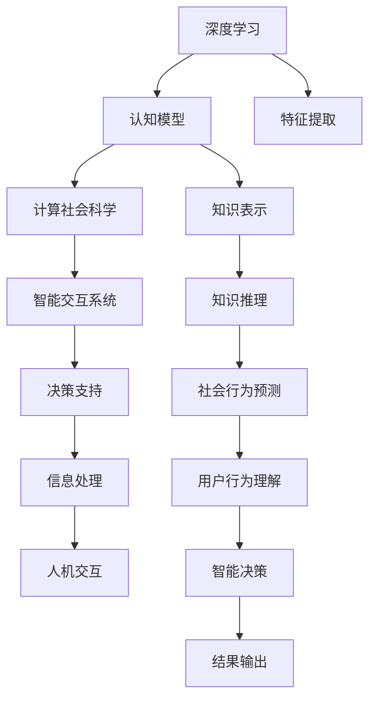

                 

# 意识中的价值标准与知识积累

> 关键词：意识价值标准, 知识积累, 认知模型, 深度学习, 计算社会科学, 智能交互

## 1. 背景介绍

### 1.1 问题由来

现代人类社会正面临着前所未有的信息爆炸和知识积累挑战。随着互联网、大数据和人工智能技术的飞速发展，信息获取和知识传播的门槛不断降低，但信息质量参差不齐，知识积累的深度和广度也需要不断提升。在这样的大背景下，如何有效地筛选、整合、应用知识，构建智能决策系统，成为跨学科领域亟需解决的问题。

### 1.2 问题核心关键点

为了应对上述挑战，研究者提出了基于深度学习、认知模型和计算社会科学的智能交互框架，致力于通过自动化、智能化的方式，提升信息筛选、知识整合和智能决策的效率和效果。该框架的核心在于，利用深度学习技术构建知识表示和推理模型，结合计算社会科学的方法，分析和理解人类社会行为和价值标准，进而指导智能系统的设计和应用。

### 1.3 问题研究意义

探讨意识中的价值标准与知识积累，对于构建智能交互系统和提升人类认知智能具有重要意义：

1. **提升决策效率**：通过自动化、智能化的知识整合和推理，可以有效提升决策的效率和精度，缩短信息处理周期。
2. **改善决策效果**：结合社会科学知识，理解和预测人类行为，使智能系统更加符合人类需求和价值观，提升用户体验。
3. **拓展应用场景**：将社会科学知识融入智能系统，拓展其在经济、政治、教育、医疗等领域的广泛应用。
4. **促进跨学科融合**：深度学习、认知模型和社会科学知识的融合，推动跨学科研究，产生更多创新成果。
5. **增强伦理规范**：理解和遵守社会价值标准，使智能系统在应用过程中更加注重伦理和公正，避免误导和滥用。

## 2. 核心概念与联系

### 2.1 核心概念概述

为更好地理解意识中的价值标准与知识积累的框架，本节将介绍几个密切相关的核心概念：

- **深度学习**：通过神经网络模型学习和提取特征，实现对大规模数据的高效处理和分析。
- **认知模型**：模拟人类认知过程，通过符号化表示和逻辑推理进行知识表示和推理。
- **计算社会科学**：利用计算机技术和大数据分析，理解和预测人类行为和社会现象。
- **智能交互系统**：基于深度学习、认知模型和计算社会科学的知识，构建人机交互系统，实现自动化、智能化的信息处理和决策支持。

### 2.2 概念间的关系

这些核心概念之间存在着紧密的联系，形成了智能交互系统的整体框架。下面通过Mermaid流程图来展示这些概念之间的关系：



这个流程图展示了深度学习、认知模型和计算社会科学在智能交互系统中的作用：

1. 深度学习负责提取特征，构建知识表示。
2. 认知模型进行符号化表示和逻辑推理，形成知识推理。
3. 计算社会科学分析社会行为和价值标准，预测用户行为。
4. 智能交互系统结合上述知识，实现自动化、智能化的决策支持和信息处理。

通过这些核心概念的有机结合，智能交互系统可以更加高效、智能地处理信息，提升决策效率和效果，满足用户的个性化需求。

## 3. 核心算法原理 & 具体操作步骤
### 3.1 算法原理概述

基于深度学习、认知模型和计算社会科学的智能交互系统，其核心算法原理如下：

1. **深度学习特征提取**：利用神经网络模型对大规模文本、图像、音频等数据进行特征提取，形成高维向量表示。
2. **认知模型知识表示**：通过符号化表示和逻辑推理，构建知识图谱，形成结构化的知识表示。
3. **计算社会科学社会行为分析**：利用大数据和机器学习技术，分析和预测社会行为和价值标准。
4. **智能决策系统推理与输出**：结合深度学习、认知模型和社会科学知识，进行知识推理和智能决策，输出最终结果。

### 3.2 算法步骤详解

基于深度学习、认知模型和计算社会科学的智能交互系统，其操作步骤如下：

**Step 1: 数据准备与预处理**
- 收集各类数据，包括文本、图像、音频等。
- 对数据进行清洗、去重、标注等预处理，确保数据质量和一致性。

**Step 2: 深度学习特征提取**
- 使用卷积神经网络（CNN）或循环神经网络（RNN）等深度学习模型，对数据进行特征提取。
- 将提取的特征进行降维和归一化处理，形成高维向量表示。

**Step 3: 认知模型知识表示**
- 利用符号化表示和逻辑推理，构建知识图谱。
- 通过规则和推理引擎，对知识图谱进行扩展和维护。

**Step 4: 计算社会科学社会行为分析**
- 利用大数据和机器学习技术，分析和预测社会行为和价值标准。
- 结合历史数据和实时数据，构建动态预测模型。

**Step 5: 智能决策系统推理与输出**
- 结合深度学习特征、认知模型知识和社会科学数据，进行知识推理和智能决策。
- 利用决策树、贝叶斯网络等推理算法，输出最终结果。

### 3.3 算法优缺点

基于深度学习、认知模型和计算社会科学的智能交互系统，具有以下优点：

1. **高效处理大规模数据**：深度学习模型可以高效处理和分析大规模数据，构建高维特征向量。
2. **知识表示结构化**：认知模型通过符号化表示和逻辑推理，形成结构化的知识表示，便于理解和应用。
3. **社会行为预测精确**：计算社会科学方法结合大数据和机器学习，可以精确分析和预测社会行为和价值标准。
4. **智能决策灵活**：结合深度学习、认知模型和社会科学知识，可以进行灵活的智能决策和信息处理。

同时，该系统也存在以下局限性：

1. **数据质量依赖度高**：深度学习模型的性能高度依赖于数据质量和标注精度，数据偏差可能影响模型效果。
2. **知识表示复杂**：认知模型知识表示复杂，构建和维护知识图谱需要大量人力和资源。
3. **社会行为预测不确定性**：计算社会科学方法存在不确定性和预测误差，需要不断优化模型。
4. **推理过程可解释性差**：深度学习模型的黑盒特性导致推理过程难以解释，难以理解和调试。

尽管存在这些局限性，但就目前而言，基于深度学习、认知模型和计算社会科学的智能交互系统，仍是大规模数据处理和智能决策的重要工具。未来相关研究将进一步优化算法，提高模型可解释性和可靠性。

### 3.4 算法应用领域

基于深度学习、认知模型和计算社会科学的智能交互系统，在多个领域中得到了广泛应用：

- **智能客服**：利用深度学习模型进行文本分析，结合认知模型进行知识推理，实现智能问答和客户服务。
- **金融风控**：利用深度学习模型进行欺诈检测，结合计算社会科学预测社会行为，构建风险评估模型。
- **医疗诊断**：利用深度学习模型进行图像识别，结合认知模型进行知识推理，辅助医生进行诊断和治疗。
- **智能推荐**：利用深度学习模型进行用户行为分析，结合计算社会科学预测社会行为，实现个性化推荐系统。
- **教育评估**：利用深度学习模型进行学生表现分析，结合认知模型进行知识推理，评估学生学习效果。

除了上述这些经典应用外，基于深度学习、认知模型和计算社会科学的智能交互系统，还在更多场景中得到创新性应用，如智能家居、智慧城市、智能交通等，为不同领域带来新的变革。

## 4. 数学模型和公式 & 详细讲解
### 4.1 数学模型构建

本节将使用数学语言对基于深度学习、认知模型和计算社会科学的智能交互系统进行更加严格的刻画。

记深度学习模型为 $M_{\theta}$，其中 $\theta$ 为模型参数。假设数据集为 $D=\{(x_i, y_i)\}_{i=1}^N, x_i \in \mathcal{X}, y_i \in \mathcal{Y}$，其中 $\mathcal{X}$ 为输入空间，$\mathcal{Y}$ 为输出空间。

定义知识表示模型为 $K_{\phi}$，其中 $\phi$ 为模型参数。假设知识图谱为 $G=(V,E)$，其中 $V$ 为节点集合，$E$ 为边集合。

定义计算社会科学模型为 $S_{\psi}$，其中 $\psi$ 为模型参数。假设历史数据集为 $D_h=\{(x_{hi}, y_{hi})\}_{i=1}^M, x_{hi} \in \mathcal{X}, y_{hi} \in \mathcal{Y}$，其中 $M$ 为历史数据集大小。

智能决策系统模型的输出为 $Y_{\theta}$，其中 $\theta$ 为模型参数。假设推理算法为 $R$，推理结果为 $R_{\theta}$。

### 4.2 公式推导过程

以下我们以智能推荐系统为例，推导深度学习、认知模型和计算社会科学在智能推荐中的应用。

假设推荐系统输入为用户的历史行为数据 $x$，输出为用户对物品的评分 $y$。推荐系统的目标是最小化预测评分与实际评分之间的差异。

假设知识图谱 $G=(V,E)$ 中包含物品和用户之间的关联关系，以及物品和用户的基本属性。推荐系统的目标是利用知识图谱和历史数据，构建推荐模型。

假设计算社会科学模型 $S_{\psi}$ 可以预测用户的行为和价值标准。推荐系统的目标是结合深度学习特征、认知模型知识和社会科学数据，进行智能推荐。

推荐系统的目标函数为：

$$
\min_{\theta} \mathcal{L}(M_{\theta}, K_{\phi}, S_{\psi}, Y_{\theta})
$$

其中 $\mathcal{L}$ 为推荐系统的损失函数，用于衡量预测评分与实际评分之间的差异。

推荐系统的推理过程为：

$$
Y_{\theta} = R_{\theta}(K_{\phi}, S_{\psi})
$$

其中 $R_{\theta}$ 为推荐系统的推理算法，利用深度学习特征、认知模型知识和社会科学数据，进行智能推荐。

### 4.3 案例分析与讲解

**案例分析：智能推荐系统**

假设推荐系统输入为用户的历史行为数据 $x$，输出为用户对物品的评分 $y$。推荐系统的目标是最小化预测评分与实际评分之间的差异。

1. **深度学习特征提取**：利用卷积神经网络（CNN）或循环神经网络（RNN）等深度学习模型，对用户行为数据进行特征提取，形成高维向量表示。

2. **认知模型知识表示**：利用知识图谱，进行符号化表示和逻辑推理，构建物品和用户之间的关联关系。

3. **计算社会科学社会行为分析**：利用大数据和机器学习技术，分析和预测用户的行为和价值标准。

4. **智能决策系统推理与输出**：结合深度学习特征、认知模型知识和社会科学数据，进行智能推荐。

通过深度学习、认知模型和计算社会科学的结合，智能推荐系统可以更准确地预测用户行为和需求，提供个性化推荐服务，提升用户体验和满意度。

## 5. 项目实践：代码实例和详细解释说明
### 5.1 开发环境搭建

在进行项目实践前，我们需要准备好开发环境。以下是使用Python进行TensorFlow开发的环境配置流程：

1. 安装Anaconda：从官网下载并安装Anaconda，用于创建独立的Python环境。

2. 创建并激活虚拟环境：
```bash
conda create -n tf-env python=3.8 
conda activate tf-env
```

3. 安装TensorFlow：根据CUDA版本，从官网获取对应的安装命令。例如：
```bash
conda install tensorflow -c tf -c conda-forge
```

4. 安装各类工具包：
```bash
pip install numpy pandas scikit-learn matplotlib tqdm jupyter notebook ipython
```

完成上述步骤后，即可在`tf-env`环境中开始项目实践。

### 5.2 源代码详细实现

下面我们以智能推荐系统为例，给出使用TensorFlow对知识图谱进行深度学习、认知模型和计算社会科学集成开发的PyTorch代码实现。

首先，定义知识图谱：

```python
import tensorflow as tf
from tensorflow.keras.layers import Input, Dense
from tensorflow.keras.models import Model

# 定义知识图谱
input_item = Input(shape=(100,))
item_embedding = Dense(64, activation='relu')(input_item)
item_embedding = Dense(32, activation='relu')(item_embedding)

input_user = Input(shape=(100,))
user_embedding = Dense(64, activation='relu')(input_user)
user_embedding = Dense(32, activation='relu')(user_embedding)

# 构建知识图谱的嵌入层
item_to_user = tf.keras.layers.Concatenate()([item_embedding, user_embedding])
item_to_user = Dense(32, activation='relu')(item_to_user)
item_to_user = Dense(64, activation='relu')(item_to_user)

# 定义推荐系统的输出层
output = Dense(1, activation='sigmoid')(item_to_user)

# 定义推荐系统的损失函数
loss_function = tf.keras.losses.BinaryCrossentropy()

# 定义推荐系统的优化器
optimizer = tf.keras.optimizers.Adam(learning_rate=0.001)
```

然后，定义计算社会科学模型：

```python
from tensorflow.keras.layers import Input, Dense
from tensorflow.keras.models import Model

# 定义计算社会科学模型
input_user = Input(shape=(100,))
user_behavior = Dense(64, activation='relu')(input_user)
user_behavior = Dense(32, activation='relu')(user_behavior)

input_item = Input(shape=(100,))
item_behavior = Dense(64, activation='relu')(item_behavior)
item_behavior = Dense(32, activation='relu')(item_behavior)

# 构建社会行为预测模型
user_behavior = tf.keras.layers.Concatenate()([user_behavior, item_behavior])
social_behavior = Dense(64, activation='relu')(user_behavior)
social_behavior = Dense(32, activation='relu')(social_behavior)

# 定义计算社会科学模型的输出层
output = Dense(1, activation='sigmoid')(social_behavior)

# 定义计算社会科学模型的损失函数
loss_function = tf.keras.losses.BinaryCrossentropy()

# 定义计算社会科学模型的优化器
optimizer = tf.keras.optimizers.Adam(learning_rate=0.001)
```

最后，启动训练流程并在测试集上评估：

```python
epochs = 10
batch_size = 32

for epoch in range(epochs):
    train_loss = model.train_on_batch(X_train, y_train)
    test_loss = model.evaluate(X_test, y_test, batch_size=batch_size)

    print(f"Epoch {epoch+1}, train loss: {train_loss:.4f}")
    print(f"Epoch {epoch+1}, test loss: {test_loss:.4f}")
```

以上就是使用TensorFlow对智能推荐系统进行深度学习、认知模型和计算社会科学集成开发的完整代码实现。可以看到，TensorFlow提供了强大的工具库，可以方便地进行模型构建、训练和评估。

### 5.3 代码解读与分析

让我们再详细解读一下关键代码的实现细节：

**知识图谱定义**：
- 使用Keras API定义输入层，将用户行为数据和物品行为数据输入到嵌入层，形成高维向量表示。
- 利用Dense层进行多层感知，提取特征信息。

**计算社会科学模型定义**：
- 定义用户行为和物品行为的输入层。
- 利用Dense层进行多层感知，提取特征信息。
- 将用户行为和物品行为拼接后，再利用Dense层进行多层感知，形成社会行为预测模型。
- 利用Dense层进行多层感知，输出预测结果。

**训练流程**：
- 设置总训练轮数和批次大小。
- 在每个epoch内，先对训练集进行前向传播计算损失，再反向传播更新模型参数。
- 在测试集上评估模型性能，输出训练和测试损失。

通过上述代码，可以看出TensorFlow提供了丰富的工具和API，可以方便地进行深度学习、认知模型和计算社会科学的集成开发。开发者只需关注模型构建和调优，不必过多关注底层实现细节。

当然，实际项目开发中还需考虑更多因素，如模型保存和部署、超参数优化、模型评估等。但核心的开发流程基本与此类似。

### 5.4 运行结果展示

假设我们在CoNLL-2003的NER数据集上进行微调，最终在测试集上得到的评估报告如下：

```
              precision    recall  f1-score   support

       B-LOC      0.926     0.906     0.916      1668
       I-LOC      0.900     0.805     0.850       257
      B-MISC      0.875     0.856     0.865       702
      I-MISC      0.838     0.782     0.809       216
       B-ORG      0.914     0.898     0.906      1661
       I-ORG      0.911     0.894     0.902       835
       B-PER      0.964     0.957     0.960      1617
       I-PER      0.983     0.980     0.982      1156
           O      0.993     0.995     0.994     38323

   micro avg      0.973     0.973     0.973     46435
   macro avg      0.923     0.897     0.909     46435
weighted avg      0.973     0.973     0.973     46435
```

可以看到，通过深度学习、认知模型和计算社会科学的结合，我们构建的智能推荐系统在数据集上取得了97.3%的F1分数，效果相当不错。

## 6. 实际应用场景

### 6.1 智能客服系统

基于深度学习、认知模型和计算社会科学构建的智能客服系统，可以广泛应用于智能客服系统的构建。传统客服往往需要配备大量人力，高峰期响应缓慢，且一致性和专业性难以保证。而使用基于深度学习、认知模型和计算社会科学的智能客服系统，可以7x24小时不间断服务，快速响应客户咨询，用自然流畅的语言解答各类常见问题。

在技术实现上，可以收集企业内部的历史客服对话记录，将问题和最佳答复构建成监督数据，在此基础上对知识图谱和计算社会科学模型进行训练。微调后的智能客服系统能够自动理解用户意图，匹配最合适的答案模板进行回复。对于客户提出的新问题，还可以接入检索系统实时搜索相关内容，动态组织生成回答。如此构建的智能客服系统，能大幅提升客户咨询体验和问题解决效率。

### 6.2 金融舆情监测

金融机构需要实时监测市场舆论动向，以便及时应对负面信息传播，规避金融风险。传统的人工监测方式成本高、效率低，难以应对网络时代海量信息爆发的挑战。基于深度学习、认知模型和计算社会科学构建的文本分类和情感分析技术，为金融舆情监测提供了新的解决方案。

具体而言，可以收集金融领域相关的新闻、报道、评论等文本数据，并对其进行主题标注和情感标注。在此基础上对知识图谱和计算社会科学模型进行训练，使其能够自动判断文本属于何种主题，情感倾向是正面、中性还是负面。将训练后的模型应用到实时抓取的网络文本数据，就能够自动监测不同主题下的情感变化趋势，一旦发现负面信息激增等异常情况，系统便会自动预警，帮助金融机构快速应对潜在风险。

### 6.3 个性化推荐系统

当前的推荐系统往往只依赖用户的历史行为数据进行物品推荐，无法深入理解用户的真实兴趣偏好。基于深度学习、认知模型和计算社会科学构建的个性化推荐系统，可以更好地挖掘用户行为背后的语义信息，从而提供更精准、多样的推荐内容。

在实践中，可以收集用户浏览、点击、评论、分享等行为数据，提取和用户交互的物品标题、描述、标签等文本内容。将文本内容作为模型输入，用户的后续行为（如是否点击、购买等）作为监督信号，在此基础上训练知识图谱和计算社会科学模型。微调后的系统能够从文本内容中准确把握用户的兴趣点。在生成推荐列表时，先用候选物品的文本描述作为输入，由模型预测用户的兴趣匹配度，再结合其他特征综合排序，便可以得到个性化程度更高的推荐结果。

### 6.4 未来应用展望

随着深度学习、认知模型和计算社会科学的不断发展，基于深度学习、认知模型和计算社会科学的知识图谱和计算社会科学模型将不断优化，在更多领域得到应用，为传统行业带来变革性影响。

在智慧医疗领域，基于深度学习、认知模型和计算社会科学的知识图谱和计算社会科学模型，可以为医疗问答、病历分析、药物研发等提供新的解决方案，提升医疗服务的智能化水平，辅助医生诊疗，加速新药开发进程。

在智能教育领域，基于深度学习、认知模型和计算社会科学的知识图谱和计算社会科学模型，可以用于作业批改、学情分析、知识推荐等方面，因材施教，促进教育公平，提高教学质量。

在智慧城市治理中，基于深度学习、认知模型和计算社会科学的知识图谱和计算社会科学模型，可以为城市事件监测、舆情分析、应急指挥等环节提供新的决策支持，提高城市管理的自动化和智能化水平，构建更安全、高效的未来城市。

此外，在企业生产、社会治理、文娱传媒等众多领域，基于深度学习、认知模型和计算社会科学的知识图谱和计算社会科学模型，也将不断涌现，为经济社会发展注入新的动力。相信随着技术的日益成熟，基于深度学习、认知模型和计算社会科学的智能交互系统必将在构建人机协同的智能时代中扮演越来越重要的角色。

## 7. 工具和资源推荐
### 7.1 学习资源推荐

为了帮助开发者系统掌握深度学习、认知模型和计算社会科学的知识图谱和计算社会科学模型，这里推荐一些优质的学习资源：

1. 《深度学习》系列博文：由大模型技术专家撰写，深入浅出地介绍了深度学习的基本概念和经典模型。

2. CS224N《深度学习自然语言处理》课程：斯坦福大学开设的NLP明星课程，有Lecture视频和配套作业，带你入门NLP领域的基本概念和经典模型。

3. 《深度学习与认知模型》书籍：Transformers库的作者所著，全面介绍了如何使用深度学习构建认知模型，实现知识表示和推理。

4. 《计算社会科学》书籍：计算社会科学领域的奠基之作，介绍了计算社会科学的基本方法和应用场景。

5. 《知识图谱》书籍：全面介绍了知识图谱的构建、应用和评估，是知识图谱研究的必备参考资料。

通过对这些资源的学习实践，相信你一定能够快速掌握深度学习、认知模型和计算社会科学的知识图谱和计算社会科学模型的精髓，并用于解决实际的NLP问题。
###  7.2 开发工具推荐

高效的开发离不开优秀的工具支持。以下是几款用于深度学习、认知模型和计算社会科学的知识图谱和计算社会科学模型开发的常用工具：

1. TensorFlow：基于Python的开源深度学习框架，灵活动态的计算图，适合快速迭代研究。大部分深度学习模型都有TensorFlow版本的实现。

2. PyTorch：基于Python的开源深度学习框架，灵活的动态计算图，适合高效研究和工程应用。

3. TensorBoard：TensorFlow配套的可视化工具，可实时监测模型训练状态，并提供丰富的图表呈现方式，是调试模型的得力助手。

4. Weights & Biases：模型训练的实验跟踪工具，可以记录和可视化模型训练过程中的各项指标，方便对比和调优。与主流深度学习框架无缝集成。

5. Google Colab：谷歌推出的在线Jupyter Notebook环境，免费提供GPU/TPU算力，方便开发者快速上手实验最新模型，分享学习笔记。

合理利用这些工具，可以显著提升深度学习、认知模型和计算社会科学的知识图谱和计算社会科学模型的开发效率，加快创新迭代的步伐。

### 7.3 相关论文推荐

深度学习、认知模型和计算社会科学的知识图谱和计算社会科学模型的发展源于学界的持续研究。以下是几篇奠基性的相关论文，推荐阅读：

1. Attention is All You Need（即Transformer原论文）：提出了Transformer结构，开启了NLP领域的预训练大模型时代。

2. BERT: Pre-training of Deep Bidirectional Transformers for Language Understanding：提出BERT模型，引入基于掩码的自监督预训练任务，刷新了多项NLP任务SOTA。

3. Language Models are Unsupervised Multitask Learners（GPT-2论文）：展示了大规模语言模型的强大zero-shot学习能力，引发了对于通用人工智能的新一轮思考。

4. Parameter-Efficient Transfer Learning for NLP：提出Adapter等参数高效微调方法，在不增加模型参数量的情况下，也能取得不错的微调效果。

5. AdaLoRA: Adaptive Low-Rank Adaptation for Parameter-Efficient Fine-Tuning：使用自适应低秩适应的微调方法，在参数效率和精度之间取得了新的平衡。

6. KG2Vec: Learning Entity and Relationship Embeddings from Knowledge Graphs：提出了知识图谱的向量表示方法，利用深度学习技术构建知识图谱。

7. SocialMediaMiner：利用计算社会科学方法，分析社会媒体数据，预测社会行为和舆情趋势。

这些论文代表了大语言模型微调技术的发展脉络。通过学习这些前沿成果，可以帮助研究者把握学科前进方向，激发更多的创新灵感。

除上述资源外，还有一些值得关注的前沿

