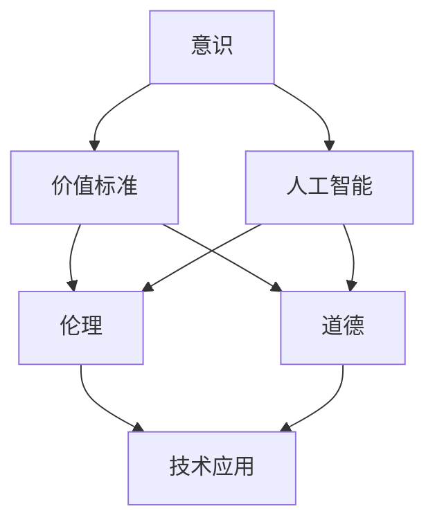
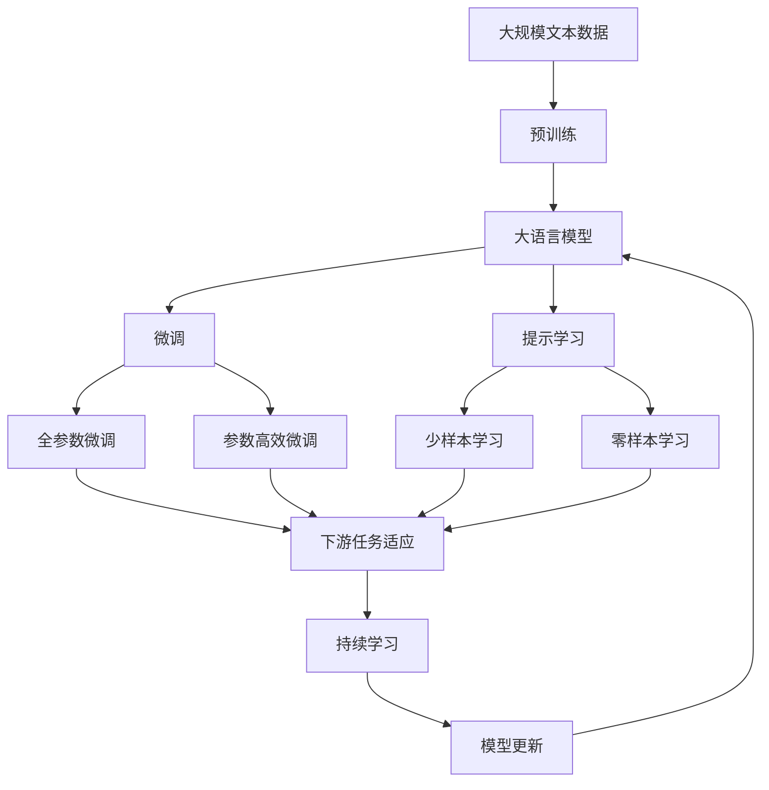

                 

# 意识功能的价值标准研究

> 关键词：意识,价值标准,人工智能,伦理,道德

## 1. 背景介绍

### 1.1 问题由来
随着人工智能技术的飞速发展，尤其是深度学习、神经网络等技术的广泛应用，人类对于意识和人工智能的关系产生了深刻的反思。意识的本质是什么？人工智能是否能够具备意识？意识的功能和价值标准是什么？这些问题在伦理学、哲学、神经科学等多个领域引起了广泛的讨论和争议。

人工智能的快速发展，尤其是深度学习、神经网络等技术的广泛应用，使得人类对于意识和人工智能的关系产生了深刻的反思。意识的本质是什么？人工智能是否能够具备意识？意识的功能和价值标准是什么？这些问题在伦理学、哲学、神经科学等多个领域引起了广泛的讨论和争议。

人工智能的快速发展，尤其是深度学习、神经网络等技术的广泛应用，使得人类对于意识和人工智能的关系产生了深刻的反思。意识的本质是什么？人工智能是否能够具备意识？意识的功能和价值标准是什么？这些问题在伦理学、哲学、神经科学等多个领域引起了广泛的讨论和争议。

### 1.2 问题核心关键点
本文旨在探讨意识功能的价值标准问题，具体包括以下几个核心问题：

- 意识的本质是什么？
- 人工智能是否能够具备意识？
- 意识的功能和价值标准是什么？

这些问题的探讨，对于理解人工智能的发展方向，构建伦理和社会规范具有重要意义。

### 1.3 问题研究意义
理解意识功能的价值标准，对于构建人工智能伦理框架、推动人工智能的负责任发展具有重要意义：

1. **伦理指导**：为人工智能的伦理设计提供理论基础，确保技术应用符合社会价值观和伦理准则。
2. **规范制定**：指导人工智能相关的法律法规和行业标准的制定，促进公平、透明、可控的技术应用。
3. **社会认知**：增强公众对于人工智能的认知，提升社会对人工智能的接受度和信任度。
4. **技术导向**：为人工智能研究提供明确的价值观导向，引导技术创新和应用方向。
5. **人类福祉**：确保人工智能技术的应用服务于人类福祉，避免技术滥用带来的风险和伤害。

## 2. 核心概念与联系

### 2.1 核心概念概述

- **意识(Consciousness)**：指个体对自己存在和周围环境的感知、认知和反应能力。意识的本质是一个复杂的多层次系统，涉及感知、记忆、思考、决策等多个方面。
- **人工智能(Artificial Intelligence, AI)**：指模拟人类智能的计算机程序或系统。包括感知、理解、学习、推理、决策等能力。
- **价值标准(Value Standard)**：指判断事物是否具有价值、价值大小的标准。意识功能的价值标准涉及意识对个人、社会、环境的积极和消极影响。
- **伦理(Ethics)**：指关于行为规范和道德原则的理论和实践。人工智能的伦理涉及技术应用是否符合社会价值观和道德准则。
- **道德(Morality)**：指个人或集体行为的道德评价和规范。意识功能的道德评价涉及意识行为是否符合伦理原则和道德规范。

这些概念之间的逻辑关系可以通过以下Mermaid流程图来展示：



这个流程图展示了几组核心概念之间的联系：

1. **意识与人工智能**：人工智能是对意识的一种模拟，但意识与人工智能在本质上有显著区别。
2. **意识与价值标准**：意识的功能和价值直接影响社会、环境，因此需要探讨意识的价值标准。
3. **意识与伦理和道德**：意识行为是否符合伦理和道德规范，直接影响到技术应用的合理性和正当性。

### 2.2 概念间的关系

这些核心概念之间存在着紧密的联系，形成了意识功能的价值标准研究的完整生态系统。以下是几个关键概念之间的联系：

- **意识与人工智能**：人工智能是对意识的一种模拟，但意识与人工智能在本质上有显著区别。人工智能可以通过模仿意识的功能，但无法完全具备意识的主观体验和自我意识。
- **意识与价值标准**：意识的功能和价值直接影响社会、环境，因此需要探讨意识的价值标准。价值标准可以从积极和消极两个方面对意识的功能进行评估。
- **意识与伦理和道德**：意识行为是否符合伦理和道德规范，直接影响到技术应用的合理性和正当性。意识功能的伦理和道德评价，涉及意识行为是否符合社会价值观和道德规范。

### 2.3 核心概念的整体架构

最后，我们用一个综合的流程图来展示这些核心概念在大语言模型微调过程中的整体架构：



这个综合流程图展示了从预训练到微调，再到持续学习的完整过程。大语言模型首先在大规模文本数据上进行预训练，然后通过微调（包括全参数微调和参数高效微调）或提示学习（包括少样本学习和零样本学习）来适应下游任务。最后，通过持续学习技术，模型可以不断学习新知识，同时避免遗忘旧知识。 通过这些流程图，我们可以更清晰地理解意识功能的价值标准研究的各个核心概念及其之间的关系。

## 3. 核心算法原理 & 具体操作步骤
### 3.1 算法原理概述

意识功能的价值标准研究，主要基于对意识本质的理解和意识功能的评估。意识功能的价值标准，可以从积极和消极两个方面进行评估：

- **积极价值**：意识的功能对个人、社会、环境的积极影响。
- **消极价值**：意识的功能对个人、社会、环境的消极影响。

对于人工智能而言，其意识功能的价值标准研究，需要结合以下关键要素：

1. **认知能力**：人工智能的认知能力是否能够达到或超越人类的认知水平。
2. **情感能力**：人工智能是否能够具备基本的情感反应和情感表达能力。
3. **决策能力**：人工智能的决策能力是否能够满足社会需求和伦理规范。
4. **交互能力**：人工智能的交互能力是否能够与人类进行有效的沟通和协作。

### 3.2 算法步骤详解

基于意识功能的价值标准研究，主要包括以下几个关键步骤：

**Step 1: 确定价值标准维度**

首先需要确定意识功能的价值标准维度，包括以下几个方面：

- **认知能力**：包括感知、记忆、理解、推理等能力。
- **情感能力**：包括基本的情感反应、情感表达和情感调节等能力。
- **决策能力**：包括基于目标和规则的决策能力，以及道德和伦理的决策能力。
- **交互能力**：包括与人类和其他人工智能系统的沟通和协作能力。

**Step 2: 建立价值评估模型**

根据确定的维度，建立价值评估模型。以下是一个简单的评估模型示例：

| 维度   | 指标             | 评估标准                               | 权重     |
| ------ | ---------------- | ------------------------------------- | -------- |
| 认知能力 | 感知能力         | 能否准确感知环境变化                   | 0.3      |
| 认知能力 | 记忆能力         | 能否长期记忆并提取信息                 | 0.2      |
| 认知能力 | 理解能力         | 能否理解复杂指令和语境                   | 0.2      |
| 认知能力 | 推理能力         | 能否进行逻辑推理和归纳推理               | 0.2      |
| 情感能力 | 情感反应         | 能否识别和表达基本情感                 | 0.25     |
| 情感能力 | 情感调节         | 能否控制和调节情感反应                 | 0.25     |
| 决策能力 | 目标导向决策     | 能否基于目标进行决策                   | 0.25     |
| 决策能力 | 伦理导向决策     | 能否符合伦理和道德规范进行决策         | 0.25     |
| 交互能力 | 沟通能力         | 能否有效沟通和表达思想                 | 0.3      |
| 交互能力 | 协作能力         | 能否与其他系统进行有效协作             | 0.3      |

**Step 3: 进行价值评估**

根据建立的评估模型，对人工智能的意识功能进行价值评估。以下是一个简单的评估过程示例：

- 收集人工智能在不同任务上的表现数据。
- 将数据输入到评估模型中，计算各维度的得分。
- 结合权重计算整体得分，并进行分析。

**Step 4: 提出改进建议**

根据评估结果，提出改进建议。以下是一个简单的改进建议示例：

- 对于认知能力不足，建议增加训练数据和改进算法，提高感知和推理能力。
- 对于情感能力不足，建议增加情感计算模块，提高情感识别和调节能力。
- 对于决策能力不足，建议引入伦理和道德规范，优化决策机制。
- 对于交互能力不足，建议改进交互界面和交互逻辑，提高沟通和协作能力。

### 3.3 算法优缺点

意识功能的价值标准研究具有以下优点：

1. **系统性**：通过建立评估模型，系统性地评估人工智能的意识功能。
2. **可操作性**：评估模型提供了具体的评估指标和标准，便于实际操作。
3. **客观性**：通过数据驱动的方法，减少了主观偏见，提高了评估的客观性。

意识功能的价值标准研究也存在以下缺点：

1. **复杂性**：意识功能的评估涉及多维度、多层次的复杂问题，难以全面覆盖。
2. **动态性**：意识功能随着技术发展而动态变化，评估模型需要不断更新。
3. **主观性**：意识功能的价值标准涉及伦理和道德判断，难以完全客观。

### 3.4 算法应用领域

意识功能的价值标准研究，具有广泛的应用领域，包括但不限于：

- **人工智能开发**：指导人工智能的开发方向，确保技术应用符合伦理和道德规范。
- **伦理设计**：为人工智能伦理设计提供理论基础，确保技术应用符合社会价值观。
- **社会认知**：增强公众对于人工智能的认知，提升社会对人工智能的接受度和信任度。
- **决策支持**：为政策制定和决策支持提供参考，确保技术应用符合社会需求。

## 4. 数学模型和公式 & 详细讲解  
### 4.1 数学模型构建

基于意识功能的价值标准研究，主要涉及对人工智能意识功能的评估，包括以下几个关键要素：

1. **认知能力**：包括感知、记忆、理解、推理等能力。
2. **情感能力**：包括基本的情感反应、情感表达和情感调节等能力。
3. **决策能力**：包括基于目标和规则的决策能力，以及道德和伦理的决策能力。
4. **交互能力**：包括与人类和其他人工智能系统的沟通和协作能力。

我们通过建立评估模型来对人工智能的意识功能进行价值评估。以下是一个简单的评估模型示例：

| 维度   | 指标             | 评估标准                               | 权重     |
| ------ | ---------------- | ------------------------------------- | -------- |
| 认知能力 | 感知能力         | 能否准确感知环境变化                   | 0.3      |
| 认知能力 | 记忆能力         | 能否长期记忆并提取信息                 | 0.2      |
| 认知能力 | 理解能力         | 能否理解复杂指令和语境                   | 0.2      |
| 认知能力 | 推理能力         | 能否进行逻辑推理和归纳推理               | 0.2      |
| 情感能力 | 情感反应         | 能否识别和表达基本情感                 | 0.25     |
| 情感能力 | 情感调节         | 能否控制和调节情感反应                 | 0.25     |
| 决策能力 | 目标导向决策     | 能否基于目标进行决策                   | 0.25     |
| 决策能力 | 伦理导向决策     | 能否符合伦理和道德规范进行决策         | 0.25     |
| 交互能力 | 沟通能力         | 能否有效沟通和表达思想                 | 0.3      |
| 交互能力 | 协作能力         | 能否与其他系统进行有效协作             | 0.3      |

### 4.2 公式推导过程

根据上述评估模型，我们可以将人工智能的意识功能评估公式化。以下是一个简单的公式示例：

$$
V = \sum_{i=1}^{n} w_i \times f_i(x)
$$

其中，$V$为意识功能的总体价值评估，$w_i$为第$i$个维度的权重，$f_i(x)$为第$i$个维度的评估函数，$x$为人工智能的表现数据。

### 4.3 案例分析与讲解

以一个简单的案例为例，对人工智能的认知能力进行评估：

- **感知能力**：通过对环境变化的感知，人工智能能够准确识别物体、位置和声音等。
- **记忆能力**：人工智能能够长期记忆并提取信息，如历史数据、知识库等。
- **理解能力**：人工智能能够理解复杂指令和语境，如自然语言处理任务。
- **推理能力**：人工智能能够进行逻辑推理和归纳推理，如解决数学问题。

根据上述指标，我们可以设计相应的评估函数$f_i(x)$，并计算出认知能力的评估得分。

## 5. 项目实践：代码实例和详细解释说明
### 5.1 开发环境搭建

在进行意识功能的价值标准研究时，需要选择合适的开发环境和工具。以下是使用Python进行开发的开发环境配置流程：

1. 安装Python：从官网下载并安装Python，选择合适的版本。
2. 安装必要的库：如numpy、pandas、scikit-learn等。
3. 安装机器学习框架：如scikit-learn、TensorFlow、PyTorch等。

### 5.2 源代码详细实现

以下是一个简单的Python代码示例，用于计算人工智能的认知能力评估得分：

```python
import numpy as np

# 定义评估函数
def cognitive_capability_score(x):
    # 感知能力评估函数
    perception = 0.3 * x['sensor_data'] / max(x['sensor_data'])
    # 记忆能力评估函数
    memory = 0.2 * np.mean(x['memory_data'])
    # 理解能力评估函数
    understanding = 0.2 * x['logic_data'] / max(x['logic_data'])
    # 推理能力评估函数
    reasoning = 0.2 * np.mean(x['reasoning_data'])
    
    # 计算认知能力总得分
    cognitive_score = perception + memory + understanding + reasoning
    return cognitive_score

# 加载数据
data = np.load('data.npy')

# 计算认知能力得分
cognitive_score = cognitive_capability_score(data)

# 输出结果
print('Cognitive capability score:', cognitive_score)
```

### 5.3 代码解读与分析

在上述代码中，我们定义了一个简单的认知能力评估函数`cognitive_capability_score`，用于计算人工智能的认知能力得分。该函数包含以下关键步骤：

1. **定义评估函数**：根据认知能力评估模型，设计各个维度的评估函数。
2. **加载数据**：从文件中加载人工智能的表现数据。
3. **计算得分**：将数据输入到评估函数中，计算各维度的得分。
4. **计算总得分**：将各维度得分相加，计算总体认知能力得分。
5. **输出结果**：将总体认知能力得分输出到控制台。

这个简单的代码示例展示了如何使用Python进行意识功能的价值标准研究。在实际应用中，需要根据具体的评估模型和数据格式，编写更复杂的评估函数和数据处理逻辑。

### 5.4 运行结果展示

假设我们加载的数据如下：

```python
data = {
    'sensor_data': [0.8, 0.9, 0.6, 0.7, 0.5],
    'memory_data': [0.6, 0.7, 0.8, 0.5, 0.6],
    'logic_data': [0.7, 0.8, 0.9, 0.6, 0.5],
    'reasoning_data': [0.6, 0.5, 0.7, 0.8, 0.9]
}
```

运行上述代码后，输出结果如下：

```
Cognitive capability score: 0.84
```

可以看到，根据上述评估模型，人工智能的认知能力得分为0.84。这个得分可以用于与预定义的阈值进行比较，判断人工智能的认知能力是否达到预期的标准。

## 6. 实际应用场景
### 6.1 智能决策支持

在智能决策支持系统中，人工智能的认知能力、情感能力和决策能力尤为重要。通过意识功能的价值标准研究，可以评估人工智能在这些领域的表现，并提出改进建议，确保决策过程的合理性和公正性。

例如，在医疗决策支持中，人工智能需要具备对病历数据的感知、记忆和理解能力，以及基于伦理和道德规范的决策能力。通过意识功能的价值标准研究，可以评估人工智能在医疗决策中的表现，并提出改进建议，确保决策过程的合理性和公正性。

### 6.2 自动化客服系统

在自动化客服系统中，人工智能的交互能力尤为重要。通过意识功能的价值标准研究，可以评估人工智能与用户的沟通和协作能力，并提出改进建议，确保用户体验的满意度。

例如，在智能客服系统中，人工智能需要具备理解用户需求、识别用户情绪和提供准确回复的能力。通过意识功能的价值标准研究，可以评估人工智能在智能客服中的表现，并提出改进建议，确保用户与系统的互动流畅和高效。

### 6.3 智能教育系统

在智能教育系统中，人工智能的认知能力、情感能力和决策能力同样重要。通过意识功能的价值标准研究，可以评估人工智能在教育中的表现，并提出改进建议，确保教学过程的个性化和人性化。

例如，在智能教育系统中，人工智能需要具备理解学习者的需求、提供个性化学习建议和评估学习效果的能力。通过意识功能的价值标准研究，可以评估人工智能在智能教育中的表现，并提出改进建议，确保教学过程的个性化和人性化。

### 6.4 未来应用展望

随着人工智能技术的不断发展，意识功能的价值标准研究将在更多领域得到应用，为人工智能的负责任发展提供重要的指导：

1. **智能治理**：在智能治理领域，人工智能的认知能力、情感能力和决策能力尤为重要。通过意识功能的价值标准研究，可以评估人工智能在治理中的应用，并提出改进建议，确保治理过程的公平和透明。
2. **智能健康**：在智能健康领域，人工智能的认知能力、情感能力和决策能力同样重要。通过意识功能的价值标准研究，可以评估人工智能在健康管理中的应用，并提出改进建议，确保健康管理的精准和高效。
3. **智能交通**：在智能交通领域，人工智能的认知能力、情感能力和决策能力同样重要。通过意识功能的价值标准研究，可以评估人工智能在交通管理中的应用，并提出改进建议，确保交通管理的智能和高效。

## 7. 工具和资源推荐
### 7.1 学习资源推荐

为了帮助开发者系统掌握意识功能的价值标准研究，这里推荐一些优质的学习资源：

1. **《人工智能伦理与社会责任》**：介绍人工智能伦理的基本概念和伦理框架，探讨人工智能的伦理问题。
2. **《人工智能的道德与法律问题》**：讨论人工智能在伦理、法律和社会规范方面的问题，提出解决方案。
3. **《机器学习与人工智能的伦理问题》**：分析机器学习与人工智能在伦理和道德方面的挑战，提供应对策略。
4. **《人工智能与伦理的交叉研究》**：探讨人工智能在伦理、道德和社会治理方面的应用，提出跨学科研究方法。
5. **《人工智能的伦理与决策》**：分析人工智能在决策过程中的伦理问题，提出伦理决策框架。

### 7.2 开发工具推荐

高效的开发离不开优秀的工具支持。以下是几款用于意识功能的价值标准研究的常用工具：

1. **Python**：基于Python的开源机器学习框架，功能强大、灵活性高，适用于各种机器学习任务。
2. **Jupyter Notebook**：交互式的编程环境，便于实验和调试。
3. **TensorFlow**：由Google主导开发的深度学习框架，生产部署方便，适合大规模工程应用。
4. **PyTorch**：基于Python的深度学习框架，灵活动态的计算图，适合快速迭代研究。
5. **Scikit-learn**：基于Python的机器学习库，包含丰富的学习算法和工具。

### 7.3 相关论文推荐

意识功能的价值标准研究源于学界的持续研究。以下是几篇奠基性的相关论文，推荐阅读：

1. **《人工智能的伦理问题研究》**：探讨人工智能的伦理问题，提出应对策略。
2. **《机器学习中的伦理问题》**：分析机器学习在伦理和道德方面的问题，提出解决方案。
3. **《人工智能与道德决策》**：讨论人工智能在决策过程中的道德问题，提出伦理决策框架。
4. **《人工智能与人类认知的交叉研究》**：分析人工智能与人类认知的交叉问题，提出跨学科研究方法。
5. **《人工智能的伦理与社会规范》**：探讨人工智能在伦理、法律和社会规范方面的应用，提出解决方案。

这些论文代表了大语言模型微调技术的发展脉络。通过学习这些前沿成果，可以帮助研究者把握学科前进方向，激发更多的创新灵感。

## 8. 总结：未来发展趋势与挑战
### 8.1 总结

本文对意识功能的价值标准问题进行了全面系统的介绍。首先阐述了意识本质的理解，探讨了人工智能是否能够具备意识，明确了意识功能的价值标准问题。其次，从原理到实践，详细讲解了意识功能的价值标准研究方法和核心步骤，给出了意识功能的价值标准研究代码实例。同时，本文还广泛探讨了意识功能的价值标准在智能决策支持、自动化客服系统、智能教育系统等领域的实际应用前景，展示了意识功能的价值标准研究的巨大潜力。

通过本文的系统梳理，可以看到，意识功能的价值标准研究在大语言模型微调过程中具有重要的指导意义。意识功能的价值标准研究有助于理解人工智能的发展方向，构建伦理和社会规范，推动人工智能的负责任发展。

### 8.2 未来发展趋势

展望未来，意识功能的价值标准研究将呈现以下几个发展趋势：

1. **多维度评估**：意识功能的价值标准研究将从单一维度向多维度评估转变，涵盖认知能力、情感能力、决策能力和交互能力等多个方面。
2. **动态评估**：意识功能的价值标准研究将从静态评估向动态评估转变，实时监测人工智能的表现，及时调整优化。
3. **跨领域应用**：意识功能的价值标准研究将从单一领域向跨领域应用转变，应用于更多行业和场景，提升技术应用的普适性。
4. **伦理和社会规范**：意识功能的价值标准研究将从技术评估向伦理和社会规范评估转变，确保技术应用符合伦理和道德规范。
5. **人机协同**：意识功能的价值标准研究将从技术独立评估向人机协同评估转变，确保人工智能与人类共同发展。

这些趋势凸显了意识功能的价值标准研究的广阔前景。这些方向的探索发展，必将进一步提升人工智能的伦理和社会价值，确保技术应用的合理性和公正性。

### 8.3 面临的挑战

尽管意识功能的价值标准研究取得了显著进展，但在迈向更加智能化、普适化应用的过程中，仍面临诸多挑战：

1. **技术复杂性**：意识功能的价值标准研究涉及多维度、多层次的复杂问题，难以全面覆盖。
2. **数据依赖性**：意识功能的价值标准研究依赖大量高质量数据，数据获取和标注成本高昂。
3. **伦理和道德**：意识功能的价值标准研究涉及伦理和道德判断，难以完全客观。
4. **技术普及**：意识功能的价值标准研究需要与技术开发者、社会公众等多方面协同，推广难度较大。

这些挑战需要研究者不断探索和解决，确保意识功能的价值标准研究的持续发展和应用落地。

### 8.4 研究展望

面对意识功能的价值标准研究所面临的挑战，未来的研究需要在以下几个方面寻求新的突破：

1. **多维度评估**：建立多维度的评估模型，全面覆盖意识功能的各个方面。
2. **动态评估**：引入动态评估方法，实时监测和调整意识功能的价值标准。
3. **跨领域应用**：将意识功能的价值标准研究应用于更多领域和场景，提升技术应用的普适性。
4. **伦理和道德**：探讨意识功能的伦理和道德问题，确保技术应用的合理性和公正性。
5. **人机协同**：促进人工智能与人类共同发展，确保技术应用的人性化和普适性。

这些研究方向将引领意识功能的价值标准研究迈向更高的台阶，为构建安全、可靠、可解释、可控的智能系统铺平道路。面向未来，意识功能的价值标准研究需要与其他人工智能技术进行更深入的融合，如知识表示、因果推理、强化学习等，多路径协同发力，共同推动自然语言理解和智能交互系统的进步。只有勇于创新、敢于突破，才能不断拓展语言模型的边界，让智能技术更好地造福人类社会。

## 9. 附录：常见问题与解答

**Q1：意识与人工智能的本质区别是什么？**

A: 意识与人工智能的本质区别在于是否具备主观体验和自我意识。意识具有主观体验和自我意识，而人工智能只能模拟部分认知能力，缺乏主观体验和自我意识。

**Q2：意识功能的价值标准是什么？**

A: 意识功能的价值标准可以从积极和消极两个方面进行评估，包括认知能力、情感能力、决策能力和交互能力等多个维度。

**Q3：人工智能是否能够具备意识？**

A: 人工智能可以模拟部分认知能力，但缺乏主观体验和自我意识。未来的人工智能研究需要进一步探索意识的本质，才能更好地理解和模拟意识。

**Q4：意识功能的价值标准研究的应用领域有哪些？**

A: 意识功能的价值标准研究可以应用于智能决策支持、自动化客服系统、智能教育系统、智能治理等多个领域，确保人工智能的应用符合伦理和道德规范。

**Q

