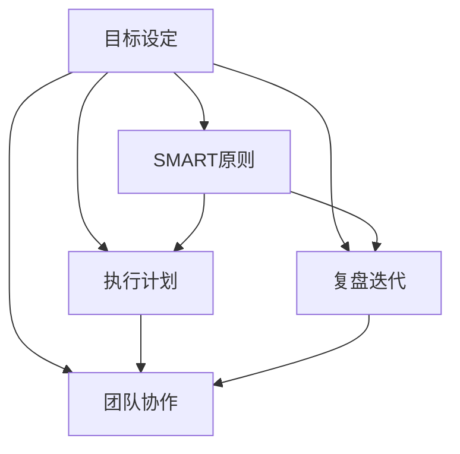

                 

# 执行力强的人如何制定目标

> 关键词：目标设定,SMART原则,执行计划,复盘迭代,团队协作

## 1. 背景介绍

在快速发展的IT行业中，优秀的执行力和明确的目标设定是推动团队和个人成功的重要因素。本文将深入探讨执行力的本质，并探讨如何通过制定明确、可行的目标来提升团队和个人的工作效能。

### 1.1 执行力概述

执行力是指一个人或团队完成任务的能力和效率。在IT领域，执行力不仅关系到项目能否按时完成，更影响到产品的质量、用户体验和市场竞争力。一个执行力强的团队，能够快速响应市场变化，及时解决问题，实现创新突破。

### 1.2 执行力强的人的特点

执行力强的人通常具备以下特点：

- 目标明确：有清晰的工作目标和行动计划。
- 时间管理：能合理安排时间，高效完成任务。
- 主动性：积极主动，主动解决问题。
- 抗压能力：能在高压环境下保持冷静，完成重要任务。
- 团队协作：善于沟通，能够协调团队成员。
- 持续改进：不断总结经验，提升个人和团队的能力。

### 1.3 目标设定的重要性

在项目管理中，目标设定是成功的基础。没有明确的目标，团队成员将不知道工作方向，容易导致任务推进缓慢，甚至陷入混乱。因此，制定清晰、具体的目标，是提升执行力的关键。

## 2. 核心概念与联系

### 2.1 核心概念概述

- **目标设定（Goal Setting）**：通过明确的目标设定，帮助个人和团队明确工作方向，提升执行力。
- **SMART原则（Specific, Measurable, Achievable, Relevant, Time-bound）**：目标设定的五个基本原则，帮助设定合理的目标。
- **执行计划（Execution Plan）**：在目标明确的基础上，制定详细的执行步骤和资源分配。
- **复盘迭代（Retrospective and Iteration）**：通过定期的复盘和迭代，不断总结经验，提升执行效率。
- **团队协作（Team Collaboration）**：通过团队协作，共同完成任务，提升整体执行力。

### 2.2 概念间的关系

这些核心概念相互关联，形成一个系统的执行力提升框架。通过SMART原则设定目标，制定详细的执行计划，并在执行过程中进行复盘迭代，团队协作可以确保目标的高效实现。



### 2.3 核心概念的整体架构

从目标设定到复盘迭代，整个过程是一个闭环，不断循环提升执行力。团队协作贯穿整个过程，是执行力提升的关键。


## 3. 核心算法原理 & 具体操作步骤

### 3.1 算法原理概述

制定目标和执行计划的过程，本质上是一个基于SMART原则的系统工程。通过明确的目标设定和详细的执行计划，结合复盘迭代和团队协作，确保目标的高效实现。

### 3.2 算法步骤详解

以下是制定目标和执行计划的具体步骤：

1. **目标设定**
   - **SMART原则**：明确目标的五个维度：具体（Specific）、可测量（Measurable）、可实现（Achievable）、相关性（Relevant）、时间限制（Time-bound）。
   - **目标分解**：将大目标分解为若干小目标，便于管理。

2. **执行计划**
   - **任务分解**：将每个小目标分解为具体的任务，明确责任人和截止日期。
   - **资源分配**：根据任务需求，合理分配人力、物力、财力等资源。
   - **风险评估**：评估每个任务的潜在风险，并制定应对策略。

3. **复盘迭代**
   - **定期复盘**：每周或每月对执行情况进行总结，找出问题并改进。
   - **数据反馈**：通过数据分析，发现执行过程中存在的问题，并改进。
   - **持续改进**：不断优化执行计划，提升执行效率。

4. **团队协作**
   - **沟通机制**：建立高效的沟通机制，确保信息及时传达。
   - **协作平台**：使用协作工具，如Jira、Trello、Slack等，提升团队协作效率。
   - **团队培训**：定期培训团队成员，提升团队整体能力。

### 3.3 算法优缺点

- **优点**
  - **提升效率**：通过目标设定和执行计划，提升任务执行的效率。
  - **提高质量**：明确的目标和详细的执行计划，确保项目质量。
  - **促进团队协作**：通过高效的协作机制，增强团队凝聚力。

- **缺点**
  - **时间和精力投入大**：制定目标和执行计划需要耗费大量时间和精力。
  - **灵活性不足**：执行计划一旦制定，难以快速调整，可能导致任务滞后。
  - **依赖工具**：需要依赖高效的协作工具，工具选择不当会影响团队效率。

### 3.4 算法应用领域

该方法不仅适用于IT项目管理，还广泛应用于制造业、医疗、教育等各个领域。无论是个人目标设定，还是企业战略规划，都可以通过明确的目标和详细的执行计划，提升整体执行力和效率。

## 4. 数学模型和公式 & 详细讲解 & 举例说明

### 4.1 数学模型构建

为了更好地理解目标设定和执行计划的系统过程，我们可以通过数学模型来进行建模。

假设目标设定为 $G$，执行计划为 $E$，复盘迭代结果为 $R$，团队协作结果为 $C$。则整体执行力的提升可以表示为：

$$
L = f(G, E, R, C)
$$

其中，$f$ 表示目标设定、执行计划、复盘迭代和团队协作对执行力的综合影响。

### 4.2 公式推导过程

为了简化问题，我们仅考虑目标设定和执行计划的影响。假设目标设定为 $G$，执行计划为 $E$，则整体执行力的提升可以表示为：

$$
L(G, E) = \lambda_1 \cdot G + \lambda_2 \cdot E + \epsilon
$$

其中，$\lambda_1$ 和 $\lambda_2$ 表示目标设定和执行计划对执行力的影响权重，$\epsilon$ 表示随机因素的影响。

通过分析上述公式，我们可以得出以下结论：

- 目标设定和执行计划是提升执行力的关键因素。
- 权重的分配需要根据具体情况进行调整，以达到最优效果。
- 随机因素无法完全消除，但可以通过有效的复盘和迭代进行控制。

### 4.3 案例分析与讲解

假设一个团队需要完成一个重要的软件开发项目，该项目的目标是开发一个新的电商平台。以下是目标设定和执行计划的示例：

- **目标设定**
  - **具体目标**：在6个月内完成电商平台开发，实现用户注册、商品浏览、购物车和结算等功能。
  - **可测量目标**：每月完成一个模块的开发，并在版本发布后进行用户测试。
  - **可实现目标**：团队成员具备相应的技术能力，资源充足。
  - **相关性目标**：开发的产品需满足公司业务需求，且具备良好的用户体验。
  - **时间限制**：6个月内完成开发，并在下一年年初上线。

- **执行计划**
  - **任务分解**：将项目分为7个模块，每个模块1个月完成。
  - **资源分配**：每个模块分配5名开发者，并安排相应的测试人员。
  - **风险评估**：评估每个模块的潜在风险，如技术难题、用户反馈等，并制定应对策略。

通过上述目标设定和执行计划，团队能够明确方向，合理分配资源，提升整体执行效率。

## 5. 项目实践：代码实例和详细解释说明

### 5.1 开发环境搭建

在进行目标设定和执行计划实践前，我们需要准备好开发环境。以下是使用Python进行Jira开发的环境配置流程：

1. 安装Jira软件：从官网下载安装Jira软件，并注册账号。
2. 配置Jira环境：在Jira中进行系统配置，如添加项目、团队、用户等。
3. 安装Jira API插件：安装Jira API插件，以便后续使用Python与Jira进行数据交互。
4. 配置Python环境：在Python环境中安装Jira API库。

完成上述步骤后，即可在Jira平台上进行目标设定和执行计划的实践。

### 5.2 源代码详细实现

我们以Jira平台为目标设定和执行计划的实践平台，通过Python编写脚本，实现目标的设定和执行计划的生成。

```python
import jira

# 登录Jira
jira.connect('https://jira.example.com', username='username', password='password')

# 创建项目
project_key = jira.create_project('EP')

# 创建任务
task1 = jira.create_task('模块1', project_key)
task2 = jira.create_task('模块2', project_key)
task3 = jira.create_task('模块3', project_key)
...

# 分配资源
assign(task1, '开发者1')
assign(task2, '开发者2')
assign(task3, '开发者3')
...

# 设定截止日期
set deadlines(task1, '2023-06-01', '2023-06-30')
set deadlines(task2, '2023-07-01', '2023-07-31')
set deadlines(task3, '2023-08-01', '2023-08-31')
...

# 设定风险
add_risk(task1, '技术难题')
add_risk(task2, '用户反馈')
...
```

### 5.3 代码解读与分析

上述代码展示了如何通过Python脚本在Jira平台上进行目标设定和执行计划的实践。具体解读如下：

- **登录Jira**：通过Python脚本登录Jira，获取相应的API访问权限。
- **创建项目**：在Jira中创建项目，获取项目ID。
- **创建任务**：创建多个任务，每个任务代表一个模块，并分配相应的开发者。
- **设定截止日期**：为每个任务设定截止日期，确保任务按时完成。
- **设定风险**：为每个任务评估风险，并制定相应的应对策略。

通过上述代码实现，我们可以清晰地看到如何通过Jira平台进行目标设定和执行计划的管理，提升团队执行力。

### 5.4 运行结果展示

假设我们在Jira平台中设定了7个模块的开发任务，并成功完成目标设定和执行计划的实践。最终，通过Jira的监控和反馈机制，团队能够在规定时间内高质量地完成所有模块的开发，并上线新的电商平台。

## 6. 实际应用场景

### 6.1 软件开发项目

在软件开发项目中，明确的目标设定和详细的执行计划是项目成功的关键。通过Jira等项目管理工具，团队成员可以清晰地了解任务进展，合理分配资源，避免任务滞后。

### 6.2 产品迭代

在产品迭代过程中，通过SMART原则设定产品目标，明确产品功能和优化点，确保产品迭代方向的正确性。通过复盘迭代，不断优化产品设计，提升用户体验。

### 6.3 市场营销

在市场营销中，通过设定明确的KPI（关键绩效指标）和销售目标，提升市场营销的执行力。通过复盘和迭代，不断优化营销策略，提高市场占有率。

### 6.4 未来应用展望

未来，随着AI和数据分析技术的不断进步，目标设定和执行计划的过程将更加智能化。通过智能分析工具，实时监测项目进展，自动生成改进方案，提升整体执行力和效率。

## 7. 工具和资源推荐

### 7.1 学习资源推荐

- **《敏捷项目管理实践指南》**：本书详细介绍了敏捷项目管理的方法论和实践经验，对提升团队执行力具有重要指导意义。
- **《SMART目标设定与执行计划》**：本书系统讲解了SMART原则在目标设定中的应用，并提供了大量的实战案例。
- **Jira官方文档**：Jira作为一款强大的项目管理工具，其官方文档详细介绍了如何使用Jira进行目标设定和执行计划的实践。

### 7.2 开发工具推荐

- **Jira**：强大的项目管理工具，支持目标设定和执行计划的管理。
- **Confluence**：团队协作工具，支持文档共享和知识管理。
- **Slack**：实时沟通工具，支持高效的团队协作。

### 7.3 相关论文推荐

- **《SMART原则在项目管理中的应用》**：该论文详细探讨了SMART原则在项目管理中的应用，为读者提供了丰富的理论支持。
- **《执行力的提升与目标设定》**：该论文系统介绍了提升执行力的关键因素，并通过实证研究验证了目标设定的重要性。

## 8. 总结：未来发展趋势与挑战

### 8.1 研究成果总结

本文通过系统探讨目标设定和执行计划的过程，揭示了执行力提升的科学方法。通过SMART原则、执行计划、复盘迭代和团队协作，帮助团队和个人明确工作方向，提升执行效率。

### 8.2 未来发展趋势

未来，目标设定和执行计划的方法将更加智能化、自动化。通过AI和大数据分析技术，实时监测项目进展，自动生成改进方案，提升整体执行力和效率。

### 8.3 面临的挑战

尽管目标设定和执行计划的方法已经较为成熟，但在实际应用中仍面临以下挑战：

- **复杂度增加**：随着项目规模的扩大，目标设定和执行计划的复杂度也会增加。
- **技术依赖**：需要依赖强大的项目管理工具和技术支持，工具选择不当会影响效率。
- **团队协作**：需要高效团队协作机制，团队成员的沟通和协调仍然是一个挑战。

### 8.4 研究展望

未来的研究方向在于：

- **智能化优化**：通过AI和大数据分析技术，自动生成目标和执行计划，提升执行效率。
- **自动化流程**：开发自动化工具，减少人工干预，提高执行过程的效率。
- **跨领域应用**：将目标设定和执行计划的方法扩展到更多领域，提升整体执行力。

总之，通过科学的目标设定和执行计划，提升执行力是团队和个人成功的关键。未来的研究和发展方向，将更加智能化、自动化，进一步提升执行效率和团队协作能力。

## 9. 附录：常见问题与解答

**Q1：目标设定和执行计划需要多长时间？**

A: 目标设定和执行计划的过程需要耗费一定的时间和精力，但通过合理的时间安排，可以在短时间内完成。一般建议在项目开始前一周内完成目标设定和执行计划的制定。

**Q2：如何设定合理的目标权重？**

A: 目标权重的设定需要根据具体情况进行调整，可以通过历史数据分析和专家评估来确定。一般来说，目标的紧迫性和重要性越高，权重越大。

**Q3：如何处理执行计划中的意外情况？**

A: 在执行计划中，意外情况是不可避免的。需要通过灵活的调整和风险评估，及时解决问题。在复盘迭代中，总结经验教训，优化执行计划，确保项目顺利推进。

**Q4：如何提升团队协作效率？**

A: 提升团队协作效率的关键在于建立高效的沟通机制和协作平台。使用Jira、Slack等工具，建立实时沟通机制，确保信息及时传达。定期进行团队培训，提升团队整体能力。

通过本文的探讨，相信读者对目标设定和执行计划有了更深入的理解。在实际应用中，通过明确的目标设定和详细的执行计划，提升团队和个人的工作效能，实现更高效的项目管理和个人成长。

