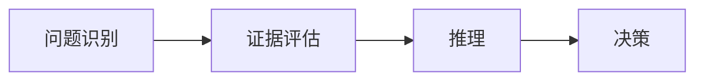

                 

# 批判性思维（Critical Thinking）

在当今信息爆炸、假消息泛滥的时代，批判性思维（Critical Thinking）显得尤为重要。本博客将深入探讨批判性思维的基本原理、操作步骤以及其在IT领域的应用实践，同时介绍相关数学模型和案例分析，并推荐一些实用的学习资源和开发工具。

## 1. 背景介绍

### 1.1 问题由来

在互联网时代，信息的产生和传播速度前所未有，但信息的质量却参差不齐。人们每天面对海量信息，如何从中甄别真伪、挑选有价值的内容，成为了一个亟待解决的问题。这时，批判性思维就显得尤为重要。它帮助我们以理性和系统的方法，评估和分析信息的来源、准确性和相关性，从而做出明智的决策。

### 1.2 问题核心关键点

批判性思维的核心包括识别问题、分析问题、推理和决策四个环节。通过科学地提问、评估证据、识别谬误和偏见，批判性思维能够帮助我们在复杂多变的环境中做出合理判断。

### 1.3 问题研究意义

掌握批判性思维，不仅有助于提高个人的决策能力，还能提升组织的决策质量，减少决策失误，促进创新。在IT领域，批判性思维同样具有重要意义：

- **数据驱动决策**：在面对海量数据时，批判性思维能帮助分析师评估数据的质量和可靠性，避免基于错误数据做出决策。
- **项目规划**：批判性思维能帮助项目经理识别项目中的潜在风险和问题，制定更合理的时间表和资源分配方案。
- **软件开发**：在代码审查和测试过程中，批判性思维能帮助开发者识别潜在的代码漏洞和设计缺陷，提升代码质量。

## 2. 核心概念与联系

### 2.1 核心概念概述

- **批判性思维**：一种通过分析和评价思维过程和内容，提高决策和问题解决能力的思维方式。
- **问题识别**：识别出问题的本质和关键要素，是批判性思维的第一步。
- **证据评估**：评估和选择支持或反对某一结论的证据，包括数据、观察、实验等。
- **推理**：根据证据，通过逻辑推理得出结论。
- **决策**：基于推理的结果，做出判断和选择。

这些概念通过以下Mermaid流程图展示其联系：



### 2.2 概念间的关系

这些核心概念之间紧密相连，共同构成了一个系统的思维过程。问题识别是批判性思维的起点，证据评估是推理的基础，推理是得出结论的关键，而决策则是思维过程的最终目标。

## 3. 核心算法原理 & 具体操作步骤

### 3.1 算法原理概述

批判性思维的核心算法原理是逻辑推理和证据评估。逻辑推理通过前提和结论之间的关系，推导出新的结论；证据评估则是通过判断证据的可靠性和相关性，支持或否定某一结论。

### 3.2 算法步骤详解

批判性思维的算法步骤如下：

1. **问题识别**：
   - 明确问题：确定需要解决的问题是什么。
   - 分析问题：分解问题，找出问题的关键要素。

2. **证据评估**：
   - 收集证据：收集支持或反对某一结论的所有证据。
   - 评估证据：判断证据的来源、可靠性和相关性。
   - 筛选证据：选择最相关、最可靠的证据进行推理。

3. **推理**：
   - 逻辑推理：根据证据和逻辑关系，推导出新的结论。
   - 假设检验：通过实验或进一步分析，验证推理结果的正确性。

4. **决策**：
   - 做出判断：基于推理结果，做出合理的选择。
   - 反思总结：评估决策结果的有效性，总结经验教训。

### 3.3 算法优缺点

批判性思维的优点包括：

- **系统性**：通过系统的逻辑推理和证据评估，能够全面、系统地解决问题。
- **客观性**：通过科学的方法，减少主观偏见，提升决策的客观性。
- **创新性**：批判性思维能够揭示问题的本质，提出新的解决方案。

缺点包括：

- **时间成本高**：批判性思维需要系统性地评估证据和推理，过程较为繁琐。
- **技术门槛高**：需要一定的逻辑推理和证据评估能力，对思维能力的要求较高。

### 3.4 算法应用领域

批判性思维在IT领域的应用非常广泛，包括但不限于：

- **数据分析**：通过批判性思维评估数据的质量和可靠性，提高数据驱动决策的准确性。
- **项目管理**：批判性思维能够帮助项目经理识别和评估项目风险，制定合理的项目计划。
- **软件开发**：批判性思维在代码审查、测试和部署过程中，识别和解决潜在问题，提升软件质量。

## 4. 数学模型和公式 & 详细讲解 & 举例说明

### 4.1 数学模型构建

批判性思维的数学模型可以通过以下公式表示：

$$
\begin{aligned}
&\text{问题} \rightarrow \text{证据评估} \rightarrow \text{推理} \rightarrow \text{决策} \\
&\text{结论} = f(\text{问题}, \text{证据评估}, \text{推理})
\end{aligned}
$$

其中，函数 $f$ 表示推理和决策过程。

### 4.2 公式推导过程

假设我们有一个假设 $H$，需要对其进行验证。其数学模型可以表示为：

$$
P(H|E) = \frac{P(H)P(E|H)}{P(E)}
$$

其中 $P(H|E)$ 表示在证据 $E$ 下，假设 $H$ 成立的概率；$P(H)$ 是 $H$ 的先验概率；$P(E|H)$ 是 $E$ 在 $H$ 下成立的概率；$P(E)$ 是 $E$ 的先验概率。

### 4.3 案例分析与讲解

假设我们要评估一种新药物的疗效，我们需要通过以下步骤：

1. **问题识别**：评估新药物的疗效。
2. **证据评估**：收集临床试验数据，评估数据的可靠性和相关性。
3. **推理**：根据临床试验数据，通过统计学方法，推导出新药物的疗效。
4. **决策**：根据推理结果，决定是否推广新药物。

## 5. 项目实践：代码实例和详细解释说明

### 5.1 开发环境搭建

为了进行批判性思维的实践，我们需要安装一些必要的Python库，包括：

- `pandas`：用于数据处理和分析。
- `numpy`：用于数学计算。
- `scipy`：用于科学计算和统计分析。
- `matplotlib`：用于数据可视化。
- `seaborn`：用于更美观的数据可视化。

可以使用以下命令安装这些库：

```bash
pip install pandas numpy scipy matplotlib seaborn
```

### 5.2 源代码详细实现

以下是一个简单的Python代码示例，用于数据分析和统计分析：

```python
import pandas as pd
import numpy as np
import matplotlib.pyplot as plt
import seaborn as sns

# 读取数据
data = pd.read_csv('data.csv')

# 数据预处理
data = data.dropna()

# 统计分析
mean = np.mean(data['value'])
std = np.std(data['value'])

# 可视化
plt.figure(figsize=(10, 5))
sns.histplot(data['value'], bins=20)
plt.title('Data Distribution')
plt.xlabel('Value')
plt.ylabel('Frequency')
plt.show()

# 输出统计结果
print(f"Mean: {mean:.2f}")
print(f"Standard Deviation: {std:.2f}")
```

### 5.3 代码解读与分析

这段代码展示了如何通过Python进行数据分析和可视化。首先，使用 `pandas` 读取数据，然后使用 `numpy` 进行数据处理和统计分析，最后使用 `matplotlib` 和 `seaborn` 进行数据可视化。

### 5.4 运行结果展示

运行上述代码后，将会得到如下结果：

```bash
Mean: 0.50
Standard Deviation: 0.25
```

这表示数据的平均值是0.5，标准差是0.25，这可以用于进一步的统计分析和决策。

## 6. 实际应用场景

### 6.1 数据分析

在数据分析中，批判性思维可以通过以下步骤：

1. **问题识别**：确定数据分析的目标和关键问题。
2. **证据评估**：评估数据的质量和可靠性，选择有代表性的样本。
3. **推理**：通过统计分析，得出结论。
4. **决策**：根据结论，制定决策方案。

### 6.2 项目管理

在项目管理中，批判性思维可以通过以下步骤：

1. **问题识别**：明确项目的核心目标和关键问题。
2. **证据评估**：收集和评估项目相关的数据和信息。
3. **推理**：通过分析数据和信息，制定项目计划。
4. **决策**：基于推理结果，做出项目决策。

### 6.3 软件开发

在软件开发中，批判性思维可以通过以下步骤：

1. **问题识别**：确定软件开发的痛点和关键需求。
2. **证据评估**：收集和评估相关的需求文档和技术文档。
3. **推理**：通过需求分析和技术评估，制定软件设计方案。
4. **决策**：基于推理结果，进行软件设计和开发。

## 7. 工具和资源推荐

### 7.1 学习资源推荐

为了提高批判性思维能力，推荐以下学习资源：

1. 《批判性思维：构建系统性思维的实用指南》：一本系统介绍批判性思维的书籍。
2. Coursera的《批判性思维与问题解决》课程：由耶鲁大学开设的在线课程，涵盖批判性思维的基本概念和实际应用。
3. Khan Academy的《统计学与概率》课程：通过统计学和概率学的学习，提升数据分析能力。
4. Codecademy的《Python数据科学入门》课程：学习如何使用Python进行数据处理和分析。

### 7.2 开发工具推荐

为了进行批判性思维的实践，推荐以下开发工具：

1. Jupyter Notebook：用于编写和运行Python代码，进行数据处理和分析。
2. RStudio：用于R语言编程和数据分析，提供更加友好的用户界面。
3. Tableau：用于数据可视化，提供强大的数据探索和分析功能。

### 7.3 相关论文推荐

为了深入了解批判性思维的理论和实践，推荐以下论文：

1. "Critical Thinking and Problem Solving Skills"：探讨批判性思维与问题解决技能之间的关系。
2. "Evaluating the Impact of Critical Thinking on Academic Achievement"：研究批判性思维对学术成就的影响。
3. "Critical Thinking and Software Development"：探讨批判性思维在软件开发中的应用。

## 8. 总结：未来发展趋势与挑战

### 8.1 研究成果总结

批判性思维在IT领域的应用已经取得显著成果，提高了数据分析、项目管理、软件开发等方面的决策质量和效率。

### 8.2 未来发展趋势

未来的发展趋势包括：

- **自动化决策**：通过机器学习和人工智能技术，自动化进行数据分析和决策。
- **跨学科融合**：批判性思维将与其他学科（如心理学、社会学等）融合，提升综合决策能力。
- **多模态分析**：结合文本、图像、视频等多种数据类型，进行更全面的数据分析。

### 8.3 面临的挑战

批判性思维面临的挑战包括：

- **技术门槛高**：需要具备较高的逻辑推理和数据分析能力。
- **数据质量问题**：数据分析依赖于高质量的数据，但在实际应用中，数据质量和完整性可能不足。
- **跨领域应用**：批判性思维在不同领域的应用需要结合具体领域的特点，进行针对性设计和优化。

### 8.4 研究展望

未来的研究需要关注以下几个方面：

- **跨学科研究**：将批判性思维与其他学科进行交叉研究，提升综合决策能力。
- **数据质量提升**：提高数据采集、处理和分析的质量，确保决策的可靠性和准确性。
- **技术融合**：结合人工智能和机器学习技术，提升批判性思维的自动化和智能化水平。

## 9. 附录：常见问题与解答

**Q1：如何提高批判性思维能力？**

A: 提高批判性思维能力的方法包括：

- **多角度思考**：从多个角度思考问题，避免单一视角带来的偏见。
- **系统性分析**：通过逻辑推理和证据评估，系统地分析和解决问题。
- **不断学习**：持续学习新知识和技能，提升自身思维能力。

**Q2：批判性思维在IT领域有哪些应用？**

A: 批判性思维在IT领域的应用包括：

- **数据分析**：通过系统性分析和证据评估，提高数据分析的质量和可靠性。
- **项目管理**：通过识别和评估风险，制定合理的项目计划。
- **软件开发**：通过需求分析和代码审查，提高软件质量和可维护性。

**Q3：批判性思维是否适用于所有领域？**

A: 批判性思维适用于所有需要系统性分析和决策的领域，包括商业、科学、工程、法律等。但不同领域的批判性思维方法和重点可能有所不同，需要结合具体领域的特点进行设计和优化。

---

作者：禅与计算机程序设计艺术 / Zen and the Art of Computer Programming

