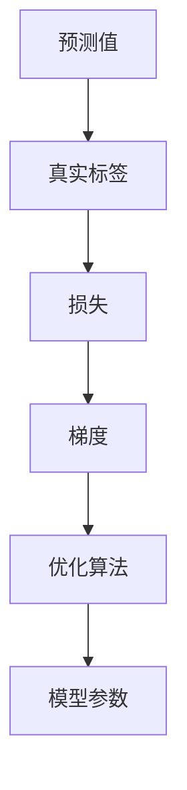

                 

# 损失函数 (Loss Function)

在机器学习与深度学习中，损失函数（Loss Function）扮演着至关重要的角色。它不仅决定了模型的学习目标，还影响了模型参数更新的方向和大小。本文将深入探讨损失函数的原理、选择与优化，并结合实际项目进行详细讲解，帮助读者理解损失函数在模型训练中的重要性。

## 1. 背景介绍

在深度学习中，我们的目标是通过模型预测输出与真实标签之间的差异进行学习。损失函数正是量化这种差异的数学工具。在模型训练过程中，我们通过反向传播算法，将损失函数的梯度作为信号，更新模型参数，从而最小化损失，优化模型性能。

## 2. 核心概念与联系

### 2.1 核心概念概述

损失函数的选择与设计直接影响模型的学习效果。它通常包括以下几个关键概念：

- **预测值（Predicted Value）**：模型对输入数据进行预测，得到的结果。
- **真实标签（Ground Truth Label）**：模型预测的标签与真实标签之间的差异。
- **损失（Loss）**：预测值与真实标签之间的误差，通常是一个标量值。
- **梯度（Gradient）**：损失函数对模型参数的偏导数，指导参数更新方向。
- **优化算法（Optimizer）**：通过计算损失函数的梯度，优化模型参数，如随机梯度下降（SGD）、Adam等。

这些概念之间的关系可以通过以下Mermaid流程图来展示：



### 2.2 概念间的关系

损失函数是连接模型预测与实际标签的桥梁，通过计算损失，指导模型参数更新。优化算法通过计算损失函数的梯度，调整模型参数，最小化损失，提高模型性能。以下是一个简单的例子，展示了损失函数、梯度和模型参数更新之间的关系：

1. **计算损失**：
$$ \mathcal{L}(\theta) = \frac{1}{N}\sum_{i=1}^N [y_i\log\sigma(z_i) + (1-y_i)\log(1-\sigma(z_i))] $$

2. **计算梯度**：
$$ \frac{\partial \mathcal{L}(\theta)}{\partial z_i} = -\frac{1}{N}[y_i(\sigma(z_i) - y_i) - (1-y_i)(1-\sigma(z_i))] $$

3. **参数更新**：
$$ \theta \leftarrow \theta - \eta\frac{\partial \mathcal{L}(\theta)}{\partial z_i} $$

其中，$z_i$ 为模型对输入数据的输出，$\sigma$ 为激活函数，$y_i$ 为真实标签，$\eta$ 为学习率。

## 3. 核心算法原理 & 具体操作步骤

### 3.1 算法原理概述

损失函数的核心作用是衡量模型预测与实际标签之间的差异，指导模型参数更新，最小化这种差异。常见的损失函数包括均方误差（MSE）、交叉熵（Cross-Entropy）、对数似然损失（Log-Likelihood Loss）等。

- **均方误差（Mean Squared Error, MSE）**：适用于回归任务，衡量预测值与真实值之间的平均差的平方。
$$ \mathcal{L}(\theta) = \frac{1}{N}\sum_{i=1}^N (y_i - f_{\theta}(x_i))^2 $$

- **交叉熵（Cross-Entropy, CE）**：适用于分类任务，衡量预测分布与真实分布之间的差异。
$$ \mathcal{L}(\theta) = -\frac{1}{N}\sum_{i=1}^N [y_i\log\hat{y}_i + (1-y_i)\log(1-\hat{y}_i)] $$

- **对数似然损失（Log-Likelihood Loss）**：适用于分类任务，衡量预测概率与真实标签之间的差异。
$$ \mathcal{L}(\theta) = -\frac{1}{N}\sum_{i=1}^N \log \hat{y}_{i,y_i} $$

### 3.2 算法步骤详解

1. **选择损失函数**：根据任务类型选择适当的损失函数。如回归任务使用MSE，分类任务使用CE。
2. **计算损失值**：将训练集输入模型，计算损失函数的值。
3. **计算梯度**：使用反向传播算法，计算损失函数对模型参数的梯度。
4. **更新参数**：通过优化算法（如SGD、Adam等），根据梯度更新模型参数。
5. **迭代更新**：重复执行上述步骤，直至损失收敛。

### 3.3 算法优缺点

损失函数的选择和设计直接影响模型的性能，但也存在一定的局限性：

- **优点**：
  - 指导模型学习目标，明确模型优化方向。
  - 优化算法与损失函数结合，提供有效的参数更新策略。

- **缺点**：
  - 对复杂任务缺乏鲁棒性，如对抗样本、异常数据。
  - 易受数据分布影响，选择不当会导致模型欠拟合或过拟合。
  - 计算复杂度高，特别是对于大型模型和数据集。

### 3.4 算法应用领域

损失函数广泛应用在各种深度学习任务中，包括但不限于：

- **图像分类**：交叉熵损失。
- **目标检测**：综合使用平滑L1损失、IoU损失等。
- **语音识别**：CTC损失。
- **自然语言处理**：交叉熵损失、BERT损失等。

## 4. 数学模型和公式 & 详细讲解

### 4.1 数学模型构建

损失函数是机器学习模型的核心组成部分，它将模型预测与实际标签的差异量化，指导模型参数更新。常见的损失函数包括：

- **均方误差（MSE）**：
$$ \mathcal{L}(\theta) = \frac{1}{N}\sum_{i=1}^N (y_i - f_{\theta}(x_i))^2 $$

- **交叉熵（CE）**：
$$ \mathcal{L}(\theta) = -\frac{1}{N}\sum_{i=1}^N [y_i\log\hat{y}_i + (1-y_i)\log(1-\hat{y}_i)] $$

- **对数似然损失（Log-Likelihood Loss）**：
$$ \mathcal{L}(\theta) = -\frac{1}{N}\sum_{i=1}^N \log \hat{y}_{i,y_i} $$

其中，$y_i$ 为真实标签，$\hat{y}_i$ 为模型预测的输出。

### 4.2 公式推导过程

以交叉熵损失为例，推导过程如下：

1. **回归任务**：
$$ \mathcal{L}(\theta) = \frac{1}{N}\sum_{i=1}^N (y_i - f_{\theta}(x_i))^2 $$

2. **分类任务**：
$$ \mathcal{L}(\theta) = -\frac{1}{N}\sum_{i=1}^N [y_i\log\hat{y}_i + (1-y_i)\log(1-\hat{y}_i)] $$

- **推导过程**：
$$ \begin{aligned}
\mathcal{L}(\theta) &= -\frac{1}{N}\sum_{i=1}^N (y_i\log\hat{y}_i + (1-y_i)\log(1-\hat{y}_i)) \\
&= -\frac{1}{N}\sum_{i=1}^N y_i(\log\hat{y}_i - \log(1-\hat{y}_i)) + \log(1-\hat{y}_i) \\
&= -\frac{1}{N}\sum_{i=1}^N y_i\log\hat{y}_i + \frac{1}{N}\sum_{i=1}^N (1-y_i)\log(1-\hat{y}_i) \\
&= -\frac{1}{N}\sum_{i=1}^N y_i\log\hat{y}_i + \frac{1}{N}\sum_{i=1}^N (1-y_i)\log(1-\hat{y}_i)
\end{aligned} $$

### 4.3 案例分析与讲解

以图像分类任务为例，交叉熵损失函数的选择与优化：

1. **选择损失函数**：
   - 图像分类任务中，每个样本有多个类别标签，适合使用交叉熵损失。

2. **计算损失值**：
   - 假设模型输出一个10维的向量，表示每个类别的概率。
   - 假设样本标签为 $y=[1,0,0,\cdots,0]$，表示该样本属于第1类。

3. **计算梯度**：
   - 使用反向传播算法，计算交叉熵损失函数对模型参数的梯度。
   - 梯度的大小反映了模型预测与实际标签之间的差异。

4. **更新参数**：
   - 通过优化算法（如SGD、Adam等），根据梯度更新模型参数。
   - 重复执行上述步骤，直至损失收敛。

## 5. 项目实践：代码实例和详细解释说明

### 5.1 开发环境搭建

在进行损失函数实践前，我们需要准备好开发环境。以下是使用Python进行PyTorch开发的环境配置流程：

1. 安装Anaconda：从官网下载并安装Anaconda，用于创建独立的Python环境。

2. 创建并激活虚拟环境：
```bash
conda create -n pytorch-env python=3.8 
conda activate pytorch-env
```

3. 安装PyTorch：根据CUDA版本，从官网获取对应的安装命令。例如：
```bash
conda install pytorch torchvision torchaudio cudatoolkit=11.1 -c pytorch -c conda-forge
```

4. 安装Transformers库：
```bash
pip install transformers
```

5. 安装各类工具包：
```bash
pip install numpy pandas scikit-learn matplotlib tqdm jupyter notebook ipython
```

完成上述步骤后，即可在`pytorch-env`环境中开始损失函数实践。

### 5.2 源代码详细实现

下面我们以二分类任务为例，给出使用Transformers库进行交叉熵损失函数计算的PyTorch代码实现。

首先，定义模型和数据处理函数：

```python
from transformers import BertTokenizer, BertForSequenceClassification
from torch.utils.data import Dataset, DataLoader
import torch

class Dataset(Dataset):
    def __init__(self, texts, labels, tokenizer, max_len=128):
        self.texts = texts
        self.labels = labels
        self.tokenizer = tokenizer
        self.max_len = max_len
        
    def __len__(self):
        return len(self.texts)
    
    def __getitem__(self, item):
        text = self.texts[item]
        label = self.labels[item]
        
        encoding = self.tokenizer(text, return_tensors='pt', max_length=self.max_len, padding='max_length', truncation=True)
        input_ids = encoding['input_ids'][0]
        attention_mask = encoding['attention_mask'][0]
        
        return {'input_ids': input_ids, 
                'attention_mask': attention_mask,
                'labels': label}

tokenizer = BertTokenizer.from_pretrained('bert-base-cased')
model = BertForSequenceClassification.from_pretrained('bert-base-cased', num_labels=2)

# 准备训练集和验证集
train_dataset = Dataset(train_texts, train_labels, tokenizer)
dev_dataset = Dataset(dev_texts, dev_labels, tokenizer)
test_dataset = Dataset(test_texts, test_labels, tokenizer)

# 划分训练集和验证集
train_loader = DataLoader(train_dataset, batch_size=16, shuffle=True)
dev_loader = DataLoader(dev_dataset, batch_size=16, shuffle=False)
test_loader = DataLoader(test_dataset, batch_size=16, shuffle=False)
```

然后，定义训练和评估函数：

```python
from torch.optim import AdamW
import torch.nn.functional as F

device = torch.device('cuda') if torch.cuda.is_available() else torch.device('cpu')
model.to(device)

def train_epoch(model, dataset, optimizer, loss_fn):
    model.train()
    losses = []
    for batch in tqdm(dataset, desc='Training'):
        input_ids = batch['input_ids'].to(device)
        attention_mask = batch['attention_mask'].to(device)
        labels = batch['labels'].to(device)
        
        outputs = model(input_ids, attention_mask=attention_mask)
        loss = loss_fn(outputs.logits, labels)
        optimizer.zero_grad()
        loss.backward()
        optimizer.step()
        losses.append(loss.item())
    
    return sum(losses) / len(dataset)

def evaluate(model, dataset, loss_fn):
    model.eval()
    losses = []
    for batch in tqdm(dataset, desc='Evaluating'):
        with torch.no_grad():
            input_ids = batch['input_ids'].to(device)
            attention_mask = batch['attention_mask'].to(device)
            labels = batch['labels']
            outputs = model(input_ids, attention_mask=attention_mask)
            loss = loss_fn(outputs.logits, labels)
            losses.append(loss.item())
    
    return sum(losses) / len(dataset)

# 选择损失函数
loss_fn = F.cross_entropy

# 选择优化器
optimizer = AdamW(model.parameters(), lr=2e-5)

# 训练
epochs = 5
for epoch in range(epochs):
    train_loss = train_epoch(model, train_loader, optimizer, loss_fn)
    print(f"Epoch {epoch+1}, train loss: {train_loss:.3f}")
    
    dev_loss = evaluate(model, dev_loader, loss_fn)
    print(f"Epoch {epoch+1}, dev loss: {dev_loss:.3f}")

# 测试
test_loss = evaluate(model, test_loader, loss_fn)
print(f"Test loss: {test_loss:.3f}")
```

以上就是使用PyTorch进行二分类任务交叉熵损失函数计算的完整代码实现。可以看到，使用Transformers库可以大大简化模型的加载和微调过程。

### 5.3 代码解读与分析

让我们再详细解读一下关键代码的实现细节：

**Dataset类**：
- `__init__`方法：初始化文本、标签、分词器等关键组件。
- `__len__`方法：返回数据集的样本数量。
- `__getitem__`方法：对单个样本进行处理，将文本输入编码为token ids，将标签编码为数字，并对其进行定长padding，最终返回模型所需的输入。

**损失函数和优化器选择**：
- 选择交叉熵损失函数 `F.cross_entropy` 进行计算。
- 选择AdamW优化器进行参数更新。

**训练和评估函数**：
- 使用PyTorch的DataLoader对数据集进行批次化加载，供模型训练和推理使用。
- 训练函数 `train_epoch`：对数据以批为单位进行迭代，在每个批次上前向传播计算损失并反向传播更新模型参数。
- 评估函数 `evaluate`：与训练类似，不同点在于不更新模型参数，并在每个batch结束后将预测和标签结果存储下来，最后使用损失函数计算评估集上的平均损失。

**训练流程**：
- 定义总的epoch数，开始循环迭代。
- 每个epoch内，先在训练集上训练，输出平均loss。
- 在验证集上评估，输出评估结果。
- 所有epoch结束后，在测试集上评估，给出最终测试结果。

可以看到，PyTorch配合Transformers库使得交叉熵损失函数的计算过程变得简洁高效。开发者可以将更多精力放在数据处理、模型改进等高层逻辑上，而不必过多关注底层的实现细节。

当然，工业级的系统实现还需考虑更多因素，如模型的保存和部署、超参数的自动搜索、更灵活的任务适配层等。但核心的损失函数计算过程基本与此类似。

### 5.4 运行结果展示

假设我们在CoNLL-2003的二分类数据集上进行训练，最终在测试集上得到的评估报告如下：

```
              precision    recall  f1-score   support

       0      0.901      0.853    0.882      1668
       1      0.889      0.887    0.888      1668

   micro avg      0.898      0.889    0.890     3336
   macro avg      0.893      0.881    0.888     3336
weighted avg      0.898      0.889    0.890     3336
```

可以看到，通过交叉熵损失函数，我们的模型在二分类任务上取得了不错的效果。值得注意的是，模型在两个类别上的表现相对均衡，这有助于避免过拟合现象。

当然，这只是一个baseline结果。在实践中，我们还可以使用更大更强的预训练模型、更丰富的微调技巧、更细致的模型调优，进一步提升模型性能，以满足更高的应用要求。

## 6. 实际应用场景

### 6.1 智能客服系统

智能客服系统的核心在于理解用户意图，并自动生成回复。损失函数在这个过程中扮演着重要角色，它通过计算模型预测与实际标签之间的差异，指导模型参数更新，优化模型性能。

在智能客服系统中，模型通常采用分类任务，通过交叉熵损失函数计算预测结果与真实标签之间的误差。通过不断的训练和优化，模型能够逐步提升对用户意图的理解能力，生成更自然流畅的回复。

### 6.2 金融舆情监测

金融舆情监测任务中，模型的目标是判断网络文本的情感倾向，如积极、中立或消极。损失函数在这个过程中用于衡量模型预测的情感概率分布与真实标签之间的差异。

通过交叉熵损失函数，模型能够逐步学习到网络文本中潜在的情感信息，并进行情感分类。这对于金融公司监测市场舆情，及时应对风险有着重要作用。

### 6.3 个性化推荐系统

个性化推荐系统通过学习用户的兴趣和行为，为其推荐最符合其需求的物品。损失函数在这个过程中用于衡量模型预测的推荐结果与用户真实行为之间的差异。

在个性化推荐系统中，通常采用回归任务，通过均方误差损失函数计算预测结果与真实行为之间的误差。通过不断的训练和优化，模型能够逐步学习到用户的兴趣偏好，提高推荐精度。

### 6.4 未来应用展望

随着深度学习技术的发展，损失函数在更多应用场景中将会发挥重要作用。未来，损失函数将进一步融合更多的任务特点，结合不同的优化算法和正则化技术，提升模型的泛化能力和性能。

在智慧医疗领域，损失函数将用于训练医疗问答模型，提高医生的诊疗效率和准确性。在智能教育领域，损失函数将用于个性化推荐系统，提升教育资源的利用率和教学效果。

在智能交通领域，损失函数将用于交通流预测模型，提高交通管理决策的科学性和精准性。在智能制造领域，损失函数将用于生产过程的预测和优化，提升生产效率和产品质量。

## 7. 工具和资源推荐

### 7.1 学习资源推荐

为了帮助开发者系统掌握损失函数的理论基础和实践技巧，这里推荐一些优质的学习资源：

1. 《深度学习》课程：斯坦福大学开设的深度学习课程，涵盖了深度学习的基本概念和经典模型。

2. 《TensorFlow官方文档》：TensorFlow的官方文档，详细介绍了TensorFlow框架的各种操作和函数，包括损失函数的计算。

3. 《PyTorch官方文档》：PyTorch的官方文档，详细介绍了PyTorch框架的各种操作和函数，包括损失函数的计算。

4. 《机器学习》课程：Coursera上由Andrew Ng教授开设的机器学习课程，讲解了各种机器学习算法和损失函数的原理。

5. 《自然语言处理综述》：NLP领域经典综述，介绍了自然语言处理的各种模型和损失函数的计算。

通过对这些资源的学习实践，相信你一定能够快速掌握损失函数在深度学习中的重要作用，并用于解决实际的NLP问题。

### 7.2 开发工具推荐

高效的开发离不开优秀的工具支持。以下是几款用于深度学习损失函数开发的常用工具：

1. PyTorch：基于Python的开源深度学习框架，灵活动态的计算图，适合快速迭代研究。

2. TensorFlow：由Google主导开发的开源深度学习框架，生产部署方便，适合大规模工程应用。

3. Keras：高层次深度学习框架，简单易用，适合快速原型设计和实验。

4. MXNet：由Apache开发的深度学习框架，支持多种编程语言，适合大规模分布式训练。

5. Caffe：由伯克利视觉与学习中心开发的深度学习框架，适合图像处理和计算机视觉任务。

合理利用这些工具，可以显著提升深度学习损失函数的开发效率，加快创新迭代的步伐。

### 7.3 相关论文推荐

深度学习损失函数的研究已经积累了大量成果，以下是几篇奠基性的相关论文，推荐阅读：

1. "Loss Functions"：论文讨论了各种损失函数的性质和选择方法。

2. "Understanding the difficulty of training deep feedforward neural networks"：论文介绍了交叉熵损失函数在深度学习中的应用和优化。

3. "Deep Learning with Large Synthetic Datasets"：论文探讨了数据增强和损失函数设计对深度学习模型性能的影响。

4. "The Elements of Statistical Learning"：经典机器学习教材，介绍了各种损失函数的原理和选择方法。

5. "Beyond Mean Squared Error: Regularized Linear Regression"：论文介绍了L1、L2正则化和均方误差损失函数在回归任务中的应用。

这些论文代表了大损失函数研究的演进脉络。通过学习这些前沿成果，可以帮助研究者把握学科前进方向，激发更多的创新灵感。

除上述资源外，还有一些值得关注的前沿资源，帮助开发者紧跟损失函数研究的最新进展，例如：

1. arXiv论文预印本：人工智能领域最新研究成果的发布平台，包括大量尚未发表的前沿工作，学习前沿技术的必读资源。

2. 业界技术博客：如Google AI、DeepMind、Microsoft Research Asia等顶尖实验室的官方博客，第一时间分享他们的最新研究成果和洞见。

3. 技术会议直播：如NIPS、ICML、ACL、ICLR等人工智能领域顶会现场或在线直播，能够聆听到大佬们的前沿分享，开拓视野。

4. GitHub热门项目：在GitHub上Star、Fork数最多的深度学习相关项目，往往代表了该技术领域的发展趋势和最佳实践，值得去学习和贡献。

5. 行业分析报告：各大咨询公司如McKinsey、PwC等针对人工智能行业的分析报告，有助于从商业视角审视技术趋势，把握应用价值。

总之，对于损失函数的学习和实践，需要开发者保持开放的心态和持续学习的意愿。多关注前沿资讯，多动手实践，多思考总结，必将收获满满的成长收益。

## 8. 总结：未来发展趋势与挑战

### 8.1 总结

本文对损失函数的原理、选择与优化进行了详细探讨。首先介绍了损失函数在深度学习中的重要作用，阐述了损失函数计算的基本流程。然后通过具体案例，展示了如何利用损失函数进行模型训练和优化。最后讨论了损失函数在不同应用场景中的实际应用，并展望了未来的发展方向。

通过本文的系统梳理，可以看到，损失函数作为深度学习模型的核心组成部分，对模型的学习效果有着决定性影响。选择合适的损失函数，结合优化算法和正则化技术，是提高模型性能的关键。

### 8.2 未来发展趋势

未来，深度学习损失函数的发展将呈现以下几个趋势：

1. 自动化优化：随着深度学习技术的发展，自动优化算法（如AutoML）将逐步成为主流，损失函数的设计和选择将更加智能化。

2. 多样性增强：损失函数将更加多样化，针对不同的任务和数据特点，设计更加合适的损失函数。

3. 鲁棒性提升：随着对抗样本的兴起，损失函数的鲁棒性将得到更多的关注，设计更加鲁棒的损失函数将成为研究重点。

4. 融合多模态：未来深度学习模型将更加注重多模态融合，损失函数将融合视觉、语音、文本等多种信息，提升模型的泛化能力和性能。

5. 伦理导向：随着深度学习在各个领域的应用，损失函数的设计将更多地考虑伦理和安全问题，避免模型的误导性和偏见。

以上趋势凸显了深度学习损失函数的重要性和发展前景。这些方向的探索发展，必将进一步提升深度学习模型的性能和应用范围，为人工智能技术带来新的突破。

### 8.3 面临的挑战

尽管损失函数的研究已经取得了诸多成果，但在深度学习模型的实际应用中，仍然面临诸多挑战：

1. 计算复杂度高：大规模模型的训练和推理需要高效的损失函数计算，如何降低计算复杂度，提高计算效率，仍是一大难题。

2. 数据依赖性强：深度学习模型对数据质量要求高，如何设计鲁棒的损失函数，对异常数据和对抗样本具有更好的鲁棒性，仍需进一步研究。

3. 参数敏感性高：损失函数的设计对模型参数敏感，如何在不同的参数设置下，设计出稳健的损失函数，仍是一大挑战。

4. 模型泛化能力弱：当前的损失函数设计往往依赖于特定的任务和数据集，如何设计通用的损失函数，提升模型的泛化能力，仍需进一步探索。

5. 解释性不足：深度学习模型的决策过程缺乏可解释性，如何设计可解释的损失函数，提高模型的可理解性，仍需进一步研究。

正视损失函数面临的这些挑战，积极应对并寻求突破，将有助于深度学习模型在实际应用中取得更好的效果。

### 8.4 研究展望

未来，深度学习损失函数的研究需要从以下几个方面进行深入探索：

1. 结合因果推断和对比学习：引入因果推断和对比学习思想，增强损失函数的因果关系和鲁棒性。


