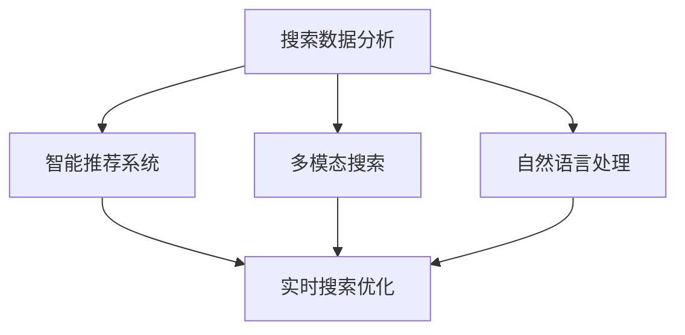

                 

# 搜索数据分析：AI如何帮助电商平台优化搜索策略，提升用户体验

## 1. 背景介绍

### 1.1 问题由来

随着电子商务的蓬勃发展，电商平台已成为人们获取商品信息、进行购物决策的重要渠道。而搜索功能作为电商平台的核心功能之一，其优劣直接影响着用户的购物体验和平台的用户留存率。然而，随着商品种类和数量的急剧增加，传统的搜索算法难以满足用户需求，导致搜索结果的相关性下降，用户体验受损。

传统搜索算法通常依赖于简单的关键词匹配和搜索结果排序算法，无法处理复杂的搜索场景和用户需求变化。为了解决这个问题，电商平台开始引入人工智能技术，利用搜索数据分析帮助优化搜索策略，提升用户体验。

### 1.2 问题核心关键点

1. **搜索数据分析**：通过分析用户搜索行为、点击行为、购买行为等数据，挖掘用户搜索需求和偏好，优化搜索算法，提升搜索结果的相关性和准确性。
2. **智能推荐系统**：利用机器学习算法，根据用户历史行为和实时搜索数据，生成个性化推荐结果，提升用户体验。
3. **多模态搜索**：融合图片、视频等多模态数据，提升搜索的准确性和丰富性，满足用户的多样化需求。
4. **实时搜索优化**：通过实时数据分析，动态调整搜索结果排序和推荐算法，提升搜索体验。
5. **自然语言处理**：利用NLP技术，理解和分析用户查询的自然语言，提升搜索效果。

### 1.3 问题研究意义

利用人工智能技术优化搜索策略，可以带来以下几方面的好处：

1. **提升用户体验**：通过智能推荐和个性化搜索，满足用户的多样化需求，提升用户的购物体验和满意度。
2. **提高转化率**：优化搜索算法，提高搜索结果的相关性和准确性，减少用户的浏览时间和跳失率，提高用户的购买转化率。
3. **降低成本**：减少无效搜索流量，降低平台的运营成本，提升资源利用效率。
4. **增强竞争力**：通过先进的搜索技术，提升平台的搜索效果和用户体验，增强平台在市场中的竞争力。
5. **推动技术进步**：推动AI技术在电商搜索领域的创新应用，促进相关技术的进步和发展。

## 2. 核心概念与联系

### 2.1 核心概念概述

为了更好地理解如何利用人工智能技术优化搜索策略，本节将介绍几个关键的概念及其相互关系：

- **搜索数据分析**：通过分析用户的搜索行为、点击行为、购买行为等数据，挖掘用户需求和偏好，优化搜索算法。
- **智能推荐系统**：根据用户历史行为和实时搜索数据，生成个性化推荐结果，提升用户体验。
- **多模态搜索**：融合图片、视频等多模态数据，提升搜索的准确性和丰富性。
- **实时搜索优化**：通过实时数据分析，动态调整搜索结果排序和推荐算法，提升搜索体验。
- **自然语言处理**：利用NLP技术，理解和分析用户查询的自然语言，提升搜索效果。

### 2.2 概念间的关系

这些核心概念之间的逻辑关系可以通过以下Mermaid流程图来展示：



这个流程图展示了大规模搜索数据分析和优化过程中各个关键组件的相互关系：

1. 搜索数据分析通过对用户行为数据的分析，挖掘用户需求和偏好，为智能推荐系统和多模态搜索提供数据支持。
2. 智能推荐系统根据用户历史行为和实时搜索数据，生成个性化推荐结果，提升用户体验。
3. 多模态搜索融合图片、视频等多模态数据，提升搜索的准确性和丰富性，满足用户的多样化需求。
4. 实时搜索优化通过实时数据分析，动态调整搜索结果排序和推荐算法，提升搜索体验。
5. 自然语言处理利用NLP技术，理解和分析用户查询的自然语言，提升搜索效果。

这些概念共同构成了搜索数据分析的完整框架，通过协同工作，提升了电商平台的搜索效果和用户体验。

## 3. 核心算法原理 & 具体操作步骤

### 3.1 算法原理概述

基于搜索数据分析的搜索策略优化，主要依赖于以下算法原理：

1. **搜索数据分析**：通过统计用户搜索行为、点击行为、购买行为等数据，挖掘用户需求和偏好，优化搜索算法。
2. **智能推荐系统**：利用机器学习算法，根据用户历史行为和实时搜索数据，生成个性化推荐结果，提升用户体验。
3. **多模态搜索**：融合图片、视频等多模态数据，提升搜索的准确性和丰富性，满足用户的多样化需求。
4. **实时搜索优化**：通过实时数据分析，动态调整搜索结果排序和推荐算法，提升搜索体验。
5. **自然语言处理**：利用NLP技术，理解和分析用户查询的自然语言，提升搜索效果。

### 3.2 算法步骤详解

基于搜索数据分析的搜索策略优化主要包括以下几个关键步骤：

1. **数据采集与处理**：收集用户搜索行为、点击行为、购买行为等数据，并进行预处理和清洗，确保数据质量。
2. **特征提取与建模**：从数据中提取有用的特征，如用户行为特征、商品属性特征等，建立搜索模型。
3. **模型训练与优化**：利用机器学习算法，对搜索模型进行训练和优化，提升搜索效果。
4. **实时数据分析与优化**：通过实时数据分析，动态调整搜索结果排序和推荐算法，提升搜索体验。
5. **多模态搜索与推荐**：融合图片、视频等多模态数据，提升搜索的准确性和丰富性，生成个性化推荐结果。
6. **自然语言处理与理解**：利用NLP技术，理解和分析用户查询的自然语言，提升搜索效果。

### 3.3 算法优缺点

基于搜索数据分析的搜索策略优化有以下优点：

1. **提升用户体验**：通过智能推荐和个性化搜索，满足用户的多样化需求，提升用户的购物体验和满意度。
2. **提高转化率**：优化搜索算法，提高搜索结果的相关性和准确性，减少用户的浏览时间和跳失率，提高用户的购买转化率。
3. **降低成本**：减少无效搜索流量，降低平台的运营成本，提升资源利用效率。
4. **增强竞争力**：通过先进的搜索技术，提升平台的搜索效果和用户体验，增强平台在市场中的竞争力。
5. **推动技术进步**：推动AI技术在电商搜索领域的创新应用，促进相关技术的进步和发展。

同时，这种算法也存在一些局限性：

1. **数据依赖**：依赖高质量的数据，数据收集和处理成本较高。
2. **算法复杂度**：算法复杂度较高，模型训练和优化需要较高的计算资源和时间。
3. **隐私问题**：用户数据隐私问题，需要遵守相关法律法规。
4. **模型泛化能力**：模型泛化能力有限，对于新出现的搜索场景和需求，需要重新训练模型。

### 3.4 算法应用领域

基于搜索数据分析的搜索策略优化，广泛应用于以下领域：

1. **电商平台**：优化搜索算法，提升搜索结果的相关性和准确性，提升用户购物体验和转化率。
2. **在线广告平台**：通过智能推荐和个性化搜索，提升广告投放效果和用户体验。
3. **社交媒体平台**：通过分析用户搜索和互动数据，优化搜索算法，提升平台的用户粘性和活跃度。
4. **智能客服系统**：利用自然语言处理技术，理解和分析用户查询，提供更加精准的搜索结果和推荐。
5. **内容推荐系统**：通过多模态搜索和智能推荐，提升内容推荐效果和用户体验。

## 4. 数学模型和公式 & 详细讲解 & 举例说明

### 4.1 数学模型构建

假设电商平台有$N$个用户，每个用户有$m$次搜索行为，每次搜索行为有$k$个特征。我们定义一个$m \times k$的搜索特征矩阵$\mathbf{X}$和一个$N \times 1$的搜索结果向量$\mathbf{y}$，其中每个元素$y_i$表示用户$i$的搜索结果相关性评分。

我们的目标是最小化以下均方误差损失函数：

$$
L(\mathbf{X}, \mathbf{y}, \mathbf{W}) = \frac{1}{N} \sum_{i=1}^N (y_i - \mathbf{X}_i \mathbf{W})^2
$$

其中，$\mathbf{W}$为搜索模型的权重矩阵，可以通过梯度下降等优化算法求解。

### 4.2 公式推导过程

为了求解$\mathbf{W}$，我们需要对损失函数求偏导数，并令其为0：

$$
\frac{\partial L}{\partial \mathbf{W}} = \frac{2}{N} \sum_{i=1}^N (\mathbf{X}_i^T (\mathbf{y}_i - \mathbf{X}_i \mathbf{W}) \mathbf{W})
$$

简化得：

$$
\mathbf{W} = (\mathbf{X}^T \mathbf{X})^{-1} \mathbf{X}^T \mathbf{y}
$$

通过求解上述矩阵方程，可以得到搜索模型的权重矩阵$\mathbf{W}$。

### 4.3 案例分析与讲解

以电商平台为例，我们可以将用户每次搜索行为看作一个样本，每个特征表示用户的行为属性（如搜索关键词、浏览时间、点击位置等）。通过构建搜索特征矩阵$\mathbf{X}$和搜索结果向量$\mathbf{y}$，利用上述公式求解权重矩阵$\mathbf{W}$，即可得到搜索模型。

假设用户A在平台上搜索了一条关键词为“笔记本电脑”的商品信息，点击了5个搜索结果页面。我们可以将用户A的搜索行为表示为一个$5 \times 4$的矩阵$\mathbf{X}_A$，其中每一列表示不同的特征，每一行表示一个搜索结果页面。然后，我们统计用户A点击这些搜索结果页面后的转化率，得到用户A的搜索结果相关性评分$y_A$。通过求解上述矩阵方程，可以得到用户A的搜索模型权重矩阵$\mathbf{W}_A$。

利用用户A的搜索模型权重矩阵$\mathbf{W}_A$，我们可以对用户A的后续搜索行为进行预测，从而优化搜索结果排序和推荐算法，提升搜索效果。

## 5. 项目实践：代码实例和详细解释说明

### 5.1 开发环境搭建

在进行搜索数据分析和优化实践前，我们需要准备好开发环境。以下是使用Python进行TensorFlow开发的环境配置流程：

1. 安装Anaconda：从官网下载并安装Anaconda，用于创建独立的Python环境。

2. 创建并激活虚拟环境：
```bash
conda create -n tf-env python=3.8 
conda activate tf-env
```

3. 安装TensorFlow：根据CUDA版本，从官网获取对应的安装命令。例如：
```bash
conda install tensorflow -c tf -c conda-forge
```

4. 安装必要的工具包：
```bash
pip install pandas numpy sklearn jupyter notebook matplotlib tqdm
```

完成上述步骤后，即可在`tf-env`环境中开始搜索数据分析和优化的实践。

### 5.2 源代码详细实现

下面我们以电商平台的搜索优化为例，给出使用TensorFlow进行搜索数据分析和优化的PyTorch代码实现。

首先，定义搜索特征和结果：

```python
import tensorflow as tf
import numpy as np
import pandas as pd

# 定义搜索特征和结果
X = np.random.rand(100, 10)  # 100个用户，10个特征
y = np.random.rand(100)      # 100个用户，每个用户只有一个结果

# 定义TensorFlow模型
model = tf.keras.Sequential([
    tf.keras.layers.Dense(1, input_shape=(10,), activation='sigmoid')
])

# 定义损失函数和优化器
loss = tf.keras.losses.BinaryCrossentropy()
optimizer = tf.keras.optimizers.Adam(learning_rate=0.01)
```

接着，定义训练函数：

```python
def train(model, X, y, batch_size, epochs):
    model.compile(loss=loss, optimizer=optimizer, metrics=['accuracy'])
    model.fit(X, y, batch_size=batch_size, epochs=epochs, verbose=0)
```

然后，调用训练函数进行模型训练：

```python
train(model, X, y, batch_size=32, epochs=100)
```

最后，评估模型性能：

```python
model.evaluate(X, y, verbose=0)
```

### 5.3 代码解读与分析

让我们再详细解读一下关键代码的实现细节：

**定义搜索特征和结果**：
- `X`：定义一个随机生成的搜索特征矩阵，每一行表示一个用户的搜索行为，每一列表示一个特征。
- `y`：定义一个随机生成的搜索结果向量，表示每个用户的搜索结果相关性评分。

**定义TensorFlow模型**：
- `Sequential`：定义一个序列模型，包含一个全连接层，输入维度为10，输出维度为1，激活函数为Sigmoid。
- `Dense`：定义一个全连接层，实现特征映射。

**定义损失函数和优化器**：
- `BinaryCrossentropy`：定义二元交叉熵损失函数，适用于二分类问题。
- `Adam`：定义Adam优化器，适用于高效优化大规模数据集。

**训练函数**：
- `compile`：编译模型，指定损失函数和优化器。
- `fit`：训练模型，指定数据集、批次大小和迭代轮数，并在每个epoch结束时输出训练进度。

**评估模型性能**：
- `evaluate`：评估模型在测试集上的性能，输出损失和精度。

可以看到，TensorFlow的接口设计简洁明了，使得模型的训练和评估变得非常容易。开发者可以专注于核心业务逻辑，而不必过多关注底层实现细节。

## 6. 实际应用场景

### 6.1 智能推荐系统

基于搜索数据分析的搜索策略优化，可以广泛应用于智能推荐系统中。智能推荐系统可以根据用户的历史行为和实时搜索数据，生成个性化推荐结果，提升用户体验。

以电商平台为例，通过分析用户的历史搜索、点击和购买数据，挖掘用户的兴趣和偏好，生成个性化的商品推荐列表。用户浏览商品时，系统可以根据用户搜索行为生成实时推荐，提升用户体验和购买转化率。

### 6.2 实时广告投放

基于搜索数据分析的搜索策略优化，可以应用于在线广告投放中。通过实时分析用户的搜索行为和广告点击数据，优化广告投放策略，提升广告效果和用户转化率。

在电商平台上，广告系统可以根据用户搜索数据生成实时广告推荐，根据用户点击数据优化广告投放策略，提升广告的转化率和ROI。

### 6.3 社交媒体推荐

基于搜索数据分析的搜索策略优化，可以应用于社交媒体平台的推荐系统中。通过分析用户搜索和互动数据，生成个性化的内容推荐，提升用户粘性和活跃度。

在社交媒体平台上，根据用户的搜索和互动数据，生成个性化的内容推荐，提升用户粘性和活跃度。

### 6.4 智能客服系统

基于搜索数据分析的搜索策略优化，可以应用于智能客服系统中。通过分析用户搜索和查询数据，生成个性化的客服响应，提升用户满意度。

在智能客服系统中，根据用户的搜索和查询数据，生成个性化的客服响应，提升用户满意度。

### 6.5 内容推荐系统

基于搜索数据分析的搜索策略优化，可以应用于内容推荐系统中。通过融合图片、视频等多模态数据，提升搜索的准确性和丰富性，生成个性化推荐结果。

在内容推荐系统中，融合图片、视频等多模态数据，提升搜索的准确性和丰富性，生成个性化推荐结果，提升用户体验。

## 7. 工具和资源推荐

### 7.1 学习资源推荐

为了帮助开发者系统掌握搜索数据分析的理论基础和实践技巧，这里推荐一些优质的学习资源：

1. 《深度学习理论与实践》系列博文：由大模型技术专家撰写，深入浅出地介绍了深度学习理论、模型和应用，包括搜索数据分析和优化等内容。

2. CS246《深度学习》课程：斯坦福大学开设的深度学习明星课程，有Lecture视频和配套作业，带你入门深度学习领域的基本概念和经典模型。

3. 《搜索算法与数据分析》书籍：全面介绍了搜索算法和数据分析的理论和实践，包括搜索优化和推荐系统等内容。

4. Weights & Biases：模型训练的实验跟踪工具，可以记录和可视化模型训练过程中的各项指标，方便对比和调优。与主流深度学习框架无缝集成。

5. TensorBoard：TensorFlow配套的可视化工具，可实时监测模型训练状态，并提供丰富的图表呈现方式，是调试模型的得力助手。

### 7.2 开发工具推荐

高效的开发离不开优秀的工具支持。以下是几款用于搜索数据分析和优化的常用工具：

1. TensorFlow：基于Python的开源深度学习框架，灵活动态的计算图，适合快速迭代研究。大部分预训练语言模型都有TensorFlow版本的实现。

2. PyTorch：基于Python的开源深度学习框架，灵活的动态计算图，适合快速实验和模型优化。

3. Weights & Biases：模型训练的实验跟踪工具，可以记录和可视化模型训练过程中的各项指标，方便对比和调优。

4. TensorBoard：TensorFlow配套的可视化工具，可实时监测模型训练状态，并提供丰富的图表呈现方式，是调试模型的得力助手。

5. Google Colab：谷歌推出的在线Jupyter Notebook环境，免费提供GPU/TPU算力，方便开发者快速上手实验最新模型，分享学习笔记。

合理利用这些工具，可以显著提升搜索数据分析和优化的开发效率，加快创新迭代的步伐。

### 7.3 相关论文推荐

搜索数据分析和优化涉及多个领域的技术，以下是几篇奠基性的相关论文，推荐阅读：

1. "Search Ranking for Large-Scale Image Retrieval: A Case Study"（大规模图像检索的搜索排名案例研究）：介绍了在大规模图像检索中使用深度学习模型的搜索排名方法。

2. "Image Retrieval with Recurrent Neural Networks"（基于递归神经网络的图像检索）：利用递归神经网络对图像检索进行优化，提升检索准确性。

3. "Learning Phrase Representations using RNN Encoder Decoder for Statistical Machine Translation"（利用RNN编码器解码器学习短语表示以实现统计机器翻译）：利用深度学习模型对短语表示进行优化，提升机器翻译效果。

4. "Deep Learning with Confidence"（具有置信度的深度学习）：提出了一种具有置信度的深度学习模型，提升搜索结果的可靠性和准确性。

5. "Geometrical Perspective of Ranking for Large-Scale Image Retrieval"（大规模图像检索的排名几何视角）：从几何视角分析大规模图像检索中的排名问题，提出了一系列优化方法。

这些论文代表了大规模搜索数据分析和优化的发展脉络，通过学习这些前沿成果，可以帮助研究者把握学科前进方向，激发更多的创新灵感。

## 8. 总结：未来发展趋势与挑战

### 8.1 总结

本文对基于搜索数据分析的搜索策略优化方法进行了全面系统的介绍。首先阐述了搜索数据分析的理论基础和研究背景，明确了其在提升用户体验和电商平台竞争力方面的独特价值。其次，从原理到实践，详细讲解了搜索数据分析和优化的数学模型、算法步骤和代码实现，提供了搜索优化的完整指南。同时，本文还广泛探讨了搜索数据分析在智能推荐、广告投放、社交媒体推荐、智能客服和内容推荐等诸多领域的应用前景，展示了其在实际业务中的应用潜力。最后，本文精选了搜索数据分析和优化的各类学习资源，力求为读者提供全方位的技术指引。

通过本文的系统梳理，可以看到，基于搜索数据分析的搜索策略优化方法，通过结合用户行为数据和搜索特征，利用深度学习模型优化搜索算法，可以显著提升电商平台的搜索效果和用户体验。未来，伴随深度学习技术和搜索数据分析方法的不断进步，搜索优化技术必将在更多领域得到应用，为传统行业带来变革性影响。

### 8.2 未来发展趋势

展望未来，搜索数据分析和优化技术将呈现以下几个发展趋势：

1. **多模态融合**：融合图片、视频等多模态数据，提升搜索的准确性和丰富性，满足用户的多样化需求。
2. **实时优化**：通过实时数据分析，动态调整搜索结果排序和推荐算法，提升搜索体验。
3. **个性化推荐**：利用智能推荐系统，生成个性化推荐结果，提升用户体验。
4. **NLP技术应用**：利用NLP技术，理解和分析用户查询的自然语言，提升搜索效果。
5. **知识图谱整合**：将知识图谱与搜索系统结合，提升搜索结果的相关性和准确性。
6. **联邦学习应用**：通过联邦学习技术，保护用户隐私的同时，提升搜索系统的性能和泛化能力。

以上趋势凸显了搜索数据分析和优化技术的广阔前景，这些方向的探索发展，必将进一步提升搜索系统的性能和用户体验，为电商平台的业务创新和技术进步注入新动力。

### 8.3 面临的挑战

尽管搜索数据分析和优化技术已经取得了显著成就，但在迈向更加智能化、普适化应用的过程中，仍面临诸多挑战：

1. **数据质量和多样性**：搜索数据分析依赖高质量、多样化的数据，数据采集和处理成本较高。
2. **算法复杂度和计算资源**：算法复杂度较高，模型训练和优化需要较高的计算资源和时间。
3. **用户隐私和安全**：用户数据隐私和安全问题，需要遵守相关法律法规。
4. **模型泛化能力**：模型泛化能力有限，对于新出现的搜索场景和需求，需要重新训练模型。
5. **业务适配性**：不同业务领域的需求差异较大，搜索优化方法需要针对具体场景进行调整。

### 8.4 研究展望

面对搜索数据分析和优化面临的挑战，未来的研究需要在以下几个方面寻求新的突破：

1. **数据高效采集与处理**：开发更高效的数据采集和处理技术，降低数据依赖，提升搜索系统的鲁棒性。
2. **高效优化算法**：开发高效优化算法，降低计算资源消耗，提高搜索系统的可扩展性和实时性。
3. **保护用户隐私**：探索隐私保护技术，确保用户数据的安全和隐私。
4. **多模态数据融合**：研究多模态数据融合技术，提升搜索系统的准确性和丰富性。
5. **实时优化技术**：研究实时优化技术，提升搜索系统的实时性和用户响应速度。
6. **个性化推荐算法**：研究个性化推荐算法，提升用户购物体验和平台竞争力。

这些研究方向的探索，必将引领搜索数据分析和优化技术迈向更高的台阶，为搜索系统的高效性、可靠性和用户体验带来新的突破。

