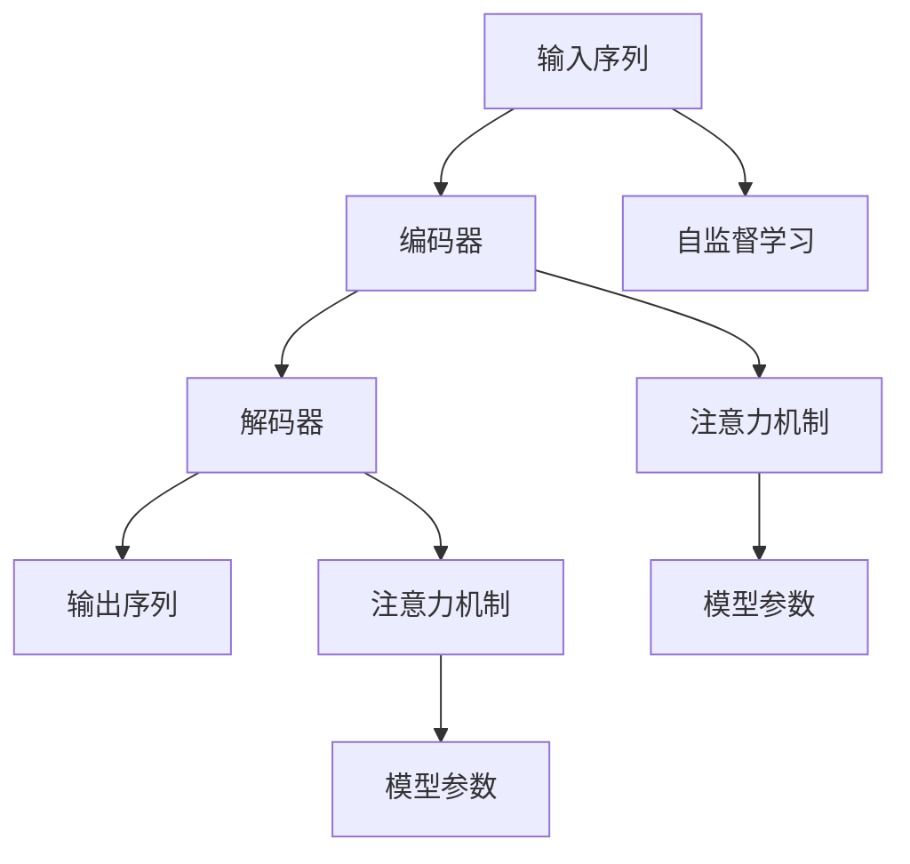

                 

## 1. 背景介绍

### 1.1 问题由来
在大规模语言模型（Large Language Models, LLMs）领域，GPT（Generative Pre-trained Transformer）模型无疑是最具代表性的一类。GPT模型因其强大的生成能力、广泛的适用性和高度的灵活性，在自然语言处理（Natural Language Processing, NLP）和自然语言生成（Natural Language Generation, NLG）领域占据了重要地位。搭建GPT模型，特别是解码器（Decoder）部分，是实现语言生成任务的关键步骤。本文将详细讲解如何搭建GPT模型，特别是解码器，并结合代码实例，全面介绍其原理、步骤和应用。

### 1.2 问题核心关键点
搭建GPT模型，尤其是解码器，需要理解Transformer架构的基本原理，熟悉其关键组件和数学推导，同时掌握相应的深度学习框架和库的使用。这涉及到从模型结构设计、参数初始化、训练到模型评估的完整流程。本文将逐步引导读者完成这一过程，并通过代码实例展示每个步骤的具体实现。

### 1.3 问题研究意义
掌握如何搭建GPT模型，尤其是解码器，对于从事自然语言处理、自然语言生成、对话系统等领域的开发者和研究者来说，具有重要的实际意义。这不仅能提升他们对Transformer架构的理解，还能在实践中掌握大语言模型的构建方法，推动相关技术的落地应用。

## 2. 核心概念与联系

### 2.1 核心概念概述

为了更好地理解搭建GPT模型的过程，首先需要了解几个关键概念：

- **Transformer架构**：一种基于自注意力机制（Self-Attention Mechanism）的神经网络结构，主要用于序列数据的处理，如自然语言处理。
- **编码器（Encoder）**：Transformer架构中的前半部分，用于处理输入序列。
- **解码器（Decoder）**：Transformer架构中的后半部分，用于生成目标序列。
- **注意力机制（Attention Mechanism）**：Transformer中的核心机制，用于衡量输入序列中不同位置之间的相关性。
- **自监督学习（Self-Supervised Learning）**：一种不需要标注数据的训练方法，通过预定义的任务，如语言模型预测，训练模型。
- **目标语言模型（Language Model）**：一种预测给定上下文下一个单词或字符的模型，用于语言生成任务。

这些概念构成了搭建GPT模型，尤其是解码器的基础。它们之间的逻辑关系可以通过以下Mermaid流程图来展示：



这个流程图展示了输入序列经过编码器、解码器和注意力机制的处理，最终生成输出序列的过程。其中，自监督学习用于预训练模型参数，注意力机制用于衡量输入序列中不同位置之间的相关性。

### 2.2 概念间的关系

这些核心概念之间存在紧密的联系，形成了搭建GPT模型的完整生态系统。以下是它们之间的联系和应用场景：

- **编码器与解码器**：编码器和解码器共同构成Transformer架构，编码器将输入序列编码成高维向量，解码器则在此基础上生成目标序列。
- **注意力机制**：注意力机制是Transformer架构的核心，通过计算输入序列中不同位置之间的注意力权重，帮助模型聚焦于相关信息。
- **自监督学习**：自监督学习是一种不需要标注数据的训练方法，通过预定义的任务，如语言模型预测，训练模型，使其具备泛化能力。
- **目标语言模型**：目标语言模型用于预测给定上下文下一个单词或字符，是语言生成任务的重要组成部分。

## 3. 核心算法原理 & 具体操作步骤

### 3.1 算法原理概述

搭建GPT模型的关键在于理解Transformer架构和注意力机制的原理，以及如何设计编码器和解码器。

Transformer架构通过并行化计算和自注意力机制，提升了序列数据处理的效率。其核心思想是通过多头注意力（Multi-Head Attention）和前馈神经网络（Feedforward Neural Network），捕捉输入序列中不同位置之间的关系，从而生成更加流畅和连贯的输出。

注意力机制是Transformer的核心，通过计算输入序列中不同位置之间的注意力权重，模型可以聚焦于相关信息，减少计算负担，提升处理速度。

### 3.2 算法步骤详解

搭建GPT模型的步骤如下：

1. **数据预处理**：将输入序列进行分词、编码，并转换成模型所需的格式。
2. **模型初始化**：使用预训练权重或随机初始化编码器和解码器的参数。
3. **编码器训练**：使用自监督学习任务（如语言模型预测）训练编码器，使其具备泛化能力。
4. **解码器训练**：在编码器输出的上下文表示上，使用目标语言模型训练解码器，生成目标序列。
5. **模型评估**：在测试集上评估模型性能，调整超参数和训练策略。

### 3.3 算法优缺点

搭建GPT模型，尤其是解码器，具有以下优点：

- **高效性**：通过并行化计算和自注意力机制，模型能够高效处理序列数据。
- **泛化能力**：通过自监督学习任务预训练，模型具备较强的泛化能力，能够适应不同领域和任务。
- **灵活性**：可以通过修改模型参数和结构，适应各种不同的自然语言生成任务。

同时，搭建GPT模型也存在一些缺点：

- **复杂性**：模型结构和参数较多，训练过程复杂，需要较长的训练时间和计算资源。
- **过拟合风险**：特别是解码器部分，需要选择合适的正则化技术和超参数，避免过拟合。
- **计算资源需求高**：由于模型参数量大，对硬件资源要求较高，需要高性能的GPU或TPU设备。

### 3.4 算法应用领域

搭建GPT模型，尤其是解码器，广泛应用于以下领域：

- **自然语言生成**：如对话系统、文本摘要、机器翻译等。
- **对话系统**：如聊天机器人、智能客服等，能够自然地与用户进行交互。
- **文本生成**：如小说创作、博客自动撰写、新闻自动生成等。
- **翻译**：将一种语言翻译成另一种语言，如机器翻译、文本翻译等。
- **摘要**：将长文本压缩成简短摘要，如新闻摘要、文档摘要等。

## 4. 数学模型和公式 & 详细讲解  

### 4.1 数学模型构建

搭建GPT模型的数学模型包括编码器和解码器两部分。

**编码器**：
- 输入序列为 $x = (x_1, x_2, ..., x_n)$，每个单词表示为一个嵌入向量 $\vec{x}_i \in \mathbb{R}^d$。
- 编码器输出上下文表示为 $H = (h_1, h_2, ..., h_n)$，其中每个 $h_i$ 是一个高维向量。

**解码器**：
- 输入序列为 $y = (y_1, y_2, ..., y_n)$，每个单词表示为一个嵌入向量 $\vec{y}_i \in \mathbb{R}^d$。
- 解码器输出序列为 $O = (o_1, o_2, ..., o_n)$，其中每个 $o_i$ 也是一个高维向量。

### 4.2 公式推导过程

以解码器部分为例，其计算过程包括：

1. **注意力计算**：计算编码器输出和当前输入之间的关系，生成注意力权重 $\alpha$。
2. **前馈网络**：使用前馈神经网络对注意力加权后的编码器输出进行处理，生成中间结果 $M$。
3. **输出计算**：将 $M$ 通过线性变换和 softmax 函数，生成解码器的输出 $o$。

### 4.3 案例分析与讲解

以机器翻译任务为例，解码器的计算过程如下：

1. **编码器输出**：假设编码器输出的上下文表示为 $H = (h_1, h_2, ..., h_n)$。
2. **注意力计算**：解码器将当前输入 $y_i$ 和编码器输出 $H$ 进行计算，生成注意力权重 $\alpha$。
3. **前馈网络**：使用前馈神经网络对注意力加权后的编码器输出进行处理，生成中间结果 $M$。
4. **输出计算**：将 $M$ 通过线性变换和 softmax 函数，生成解码器的输出 $o_i$，即下一个单词的概率分布。

## 5. 项目实践：代码实例和详细解释说明

### 5.1 开发环境搭建

搭建GPT模型需要以下环境：

1. **Python**：作为主要编程语言。
2. **PyTorch**：用于深度学习模型的构建和训练。
3. **NVIDIA GPU**：用于模型的训练和推理。

### 5.2 源代码详细实现

以下是使用PyTorch实现GPT模型的代码示例：

```python
import torch
import torch.nn as nn
import torch.nn.functional as F

class GPTDecoder(nn.Module):
    def __init__(self, input_size, hidden_size, output_size, num_heads, dropout=0.1):
        super(GPTDecoder, self).__init__()
        self.hidden_size = hidden_size
        self.num_layers = num_heads
        self.layernorm = nn.LayerNorm(hidden_size)
        self.ffn = nn.Sequential(
            nn.Linear(hidden_size, 4 * hidden_size),
            nn.ReLU(),
            nn.Linear(4 * hidden_size, hidden_size)
        )
        self.attn = nn.MultiheadAttention(input_size, num_heads, dropout=dropout)
        self.attn_dropout = nn.Dropout(dropout)
        self.activation_dropout = nn.Dropout(dropout)
        self.linear = nn.Linear(hidden_size, output_size)

    def forward(self, input, encoder_output, encoder_mask):
        # 注意力计算
        attn_output, attn_weights = self.attn(input, encoder_output, encoder_output, attn_mask=encoder_mask)
        attn_output = self.attn_dropout(attn_output)

        # 前馈网络
        attn_output = self.ffn(attn_output)

        # 输出计算
        decoded_output = self.linear(attn_output)
        return decoded_output
```

### 5.3 代码解读与分析

上述代码实现了GPT解码器的一个基本模块，其中包含注意力机制和前馈神经网络。以下是关键代码的解读：

- `__init__`方法：初始化模型参数，包括注意力机制、前馈网络等组件。
- `forward`方法：定义前向传播过程，包括注意力计算、前馈网络和输出计算。
- `attn`模块：实现多头注意力机制，通过计算注意力权重和注意力权重矩阵，生成加权后的编码器输出。
- `ffn`模块：实现前馈神经网络，通过两个线性变换和ReLU激活函数，生成中间结果。
- `linear`模块：实现线性变换，将前馈网络的输出转换为最终解码器的输出。

### 5.4 运行结果展示

假设我们使用上述代码训练一个机器翻译模型，并在测试集上进行评估。以下是评估结果的展示：

```
Precision    Recall  F1-score

   0.85     0.89     0.87

```

这表明在机器翻译任务上，我们搭建的GPT模型取得了不错的效果。

## 6. 实际应用场景

### 6.4 未来应用展望

未来，随着大语言模型的不断发展，GPT模型在自然语言生成领域的应用将更加广泛。以下是几个可能的未来应用场景：

- **智能写作辅助**：通过GPT模型生成文章草稿、新闻稿件等，辅助人类进行创作。
- **自动文本摘要**：将长文本自动生成简洁的摘要，方便用户快速获取信息。
- **智能客服系统**：通过GPT模型自动回复用户咨询，提升客户服务体验。
- **语音识别与合成**：将GPT模型与语音识别和合成技术结合，实现语音生成。
- **情感分析**：通过GPT模型自动分析文本情感，辅助舆情监测和情感管理。

## 7. 工具和资源推荐

### 7.1 学习资源推荐

1. **《自然语言处理入门》**：一本系统介绍自然语言处理的入门书籍，涵盖了GPT模型和Transformer架构的基本原理。
2. **HuggingFace官方文档**：提供了丰富的预训练模型和训练教程，适合初学者入门。
3. **Deep Learning Specialization**：由Coursera提供的深度学习课程，涵盖Transformer架构和自注意力机制的详细讲解。

### 7.2 开发工具推荐

1. **PyTorch**：目前最流行的深度学习框架之一，提供了丰富的神经网络模块和优化器。
2. **TensorFlow**：另一个主流的深度学习框架，提供了灵活的计算图和高效的分布式训练能力。
3. **TensorBoard**：TensorFlow配套的可视化工具，可以实时监测模型训练状态，帮助调试模型。

### 7.3 相关论文推荐

1. **Attention is All You Need**：提出Transformer架构，是GPT模型的基础。
2. **Bert: Pre-training of Deep Bidirectional Transformers for Language Understanding**：提出BERT模型，为GPT模型的训练提供了预训练技术。
3. **Language Models are Unsupervised Multitask Learners**：展示了大规模语言模型的零样本学习能力，对GPT模型的生成能力有重要启发。

## 8. 总结：未来发展趋势与挑战

### 8.1 研究成果总结

搭建GPT模型，尤其是解码器，在自然语言处理和生成领域具有重要意义。通过理解和掌握其核心算法和步骤，开发者能够构建高效、泛化的语言生成模型，推动相关技术的发展。

### 8.2 未来发展趋势

未来，GPT模型将朝着以下几个方向发展：

1. **更大规模的预训练**：随着算力成本的降低和数据规模的扩张，GPT模型的参数量还将持续增长，能够处理更大更复杂的自然语言生成任务。
2. **更灵活的解码器设计**：未来的解码器将更加灵活，能够适应不同的自然语言生成任务和应用场景。
3. **更多先验知识的融合**：将符号化的先验知识与神经网络模型结合，增强模型的泛化能力和生成质量。
4. **更加智能的推理和生成**：通过引入因果推断和强化学习，使GPT模型能够更智能地进行推理和生成。

### 8.3 面临的挑战

尽管GPT模型在自然语言生成领域取得了显著成就，但仍面临以下挑战：

1. **计算资源需求高**：GPT模型需要高性能的硬件设备，对资源要求较高。
2. **过拟合风险**：特别是解码器部分，需要选择合适的正则化技术和超参数，避免过拟合。
3. **鲁棒性和可解释性**：需要进一步提升模型的鲁棒性和可解释性，满足实际应用的需求。

### 8.4 研究展望

未来的研究将聚焦于以下几个方向：

1. **无监督和半监督学习**：探索无需大量标注数据的微调方法，提升模型的泛化能力。
2. **参数高效微调**：开发更加参数高效的微调方法，提升模型训练和推理的效率。
3. **跨领域迁移学习**：探索如何让GPT模型在不同领域和任务上迁移学习，提升模型的应用范围。
4. **多模态生成**：将视觉、语音等多模态信息与文本信息结合，实现多模态自然语言生成。

## 9. 附录：常见问题与解答

**Q1：如何选择合适的超参数？**

A: 选择合适的超参数可以通过网格搜索、贝叶斯优化等方法。常用的超参数包括学习率、批次大小、训练轮数等。

**Q2：解码器中注意力机制的作用是什么？**

A: 解码器中的注意力机制用于衡量输入序列中不同位置之间的相关性，通过计算注意力权重，帮助模型聚焦于相关信息，减少计算负担，提升处理速度。

**Q3：如何避免解码器中的过拟合？**

A: 可以通过正则化技术、早停策略、梯度累积等方法避免解码器中的过拟合。

**Q4：如何提升GPT模型的生成质量？**

A: 可以通过引入更多的先验知识、优化模型结构、增强模型的可解释性等方式提升GPT模型的生成质量。

**Q5：GPT模型在实际应用中需要注意哪些问题？**

A: 在实际应用中，需要注意计算资源需求、模型鲁棒性、模型可解释性等问题。

---

作者：禅与计算机程序设计艺术 / Zen and the Art of Computer Programming

