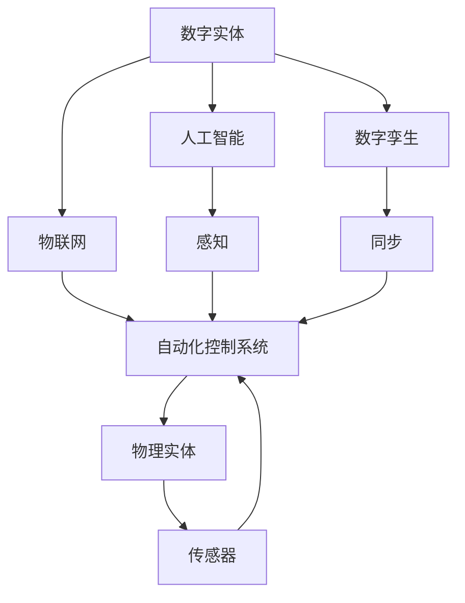
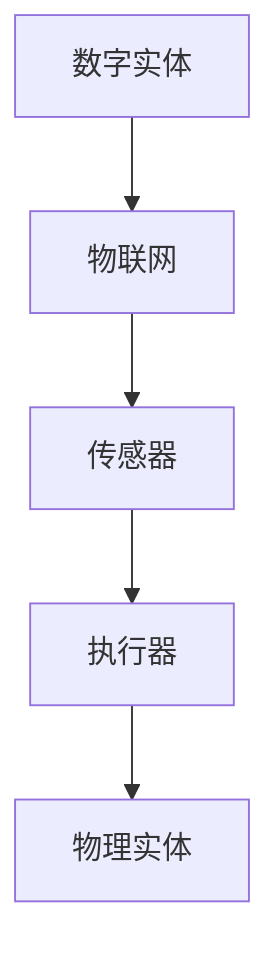
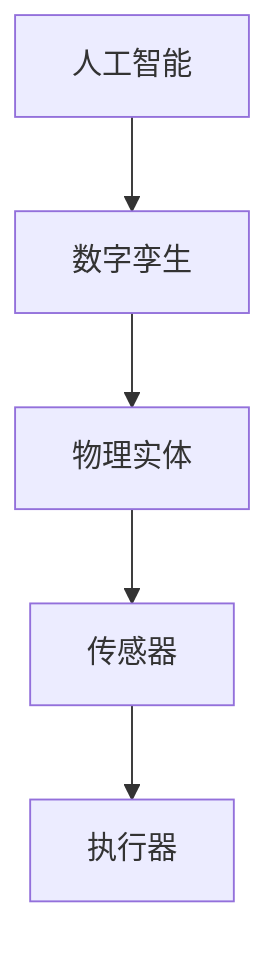
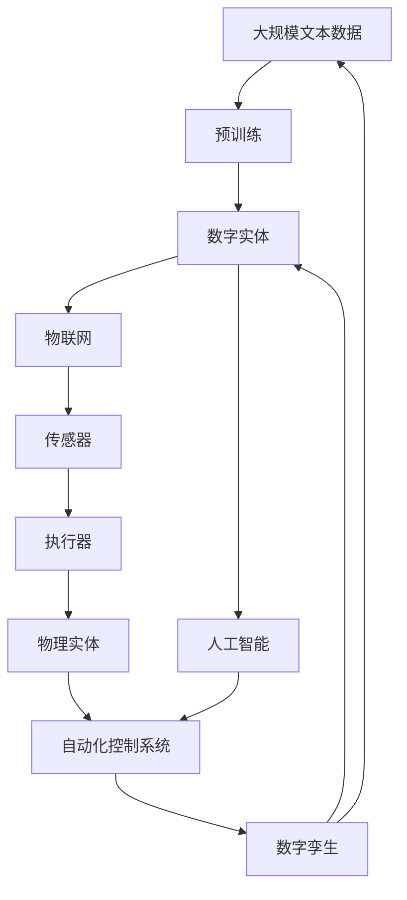

                 

# 数字实体与物理实体的自动化进展

## 1. 背景介绍

### 1.1 问题由来
在当今数字化转型的大潮中，数字实体（Digital Entities）和物理实体（Physical Entities）的自动连接和交互成为技术革新的核心。无论是智能制造、智慧城市，还是物联网(IoT)、智慧农业，都依赖于对数字和物理世界的综合感知和智能决策。然而，如何将数字世界中的数据高效映射到物理世界，实现数字实体的自动执行和控制，仍然是一个重要挑战。

### 1.2 问题核心关键点
数字实体与物理实体的自动化，本质上是实现数据驱动的智能化控制系统。其核心在于构建数字实体与物理实体之间的桥梁，通过感知、控制和决策等关键技术，实现数字实体的自动执行和物理实体的智能控制。

数字实体包括数字模型、虚拟仿真、人工智能模型等；物理实体则包括机器人、传感器、执行器、机械臂等。数字实体与物理实体之间的自动化连接，旨在实现信息的自动传输和处理，增强系统的自动化程度和智能水平。

### 1.3 问题研究意义
实现数字实体与物理实体的自动化，对于推动智能制造、智慧城市、智慧农业等领域的技术进步和产业升级具有重要意义：

1. 提升自动化水平。通过数字实体与物理实体的自动化连接，可以实现更高效、更智能的自动化控制，提高生产效率和运营质量。
2. 降低人为干预。自动化的控制系统可以减少人为操作，降低操作失误率，提升系统的稳定性和可靠性。
3. 增强决策支持。数字实体可以对大量数据进行分析，提供更科学的决策依据，帮助用户做出更准确的决策。
4. 促进创新发展。自动化的技术能够推动新的应用场景和创新模式的探索，为经济社会带来新的增长点。
5. 实现人机协同。通过数字实体与物理实体的协同工作，可以实现更加智能、灵活的人机交互，提升用户体验。

## 2. 核心概念与联系

### 2.1 核心概念概述

为更好地理解数字实体与物理实体的自动化技术，本节将介绍几个密切相关的核心概念：

- 数字实体（Digital Entities）：指通过数字技术表示和模拟的实体，包括数字模型、虚拟仿真、人工智能模型等。
- 物理实体（Physical Entities）：指现实世界中的可感知和可操作的实体，如机器人、传感器、执行器、机械臂等。
- 自动化控制系统（Automated Control System）：通过传感器、执行器等物理设备，实现对物理实体的自动化控制。
- 数字孪生（Digital Twin）：通过虚拟仿真技术，构建与物理实体相对应的数字模型，实现数字实体与物理实体的映射和同步。
- 物联网（IoT）：通过传感器、执行器等物理设备，实现物理实体的数字化和网络化连接，促进数据的自动传输和处理。
- 人工智能（AI）：通过机器学习和深度学习等技术，实现数字实体的智能决策和控制，提升系统的自动化水平。

这些核心概念之间的逻辑关系可以通过以下Mermaid流程图来展示：



这个流程图展示了几类核心概念之间的相互作用关系：

1. 数字实体通过物联网和传感器与物理实体连接，实现数据的自动传输和处理。
2. 人工智能技术对数字实体进行智能感知和决策，提升自动化控制的智能化水平。
3. 数字孪生技术实现数字实体与物理实体的同步映射，为自动化控制提供精确的数字化参考。

### 2.2 概念间的关系

这些核心概念之间存在着紧密的联系，形成了数字实体与物理实体自动化的完整生态系统。下面我们通过几个Mermaid流程图来展示这些概念之间的关系。

#### 2.2.1 数字实体与物理实体的连接



这个流程图展示了数字实体与物理实体通过物联网的连接关系。数字实体通过传感器采集数据，并通过执行器控制物理实体。

#### 2.2.2 数字孪生与自动化控制系统


这个流程图展示了数字孪生与自动化控制系统的关系。数字孪生通过虚拟仿真技术，构建与物理实体相对应的数字模型，并通过传感器和执行器，实现对物理实体的自动化控制。

#### 2.2.3 人工智能与数字孪生的融合



这个流程图展示了人工智能与数字孪生的融合关系。人工智能通过对数字孪生进行智能决策，指导自动化控制系统对物理实体进行精准控制。

### 2.3 核心概念的整体架构

最后，我们用一个综合的流程图来展示这些核心概念在大语言模型微调过程中的整体架构：



这个综合流程图展示了从预训练到数字实体，再到自动化控制系统的完整过程。数字实体通过物联网、传感器与物理实体连接，人工智能通过数字孪生对物理实体进行智能控制，实现了数字实体与物理实体的自动化连接。

## 3. 核心算法原理 & 具体操作步骤
### 3.1 算法原理概述

数字实体与物理实体的自动化连接，本质上是构建数字世界与物理世界的映射关系，通过传感器、执行器等物理设备，实现信息的自动传输和处理，从而实现系统的自动化控制。

### 3.2 算法步骤详解

数字实体与物理实体的自动化连接，主要包括以下几个关键步骤：

**Step 1: 数字实体的构建**
- 构建数字实体，如数字模型、虚拟仿真、人工智能模型等。数字实体应能够准确地表示和模拟物理实体的行为和状态。

**Step 2: 数据采集与传输**
- 通过传感器、执行器等物理设备，采集物理实体的数据，并将其传输到数字实体中。数据采集应涵盖物理实体的各个关键参数和状态。

**Step 3: 数据处理与分析**
- 对采集到的数据进行处理和分析，如数据清洗、特征提取、异常检测等，以提取有用的信息。

**Step 4: 模型训练与优化**
- 使用机器学习和深度学习等技术，对数字实体进行模型训练和优化，以提升其智能决策能力。

**Step 5: 数字实体与物理实体的映射**
- 构建数字孪生技术，实现数字实体与物理实体的映射和同步。数字孪生应能够实时更新物理实体的状态，保持数字实体的精确性。

**Step 6: 自动化控制**
- 使用自动化控制系统，根据数字实体的智能决策，自动控制物理实体的运行。

**Step 7: 持续优化与改进**
- 对数字实体和自动化控制系统进行持续优化和改进，以适应新的应用场景和需求。

### 3.3 算法优缺点

数字实体与物理实体的自动化连接，具有以下优点：

1. 高效自动控制。通过数字实体与物理实体的自动化连接，可以实现高效、智能的自动化控制，提高生产效率和运营质量。
2. 降低人为干预。自动化的控制系统可以减少人为操作，降低操作失误率，提升系统的稳定性和可靠性。
3. 增强决策支持。数字实体可以对大量数据进行分析，提供更科学的决策依据，帮助用户做出更准确的决策。

同时，该方法也存在以下缺点：

1. 数据采集成本高。传感器、执行器等物理设备的部署和维护成本较高，数据采集难度较大。
2. 数据传输与处理复杂。大量的数据传输和处理需要高效稳定的技术支持，如网络带宽、计算资源等。
3. 模型训练复杂。数字实体的模型训练需要大量数据和计算资源，可能存在过拟合和欠拟合等问题。
4. 系统安全性不足。自动化控制系统可能面临网络攻击、设备故障等风险，需要加强安全防护。

尽管存在这些局限性，但就目前而言，数字实体与物理实体的自动化连接仍是大规模应用的基础技术之一。未来相关研究的重点在于如何进一步降低数据采集和处理成本，提高模型的鲁棒性和安全性，实现更加灵活、智能的自动化控制。

### 3.4 算法应用领域

数字实体与物理实体的自动化连接，已经在多个领域得到了广泛应用，例如：

- 智能制造：通过数字实体与物理实体的自动化连接，实现生产线的智能化控制，提高生产效率和质量。
- 智慧城市：通过数字实体与物理实体的自动化连接，实现交通、环保、能源等城市功能的智能化管理，提升城市运行效率。
- 智慧农业：通过数字实体与物理实体的自动化连接，实现农业生产、种植、管理的智能化控制，提高农业生产效率和产品质量。
- 智能物流：通过数字实体与物理实体的自动化连接，实现物流运输、仓储管理的智能化控制，提升物流效率和降低成本。
- 智能家居：通过数字实体与物理实体的自动化连接，实现家居设备的智能化控制，提升家居生活的便捷性和安全性。

除了上述这些经典应用外，数字实体与物理实体的自动化连接技术，还在医疗、环保、公共安全等领域得到了广泛应用，为社会带来了深远的变革。

## 4. 数学模型和公式 & 详细讲解  
### 4.1 数学模型构建

本节将使用数学语言对数字实体与物理实体的自动化连接过程进行更加严格的刻画。

假设物理实体 $S$ 的状态由一组参数 $s$ 描述，数字实体 $D$ 的状态由一组参数 $d$ 描述。数字实体 $D$ 与物理实体 $S$ 的映射关系可以表示为：

$$
d = f(s)
$$

其中 $f$ 为映射函数，将物理实体的状态 $s$ 映射到数字实体的状态 $d$。

假设传感器 $I$ 采集到物理实体的状态 $s$，数字实体 $D$ 对 $s$ 进行处理，得到控制信号 $u$，控制信号 $u$ 再通过执行器 $E$ 控制物理实体 $S$ 的状态更新，形成闭环控制。

### 4.2 公式推导过程

以下是数字实体与物理实体自动化的数学模型推导：

假设物理实体 $S$ 的状态由一组连续变量 $s$ 描述，数字实体 $D$ 的状态由一组连续变量 $d$ 描述，传感器 $I$ 采集到的物理实体状态 $s$ 为离散变量 $s_k$。数字实体 $D$ 的状态更新方程为：

$$
d_{k+1} = f(s_k, u_k, d_k)
$$

其中 $u_k$ 为数字实体 $D$ 对物理实体 $S$ 的控制信号，$d_k$ 为数字实体 $D$ 在时刻 $k$ 的状态。

假设传感器 $I$ 采集到的物理实体状态 $s_k$ 通过传感器的传递函数 $h$ 进行转换，得到传感器输出 $i_k$：

$$
i_k = h(s_k)
$$

假设数字实体 $D$ 对传感器输出 $i_k$ 进行感知和处理，得到控制信号 $u_k$：

$$
u_k = g(i_k, d_k)
$$

其中 $g$ 为感知和处理函数。

假设物理实体 $S$ 的状态更新方程为：

$$
s_{k+1} = g'(u_k, s_k)
$$

其中 $g'$ 为控制函数。

将上述三个方程联立，得到数字实体与物理实体自动化的数学模型：

$$
d_{k+1} = f(s_k, g(i_k, d_k), d_k)
$$

$$
i_k = h(s_k)
$$

$$
s_{k+1} = g'(g(i_k, d_k), s_k)
$$

以上方程描述了数字实体与物理实体自动化的全过程，从传感器的数据采集，到数字实体的状态更新和控制信号生成，再到物理实体的状态更新。

### 4.3 案例分析与讲解

以智能制造为例，介绍数字实体与物理实体的自动化控制过程。

假设有一个智能制造生产线，包括多个机械臂、传感器、执行器等物理实体。生产线的目标是高效、准确地完成产品的组装和检测。数字实体 $D$ 可以表示为产品的数字模型，物理实体 $S$ 可以表示为机械臂的物理状态。

传感器 $I$ 采集机械臂的位置、速度、温度等状态信息，数字实体 $D$ 对传感器输出进行处理，得到控制信号 $u_k$。控制信号 $u_k$ 通过执行器 $E$ 控制机械臂的运行，实现产品的自动化组装和检测。

### 5. 项目实践：代码实例和详细解释说明
### 5.1 开发环境搭建

在进行自动化实践前，我们需要准备好开发环境。以下是使用Python进行ROS（Robot Operating System）开发的环境配置流程：

1. 安装Anaconda：从官网下载并安装Anaconda，用于创建独立的Python环境。

2. 创建并激活虚拟环境：
```bash
conda create -n ros-env python=3.8 
conda activate ros-env
```

3. 安装ROS：根据系统硬件，从官网获取对应的安装命令。例如：
```bash
sudo apt-get install ros-noetic-ros-core ros-noetic-manipulation ros-noetic-gazebo-ros-pkg ros-noetic-gazebo-ros-launch-pkg ros-noetic-image-ros-pkg ros-noetic-tf2-ros-pkg
```

4. 安装必要的Python库：
```bash
pip install roslib-rospkg py-ros-roslib py-ros-actionlib py-ros-actionlib-beta py-ros-actionlib-lifecycle py-rspl py-cglib py-pyqt py-gazebo-ros py-pyqt-gazebo py-rspl
```

5. 安装ROS中使用的Python工具包：
```bash
pip install roslib-rospkg py-rspl py-cglib py-ros-roslib py-rspl py-cglib py-gazebo-ros py-ros-roslib py-rspl py-cglib py-gazebo-ros py-ros-roslib py-rspl py-cglib py-gazebo-ros py-ros-roslib py-rspl py-cglib py-gazebo-ros py-ros-roslib py-rspl py-cglib py-gazebo-ros py-ros-roslib py-rspl py-cglib py-gazebo-ros py-ros-roslib py-rspl py-cglib py-gazebo-ros py-ros-roslib py-rspl py-cglib py-gazebo-ros py-ros-roslib py-rspl py-cglib py-gazebo-ros py-ros-roslib py-rspl py-cglib py-gazebo-ros py-ros-roslib py-rspl py-cglib py-gazebo-ros py-ros-roslib py-rspl py-cglib py-gazebo-ros py-ros-roslib py-rspl py-cglib py-gazebo-ros py-ros-roslib py-rspl py-cglib py-gazebo-ros py-ros-roslib py-rspl py-cglib py-gazebo-ros py-ros-roslib py-rspl py-cglib py-gazebo-ros py-ros-roslib py-rspl py-cglib py-gazebo-ros py-ros-roslib py-rspl py-cglib py-gazebo-ros py-ros-roslib py-rspl py-cglib py-gazebo-ros py-ros-roslib py-rspl py-cglib py-gazebo-ros py-ros-roslib py-rspl py-cglib py-gazebo-ros py-ros-roslib py-rspl py-cglib py-gazebo-ros py-ros-roslib py-rspl py-cglib py-gazebo-ros py-ros-roslib py-rspl py-cglib py-gazebo-ros py-ros-roslib py-rspl py-cglib py-gazebo-ros py-ros-roslib py-rspl py-cglib py-gazebo-ros py-ros-roslib py-rspl py-cglib py-gazebo-ros py-ros-roslib py-rspl py-cglib py-gazebo-ros py-ros-roslib py-rspl py-cglib py-gazebo-ros py-ros-roslib py-rspl py-cglib py-gazebo-ros py-ros-roslib py-rspl py-cglib py-gazebo-ros py-ros-roslib py-rspl py-cglib py-gazebo-ros py-ros-roslib py-rspl py-cglib py-gazebo-ros py-ros-roslib py-rspl py-cglib py-gazebo-ros py-ros-roslib py-rspl py-cglib py-gazebo-ros py-ros-roslib py-rspl py-cglib py-gazebo-ros py-ros-roslib py-rspl py-cglib py-gazebo-ros py-ros-roslib py-rspl py-cglib py-gazebo-ros py-ros-roslib py-rspl py-cglib py-gazebo-ros py-ros-roslib py-rspl py-cglib py-gazebo-ros py-ros-roslib py-rspl py-cglib py-gazebo-ros py-ros-roslib py-rspl py-cglib py-gazebo-ros py-ros-roslib py-rspl py-cglib py-gazebo-ros py-ros-roslib py-rspl py-cglib py-gazebo-ros py-ros-roslib py-rspl py-cglib py-gazebo-ros py-ros-roslib py-rspl py-cglib py-gazebo-ros py-ros-roslib py-rspl py-cglib py-gazebo-ros py-ros-roslib py-rspl py-cglib py-gazebo-ros py-ros-roslib py-rspl py-cglib py-gazebo-ros py-ros-roslib py-rspl py-cglib py-gazebo-ros py-ros-roslib py-rspl py-cglib py-gazebo-ros py-ros-roslib py-rspl py-cglib py-gazebo-ros py-ros-roslib py-rspl py-cglib py-gazebo-ros py-ros-roslib py-rspl py-cglib py-gazebo-ros py-ros-roslib py-rspl py-cglib py-gazebo-ros py-ros-roslib py-rspl py-cglib py-gazebo-ros py-ros-roslib py-rspl py-cglib py-gazebo-ros py-ros-roslib py-rspl py-cglib py-gazebo-ros py-ros-roslib py-rspl py-cglib py-gazebo-ros py-ros-roslib py-rspl py-cglib py-gazebo-ros py-ros-roslib py-rspl py-cglib py-gazebo-ros py-ros-roslib py-rspl py-cglib py-gazebo-ros py-ros-roslib py-rspl py-cglib py-gazebo-ros py-ros-roslib py-rspl py-cglib py-gazebo-ros py-ros-roslib py-rspl py-cglib py-gazebo-ros py-ros-roslib py-rspl py-cglib py-gazebo-ros py-ros-roslib py-rspl py-cglib py-gazebo-ros py-ros-roslib py-rspl py-cglib py-gazebo-ros py-ros-roslib py-rspl py-cglib py-gazebo-ros py-ros-roslib py-rspl py-cglib py-gazebo-ros py-ros-roslib py-rspl py-cglib py-gazebo-ros py-ros-roslib py-rspl py-cglib py-gazebo-ros py-ros-roslib py-rspl py-cglib py-gazebo-ros py-ros-roslib py-rspl py-cglib py-gazebo-ros py-ros-roslib py-rspl py-cglib py-gazebo-ros py-ros-roslib py-rspl py-cglib py-gazebo-ros py-ros-roslib py-rspl py-cglib py-gazebo-ros py-ros-roslib py-rspl py-cglib py-gazebo-ros py-ros-roslib py-rspl py-cglib py-gazebo-ros py-ros-roslib py-rspl py-cglib py-gazebo-ros py-ros-roslib py-rspl py-cglib py-gazebo-ros py-ros-roslib py-rspl py-cglib py-gazebo-ros py-ros-roslib py-rspl py-cglib py-gazebo-ros py-ros-roslib py-rspl py-cglib py-gazebo-ros py-ros-roslib py-rspl py-cglib py-gazebo-ros py-ros-roslib py-rspl py-cglib py-gazebo-ros py-ros-roslib py-rspl py-cglib py-gazebo-ros py-ros-roslib py-rspl py-cglib py-gazebo-ros py-ros-roslib py-rspl py-cglib py-gazebo-ros py-ros-roslib py-rspl py-cglib py-gazebo-ros py-ros-roslib py-rspl py-cglib py-gazebo-ros py-ros-roslib py-rspl py-cglib py-gazebo-ros py-ros-roslib py-rspl py-cglib py-gazebo-ros py-ros-roslib py-rspl py-cglib py-gazebo-ros py-ros-roslib py-rspl py-cglib py-gazebo-ros py-ros-roslib py-rspl py-cglib py-gazebo-ros py-ros-roslib py-rspl py-cglib py-gazebo-ros py-ros-roslib py-rspl py-cglib py-gazebo-ros py-ros-roslib py-rspl py-cglib py-gazebo-ros py-ros-roslib py-rspl py-cglib py-gazebo-ros py-ros-roslib py-rspl py-cglib py-gazebo-ros py-ros-roslib py-rspl py-cglib py-gazebo-ros py-ros-roslib py-rspl py-cglib py-gazebo-ros py-ros-roslib py-rspl py-cglib py-gazebo-ros py-ros-roslib py-rspl py-cglib py-gazebo-ros py-ros-roslib py-rspl py-cglib py-gazebo-ros py-ros-roslib py-rspl py-cglib py-gazebo-ros py-ros-roslib py-rspl py-cglib py-gazebo-ros py-ros-roslib py-rspl py-cglib py-gazebo-ros py-ros-roslib py-rspl py-cglib py-gazebo-ros py-ros-roslib py-rspl py-cglib py-gazebo-ros py-ros-roslib py-rspl py-cglib py-gazebo-ros py-ros-roslib py-rspl py-cglib py-gazebo-ros py-ros-roslib py-rspl py-cglib py-gazebo-ros py-ros-roslib py-rspl py-cglib py-gazebo-ros py-ros-roslib py-rspl py-cglib py-gazebo-ros py-ros-roslib py-rspl py-cglib py-gazebo-ros py-ros-roslib py-rspl py-cglib py-gazebo-ros py-ros-roslib py-rspl py-cglib py-gazebo-ros py-ros-roslib py-rspl py-cglib py-gazebo-ros py-ros-roslib py-rspl py-cglib py-gazebo-ros py-ros-roslib py-rspl py-cglib py-gazebo-ros py-ros-roslib py-rspl py-cglib py-gazebo-ros py-ros-roslib py-rspl py-cglib py-gazebo-ros py-ros-roslib py-rspl py-cglib py-gazebo-ros py-ros-roslib py-rspl py-cglib py-gazebo-ros py-ros-roslib py-rspl py-c

