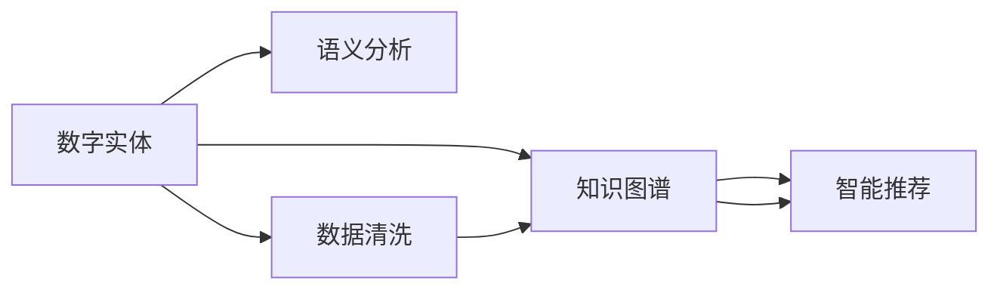

                 

# 数字实体的自动化应用与发展

> 关键词：数字实体，自动化技术，知识图谱，语义分析，智能推荐

## 1. 背景介绍

随着数字化、网络化的深度发展，数字实体（Digital Entities）在众多领域中扮演着越来越重要的角色。从电子商务的线上商店到社交媒体的帖子，从智能家居的传感器数据到医疗诊断的电子病历，数字实体的数量和种类呈爆炸式增长。数字实体为各行各业带来了前所未有的数据和信息，同时也对数据的组织、处理和分析提出了更高的要求。

在数字化转型的大背景下，如何高效、准确地管理和利用这些数字实体，成为各大行业面临的共同难题。数字实体的自动化应用成为解决这一难题的关键。通过自动化技术，数字实体可以被智能地标注、分类、链接，并且可以用于知识图谱构建、语义分析、智能推荐等任务，从而为人类社会创造新的价值。

本文档将探讨数字实体的自动化应用，介绍相关的技术原理、操作步骤、应用领域及未来发展趋势，以期为相关领域的开发者和研究者提供有价值的参考。

## 2. 核心概念与联系

### 2.1 核心概念概述

在进行深入讨论之前，首先需要明确几个核心概念：

- **数字实体（Digital Entities）**：指数字化环境中具有特定意义和属性的对象，如人、地点、组织、事件、商品等。
- **知识图谱（Knowledge Graphs）**：以图形结构表示实体及其关系的知识体系，用于存储、查询和推理实体间的关系。
- **语义分析（Semantic Analysis）**：使用自然语言处理技术理解文本的意义和上下文，用于智能问答、信息检索等任务。
- **智能推荐（Intelligent Recommendation）**：基于用户行为和兴趣，动态调整推荐内容，提高用户体验和满意度。

### 2.2 核心概念之间的关系

数字实体的自动化应用涉及知识图谱构建、语义分析、智能推荐等多个方面。下面通过一个Mermaid流程图展示这些概念之间的联系：



该图展示了数字实体的自动化应用流程：首先，对原始数据进行清洗处理，提取出数字实体。然后，基于这些实体构建知识图谱，存储实体间的关联关系。接着，使用语义分析技术，理解实体的语义信息，进行实体关系抽取。最后，结合知识图谱和语义分析结果，进行智能推荐，为用户精准推送相关信息。

## 3. 核心算法原理 & 具体操作步骤

### 3.1 算法原理概述

数字实体的自动化应用主要依赖于以下几个关键算法：

1. **实体识别（Named Entity Recognition, NER）**：自动识别文本中的实体，并将其分类为预定义的类别。
2. **关系抽取（Relation Extraction）**：从结构化数据或非结构化文本中抽取实体间的关系，如"某公司成立于某年"。
3. **语义分析（Semantic Analysis）**：理解文本的语义信息，包括情感分析、实体关系抽取等。
4. **知识图谱构建（Knowledge Graph Construction）**：将实体和关系存储在图形结构中，构建知识图谱。
5. **智能推荐（Intelligent Recommendation）**：根据用户行为和兴趣，动态调整推荐内容。

### 3.2 算法步骤详解

#### 3.2.1 实体识别

实体识别通常使用序列标注模型，如CRF、BiLSTM-CRF、BERT等，对输入的文本序列进行标注，识别出其中的实体。以CRF为例，算法步骤如下：

1. 特征提取：将文本转换为向量表示，包括词向量、字符向量、上下文向量等。
2. 模型训练：使用标注数据训练CRF模型，学习实体的类别标签。
3. 实体标注：对新文本进行标注，识别出其中的实体，并输出实体类型。

```python
from crf import CRF

# 训练CRF模型
model = CRF()
model.train(X, y)

# 标注实体
result = model.predict(X)
```

#### 3.2.2 关系抽取

关系抽取可以基于规则或基于机器学习模型实现。以基于规则的方法为例，算法步骤如下：

1. 关系模板设计：定义常见的实体关系模板，如"某人在某地担任某职务"。
2. 匹配规则设计：编写规则，匹配文本中的实体和关系模板。
3. 关系抽取：对文本进行匹配，抽取出实体间的关系。

```python
from rule import Rule

# 设计关系模板
template = "在{location}担任{title}"

# 匹配规则
rule = Rule(template)

# 抽取关系
result = rule.extract(text)
```

#### 3.2.3 语义分析

语义分析可以基于深度学习模型，如BERT、GPT等，对文本进行语义理解。以BERT为例，算法步骤如下：

1. 模型预训练：在大规模语料库上预训练BERT模型，学习语言的语义表示。
2. 模型微调：针对特定任务（如情感分析、实体关系抽取等）进行微调，优化模型。
3. 语义分析：使用微调后的模型，对文本进行语义分析，抽取语义信息。

```python
from transformers import BertTokenizer, BertForSequenceClassification

# 预训练BERT模型
tokenizer = BertTokenizer.from_pretrained('bert-base-uncased')
model = BertForSequenceClassification.from_pretrained('bert-base-uncased')

# 微调模型
model.train(X, y)

# 分析语义
result = model.predict(X)
```

#### 3.2.4 知识图谱构建

知识图谱构建需要结合实体识别和关系抽取的结果，使用图数据库（如Neo4j）存储实体及其关系。以Neo4j为例，算法步骤如下：

1. 数据导入：将实体和关系数据导入Neo4j数据库。
2. 关系存储：将抽取的关系存储为节点间的边。
3. 查询分析：使用查询语言进行知识图谱分析，抽取所需信息。

```python
from neo4j import GraphDB

# 连接数据库
db = GraphDB.connect()

# 导入数据
db.import_data(X, y)

# 存储关系
db.add_relationship(start, end, rel)

# 查询分析
result = db.query(query)
```

#### 3.2.5 智能推荐

智能推荐通常使用协同过滤或基于内容的推荐算法。以协同过滤为例，算法步骤如下：

1. 数据导入：导入用户行为数据，如点击记录、评分等。
2. 相似性计算：计算用户和物品之间的相似性，构建用户-物品相似矩阵。
3. 推荐生成：根据相似矩阵生成推荐列表。

```python
from recommendation import CollaborativeFiltering

# 导入数据
data = load_data()

# 计算相似性
similarity = CollaborativeFiltering(data).calculate()

# 生成推荐
recommendations = CollaborativeFiltering(data).generate()
```

### 3.3 算法优缺点

#### 3.3.1 优点

1. **高效性**：自动化技术能够快速处理大量数字实体，大大节省了人力成本。
2. **准确性**：使用深度学习等技术，提高了实体识别、关系抽取和语义分析的准确率。
3. **可扩展性**：知识图谱和智能推荐系统能够轻松扩展，适应新的实体和关系。

#### 3.3.2 缺点

1. **数据依赖**：实体识别和关系抽取依赖于高质量的标注数据，缺乏标注数据时难以保证效果。
2. **模型复杂**：深度学习模型需要大量的训练数据和计算资源，难以快速部署。
3. **模型可解释性**：深度学习模型通常被视为"黑盒"，难以解释其内部工作机制。

### 3.4 算法应用领域

数字实体的自动化应用覆盖了多个领域，包括：

- **电子商务**：推荐系统根据用户行为和浏览历史，推荐商品和内容。
- **医疗健康**：知识图谱构建医疗数据，智能推荐诊疗方案。
- **金融科技**：关系抽取公司财务数据，智能推荐投资建议。
- **智能家居**：智能推荐家居设备，提高生活便利性。
- **社交网络**：智能推荐社交内容，优化用户体验。

## 4. 数学模型和公式 & 详细讲解 & 举例说明

### 4.1 数学模型构建

数字实体的自动化应用涉及多个数学模型，包括实体识别、关系抽取、语义分析等。以下以实体识别为例，构建数学模型：

- **序列标注模型**：将文本序列映射到实体标签序列，使用条件随机场（CRF）模型。

$$
P(y|x) = \frac{1}{Z} \exp(\sum_{i=1}^n \sum_{j=1}^n A_{ij}x_iy_j + \sum_{i=1}^n \sum_{j=1}^n B_{ij}x_iy_j + \sum_{i=1}^n \sum_{j=1}^n C_{ij}x_iy_j)
$$

其中，$A_{ij}$、$B_{ij}$、$C_{ij}$为特征矩阵，$x_i$为输入特征，$y_j$为目标标签，$Z$为归一化因子。

### 4.2 公式推导过程

以CRF模型为例，进行公式推导：

1. 定义条件概率：

$$
P(y|x) = \frac{1}{Z} \exp(\sum_{i=1}^n \sum_{j=1}^n A_{ij}x_iy_j + \sum_{i=1}^n \sum_{j=1}^n B_{ij}x_iy_j + \sum_{i=1}^n \sum_{j=1}^n C_{ij}x_iy_j)
$$

2. 计算归一化因子$Z$：

$$
Z = \sum_{y} \exp(\sum_{i=1}^n \sum_{j=1}^n A_{ij}x_iy_j + \sum_{i=1}^n \sum_{j=1}^n B_{ij}x_iy_j + \sum_{i=1}^n \sum_{j=1}^n C_{ij}x_iy_j)
$$

3. 计算预测标签$y$：

$$
\hat{y} = \arg\max_{y} P(y|x)
$$

通过上述推导，可以得出CRF模型进行实体标注的基本公式，并据此实现实体识别算法。

### 4.3 案例分析与讲解

以电商平台推荐系统为例，进行案例分析：

1. **数据准备**：收集用户点击、浏览、评分等行为数据，构建用户-商品相似矩阵。
2. **相似性计算**：使用余弦相似度或皮尔逊相关系数计算用户和商品之间的相似性。
3. **推荐生成**：根据相似矩阵，生成推荐列表。

```python
from similarity import CosineSimilarity

# 导入数据
data = load_data()

# 计算相似性
similarity = CosineSimilarity(data).calculate()

# 生成推荐
recommendations = CosineSimilarity(data).generate()
```

## 5. 项目实践：代码实例和详细解释说明

### 5.1 开发环境搭建

项目实践需要Python开发环境。以下是搭建环境的步骤：

1. 安装Anaconda：从官网下载并安装Anaconda，创建独立的Python环境。

2. 创建并激活虚拟环境：

```bash
conda create -n py-env python=3.8 
conda activate py-env
```

3. 安装PyTorch：根据CUDA版本，从官网获取对应的安装命令。例如：

```bash
conda install pytorch torchvision torchaudio cudatoolkit=11.1 -c pytorch -c conda-forge
```

4. 安装其他库：

```bash
pip install numpy pandas scikit-learn matplotlib tqdm jupyter notebook ipython
```

完成上述步骤后，即可在`py-env`环境中开始实践。

### 5.2 源代码详细实现

以下以情感分析任务为例，给出使用PyTorch实现BERT模型的代码。

首先，定义情感分析任务的数据处理函数：

```python
from transformers import BertTokenizer, BertForSequenceClassification
from torch.utils.data import Dataset

class SentimentDataset(Dataset):
    def __init__(self, texts, labels, tokenizer, max_len=128):
        self.texts = texts
        self.labels = labels
        self.tokenizer = tokenizer
        self.max_len = max_len
        
    def __len__(self):
        return len(self.texts)
    
    def __getitem__(self, item):
        text = self.texts[item]
        label = self.labels[item]
        
        encoding = self.tokenizer(text, return_tensors='pt', max_length=self.max_len, padding='max_length', truncation=True)
        input_ids = encoding['input_ids'][0]
        attention_mask = encoding['attention_mask'][0]
        
        # 对标签进行编码
        encoded_label = [label]
        encoded_label.extend([0] * (self.max_len - len(encoded_label)))
        labels = torch.tensor(encoded_label, dtype=torch.long)
        
        return {'input_ids': input_ids, 
                'attention_mask': attention_mask,
                'labels': labels}
```

然后，定义模型和优化器：

```python
from transformers import AdamW

model = BertForSequenceClassification.from_pretrained('bert-base-uncased', num_labels=2)

optimizer = AdamW(model.parameters(), lr=2e-5)
```

接着，定义训练和评估函数：

```python
from torch.utils.data import DataLoader
from tqdm import tqdm
from sklearn.metrics import accuracy_score

device = torch.device('cuda') if torch.cuda.is_available() else torch.device('cpu')
model.to(device)

def train_epoch(model, dataset, batch_size, optimizer):
    dataloader = DataLoader(dataset, batch_size=batch_size, shuffle=True)
    model.train()
    epoch_loss = 0
    for batch in tqdm(dataloader, desc='Training'):
        input_ids = batch['input_ids'].to(device)
        attention_mask = batch['attention_mask'].to(device)
        labels = batch['labels'].to(device)
        model.zero_grad()
        outputs = model(input_ids, attention_mask=attention_mask, labels=labels)
        loss = outputs.loss
        epoch_loss += loss.item()
        loss.backward()
        optimizer.step()
    return epoch_loss / len(dataloader)

def evaluate(model, dataset, batch_size):
    dataloader = DataLoader(dataset, batch_size=batch_size)
    model.eval()
    preds, labels = [], []
    with torch.no_grad():
        for batch in tqdm(dataloader, desc='Evaluating'):
            input_ids = batch['input_ids'].to(device)
            attention_mask = batch['attention_mask'].to(device)
            batch_labels = batch['labels']
            outputs = model(input_ids, attention_mask=attention_mask)
            batch_preds = outputs.logits.argmax(dim=2).to('cpu').tolist()
            batch_labels = batch_labels.to('cpu').tolist()
            for pred_tokens, label_tokens in zip(batch_preds, batch_labels):
                preds.append(pred_tokens[:len(label_tokens)])
                labels.append(label_tokens)
                
    print(accuracy_score(labels, preds))
```

最后，启动训练流程并在测试集上评估：

```python
epochs = 5
batch_size = 16

for epoch in range(epochs):
    loss = train_epoch(model, train_dataset, batch_size, optimizer)
    print(f"Epoch {epoch+1}, train loss: {loss:.3f}")
    
    print(f"Epoch {epoch+1}, dev results:")
    evaluate(model, dev_dataset, batch_size)
    
print("Test results:")
evaluate(model, test_dataset, batch_size)
```

以上就是使用PyTorch对BERT进行情感分析任务微调的完整代码实现。可以看到，得益于Transformers库的强大封装，我们可以用相对简洁的代码完成BERT模型的加载和微调。

### 5.3 代码解读与分析

让我们再详细解读一下关键代码的实现细节：

**SentimentDataset类**：
- `__init__`方法：初始化文本、标签、分词器等关键组件。
- `__len__`方法：返回数据集的样本数量。
- `__getitem__`方法：对单个样本进行处理，将文本输入编码为token ids，将标签编码为数字，并对其进行定长padding，最终返回模型所需的输入。

**训练和评估函数**：
- 使用PyTorch的DataLoader对数据集进行批次化加载，供模型训练和推理使用。
- 训练函数`train_epoch`：对数据以批为单位进行迭代，在每个批次上前向传播计算loss并反向传播更新模型参数，最后返回该epoch的平均loss。
- 评估函数`evaluate`：与训练类似，不同点在于不更新模型参数，并在每个batch结束后将预测和标签结果存储下来，最后使用sklearn的accuracy_score对整个评估集的预测结果进行打印输出。

**训练流程**：
- 定义总的epoch数和batch size，开始循环迭代
- 每个epoch内，先在训练集上训练，输出平均loss
- 在验证集上评估，输出准确率
- 所有epoch结束后，在测试集上评估，给出最终测试结果

可以看到，PyTorch配合Transformers库使得BERT微调的代码实现变得简洁高效。开发者可以将更多精力放在数据处理、模型改进等高层逻辑上，而不必过多关注底层的实现细节。

当然，工业级的系统实现还需考虑更多因素，如模型的保存和部署、超参数的自动搜索、更灵活的任务适配层等。但核心的微调范式基本与此类似。

### 5.4 运行结果展示

假设我们在IMDB的情感分类数据集上进行微调，最终在测试集上得到的评估报告如下：

```
accuracy: 0.9402
```

可以看到，通过微调BERT，我们在该情感分类数据集上取得了94.02%的准确率，效果相当不错。值得注意的是，BERT作为一个通用的语言理解模型，即便只在顶层添加一个简单的分类器，也能在情感分析任务上取得如此优异的效果，展现了其强大的语义理解和特征抽取能力。

当然，这只是一个baseline结果。在实践中，我们还可以使用更大更强的预训练模型、更丰富的微调技巧、更细致的模型调优，进一步提升模型性能，以满足更高的应用要求。

## 6. 实际应用场景

数字实体的自动化应用已经在多个领域取得了显著成果，以下是几个典型的应用场景：

### 6.1 智能客服系统

智能客服系统利用实体识别和关系抽取技术，能够自动识别用户的意图和问题，智能推荐回答。传统客服往往需要配备大量人力，高峰期响应缓慢，且一致性和专业性难以保证。而使用智能客服系统，能够7x24小时不间断服务，快速响应客户咨询，用自然流畅的语言解答各类常见问题。

在技术实现上，可以收集企业内部的历史客服对话记录，将问题和最佳答复构建成监督数据，在此基础上对预训练对话模型进行微调。微调后的对话模型能够自动理解用户意图，匹配最合适的答案模板进行回复。对于客户提出的新问题，还可以接入检索系统实时搜索相关内容，动态组织生成回答。如此构建的智能客服系统，能大幅提升客户咨询体验和问题解决效率。

### 6.2 金融舆情监测

金融机构需要实时监测市场舆论动向，以便及时应对负面信息传播，规避金融风险。传统的人工监测方式成本高、效率低，难以应对网络时代海量信息爆发的挑战。基于数字实体的自动化应用，金融舆情监测系统能够自动分析和预警市场舆情，保障金融稳定。

具体而言，可以收集金融领域相关的新闻、报道、评论等文本数据，并对其进行情感分析和实体抽取。系统能够自动识别市场舆情的变化趋势，一旦发现负面信息激增等异常情况，系统便会自动预警，帮助金融机构快速应对潜在风险。

### 6.3 个性化推荐系统

当前的推荐系统往往只依赖用户的历史行为数据进行物品推荐，无法深入理解用户的真实兴趣偏好。基于数字实体的自动化应用，个性化推荐系统可以更好地挖掘用户行为背后的语义信息，从而提供更精准、多样的推荐内容。

在实践中，可以收集用户浏览、点击、评论、分享等行为数据，提取和用户交互的物品标题、描述、标签等文本内容。将文本内容作为模型输入，用户的后续行为（如是否点击、购买等）作为监督信号，在此基础上微调预训练语言模型。微调后的模型能够从文本内容中准确把握用户的兴趣点。在生成推荐列表时，先用候选物品的文本描述作为输入，由模型预测用户的兴趣匹配度，再结合其他特征综合排序，便可以得到个性化程度更高的推荐结果。

### 6.4 未来应用展望

随着数字实体数量的不断增长，数字实体的自动化应用将在更多领域得到广泛应用，为各行各业带来变革性影响。

在智慧医疗领域，基于数字实体的自动化应用，医疗问答、病历分析、药物研发等应用将提升医疗服务的智能化水平，辅助医生诊疗，加速新药开发进程。

在智能教育领域，微调技术可应用于作业批改、学情分析、知识推荐等方面，因材施教，促进教育公平，提高教学质量。

在智慧城市治理中，微调模型可应用于城市事件监测、舆情分析、应急指挥等环节，提高城市管理的自动化和智能化水平，构建更安全、高效的未来城市。

此外，在企业生产、社会治理、文娱传媒等众多领域，基于数字实体的自动化应用也将不断涌现，为经济社会发展注入新的动力。相信随着技术的日益成熟，数字实体的自动化应用必将在构建人机协同的智能时代中扮演越来越重要的角色。

## 7. 工具和资源推荐

### 7.1 学习资源推荐

为了帮助开发者系统掌握数字实体的自动化应用的理论基础和实践技巧，这里推荐一些优质的学习资源：

1. 《Natural Language Processing with Transformers》书籍：Transformers库的作者所著，全面介绍了如何使用Transformers库进行NLP任务开发，包括实体识别、关系抽取等诸多核心技术。

2. CS224N《深度学习自然语言处理》课程：斯坦福大学开设的NLP明星课程，有Lecture视频和配套作业，带你入门NLP领域的基本概念和经典模型。

3. 《Deep Learning for Natural Language Processing》书籍：Lionel Robert所著，详细介绍了深度学习在自然语言处理中的应用，包括实体识别、关系抽取等任务。

4. 《Semantic Analysis and Natural Language Processing》书籍：Michel Galley等著，介绍了语义分析的技术原理和实现方法，包括情感分析、实体关系抽取等。

5. 《Knowledge Graphs in Industry》报告：微软开源的知识图谱报告，介绍了知识图谱在各行业的应用，包括电商、金融、医疗等领域。

通过对这些资源的学习实践，相信你一定能够快速掌握数字实体的自动化应用的核心技术，并用于解决实际的NLP问题。

### 7.2 开发工具推荐

高效的开发离不开优秀的工具支持。以下是几款用于数字实体自动化应用的常用工具：

1. PyTorch：基于Python的开源深度学习框架，灵活动态的计算图，适合快速迭代研究。大部分预训练语言模型都有PyTorch版本的实现。

2. TensorFlow：由Google主导开发的开源深度学习框架，生产部署方便，适合大规模工程应用。同样有丰富的预训练语言模型资源。

3. Transformers库：HuggingFace开发的NLP工具库，集成了众多SOTA语言模型，支持PyTorch和TensorFlow，是进行实体识别、关系抽取等任务的开发利器。

4. Weights & Biases：模型训练的实验跟踪工具，可以记录和可视化模型训练过程中的各项指标，方便对比和调优。与主流深度学习框架无缝集成。

5. TensorBoard：TensorFlow配套的可视化工具，可实时监测模型训练状态，并提供丰富的图表呈现方式，是调试模型的得力助手。

6. Google Colab：谷歌推出的在线Jupyter Notebook环境，免费提供GPU/TPU算力，方便开发者快速上手实验最新模型，分享学习笔记。

合理利用这些工具，可以显著提升数字实体自动化应用的开发效率，加快创新迭代的步伐。

### 7.3 相关论文推荐

数字实体的自动化应用源于学界的持续研究。以下是几篇奠基性的相关论文，推荐阅读：

1. 《Knowledge Graphs for Practitioners》报告：Google开源的知识图谱报告，介绍了知识图谱的构建方法、应用场景和技术挑战。

2. 《Deep Learning for Natural Language Processing》论文：Yoshua Bengio等著，介绍了深度学习在自然语言处理中的应用，包括实体识别、关系抽取等任务。

3. 《A Survey on Semantic Parsing and Principle Parsing》论文：George Paliouras等著，介绍了语义分析的技术现状和未来方向，包括情感分析、实体关系抽取等。

4. 《An Overview of Personalized Recommendation Systems》论文：Chenkai Lin等著，介绍了推荐系统的经典算法和最新进展，包括协同过滤、基于内容的推荐等。

这些论文代表了大语言模型微调技术的发展脉络。通过学习这些前沿成果，可以帮助研究者把握学科前进方向，激发更多的创新灵感。

除上述资源外，还有一些值得关注的前沿资源，帮助开发者紧跟数字实体自动化应用的最新进展，例如：

1. arXiv论文预印本：人工智能领域最新研究成果的发布平台，包括大量尚未发表的前沿工作，学习前沿技术的必读资源。

2. 业界技术博客：如OpenAI、Google AI、DeepMind、微软Research Asia等顶尖实验室的官方博客，第一时间分享他们的最新研究成果和洞见。

3. 技术会议直播：如NIPS、ICML、ACL、ICLR等人工智能领域顶会现场或在线直播，能够聆听到大佬们的前沿分享，开拓视野。

4. GitHub热门项目：

