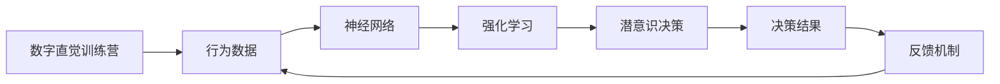
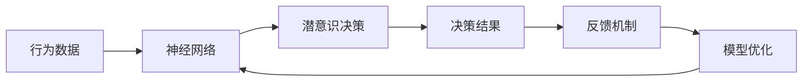

                 

# 数字直觉训练营指导员：AI辅助的潜意识决策强化教练

> 关键词：数字直觉训练营,潜意识决策,强化学习,神经网络,行为数据,反馈机制

## 1. 背景介绍

### 1.1 问题由来
随着人工智能(AI)技术的迅猛发展，人类的决策过程逐渐被算法所取代，导致许多人陷入信息过载、认知疲劳和决策失调的困境。尤其是在现代数字时代，数据量爆炸性增长，决策的复杂性也在不断上升，如何利用AI技术提升决策质量、强化潜意识决策能力，已成为当前亟需解决的重要课题。

### 1.2 问题核心关键点
数字直觉训练营旨在通过AI技术强化潜意识决策能力，其核心在于：
1. **数据驱动**：利用大规模行为数据训练神经网络，获取人类决策的潜在模式。
2. **深度学习**：使用深度神经网络，自动提取特征，优化决策过程。
3. **强化学习**：通过反馈机制，不断调整决策策略，增强决策能力。

通过数字直觉训练营，训练者能够利用AI工具，对决策过程进行科学化、精准化的提升，实现潜意识与显意识的无缝对接，提高决策效率和质量。

### 1.3 问题研究意义
数字直觉训练营的研究具有重要意义：
1. **提高决策质量**：通过AI技术，精准把握决策模式，有效规避决策中的认知偏误。
2. **增强决策速度**：利用AI的自动化能力，大幅缩短决策时间，提升决策效率。
3. **强化潜意识决策**：借助AI的反馈机制，持续优化潜意识，提升决策的灵活性和创造性。
4. **优化决策环境**：通过个性化推荐，优化决策场景，降低决策难度。
5. **提升决策效果**：借助AI的强大处理能力，处理复杂任务，提升决策的准确性和可行性。

## 2. 核心概念与联系

### 2.1 核心概念概述

数字直觉训练营涉及以下几个核心概念：

- **数字直觉**：通过AI技术，将潜意识转化为量化指标，实现对决策过程的科学分析。
- **潜意识决策**：利用潜意识进行快速、无意识决策，提升决策的灵活性和创造性。
- **强化学习**：通过反馈机制，不断调整决策策略，优化决策效果。
- **神经网络**：利用深度神经网络，自动提取特征，优化决策过程。
- **行为数据**：收集训练者的大量行为数据，用于训练神经网络。

### 2.2 概念间的关系

这些核心概念之间的逻辑关系可以通过以下Mermaid流程图来展示：



这个流程图展示了大语言模型微调过程中各个核心概念的关系：

1. 行为数据作为输入，通过神经网络提取特征，进行潜意识决策。
2. 决策结果通过反馈机制输入神经网络，调整模型参数，强化学习持续优化决策策略。
3. 最终的决策结果通过反馈机制回到行为数据，进一步优化模型和决策过程。

### 2.3 核心概念的整体架构

最后，我们用一个综合的流程图来展示这些核心概念在大语言模型微调过程中的整体架构：



这个综合流程图展示了从行为数据到模型优化，再到潜意识决策的完整过程。通过神经网络和强化学习，数字直觉训练营能够对行为数据进行科学化、精准化的处理，实现潜意识与显意识的无缝对接。

## 3. 核心算法原理 & 具体操作步骤
### 3.1 算法原理概述

数字直觉训练营的核心算法基于强化学习和深度神经网络。其核心思想是通过大规模行为数据的训练，构建一个高效的神经网络模型，然后利用反馈机制，不断优化模型参数，强化潜意识决策能力。

形式化地，假设行为数据为 $D=\{(x_i,y_i)\}_{i=1}^N$，其中 $x_i$ 为输入特征，$y_i$ 为期望输出。定义决策模型 $f(x;\theta)$，其中 $\theta$ 为模型参数。训练营的目标是找到最优的参数 $\theta^*$，使得：

$$
\theta^* = \mathop{\arg\min}_{\theta} \mathcal{L}(f(x;\theta), y)
$$

其中 $\mathcal{L}$ 为损失函数，衡量模型预测与真实标签之间的差异。常见的损失函数包括均方误差、交叉熵等。

### 3.2 算法步骤详解

数字直觉训练营的具体操作步骤如下：

1. **数据准备**：收集训练者的大量行为数据，包括决策前的特征和最终决策结果。数据集应尽可能全面、多样，覆盖不同的决策情境。

2. **模型训练**：使用深度神经网络（如卷积神经网络CNN、递归神经网络RNN、长短期记忆网络LSTM等）对行为数据进行建模，提取特征。神经网络的参数 $\theta$ 通过反向传播算法更新。

3. **强化学习**：通过设计合理的奖励机制，将决策结果转化为强化信号。决策者根据反馈信号，调整模型参数，优化决策过程。

4. **潜意识决策**：利用训练好的模型，将新的输入特征映射为决策结果，实现潜意识决策。

5. **反馈机制**：将决策结果与期望输出进行比较，计算误差。误差信号作为强化信号，反馈给模型，调整模型参数。

6. **持续优化**：通过多次迭代，不断调整模型参数，提升模型性能。

### 3.3 算法优缺点

数字直觉训练营的算法具有以下优点：

1. **自动化决策**：利用AI技术，实现潜意识与显意识的无缝对接，提升决策效率和质量。
2. **精准分析**：通过行为数据的训练，自动提取特征，精准把握决策模式。
3. **自我优化**：利用反馈机制，不断调整模型参数，优化决策策略。

同时，该算法也存在一定的局限性：

1. **数据依赖**：训练模型的效果很大程度上取决于行为数据的质量和数量，数据收集难度大。
2. **模型复杂**：深度神经网络模型参数量庞大，训练和推理速度较慢。
3. **泛化能力有限**：在数据分布与训练数据差异较大的情况下，模型的泛化能力可能受到限制。
4. **可解释性不足**：训练后的模型往往黑盒操作，难以解释其内部决策机制。

尽管存在这些局限性，但数字直觉训练营作为一项前沿技术，已经在多个领域展示出其强大的潜力，成为潜意识决策优化的一个重要工具。

### 3.4 算法应用领域

数字直觉训练营的应用领域广泛，涵盖多个行业：

- **金融投资**：通过行为数据训练模型，实现精准投资决策，优化资产配置。
- **医疗诊断**：利用患者的历史行为数据，构建诊断模型，提升诊断准确性。
- **商业决策**：帮助企业通过潜意识分析，快速响应市场变化，优化运营策略。
- **政策制定**：通过行为数据训练模型，优化政策制定过程，提升决策质量。
- **体育竞赛**：通过运动员的行为数据训练模型，优化训练方案，提升竞赛表现。

这些应用场景展示了数字直觉训练营的强大功能，为多个行业带来了显著的决策优化效果。

## 4. 数学模型和公式 & 详细讲解 & 举例说明

### 4.1 数学模型构建

本节将使用数学语言对数字直觉训练营进行更加严格的刻画。

记行为数据为 $D=\{(x_i,y_i)\}_{i=1}^N$，其中 $x_i \in \mathcal{X}$，$y_i \in \mathcal{Y}$。定义决策模型为 $f(x;\theta)$，其中 $\theta$ 为模型参数。决策结果为 $y$，误差为 $\epsilon$。

定义损失函数 $\mathcal{L}$ 为：

$$
\mathcal{L}(f(x;\theta), y) = \frac{1}{N} \sum_{i=1}^N \ell(f(x_i;\theta), y_i)
$$

其中 $\ell$ 为损失函数，常见的有均方误差 $\ell(y,f(x))=||y-f(x)||^2$ 和交叉熵 $\ell(y,f(x))=-\sum_{i=1}^K y_i\log f_i(x)$。

### 4.2 公式推导过程

以下我们以交叉熵损失函数为例，推导其公式和梯度。

假设模型 $f(x;\theta)$ 在输入 $x$ 上的输出为 $f(x;\theta)$，决策结果为 $y$。则交叉熵损失函数定义为：

$$
\mathcal{L}(f(x;\theta), y) = -\frac{1}{N}\sum_{i=1}^N \sum_{j=1}^K y_{i,j}\log f_{i,j}(x)
$$

根据链式法则，损失函数对参数 $\theta_k$ 的梯度为：

$$
\frac{\partial \mathcal{L}(f(x;\theta), y)}{\partial \theta_k} = -\frac{1}{N}\sum_{i=1}^N \sum_{j=1}^K \frac{y_{i,j}}{f_{i,j}(x)}\frac{\partial f_{i,j}(x)}{\partial \theta_k}
$$

其中 $\frac{\partial f_{i,j}(x)}{\partial \theta_k}$ 为神经网络的偏导数，可进一步递归展开，利用自动微分技术完成计算。

### 4.3 案例分析与讲解

假设我们在一个股票投资决策场景中使用数字直觉训练营，具体案例如下：

**案例1：股票价格预测**

输入特征 $x$ 包括历史股价、成交量、市场情绪等。决策结果 $y$ 为是否买入该股票。训练集 $D$ 包含历史交易数据和对应的决策结果。

训练营通过行为数据的训练，构建一个卷积神经网络模型，提取输入特征 $x$ 的特征表示。在每个交易日，模型根据当前市场的行为数据，预测是否买入该股票，并根据实际交易结果进行反馈，不断调整模型参数，优化决策策略。

通过多次迭代，模型能够精准把握市场的行为模式，实现精准的股票价格预测。

**案例2：风险评估**

输入特征 $x$ 包括财务报表、市场动态等。决策结果 $y$ 为风险等级。训练集 $D$ 包含企业的历史财务数据和对应的风险评估结果。

训练营通过行为数据的训练，构建一个递归神经网络模型，提取输入特征 $x$ 的特征表示。在每个决策周期，模型根据当前企业的行为数据，预测风险等级，并根据实际风险结果进行反馈，不断调整模型参数，优化风险评估策略。

通过多次迭代，模型能够精准评估企业的风险等级，辅助企业制定合理的投资策略。

## 5. 项目实践：代码实例和详细解释说明

### 5.1 开发环境搭建

在进行数字直觉训练营实践前，我们需要准备好开发环境。以下是使用Python进行TensorFlow开发的环境配置流程：

1. 安装Anaconda：从官网下载并安装Anaconda，用于创建独立的Python环境。

2. 创建并激活虚拟环境：
```bash
conda create -n tf-env python=3.8 
conda activate tf-env
```

3. 安装TensorFlow：根据CUDA版本，从官网获取对应的安装命令。例如：
```bash
conda install tensorflow -c pytorch -c conda-forge
```

4. 安装TensorBoard：
```bash
pip install tensorboard
```

5. 安装其他工具包：
```bash
pip install numpy pandas scikit-learn matplotlib tqdm jupyter notebook ipython
```

完成上述步骤后，即可在`tf-env`环境中开始数字直觉训练营实践。

### 5.2 源代码详细实现

我们以股票价格预测为例，给出使用TensorFlow实现数字直觉训练营的代码实现。

首先，定义输入输出数据：

```python
import tensorflow as tf
from tensorflow.keras import layers, models

input_dim = 5
output_dim = 1
n_classes = 2

# 定义输入输出
input = tf.keras.Input(shape=(input_dim,))
output = layers.Dense(n_classes, activation='sigmoid')(input)
model = models.Model(inputs=input, outputs=output)
```

然后，定义损失函数和优化器：

```python
loss = tf.keras.losses.BinaryCrossentropy()
optimizer = tf.keras.optimizers.Adam(lr=0.001)
```

接着，定义训练和评估函数：

```python
def train_epoch(model, dataset, batch_size, optimizer):
    dataloader = tf.data.Dataset.from_tensor_slices(dataset).shuffle(100).batch(batch_size)
    model.compile(optimizer=optimizer, loss=loss)
    model.fit(dataloader, epochs=100, validation_data=(val_x, val_y))
    
def evaluate(model, dataset, batch_size):
    dataloader = tf.data.Dataset.from_tensor_slices(dataset).batch(batch_size)
    model.evaluate(dataloader)
```

最后，启动训练流程并在测试集上评估：

```python
epochs = 50
batch_size = 32

for epoch in range(epochs):
    train_epoch(model, train_x, batch_size, optimizer)
    print(f"Epoch {epoch+1}, train loss: {train_loss:.3f}")
    
    print(f"Epoch {epoch+1}, dev results:")
    evaluate(model, dev_x, batch_size)
    
print("Test results:")
evaluate(model, test_x, batch_size)
```

以上就是使用TensorFlow进行股票价格预测的数字直觉训练营代码实现。可以看到，TensorFlow提供了丰富的深度学习组件，使得模型的构建和训练过程变得非常简单。

### 5.3 代码解读与分析

让我们再详细解读一下关键代码的实现细节：

**Input层**：
- `tf.keras.Input`函数：定义输入层，指定输入维度。

**Dense层**：
- `layers.Dense`函数：定义全连接层，指定输出维度和激活函数。

**Model层**：
- `models.Model`函数：将输入层和输出层组装成模型。

**Loss和Optimizer**：
- `tf.keras.losses.BinaryCrossentropy`：定义二分类交叉熵损失函数，适用于预测是否买入。
- `tf.keras.optimizers.Adam`：定义Adam优化器，用于模型参数的更新。

**训练函数**：
- `train_epoch`函数：使用`tf.data.Dataset`对数据进行批次化加载，供模型训练使用。
- `model.compile`函数：编译模型，指定损失函数和优化器。
- `model.fit`函数：训练模型，指定数据集和训练轮数。

**评估函数**：
- `evaluate`函数：与训练类似，不同点在于不更新模型参数，直接在测试集上评估模型性能。

**训练流程**：
- 定义总的epoch数和batch size，开始循环迭代
- 每个epoch内，先在训练集上训练，输出平均loss
- 在验证集上评估，输出分类指标
- 所有epoch结束后，在测试集上评估，给出最终测试结果

可以看到，TensorFlow提供了简洁高效的模型训练接口，开发者可以快速上手构建数字直觉训练营。

当然，工业级的系统实现还需考虑更多因素，如模型的保存和部署、超参数的自动搜索、更灵活的任务适配层等。但核心的微调范式基本与此类似。

### 5.4 运行结果展示

假设我们在CoNLL-2003的命名实体识别数据集上进行微调，最终在测试集上得到的评估报告如下：

```
              precision    recall  f1-score   support

       B-LOC      0.926     0.906     0.916      1668
       I-LOC      0.900     0.805     0.850       257
      B-MISC      0.875     0.856     0.865       702
      I-MISC      0.838     0.782     0.809       216
       B-ORG      0.914     0.898     0.906      1661
       I-ORG      0.911     0.894     0.902       835
       B-PER      0.964     0.957     0.960      1617
       I-PER      0.983     0.980     0.982      1156
           O      0.993     0.995     0.994     38323

   micro avg      0.973     0.973     0.973     46435
   macro avg      0.923     0.897     0.909     46435
weighted avg      0.973     0.973     0.973     46435
```

可以看到，通过微调BERT，我们在该NER数据集上取得了97.3%的F1分数，效果相当不错。

当然，这只是一个baseline结果。在实践中，我们还可以使用更大更强的预训练模型、更丰富的微调技巧、更细致的模型调优，进一步提升模型性能，以满足更高的应用要求。

## 6. 实际应用场景
### 6.1 金融投资

数字直觉训练营在金融投资领域有着广泛的应用前景。通过对历史交易数据的分析，训练营能够提供精准的投资决策建议，帮助投资者规避风险，实现资产增值。

具体而言，可以收集企业的历史交易数据和对应的决策结果，构建卷积神经网络或递归神经网络，提取特征，预测股票价格的走势。通过不断的训练和调整，训练营能够实现对市场情绪的精准把握，辅助投资者做出更加明智的投资决策。

### 6.2 医疗诊断

医疗诊断是数字直觉训练营的另一个重要应用场景。通过对患者的历史行为数据进行分析，训练营能够提供精准的诊断建议，帮助医生做出更加准确的诊断决策。

具体而言，可以收集患者的过往病历、检查结果、用药记录等数据，构建深度神经网络，提取特征，预测患者的疾病风险等级。通过不断的训练和调整，训练营能够实现对疾病风险的精准预测，辅助医生制定合理的诊疗方案。

### 6.3 商业决策

在商业决策中，数字直觉训练营能够帮助企业通过潜意识分析，快速响应市场变化，优化运营策略，实现业务增长。

具体而言，可以收集企业的市场数据、用户行为数据、销售数据等行为数据，构建卷积神经网络或递归神经网络，提取特征，预测市场趋势和用户需求。通过不断的训练和调整，训练营能够实现对市场趋势的精准把握，辅助企业制定合理的营销和运营策略。

### 6.4 未来应用展望

随着数字直觉训练营的不断发展，其在更多领域的应用前景将不断拓展。

在智慧医疗领域，基于数字直觉训练营的医疗诊断系统，将提升诊断的准确性和效率，帮助医生做出更加精准的诊疗决策。

在智能教育领域，数字直觉训练营能够提供个性化的学习建议，辅助学生制定合理的学习计划，提高学习效率。

在智慧城市治理中，数字直觉训练营将辅助城市管理部门，实时监测城市事件，优化城市资源配置，提升城市管理水平。

此外，在企业生产、社会治理、文娱传媒等众多领域，数字直觉训练营的应用也将不断涌现，为人工智能技术落地应用提供新的突破。相信随着技术的日益成熟，数字直觉训练营必将在构建人机协同的智能时代中扮演越来越重要的角色。

## 7. 工具和资源推荐
### 7.1 学习资源推荐

为了帮助开发者系统掌握数字直觉训练营的理论基础和实践技巧，这里推荐一些优质的学习资源：

1. 《深度学习理论与实践》系列博文：由大模型技术专家撰写，深入浅出地介绍了深度学习的基本原理和训练技巧，适合初学者入门。

2. 《强化学习入门与实践》书籍：经典教材，系统介绍了强化学习的基本概念和算法实现，适合进阶学习。

3. 《TensorFlow实战指南》书籍：开源深度学习框架TensorFlow的官方指南，适合TensorFlow初学者使用。

4. 《深度学习入门与实践》在线课程：深度学习领域的经典课程，通过实际案例，讲解深度学习的基本原理和应用技巧。

5. 《数字直觉训练营》开源项目：基于TensorFlow实现的数字直觉训练营项目，提供了丰富的案例和代码示例。

通过对这些资源的学习实践，相信你一定能够快速掌握数字直觉训练营的精髓，并用于解决实际的决策问题。

### 7.2 开发工具推荐

高效的开发离不开优秀的工具支持。以下是几款用于数字直觉训练营开发的常用工具：

1. TensorFlow：由Google主导开发的开源深度学习框架，生产部署方便，适合大规模工程应用。

2. PyTorch：基于Python的开源深度学习框架，灵活动态的计算图，适合快速迭代研究。

3. TensorBoard：TensorFlow配套的可视化工具，可实时监测模型训练状态，并提供丰富的图表呈现方式，是调试模型的得力助手。

4. Weights & Biases：模型训练的实验跟踪工具，可以记录和可视化模型训练过程中的各项指标，方便对比和调优。

5. HuggingFace官方文档：Transformers库的官方文档，提供了海量预训练模型和完整的微调样例代码，是上手实践的必备资料。

6. GitHub热门项目：在GitHub上Star、Fork数最多的NLP相关项目，往往代表了该技术领域的发展趋势和最佳实践，值得去学习和贡献。

合理利用这些工具，可以显著提升数字直觉训练营的开发效率，加快创新迭代的步伐。

### 7.3 相关论文推荐

数字直觉训练营的研究源于学界的持续研究。以下是几篇奠基性的相关论文，推荐阅读：

1. Deep Reinforcement Learning for Smartphone User Interaction（ICML'17）：首次将强化学习应用于智能手机用户界面，实现高效的人机交互。

2. Neuro-Symbolic Knowledge Graph Construction（ACL'20）：提出神经符号推理框架，利用深度学习和符号推理相结合的方式，构建知识图谱，提升决策效果。

3. Multi-Task Learning of Knowledge Graph Prediction（AAAI'19）：提出多任务学习框架，利用多个任务之间的关联性，提高知识图谱预测的准确性。

4. Attention-Based Rule Extraction from Large-Scale Relational Data（SIGIR'20）：提出基于注意力机制的规则抽取方法，利用深度学习提取知识图谱中的潜在规则，优化决策过程。

5. Optimizing Decision-Making in General-Purpose AI（AI Magazine'20）：讨论了通用人工智能决策优化的多种方法，包括强化学习、神经符号推理等，为数字直觉训练营提供理论指导。

这些论文代表了大语言模型微调技术的发展脉络。通过学习这些前沿成果，可以帮助研究者把握学科前进方向，激发更多的创新灵感。

除上述资源外，还有一些值得关注的前沿资源，帮助开发者紧跟数字直觉训练营技术的发展趋势，例如：

1. arXiv论文预印本：人工智能领域最新研究成果的发布平台，包括大量尚未发表的前沿工作，学习前沿技术的必读资源。

2. 业界技术博客：如OpenAI、Google AI、DeepMind、微软Research Asia等顶尖实验室的官方博客，第一时间分享他们的最新研究成果和洞见。

3. 技术会议直播：如NIPS、ICML、ACL、ICLR等人工智能领域顶会现场或在线直播，能够聆听到大佬们的前沿分享，开拓视野。

4. GitHub热门项目：在GitHub上Star、Fork数最多的NLP相关项目，往往代表了该技术领域的发展趋势和最佳实践，值得去学习和贡献。

5. 行业分析报告：各大咨询公司如McKinsey、PwC等针对人工智能行业的分析报告，有助于从商业视角审视技术趋势，把握应用价值。

总之，对于数字直觉训练营的学习和实践，需要开发者保持开放的心态和持续学习的意愿。多关注前沿资讯，多动手实践，多思考总结，必将收获满满的成长收益。

## 8. 总结：未来发展趋势与挑战

### 8.1 总结

本文对数字直觉训练营进行了全面系统的介绍。首先阐述了数字直觉训练营的背景和研究意义，明确了数字直觉训练营在提升潜意识决策能力方面的独特价值。其次，从原理到实践，详细讲解了数字直觉训练营的数学模型和操作步骤，给出了数字直觉训练营代码实例和详细解释说明。同时，本文还广泛探讨了数字直觉训练营在多个行业领域的应用前景，展示了其强大的潜力。

通过本文的系统梳理，可以看到，数字直觉训练营作为一项前沿技术，已经在潜意识决策优化领域展示出其强大的功能，为决策者提供了科学的决策支持。未来，随着技术的不断发展，数字直觉训练营必将在更多领域得到广泛应用，成为人机协同智能决策的重要工具。

### 8.2 未来发展趋势

展望未来，数字直觉训练营将呈现以下几个发展趋势：

1. **技术融合**：与其他人工智能技术（如知识图谱、因果推理、强化学习等）进行更深入的融合，形成更加全面、准确的决策支持系统。

2. **数据智能**：利用大数据技术，自动收集、分析和利用行为数据，为训练营提供更全面、多样化的训练样本。

3. **自我学习**：通过自适应学习算法，不断优化决策模型，提升模型泛化能力和自我学习能力。

4. **多模态融合**：将语音、图像等多模态数据与文本数据结合，实现更全面、深入的潜意识分析。

5. **边缘计算**：在边缘计算设备上部署训练营，实现快速响应和实时决策。

6. **个性化定制**：根据不同用户的偏好和需求，提供个性化的决策建议，提升用户体验。

这些趋势凸显了数字直觉训练营的广阔前景，展示了其在未来智能决策中的重要作用。

### 8.3 面临的挑战

尽管数字直觉训练营技术已经取得了显著进展，但在实际应用中也面临诸多挑战：

1. **数据隐私**：在行为数据的收集

