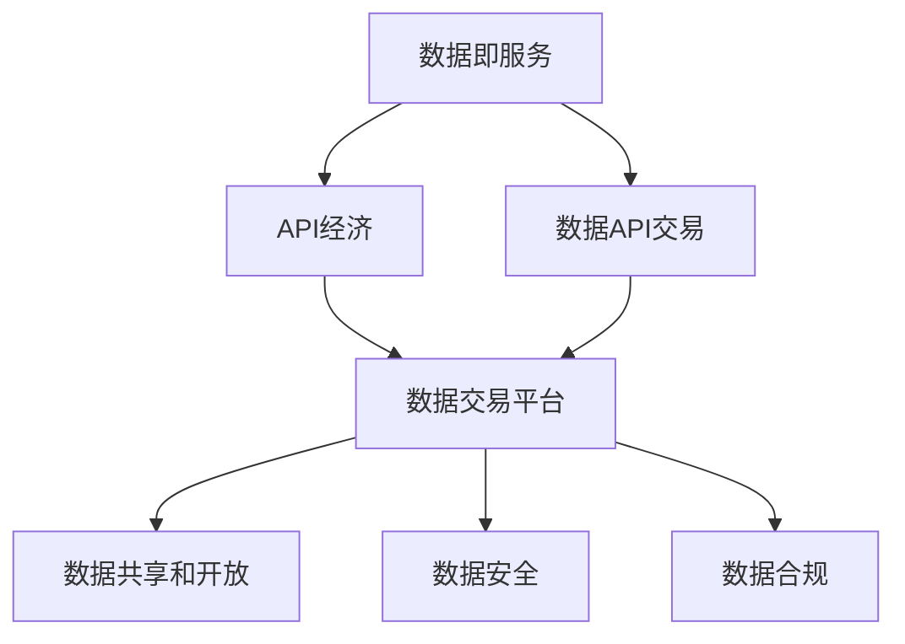
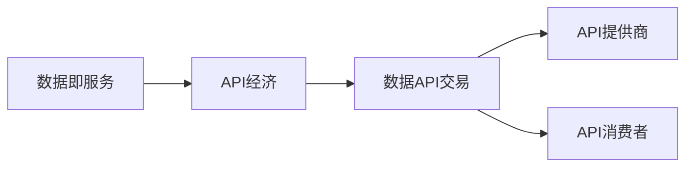
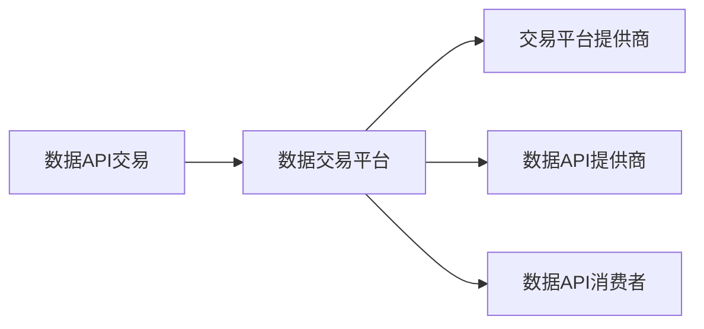
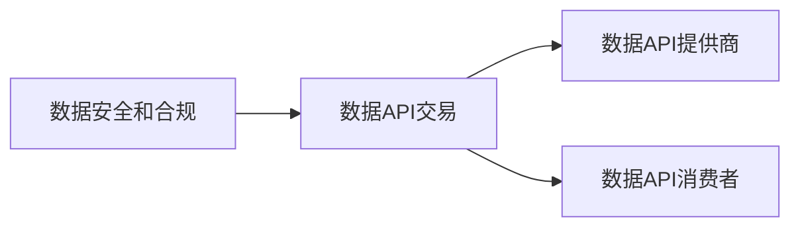
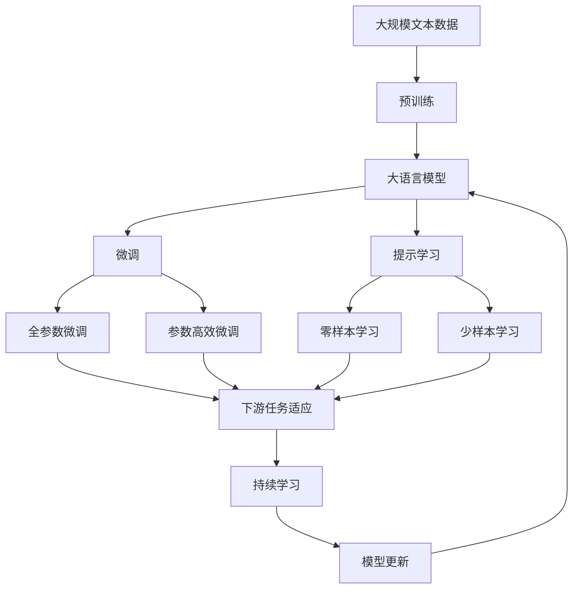

                 

# 数据即服务:API经济下的新型数据交易模式

> 关键词：数据即服务, API经济, 数据交易, 数据交易平台, 数据市场, 数据共享, 数据安全, 数据合规

## 1. 背景介绍

### 1.1 问题由来

在当今数字化时代，数据已经成为一种重要的经济资源，驱动各行各业的发展。然而，数据分散在各个组织和部门中，难以实现有效的整合和共享。这种数据的孤立和孤岛现象，极大地阻碍了数据的价值最大化和高效利用。

为解决这一问题，“数据即服务”（Data as a Service, DaaS）的概念应运而生。DaaS通过将数据以API的形式封装和提供，使得数据消费方能够灵活地获取和利用数据，打破数据孤岛，实现数据的广泛共享和高效利用。

同时，随着API经济的发展，数据交易市场逐步形成。API提供商通过提供高质量的数据API，向开发者和企业提供丰富的数据服务，构建API生态系统，带动数据交易市场的发展。数据API交易成为API经济中不可或缺的重要组成部分。

### 1.2 问题核心关键点

DaaS和数据API交易的核心关键点在于如何高效、安全、合规地交易和共享数据。这涉及以下几个方面：

- 数据定价模型：如何根据数据价值和使用场景确定合理的价格。
- 数据质量控制：确保数据准确性、完整性和时效性，避免低质量数据带来的负面影响。
- 数据安全保障：保护数据隐私和安全，防止数据泄露和滥用。
- 数据合规管理：确保数据交易符合法律法规，避免合规风险。
- 数据交易平台：提供高效、透明的数据交易平台，支持数据交易、管理和审计。

### 1.3 问题研究意义

研究DaaS和数据API交易模式，对于推动数据资源的广泛共享和高效利用，激发数据经济的价值，具有重要意义：

1. 促进数据资源的整合和共享：打破数据孤岛，促进数据资源的整合和共享，提升数据的价值利用率。
2. 激发数据经济的潜力：通过高效的数据交易，激发数据经济的潜力，带动数据驱动的产业创新和升级。
3. 提高数据交易的效率和透明度：通过标准化的数据交易平台，提高数据交易的效率和透明度，降低交易成本。
4. 保障数据安全和合规：通过完善的数据安全保障和合规管理，保障数据交易的安全和合规，保护各方利益。
5. 推动数据技术和市场的发展：推动数据技术和数据市场的创新和发展，推动数据经济的健康成长。

## 2. 核心概念与联系

### 2.1 核心概念概述

为了更好地理解DaaS和数据API交易模式，本节将介绍几个密切相关的核心概念：

- **数据即服务**：一种数据管理和提供的方式，通过API封装数据，使得数据消费方可以按需获取和利用数据，打破数据孤岛，实现数据的广泛共享和高效利用。

- **API经济**：基于API的服务经济模式，API提供商通过提供API服务，构建API生态系统，带动数据、应用和服务的高效协同和创新。

- **数据API交易**：在数据API交易市场中，数据API提供商和数据API消费者通过数据API交易平台，进行数据API的买卖和交易。

- **数据交易平台**：一个标准化的数据交易系统，支持数据API的交易、管理和审计，提供高效、透明的数据交易环境。

- **数据共享和开放**：通过数据共享和开放，实现数据的广泛传播和应用，推动数据驱动的创新和发展。

- **数据安全**：保护数据隐私和安全，防止数据泄露和滥用，确保数据交易的合法合规。

- **数据合规**：确保数据交易符合法律法规，避免合规风险，保障各方的合法权益。

这些核心概念之间的逻辑关系可以通过以下Mermaid流程图来展示：



这个流程图展示了大语言模型微调过程中各个核心概念的关系和作用：

1. 数据即服务通过API封装数据，打破了数据孤岛，使得数据API交易成为可能。
2. API经济基于API的服务模式，通过数据API交易，带动数据和应用的协同和创新。
3. 数据交易平台为数据API交易提供了高效、透明的环境，支持数据API的交易和管理。
4. 数据共享和开放通过数据API交易，实现了数据的广泛传播和应用。
5. 数据安全和合规保障了数据交易的安全和合法，确保了各方的权益。

### 2.2 概念间的关系

这些核心概念之间存在着紧密的联系，形成了数据API交易的完整生态系统。下面我通过几个Mermaid流程图来展示这些概念之间的关系。

#### 2.2.1 数据即服务与API经济的关系



这个流程图展示了数据即服务和API经济的关系：

1. 数据即服务通过API封装数据，使得API提供商和消费者能够高效交易和利用数据。
2. API经济通过数据API交易，带动数据和应用的协同和创新。

#### 2.2.2 数据API交易与数据交易平台的关系



这个流程图展示了数据API交易与数据交易平台的关系：

1. 数据API交易通过数据交易平台，实现了高效、透明的数据交易。
2. 数据交易平台支持数据API的交易和管理，提供了标准化的交易环境。

#### 2.2.3 数据安全和合规与数据API交易的关系



这个流程图展示了数据安全和合规与数据API交易的关系：

1. 数据安全和合规保障了数据API交易的安全和合法，确保了各方的权益。
2. 数据API交易需要在符合法律法规的前提下进行，保障数据交易的合法合规。

### 2.3 核心概念的整体架构

最后，我们用一个综合的流程图来展示这些核心概念在大语言模型微调过程中的整体架构：



这个综合流程图展示了从预训练到微调，再到持续学习的完整过程。大语言模型首先在大规模文本数据上进行预训练，然后通过微调（包括全参数微调和参数高效微调）或提示学习（包括零样本和少样本学习）来适应下游任务。最后，通过持续学习技术，模型可以不断更新和适应新的任务和数据。

## 3. 核心算法原理 & 具体操作步骤
### 3.1 算法原理概述

数据API交易的核心算法原理，主要基于数据管理和API服务的技术架构。其核心思想是：

1. 数据资源以API的形式封装和提供，使得数据API消费者可以灵活地获取和利用数据。
2. 数据API交易通过标准化、透明化的交易平台进行，确保交易的公平、高效和安全。
3. 数据API交易需要考虑数据定价、质量控制、安全保障和合规管理等多个方面，确保数据交易的合法合规。

形式化地，假设数据API提供商为 $D_{provider}$，数据API消费者为 $D_{consumer}$，数据API交易平台为 $P$，则数据API交易的流程可以描述为：

1. $D_{provider}$ 通过数据API平台 $P$，向 $D_{consumer}$ 提供数据API $API_i$。
2. $D_{consumer}$ 通过API平台 $P$，订购并使用 $API_i$ 进行数据API交易。
3. $P$ 提供数据API的交易、管理和审计服务，确保数据API交易的公平、高效和安全。
4. $D_{consumer}$ 根据使用情况支付费用，确保数据API交易的合法合规。

### 3.2 算法步骤详解

数据API交易的一般步骤如下：

**Step 1: 准备数据API和交易平台**

1. 选择合适的数据API提供商 $D_{provider}$ 和数据API平台 $P$，确保数据API的准确性和完整性。
2. 确定数据API的交易定价模型，如按使用次数、按使用量等。
3. 设计数据API的交易平台，支持数据API的交易、管理和审计。

**Step 2: 设计数据API接口**

1. 设计标准化的数据API接口，支持数据API的获取、使用和反馈。
2. 确定数据API的访问权限和安全性，保护数据API不被滥用。
3. 设计数据API的使用规则和限制，确保数据API交易的合法合规。

**Step 3: 数据API交易执行**

1. $D_{consumer}$ 通过API平台 $P$，选择并订购所需的数据API $API_i$。
2. $P$ 提供数据API的交易服务，记录交易记录和费用。
3. $D_{consumer}$ 使用 $API_i$ 进行数据API消费，获取所需数据。
4. $P$ 提供数据API的管理和审计服务，确保数据API交易的安全和合规。

**Step 4: 数据API交易后处理**

1. $D_{provider}$ 根据使用情况向 $D_{consumer}$ 收取费用，确保数据API交易的合法合规。
2. $P$ 记录数据API的交易记录和费用，提供数据API的交易审计服务。
3. $D_{consumer}$ 根据交易记录进行数据分析和应用，利用数据API实现业务目标。

### 3.3 算法优缺点

数据API交易具有以下优点：

1. 高效便捷：数据API通过API封装，使得数据API消费者可以灵活获取和利用数据，提高了数据使用效率。
2. 透明公平：数据API交易通过标准化、透明化的交易平台进行，确保了交易的公平性和透明性。
3. 安全合规：数据API交易需要在符合法律法规的前提下进行，保障了数据交易的安全和合法。

同时，数据API交易也存在以下缺点：

1. 依赖技术平台：数据API交易需要在数据API平台支持下进行，平台依赖度高。
2. 交易成本高：数据API交易需要支付费用，增加了数据API消费者的交易成本。
3. 数据隐私风险：数据API交易涉及数据隐私问题，存在数据泄露和滥用的风险。

### 3.4 算法应用领域

数据API交易在各个领域都有广泛的应用，以下是几个典型的应用场景：

- **金融领域**：金融机构通过数据API交易，获取市场数据和客户数据，实现风险管理和客户服务。
- **医疗健康**：医疗机构通过数据API交易，获取医疗数据和患者数据，支持诊断和治疗。
- **零售电商**：电商平台通过数据API交易，获取用户数据和市场数据，优化产品推荐和营销策略。
- **智能制造**：制造企业通过数据API交易，获取设备数据和生产数据，实现智能生产和质量控制。
- **智慧城市**：智慧城市通过数据API交易，获取城市数据和公共数据，支持城市管理和决策。

此外，数据API交易还广泛应用于公共服务、能源环保、农业食品等多个领域，成为推动数据驱动创新的重要手段。

## 4. 数学模型和公式 & 详细讲解  
### 4.1 数学模型构建

数据API交易的数学模型主要涉及数据定价、交易量计算、费用计算等方面。下面以数据API的交易定价模型为例，进行详细讲解。

假设数据API $API_i$ 的交易价格为 $P_i$，单位为元/次，$N_i$ 为该数据API的交易次数，则总交易费用 $C_i$ 可以表示为：

$$
C_i = P_i \times N_i
$$

其中 $P_i$ 和 $N_i$ 均为非负实数。

对于数据API的交易定价模型，常见的方式有按使用次数定价和按使用量定价两种。

#### 4.1.1 按使用次数定价

按使用次数定价是常见的数据API定价方式，其计算公式为：

$$
C_i = P_i \times N_i
$$

其中 $P_i$ 为单次使用价格，$N_i$ 为使用次数。

#### 4.1.2 按使用量定价

按使用量定价是指根据数据API的实际使用量，计算交易费用。其计算公式为：

$$
C_i = P_i \times V_i
$$

其中 $P_i$ 为单位使用量价格，$V_i$ 为使用量。

### 4.2 公式推导过程

以按使用次数定价为例，我们来进行公式推导：

假设数据API $API_i$ 的总使用次数为 $N_i$，每次使用的交易费用为 $P_i$，则总交易费用 $C_i$ 可以表示为：

$$
C_i = P_i \times N_i
$$

对于数据API提供商 $D_{provider}$ 而言，总交易费用为：

$$
C_{total} = \sum_{i=1}^m P_i \times N_i
$$

其中 $m$ 为数据API的总数。

对于数据API消费者 $D_{consumer}$ 而言，总交易费用为：

$$
C_{total} = \sum_{i=1}^m P_i \times N_i
$$

其中 $m$ 为数据API的总数。

### 4.3 案例分析与讲解

假设某电商平台的数据API提供商 $D_{provider}$ 提供了两个数据API $API_1$ 和 $API_2$，每次使用的交易费用分别为 $P_1=0.1$ 元和 $P_2=0.2$ 元，假设 $D_{consumer}$ 分别订购了 $N_1=100$ 次和 $N_2=50$ 次，则总交易费用为：

$$
C_{total} = 0.1 \times 100 + 0.2 \times 50 = 15
$$

对于 $D_{consumer}$ 而言，每次使用数据API $API_1$ 的费用为 $0.1$ 元，每次使用数据API $API_2$ 的费用为 $0.2$ 元。

## 5. 项目实践：代码实例和详细解释说明
### 5.1 开发环境搭建

在进行数据API交易实践前，我们需要准备好开发环境。以下是使用Python进行Flask开发的环境配置流程：

1. 安装Anaconda：从官网下载并安装Anaconda，用于创建独立的Python环境。

2. 创建并激活虚拟环境：
```bash
conda create -n flask-env python=3.8 
conda activate flask-env
```

3. 安装Flask：使用pip安装Flask框架，用于构建API服务。
```bash
pip install flask
```

4. 安装Flask-CORS：使用pip安装Flask-CORS插件，支持跨域请求。
```bash
pip install flask-cors
```

5. 安装Flask-RESTful：使用pip安装Flask-RESTful插件，支持RESTful风格的API开发。
```bash
pip install flask-restful
```

完成上述步骤后，即可在`flask-env`环境中开始数据API交易实践。

### 5.2 源代码详细实现

下面我们以数据API交易的按使用次数定价为例，给出使用Flask构建API服务的PyTorch代码实现。

首先，定义数据API的模型和路由：

```python
from flask import Flask, request
from flask_cors import CORS
from flask_restful import Resource, Api

app = Flask(__name__)
api = Api(app)
CORS(app)

class API(Resource):
    def get(self):
        return {'message': 'Hello, World!'}  # 示例API

api.add_resource(API, '/api')
```

然后，定义数据API的交易模型：

```python
from flask import Flask, request
from flask_cors import CORS
from flask_restful import Resource, Api

app = Flask(__name__)
api = Api(app)
CORS(app)

class API(Resource):
    def get(self):
        api_id = request.args.get('api_id')
        times = request.args.get('times')
        price = 0.1  # 假设每次使用的交易费用为0.1元
        total_price = float(times) * price
        return {'times': times, 'price': price, 'total_price': total_price}

api.add_resource(API, '/api/<int:api_id>')

if __name__ == '__main__':
    app.run(debug=True)
```

最后，启动Flask服务：

```bash
python app.py
```

在浏览器中访问 `http://localhost:5000/api/1?times=100`，即可获取数据API $API_1$ 的定价信息。

### 5.3 代码解读与分析

让我们再详细解读一下关键代码的实现细节：

**Flask应用初始化**：
- `app = Flask(__name__)`：创建Flask应用。
- `api = Api(app)`：创建RESTful API。
- `CORS(app)`：开启跨域支持。

**API路由定义**：
- `/api`：定义API的根路径。
- `/api/<int:api_id>`：定义API的具体路径，其中 `<int:api_id>` 表示API的ID。

**API实现**：
- `get` 方法：获取数据API的交易信息，从请求中获取 `api_id` 和 `times` 参数，计算交易价格并返回。

**Flask服务启动**：
- `app.run(debug=True)`：启动Flask服务，开启调试模式。

可以看到，Flask框架提供了简单易用的API开发接口，使得数据API交易的开发变得快捷高效。开发者可以灵活地定义API路径、处理请求和响应，轻松构建高质量的数据API交易系统。

当然，工业级的系统实现还需考虑更多因素，如认证授权、接口安全、性能优化等。但核心的API服务开发流程基本与此类似。

### 5.4 运行结果展示

假设我们在测试环境中运行上述代码，获取数据API $API_1$ 的定价信息，预期结果为：

```json
{
    'times': 100,
    'price': 0.1,
    'total_price': 10
}
```

这意味着每次使用数据API $API_1$ 的费用为0.1元，如果订购100次，则总费用为10元。

通过Flask框架构建的数据API交易系统，展示了数据API交易的基本实现流程，可以在此基础上进行更多功能和优化。

## 6. 实际应用场景
### 6.1 智能制造

在智能制造领域，数据API交易可以应用于设备数据和生产数据的获取和利用。制造业企业通过数据API交易，获取设备运行状态、生产数据等，实现智能生产和质量控制。

具体而言，可以设计设备数据API和生产数据API，供制造企业使用。数据API提供商通过API平台，向制造企业提供高质量的数据API，满足企业的生产管理需求。制造企业根据实际需求，订购所需的数据API，实现数据API交易。数据API交易平台提供数据API的交易、管理和审计服务，确保数据API交易的安全和合规。

### 6.2 智慧城市

在智慧城市领域，数据API交易可以应用于城市数据和公共数据的获取和利用。智慧城市通过数据API交易，获取城市数据和公共数据，实现城市管理和决策。

具体而言，智慧城市平台可以设计城市数据API和公共数据API，供各政府部门和企业使用。数据API提供商通过API平台，向智慧城市平台提供高质量的数据API，满足各政府部门和企业的需求。各政府部门和企业根据实际需求，订购所需的数据API，实现数据API交易。数据API交易平台提供数据API的交易、管理和审计服务，确保数据API交易的安全和合规。

### 6.3 金融服务

在金融服务领域，数据API交易可以应用于市场数据和客户数据的获取和利用。金融机构通过数据API交易，获取市场数据和客户数据，实现风险管理和客户服务。

具体而言，金融机构可以通过API平台，向数据API提供商订购所需的数据API，获取市场数据和客户数据。数据API提供商通过API平台，向金融机构提供高质量的数据API，满足金融机构的需求。金融机构根据实际需求，订购所需的数据API，实现数据API交易。数据API交易平台提供数据API的交易、管理和审计服务，确保数据API交易的安全和合规。

### 6.4 未来应用展望

随着数据API交易的发展，未来将在更多领域得到应用，为各行各业带来变革性影响。

在智慧医疗领域，数据API交易可以应用于医疗数据和患者数据的获取和利用，支持医疗诊断和治疗。

在智能制造领域，数据API交易可以应用于设备数据和生产数据的获取和利用，实现智能生产和质量控制。

在智慧城市领域，数据API交易可以应用于城市数据和公共数据的获取和利用，实现城市管理和决策。

在零售电商领域，数据API交易可以应用于用户数据和市场数据的获取和利用，优化产品推荐和营销策略。

总之，数据API交易将成为推动数据驱动创新的重要手段，在各行各业发挥越来越重要的作用。

## 7. 工具和资源推荐
### 7.1 学习资源推荐

为了帮助开发者系统掌握数据API交易的理论基础和实践技巧，这里推荐一些优质的学习资源：

1. **《数据即服务》** 系列书籍：由数据API交易专家撰写，深入浅出地介绍了数据API交易的理论和实践，涵盖数据API定价、交易平台、数据共享等方面。

2. **CS387《数据科学导论》课程**：斯坦福大学开设的数据科学课程，系统讲解了数据API交易的基本概念和经典模型。

3. **《数据科学实战》** 书籍：详细介绍了数据API交易的开发过程，包括数据API设计、API平台搭建、数据API交易等方面。

4. **Kaggle数据科学竞赛**：Kaggle平台上有很多数据API交易相关的竞赛，参与竞赛可以积累实战经验，提升数据API交易能力。

5. **Coursera数据科学课程**：Coursera上有很多与数据API交易相关的课程，系统讲解了数据API交易的理论和实践。

通过对这些资源的学习实践，相信你一定能够快速掌握数据API交易的精髓，并用于解决实际的API经济问题。

### 7.2 开发工具推荐

高效的开发离不开优秀的工具支持。以下是几款用于数据API交易开发的常用工具：

1. **Flask**：基于Python的开源Web框架，简单易用，适合快速开发API服务。

2. **Swagger**：用于API设计和文档生成，帮助开发者快速构建API文档，提供API接口的详细描述。

3. **Postman**：API测试工具，支持API的自动化测试、断言和监控，提高API开发的效率和质量。

4. **JIRA**：项目管理和任务跟踪工具，支持团队协作和问题追踪，提高API开发的协作效率。

5. **GitHub**：版本控制和代码托管平台，支持代码的协作开发和版本管理，提高API开发的可维护性和可扩展性。

合理利用这些工具，可以显著提升数据API交易任务的开发效率，加快创新迭代的步伐。

### 7.3 相关论文推荐

数据API交易的发展源于学界的持续研究。以下是几篇奠基性的相关论文，推荐阅读：

1. **《数据即服务：一种新的数据管理和共享方式》**：提出了数据即服务的概念，详细介绍了数据API交易的基本原理和实践。

2. **《API经济：基于API的服务经济模式》**：分析了API经济的基本概念和特点，探讨了API经济的商业模式和应用场景。

3. **《数据API交易平台的设计与实现》**：详细介绍了数据API交易平台的设计和实现，提供了数据API交易的完整解决方案。

4. **《数据API定价模型研究》**：研究了数据API的定价模型，提出了按使用次数定价和按使用量定价等多种方案，并进行了实验验证。

5. **《数据API交易的安全性和合规性研究》**：探讨了数据API交易的安全性和合规性问题，提出了多种安全保障和合规管理措施。

这些论文代表了大数据API交易领域的研究方向和进展，通过学习这些前沿成果，可以帮助研究者把握学科前进方向，激发更多的创新灵感。

除上述资源外，还有一些值得关注的前沿资源，帮助开发者紧跟数据API交易技术的最新进展，例如：

1. **arXiv论文预印本**：人工智能领域最新研究成果的发布平台，包括大量尚未发表的前沿工作，学习前沿技术的必读资源。

2. **GitHub热门项目**：在GitHub上Star、Fork数最多的数据API交易相关项目，往往代表了该技术领域的发展趋势和最佳实践，值得去学习和贡献。

3. **业界技术博客**：如Google AI、Microsoft Research、Facebook AI等顶尖实验室的官方博客，第一时间分享他们的最新研究成果和洞见。

4. **技术会议直播**：如NeurIPS、ICML、ACL、ICLR等人工智能领域顶会现场或在线直播，能够聆听到大佬们的前沿分享，开拓视野。

5. **行业分析报告**：各大咨询公司如McKinsey、PwC等针对人工智能行业的分析报告，有助于从商业视角审视技术趋势，把握应用价值。

总之，对于数据API交易技术的学习和实践，需要开发者保持开放的心态和持续学习的意愿。多关注前沿资讯，多动手实践，多思考总结，必将收获满满的成长收益。

## 8. 总结：未来发展趋势与挑战
### 8.1 

