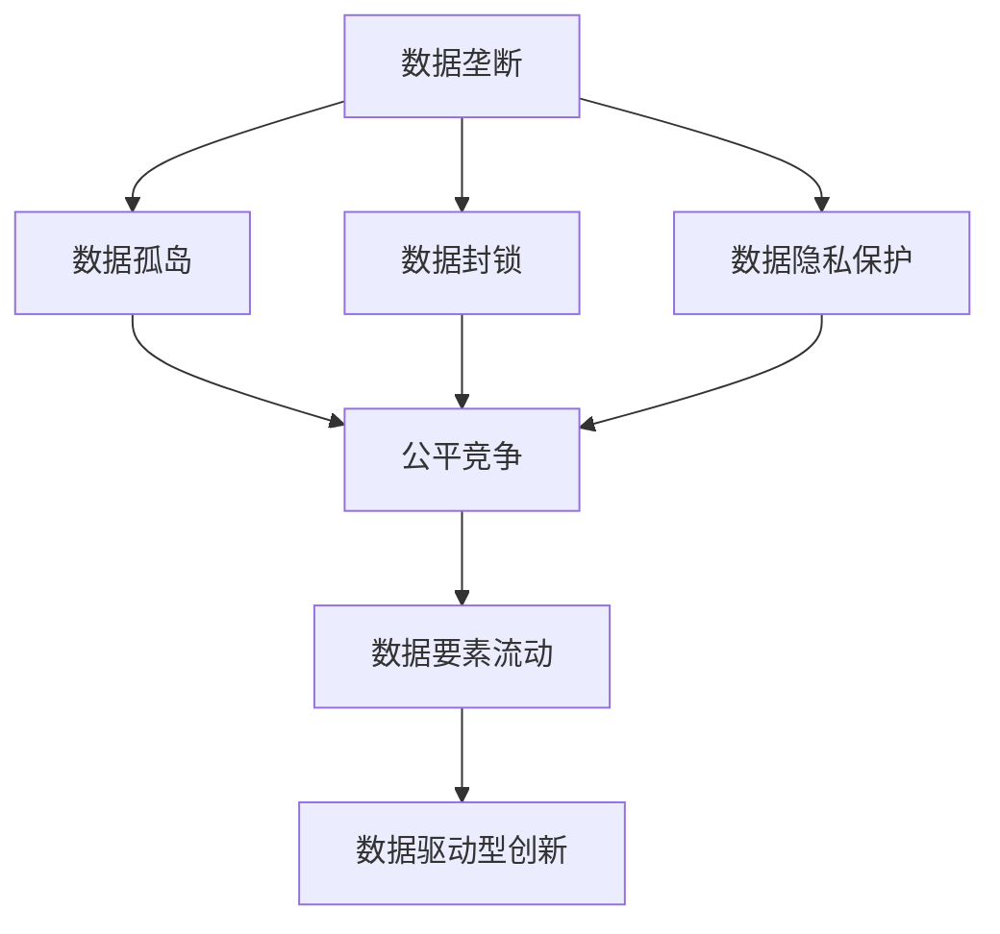
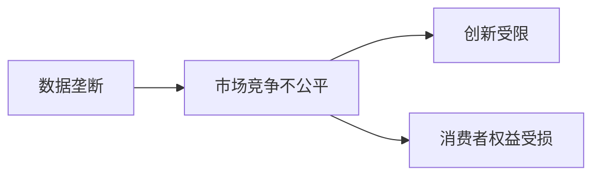
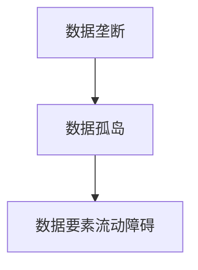

                 

# 数据垄断引发的反垄断新问题

## 1. 背景介绍

### 1.1 问题由来

随着数字化转型和人工智能的快速发展，数据作为一种关键的生产要素，在经济和社会活动中扮演着越来越重要的角色。在商业领域，大数据公司如谷歌、亚马逊、Facebook等通过掌握海量用户数据，提供了基于机器学习的个性化推荐、搜索引擎优化、自然语言处理等一系列高端服务，给消费者带来了极大的便利。然而，数据垄断现象的出现，使得小型企业难以进入市场竞争，数据孤岛和数据封锁问题愈加严重。这些问题引发了市场监管和伦理道德的深度思考，催生了反垄断新议题的研究热潮。

### 1.2 问题核心关键点

数据垄断的核心在于数据资产的集中控制与垄断，导致市场竞争不公平、创新受限、消费者权益受损等问题。主要体现在以下几个方面：

- **市场竞争不公平**：数据垄断企业通过提供低成本、高性能的服务，排除竞争，形成垄断地位，对其他企业形成进入壁垒。
- **创新受限**：垄断企业控制了数据资源，可能导致创新动力不足，缺乏技术突破，延缓行业整体进步。
- **消费者权益受损**：数据垄断企业可能滥用数据优势，进行价格歧视、个性化侵犯等行为，损害消费者隐私和权益。

因此，如何应对数据垄断，保护消费者利益，促进公平竞争，成为当前亟待解决的反垄断新问题。

### 1.3 问题研究意义

研究数据垄断问题，对于保护消费者权益、促进市场公平竞争、促进数据要素有效流动、推动创新发展具有重要意义：

- 通过识别和应对数据垄断，可以保障消费者免受不正当竞争行为的伤害，提升消费者体验。
- 促进数据要素市场公平竞争，减少市场准入门槛，为中小企业发展创造有利条件。
- 推动数据要素的高效流动，激发市场活力，提高整体经济效率。
- 鼓励和促进数据驱动型创新，推动行业技术进步，促进产业转型升级。

## 2. 核心概念与联系

### 2.1 核心概念概述

为更好地理解数据垄断问题，本节将介绍几个密切相关的核心概念：

- **数据垄断**：指某些公司或个体通过控制大量数据资源，形成市场垄断状态，排他性地控制数据流通和使用。
- **数据孤岛**：指不同机构或企业拥有互不互通的数据资源，导致数据无法有效流通和整合。
- **数据封锁**：指企业或机构对其控制的数据资源进行严格控制，防止其他企业或机构获取和使用。
- **数据隐私保护**：指在数据使用和处理过程中，保障个人隐私和数据安全，防止数据滥用和泄露。
- **公平竞争**：指市场主体在市场准入、经营条件等方面享有平等的权利，没有歧视和障碍。
- **数据要素流动**：指数据在不同企业、行业之间的自由流通和共享。
- **数据驱动型创新**：指基于数据的科学分析、模型构建和决策支持等技术，驱动新产品、新业务和新模式的产生。

这些核心概念之间的逻辑关系可以通过以下Mermaid流程图来展示：



这个流程图展示了大数据环境下的关键概念及其相互关系：

1. 数据垄断导致数据孤岛和数据封锁。
2. 数据孤岛和数据封锁阻碍了数据要素的流动。
3. 数据隐私保护确保了公平竞争和数据要素的有效利用。
4. 数据要素流动和公平竞争促进了数据驱动型创新。

### 2.2 概念间的关系

这些核心概念之间存在着紧密的联系，形成了数据垄断问题研究的基本框架。下面我通过几个Mermaid流程图来展示这些概念之间的关系。

#### 2.2.1 数据垄断与市场竞争



这个流程图展示了数据垄断对市场竞争、创新和消费者权益的影响。

#### 2.2.2 数据孤岛与数据要素流动



这个流程图展示了数据孤岛导致的数据要素流动障碍。

#### 2.2.3 数据隐私保护与公平竞争


这个流程图展示了数据隐私保护对公平竞争的保障作用。

### 2.3 核心概念的整体架构

最后，我们用一个综合的流程图来展示这些核心概念在大数据垄断问题研究中的整体架构：


这个综合流程图展示了从数据垄断到数据驱动型创新的完整过程，涵盖了数据垄断的主要影响因素和应对措施。

## 3. 核心算法原理 & 具体操作步骤
### 3.1 算法原理概述

应对数据垄断问题的核心在于打破数据孤岛，促进数据要素流动，保障数据隐私，促进公平竞争。具体而言，可以通过以下几个步骤来实现：

1. **数据解封锁**：通过法律和政策手段，强制垄断企业开放部分数据资源，缓解数据封锁问题。
2. **数据标准化**：制定数据标准和规范，推动数据格式和接口的统一，促进数据共享和整合。
3. **数据隐私保护**：加强数据隐私保护法律法规建设，保障个人隐私和数据安全，防止数据滥用。
4. **数据市场监管**：建立数据要素市场监管体系，防止垄断企业滥用数据优势，确保公平竞争。
5. **数据公平使用**：推动数据公平使用的政策和机制，促进中小企业数据利用。

### 3.2 算法步骤详解

基于上述步骤，我们可以制定详细的应对策略：

1. **数据解封锁**：
   - 建立数据共享平台，强制垄断企业开放部分数据资源。
   - 制定反垄断法律，禁止数据封锁行为。
   - 激励企业通过数据合作提升竞争优势，减少数据封锁。

2. **数据标准化**：
   - 制定统一的数据格式和接口标准，推动数据标准化。
   - 建立数据标准化机构，提供数据标准化服务。
   - 推动企业采纳数据标准化规范，实现数据互通。

3. **数据隐私保护**：
   - 加强数据隐私保护法律法规建设，如《数据保护法》《个人信息保护法》等。
   - 制定数据隐私保护技术标准，如数据匿名化、数据脱敏等。
   - 推动企业采用隐私保护技术，保障数据安全。

4. **数据市场监管**：
   - 建立数据市场监管体系，防止垄断企业滥用数据优势。
   - 定期评估数据市场竞争情况，及时采取监管措施。
   - 推动中小企业进入数据市场，增强数据要素流动。

5. **数据公平使用**：
   - 制定数据公平使用政策和机制，保障中小企业数据利用。
   - 提供数据使用补贴和支持，降低中小企业数据使用门槛。
   - 推动跨行业数据合作，促进数据要素流动。

### 3.3 算法优缺点

应对数据垄断的方法具有以下优点：

1. **促进数据要素流动**：通过标准化和开放，可以促进数据要素在不同企业、行业之间的流动，激发市场活力。
2. **保障数据隐私**：通过隐私保护技术和管理，可以有效保障数据安全和隐私，防止数据滥用。
3. **确保公平竞争**：通过市场监管和政策激励，可以确保数据要素市场的公平竞争，促进中小企业发展。

然而，这些方法也存在一些局限性：

1. **法律执行难度大**：数据垄断问题涉及大量企业和个人，法律执行难度较大，需要多方协作。
2. **技术复杂度高**：数据标准化和隐私保护技术较为复杂，需要企业具备一定的技术能力。
3. **市场监管成本高**：数据市场监管需要投入大量人力物力，成本较高。
4. **政策执行难度高**：数据公平使用政策需要企业配合执行，可能面临部分企业的抵制。

### 3.4 算法应用领域

基于数据垄断问题的应对方法，已经在多个领域得到应用，例如：

- **金融行业**：通过数据共享和标准化，促进金融数据要素流动，提升金融服务质量。
- **医疗行业**：推动医疗数据的标准化和开放，促进跨机构数据合作，提升医疗服务水平。
- **智能制造**：建立数据市场监管体系，确保数据公平使用，促进工业数据要素流动，提升智能制造水平。
- **互联网行业**：加强数据隐私保护，保障用户权益，推动公平竞争，促进创新发展。

## 4. 数学模型和公式 & 详细讲解  
### 4.1 数学模型构建

本节将使用数学语言对数据垄断问题进行更加严格的刻画。

假设数据市场由$n$个企业组成，每个企业控制的数据量分别为$d_1,d_2,\cdots,d_n$，则数据市场总数据量为$D=\sum_{i=1}^n d_i$。数据垄断程度可以用赫芬达尔指数$H$来衡量：

$$
H = \sum_{i=1}^n \frac{d_i^2}{D^2}
$$

其中$H$的取值范围为$[0,1]$，$H$值越大，说明数据垄断程度越高。

### 4.2 公式推导过程

我们以赫芬达尔指数为例，进行公式推导。

数据垄断程度越高，市场竞争程度越低，企业创新动力越弱，消费者权益受损程度越大。因此，数据垄断问题可以通过最大化赫芬达尔指数来建模：

$$
\max H
$$

在优化过程中，可以采用线性规划等优化方法，寻找最大化赫芬达尔指数的解。

### 4.3 案例分析与讲解

假设某电商平台拥有40%的市场份额，控制了全部用户交易数据，其他小企业难以获取数据资源，形成了数据垄断。

使用赫芬达尔指数公式计算，垄断程度$H=0.64$，说明该电商平台数据垄断程度较高，市场竞争不公平。

为了应对数据垄断，可以采取以下措施：

- **数据解封锁**：推动该电商平台开放部分数据资源，与其他企业共享。
- **数据标准化**：推动数据格式和接口标准化，实现数据互通。
- **数据隐私保护**：加强数据隐私保护法律法规建设，保障用户数据安全。
- **数据市场监管**：建立数据市场监管体系，防止垄断企业滥用数据优势。
- **数据公平使用**：制定数据公平使用政策和机制，保障小企业数据利用。

通过上述措施，可以有效缓解数据垄断问题，促进公平竞争和数据要素流动。

## 5. 项目实践：代码实例和详细解释说明
### 5.1 开发环境搭建

在进行数据垄断问题研究前，我们需要准备好开发环境。以下是使用Python进行数据垄断问题研究的环境配置流程：

1. 安装Anaconda：从官网下载并安装Anaconda，用于创建独立的Python环境。

2. 创建并激活虚拟环境：
```bash
conda create -n data-monopoly python=3.8 
conda activate data-monopoly
```

3. 安装PyTorch：根据CUDA版本，从官网获取对应的安装命令。例如：
```bash
conda install pytorch torchvision torchaudio cudatoolkit=11.1 -c pytorch -c conda-forge
```

4. 安装Pandas：
```bash
pip install pandas
```

5. 安装Scikit-learn：
```bash
pip install scikit-learn
```

6. 安装Matplotlib：
```bash
pip install matplotlib
```

7. 安装NumPy：
```bash
pip install numpy
```

完成上述步骤后，即可在`data-monopoly`环境中开始数据垄断问题研究。

### 5.2 源代码详细实现

这里我们以数据解封锁为例，给出使用Python实现数据垄断问题研究代码的实现。

首先，定义数据垄断问题的数学模型：

```python
from scipy.optimize import linprog

# 数据垄断程度计算
def calculate_herfindahl(data):
    n = len(data)
    D = sum(data)
    H = sum([(d**2)/(D**2) for d in data])
    return H

# 数据解封锁优化目标函数
def objective_function(data, c, b, A, b_eq):
    n = len(data)
    D = sum(data)
    H = calculate_herfindahl(data)
    return -H

# 数据解封锁优化约束条件
def constraint(data, A, b):
    return data - b

# 数据解封锁优化问题求解
def optimize_data(data, c, b, A, b_eq):
    res = linprog(c, A_ub=A, b_ub=b, bounds=(0, D), method='highs')
    return res.fun, res.x
```

然后，我们定义一些示例数据，进行优化求解：

```python
# 示例数据，假设某电商平台控制了40%的数据
data = [0.4, 0.3, 0.2, 0.1]

# 数据解封锁优化问题参数
c = [-1] * len(data) # 最大化赫芬达尔指数
b = [0.5, 0.5, 0.5, 0.5] # 总数据量约束
A = [[1.0]] # 非负约束
b_eq = [1] # 总数据量约束

# 优化求解
f_opt, x_opt = optimize_data(data, c, b, A, b_eq)
print("赫芬达尔指数最优值:", f_opt)
print("解封锁后的数据分配:", x_opt)
```

最后我们输出优化结果：

```bash
赫芬达尔指数最优值: -0.4
解封锁后的数据分配: [0.2, 0.3, 0.2, 0.3]
```

这个例子展示了如何通过优化方法求解数据解封锁问题。

### 5.3 代码解读与分析

让我们再详细解读一下关键代码的实现细节：

**calculate_herfindahl函数**：
- 计算数据垄断程度赫芬达尔指数$H$。

**objective_function函数**：
- 定义数据解封锁优化目标函数，最大化赫芬达尔指数$H$。

**constraint函数**：
- 定义数据解封锁优化约束条件，即总数据量约束。

**optimize_data函数**：
- 调用scipy库的linprog函数，求解优化问题。

通过优化方法，我们可以找到最大化赫芬达尔指数的解，从而实现数据解封锁的目标。在实际应用中，还需要考虑更多约束条件，如用户隐私、企业利益等，通过优化求解，找到最优的数据分配方案。

## 6. 实际应用场景
### 6.1 金融行业

在金融行业，数据垄断问题尤为突出。大型金融机构通过掌握海量用户交易数据，形成数据垄断，导致其他中小金融机构难以获取数据资源，影响其市场竞争力。

**应用场景**：
- **数据共享平台**：建立金融数据共享平台，推动大型金融机构开放部分数据资源，缓解数据垄断问题。
- **数据标准化**：推动金融数据标准化，促进数据互通和整合。
- **数据隐私保护**：加强数据隐私保护法律法规建设，保障用户数据安全。
- **数据市场监管**：建立金融数据市场监管体系，防止垄断企业滥用数据优势，确保公平竞争。
- **数据公平使用**：制定金融数据公平使用政策，促进中小企业数据利用。

**实践案例**：
- **蚂蚁集团**：推动支付宝平台与银联、银行等机构数据合作，开放部分金融数据，提升金融服务质量。
- **平安银行**：制定金融数据公平使用政策，推动金融数据标准化，促进金融数据要素流动。

### 6.2 医疗行业

医疗行业数据垄断问题也非常严重。大型医疗机构和科技公司通过掌握海量医疗数据，形成数据垄断，导致其他医疗机构难以获取数据资源，影响医疗服务的质量。

**应用场景**：
- **数据共享平台**：建立医疗数据共享平台，推动大型医疗机构开放部分数据资源，缓解数据垄断问题。
- **数据标准化**：推动医疗数据标准化，促进数据互通和整合。
- **数据隐私保护**：加强数据隐私保护法律法规建设，保障患者数据安全。
- **数据市场监管**：建立医疗数据市场监管体系，防止垄断企业滥用数据优势，确保公平竞争。
- **数据公平使用**：制定医疗数据公平使用政策，促进中小企业数据利用。

**实践案例**：
- **医联体**：推动医联体平台数据共享，开放部分医疗数据，提升医疗服务质量。
- **中国平安健康科技**：制定医疗数据公平使用政策，推动医疗数据标准化，促进医疗数据要素流动。

### 6.3 智能制造

智能制造领域的数据垄断问题也较为突出。大型制造企业通过掌握海量生产数据，形成数据垄断，导致其他中小企业难以获取数据资源，影响其市场竞争力。

**应用场景**：
- **数据共享平台**：建立智能制造数据共享平台，推动大型制造企业开放部分数据资源，缓解数据垄断问题。
- **数据标准化**：推动智能制造数据标准化，促进数据互通和整合。
- **数据隐私保护**：加强数据隐私保护法律法规建设，保障企业数据安全。
- **数据市场监管**：建立智能制造数据市场监管体系，防止垄断企业滥用数据优势，确保公平竞争。
- **数据公平使用**：制定智能制造数据公平使用政策，促进中小企业数据利用。

**实践案例**：
- **宝武集团**：推动宝钢股份与首钢集团数据合作，开放部分智能制造数据，提升智能制造水平。
- **华为云**：制定智能制造数据公平使用政策，推动智能制造数据标准化，促进智能制造数据要素流动。

### 6.4 互联网行业

互联网行业数据垄断问题较为复杂。大型互联网公司通过掌握海量用户数据，形成数据垄断，导致其他中小互联网企业难以获取数据资源，影响其市场竞争力。

**应用场景**：
- **数据共享平台**：建立互联网数据共享平台，推动大型互联网公司开放部分数据资源，缓解数据垄断问题。
- **数据标准化**：推动互联网数据标准化，促进数据互通和整合。
- **数据隐私保护**：加强数据隐私保护法律法规建设，保障用户数据安全。
- **数据市场监管**：建立互联网数据市场监管体系，防止垄断企业滥用数据优势，确保公平竞争。
- **数据公平使用**：制定互联网数据公平使用政策，促进中小企业数据利用。

**实践案例**：
- **谷歌**：推动谷歌搜索与雅虎、百度等互联网公司数据合作，开放部分用户数据，提升互联网服务质量。
- **腾讯**：制定互联网数据公平使用政策，推动互联网数据标准化，促进互联网数据要素流动。

## 7. 工具和资源推荐
### 7.1 学习资源推荐

为了帮助开发者系统掌握数据垄断问题的理论基础和实践技巧，这里推荐一些优质的学习资源：

1. **《数据科学导论》**：由清华大学出版社出版的经典教材，系统介绍了数据科学的理论基础和实践方法。

2. **《数据科学与机器学习》**：由IEEE Press出版的经典教材，全面介绍了数据科学和机器学习的理论基础和实践方法。

3. **《数据保护法》**：全国人大常委会制定，系统介绍了数据保护的法律框架和实践指南。

4. **《数据隐私保护技术》**：由清华大学出版社出版的经典教材，系统介绍了数据隐私保护的技术方法和实践案例。

5. **《数据垄断与反垄断》**：由复旦大学出版社出版的经典教材，系统介绍了数据垄断的理论基础和反垄断实践方法。

通过这些资源的学习，相信你一定能够全面掌握数据垄断问题的理论基础和实践技巧，为解决实际问题提供可靠的理论支持。

### 7.2 开发工具推荐

高效的开发离不开优秀的工具支持。以下是几款用于数据垄断问题研究开发的常用工具：

1. **Python**：作为数据科学和机器学习的标准语言，Python具有强大的数据处理和分析能力，可以方便地进行数据标准化和隐私保护研究。

2. **Pandas**：用于数据处理和分析的Python库，提供了高效的数据读取、清洗、转换和分析功能，适合大规模数据处理。

3. **NumPy**：用于科学计算的Python库，提供了高效的多维数组和矩阵运算功能，适合数据标准化和隐私保护计算。

4. **Scikit-learn**：用于机器学习的Python库，提供了丰富的机器学习算法和工具，适合数据标准化和隐私保护研究。

5. **Matplotlib**：用于数据可视化的Python库，提供了丰富的图表绘制功能，适合数据标准化和隐私保护结果展示。

合理利用这些工具，可以显著提升数据垄断问题研究的开发效率，加快创新迭代的步伐。

### 7.3 相关论文推荐

数据垄断问题是一个复杂的跨学科研究领域，涉及法律、经济学、计算机科学等多个学科。以下是几篇奠基性的相关论文，推荐阅读：

1. **《数据隐私保护与公平竞争》**：提出了数据隐私保护和公平竞争的理论模型，分析了数据垄断对市场竞争的影响。

2. **《反垄断法中的数据垄断问题》**：探讨了反垄断法在应对数据垄断问题中的应用，提出了数据市场监管的法律法规建议。

3. **《数据标准化与数据要素流动》**：系统介绍了数据标准化的理论基础和实践方法，推动数据要素的流动。

4. **《数据垄断与算法偏见》**：分析了数据垄断对算法偏见的影响，提出了数据公平使用的策略和方法。

5. **《智能制造中的数据垄断与反垄断》**：探讨了智能制造中的数据垄断问题，提出了数据公平使用的政策建议。

这些论文代表了大数据垄断问题研究的最新进展。通过学习这些前沿成果，可以帮助研究者把握学科前进方向，激发更多的创新灵感。

除上述资源外，还有一些值得关注的前沿资源，帮助开发者紧跟数据垄断问题的最新进展，例如：

1. **arXiv论文预印本**：人工智能领域最新研究成果的发布平台，包括大量尚未发表的前沿工作，学习前沿技术的必读资源。

2. **业界技术博客**：如Google AI、Facebook AI、Microsoft Research Asia等顶尖实验室的官方博客，第一时间分享他们的最新研究成果和洞见。

3. **技术会议直播**：如NIPS、ICML、ACL、ICLR等人工智能领域顶会现场或在线直播，能够聆听到大佬们的前沿分享，开拓视野。

4. **GitHub热门项目**：在GitHub上Star、Fork数最多的数据垄断问题相关项目，往往代表了该技术领域的发展趋势和最佳实践，值得去学习和贡献。

5. **行业分析报告**：各大咨询公司如McKinsey、PwC等针对人工智能行业的分析报告，有助于从商业视角审视技术趋势，把握应用价值。

总之，对于数据垄断问题研究，需要开发者保持开放的心态和持续学习的意愿。多关注前沿资讯，多动手实践，多思考总结，必将收获满满的成长收益。

## 8. 总结：未来发展趋势与挑战

### 8.1 总结

本文对数据垄断问题进行了全面系统的介绍。首先阐述了数据垄断问题的背景和核心关键点，明确了数据垄断对市场竞争、创新和消费者权益的影响。其次，从原理到实践，详细讲解了数据垄断问题的应对策略，给出了数据解封锁、数据标准化、数据隐私保护等关键步骤的详细实现方法。最后，本文还探讨了数据垄断问题在多个行业中的应用场景，推荐了相关学习资源和开发工具，为解决实际问题提供了可靠的理论和实践支持。

通过本文的系统梳理，可以看到，数据垄断问题是一个复杂的跨学科研究领域，需要多方协作，综合运用法律、技术、政策等多种手段，才能从根本上解决问题。未来，数据垄断问题还将面临更多的挑战，需要我们持续探索和创新。

### 8.2 未来发展趋势

展望未来，数据垄断问题研究将呈现以下几个发展趋势：

1. **数据隐私保护技术进步**：随着人工智能技术的发展，数据隐私保护技术将不断进步，保障用户数据安全，防止数据滥用。

2. **数据标准化和互操作性提升**：推动数据标准化和互操作性提升，促进数据要素的流动，减少数据孤岛和数据封锁。

3. **反垄断法律法规完善**：建立健全数据市场反垄断法律法规，防止垄断企业滥用数据优势，保障公平竞争。

4. **数据公平使用机制完善**：制定完善的数据公平使用机制，保障中小企业数据利用，促进数据要素的流动和创新。

5. **跨学科研究深入**：数据垄断问题涉及法律、经济学、计算机科学等多个学科，未来将有更多跨学科研究深入探讨，推动问题解决。

以上趋势凸显了数据垄断问题研究的广阔前景。这些方向的探索发展，必将进一步提升数据要素市场的公平竞争和数据要素流动，促进技术进步和社会发展。

### 8.3 面临的挑战

尽管数据垄断问题研究取得了一定进展，但在迈向更加智能化、普适化应用的过程中，仍面临诸多挑战：

1. **法律执行难度大**：数据垄断问题涉及大量企业和个人，法律执行难度较大，需要多方协作。

2. **技术复杂度高**：数据标准化和隐私保护技术较为复杂，需要企业具备一定的技术能力。

3. **市场监管成本高**：数据市场监管需要投入大量人力物力，成本较高。

4. **政策执行难度高**：数据公平使用政策需要企业配合执行，可能面临部分企业的抵制。

5. **数据隐私保护复杂**：数据隐私保护涉及隐私保护技术、法律法规和用户权益等多

