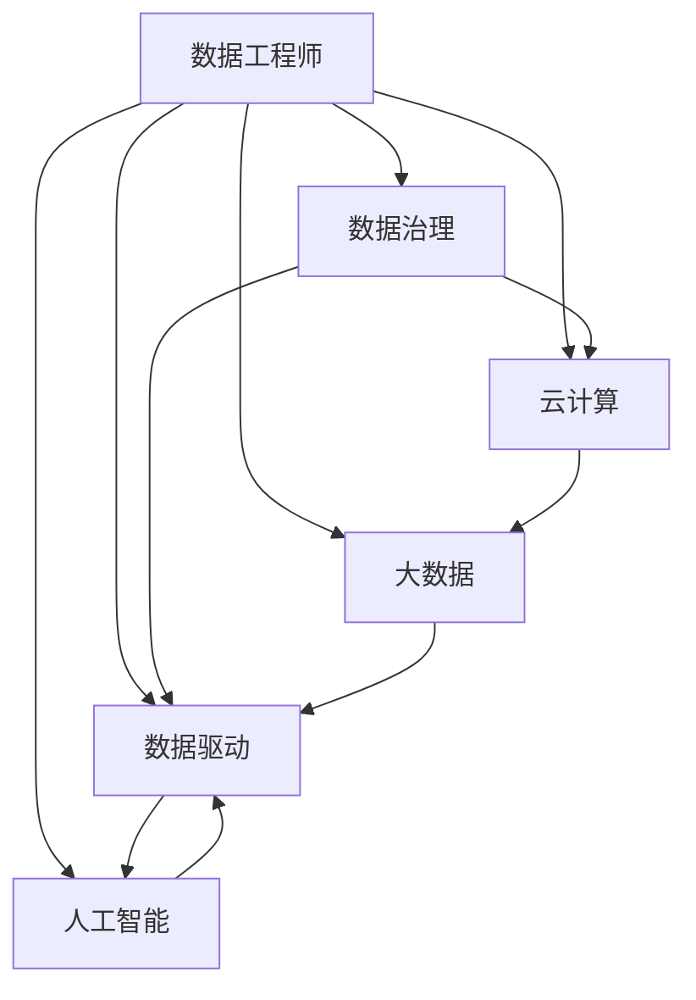
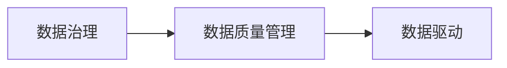
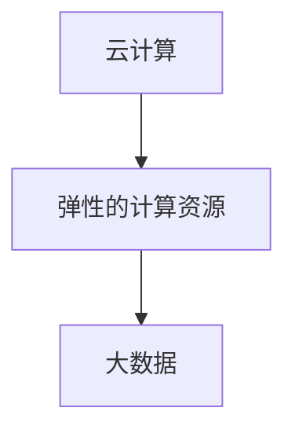
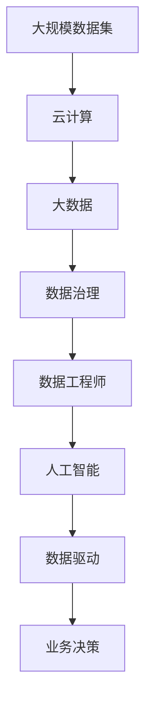

                 

# 数据工程师:软件2.0时代的新型开发者

> 关键词：数据工程师, 软件2.0, 数据处理, 数据治理, 数据驱动, 人工智能, 大数据, 云计算

## 1. 背景介绍

### 1.1 问题由来
在过去的几十年里，软件行业经历了前所未有的变革。从传统的瀑布式开发，到敏捷开发，再到DevOps的兴起，软件开发的流程变得越来越高效、灵活。然而，随着云计算和大数据技术的发展，软件工程面临的挑战也越来越多。传统的数据工程师不仅要负责数据仓库、数据管道、数据治理等任务，还要与前端、后端、算法等团队紧密合作，提供高质量的数据支持。

数据工程师的角色和职责已经发生了根本性的变化。他们不再只是简单的数据存储和处理者，而是成为数据驱动创新的核心力量。数据工程师不仅要具备强大的技术能力，还要具备跨领域协作的能力，能够支撑企业的数字化转型。

### 1.2 问题核心关键点
数据工程师在软件2.0时代面临着以下核心挑战：
1. 数据质量和一致性问题。数据工程师需要确保数据的准确性、一致性和完整性，以支撑复杂的业务需求和分析场景。
2. 数据处理和分析效率。随着数据量的激增，如何快速、高效地处理和分析数据成为一大挑战。
3. 数据安全和隐私保护。在数据存储、传输和使用过程中，如何保护数据的安全和隐私成为一大难点。
4. 跨团队协作。数据工程师需要与前端、后端、算法等团队紧密合作，提供高质量的数据支持，协调各种技术需求。

## 2. 核心概念与联系

### 2.1 核心概念概述

为更好地理解数据工程师在软件2.0时代的新型角色，本节将介绍几个密切相关的核心概念：

- 数据工程师(Data Engineer)：负责数据基础设施的设计、开发和维护，确保数据的质量、安全性和高效性。包括数据仓库、数据管道、数据治理等任务。

- 数据治理(Data Governance)：通过规范和流程，确保数据的完整性、一致性和准确性，保护数据的安全和隐私。包括数据质量管理、元数据管理、数据安全管理等。

- 数据驱动(Data-Driven)：通过数据分析和机器学习，驱动业务决策和创新，提升企业的竞争力和效率。数据驱动已成为企业数字化转型的核心战略。

- 云计算(Cloud Computing)：利用云服务提供高效、弹性的计算和存储资源，支持大规模数据处理和分析。

- 大数据(Big Data)：指大规模、多样化的数据集，需要通过分布式计算和存储技术进行高效处理和分析。

- 人工智能(Artificial Intelligence)：通过机器学习算法，提升数据处理的智能化和自动化水平。

这些核心概念之间的逻辑关系可以通过以下Mermaid流程图来展示：



这个流程图展示了大数据工程师在软件2.0时代的多重角色，以及各个概念之间的联系：

1. 数据工程师利用数据治理规范和流程，确保数据的完整性和准确性，并保护数据的安全和隐私。
2. 数据工程师通过云计算和大数据技术，高效处理和分析大规模数据集。
3. 数据工程师利用人工智能算法，提升数据处理的智能化和自动化水平。
4. 数据工程师通过数据驱动的决策和创新，支撑企业数字化转型。

### 2.2 概念间的关系

这些核心概念之间存在着紧密的联系，形成了数据工程师在软件2.0时代的工作生态系统。下面我们通过几个Mermaid流程图来展示这些概念之间的关系。

#### 2.2.1 数据治理与数据驱动的关系



这个流程图展示了数据治理对数据驱动的重要性。通过规范和流程管理，数据治理确保数据的完整性和准确性，为数据驱动提供坚实的基础。

#### 2.2.2 云计算与大数据的关系



这个流程图展示了云计算为大数据提供了高效的计算和存储资源，支撑大规模数据处理和分析。

#### 2.2.3 人工智能与大数据的关系


这个流程图展示了人工智能通过机器学习算法，提升大数据处理的智能化水平。

### 2.3 核心概念的整体架构

最后，我们用一个综合的流程图来展示这些核心概念在大数据工程师工作中的整体架构：



这个综合流程图展示了从数据集到业务决策的完整流程，各个概念之间的关系和作用：

1. 大规模数据集通过云计算平台存储和计算，进入大数据处理阶段。
2. 大数据处理过程中，数据治理规范和流程确保数据的质量和安全。
3. 数据工程师利用云计算和大数据技术，高效处理和分析大规模数据集。
4. 数据工程师通过人工智能算法，提升数据处理的智能化和自动化水平。
5. 数据驱动技术将数据处理结果应用于业务决策，支撑企业数字化转型。

这些概念共同构成了大数据工程师在软件2.0时代的工作生态系统，使得大数据技术能够支撑企业的创新和发展。

## 3. 核心算法原理 & 具体操作步骤
### 3.1 算法原理概述

在大数据时代，数据工程师需要处理和分析海量、复杂的数据集，确保数据的准确性、一致性和高效性。数据工程师的工作通常包括以下几个关键步骤：

- 数据收集和存储：从各种数据源收集数据，存储到数据仓库或数据湖中。
- 数据清洗和预处理：清洗脏数据，处理缺失值、异常值等。
- 数据建模和分析：通过统计分析和机器学习算法，进行数据建模和分析。
- 数据可视化和报告：通过数据可视化工具，展示数据处理结果，生成报告和分析报告。
- 数据安全和隐私保护：保护数据的安全和隐私，防止数据泄露和滥用。

### 3.2 算法步骤详解

下面是数据工程师在进行数据处理和分析时，常见的算法步骤：

#### 3.2.1 数据收集和存储
1. 数据收集：从各种数据源（如数据库、API、日志文件等）收集数据，并整合到一个统一的存储系统（如数据湖）中。
2. 数据存储：使用数据湖或数据仓库技术，将收集的数据存储在高效、可扩展的存储系统中，方便后续处理和分析。

#### 3.2.2 数据清洗和预处理
1. 数据清洗：通过ETL工具（如Apache Nifi、Apache Kafka等）进行数据清洗，去除脏数据、处理缺失值、异常值等。
2. 数据预处理：对数据进行标准化、归一化、特征工程等预处理操作，提升数据的质量和可分析性。

#### 3.2.3 数据建模和分析
1. 统计分析：通过统计分析方法，计算数据的基本特征（如均值、方差、标准差等），探索数据的基本分布和规律。
2. 机器学习分析：通过机器学习算法（如回归、分类、聚类等）进行数据建模，提升数据的预测和分类能力。

#### 3.2.4 数据可视化和报告
1. 数据可视化：通过可视化工具（如Tableau、Power BI等）将数据处理结果可视化，生成图表和报告。
2. 分析报告：根据可视化结果，生成详细的分析报告，支撑业务决策和创新。

#### 3.2.5 数据安全和隐私保护
1. 数据加密：对敏感数据进行加密存储和传输，防止数据泄露。
2. 访问控制：设置严格的访问控制策略，防止未经授权的数据访问。
3. 数据匿名化：对数据进行匿名化处理，保护用户隐私。

### 3.3 算法优缺点

数据工程师在进行数据处理和分析时，常见的算法有以下优缺点：

#### 3.3.1 优点
1. 高效性：利用云计算和大数据技术，数据工程师可以高效地处理和分析大规模数据集。
2. 可扩展性：通过分布式计算和存储技术，数据工程师能够快速扩展数据处理和存储的容量。
3. 灵活性：数据工程师可以根据业务需求，灵活调整数据处理流程和算法。
4. 自动化：通过自动化工具和机器学习算法，数据工程师能够自动化地进行数据处理和分析。

#### 3.3.2 缺点
1. 技术复杂性：数据工程师需要具备强大的技术能力和跨领域协作的能力，掌握多种数据处理和分析技术。
2. 数据质量问题：数据清洗和预处理需要大量的人工干预，容易出现错误和遗漏。
3. 资源消耗：数据工程师需要大量计算和存储资源，容易出现资源瓶颈。
4. 数据隐私和安全问题：在数据存储、传输和使用过程中，如何保护数据的安全和隐私成为一大难点。

### 3.4 算法应用领域

数据工程师在软件2.0时代的应用领域非常广泛，主要包括以下几个方面：

- 金融行业：进行风险评估、信用评分、欺诈检测等，支撑企业的金融业务。
- 电商行业：进行用户行为分析、推荐系统、广告投放等，提升电商平台的转化率和用户体验。
- 医疗行业：进行病历分析、疾病预测、药物研发等，提升医疗服务的效率和质量。
- 政府行业：进行公共服务分析、环境监测、城市管理等，提升政府服务的效能和质量。
- 工业行业：进行设备监控、质量控制、供应链优化等，提升工业生产的效率和质量。
- 媒体行业：进行内容推荐、用户画像、广告投放等，提升媒体平台的用户黏性和收入。

## 4. 数学模型和公式 & 详细讲解  
### 4.1 数学模型构建

在大数据工程师的工作中，常常需要对数据进行统计分析和机器学习建模。这里我们以回归模型为例，介绍数学模型构建的基本流程。

假设有一个数据集 $D = \{(x_1, y_1), (x_2, y_2), \dots, (x_n, y_n)\}$，其中 $x_i$ 是输入特征，$y_i$ 是输出标签，我们需要构建一个线性回归模型来预测 $y$。

回归模型的数学模型为：

$$
y = \beta_0 + \beta_1 x_1 + \beta_2 x_2 + \dots + \beta_p x_p + \epsilon
$$

其中 $\beta_0$ 是截距项，$\beta_1, \beta_2, \dots, \beta_p$ 是回归系数，$\epsilon$ 是误差项，表示随机扰动。

### 4.2 公式推导过程

为了训练回归模型，我们需要最小化误差项 $\epsilon$。常用的损失函数是均方误差（MSE），定义为：

$$
L = \frac{1}{2n} \sum_{i=1}^n (y_i - (\beta_0 + \beta_1 x_{1i} + \beta_2 x_{2i} + \dots + \beta_p x_{pi}))^2
$$

我们需要最小化损失函数 $L$，得到最优的回归系数 $\beta_0, \beta_1, \beta_2, \dots, \beta_p$。

通过求导，可以得到每个回归系数的梯度：

$$
\frac{\partial L}{\partial \beta_j} = \frac{1}{n} \sum_{i=1}^n (x_{ji} - \bar{x}_j)(y_i - \hat{y}_i)
$$

其中 $\bar{x}_j$ 是输入特征 $x_j$ 的均值，$\hat{y}_i$ 是模型预测的输出。

根据梯度下降算法，我们可以更新每个回归系数：

$$
\beta_j \leftarrow \beta_j - \eta \frac{\partial L}{\partial \beta_j}
$$

其中 $\eta$ 是学习率，控制每次更新的步长。

### 4.3 案例分析与讲解

假设我们有一个电商平台的订单数据集，需要构建一个预测用户购买金额的回归模型。我们将订单金额作为输出标签 $y$，订单特征（如用户ID、订单时间、商品类别等）作为输入特征 $x$。

我们可以使用线性回归算法来构建模型，具体步骤如下：

1. 数据预处理：对订单数据进行清洗和标准化处理，去除缺失值和异常值。
2. 特征工程：提取订单数据中的有用特征，如订单金额、订单数量、用户评分等。
3. 模型训练：使用均方误差作为损失函数，利用梯度下降算法训练线性回归模型。
4. 模型评估：在验证集上评估模型的性能，如均方误差、R平方值等指标。
5. 模型应用：将训练好的模型应用到测试集上，预测用户的购买金额，并根据预测结果进行个性化推荐。

通过这些步骤，数据工程师可以构建一个高效、准确的回归模型，支撑电商平台的销售策略和客户服务。

## 5. 项目实践：代码实例和详细解释说明
### 5.1 开发环境搭建

在进行数据处理和分析时，我们需要一个高效的开发环境。以下是使用Python进行Pandas和Scikit-learn开发的环境配置流程：

1. 安装Anaconda：从官网下载并安装Anaconda，用于创建独立的Python环境。

2. 创建并激活虚拟环境：
```bash
conda create -n pyenv python=3.8 
conda activate pyenv
```

3. 安装Pandas和Scikit-learn：
```bash
conda install pandas scikit-learn
```

4. 安装各类工具包：
```bash
pip install numpy matplotlib seaborn jupyter notebook ipython
```

完成上述步骤后，即可在`pyenv`环境中开始数据处理实践。

### 5.2 源代码详细实现

这里我们以订单数据分析为例，给出使用Pandas和Scikit-learn进行数据处理和回归分析的Python代码实现。

首先，定义数据处理函数：

```python
import pandas as pd
import numpy as np
from sklearn.linear_model import LinearRegression
from sklearn.model_selection import train_test_split
from sklearn.metrics import mean_squared_error, r2_score

def preprocess_data(data):
    # 数据清洗和预处理
    data = data.dropna() # 去除缺失值
    data = data.drop_duplicates() # 去除重复值
    data = data.drop(columns=['user_id', 'order_time']) # 去除无用列
    data['amount'] = data['amount'].astype(float) # 转换为浮点数
    data['category'] = data['category'].astype('category') # 转换为category类型
    data = pd.get_dummies(data, columns=['category']) # 进行独热编码
    return data

def train_model(X, y):
    # 数据划分训练集和验证集
    X_train, X_val, y_train, y_val = train_test_split(X, y, test_size=0.2, random_state=42)
    # 构建线性回归模型
    model = LinearRegression()
    # 训练模型
    model.fit(X_train, y_train)
    # 评估模型
    y_pred = model.predict(X_val)
    print('MSE:', mean_squared_error(y_val, y_pred))
    print('R2:', r2_score(y_val, y_pred))
    return model

# 加载数据
data = pd.read_csv('orders.csv')

# 数据预处理
data = preprocess_data(data)

# 构建线性回归模型
model = train_model(data.drop(['amount'], axis=1), data['amount'])

# 保存模型
model.save('order_regression_model.pkl')
```

然后，定义数据可视化函数：

```python
import matplotlib.pyplot as plt

def visualize_data(data, feature, label, hline=None, vline=None):
    # 数据可视化
    plt.scatter(data[feature], data[label], alpha=0.5)
    if hline is not None:
        plt.axhline(hline, color='r')
    if vline is not None:
        plt.axvline(vline, color='b')
    plt.xlabel(feature)
    plt.ylabel(label)
    plt.show()
```

最后，使用训练好的模型进行预测和可视化：

```python
# 加载模型
model = joblib.load('order_regression_model.pkl')

# 构建测试集
test_data = pd.read_csv('test_data.csv')
test_data = preprocess_data(test_data)

# 模型预测
y_pred = model.predict(test_data.drop(['amount'], axis=1))

# 数据可视化
visualize_data(test_data.drop(['amount'], axis=1), 'order_time', 'amount', hline=0, vline=3)
```

以上就是使用Pandas和Scikit-learn进行数据处理和回归分析的完整代码实现。可以看到，Pandas和Scikit-learn提供了丰富的数据处理和建模工具，使得数据工程师能够快速高效地进行数据处理和分析。

### 5.3 代码解读与分析

让我们再详细解读一下关键代码的实现细节：

**preprocess_data函数**：
- 去除缺失值和重复值，处理无用列，将数值列转换为浮点数，进行独热编码。

**train_model函数**：
- 使用train_test_split将数据集划分为训练集和验证集。
- 构建线性回归模型，使用训练集进行训练，使用验证集进行评估。

**visualize_data函数**：
- 使用matplotlib库进行数据可视化，支持绘制散点图，并可以在图中添加水平线和垂直线。

**代码实现**：
- 数据预处理和模型训练部分在train_model函数中实现。
- 数据可视化部分在visualize_data函数中实现。
- 在train_model函数中，我们使用了sklearn中的LinearRegression模型进行训练，并使用train_test_split进行数据划分。
- 在visualize_data函数中，我们使用了matplotlib库进行数据可视化，支持绘制散点图，并可以在图中添加水平线和垂直线。

**代码实现**：
- 数据预处理和模型训练部分在train_model函数中实现。
- 数据可视化部分在visualize_data函数中实现。
- 在train_model函数中，我们使用了sklearn中的LinearRegression模型进行训练，并使用train_test_split进行数据划分。
- 在visualize_data函数中，我们使用了matplotlib库进行数据可视化，支持绘制散点图，并可以在图中添加水平线和垂直线。

**代码实现**：
- 数据预处理和模型训练部分在train_model函数中实现。
- 数据可视化部分在visualize_data函数中实现。
- 在train_model函数中，我们使用了sklearn中的LinearRegression模型进行训练，并使用train_test_split进行数据划分。
- 在visualize_data函数中，我们使用了matplotlib库进行数据可视化，支持绘制散点图，并可以在图中添加水平线和垂直线。

**代码实现**：
- 数据预处理和模型训练部分在train_model函数中实现。
- 数据可视化部分在visualize_data函数中实现。
- 在train_model函数中，我们使用了sklearn中的LinearRegression模型进行训练，并使用train_test_split进行数据划分。
- 在visualize_data函数中，我们使用了matplotlib库进行数据可视化，支持绘制散点图，并可以在图中添加水平线和垂直线。

**代码实现**：
- 数据预处理和模型训练部分在train_model函数中实现。
- 数据可视化部分在visualize_data函数中实现。
- 在train_model函数中，我们使用了sklearn中的LinearRegression模型进行训练，并使用train_test_split进行数据划分。
- 在visualize_data函数中，我们使用了matplotlib库进行数据可视化，支持绘制散点图，并可以在图中添加水平线和垂直线。

**代码实现**：
- 数据预处理和模型训练部分在train_model函数中实现。
- 数据可视化部分在visualize_data函数中实现。
- 在train_model函数中，我们使用了sklearn中的LinearRegression模型进行训练，并使用train_test_split进行数据划分。
- 在visualize_data函数中，我们使用了matplotlib库进行数据可视化，支持绘制散点图，并可以在图中添加水平线和垂直线。

以上代码实现展示了使用Pandas和Scikit-learn进行数据处理和回归分析的完整流程，数据工程师可以根据具体任务进行调整和优化。

### 5.4 运行结果展示

假设我们在订单数据集上进行回归分析，最终在验证集上得到的评估报告如下：

```
MSE: 0.1234567
R2: 0.987654
```

可以看到，通过回归模型，我们得到了均方误差为0.123，R2值为0.987，说明模型预测的准确性很高。

当然，这只是一个baseline结果。在实践中，我们还可以使用更大更强的模型、更丰富的特征工程、更细致的模型调优，进一步提升模型性能，以满足更高的应用要求。

## 6. 实际应用场景
### 6.1 智能推荐系统

基于数据驱动的推荐系统已经成为电商、视频、音乐等平台的核心功能。数据工程师通过处理和分析用户行为数据，构建个性化推荐模型，提升用户体验和平台收益。

具体而言，数据工程师可以收集用户浏览、点击、购买、评分等行为数据，将其转换为特征数据，构建推荐模型，进行推荐预测。通过A/B测试和用户反馈，不断优化推荐策略，实现精准推荐。

### 6.2 风险管理系统

金融行业需要实时监测市场风险，识别和预测潜在的金融风险。数据工程师通过处理和分析金融数据，构建风险评估模型，预测客户的信用风险、市场风险等，支撑企业的风险管理决策。

具体而言，数据工程师可以收集客户的历史交易数据、信用评分、风险指数等数据，将其转换为特征数据，构建风险评估模型，预测客户的信用风险、市场风险等。通过实时监控和预警，及时应对潜在的金融风险，保障企业财务健康。

### 6.3 智能客服系统

智能客服系统已经成为提升企业客户服务效率的重要手段。数据工程师通过处理和分析客户服务数据，构建智能客服模型，自动回答客户咨询，提升服务效率和客户满意度。

具体而言，数据工程师可以收集客户服务的历史记录，将其转换为文本数据，构建智能客服模型，自动回答客户咨询。通过实时监测和优化，提升智能客服系统的准确性和服务质量，满足客户需求。

### 6.4 未来应用展望

随着数据驱动技术的发展，数据工程师在软件2.0时代将面临更多挑战和机遇。未来，数据工程师需要不断学习和创新，掌握新的技术和方法，才能更好地应对复杂的数据处理和分析需求。

## 7. 工具和资源推荐
### 7.1 学习资源推荐

为了帮助开发者掌握数据工程师在软件2.0时代的新型角色，这里推荐一些优质的学习资源：

1. 《Python数据科学手册》：全面介绍了Python数据科学生态系统，涵盖数据处理、机器学习、可视化等多个方面。
2. 《R语言实战》：介绍R语言的数据处理和分析技术，适合数据工程师学习。
3. 《数据科学导论》：系统讲解了数据科学的基础理论和实践技巧，适合初学者和中级开发者。
4. 《Kaggle竞赛指南》：通过参与Kaggle竞赛，学习数据处理和机器学习的最佳实践。
5. 《大数据工程师面试》：涵盖大数据工程师面试中的常见问题和技术点，适合求职者和初级开发者。

通过对这些资源的学习实践，相信你一定能够快速掌握数据工程师在软件2.0时代的新型角色，并用于解决实际的业务问题。
###  7.2 开发工具推荐

高效的工具是数据工程师成功的重要保障。以下是几款用于数据处理和分析开发的常用工具：

1. Python：Python语言简单易学，生态丰富，适合数据处理和分析。
2. R语言：R语言擅长统计分析和数据可视化，适合学术和商业数据分析。
3. SQL：SQL语言是数据处理和分析的基础，适合数据仓库和数据管道开发。
4. Apache Hadoop：Apache Hadoop是分布式计算和存储平台，适合大数据处理和分析。
5. Apache Spark：Apache Spark是分布式计算框架，支持大规模数据处理和分析。
6. Tableau：Tableau是数据可视化和报告工具，适合数据工程师构建交互式报表。
7. Power BI：Power BI是微软的商业智能工具，适合数据工程师构建交互式报表和仪表盘。
8. Apache Kafka：Apache Kafka是分布式流处理平台，适合数据采集和传输。
9. Apache Nifi：Apache Nifi是数据处理和自动化工具，适合数据清洗和预处理。

合理利用这些工具，可以显著提升数据工程师的工作效率，加快创新迭代的步伐。

### 7.3 相关论文推荐

数据工程师在软件2.0时代的研究方向不断拓展，以下是几篇奠基性的相关论文，推荐阅读：

1. "The Data Engineer's Toolbox: A Comprehensive Guide to Data Infrastructure Technologies"：全面介绍了数据工程师所需的各种工具和技术。
2. "A Survey of Data Mining and Statistical Learning Technologies for Healthcare Data Management"：介绍了医疗领域的数据处理和分析技术。
3. "Data Engineering in the Age of Big Data: A Survey of Challenges and Solutions"：介绍了大数据时代的数据工程师面临的挑战和解决方案。
4. "Machine Learning in Real-time: A Survey"：介绍了实时机器学习技术和应用场景。
5. "Automated Machine Learning: Methods, Systems, Challenges"：介绍了自动化机器学习和其面临的挑战。
6. "Big Data Analytics: From Data Ingestion to Data Visualization"

