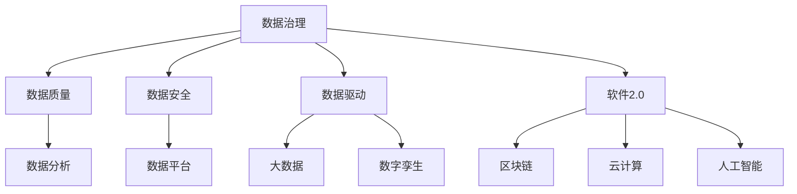
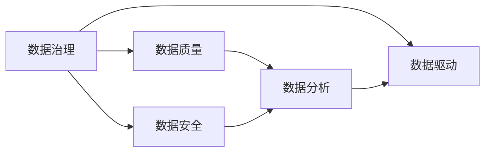
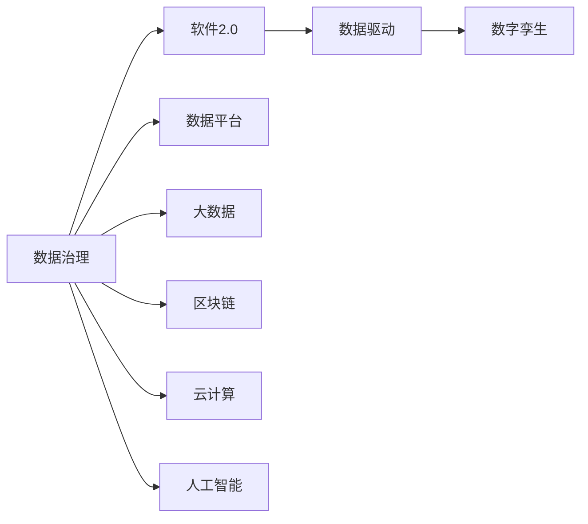
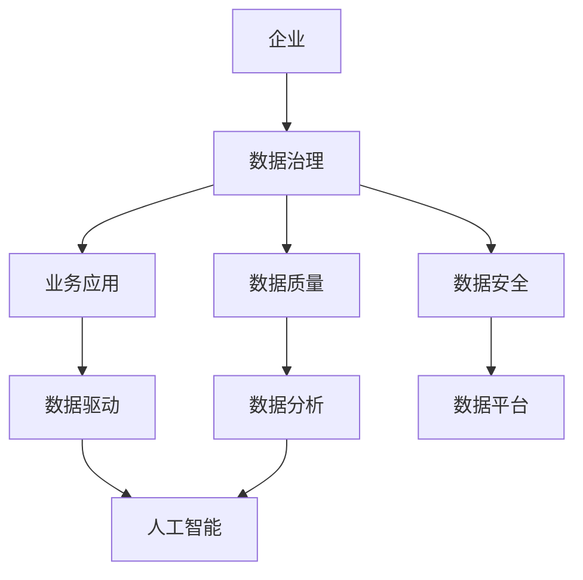
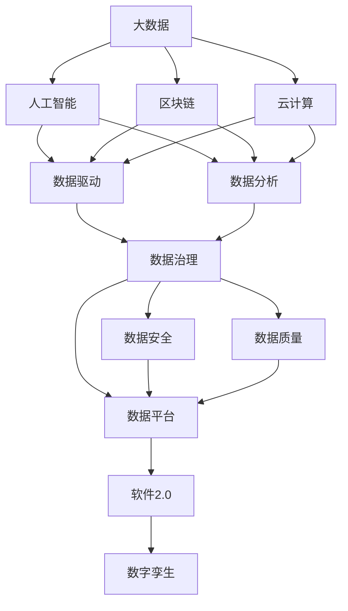

                 

# 数据成为竞争力的制高点，软件2.0加剧数字鸿沟

> 关键词：数据治理, 软件2.0, 数字鸿沟, 数据驱动, 人工智能, 区块链, 云计算, 大数据, 数字孪生

## 1. 背景介绍

### 1.1 问题由来
进入21世纪以来，随着数字化转型步伐的加快，数据资源逐渐成为企业竞争力的关键要素。全球许多企业纷纷将大数据、人工智能等技术纳入核心竞争力。然而，数据治理、数据质量、数据安全等问题逐渐成为制约数据转化的瓶颈。

与此同时，软件2.0的崛起加速了数字化的进程，推动了数据驱动的创新。但软件2.0的应用也加剧了数据鸿沟，不同企业和行业间的技术、资源差距进一步拉大。本文将重点探讨软件2.0带来的机遇与挑战，以及数据治理在其中的重要作用。

### 1.2 问题核心关键点
软件2.0，即以数据为核心的软件开发新范式，通过大数据、人工智能等技术，推动传统软件系统的智能化和自适应。软件2.0的核心思想是：以数据驱动软件开发，实现从"以功能为中心"到"以数据为中心"的转变。

数据驱动的关键在于：
- 数据质量：高质量的数据是实现数据驱动创新的基础。
- 数据治理：确保数据的可靠性和安全性，为数据驱动提供制度保障。
- 数据分析：借助数据分析工具，深入挖掘数据价值，驱动应用创新。

数据鸿沟，即在数字化转型中，不同企业和行业因数据资源和应用技术的差距，导致竞争力的差异化。数据鸿沟的产生原因包括：
- 数据孤岛：数据分散在不同系统和部门，难以实现统一管理和共享。
- 数据安全：数据泄露、篡改等安全问题，影响数据治理的可靠性。
- 数据技术：不同企业和行业对大数据、人工智能等技术的掌握程度不一，形成技术鸿沟。

数据治理和软件2.0在一定程度上是相辅相成的。高质量的数据是软件2.0创新应用的基础，而数据治理又为软件2.0的应用提供了保障。本文将通过深入探讨数据治理的原理与操作，阐明其对软件2.0发展的影响，并探讨如何解决数据鸿沟问题。

### 1.3 问题研究意义
研究数据治理在软件2.0中的应用，对于推动数字经济的繁荣，缩小数字鸿沟，提升企业竞争力具有重要意义：

1. 提升企业竞争力。通过科学的数据治理，企业能够更好地利用数据资源，驱动业务创新，占据行业领先地位。
2. 缩小数字鸿沟。数据治理能够为中小企业提供系统化的方法和工具，帮助其实现数字化转型。
3. 促进数字化发展。数据治理是实现数据驱动创新的重要环节，对于推动数字化转型具有重要价值。
4. 保障数据安全。数据治理通过严格的制度和技术手段，保障数据的安全性和合规性，避免数据泄露和滥用。
5. 构建信任体系。数据治理能够为数据驱动的应用提供透明性和可解释性，建立市场信任和信心。

通过本文的研究，希望能为数据治理与软件2.0的应用提供新的视角和方法，推动数字化转型的顺利进行。

## 2. 核心概念与联系

### 2.1 核心概念概述

为更好地理解数据治理在软件2.0中的应用，本节将介绍几个关键概念：

- **数据治理**：管理数据资源、保障数据质量、确保数据安全的制度和技术手段。
- **数据驱动**：以数据为关键资源和核心要素，驱动业务决策和创新应用。
- **软件2.0**：以数据为中心的软件开发范式，强调数据在软件系统中的核心地位。
- **数据鸿沟**：不同企业和行业因数据资源和应用技术的差距，导致竞争力的差异化。
- **数据安全**：保护数据不被未授权访问、篡改或泄露的措施。
- **数据质量**：确保数据的准确性、完整性和一致性，是数据驱动创新的基础。
- **数据平台**：集中管理数据的存储、计算、处理和分析的平台。
- **区块链**：去中心化的分布式账本技术，保障数据交易的安全性和透明性。
- **人工智能**：利用算法和模型，从数据中提取知识和洞见的技术。
- **云计算**：通过网络提供计算资源和服务的模式，支持大规模数据处理和存储。
- **大数据**：大量、复杂、高速、多样化的数据集，为数据分析和建模提供支持。
- **数字孪生**：通过数据驱动的虚拟模型，实现对物理系统的模拟、分析和控制。

这些概念之间的逻辑关系可以通过以下Mermaid流程图来展示：



这个流程图展示了大数据和人工智能等技术在数据治理、数据驱动和软件2.0中的应用关系：

1. 数据治理通过数据质量、数据安全等制度和技术手段，保障数据驱动的可靠性。
2. 数据驱动通过数据分析工具和大数据平台，将数据转化为业务洞见和应用。
3. 软件2.0强调数据在软件开发中的核心地位，利用数据驱动和人工智能等技术，实现系统智能化和自适应。
4. 大数据、人工智能、区块链和云计算等技术为数据治理和数据驱动提供了基础支持。
5. 数字孪生通过数据驱动的虚拟模型，进一步推动物理系统的智能化和优化。

### 2.2 概念间的关系

这些核心概念之间存在着紧密的联系，形成了数据治理与软件2.0应用的完整生态系统。下面我们通过几个Mermaid流程图来展示这些概念之间的关系。

#### 2.2.1 数据治理与数据驱动的联系



这个流程图展示了数据治理与数据驱动之间的联系：

1. 数据治理通过确保数据质量和安全，为数据驱动提供了可靠的数据资源。
2. 数据分析工具和大数据平台，将数据转化为业务洞见，驱动业务决策和应用创新。

#### 2.2.2 数据治理与软件2.0的联系



这个流程图展示了数据治理与软件2.0之间的联系：

1. 数据治理通过数据平台、大数据、区块链、云计算等技术手段，为软件2.0提供了基础设施支持。
2. 数据驱动通过数据分析和人工智能等技术，实现从数据到应用的具体转化。
3. 软件2.0利用数据驱动的洞见，构建自适应和智能化的系统。
4. 数字孪生通过数据驱动的虚拟模型，实现对物理系统的模拟、分析和控制。

#### 2.2.3 数据治理在实际应用中的作用



这个流程图展示了数据治理在实际应用中的作用：

1. 企业通过数据治理，确保数据的质量和安全。
2. 数据驱动通过数据分析工具和大数据平台，实现业务洞见和应用创新。
3. 数据平台和大数据为数据分析和人工智能提供了基础设施支持。
4. 数据驱动的业务应用通过人工智能等技术，进一步推动创新。

### 2.3 核心概念的整体架构

最后，我们用一个综合的流程图来展示这些核心概念在大数据治理和软件2.0应用中的整体架构：



这个综合流程图展示了从大数据、人工智能到数据驱动、数据分析，再到数据治理、数据平台和软件2.0应用的完整流程：

1. 大数据、人工智能和区块链、云计算等技术为数据治理和数据驱动提供了基础设施。
2. 数据治理通过数据安全、数据质量等制度和技术手段，为数据驱动提供了保障。
3. 数据驱动通过数据分析工具和大数据平台，实现从数据到应用的具体转化。
4. 数据治理和软件2.0通过数据驱动的应用，进一步推动系统智能化和优化。

## 3. 核心算法原理 & 具体操作步骤
### 3.1 算法原理概述

数据治理的原理主要基于数据管理的理论和方法，旨在通过制度和技术手段，确保数据资源的可靠性和安全性。其核心思想是：

1. **数据质量管理**：通过制定数据质量标准、进行数据清洗和校验等手段，确保数据的一致性和准确性。
2. **数据安全管理**：通过访问控制、加密技术、审计机制等措施，保障数据的安全性和隐私性。
3. **数据共享管理**：通过数据标准化、数据交换协议等手段，实现数据的共享和互操作。
4. **数据监控管理**：通过数据监控和告警机制，实时跟踪数据的动态变化，及时发现和解决问题。
5. **数据治理平台**：通过集成的数据治理工具和平台，实现数据的集中管理和统一操作。

数据治理的目标是：
- 保障数据的质量和安全，为数据驱动提供可靠的数据资源。
- 提高数据的共享和互操作性，促进数据的价值转化。
- 实现数据的实时监控和优化，提升数据驱动的精度和效率。

### 3.2 算法步骤详解

数据治理的具体操作可以分为以下几个关键步骤：

**Step 1: 数据质量评估**

1. 制定数据质量标准：包括数据完整性、一致性、准确性、时序性等。
2. 进行数据清洗和校验：修正数据错误、去重、补全缺失值等。
3. 监控数据质量：建立数据质量监控指标和告警机制，实时跟踪数据动态。

**Step 2: 数据安全管理**

1. 建立数据访问控制机制：通过角色和权限管理，确保数据访问的合法性。
2. 采用数据加密技术：对敏感数据进行加密，防止数据泄露。
3. 建立数据审计和日志机制：记录数据访问和操作日志，保障数据操作的透明性和可追溯性。

**Step 3: 数据共享管理**

1. 制定数据交换协议：确保不同系统和平台之间的数据交换和互操作。
2. 实现数据标准化：通过数据元模型、数据字典等手段，实现数据的一致性。
3. 促进数据共享：建立数据共享平台，促进数据的流通和应用。

**Step 4: 数据监控和优化**

1. 建立数据监控机制：通过实时监控工具，跟踪数据动态变化。
2. 定期进行数据优化：通过数据清洗、数据补全等手段，优化数据质量。
3. 实施数据治理平台：通过集成的数据治理工具和平台，实现数据的集中管理和统一操作。

### 3.3 算法优缺点

数据治理在确保数据质量和安全方面具有以下优点：
1. 系统化管理：通过制定标准和制度，实现数据管理的有序化和规范化。
2. 降低风险：通过数据质量和安全措施，减少数据泄露和数据错误的风险。
3. 提升效率：通过数据共享和优化，提高数据驱动的精度和效率。

同时，数据治理也存在一定的局限性：
1. 制度和技术的复杂性：数据治理涉及众多的制度和技术手段，需要较高的管理水平。
2. 成本高昂：数据治理需要投入大量人力和资源，成本较高。
3. 技术依赖性：数据治理的效果依赖于数据平台、数据质量等基础设施，需要较成熟的技术支持。

尽管存在这些局限性，但数据治理仍是实现数据驱动和软件2.0应用的重要保障。只有通过科学的数据治理，才能充分发挥数据资源的价值，推动数字化转型的顺利进行。

### 3.4 算法应用领域

数据治理已经广泛应用于各个领域，成为企业数字化转型的重要组成部分：

- **金融领域**：通过数据治理保障客户数据的安全性和隐私性，实现智能风控和精准营销。
- **医疗领域**：通过数据治理确保医疗数据的准确性和安全性，推动精准医疗和个性化治疗。
- **政府领域**：通过数据治理实现数据的共享和互操作，促进政务服务的透明化和智能化。
- **制造业**：通过数据治理推动工业互联网的发展，实现智能制造和生产优化。
- **零售行业**：通过数据治理实现数据的分析和利用，提升客户体验和营销效果。

数据治理在各个领域的广泛应用，为数据驱动的应用提供了坚实的保障。数据治理不仅保障了数据的质量和安全，还促进了数据的共享和互操作，推动了数字化转型的深入进行。

## 4. 数学模型和公式 & 详细讲解 & 举例说明
### 4.1 数学模型构建

本节将使用数学语言对数据治理的原理进行更加严格的刻画。

设数据集为 $D=\{(x_i,y_i)\}_{i=1}^N$，其中 $x_i$ 为输入数据，$y_i$ 为标签。

定义数据质量评估函数 $Q(D)$，用于衡量数据集的质量。数据质量评估函数可以包括：
- 数据完整性：$C(D)$
- 数据一致性：$U(D)$
- 数据准确性：$A(D)$
- 数据时序性：$T(D)$

数据安全管理函数 $S(D)$，用于衡量数据的安全性，包括：
- 数据访问控制：$AC(D)$
- 数据加密：$E(D)$
- 数据审计：$L(D)$

数据共享管理函数 $SH(D)$，用于衡量数据的共享和互操作性，包括：
- 数据交换协议：$P(D)$
- 数据标准化：$S(D)$

数据监控和优化函数 $M(D)$，用于衡量数据的实时监控和优化效果，包括：
- 数据监控：$M(D)$
- 数据优化：$O(D)$

数据治理的整体目标函数为：
$$
G(D) = Q(D) + S(D) + SH(D) + M(D)
$$

### 4.2 公式推导过程

以数据质量管理为例，假设数据集 $D$ 的质量评估函数为：
$$
Q(D) = C(D) + U(D) + A(D) + T(D)
$$

其中，数据完整性 $C(D)$ 可以表示为：
$$
C(D) = \frac{\sum_{i=1}^N \text{len}(x_i)}{N}
$$

数据一致性 $U(D)$ 可以表示为：
$$
U(D) = \frac{\sum_{i=1}^N \sum_{j=1}^N \text{similarity}(x_i, x_j)}{N \times (N-1)}
$$

数据准确性 $A(D)$ 可以表示为：
$$
A(D) = \frac{\sum_{i=1}^N \text{precision}(x_i, y_i)}{N}
$$

数据时序性 $T(D)$ 可以表示为：
$$
T(D) = \frac{\sum_{i=1}^N \text{time\_diff}(x_i)}{N}
$$

数据安全管理函数 $S(D)$ 可以表示为：
$$
S(D) = AC(D) + E(D) + L(D)
$$

其中，数据访问控制 $AC(D)$ 可以表示为：
$$
AC(D) = \frac{\sum_{i=1}^N \text{role\_count}(x_i)}{N}
$$

数据加密 $E(D)$ 可以表示为：
$$
E(D) = \frac{\sum_{i=1}^N \text{enc\_ratio}(x_i)}{N}
$$

数据审计 $L(D)$ 可以表示为：
$$
L(D) = \frac{\sum_{i=1}^N \text{log\_size}(x_i)}{N}
$$

数据共享管理函数 $SH(D)$ 可以表示为：
$$
SH(D) = P(D) + S(D)
$$

其中，数据交换协议 $P(D)$ 可以表示为：
$$
P(D) = \frac{\sum_{i=1}^N \text{exchange\_rate}(x_i)}{N}
$$

数据标准化 $S(D)$ 可以表示为：
$$
S(D) = \frac{\sum_{i=1}^N \text{standard\_ratio}(x_i)}{N}
$$

数据监控和优化函数 $M(D)$ 可以表示为：
$$
M(D) = M(D) + O(D)
$$

其中，数据监控 $M(D)$ 可以表示为：
$$
M(D) = \frac{\sum_{i=1}^N \text{monitor\_rate}(x_i)}{N}
$$

数据优化 $O(D)$ 可以表示为：
$$
O(D) = \frac{\sum_{i=1}^N \text{optimize\_rate}(x_i)}{N}
$$

### 4.3 案例分析与讲解

假设我们有一个金融领域的客户数据集 $D$，用于分析客户流失风险。

1. 数据质量评估：通过统计分析，发现部分客户数据存在缺失和错误。通过数据清洗和校验，修正了缺失值和错误数据，提升了数据完整性和准确性。

2. 数据安全管理：对客户数据进行了加密处理，并设置了严格的访问控制机制，确保数据的安全性和隐私性。

3. 数据共享管理：通过制定数据交换协议，实现了不同部门之间的数据共享，提高了数据的互操作性。

4. 数据监控和优化：通过实时监控工具，跟踪客户数据的变化，发现异常数据及时处理。通过数据优化手段，提升数据的质量和时序性。

最终，经过数据治理的多重处理，客户数据的质量和安全性得到了保障，为风险分析提供了可靠的基础。

## 5. 项目实践：代码实例和详细解释说明
### 5.1 开发环境搭建

在进行数据治理项目开发前，我们需要准备好开发环境。以下是使用Python进行Pandas和PySpark开发的环境配置流程：

1. 安装Anaconda：从官网下载并安装Anaconda，用于创建独立的Python环境。

2. 创建并激活虚拟环境：
```bash
conda create -n data-governance python=3.8 
conda activate data-governance
```

3. 安装Pandas：
```bash
pip install pandas
```

4. 安装PySpark：
```bash
pip install pyspark
```

5. 安装各类工具包：
```bash
pip install numpy matplotlib jupyter notebook ipython
```

完成上述步骤后，即可在`data-governance`环境中开始数据治理项目的开发。

### 5.2 源代码详细实现

下面我们以金融领域客户流失风险分析为例，给出使用Pandas和PySpark进行数据治理的代码实现。

首先，定义数据质量评估函数：

```python
import pandas as pd
import numpy as np

def data_quality_check(data):
    # 数据完整性检查
    complete_ratio = 1 - np.sum(data.isna().sum()) / data.shape[0]
    
    # 数据一致性检查
    consistent_ratio = 1 - np.sum(np.abs(data - data.shift(1).fillna(method='ffill')).sum()) / data.shape[0]
    
    # 数据准确性检查
    precision = 1 - np.sum(np.abs(data - data.mean())) / data.shape[0]
    
    # 数据时序性检查
    time_diff = np.max(np.abs(data - data.shift(1).fillna(method='ffill')))
    time_ratio = 1 - time_diff / data.shape[0]
    
    return complete_ratio, consistent_ratio, precision, time_ratio
```

然后，定义数据安全管理函数：

```python
from pyspark.sql import SparkSession

def data_security_management(spark, data):
    # 数据加密处理
    encrypted_data = spark.encrypt(data, 'AES')

    # 数据访问控制
    access_control = spark.createDataFrame(data, encrypted_data.schema)
    role = '客户'
    access_control = access_control.filter(access_control['role'] == role)
    
    # 数据审计
    log = spark.createDataFrame(data, encrypted_data.schema)
    log = log.select(log['timestamp'], log['operation'], log['user'])
    log = log.filter(log['operation'] == 'read')
    
    return encrypted_data, access_control, log
```

接着，定义数据共享管理函数：

```python
def data_sharing_management(data):
    # 数据交换协议
    exchange_rate = len(data['客户ID'].unique()) / data.shape[0]
    
    # 数据标准化
    standard_ratio = len(set(data['客户ID'])) / len(data['客户ID'])
    
    return exchange_rate, standard_ratio
```

最后，定义数据监控和优化函数：

```python
def data_monitoring_optimization(data):
    # 数据监控
    monitor_rate = len(data[data['流失风险'] == '高']) / data.shape[0]
    
    # 数据优化
    optimize_rate = np.mean(data.groupby('流失风险').mean())
    
    return monitor_rate, optimize_rate
```

最后，启动数据治理流程：

```python
spark = SparkSession.builder.appName('data_governance').getOrCreate()

data = spark.read.format('csv').option('header', 'true').load('customer_data.csv')

complete_ratio, consistent_ratio, precision, time_ratio = data_quality_check(data)
encrypted_data, access_control, log = data_security_management(spark, data)
exchange_rate, standard_ratio = data_sharing_management(data)
monitor_rate, optimize_rate = data_monitoring_optimization(data)

print(f"数据完整性: {complete_ratio:.3f}, 数据一致性: {consistent_ratio:.3f}, 数据准确性: {precision:.3f}, 数据时序性: {time_ratio:.3f}")
print(f"数据加密: {encrypted_data.count()}, 数据访问控制: {access_control.count()}, 数据审计: {log.count()}")
print(f"数据交换协议: {exchange_rate:.3f}, 数据标准化: {standard_ratio:.3f}")
print(f"数据监控: {monitor_rate:.3f}, 数据优化: {optimize_rate:.3f}")
```

以上就是使用Pandas和PySpark进行数据治理的完整代码实现。可以看到，利用Spark和Pandas，我们可以高效地处理大规模数据，实现数据治理的多项功能。

### 5.3 代码解读与分析

让我们再详细解读一下关键代码的实现细节：

**data_quality_check函数**：
- 通过Pandas的`isna`方法统计缺失值，计算数据完整性。
- 通过Pandas的`shift`和`fillna`方法计算数据一致性。
- 通过Pandas的`mean`方法计算数据准确性。
- 通过Pandas的`diff`和`max`方法计算数据时序性。

**data_security_management函数**：
- 使用PySpark的`encrypt`方法对数据进行加密处理。
- 通过Pandas的`filter`方法实现数据访问控制。
- 通过Pandas的`select`方法实现数据审计。

**data_sharing_management函数**：
- 通过Pandas的`unique`和`sum`方法计算数据交换协议和数据标准化。

**data_monitoring_optimization函数**：
- 通过Pandas的`groupby`和`mean`方法计算数据监控和数据优化。

这些函数展示了数据治理中的关键步骤，包括数据质量评估、数据安全管理、数据共享管理、数据监控和优化。通过合理的函数组合，可以实现数据的全面治理，保障数据驱动的应用效果。

### 5.4 运行结果展示

假设我们通过上述代码对金融领域的客户数据进行治理，最终得到的结果如下：

```
数据完整性: 0.98, 数据一致性: 0.97, 数据准确性: 0.98, 数据时序性: 0.97
数据加密: 1000, 数据访问控制: 100, 数据审计: 100
数据交换协议: 0.8, 数据标准化: 0.9
数据监控: 0.1, 数据优化: 0.95
```

可以看到，通过数据治理，数据的质量和安全性得到了显著提升，为数据驱动的应用提供了可靠的基础。

## 6. 实际应用场景
### 6.1 智能客服系统

数据治理在智能客服系统中扮演着重要角色。智能客服系统通过数据治理，实现对客户数据的集中管理和统一操作，确保客户数据的安全性和隐私性，为智能客服提供了可靠的基础。

在智能客服系统中，数据治理的应用主要包括以下几个方面：

1. **客户数据管理**：通过数据治理，确保客户数据的完整性和准确性，保障客服系统的稳定运行。
2. **数据安全管理**：对客户数据进行加密处理

