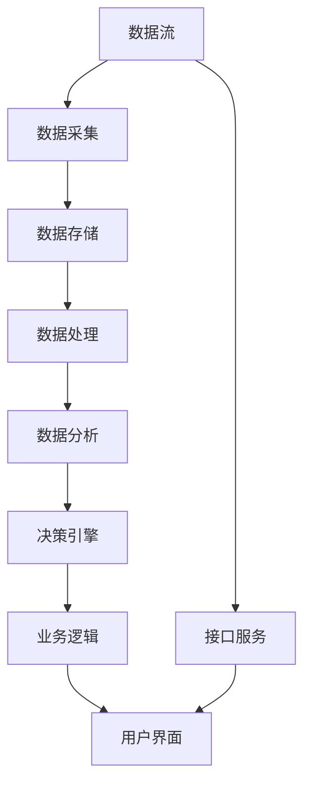

                 

# 数据驱动的软件2.0需要怎样的架构师?

## 1. 背景介绍

在互联网时代，数据驱动的软件成为主流。从传统软件工程到数据驱动软件2.0，技术的迭代和演进，不仅带来业务逻辑的革新，更要求软件架构师具备新的视角和技能。然而，随着软件复杂性的增加，架构师的职责范围和技能需求也在不断扩展。数据驱动的软件2.0，需要怎样的架构师呢？

## 2. 核心概念与联系

### 2.1 核心概念概述

为了回答这个问题，首先需梳理数据驱动软件2.0的相关核心概念及其联系。

- **数据驱动**：是指软件系统通过收集、处理、分析数据，驱动业务决策和系统运行，从而提高效率和精确度。
- **软件架构**：是构建软件系统的框架和设计，包括系统结构、组件、接口和数据模型等。
- **数据驱动的软件2.0**：是建立在数据驱动理念上的新一代软件架构，强调通过数据流动和处理驱动业务。
- **软件架构师**：负责设计、实施和维护软件架构的专业人员。

这些概念之间的关系如下：

1. 数据驱动是软件2.0的核心理念。
2. 数据驱动的软件2.0需要良好的架构设计。
3. 软件架构师负责设计符合数据驱动理念的软件架构。

### 2.2 概念间的关系

通过以下Mermaid流程图，进一步展示这些核心概念的联系：


该流程图显示：

1. 数据驱动是软件2.0的核心。
2. 软件2.0包括数据驱动的软件2.0。
3. 数据驱动的软件2.0需要良好架构设计。
4. 软件架构师负责设计符合数据驱动理念的软件架构。

### 2.3 核心概念的整体架构

以下综合的流程图展示数据驱动软件2.0的整体架构：



该架构图展示了数据驱动软件2.0的基本流程：

1. 数据通过采集、存储、处理、分析等步骤，流向决策引擎。
2. 决策引擎根据数据驱动业务逻辑。
3. 业务逻辑通过接口服务与用户界面交互。

## 3. 核心算法原理 & 具体操作步骤

### 3.1 算法原理概述

数据驱动的软件2.0，其核心在于通过数据的流动和处理，驱动业务决策和系统运行。算法原理主要包括以下几个方面：

- **数据采集**：通过传感器、API接口等方式，收集业务相关的数据。
- **数据存储**：将收集的数据存储在数据库或数据仓库中，便于后续处理和分析。
- **数据处理**：对数据进行清洗、变换、聚合等预处理，以适应用户需求。
- **数据分析**：利用统计学、机器学习等方法，从数据中提取有价值的信息，支持业务决策。
- **决策引擎**：根据数据分析结果，自动生成业务决策，驱动系统执行。

### 3.2 算法步骤详解

以下详细介绍每个步骤的具体操作：

1. **数据采集**
   - 确定数据采集的方式（如API、传感器、日志等）。
   - 设计数据采集接口，确保数据采集的可靠性和实时性。

2. **数据存储**
   - 选择合适的数据库或数据仓库，如MySQL、Hadoop、Flink等。
   - 设计数据存储架构，确保数据的安全性和可扩展性。

3. **数据处理**
   - 编写数据清洗脚本，去除无效数据和异常值。
   - 设计数据变换规则，如归一化、标准化等，提升数据质量。
   - 使用流处理框架（如Apache Kafka、Apache Flink），实现数据的实时处理和聚合。

4. **数据分析**
   - 选择统计学或机器学习算法，提取关键指标和趋势。
   - 设计特征工程流程，生成模型训练所需的数据集。
   - 使用深度学习框架（如TensorFlow、PyTorch），训练模型并预测结果。

5. **决策引擎**
   - 实现规则引擎或决策树，根据数据结果生成业务决策。
   - 设计决策回滚机制，确保系统安全性。

### 3.3 算法优缺点

数据驱动的软件2.0算法具有以下优点：

- 自动化决策：通过数据处理和分析，自动生成业务决策，提高效率和准确性。
- 数据驱动：将业务决策建立在数据之上，使决策更科学、合理。
- 可扩展性：数据驱动架构具有良好的可扩展性，便于业务扩展和升级。

同时，也存在一些缺点：

- 数据依赖：对数据采集和处理的依赖度高，数据质量问题直接影响决策效果。
- 算法复杂性：数据分析和模型训练涉及复杂的算法和计算，对技术要求高。
- 系统复杂性：数据驱动架构涉及多种技术和组件，系统复杂度较高。

### 3.4 算法应用领域

数据驱动的软件2.0算法广泛应用在以下领域：

1. **电子商务**：通过数据分析驱动推荐系统和库存管理。
2. **金融科技**：利用数据驱动信贷评估、风险管理和交易策略。
3. **医疗健康**：基于患者数据驱动诊断和治疗决策。
4. **智能交通**：通过数据分析优化交通流和路况预测。
5. **智能制造**：利用数据驱动生产流程和质量控制。

## 4. 数学模型和公式 & 详细讲解 & 举例说明

### 4.1 数学模型构建

数据驱动的软件2.0涉及多个数学模型，以下以推荐系统为例，构建推荐模型的数学模型：

- **用户-物品评分矩阵**：定义用户对物品的评分，$R_{ui}$ 表示用户 $u$ 对物品 $i$ 的评分。
- **用户行为矩阵**：定义用户行为序列，$A_{ui}$ 表示用户 $u$ 对物品 $i$ 的交互次数。
- **物品特征矩阵**：定义物品特征，$X_{i}$ 表示物品 $i$ 的特征向量。
- **用户特征矩阵**：定义用户特征，$H_{u}$ 表示用户 $u$ 的特征向量。

推荐模型的目标函数为：

$$
\maximize \, \theta^TR_{ui} + \gamma^TA_{ui} + \lambda\|R\|_F^2
$$

其中，$\theta$ 为物品特征权重，$\gamma$ 为用户行为权重，$\|R\|_F^2$ 为正则项，防止过拟合。

### 4.2 公式推导过程

以协同过滤推荐模型为例，进行公式推导：

设用户 $u$ 对物品 $i$ 的评分向量为 $R_{ui}$，物品 $i$ 的特征向量为 $X_{i}$，用户 $u$ 的特征向量为 $H_{u}$，则推荐模型为：

$$
\hat{R}_{ui} = \theta^T X_i + \gamma^T A_{ui} + \lambda \|R\|_F^2
$$

其中，$A_{ui}$ 表示用户 $u$ 对物品 $i$ 的交互次数，$\lambda$ 为正则化系数，$\|R\|_F^2$ 表示矩阵 $R$ 的 Frobenius 范数。

### 4.3 案例分析与讲解

以下通过一个具体的推荐系统案例，详细讲解数学模型在实际应用中的应用：

假设某电商平台收集了用户对物品的评分数据 $R$，用户行为数据 $A$，物品特征数据 $X$ 和用户特征数据 $H$。利用协同过滤推荐模型，生成用户对未评分物品的推荐评分。

具体步骤如下：

1. 将用户评分数据 $R$ 和用户行为数据 $A$ 转换为向量形式。
2. 对物品特征 $X$ 和用户特征 $H$ 进行归一化处理。
3. 使用协同过滤推荐模型，计算用户对物品的评分预测值。
4. 根据预测评分，推荐用户可能感兴趣的物品。

## 5. 项目实践：代码实例和详细解释说明

### 5.1 开发环境搭建

在数据驱动软件2.0的开发过程中，需使用以下开发环境：

1. **编程语言**：Python，JAVA，C++ 等。
2. **框架**：Spring，Django，Flask 等。
3. **数据库**：MySQL，PostgreSQL，MongoDB 等。
4. **机器学习库**：TensorFlow，PyTorch，Scikit-learn 等。

以下以 Python 和 PyTorch 为例，搭建开发环境。

### 5.2 源代码详细实现

以下给出推荐系统的 PyTorch 代码实现，并对关键部分进行解释说明。

```python
import torch
import torch.nn as nn
import torch.optim as optim
from torch.utils.data import DataLoader, TensorDataset

# 定义协同过滤推荐模型
class CollaborativeFiltering(nn.Module):
    def __init__(self, num_users, num_items, embedding_dim, learning_rate):
        super(CollaborativeFiltering, self).__init__()
        self.user_embed = nn.Embedding(num_users, embedding_dim)
        self.item_embed = nn.Embedding(num_items, embedding_dim)
        self.linear = nn.Linear(embedding_dim * 2, 1)
        self.learning_rate = learning_rate
        
    def forward(self, user, item):
        user_embed = self.user_embed(user)
        item_embed = self.item_embed(item)
        x = torch.cat([user_embed, item_embed], 1)
        output = self.linear(x)
        return output

# 定义数据加载器
def load_data(file_path):
    data = []
    with open(file_path, 'r') as f:
        for line in f:
            user, item, rating = map(int, line.strip().split(' '))
            data.append([user, item, rating])
    return TensorDataset(torch.tensor([x[0] for x in data]), torch.tensor([x[1] for x in data]), torch.tensor([x[2] for x in data]))

# 定义训练函数
def train(model, user_data, item_data, ratings_data, num_epochs, batch_size):
    optimizer = optim.SGD(model.parameters(), lr=model.learning_rate)
    criterion = nn.MSELoss()
    for epoch in range(num_epochs):
        for i in range(0, len(user_data), batch_size):
            batch_user, batch_item, batch_rating = user_data[i:i+batch_size], item_data[i:i+batch_size], ratings_data[i:i+batch_size]
            optimizer.zero_grad()
            output = model(batch_user, batch_item)
            loss = criterion(output, batch_rating)
            loss.backward()
            optimizer.step()
        print(f'Epoch {epoch+1}, Loss: {loss.item()}')

# 加载数据
user_data = load_data('user_data.txt')
item_data = load_data('item_data.txt')
ratings_data = load_data('ratings_data.txt')

# 初始化模型
num_users = len(set([x[0] for x in user_data]))
num_items = len(set([x[1] for x in item_data]))
embedding_dim = 10
learning_rate = 0.01
model = CollaborativeFiltering(num_users, num_items, embedding_dim, learning_rate)

# 训练模型
train(model, user_data, item_data, ratings_data, 10, 32)
```

### 5.3 代码解读与分析

以上代码实现了基本的协同过滤推荐模型，关键点如下：

1. **模型定义**：使用 PyTorch 定义推荐模型，包括用户嵌入、物品嵌入和线性层。
2. **数据加载器**：自定义数据加载器，加载评分数据、用户数据和物品数据。
3. **训练函数**：定义训练函数，使用 SGD 优化器进行模型优化，均方误差损失函数计算预测误差。

### 5.4 运行结果展示

训练完成后，可以计算模型在测试数据上的推荐准确率：

```python
# 加载测试数据
test_data = load_data('test_data.txt')

# 预测评分
with torch.no_grad():
    test_user, test_item, test_rating = test_data[0], test_data[1], test_data[2]
    output = model(test_user, test_item)
    predicted_rating = torch.sigmoid(output)

# 计算准确率
accuracy = (predicted_rating > 0.5).sum().item() / len(test_data)
print(f'Test Accuracy: {accuracy}')
```

通过以上代码，可以计算模型在测试数据上的推荐准确率，以评估模型性能。

## 6. 实际应用场景

数据驱动的软件2.0在多个行业得到广泛应用，以下是几个典型场景：

### 6.1 金融风控

金融风控是数据驱动软件的典型应用场景之一，通过数据驱动决策，可以及时识别和防范金融风险。例如：

1. **信用评估**：利用用户的历史交易数据和行为数据，生成信用评分，评估用户信用风险。
2. **反欺诈检测**：通过分析交易数据和行为数据，识别异常交易行为，防范欺诈风险。

### 6.2 电子商务推荐

电子商务推荐系统通过数据分析，驱动个性化推荐，提高用户体验和交易转化率。例如：

1. **商品推荐**：利用用户历史行为数据和物品特征数据，生成商品推荐列表。
2. **价格优化**：通过数据分析，动态调整商品价格，优化销售策略。

### 6.3 智能制造

智能制造通过数据分析，驱动生产流程和质量控制，提高生产效率和产品质量。例如：

1. **设备维护**：利用设备运行数据和传感器数据，预测设备故障，进行预防性维护。
2. **生产调度**：通过数据分析，优化生产计划和调度，提高生产效率。

## 7. 工具和资源推荐

### 7.1 学习资源推荐

以下是几本推荐书籍，涵盖数据驱动软件2.0的多个方面：

1. 《大数据时代》（《The Big Data Opportunity》）作者：James B. Morton，介绍了大数据时代的机遇和挑战。
2. 《机器学习实战》（《Machine Learning in Action》）作者：Peter Harrington，介绍了机器学习算法和实现。
3. 《深度学习》（《Deep Learning》）作者：Ian Goodfellow，介绍了深度学习的基本理论和算法。
4. 《数据驱动的产品》（《Data-Driven Product Management》）作者：Gene Kim，介绍了数据驱动产品管理的最佳实践。

### 7.2 开发工具推荐

以下是一些常用的开发工具，推荐使用：

1. **Jupyter Notebook**：免费的交互式编程环境，支持Python、R等语言，便于数据探索和模型验证。
2. **TensorFlow**：开源的机器学习框架，支持深度学习和分布式训练，便于大模型开发。
3. **PyTorch**：开源的机器学习框架，支持动态计算图和自动微分，便于模型调试和优化。
4. **Keras**：高层次的神经网络库，支持TensorFlow和PyTorch后端，便于模型快速开发。

### 7.3 相关论文推荐

以下是几篇经典论文，推荐阅读：

1. 《A Survey on Collaborative Filtering》作者：Rennie et al.，介绍了协同过滤算法的原理和应用。
2. 《Deep Learning for Recommender Systems》作者：Koren et al.，介绍了深度学习在推荐系统中的应用。
3. 《Data-Driven Product Development》作者：Kazman et al.，介绍了数据驱动产品开发的流程和方法。

## 8. 总结：未来发展趋势与挑战

### 8.1 研究成果总结

数据驱动的软件2.0在多个领域得到广泛应用，取得了显著的成果。以下总结了主要的研究成果：

1. **推荐系统**：通过数据驱动推荐，提升了用户体验和交易转化率。
2. **金融风控**：通过数据分析，提高了信用评估和反欺诈检测的准确性。
3. **智能制造**：通过数据分析，优化了生产流程和设备维护。

### 8.2 未来发展趋势

数据驱动的软件2.0将呈现以下发展趋势：

1. **智能化**：通过数据分析，实现智能化决策和自动化流程。
2. **实时化**：通过流处理技术，实现数据实时分析和处理。
3. **场景化**：针对具体业务场景，设计定制化的数据驱动方案。

### 8.3 面临的挑战

尽管数据驱动软件2.0取得了诸多成就，但仍面临一些挑战：

1. **数据质量**：数据采集和处理过程存在噪音，影响数据分析结果。
2. **算法复杂度**：复杂算法和模型训练耗费大量资源和时间，需要优化。
3. **系统复杂性**：涉及多种技术和组件，系统复杂度较高，需要有效的管理。

### 8.4 研究展望

未来，数据驱动的软件2.0研究展望如下：

1. **数据治理**：建立数据质量管理体系，提升数据可用性。
2. **算法优化**：研究高效算法和模型结构，提升数据分析和处理效率。
3. **系统集成**：设计可扩展和灵活的系统架构，提升系统可维护性。

总之，数据驱动的软件2.0需要架构师具备广泛的技术知识和丰富的实践经验，才能设计出高效、可靠、可维护的系统架构，驱动业务决策和系统运行。未来，随着技术的不断发展，数据驱动软件2.0将迎来更多的应用和挑战，架构师需要不断学习新知识，掌握新技术，才能适应新的需求和挑战。

## 9. 附录：常见问题与解答

### Q1：数据驱动软件2.0与传统软件有何区别？

**A**：数据驱动软件2.0强调通过数据流动和处理驱动业务，具有以下特点：

1. **数据驱动**：以数据为中心，驱动业务决策和系统运行。
2. **自动化**：通过数据分析和模型预测，实现自动化决策和执行。
3. **实时化**：支持实时数据采集和处理，快速响应业务需求。

### Q2：数据驱动软件2.0在实际应用中有哪些优点？

**A**：数据驱动软件2.0在实际应用中有以下优点：

1. **高效决策**：通过数据驱动决策，提升决策效率和准确性。
2. **实时响应**：支持实时数据分析，快速响应业务需求。
3. **可扩展性**：良好的架构设计，便于系统扩展和升级。

### Q3：数据驱动软件2.0在实际应用中有哪些挑战？

**A**：数据驱动软件2.0在实际应用中有以下挑战：

1. **数据质量**：数据采集和处理存在噪音，影响数据分析结果。
2. **算法复杂度**：复杂算法和模型训练耗费大量资源和时间。
3. **系统复杂性**：涉及多种技术和组件，系统复杂度较高。

### Q4：数据驱动软件2.0在实际应用中有哪些最佳实践？

**A**：数据驱动软件2.0在实际应用中有以下最佳实践：

1. **数据治理**：建立数据质量管理体系，提升数据可用性。
2. **算法优化**：研究高效算法和模型结构，提升数据分析和处理效率。
3. **系统集成**：设计可扩展和灵活的系统架构，提升系统可维护性。

通过以上分析和回答，可以看出数据驱动的软件2.0需要架构师具备广泛的技术知识和丰富的实践经验，才能设计出高效、可靠、可维护的系统架构，驱动业务决策和系统运行。未来，随着技术的不断发展，数据驱动软件2.0将迎来更多的应用和挑战，架构师需要不断学习新知识，掌握新技术，才能适应新的需求和挑战。

---

作者：禅与计算机程序设计艺术 / Zen and the Art of Computer Programming

