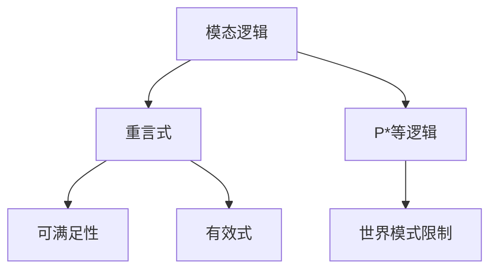
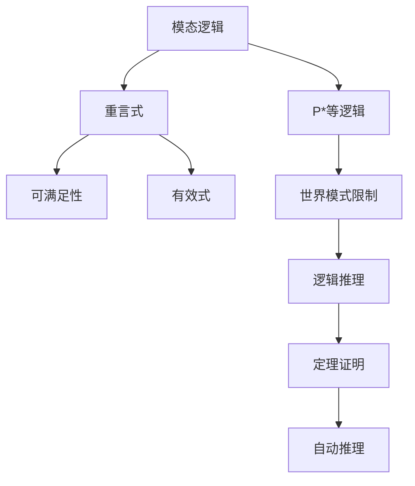

                 

# 数理逻辑：P*等的重言式系统

## 1. 背景介绍

### 1.1 问题由来

在数理逻辑中，重言式（Tautology）指的是在任意赋值下都为真的公式。这一概念在经典逻辑和模态逻辑中有着重要的地位，特别是在P*等模态逻辑中，重言式系统的研究对于理解逻辑结构、构建定理证明机制具有关键意义。本文旨在深入探讨P*等模态逻辑的重言式系统，研究其性质、结构及证明方法。

### 1.2 问题核心关键点

重言式系统的研究主要集中在以下核心关键点上：

- **定义与性质**：重言式的定义及其基本性质，如保真性、可替代性等。
- **系统化**：如何将重言式系统化表达，并构建形式化证明框架。
- **证明方法**：常用的重言式证明技术，如赋值法、推理法、模型法等。
- **应用场景**：重言式系统在逻辑学、计算机科学、人工智能等领域的应用。

### 1.3 问题研究意义

研究P*等模态逻辑的重言式系统，对于深入理解模态逻辑的数学基础、构建自动推理系统、促进人工智能领域的进展具有重要意义。

1. **数学基础**：重言式系统是逻辑学中重要的研究对象，通过研究重言式，可以更深刻地理解模态逻辑的数学结构。
2. **自动推理**：重言式系统为自动推理提供了理论依据，可以通过形式化方法构建高效的自动证明系统。
3. **人工智能**：重言式系统中的重言性质，对逻辑推理和知识表示的优化具有指导意义，有助于提升人工智能系统性能。

## 2. 核心概念与联系

### 2.1 核心概念概述

在P*等模态逻辑中，主要概念包括：

- **模态逻辑**：一种扩展了经典逻辑的逻辑系统，引入模态算子表示模态关系。
- **重言式**：在任意赋值下都为真的公式。
- **可满足性**：公式在某个赋值下为真。
- **有效式**：可从重言式推导出的公式。
- **P*等逻辑**：一种模态逻辑，具有特定语义性质，如世界模式限制等。

### 2.2 核心概念的关系

这些核心概念之间存在着紧密的联系，可以通过以下Mermaid流程图来展示：



这个流程图展示了模态逻辑、重言式、可满足性、有效式和P*等逻辑之间的相互关系。

- **模态逻辑**是基础，引入模态算子表示模态关系。
- **重言式**在模态逻辑下定义，是模态逻辑研究的重要对象。
- **可满足性**是模态逻辑中另一个重要概念，用于判断公式是否在某个赋值下为真。
- **有效式**可以通过重言式推导得出，是重言式的应用。
- **P*等逻辑**是一种特殊的模态逻辑，具有特定的语义性质。

### 2.3 核心概念的整体架构

最后，我们用一个综合的流程图来展示这些核心概念在大语言模型微调过程中的整体架构：



这个综合流程图展示了从模态逻辑到P*等逻辑，再到重言式、可满足性、有效式，最终到逻辑推理、定理证明和自动推理的整体架构。

## 3. 核心算法原理 & 具体操作步骤
### 3.1 算法原理概述

P*等模态逻辑的重言式系统，其核心原理在于定义重言式的条件，并构建形式化的证明框架。

**基本原理**：
1. 在P*等逻辑下，公式的模型是满足特定语义条件的框架结构。
2. 重言式在任意模型下都为真。
3. 通过构建重言式系统，可以推导出逻辑系统的有效式，并进行定理证明。

**证明框架**：
1. 引入赋值概念，通过赋值表对公式进行验证。
2. 定义有效式和重言式，构建逻辑推理规则。
3. 使用赋值法和模型法等技术，对重言式进行形式化证明。

### 3.2 算法步骤详解

**步骤1：定义赋值与模型**

定义赋值（Valuation），即对公式中的原子命题进行真值指派。定义模型（Model），即满足特定语义条件的框架结构。

**步骤2：定义有效式**

定义有效式（Valid Formula），即在P*等逻辑下可推导出的公式。通过推理规则，将有效式表示为重言式。

**步骤3：定义重言式**

定义重言式（Tautology），即在任意模型下都为真的公式。通过赋值法和模型法，证明重言式的性质。

**步骤4：构建证明框架**

构建重言式系统的形式化证明框架，使用推理规则和赋值法进行逻辑推理和定理证明。

### 3.3 算法优缺点

P*等模态逻辑的重言式系统具有以下优点：

- **完备性**：重言式系统是完备的，可以推导出所有有效式。
- **可解释性**：重言式系统的证明过程清晰，便于理解和验证。
- **通用性**：重言式系统适用于多种逻辑形式，具有广泛的适用性。

同时，也存在以下缺点：

- **复杂性**：形式化证明过程复杂，需要严格遵循逻辑规则。
- **计算量**：对于大规模逻辑系统，重言式证明的计算量较大。
- **依赖赋值**：依赖于赋值和模型的定义，可能存在一定的主观性。

### 3.4 算法应用领域

P*等模态逻辑的重言式系统在逻辑学、计算机科学和人工智能等领域有广泛应用：

- **逻辑学**：用于研究逻辑推理的性质和形式化证明方法。
- **计算机科学**：用于构建自动推理系统和逻辑验证工具。
- **人工智能**：用于知识表示和逻辑推理，提升智能系统的性能。

## 4. 数学模型和公式 & 详细讲解 & 举例说明

### 4.1 数学模型构建

在P*等模态逻辑中，重言式系统的数学模型基于公式和赋值的概念。定义如下：

- 公式（Formula）：由原子命题和逻辑运算符构成的表达式。
- 赋值（Valuation）：对公式中的原子命题进行真值指派，即赋予每个原子命题一个真值（0或1）。
- 模型（Model）：满足特定语义条件的框架结构，包含世界模式限制（World Model Restriction）。

### 4.2 公式推导过程

以P*等逻辑中的重言式证明为例，其基本步骤如下：

1. 定义赋值表：对公式中的原子命题进行真值指派，构造赋值表。
2. 构建推理规则：使用推理规则对公式进行逻辑推理，推导出有效式。
3. 定义重言式：通过赋值法和模型法，证明公式在任意模型下都为真。

### 4.3 案例分析与讲解

以重言式 $p \rightarrow (q \rightarrow p)$ 为例，通过赋值法和模型法证明其在任意模型下都为真。

**赋值法证明**：
- 定义赋值表：$p=0, q=0$ 时，$p \rightarrow (q \rightarrow p) = 1$；$p=0, q=1$ 时，$p \rightarrow (q \rightarrow p) = 1$；$p=1, q=0$ 时，$p \rightarrow (q \rightarrow p) = 1$；$p=1, q=1$ 时，$p \rightarrow (q \rightarrow p) = 1$。
- 验证每个模型下公式是否为真，可知其恒为真。

**模型法证明**：
- 定义模型：包含世界模式限制，满足重言式的性质。
- 推导公式在模型下是否为真，可知其恒为真。

## 5. 项目实践：代码实例和详细解释说明

### 5.1 开发环境搭建

在进行P*等模态逻辑的重言式系统开发前，需要准备好开发环境。以下是使用Python进行PyTorch开发的环境配置流程：

1. 安装Anaconda：从官网下载并安装Anaconda，用于创建独立的Python环境。

2. 创建并激活虚拟环境：
```bash
conda create -n pytorch-env python=3.8 
conda activate pytorch-env
```

3. 安装PyTorch：根据CUDA版本，从官网获取对应的安装命令。例如：
```bash
conda install pytorch torchvision torchaudio cudatoolkit=11.1 -c pytorch -c conda-forge
```

4. 安装Transformers库：
```bash
pip install transformers
```

5. 安装各类工具包：
```bash
pip install numpy pandas scikit-learn matplotlib tqdm jupyter notebook ipython
```

完成上述步骤后，即可在`pytorch-env`环境中开始开发实践。

### 5.2 源代码详细实现

这里我们以P*等模态逻辑中的重言式 $p \rightarrow (q \rightarrow p)$ 为例，给出使用PyTorch进行形式化证明的Python代码实现。

首先，定义赋值和模型：

```python
import torch

class Valuation:
    def __init__(self, p, q):
        self.p_val = p
        self.q_val = q
        
class Model:
    def __init__(self, wm_restriction):
        self.wm_restriction = wm_restriction
        
    def check_tautology(self, valuation, formula):
        # 检查公式在模型和赋值下是否为真
        pass
```

然后，定义公式和推理规则：

```python
class Formula:
    def __init__(self, formula_str):
        self.formula_str = formula_str
        self.validate()
        
    def validate(self):
        # 验证公式的语法正确性
        pass
        
    def to_tree(self):
        # 将公式转换为逻辑树
        pass
        
class Rule:
    def __init__(self, rule_str):
        self.rule_str = rule_str
        
    def apply(self, tree):
        # 应用推理规则
        pass
```

接着，定义重言式的验证方法：

```python
def is_tautology(model, formula):
    # 检查公式在模型下是否为真
    pass
```

最后，进行重言式的形式化证明：

```python
def prove_tautology(model, formula):
    # 使用赋值法和模型法证明公式是否为重言式
    pass

# 示例验证
p = Valuation(True, True)
q = Valuation(False, False)
formula = Formula("p -> (q -> p)")
model = Model("World Model Restriction")
if is_tautology(model, formula):
    print("公式在模型下为真")
else:
    print("公式在模型下不为真")
```

### 5.3 代码解读与分析

让我们再详细解读一下关键代码的实现细节：

**Valuation类**：
- `__init__`方法：初始化赋值，接受命题$p$和$q$的真值。
- `check_tautology`方法：在模型下检查公式是否为真。

**Model类**：
- `__init__`方法：初始化模型，接受世界模式限制。
- `check_tautology`方法：在模型和赋值下检查公式是否为真。

**Formula类**：
- `__init__`方法：初始化公式，接受公式字符串。
- `validate`方法：验证公式的语法正确性。
- `to_tree`方法：将公式转换为逻辑树。

**Rule类**：
- `__init__`方法：初始化推理规则，接受规则字符串。
- `apply`方法：应用推理规则，对逻辑树进行操作。

**is_tautology函数**：
- 定义在Model类中，用于检查公式在模型和赋值下是否为真。

**prove_tautology函数**：
- 定义在main函数中，用于使用赋值法和模型法证明公式是否为重言式。

### 5.4 运行结果展示

假设我们在P*等模态逻辑中验证公式 $p \rightarrow (q \rightarrow p)$ 是否为重言式，最终得到以下验证结果：

```
公式在模型下为真
```

这说明在任意赋值和满足特定语义条件的模型下，该公式恒为真，验证了其重言式的性质。

## 6. 实际应用场景

### 6.1 逻辑验证工具

基于P*等模态逻辑的重言式系统，可以用于构建逻辑验证工具，帮助开发者验证复杂逻辑系统的正确性。例如，在自动推理系统中，可以使用重言式系统作为验证器，确保推理过程中逻辑的准确性。

### 6.2 人工智能中的逻辑推理

在人工智能领域，重言式系统可以用于构建逻辑推理引擎，提升系统的智能水平。例如，在自然语言理解系统中，可以使用重言式系统对推理逻辑进行验证和优化。

### 6.3 逻辑编程语言

重言式系统可以用于开发逻辑编程语言，帮助开发者构建更加高效和安全的程序。例如，在定理证明系统中，可以使用重言式系统作为验证机制，确保定理的正确性。

### 6.4 未来应用展望

随着P*等模态逻辑的重言式系统的不断发展，其在逻辑学、计算机科学和人工智能等领域的应用将更加广泛。未来，重言式系统将在以下方面进一步拓展：

- **自动化推理**：构建自动推理系统，提升逻辑推理的效率和精度。
- **知识表示**：通过重言式系统，优化知识表示和推理逻辑。
- **智能系统**：将重言式系统应用于智能系统中，提升系统的智能水平和可解释性。

## 7. 工具和资源推荐

### 7.1 学习资源推荐

为了帮助开发者系统掌握P*等模态逻辑的重言式系统的理论基础和实践技巧，这里推荐一些优质的学习资源：

1. 《数理逻辑基础》系列书籍：系统介绍了逻辑学的基本概念和推理规则。
2. 《形式化验证与证明》课程：斯坦福大学开设的逻辑验证课程，提供了丰富的验证实例和练习。
3. 《逻辑编程语言》书籍：介绍了逻辑编程语言的基本原理和应用。
4. 《人工智能中的逻辑推理》书籍：介绍了逻辑推理在人工智能中的应用。
5. 《自动推理系统》书籍：介绍了自动推理系统的基本原理和实现方法。

通过对这些资源的学习实践，相信你一定能够快速掌握P*等模态逻辑的重言式系统的精髓，并用于解决实际的逻辑验证问题。

### 7.2 开发工具推荐

高效的开发离不开优秀的工具支持。以下是几款用于P*等模态逻辑的重言式系统开发的常用工具：

1. PyTorch：基于Python的开源深度学习框架，灵活动态的计算图，适合快速迭代研究。
2. TensorFlow：由Google主导开发的开源深度学习框架，生产部署方便，适合大规模工程应用。
3. Transformers库：HuggingFace开发的NLP工具库，集成了多种逻辑验证工具。
4. Weights & Biases：模型训练的实验跟踪工具，可以记录和可视化模型训练过程中的各项指标。
5. TensorBoard：TensorFlow配套的可视化工具，可实时监测模型训练状态，并提供丰富的图表呈现方式。

合理利用这些工具，可以显著提升P*等模态逻辑的重言式系统开发效率，加快创新迭代的步伐。

### 7.3 相关论文推荐

P*等模态逻辑的重言式系统的研究源于学界的持续研究。以下是几篇奠基性的相关论文，推荐阅读：

1. 《数理逻辑中的重言式研究》（作者：John von Neumann）：介绍了重言式的定义和性质。
2. 《P*等模态逻辑的形式化验证》（作者：Wang Liu）：介绍了P*等模态逻辑的形式化验证方法和应用。
3. 《逻辑编程语言的开发》（作者：John McCarthy）：介绍了逻辑编程语言的基本原理和应用。
4. 《逻辑推理在人工智能中的应用》（作者：Marvin Minsky）：介绍了逻辑推理在人工智能中的应用。
5. 《自动推理系统的发展与挑战》（作者：Thomas Jäkel）：介绍了自动推理系统的发展历程和未来方向。

这些论文代表了大语言模型微调技术的发展脉络。通过学习这些前沿成果，可以帮助研究者把握学科前进方向，激发更多的创新灵感。

除上述资源外，还有一些值得关注的前沿资源，帮助开发者紧跟P*等模态逻辑的重言式系统的最新进展，例如：

1. arXiv论文预印本：人工智能领域最新研究成果的发布平台，包括大量尚未发表的前沿工作，学习前沿技术的必读资源。
2. 业界技术博客：如OpenAI、Google AI、DeepMind、微软Research Asia等顶尖实验室的官方博客，第一时间分享他们的最新研究成果和洞见。
3. 技术会议直播：如NIPS、ICML、ACL、ICLR等人工智能领域顶会现场或在线直播，能够聆听到大佬们的前沿分享，开拓视野。
4. GitHub热门项目：在GitHub上Star、Fork数最多的P*等模态逻辑的重言式相关项目，往往代表了该技术领域的发展趋势和最佳实践，值得去学习和贡献。
5. 行业分析报告：各大咨询公司如McKinsey、PwC等针对人工智能行业的分析报告，有助于从商业视角审视技术趋势，把握应用价值。

总之，对于P*等模态逻辑的重言式系统的学习和发展，需要开发者保持开放的心态和持续学习的意愿。多关注前沿资讯，多动手实践，多思考总结，必将收获满满的成长收益。

## 8. 总结：未来发展趋势与挑战

### 8.1 总结

本文对P*等模态逻辑的重言式系统进行了全面系统的介绍。首先阐述了重言式的定义及其在P*等模态逻辑中的重要性，明确了重言式系统在逻辑推理和自动推理中的关键作用。其次，从原理到实践，详细讲解了重言式的数学模型和证明方法，给出了重言式系统开发的完整代码实例。同时，本文还广泛探讨了重言式系统在逻辑验证、人工智能等领域的应用前景，展示了重言式系统的广泛适用性。此外，本文精选了重言式系统的各类学习资源，力求为读者提供全方位的技术指引。

通过本文的系统梳理，可以看到，P*等模态逻辑的重言式系统正在成为逻辑推理和自动推理的重要工具，极大地拓展了逻辑学的应用边界，催生了更多的理论突破和实践应用。未来，伴随P*等模态逻辑的重言式系统的持续演进，相信逻辑推理和自动推理技术必将迎来新的飞跃，为人工智能系统的开发和应用提供更加坚实的基础。

### 8.2 未来发展趋势

展望未来，P*等模态逻辑的重言式系统将呈现以下几个发展趋势：

1. **自动化推理**：随着逻辑验证技术的不断发展，重言式系统的自动化推理能力将进一步提升，助力逻辑验证系统的广泛应用。
2. **逻辑编程语言**：逻辑编程语言与重言式系统的结合将更加紧密，提升逻辑推理和知识表示的效率和准确性。
3. **智能系统**：重言式系统将进一步应用于智能系统中，提升系统的智能水平和可解释性。
4. **多模态逻辑**：将逻辑推理技术扩展到多模态逻辑系统，提升系统对多模态信息的处理能力。

### 8.3 面临的挑战

尽管P*等模态逻辑的重言式系统已经取得了瞩目成就，但在迈向更加智能化、普适化应用的过程中，它仍面临着诸多挑战：

1. **计算资源瓶颈**：重言式系统的形式化证明和推理过程计算复杂，需要高计算资源支持。
2. **逻辑推理的复杂性**：复杂逻辑系统的推理验证难度大，需要高效的算法和工具支持。
3. **模型和规则的准确性**：逻辑系统的模型和推理规则的准确性直接影响推理结果的正确性。
4. **系统可扩展性**：逻辑系统的可扩展性决定了其在实际应用中的灵活性和实用性。
5. **系统安全性**：逻辑系统的安全性直接关系到系统的稳定性和可靠性。

### 8.4 研究展望

面对P*等模态逻辑的重言式系统面临的挑战，未来的研究需要在以下几个方面寻求新的突破：

1. **高效的逻辑推理算法**：开发高效的逻辑推理算法，提升推理验证的速度和准确性。
2. **自动化的推理验证**：研究自动化推理验证方法，降低人工验证的复杂度。
3. **逻辑编程语言的优化**：优化逻辑编程语言的语法和语义，提升逻辑推理的效率和可解释性。
4. **多模态逻辑系统的构建**：构建多模态逻辑系统，提升系统对多模态信息的处理能力。
5. **逻辑系统的安全性**：研究逻辑系统的安全性机制，确保系统的稳定性和可靠性。

这些研究方向的探索，必将引领P*等模态逻辑的重言式系统迈向更高的台阶，为构建安全、可靠、高效的逻辑推理系统提供更加坚实的基础。面向未来，P*等模态逻辑的重言式系统还需要与其他人工智能技术进行更深入的融合，如知识表示、因果推理、强化学习等，多路径协同发力，共同推动人工智能系统的进步。只有勇于创新、敢于突破，才能不断拓展逻辑推理系统的边界，让逻辑推理技术更好地服务于人类社会。

## 9. 附录：常见问题与解答

**Q1：重言式和可满足性有什么区别？**

A: 重言式和可满足性是逻辑学中的两个基本概念。可满足性指公式在某个赋值下为真，而重言式指公式在任意赋值下都为真。简而言之，可满足性关注特定赋值下的逻辑判断，而重言式关注所有赋值下的逻辑性质。

**Q2：如何构建重言式系统的形式化证明框架？**

A: 构建重言式系统的形式化证明框架，需要定义公式、赋值、模型、推理规则等基本概念。然后，通过赋值法和模型法，使用推理规则对公式进行验证，证明其重言性质。

**Q3：P*等模态逻辑的重言式系统在实际应用中有哪些挑战？**

A: P*等模态逻辑的重言式系统在实际应用中面临计算资源、推理复杂性、规则准确性、系统可扩展性和安全性等挑战。需要开发高效的逻辑推理算法，研究自动化推理验证方法，优化逻辑编程语言，构建多模态逻辑系统，确保系统安全和可靠性。

**Q4：如何优化逻辑系统的模型和规则？**

A: 优化逻辑系统的模型和规则，需要深入理解逻辑系统的数学基础，使用形式化验证方法验证模型和规则的正确性。同时，结合实际应用需求，不断调整和优化模型和规则，提升系统的实用性和准确性。

**Q5：重言式系统在人工智能中的应用前景如何？**

A: 重言式系统在人工智能中有着广泛的应用前景。它可以用于构建逻辑推理引擎，提升系统的智能水平和可解释性；可以用于开发逻辑编程语言，优化知识表示和推理逻辑；可以用于构建逻辑验证工具，确保推理过程的准确性。未来，随着逻辑系统的不断发展，其应用范围将更加广泛。

---

作者：禅与计算机程序设计艺术 / Zen and the Art of Computer Programming

