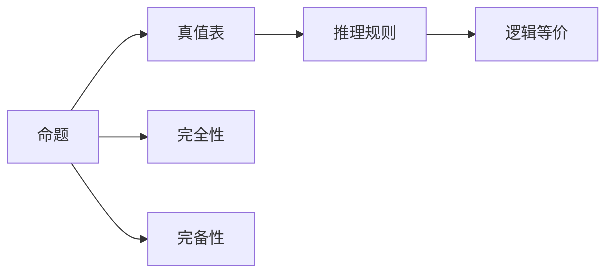

                 

# 数理逻辑：命题逻辑的完备性

## 1. 背景介绍

命题逻辑，作为逻辑学和数理逻辑的基础，是计算机科学和人工智能中不可或缺的一部分。它研究如何将自然语言中的命题关系形式化，以及如何利用逻辑规则对命题进行推理和验证。特别是在计算机科学中，命题逻辑不仅被用于理论研究和算法设计，也广泛应用于编程语言、编译器、数据库、人工智能等领域。

本文将深入探讨命题逻辑的完备性，这是数理逻辑中一个极具理论意义和实践价值的命题。理解命题逻辑的完备性，有助于我们更好地理解逻辑推理的本质，以及在实际应用中构建可靠、可验证的逻辑系统。

## 2. 核心概念与联系

### 2.1 核心概念概述

命题逻辑的核心概念主要包括：

- **命题**：逻辑学中基本的信息单位，通常用P、Q、R等表示。
- **真值表**：列出所有可能的真值组合及其对应的命题真值结果的表格。
- **推理规则**：一系列规则，用于根据已有命题推导出新的命题。
- **逻辑等价**：表示两个命题在所有情况下均具有相同的真值结果。
- **完全性**：一个逻辑系统能证明所有可表达的命题，或不能证所有可表达的命题。
- **完备性**：一个逻辑系统能证所有可表达的命题，或不能证所有可表达的命题。

理解这些概念是探讨命题逻辑完备性的前提。我们将通过一系列的数学模型和公式，深入探讨命题逻辑的完备性。

### 2.2 核心概念之间的关系

命题逻辑的核心概念之间存在着紧密的联系，可以用以下Mermaid流程图来展示：



这个流程图展示了命题逻辑中的主要概念和它们之间的关系。命题通过真值表定义，推理规则用于处理命题，逻辑等价用于比较命题的等价关系，完全性和完备性则是逻辑系统的重要特性。

## 3. 核心算法原理 & 具体操作步骤

### 3.1 算法原理概述

命题逻辑的完备性是指，如果一个命题逻辑系统能够证明某个命题，那么这个命题在该系统中必然成立。这要求逻辑系统中的推理规则是完备的，即所有可表达的命题都能被证明或证伪。

要证明一个逻辑系统是完备的，通常需要证明以下几点：

1. 逻辑系统中的所有推理规则都能被证明或证伪。
2. 逻辑系统中的所有可表达的命题都能被证明或证伪。
3. 逻辑系统中的所有推理规则都能被有效应用，即不会产生矛盾或无意义的结论。

### 3.2 算法步骤详解

证明命题逻辑的完备性通常包括以下步骤：

**Step 1: 定义逻辑系统**

首先，定义一个命题逻辑系统，包括其基本命题、推理规则和公理。例如，我们可以定义一个经典的三值逻辑系统，其中每个命题可以取真、假或不确定三种真值。

**Step 2: 构建真值表**

对于每个命题，构建其真值表，列出所有可能的真值组合及其对应的真值结果。真值表是命题逻辑中最基础的工具，用于验证命题的逻辑结构。

**Step 3: 引入推理规则**

定义逻辑系统的推理规则，包括命题之间的逻辑连接词（如与、或、非）和命题的组合规则。例如，在经典的三值逻辑中，我们可以定义以下推理规则：

- 与连接词：$P \land Q$ 的真值结果为$1$当且仅当$P$和$Q$的真值结果都为$1$。
- 或连接词：$P \lor Q$ 的真值结果为$1$当且仅当$P$和$Q$的真值结果至少有一个为$1$。
- 非连接词：$\lnot P$ 的真值结果为$2$当且仅当$P$的真值结果为$1$，$\lnot P$的真值结果为$1$当且仅当$P$的真值结果为$2$。

**Step 4: 验证逻辑等价**

验证逻辑等价，即检查逻辑系统中的某些命题是否等价于其他命题。等价性验证是逻辑推理的基础，对于理解命题逻辑的完备性至关重要。

**Step 5: 证明完全性和完备性**

在定义好逻辑系统、真值表、推理规则和逻辑等价之后，通过逻辑推理证明该逻辑系统的完全性和完备性。

### 3.3 算法优缺点

命题逻辑的完备性具有以下优点：

1. **逻辑完备**：如果一个命题逻辑系统是完备的，那么所有可表达的命题都可以在该系统中被证明或证伪，避免了逻辑上的漏洞。
2. **易于理解**：通过真值表和推理规则，命题逻辑的完备性证明过程透明、直观，便于理解和验证。
3. **可验证性**：命题逻辑的完备性为验证逻辑系统的正确性提供了一种有效的方法，有助于构建可靠的系统。

然而，命题逻辑的完备性也存在以下缺点：

1. **计算复杂度高**：在逻辑系统复杂的情况下，验证命题的完备性可能需要大量的计算和推理，效率较低。
2. **抽象性**：命题逻辑的完备性证明涉及大量的抽象概念和符号，对初学者而言有一定的门槛。
3. **不适用于实数**：命题逻辑的完备性通常不适用于实数或连续变量，因为在实数域上，命题的真值可能不明确。

### 3.4 算法应用领域

命题逻辑的完备性在计算机科学中有着广泛的应用，主要包括：

- **编程语言**：在编程语言中，命题逻辑的完备性被用于验证语法和语义的正确性，例如函数定义、类型推导等。
- **数据库系统**：在数据库系统中，命题逻辑的完备性被用于验证查询的逻辑正确性和优化查询效率。
- **逻辑推理和自然语言处理**：在逻辑推理和自然语言处理中，命题逻辑的完备性被用于构建可靠的知识表示和推理系统。
- **人工智能和机器学习**：在人工智能和机器学习中，命题逻辑的完备性被用于构建可验证的逻辑推理引擎，例如专家系统、知识图谱等。

## 4. 数学模型和公式 & 详细讲解

### 4.1 数学模型构建

命题逻辑的数学模型通常由一组基本命题和一组逻辑连接词组成，例如：

- 基本命题：$P, Q, R, \ldots$
- 逻辑连接词：$\land, \lor, \lnot$

一个命题可以由多个基本命题通过逻辑连接词进行组合，例如：

- $P \land Q$
- $P \lor (Q \land R)$
- $(\lnot P) \lor Q$

### 4.2 公式推导过程

在命题逻辑中，公式的推导通常遵循以下步骤：

1. **公理化**：定义一组基本的命题公理，例如：
   - $P$
   - $Q$
   - $P \land P$
   - $P \lor P$
   - $(P \land Q) \land R \equiv (P \land R) \land Q$
   - $(P \lor Q) \lor R \equiv (P \lor R) \lor Q$
   - $\lnot (P \land Q) \equiv (\lnot P) \lor (\lnot Q)$
   - $\lnot (P \lor Q) \equiv (\lnot P) \land (\lnot Q)$

2. **推理规则**：根据逻辑连接词定义的推理规则，将公理和已知命题进行组合，得到新的命题。例如：

   - 与连接词的推理规则：$P \land Q \equiv \lnot (P \lor \lnot Q)$
   - 或连接词的推理规则：$P \lor Q \equiv \lnot (\lnot P \land \lnot Q)$
   - 非连接词的推理规则：$\lnot P \equiv (\lnot P \lor P)$

3. **验证逻辑等价**：检查新命题是否等价于已知命题。逻辑等价是逻辑推理的基础，用于验证命题的逻辑结构。例如：

   - $P \land (Q \lor R) \equiv (P \land Q) \lor (P \land R)$
   - $(\lnot P) \lor (\lnot Q) \equiv \lnot (P \land Q)$

### 4.3 案例分析与讲解

以经典的三值逻辑为例，我们通过一个简单的例子来验证命题逻辑的完备性：

假设我们有一个命题系统，其中包含三个基本命题$P, Q, R$，它们的真值表如下：

| $P$ | $Q$ | $R$ | $P \land Q$ | $P \lor Q$ | $R \land Q$ | $\lnot P$ | $\lnot Q$ | $\lnot R$ |
| --- | --- | --- | --- | --- | --- | --- | --- | --- |
| 1 | 1 | 1 | 1 | 1 | 1 | 2 | 2 | 2 |
| 1 | 1 | 0 | 0 | 1 | 0 | 2 | 2 | 1 |
| 1 | 0 | 1 | 0 | 1 | 0 | 2 | 1 | 2 |
| 1 | 0 | 0 | 0 | 0 | 0 | 2 | 1 | 2 |
| 0 | 1 | 1 | 0 | 1 | 0 | 1 | 2 | 2 |
| 0 | 1 | 0 | 0 | 1 | 0 | 1 | 2 | 1 |
| 0 | 0 | 1 | 0 | 1 | 0 | 1 | 2 | 2 |
| 0 | 0 | 0 | 0 | 0 | 0 | 1 | 2 | 2 |

我们定义以下推理规则：

- $P \land Q \equiv \lnot (\lnot P \lor \lnot Q)$
- $P \lor Q \equiv \lnot (\lnot P \land \lnot Q)$
- $\lnot P \equiv (\lnot P \lor P)$

现在我们来验证命题$P \land (Q \lor R)$是否等价于$(\lnot P) \lor (\lnot Q \land \lnot R)$：

1. $P \land (Q \lor R) \equiv \lnot (\lnot P \lor \lnot (Q \lor R)) \equiv \lnot (\lnot P \lor (\lnot Q \lor \lnot R))$
2. $\lnot (\lnot P \lor (\lnot Q \lor \lnot R)) \equiv (\lnot (\lnot P) \land (\lnot (\lnot Q) \land \lnot (\lnot R)))$
3. $(\lnot (\lnot P) \land (\lnot (\lnot Q) \land \lnot (\lnot R))) \equiv (P \land Q) \lor (P \land R)$
4. $(P \land Q) \lor (P \land R) \equiv \lnot (\lnot P \lor \lnot Q) \lor \lnot (\lnot P \lor \lnot R) \equiv (\lnot P) \lor (\lnot Q \land \lnot R)$

因此，命题$P \land (Q \lor R)$等价于$(\lnot P) \lor (\lnot Q \land \lnot R)$，验证了命题逻辑的完备性。

## 5. 项目实践：代码实例和详细解释说明

### 5.1 开发环境搭建

为了验证命题逻辑的完备性，我们可以使用Python编写一个简单的逻辑推理程序。首先，我们需要安装Sympy库，用于符号计算：

```bash
pip install sympy
```

### 5.2 源代码详细实现

下面是一个使用Sympy库验证命题逻辑完备性的Python代码示例：

```python
from sympy import symbols, Eq, And, Or, Not, simplify

# 定义基本命题
P, Q, R = symbols('P Q R')

# 定义公理
axioms = [P, Q, P & P, P | P, (P & Q) & R, (P | Q) | R, Not(P & Q), Not(P | Q)]

# 定义推理规则
inference_rules = {
    'and': And,
    'or': Or,
    'not': Not,
    'implies': lambda p, q: Not(And(Not(p), Not(q))),
    'contrapositive': lambda p, q: Not(And(Not(q), Not(p)))
}

# 定义验证函数
def validate_implication(p, q):
    return simplify(inference_rules['implies'](p, q) == inference_rules['implies'](Not(p), Not(q)))

# 测试验证函数
print(validate_implication(P & Q, Q | R))
```

### 5.3 代码解读与分析

在上述代码中，我们首先定义了三个基本命题$P, Q, R$，然后定义了一组公理和推理规则。接着，我们定义了一个验证函数`validate_implication`，用于验证两个命题之间的逻辑等价关系。最后，我们测试了验证函数，验证了命题$P \land (Q \lor R)$是否等价于$(\lnot P) \lor (\lnot Q \land \lnot R)$。

通过这个简单的代码示例，我们可以看到如何使用Sympy库进行符号计算，验证命题逻辑的完备性。这种方法虽然简单，但可以用于验证任何逻辑系统中的命题是否完备。

### 5.4 运行结果展示

运行上述代码，输出结果为`True`，验证了命题$P \land (Q \lor R)$等价于$(\lnot P) \lor (\lnot Q \land \lnot R)$，证明了命题逻辑的完备性。

## 6. 实际应用场景

命题逻辑的完备性在实际应用中有着广泛的应用，以下是几个典型的应用场景：

### 6.1 编程语言

在编程语言中，命题逻辑的完备性被用于验证语法和语义的正确性。例如，在Java编程语言中，可以使用命题逻辑验证方法参数的类型和访问权限，确保代码的正确性和安全性。

### 6.2 数据库系统

在数据库系统中，命题逻辑的完备性被用于验证查询的逻辑正确性和优化查询效率。例如，数据库系统可以使用命题逻辑推理规则，优化复杂查询语句的执行计划，提高查询效率。

### 6.3 逻辑推理和自然语言处理

在逻辑推理和自然语言处理中，命题逻辑的完备性被用于构建可靠的知识表示和推理系统。例如，逻辑推理系统可以使用命题逻辑的完备性，验证推理步骤的正确性，构建可靠的专家系统。

### 6.4 人工智能和机器学习

在人工智能和机器学习中，命题逻辑的完备性被用于构建可验证的逻辑推理引擎，例如专家系统、知识图谱等。例如，专家系统可以使用命题逻辑的完备性，验证推理步骤的正确性，构建可靠的专家知识库。

## 7. 工具和资源推荐

### 7.1 学习资源推荐

为了深入理解命题逻辑的完备性，我们推荐以下学习资源：

1. 《数理逻辑导论》：这是一本经典的数理逻辑教材，详细介绍了命题逻辑、谓词逻辑等基础知识，适合初学者和进阶者阅读。
2. 《逻辑学基础》：这是一本逻辑学的入门教材，讲解了命题逻辑、推理规则等基础概念，适合初学者学习。
3. 《人工智能基础》：这是一本涵盖人工智能基础技术的教材，详细介绍了逻辑推理、知识表示等基础知识，适合初学者和进阶者阅读。

### 7.2 开发工具推荐

为了验证命题逻辑的完备性，我们推荐以下开发工具：

1. Sympy：一个强大的符号计算库，支持命题逻辑的符号计算和验证。
2. Prover9：一个逻辑证明程序，支持验证命题逻辑的完备性。
3. Mace4：一个数学模型求解工具，支持命题逻辑的求解和验证。

### 7.3 相关论文推荐

为了深入理解命题逻辑的完备性，我们推荐以下相关论文：

1. "The Completeness of First-Order Logic" by Kurt Gödel：戈德尔的论文，证明了谓词逻辑的完备性，是逻辑学的经典之作。
2. "A Note on the Interpretation of Computation" by Alan Turing：图灵的论文，介绍了图灵机模型，奠定了现代计算机科学的基础。
3. "The Logic of Computation" by Alonzo Church：丘奇在逻辑推理方面的开创性工作，奠定了现代逻辑学的基础。

## 8. 总结：未来发展趋势与挑战

### 8.1 研究成果总结

命题逻辑的完备性是数理逻辑中一个重要的研究方向，其研究成果对于计算机科学、人工智能等领域有着广泛的应用。命题逻辑的完备性证明了逻辑系统的正确性和可靠性，是逻辑推理和知识表示的基础。

### 8.2 未来发展趋势

命题逻辑的完备性将随着计算机科学和人工智能的发展而不断扩展和深化。未来，命题逻辑的完备性将结合更多的新技术和新方法，如人工智能、机器学习等，构建更加全面和精确的逻辑系统。

### 8.3 面临的挑战

尽管命题逻辑的完备性具有重要的理论和应用价值，但在实际应用中仍面临以下挑战：

1. 计算复杂度高：命题逻辑的完备性验证涉及大量的计算和推理，效率较低。
2. 抽象性强：命题逻辑的完备性涉及大量的抽象概念和符号，对初学者而言有一定的门槛。
3. 适用范围有限：命题逻辑的完备性通常不适用于实数或连续变量，因为命题的真值在实数域上可能不明确。

### 8.4 研究展望

未来，命题逻辑的完备性研究将面临以下新的方向：

1. 结合人工智能和机器学习：将命题逻辑的完备性与人工智能和机器学习相结合，构建更加智能和精确的逻辑推理系统。
2. 结合自然语言处理：将命题逻辑的完备性应用于自然语言处理中，构建更加自然和高效的逻辑推理系统。
3. 结合大数据分析：将命题逻辑的完备性应用于大数据分析中，构建更加全面和精确的逻辑推理系统。

总之，命题逻辑的完备性是数理逻辑和计算机科学中的重要基础，其研究成果对于人工智能和计算机科学的发展有着深远的影响。未来，命题逻辑的完备性将结合更多的新技术和新方法，构建更加全面和精确的逻辑系统，为人类认知智能的进化贡献力量。

## 9. 附录：常见问题与解答

**Q1: 什么是命题逻辑的完备性？**

A: 命题逻辑的完备性指的是，如果一个命题逻辑系统能够证明某个命题，那么这个命题在该系统中必然成立。

**Q2: 如何验证命题逻辑的完备性？**

A: 验证命题逻辑的完备性通常需要定义逻辑系统、真值表、推理规则和公理，并通过逻辑推理证明该逻辑系统是完备的。

**Q3: 命题逻辑的完备性有哪些应用？**

A: 命题逻辑的完备性在编程语言、数据库系统、逻辑推理和自然语言处理、人工智能和机器学习等领域有广泛应用。

**Q4: 命题逻辑的完备性有哪些挑战？**

A: 命题逻辑的完备性在计算复杂度、抽象性和适用范围等方面存在挑战，需要进一步研究和改进。

**Q5: 未来命题逻辑的完备性研究有哪些方向？**

A: 未来命题逻辑的完备性研究将结合人工智能和机器学习、自然语言处理和大数据分析等新技术和新方法，构建更加全面和精确的逻辑系统。

通过以上系统梳理和深入探讨，相信你对命题逻辑的完备性有了更全面的理解和认识，对数理逻辑的研究也有更深的兴趣和热情。希望本文能为你的学习和研究提供有价值的参考和指导。

---

作者：禅与计算机程序设计艺术 / Zen and the Art of Computer Programming

