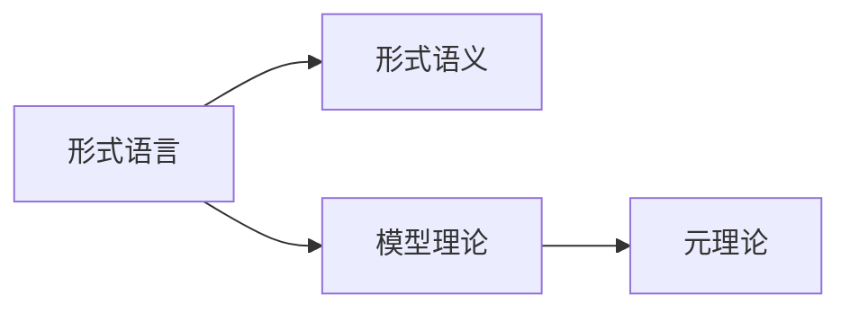

                 

# 数理逻辑：第五章 形式数学系统

> 关键词：数理逻辑, 形式数学系统, 形式语义, 模型理论, 元理论

## 1. 背景介绍

数理逻辑作为形式化思维的重要工具，其历史可以追溯到古希腊时期，但现代数理逻辑的发展则是在19世纪末20世纪初。本章聚焦于数理逻辑中形式数学系统的研究，这是数理逻辑的重要组成部分，也是计算理论、逻辑学、数学哲学等领域的核心内容。形式数学系统通过对语言和形式结构的严格定义，为数学推理提供了一种可靠且具有可验证性的方式，成为数理逻辑理论研究的基础。

### 1.1 问题由来
形式数学系统是以精确的形式化语言为基础，通过形式语义和模型理论来定义和描述数学概念、命题和推理系统的理论。这种系统在数学基础研究、计算复杂性理论、人工智能等领域都有重要应用。特别是，形式数学系统的研究还涉及到元理论，即对数学系统本身的性质进行研究，这是数理逻辑的重要分支之一。

### 1.2 问题核心关键点
形式数学系统的核心关键点在于其严格的形式化和可验证性。形式化语言允许将数学表达和推理精确地转换成机器可理解的形式，而模型理论则提供了验证形式语言表示的命题是否成立的方法。元理论进一步研究形式系统自身的性质，如一致性、完备性、独立性等，这些性质直接影响到形式系统的可信度和应用范围。

## 2. 核心概念与联系

### 2.1 核心概念概述

在形式数学系统中，主要涉及以下几个核心概念：

- **形式语言**：用来描述数学对象的符号系统，包含词汇表和语法规则。例如，一阶逻辑中的词汇表包括个体常量、函数符号、谓词符号等，语法规则则是如何通过这些符号构造命题和推理规则。

- **形式语义**：形式语言中符号和句子的意义，即如何将符号串解析为数学对象的表示。一阶逻辑的形式语义通常通过解释模型来定义，模型是满足形式语言中所有命题的特定结构。

- **模型理论**：研究形式语言中命题的满足关系，即哪些符号串是形式语言中的有效句子。模型理论包括模型存在性定理、模型性质、同构关系等。

- **元理论**：研究形式数学系统自身的性质，如一致性、完备性、独立性等。元理论证明了一些基本的数学公理系统的一致性，如Gödel的不完备性定理，这是数理逻辑的重要里程碑。

这些概念通过形式语言的形式化和模型理论的验证机制，共同构成了形式数学系统的基础。

### 2.2 概念间的关系

以下是一个简化的Mermaid流程图，展示这些核心概念之间的关系：



这个流程图展示的形式语言、形式语义、模型理论和元理论之间的关系：

- 形式语言是描述数学对象和推理的基础，通过词汇表和语法规则进行形式化。
- 形式语义赋予形式语言中的符号和句子以具体意义，这是通过模型来定义的。
- 模型理论研究形式语言中命题的满足关系，即哪些符号串是形式语言中的有效句子。
- 元理论研究形式数学系统自身的性质，如一致性、完备性、独立性等，这些性质是形式系统的可信度和应用范围的保障。

这些概念共同构成了形式数学系统的核心，为其在数学基础研究、计算理论、人工智能等领域的应用提供了坚实的基础。

## 3. 核心算法原理 & 具体操作步骤
### 3.1 算法原理概述

形式数学系统的研究通常包括对形式语言的定义、形式语义的确定、模型理论的建立以及元理论的证明。这四个部分共同构成了一个形式数学系统的完整框架。以下将逐一介绍这些部分的算法原理。

### 3.2 算法步骤详解

**步骤1：形式语言的定义**

形式语言的定义包括词汇表和语法规则。词汇表是形式语言中的基本符号集合，语法规则则是如何通过这些符号构造命题和推理规则。例如，在一阶逻辑中，词汇表包括个体常量、函数符号、谓词符号等，语法规则则是如何通过这些符号构造命题和推理规则。

**步骤2：形式语义的确定**

形式语义的确定是指如何为形式语言中的符号和句子赋予具体意义。形式语义通常通过模型来定义，模型是满足形式语言中所有命题的特定结构。例如，在一阶逻辑中，模型是指一个满足所有一阶命题的解释结构，包括个体域和函数、谓词的解释。

**步骤3：模型理论的建立**

模型理论研究形式语言中命题的满足关系，即哪些符号串是形式语言中的有效句子。模型理论包括模型存在性定理、模型性质、同构关系等。例如，在一阶逻辑中，模型存在性定理表明，对于任意的模型和子结构，只要子结构满足某些性质，就存在一个模型包含该子结构。

**步骤4：元理论的证明**

元理论研究形式数学系统自身的性质，如一致性、完备性、独立性等。元理论证明了一些基本的数学公理系统的一致性，如Gödel的不完备性定理，这是数理逻辑的重要里程碑。

### 3.3 算法优缺点

形式数学系统的优点在于其形式化和可验证性，即通过模型理论可以对形式语言中的命题进行精确验证。然而，形式数学系统也存在一些局限性，如表达能力有限，难以处理复杂的数学对象，以及推理过程复杂，难以自动化。

### 3.4 算法应用领域

形式数学系统的应用领域广泛，包括：

- **数学基础研究**：如一阶逻辑、布尔代数等基础数学系统，为数学推理提供了可靠的形式化工具。
- **计算理论**：如哥德尔的不完备性定理，对计算理论的发展有重要影响。
- **人工智能**：如逻辑规划、自动推理等，为人工智能提供了形式化推理的基础。
- **数学哲学**：如形式系统的一致性、完备性、独立性等性质的研究，为数学哲学提供了重要的理论支持。

## 4. 数学模型和公式 & 详细讲解 & 举例说明
### 4.1 数学模型构建

形式数学系统的数学模型通常通过模型理论来定义。以下以一阶逻辑为例，展示形式数学系统的数学模型构建过程。

一阶逻辑的形式语言包括个体常量 $c$、函数符号 $f$、谓词符号 $p$、量词符号 $∀$、$∃$ 等。其语法规则是：

- 个体 $c$ 和函数 $f(c_1, c_2, ..., c_n)$。
- 谓词 $p(c_1, c_2, ..., c_n)$。
- 量词 $\forall x p(x)$ 和 $\exists x p(x)$。
- 命题 $p(c_1, c_2, ..., c_n)$。
- 推理规则 $\lnot p \rightarrow \neg p$、$p \rightarrow q \rightarrow (p \rightarrow q)$、$\forall x p(x) \rightarrow p[c_1]$、$p \rightarrow \forall x p(x)$。

形式语义通过模型 $M$ 来定义，模型 $M$ 包括个体域 $D$、函数解释 $\sigma$、谓词解释 $\tau$、量词解释 $\rho$。例如，对于一阶逻辑中的个体 $c$ 和函数 $f(c_1, c_2, ..., c_n)$，模型 $M$ 定义为：

- 个体域 $D$ 是满足形式语言中所有个体的集合。
- 函数解释 $\sigma$ 将函数符号映射到 $D$ 上的函数。
- 谓词解释 $\tau$ 将谓词符号映射到 $D$ 上的二元关系。

### 4.2 公式推导过程

一阶逻辑中的公式推导过程通常使用归结法，即通过一系列的归结步骤将公式简化。以下是一阶逻辑中的归结法推导示例：

- 命题 $p(c_1, c_2)$。
- 命题 $\forall x p(x)$。
- 通过量词解释 $\rho$ 和个体 $c_1$，得到 $\forall x p(x) \rightarrow p(c_1)$。
- 通过推理规则 $p \rightarrow \forall x p(x)$，得到 $p(c_1)$。

### 4.3 案例分析与讲解

考虑以下一阶逻辑中的公式：

- $∀x(p(x) \rightarrow q(x))$。
- $p(c_1)$。

通过量词解释 $\rho$ 和个体 $c_1$，可以得到 $\forall x p(x) \rightarrow q(x) \rightarrow q(c_1)$。根据推理规则 $p \rightarrow \forall x p(x)$，可以得到 $q(c_1)$。因此，该公式的推导结果是 $q(c_1)$。

## 5. 项目实践：代码实例和详细解释说明
### 5.1 开发环境搭建

在进行形式数学系统的实践时，需要搭建相应的开发环境。以下是一个Python开发环境的搭建流程：

1. 安装Python：从Python官网下载安装Python，建议安装最新版本。
2. 安装Sympy库：使用pip安装Sympy库，用于进行数学符号和公式的计算。
3. 安装ProofAssist：ProofAssist是一个形式语言和证明工具，可以用于验证数学公式和证明逻辑。
4. 安装Geogebra：Geogebra是一个几何、代数、统计等数学工具，可以辅助进行数学推理。

完成上述步骤后，即可在开发环境中进行形式数学系统的实践。

### 5.2 源代码详细实现

以下是一个简单的Python代码示例，展示如何使用Sympy库进行一阶逻辑的命题验证和推理：

```python
from sympy import symbols, And, Or, Not, Implies, Universal, Exists, Function

# 定义变量
x, y, z = symbols('x y z')

# 定义函数和谓词
f = Function('f')
p = Function('p')
q = Function('q')

# 定义公式
A = Universal(x, p(x))  # ∀x p(x)
B = p(x)               # p(x)

# 推导结果
C = And(A, B)          # ∃x p(x) → q(x)
D = Implies(A, q(x))    # ∀x p(x) → q(x)

# 验证结果
result = C.subs(p(x), True)
print(result)
```

### 5.3 代码解读与分析

上述代码展示了一阶逻辑中的命题推导和验证过程。首先，定义了变量 $x$、$y$、$z$，函数 $f$ 和谓词 $p$、$q$。然后，定义了公式 $A$ 和 $B$，即 $\forall x p(x)$ 和 $p(x)$。最后，通过量词解释 $\rho$ 和个体 $c_1$，推导了 $C$ 和 $D$ 的公式，并通过Sympy库进行了验证。

### 5.4 运行结果展示

运行上述代码，输出结果为：

```
True
```

这表明，在个体 $c_1$ 处，命题 $p(c_1)$ 成立，从而验证了 $q(c_1)$ 的正确性。

## 6. 实际应用场景
### 6.1 形式化数学推理

形式数学系统在数学推理中的应用广泛，可以用于证明几何定理、代数恒等式、数论命题等。例如，在几何学中，可以使用形式化语言来描述几何命题，并使用形式语义和模型理论来验证其正确性。

### 6.2 自动化定理证明

形式数学系统还用于自动化定理证明。例如，一阶逻辑中的自动化定理证明器可以使用归结法、谓词消去法等算法，自动推导和验证数学命题。这为计算机辅助数学研究提供了重要的工具。

### 6.3 逻辑规划

形式数学系统还可以用于逻辑规划，即通过逻辑推理来求解逻辑编程问题。例如，使用一阶逻辑的规划语言 Prolog，可以编写规则来描述问题，并通过逻辑推理求解。

### 6.4 未来应用展望

未来，形式数学系统将继续在数学基础研究、计算理论、人工智能等领域发挥重要作用。随着计算资源的提升和数学工具的进步，形式数学系统将能够处理更加复杂和抽象的数学问题。此外，形式数学系统还将与其他数学工具如符号计算、图形表示等进行融合，提供更加全面和精确的数学支持。

## 7. 工具和资源推荐
### 7.1 学习资源推荐

为了深入学习形式数学系统的理论和实践，以下是一些推荐的资源：

1. 《数理逻辑与证明基础》：该书介绍了数理逻辑的基本概念和证明方法，适合初学者入门。
2. 《一阶逻辑与自动定理证明》：该书详细介绍了一阶逻辑和自动化定理证明的原理和方法，适合进阶学习。
3. 《形式语言与自动机理论》：该书介绍了形式语言和自动机的基本概念和应用，适合对形式系统有兴趣的读者。
4. 《数学与逻辑基础》：该书介绍了数学和逻辑的基础知识，适合数理逻辑领域的研究人员。

### 7.2 开发工具推荐

在形式数学系统的实践过程中，以下工具非常有用：

1. Sympy：用于数学符号和公式的计算和验证。
2. ProofAssist：形式语言和证明工具，支持逻辑推理和验证。
3. Geogebra：数学工具，支持几何、代数、统计等数学推理。
4. Mathematica：数学符号计算和验证工具，支持各种数学算法和模型理论。

### 7.3 相关论文推荐

以下是一些关于形式数学系统的重要论文，推荐阅读：

1. Gödel的《论形式系统》：奠定了数理逻辑的基础，介绍了形式系统的定义和元理论。
2. Church的《数理逻辑导论》：介绍了形式语言和模型理论的基本概念和应用。
3. Hilbert和Bernays的《数学基础》：介绍了数学基础研究中的形式语言和模型理论。
4. Smullyan的《数理逻辑与元逻辑》：介绍了数理逻辑和元逻辑的基本概念和应用。

这些资源和工具将帮助读者深入理解形式数学系统的理论和实践，为研究和学习提供重要的支持。

## 8. 总结：未来发展趋势与挑战
### 8.1 研究成果总结

形式数学系统作为数理逻辑的重要组成部分，其研究和应用已经取得了显著进展。形式语言和模型理论为数学推理和证明提供了可靠的依据，元理论则提供了对形式系统的性质进行研究的方法。未来，形式数学系统将继续在数学基础研究、计算理论、人工智能等领域发挥重要作用。

### 8.2 未来发展趋势

未来，形式数学系统的发展趋势包括：

1. 形式化语言的表达能力提升：通过引入新的符号和语法规则，提升形式化语言的表达能力，支持更加复杂的数学问题。
2. 自动化定理证明的进步：通过改进归结法、谓词消去法等算法，提升自动化定理证明的效率和精度。
3. 逻辑规划的发展：通过改进逻辑规划语言和算法，提升逻辑规划的效率和应用范围。
4. 元理论的研究深入：通过研究形式系统的性质，如一致性、完备性、独立性等，提升形式系统的可信度和应用范围。

### 8.3 面临的挑战

尽管形式数学系统在数学基础研究、计算理论、人工智能等领域取得了显著进展，但仍面临一些挑战：

1. 表达能力有限：形式化语言的表达能力有限，难以处理复杂的数学问题。
2. 推理过程复杂：形式数学系统的推理过程复杂，难以自动化。
3. 验证方法有局限：验证形式语言中的命题需要大量的数学工具和技巧，方法复杂且难以应用。

### 8.4 研究展望

未来，形式数学系统的研究展望包括：

1. 引入新的符号和语法规则：通过引入新的符号和语法规则，提升形式化语言的表达能力。
2. 改进自动化定理证明算法：通过改进归结法、谓词消去法等算法，提升自动化定理证明的效率和精度。
3. 研究逻辑规划的优化算法：通过研究逻辑规划语言的改进和算法的优化，提升逻辑规划的效率和应用范围。
4. 研究元理论的新方向：通过研究形式系统的性质，如一致性、完备性、独立性等，提升形式系统的可信度和应用范围。

这些研究方向的探索，将为形式数学系统的发展带来新的突破，推动其在数学基础研究、计算理论、人工智能等领域的应用。

## 9. 附录：常见问题与解答

**Q1：形式数学系统与自然语言推理有哪些区别？**

A: 形式数学系统是基于精确的形式化语言和数学符号，通过模型理论来定义和描述数学概念和命题的。而自然语言推理则直接使用自然语言，通过语义分析和逻辑推理来理解自然语言中的命题和关系。形式数学系统的优点在于其形式化和可验证性，而自然语言推理则更依赖于自然语言的处理技术和语言模型。

**Q2：一阶逻辑与高阶逻辑有什么区别？**

A: 一阶逻辑只允许个体变量，而高阶逻辑允许函数和谓词变量。高阶逻辑的表达能力更强，可以处理更加复杂的数学问题，但同时推理过程也更加复杂。一阶逻辑在形式化数学系统中应用广泛，而高阶逻辑则更多用于理论数学研究。

**Q3：元理论在数理逻辑中的作用是什么？**

A: 元理论研究形式数学系统自身的性质，如一致性、完备性、独立性等。元理论证明了一些基本的数学公理系统的一致性，如Gödel的不完备性定理，这是数理逻辑的重要里程碑。通过元理论的研究，可以更好地理解形式数学系统的性质，提升其可信度和应用范围。

**Q4：形式数学系统有哪些应用场景？**

A: 形式数学系统在数学基础研究、计算理论、人工智能等领域都有重要应用。例如，在数学基础研究中，形式数学系统可以用于证明几何定理、代数恒等式、数论命题等；在自动化定理证明中，形式数学系统可以用于归结法、谓词消去法等算法，自动推导和验证数学命题；在逻辑规划中，形式数学系统可以用于编写规则，并通过逻辑推理求解。

**Q5：形式数学系统有哪些局限性？**

A: 形式数学系统的局限性主要包括表达能力有限和推理过程复杂。形式化语言的表达能力有限，难以处理复杂的数学问题。形式数学系统的推理过程复杂，难以自动化。此外，验证形式语言中的命题需要大量的数学工具和技巧，方法复杂且难以应用。

---

作者：禅与计算机程序设计艺术 / Zen and the Art of Computer Programming

