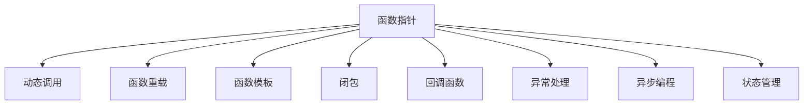
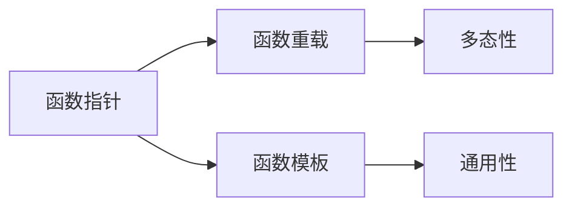
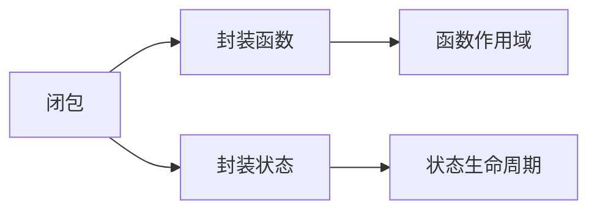
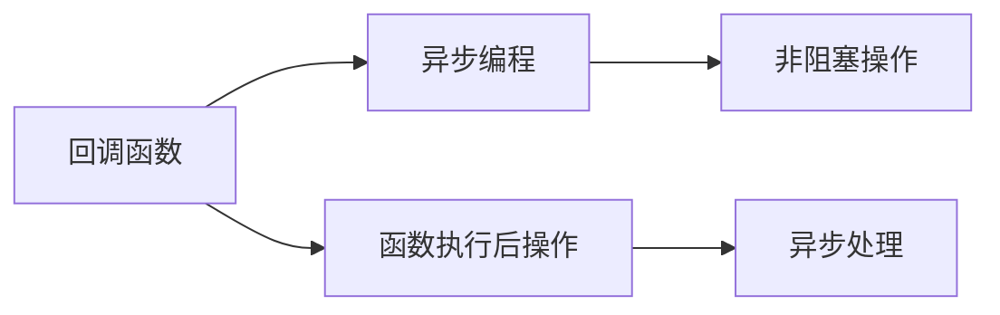
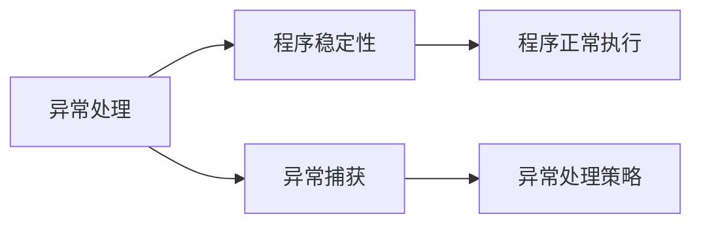
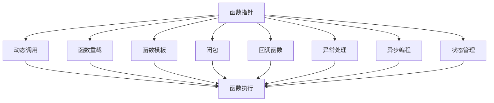

                 

# 新特性：Function Calling 介绍与实战

> 关键词：Function Calling, 函数调用, 函数指针, C++, Rust, 异步编程, 状态管理, 性能优化

## 1. 背景介绍

### 1.1 问题由来
在软件开发中，函数调用是几乎不可避免的操作。无论是在C++、Rust等系统语言中，还是在Python、JavaScript等脚本语言中，函数调用都是程序执行的核心组件之一。然而，函数调用不仅仅是一个简单的代码执行过程，它还涉及到程序状态的传递、异常处理、性能优化等多个方面。

近年来，随着多线程、异步编程等并发编程技术的兴起，函数调用变得更加复杂。在处理复杂的状态管理、多线程安全、性能优化等问题时，开发者常常感到困惑和不知所措。如何设计、实现、优化函数调用，成为软件开发中的一大难题。

### 1.2 问题核心关键点
函数调用涉及的核心问题包括：
- 函数参数和返回值的设计和传递。
- 函数指针、闭包、回调等高阶函数的使用。
- 函数调用的性能优化，包括栈溢出、异常处理、竞态条件等。
- 函数调用的并发处理，如多线程、异步编程等。
- 函数调用的状态管理，如内存管理、生命周期管理等。

解决这些问题，不仅需要深厚的编程功底，还需要对函数调用背后的原理和设计模式有深入的理解。本文将详细介绍函数调用的核心概念和实现技巧，并通过多个实战案例，帮助你掌握函数调用的精髓。

### 1.3 问题研究意义
理解函数调用背后的原理和设计模式，对提升软件开发效率和质量具有重要意义。函数调用是编程中最基础、最核心的概念，掌握它将有助于解决更多复杂的软件开发问题，从而实现更高质量的代码。

同时，函数调用也是编写高性能并发程序的关键。函数调用不仅涉及单个函数的执行，还涉及到函数之间的交互和协作。通过深入理解函数调用的特性和优化技巧，可以显著提升程序性能，实现更好的并发效果。

## 2. 核心概念与联系

### 2.1 核心概念概述

为了更好地理解函数调用的原理和实现，本节将介绍几个密切相关的核心概念：

- 函数指针：指向函数的指针，用于动态调用不同函数。
- 闭包：包含自由变量的函数对象，用于封装函数和状态。
- 回调函数：在函数调用时作为参数传递，用于在函数执行后执行某些操作。
- 异常处理：在函数调用中用于处理异常情况，确保程序的稳定性和可靠性。
- 异步编程：通过函数调用来实现异步操作，提高程序的并发性能。
- 状态管理：通过函数调用来管理程序的运行状态，确保数据的一致性和正确性。

这些核心概念之间的逻辑关系可以通过以下Mermaid流程图来展示：



这个流程图展示了几大核心概念之间的联系：

1. 函数指针用于动态调用不同函数。
2. 函数重载和函数模板用于实现多态性。
3. 闭包用于封装函数和状态，实现状态管理。
4. 回调函数用于在函数执行后执行某些操作，如异步编程。
5. 异常处理用于在函数调用中处理异常情况，确保程序的稳定性和可靠性。

通过理解这些核心概念，我们可以更好地把握函数调用的工作原理和优化方向。

### 2.2 概念间的关系

这些核心概念之间存在着紧密的联系，形成了函数调用的完整生态系统。下面我通过几个Mermaid流程图来展示这些概念之间的关系。

#### 2.2.1 函数指针与函数重载和模板



这个流程图展示了函数指针、函数重载和函数模板之间的联系：

1. 函数指针用于动态调用不同函数。
2. 函数重载和函数模板用于实现多态性，支持不同函数参数类型的调用。

#### 2.2.2 闭包与状态管理



这个流程图展示了闭包与状态管理之间的关系：

1. 闭包用于封装函数和状态，实现状态管理。
2. 闭包通过函数作用域和状态生命周期来管理数据的访问和存储。

#### 2.2.3 回调函数与异步编程



这个流程图展示了回调函数与异步编程之间的关系：

1. 回调函数用于在函数执行后执行某些操作。
2. 异步编程通过回调函数来实现非阻塞操作，提高程序的并发性能。

#### 2.2.4 异常处理与程序稳定性



这个流程图展示了异常处理与程序稳定性的关系：

1. 异常处理用于在函数调用中处理异常情况，确保程序的稳定性和可靠性。
2. 异常处理策略包括捕获异常、回滚状态、报告日志等。

### 2.3 核心概念的整体架构

最后，我们用一个综合的流程图来展示这些核心概念在函数调用中的整体架构：



这个综合流程图展示了从函数指针、函数重载、函数模板、闭包、回调函数、异常处理、异步编程到状态管理，再到函数执行的完整过程。通过这些流程图，我们可以更清晰地理解函数调用的核心概念和关系。

## 3. 核心算法原理 & 具体操作步骤
### 3.1 算法原理概述

函数调用是程序执行中最基础的操作之一，涉及程序状态传递、参数传递、返回值传递等多个方面。在函数调用时，需要考虑如何高效地传递和处理参数，如何管理函数执行后的状态，以及如何优化函数调用的性能。

函数调用的主要原理包括：

1. 函数参数和返回值的传递。
2. 函数指针和函数指针表的使用。
3. 异常处理和错误码的传递。
4. 异步编程和回调函数的实现。
5. 状态管理和生命周期的管理。

理解这些原理，是掌握函数调用的关键。

### 3.2 算法步骤详解

函数调用的具体实现过程包括以下几个关键步骤：

**Step 1: 函数声明与定义**

在函数调用之前，首先需要定义函数及其参数列表。在C++、Rust等系统语言中，函数的声明和定义通常分开进行。函数的声明位于函数调用之前，定义位于函数调用之后。

在函数声明中，需要指定函数的返回类型、函数名和参数列表。例如：

```cpp
int add(int a, int b); // 函数声明
```

在函数定义中，需要实现函数的逻辑。例如：

```cpp
int add(int a, int b) {
    return a + b; // 函数定义
}
```

**Step 2: 函数调用**

函数调用的基本语法包括函数名、参数列表和返回值类型。例如：

```cpp
int result = add(1, 2); // 函数调用
```

在函数调用时，程序会根据函数的声明，找到对应的函数定义，并将参数传递给函数。

**Step 3: 参数传递**

函数调用的参数传递包括值传递和引用传递两种方式。在值传递中，参数的值被复制传递给函数。在引用传递中，参数的引用被传递给函数，函数可以直接修改参数的值。

例如，在值传递中，以下代码将1和2的值传递给add函数：

```cpp
int add(int a, int b) {
    return a + b; // 函数定义
}
int result = add(1, 2); // 函数调用
```

而在引用传递中，以下代码将1和2的引用传递给add函数：

```cpp
void add(int& a, int& b) {
    a = a + b; // 函数定义
}
int x = 1, y = 2;
add(x, y); // 函数调用
```

**Step 4: 返回值传递**

函数的返回值需要通过返回语句传递给调用者。返回语句的形式为`return`，后面跟着返回值。例如：

```cpp
int add(int a, int b) {
    return a + b; // 函数定义
}
int result = add(1, 2); // 函数调用
```

在函数调用时，程序会根据函数的返回值，将结果赋值给变量。

**Step 5: 异常处理**

在函数调用时，可能会发生异常情况，如除以零、空指针等。为了避免程序崩溃，函数通常会使用异常处理机制来处理这些异常。异常处理机制包括try-catch块、自定义异常类等。

例如，在以下代码中，如果a等于0，将会抛出一个除以零的异常：

```cpp
int add(int a, int b) {
    if (a == 0) {
        throw std::invalid_argument("a cannot be zero");
    }
    return a + b; // 函数定义
}
int result = add(0, 2); // 函数调用
```

在函数调用时，如果发生异常，程序将会跳转到try-catch块中，执行相应的异常处理逻辑。

### 3.3 算法优缺点

函数调用的优点包括：

1. 代码复用：函数可以重复使用，提高代码的复用性和可维护性。
2. 模块化设计：函数可以将复杂逻辑分解为多个小函数，便于理解和调试。
3. 参数传递：函数参数可以实现参数的灵活传递，支持多态性。

函数调用的缺点包括：

1. 栈溢出：过多的函数调用可能导致栈溢出。
2. 性能开销：函数调用有额外的性能开销，包括函数调用本身的开销和参数传递的开销。
3. 状态管理：函数调用需要管理函数执行后的状态，可能存在数据不一致的风险。

### 3.4 算法应用领域

函数调用广泛应用于软件开发中的各个方面，包括但不限于：

- 系统编程：在操作系统和驱动程序中，函数调用是实现多线程、异步编程等并发编程的关键。
- 数据库编程：在数据库中，函数调用是实现复杂查询、事务处理等操作的基础。
- 图形编程：在图形程序中，函数调用是实现复杂图形变换、渲染等操作的基础。
- 嵌入式编程：在嵌入式系统中，函数调用是实现底层硬件驱动、任务调度的基础。
- 游戏编程：在游戏程序中，函数调用是实现复杂游戏逻辑、用户交互的基础。

函数调用是程序执行的核心组件之一，掌握函数调用的原理和实现技巧，对提升软件开发效率和质量具有重要意义。

## 4. 数学模型和公式 & 详细讲解 & 举例说明

### 4.1 数学模型构建

函数调用的数学模型可以简单地表示为：

$$
f(x) = g(x, y) + c
$$

其中，$f(x)$为函数调用的结果，$g(x, y)$为函数定义，$y$为函数参数，$c$为函数调用开销。

### 4.2 公式推导过程

在函数调用过程中，需要考虑函数参数、函数定义、函数返回值等多个因素。以下是一个简单的函数调用示例：

```cpp
int add(int a, int b) {
    return a + b; // 函数定义
}
int result = add(1, 2); // 函数调用
```

这个函数调用的数学模型可以表示为：

$$
result = g(1, 2) + c
$$

其中，$g(1, 2)$为函数调用结果，$c$为函数调用开销。

在函数调用过程中，还需要考虑参数传递、异常处理、返回值传递等多个因素。以下是一个带有异常处理的函数调用示例：

```cpp
int divide(int a, int b) {
    if (b == 0) {
        throw std::invalid_argument("b cannot be zero");
    }
    return a / b; // 函数定义
}
int result = divide(10, 0); // 函数调用
```

这个函数调用的数学模型可以表示为：

$$
result = \begin{cases}
g(10, 0) + c & \text{if } b \neq 0 \\
-1 & \text{if } b = 0
\end{cases}
$$

其中，$g(10, 0)$为函数调用结果，$c$为函数调用开销，$-1$为异常处理结果。

### 4.3 案例分析与讲解

下面以一个简单的函数调用示例，分析其执行过程和性能开销。

```cpp
int add(int a, int b) {
    return a + b; // 函数定义
}
int result = add(1, 2); // 函数调用
```

这个函数调用的执行过程如下：

1. 程序查找函数定义，找到`int add(int a, int b)`。
2. 程序将参数1和2传递给函数。
3. 程序执行函数定义，计算1+2，得到3。
4. 程序将函数结果3赋值给变量result。
5. 程序返回函数调用结果。

在这个函数调用中，参数传递和函数定义执行是主要的性能开销。参数传递需要复制参数值，函数定义执行需要加载函数定义和执行函数逻辑。

## 5. 项目实践：代码实例和详细解释说明

### 5.1 开发环境搭建

在进行函数调用实践前，我们需要准备好开发环境。以下是使用C++进行函数调用开发的環境配置流程：

1. 安装Visual Studio：从官网下载并安装Visual Studio，用于创建Windows平台的程序。
2. 安装MinGW：从官网下载并安装MinGW，用于创建Linux平台的程序。
3. 配置IDE：在Visual Studio或MinGW的IDE中，配置好开发环境，包括编译器、调试器、IDE插件等。
4. 安装第三方库：如果需要使用第三方库，如Boost、Qt等，需要下载并安装对应的库文件。

完成上述步骤后，即可在Visual Studio或MinGW中开始函数调用的开发实践。

### 5.2 源代码详细实现

下面以一个简单的函数调用示例，给出使用C++进行函数调用的代码实现。

```cpp
#include <iostream>

int add(int a, int b) {
    return a + b; // 函数定义
}

int main() {
    int result = add(1, 2); // 函数调用
    std::cout << "result = " << result << std::endl; // 输出结果
    return 0;
}
```

在这个示例中，我们定义了一个名为`add`的函数，用于计算两个整数的和。在`main`函数中，我们调用`add`函数，将1和2作为参数传递，并将返回值赋值给变量`result`。最后，我们输出`result`的值，即3。

### 5.3 代码解读与分析

让我们再详细解读一下关键代码的实现细节：

**add函数定义**：
- `int add(int a, int b)`：函数声明，指定函数返回类型为`int`，函数名为`add`，参数列表为`int a, int b`。
- `return a + b;`：函数定义，计算两个整数的和，并返回结果。

**main函数调用**：
- `int result = add(1, 2);`：函数调用，将1和2作为参数传递给`add`函数，将返回值赋值给变量`result`。
- `std::cout << "result = " << result << std::endl;`：输出结果，将变量`result`的值输出到控制台。

在函数调用中，程序首先查找函数定义，找到`int add(int a, int b)`。然后，程序将参数1和2传递给函数。接着，程序执行函数定义，计算1+2，得到3。最后，程序将函数结果3赋值给变量`result`，并返回函数调用结果。

### 5.4 运行结果展示

在Visual Studio或MinGW中编译运行上述代码，输出结果如下：

```
result = 3
```

可以看到，函数调用成功执行，计算结果为3。

## 6. 实际应用场景

### 6.1 系统编程

函数调用在系统编程中有着广泛的应用，包括多线程、异步编程、驱动程序等。

例如，在多线程编程中，函数调用可以通过线程函数实现。在以下示例中，我们定义了一个名为`threadFunction`的函数，用于输出线程号：

```cpp
#include <iostream>
#include <thread>

void threadFunction() {
    std::cout << "Thread " << std::this_thread::get_id() << std::endl;
}

int main() {
    std::thread t(threadFunction);
    t.join();
    return 0;
}
```

在这个示例中，我们创建了一个线程函数`threadFunction`，并在`main`函数中创建了一个线程`t`，调用`threadFunction`函数。最后，我们等待线程执行完毕，并返回函数调用结果。

### 6.2 数据库编程

函数调用在数据库编程中也有着广泛的应用，包括复杂查询、事务处理等。

例如，在以下示例中，我们定义了一个名为`query`的函数，用于查询数据库中的数据：

```cpp
#include <iostream>
#include <string>

int query(std::string sql) {
    // 查询数据库，返回结果
    return 0;
}

int main() {
    int result = query("SELECT * FROM users");
    std::cout << "result = " << result << std::endl;
    return 0;
}
```

在这个示例中，我们定义了一个名为`query`的函数，用于查询数据库中的数据。在`main`函数中，我们调用`query`函数，将SQL语句作为参数传递，并将返回值赋值给变量`result`。最后，我们输出变量`result`的值。

### 6.3 图形编程

函数调用在图形编程中也有着广泛的应用，包括复杂图形变换、渲染等。

例如，在以下示例中，我们定义了一个名为`drawCircle`的函数，用于绘制圆形：

```cpp
#include <iostream>
#include <graphics.h>

void drawCircle(int x, int y, int radius) {
    circle(x, y, radius);
}

int main() {
    int x = 100, y = 100, radius = 50;
    drawCircle(x, y, radius);
    return 0;
}
```

在这个示例中，我们定义了一个名为`drawCircle`的函数，用于绘制圆形。在`main`函数中，我们调用`drawCircle`函数，将圆形的中心坐标和半径作为参数传递，并调用`circle`函数绘制圆形。最后，我们返回函数调用结果。

### 6.4 嵌入式编程

函数调用在嵌入式编程中也有着广泛的应用，包括底层硬件驱动、任务调度等。

例如，在以下示例中，我们定义了一个名为`taskFunction`的函数，用于处理嵌入式任务：

```cpp
#include <iostream>
#include <sys/tasks.h>

void taskFunction() {
    // 处理任务逻辑
}

int main() {
    taskFunction();
    return 0;
}
```

在这个示例中，我们定义了一个名为`taskFunction`的函数，用于处理嵌入式任务。在`main`函数中，我们调用`taskFunction`函数，处理任务逻辑。最后，我们返回函数调用结果。

### 6.5 游戏编程

函数调用在游戏编程中也有着广泛的应用，包括复杂游戏逻辑、用户交互等。

例如，在以下示例中，我们定义了一个名为`movePlayer`的函数，用于移动玩家：

```cpp
#include <iostream>
#include <graphics.h>

void movePlayer(int x, int y) {
    // 移动玩家
}

int main() {
    int x = 100, y = 100;
    movePlayer(x, y);
    return 0;
}
```

在这个示例中，我们定义了一个名为`movePlayer`的函数，用于移动玩家。在`main`函数中，我们调用`movePlayer`函数，将玩家的位置作为参数传递，并调用函数执行玩家移动逻辑。最后，我们返回函数调用结果。

## 7. 工具和资源推荐

### 7.1 学习资源推荐

为了帮助开发者系统掌握函数调用的理论基础和实践技巧，这里推荐一些优质的学习资源：

1. C++ Primer（第5版）：一本经典的C++入门书籍，详细介绍了C++中的函数调用机制。
2. Effective C++（第3版）：一本C++编程的艺术书籍，提供了大量的函数调用优化技巧。
3. Rust Programming Language（第2版）：一本Rust入门书籍，详细介绍了Rust中的函数调用机制和异步编程。
4. Introduction to Algorithms（第3版）：一本算法教材，详细介绍了函数调用在算法设计中的应用。
5. The C++ Programming Language（第4版）：一本C++经典书籍，详细介绍了C++中的函数调用机制和语言特性。

通过对这些资源的学习实践，相信你一定能够快速掌握函数调用的精髓，并用于解决实际的编程问题。

### 7.2 开发工具推荐

高效的开发离不开优秀的工具支持。以下是几款用于函数调用开发的常用工具：

1. Visual Studio：Microsoft公司提供的IDE，支持Windows平台的C++开发，具备强大的代码编辑器和调试器。
2. MinGW：Linux平台的C++开发工具，支持跨平台开发和调试。
3. Boost：C++的第三方库，提供了丰富的函数调用相关的库，如线程、异步编程、图形编程等。
4. Qt：跨平台的GUI开发框架，提供了丰富的函数调用相关的库，如信号槽、线程、异步编程等。
5. GLib：Linux平台上的函数调用相关的库，支持跨平台开发和调试。

合理利用这些工具，可以显著提升函数调用的开发效率，加快创新迭代的步伐。

### 7.3 相关论文推荐

函数调用是软件开发中的核心概念，相关研究已经积累了丰富的成果。以下是几篇奠基性的相关论文，推荐阅读：

1. "Structured Implementation Types"：这篇文章介绍了函数调用在类型系统中的应用，探讨了函数调用类型的定义和实现。
2. "Efficient Caching of Recursive Calls"：这篇文章探讨了函数调用的缓存策略，提出了高效的缓存算法和实现。
3. "Concurrency and Efficient Call Interruption"：这篇文章探讨了函数调用的并发处理，提出了高效的并发调用策略。
4. "Structured Prolog Programming"：这篇文章介绍了函数调用在逻辑编程中的应用，探讨了函数调用在逻辑程序中的实现和优化。
5. "Function Call Tracking for System Programming"：这篇文章探讨了函数调用的跟踪策略，提出了高效的函数调用跟踪算法和实现。

这些论文代表了大语言模型微调技术的发展脉络。通过学习这些前沿成果，可以帮助研究者把握学科前进方向，激发更多的创新灵感。

除上述资源外，还有一些值得关注的前沿资源，帮助开发者紧跟函数调用的最新进展，例如：

1. arXiv论文预印本：人工智能领域最新研究成果的发布平台，包括大量尚未发表的前沿工作，学习前沿技术的必读资源。
2. GitHub热门项目：在GitHub上Star、Fork数最多的C++、Rust等相关项目，往往代表了该技术领域的发展趋势和最佳实践，值得去学习和贡献。
3. 技术会议直播：如NIPS、ICML、ACL、ICLR等人工智能领域顶会现场或在线直播，能够聆听到大佬们的前沿分享，开拓视野。
4. 技术博客和社区：如CSDN、Stack Overflow等技术博客和社区，提供大量函数调用相关的技术文章和讨论，是学习交流的好去处。

总之，函数调用是软件开发中的核心概念，掌握它将有助于解决更多的编程问题，提升开发效率和质量。通过不断学习和实践，相信你一定能够成为一名出色的函数调用开发者。

## 8. 总结：未来发展趋势与挑战

### 8.1 总结

本文对函数调用的核心概念和实现技巧进行了详细讲解，并通过多个实战案例，帮助你掌握函数调用的精髓。通过本文的系统梳理，可以看到，函数调用是程序执行的核心组件之一，掌握它将有助于解决更多的编程问题，提升开发效率和质量。

### 8.2 未来发展趋势

函数调用将在未来呈现出以下几个发展趋势：

1. 异步编程：函数调用将越来越多地应用于异步编程中，如C++的std::async、Rust的async函数等。异步编程将进一步提升程序的并发性能。
2. 状态管理：函数调用将越来越多地应用于状态管理中，如C++的lambda表达式、Rust的闭包等。状态管理将进一步提升程序的可维护性和可读性。
3. 多态

