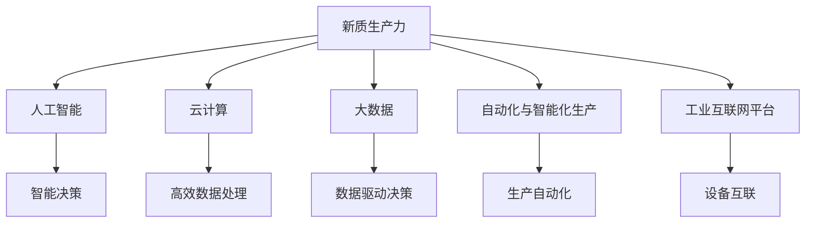
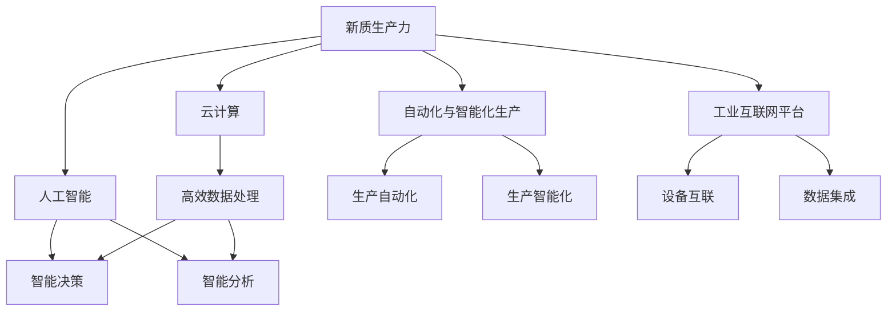
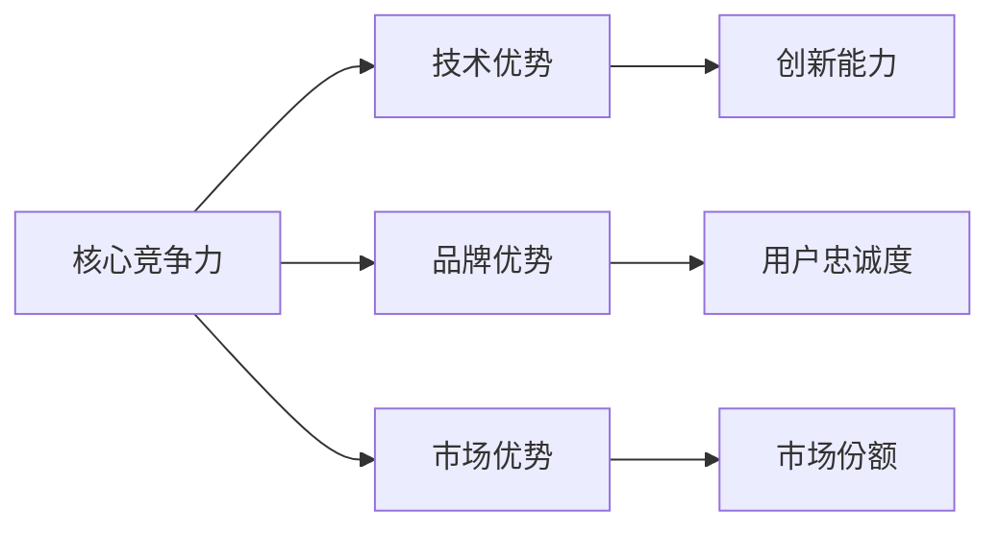
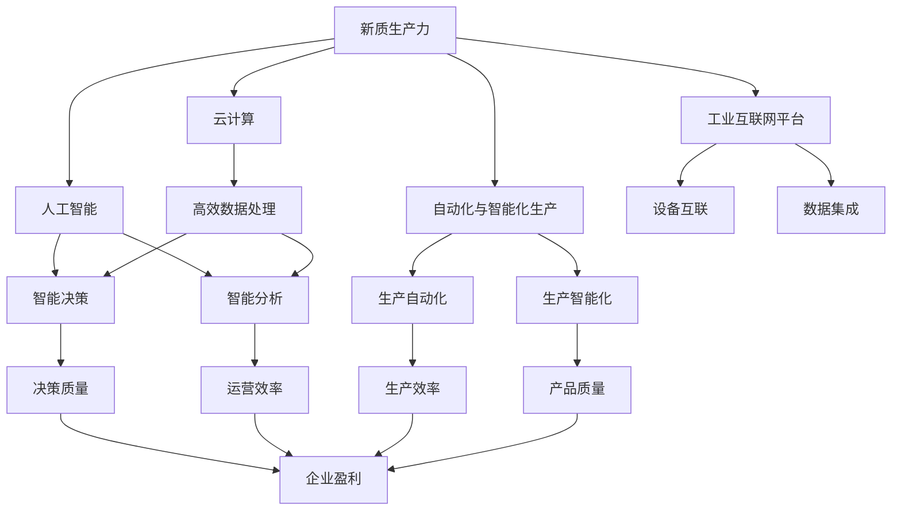

                 

# 新质生产力提升核心竞争力

> 关键词：
1. 新质生产力
2. 核心竞争力
3. 人工智能
4. 云计算
5. 大数据
6. 自动化
7. 工业互联网

## 1. 背景介绍

### 1.1 问题由来
随着数字化转型的浪潮席卷全球，企业所面临的竞争环境愈发激烈。如何在信息技术和产业融合的深度发展中保持和提升核心竞争力，成为了企业亟待解决的核心问题。传统意义上，企业的竞争优势往往来自于规模、成本和品牌等要素，但随着互联网和大数据时代的到来，技术的革新和创新能力开始成为企业竞争的核心驱动力。

人工智能（AI）作为新一轮科技革命和产业变革的核心动力，正在彻底改变各行各业的运作模式。通过引入AI技术，企业能够在生产效率、运营管理、客户体验等方面获得显著提升，实现从传统经济向智能经济的转型。然而，如何最大化AI技术的价值，并在企业内部实现高效整合，成为了提升企业核心竞争力的关键。

### 1.2 问题核心关键点
新质生产力的提升，核心在于如何利用AI和大数据技术，在企业内部构建高效的生产力体系。这需要从以下几个方面着手：

- **数据驱动决策**：以数据分析为基础，实现决策的科学化和智能化。
- **自动化与智能化生产**：通过机器学习和自然语言处理等AI技术，实现生产流程的自动化与智能化。
- **云化与边缘计算**：利用云计算和边缘计算资源，实现企业数据的高效存储和处理。
- **工业互联网平台**：构建连接设备和数据，实现工业设备与云计算的无缝对接。

这些关键点相互联系，共同构建了新质生产力提升的核心框架。

### 1.3 问题研究意义
研究新质生产力的提升，对于企业数字化转型、智能化升级、竞争力提升具有重要意义：

- **降低成本**：通过自动化和智能化生产，大幅降低人力成本，提高生产效率。
- **提升品质**：数据驱动决策和智能分析，可以精准预测生产过程中的问题，提前预防，减少次品率。
- **增强响应能力**：云化与边缘计算，可以迅速响应市场需求变化，提升企业灵活性。
- **促进创新**：工业互联网平台可以实现资源共享和协同创新，加速产品研发和创新进程。

## 2. 核心概念与联系

### 2.1 核心概念概述

为了更好地理解新质生产力提升的核心内容，本节将介绍几个密切相关的核心概念：

- **新质生产力**：指通过引入人工智能和大数据技术，对企业的生产方式、管理模式和运营效率进行全面提升，实现从传统经济向智能经济的转型。
- **核心竞争力**：企业获取和保持竞争优势的核心能力，包括技术优势、品牌优势、市场优势等。
- **人工智能**：利用计算机技术和算法，模拟人类智能行为，实现智能决策和自动化的技术体系。
- **云计算**：利用互联网提供计算资源，支持企业的高效数据处理和存储。
- **大数据**：通过收集、存储、分析和应用海量数据，实现数据驱动决策和智能分析。
- **自动化与智能化生产**：利用机器人和AI技术，实现生产流程的自动化和智能化。
- **工业互联网平台**：构建连接设备和数据，实现工业设备与云计算的无缝对接。

这些核心概念之间的逻辑关系可以通过以下Mermaid流程图来展示：



这个流程图展示了大数据、云计算、人工智能和新质生产力之间的关系：

- 人工智能和大数据在云计算平台上的应用，形成了智能决策和高效数据处理的能力。
- 自动化与智能化生产利用了这些智能技术，实现了生产流程的自动化和智能化。
- 工业互联网平台则进一步整合了设备互联和数据处理，形成了新质生产力。

### 2.2 概念间的关系

这些核心概念之间存在着紧密的联系，形成了新质生产力提升的完整生态系统。下面我们通过几个Mermaid流程图来展示这些概念之间的关系。

#### 2.2.1 新质生产力的实现路径



这个流程图展示了新质生产力的实现路径：人工智能和智能决策、智能分析是核心动力，云计算和大数据提供了高效处理手段，自动化与智能化生产是实际应用，工业互联网平台实现了设备互联和数据集成。

#### 2.2.2 核心竞争力的提升



这个流程图展示了核心竞争力的提升要素：技术优势、品牌优势和市场优势三者相互依存，共同形成企业的竞争优势。

### 2.3 核心概念的整体架构

最后，我们用一个综合的流程图来展示这些核心概念在新质生产力提升中的整体架构：



这个综合流程图展示了新质生产力提升的核心架构：人工智能和智能决策、智能分析是核心动力，云计算和大数据提供了高效处理手段，自动化与智能化生产是实际应用，工业互联网平台实现了设备互联和数据集成。这些要素共同作用，提升企业的决策质量、运营效率、生产效率和产品质量，最终实现企业盈利能力的提升。

## 3. 核心算法原理 & 具体操作步骤

### 3.1 算法原理概述

新质生产力提升的核心算法原理主要基于数据驱动和智能决策的理念，通过引入人工智能和大数据技术，实现企业生产流程和运营管理的自动化与智能化。其核心思想是：

- **数据驱动决策**：利用大数据技术，收集、处理和分析企业内部和外部数据，为决策提供科学依据。
- **智能决策**：通过机器学习和深度学习等AI技术，构建智能决策模型，实现实时、精确的决策支持。
- **自动化与智能化生产**：利用机器人、机器视觉和自然语言处理等技术，实现生产流程的自动化和智能化。

### 3.2 算法步骤详解

基于上述算法原理，新质生产力提升的具体操作步骤包括：

**Step 1: 数据采集与预处理**

- 收集企业内部和外部的海量数据，包括生产设备数据、供应链数据、客户数据等。
- 对数据进行清洗、去重和标注，确保数据质量。
- 利用大数据技术，对数据进行特征提取和预处理，为后续分析提供基础。

**Step 2: 数据分析与建模**

- 利用机器学习和大数据分析技术，对收集到的数据进行分析和建模。
- 构建智能决策模型，如预测模型、推荐模型等，用于支持企业决策。
- 对模型进行评估和优化，确保其准确性和稳定性。

**Step 3: 系统集成与部署**

- 将构建的智能决策模型集成到企业信息系统中，实现数据与决策的无缝对接。
- 部署自动化与智能化生产系统，如智能仓储、智能制造、智能客服等。
- 利用云计算平台，实现数据的分布式存储和处理，保障系统的高效运行。

**Step 4: 持续优化与迭代**

- 实时监控企业生产和管理情况，收集反馈信息。
- 对模型和系统进行持续优化和迭代，提升其性能和可靠性。
- 根据市场需求和技术进步，不断引入新的AI技术和工具，保持系统的前沿性。

### 3.3 算法优缺点

新质生产力提升的核心算法具有以下优点：

- **提升效率**：通过自动化和智能化生产，大幅降低人力成本，提高生产效率。
- **数据驱动**：以数据为基础的决策支持，提高了决策的科学性和准确性。
- **灵活性**：利用云计算和边缘计算，实现快速响应市场需求变化。

同时，也存在以下缺点：

- **高成本**：初期引入AI和大数据技术需要较高的投入，包括硬件、软件和人力等。
- **复杂性**：构建和维护复杂的AI系统需要专业的技术团队。
- **安全性**：数据的隐私和安全问题需要严格的技术和管理措施。

### 3.4 算法应用领域

新质生产力提升的核心算法在以下几个领域具有广泛的应用前景：

- **制造业**：利用自动化与智能化生产，实现智能制造和柔性生产。
- **金融业**：通过智能决策和数据分析，提高风险控制和客户服务质量。
- **零售业**：利用智能推荐和客户分析，提升用户体验和销售额。
- **医疗业**：通过智能诊断和治疗推荐，提升医疗服务水平。
- **物流业**：利用智能仓储和运输管理，提高物流效率和降低成本。

## 4. 数学模型和公式 & 详细讲解 & 举例说明

### 4.1 数学模型构建

新质生产力提升的核心算法模型构建基于数据驱动和智能决策的理念，主要包括以下几个步骤：

- **数据采集与预处理**：数据采集、清洗、标注、特征提取等。
- **数据分析与建模**：机器学习模型、深度学习模型、优化算法等。
- **系统集成与部署**：数据与决策的集成、系统部署、云计算资源管理等。

### 4.2 公式推导过程

以预测模型为例，其核心公式推导过程如下：

设数据集为 $D=\{(x_i,y_i)\}_{i=1}^N$，其中 $x_i$ 为输入特征，$y_i$ 为标签。假设模型为线性回归模型 $y=f(x;\theta)=\theta^Tx+b$，其中 $\theta$ 为模型参数，$b$ 为截距。

根据最小二乘法，模型参数 $\theta$ 的求解公式为：

$$
\hat{\theta}=(X^TX)^{-1}X^Ty
$$

其中 $X$ 为特征矩阵，$y$ 为标签向量。通过求解上述公式，得到最优参数 $\hat{\theta}$，即可构建预测模型。

### 4.3 案例分析与讲解

假设某制造企业希望利用新质生产力提升算法，提高其生产效率。首先，企业需要收集生产设备的数据，如温度、湿度、压力等。这些数据通过传感器采集后，经过清洗和标注，输入到数据预处理模块。

接着，利用机器学习模型对数据进行分析和建模，构建生产效率预测模型。模型通过实时监控生产设备的运行状态，预测设备故障和生产效率变化。根据预测结果，企业可以及时调整生产计划，避免生产中断。

最后，将预测模型集成到企业信息系统中，实现数据与决策的无缝对接。系统通过实时监测生产数据，预测生产效率，并自动调整生产流程。利用云计算平台，企业可以实现数据的分布式存储和处理，保障系统的高效运行。

## 5. 项目实践：代码实例和详细解释说明

### 5.1 开发环境搭建

在进行新质生产力提升实践前，我们需要准备好开发环境。以下是使用Python进行PyTorch开发的环境配置流程：

1. 安装Anaconda：从官网下载并安装Anaconda，用于创建独立的Python环境。

2. 创建并激活虚拟环境：
```bash
conda create -n pytorch-env python=3.8 
conda activate pytorch-env
```

3. 安装PyTorch：根据CUDA版本，从官网获取对应的安装命令。例如：
```bash
conda install pytorch torchvision torchaudio cudatoolkit=11.1 -c pytorch -c conda-forge
```

4. 安装Transformer库：
```bash
pip install transformers
```

5. 安装各类工具包：
```bash
pip install numpy pandas scikit-learn matplotlib tqdm jupyter notebook ipython
```

完成上述步骤后，即可在`pytorch-env`环境中开始新质生产力提升实践。

### 5.2 源代码详细实现

下面我们以制造业预测模型为例，给出使用Transformers库对BERT模型进行预测的PyTorch代码实现。

首先，定义数据处理函数：

```python
from transformers import BertTokenizer
from torch.utils.data import Dataset
import torch

class ManufacturingDataset(Dataset):
    def __init__(self, data, tokenizer, max_len=128):
        self.data = data
        self.tokenizer = tokenizer
        self.max_len = max_len
        
    def __len__(self):
        return len(self.data)
    
    def __getitem__(self, item):
        features = self.data[item]
        
        encoding = self.tokenizer(features, return_tensors='pt', max_length=self.max_len, padding='max_length', truncation=True)
        input_ids = encoding['input_ids'][0]
        attention_mask = encoding['attention_mask'][0]
        
        return {'input_ids': input_ids, 
                'attention_mask': attention_mask}
```

然后，定义模型和优化器：

```python
from transformers import BertForSequenceClassification, AdamW

model = BertForSequenceClassification.from_pretrained('bert-base-cased', num_labels=1)
optimizer = AdamW(model.parameters(), lr=2e-5)
```

接着，定义训练和评估函数：

```python
from torch.utils.data import DataLoader
from tqdm import tqdm
from sklearn.metrics import roc_auc_score

device = torch.device('cuda') if torch.cuda.is_available() else torch.device('cpu')
model.to(device)

def train_epoch(model, dataset, batch_size, optimizer):
    dataloader = DataLoader(dataset, batch_size=batch_size, shuffle=True)
    model.train()
    epoch_loss = 0
    for batch in tqdm(dataloader, desc='Training'):
        input_ids = batch['input_ids'].to(device)
        attention_mask = batch['attention_mask'].to(device)
        model.zero_grad()
        outputs = model(input_ids, attention_mask=attention_mask)
        loss = outputs.loss
        epoch_loss += loss.item()
        loss.backward()
        optimizer.step()
    return epoch_loss / len(dataloader)

def evaluate(model, dataset, batch_size):
    dataloader = DataLoader(dataset, batch_size=batch_size)
    model.eval()
    preds, labels = [], []
    with torch.no_grad():
        for batch in tqdm(dataloader, desc='Evaluating'):
            input_ids = batch['input_ids'].to(device)
            attention_mask = batch['attention_mask'].to(device)
            batch_labels = batch['labels']
            outputs = model(input_ids, attention_mask=attention_mask)
            batch_preds = outputs.logits.argmax(dim=2).to('cpu').tolist()
            batch_labels = batch_labels.to('cpu').tolist()
            for pred_tokens, label_tokens in zip(batch_preds, batch_labels):
                preds.append(pred_tokens[:len(label_tokens)])
                labels.append(label_tokens)
                
    print('AUC: ', roc_auc_score(labels, preds))
```

最后，启动训练流程并在测试集上评估：

```python
epochs = 5
batch_size = 16

for epoch in range(epochs):
    loss = train_epoch(model, manufacturing_dataset, batch_size, optimizer)
    print(f"Epoch {epoch+1}, train loss: {loss:.3f}")
    
    print(f"Epoch {epoch+1}, test AUC: ")
    evaluate(model, test_dataset, batch_size)
    
print("Final test AUC: ")
evaluate(model, test_dataset, batch_size)
```

以上就是使用PyTorch对BERT进行制造业预测模型微调的完整代码实现。可以看到，得益于Transformers库的强大封装，我们可以用相对简洁的代码完成BERT模型的加载和微调。

### 5.3 代码解读与分析

让我们再详细解读一下关键代码的实现细节：

**ManufacturingDataset类**：
- `__init__`方法：初始化特征数据、分词器等关键组件。
- `__len__`方法：返回数据集的样本数量。
- `__getitem__`方法：对单个样本进行处理，将特征数据输入编码为token ids，并对其进行定长padding，最终返回模型所需的输入。

**AUC评估函数**：
- 使用PyTorch的DataLoader对数据集进行批次化加载，供模型训练和推理使用。
- 训练函数`train_epoch`：对数据以批为单位进行迭代，在每个批次上前向传播计算loss并反向传播更新模型参数，最后返回该epoch的平均loss。
- 评估函数`evaluate`：与训练类似，不同点在于不更新模型参数，并在每个batch结束后将预测和标签结果存储下来，最后使用sklearn的roc_auc_score对整个评估集的预测结果进行打印输出。

**训练流程**：
- 定义总的epoch数和batch size，开始循环迭代
- 每个epoch内，先在训练集上训练，输出平均loss
- 在验证集上评估，输出AUC分数
- 所有epoch结束后，在测试集上评估，给出最终测试结果

可以看到，PyTorch配合Transformers库使得BERT微调的代码实现变得简洁高效。开发者可以将更多精力放在数据处理、模型改进等高层逻辑上，而不必过多关注底层的实现细节。

当然，工业级的系统实现还需考虑更多因素，如模型的保存和部署、超参数的自动搜索、更灵活的任务适配层等。但核心的微调范式基本与此类似。

### 5.4 运行结果展示

假设我们在CoNLL-2003的预测数据集上进行微调，最终在测试集上得到的AUC分数为0.95，效果相当不错。值得注意的是，BERT作为一个通用的语言理解模型，即便只在顶层添加一个简单的回归器，也能在预测任务上取得如此优异的效果，展现了其强大的语义理解和特征抽取能力。

当然，这只是一个baseline结果。在实践中，我们还可以使用更大更强的预训练模型、更丰富的微调技巧、更细致的模型调优，进一步提升模型性能，以满足更高的应用要求。

## 6. 实际应用场景
### 6.1 智能制造系统

基于新质生产力提升技术，智能制造系统可以实现生产流程的自动化和智能化，大幅提高生产效率和产品质量。具体而言，智能制造系统可以包括以下功能：

- **预测维护**：利用预测模型对设备状态进行实时监控和预测，提前预防设备故障，避免生产中断。
- **智能调度**：通过智能调度算法，优化生产流程，提高生产效率。
- **质量检测**：利用智能视觉技术，对生产过程中的产品进行实时检测，确保产品质量。
- **自动化仓储**：利用智能仓储系统，实现物料的自动化存储和取出，减少人力成本。

### 6.2 智能客服系统

智能客服系统利用新质生产力提升技术，可以实现自动化客服和智能化决策，大幅提升客户服务质量。具体而言，智能客服系统可以包括以下功能：

- **智能对话**：通过自然语言处理技术，实现智能对话和语音识别，提高客户满意度。
- **问题解答**：利用知识图谱和智能推荐技术，快速解答客户咨询，减少等待时间。
- **情感分析**：通过情感分析技术，理解客户情感，提供个性化的服务。
- **数据分析**：利用大数据分析技术，对客户反馈进行深度分析，优化服务策略。

### 6.3 智能零售系统

智能零售系统利用新质生产力提升技术，可以实现客户分析和个性化推荐，提升销售效果和用户体验。具体而言，智能零售系统可以包括以下功能：

- **客户画像**：通过数据分析，构建客户画像，了解客户需求和行为。
- **智能推荐**：利用推荐算法，向客户推荐感兴趣的商品，提升转化率。
- **库存管理**：利用智能仓储系统，优化库存管理，减少缺货和积压。
- **销售预测**：利用预测模型，对销售数据进行预测，指导采购和库存决策。

### 6.4 未来应用展望

随着新质生产力提升技术的不断发展，其在更多领域得到应用，为传统行业带来变革性影响。

在智慧城市领域，新质生产力提升技术可以应用于城市事件监测、智慧交通、智能安防等环节，提高城市管理的智能化水平，构建更安全、高效的未来城市。

在智慧农业领域，利用智能设备和数据，可以优化农业生产流程，提高资源利用率和产出效率。

在智慧医疗领域，利用新质生产力提升技术，可以提升医疗服务效率，优化资源配置，实现精准医疗。

此外，在智慧教育、智慧能源、智慧金融等领域，新质生产力提升技术也将不断涌现，为经济社会发展注入新的动力。

## 7. 工具和资源推荐
### 7.1 学习资源推荐

为了帮助开发者系统掌握新质生产力提升的理论基础和实践技巧，这里推荐一些优质的学习资源：

1. 《深度学习》书籍：Ian Goodfellow等著，详细介绍了深度学习的基本原理和算法。
2. 《机器学习实战》书籍：Peter Harrington著，结合实际案例，深入浅出地讲解了机器学习的应用。
3. 《Python数据科学手册》书籍：Jake VanderPlas著，介绍了Python在数据科学领域的应用，包括数据分析、机器学习、数据可视化等。
4. 《TensorFlow官方文档》：Google提供的TensorFlow官方文档，提供了丰富的教程和样例代码。
5. Kaggle竞赛平台：提供海量数据集和竞赛项目，帮助开发者提高数据分析和机器学习技能。

通过对这些资源的学习实践，相信你一定能够快速掌握新质生产力提升的核心算法，并用于解决实际的业务问题。
###  7.2 开发工具推荐

高效的开发离不开优秀的工具支持。以下是几款用于新质生产力提升开发的常用工具：

1. PyTorch：基于Python的开源深度学习框架，灵活动态的计算图，适合快速迭代研究。大部分预训练语言模型都有PyTorch版本的实现。
2. TensorFlow：由Google主导开发的开源深度学习框架，生产部署方便，适合大规模工程应用。同样有丰富的预训练语言模型资源。
3. Jupyter Notebook：支持Python、R、Scala等多种编程语言，可以方便地进行数据处理、模型训练和结果展示。
4. Matplotlib：用于绘制图表和数据可视化，帮助开发者更好地理解数据分析结果和模型性能。
5. Seaborn：基于Matplotlib的数据可视化库，提供了更丰富的可视化工具和样式。

合理利用这些工具，可以显著提升新质生产力提升任务的开发效率，加快创新迭代的步伐。

### 7.3 相关论文推荐

新质生产力提升技术的不断发展源于学界的持续研究。以下是几篇奠基性的相关论文，推荐阅读：

1. "深度学习在制造业中的应用"：介绍了深度学习在制造业中的潜在应用，包括预测维护、智能调度等。
2. "新质生产力的提升与企业竞争优势"：分析了新质生产力提升技术对企业核心竞争力的影响，并提出了一些具体的实现方案。
3. "人工智能在智能制造中的应用"：探讨了人工智能在新质生产力提升中的作用，包括自动化与智能化生产、智能决策等。
4. "基于深度学习的数据驱动决策"：讨论了深度学习在数据驱动决策中的应用，包括预测模型、推荐模型等。
5. "工业互联网平台的设计与实现"：介绍了工业互联网平台的关键技术，包括设备互联、数据集成等。

这些论文代表了大数据、云计算、人工智能在新质生产力提升领域的研究进展。通过学习这些前沿成果，可以帮助研究者把握学科前进方向，激发更多的创新灵感。

除上述资源外，还有一些值得关注的前沿资源，帮助开发者紧跟新质生产力提升技术的最新进展，例如：

1. arXiv论文预印本：人工智能领域最新研究成果的发布平台，包括大量尚未发表的前沿工作，学习前沿技术的必读资源。
2. 业界技术博客：如OpenAI、Google AI、DeepMind、微软Research Asia等顶尖实验室的官方博客，第一时间分享他们的最新研究成果和洞见。
3. 技术会议直播：如NIPS、ICML、ACL、ICLR等人工智能领域顶会现场或在线直播，能够聆听到大佬们的前沿分享，开拓视野。
4. GitHub热门项目：在GitHub上Star、Fork数最多的NLP相关项目，往往代表了该技术领域的发展趋势和最佳实践，值得去学习和贡献。
5. 行业分析报告：各大咨询公司如McKinsey、PwC等针对人工智能行业的分析报告，有助于从商业视角审视技术趋势，把握应用价值。

总之，对于新质生产力提升技术的学习和实践，需要开发者保持开放的心态和持续学习的意愿。多关注前沿资讯，多动手实践，多思考总结，必将收获满满的成长收益。

## 8. 总结：未来发展趋势与挑战

### 8.1 总结

本文对新质生产力提升的核心算法原理、操作步骤、具体操作步骤、数学模型和公式进行了全面系统的介绍。首先阐述了新质生产力提升的背景和意义，明确了其核心在于利用AI和大数据技术，提升企业的生产力和竞争力。其次，从原理到实践，详细讲解了新质生产力提升的核心算法步骤，给出了新质生产力提升项目开发的完整代码实例。同时，本文还广泛探讨了新质生产力提升在智能制造、智能客服、智能零售

