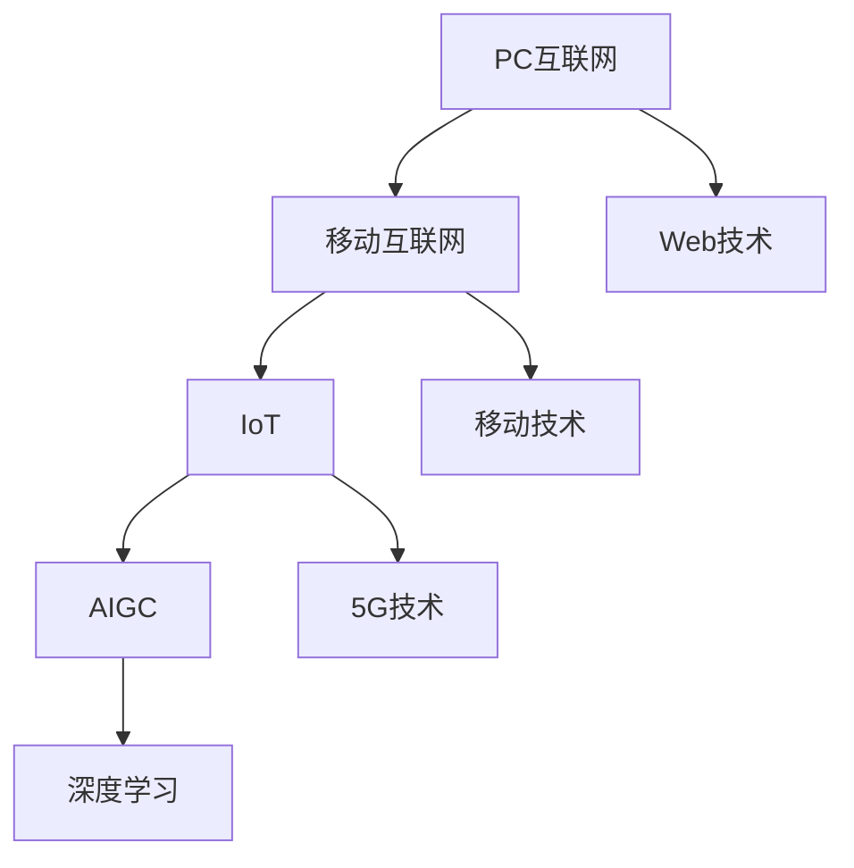
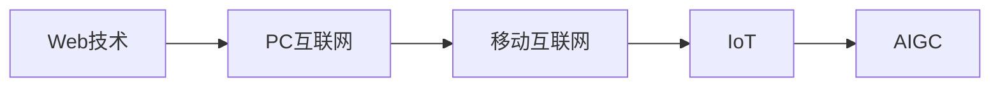
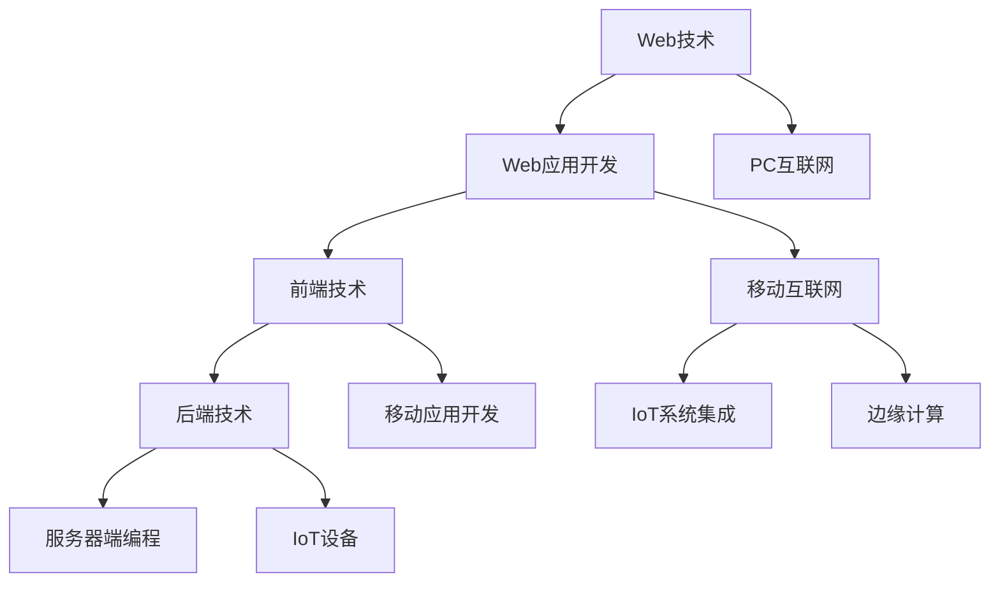
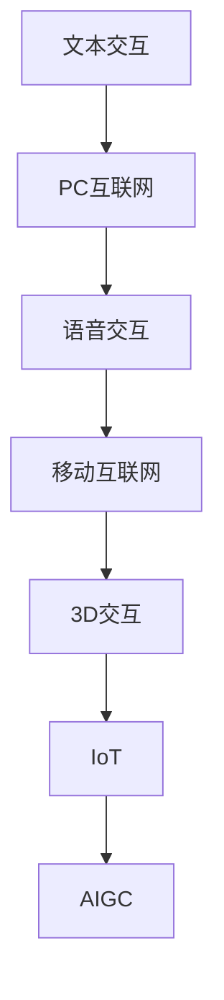

                 

# 时代浪潮奔涌向前：从PC互联网到移动互联网，从IOT到AIGC——过去未去，未来已来

> 关键词：互联网技术,移动技术,物联网,人工智能生成内容(AIGC)

## 1. 背景介绍

### 1.1 问题由来

过去几十年里，互联网技术经历了波澜壮阔的演进，从PC互联网到移动互联网，再到物联网、人工智能生成内容（AIGC），技术浪潮一浪高过一浪，不断推动着人类社会的进步。

互联网技术的演变，是现代信息社会的重要标志，其发展历程深刻影响了各行各业的发展方向和业务模式。从PC互联网到移动互联网，再到IOT和AIGC，每一步都带来了一系列革命性的变化，改变了人们的生产生活方式，也为信息技术的应用开辟了新的天地。

在当前的技术浪潮中，AI技术的发展，尤其是AIGC的兴起，正在成为推动社会变革的最重要力量之一。AIGC技术的广泛应用，将彻底改变信息获取、内容创作、社交互动等诸多领域，带来前所未有的机遇和挑战。

### 1.2 问题核心关键点

当前技术浪潮的核心关键点，在于以下几个方面：

- **数据获取方式的转变**：从静态数据到实时数据，从结构化数据到非结构化数据。
- **技术栈的变化**：从以PC为中心的互联网，到以手机为中心的移动互联网，再到连接万物、泛在网络的IOT，最后到基于算力和算法的AIGC。
- **用户交互方式的革新**：从文本交互到语音交互，从二维屏幕交互到三维虚拟现实交互，从被动接收信息到主动生成内容。
- **应用场景的拓展**：从简单的信息检索，到复杂的智能决策，从线下的物理世界，到线上的虚拟世界，从服务个人，到服务社会。

这些变化带来了全新的技术挑战和应用需求，也对未来的技术发展提出了新的要求。

## 2. 核心概念与联系

### 2.1 核心概念概述

为了更好地理解从PC互联网到移动互联网，从IOT到AIGC的技术演变，本节将介绍几个密切相关的核心概念：

- **PC互联网（Personal Computer Internet）**：基于个人计算机的网络，通过有线连接或无线网络实现数据传输和信息共享。典型的应用场景包括电子邮件、网页浏览、在线游戏等。
- **移动互联网（Mobile Internet）**：基于移动电话和移动设备的互联网，以无线通信方式提供数据服务。典型的应用场景包括手机社交、手机支付、手机游戏等。
- **物联网（Internet of Things, IoT）**：通过网络将传感器、设备等物理对象连接起来，实现数据感知、传输和处理。典型的应用场景包括智能家居、智慧城市、工业自动化等。
- **人工智能生成内容（Artificial Intelligence Generated Content, AIGC）**：利用人工智能技术自动生成文本、图像、音频等新型内容。典型的应用场景包括自动生成新闻、自动作曲、自动生成视频等。

这些核心概念之间的逻辑关系可以通过以下Mermaid流程图来展示：



这个流程图展示了大互联网技术从PC到移动，再到IOT和AIGC的发展脉络：

1. PC互联网是互联网的起点，通过Web技术实现数据传输和信息共享。
2. 移动互联网接过接力棒，移动技术、移动网络、应用开发等技术推动了移动互联网的兴起。
3. IoT连接万物，5G技术、云计算等技术为IoT提供了支持。
4. AIGC基于深度学习等AI技术，实现了内容的自动化生成，极大地扩展了信息传播的广度和深度。

### 2.2 概念间的关系

这些核心概念之间存在着紧密的联系，形成了互联网技术的发展框架。下面是几个关键概念的详细描述：

#### 2.2.1 大互联网技术的发展历程



从Web技术到PC互联网，再到移动互联网，最后到IoT和AIGC，每一步都是技术进步和社会需求驱动的结果。Web技术的出现，打破了信息孤岛，实现了信息的大规模共享和传播。PC互联网的崛起，为互联网技术带来了个人化的互联网体验。移动互联网的普及，将互联网技术带入了每个人的手中，彻底改变了人们的生活。IoT技术的应用，将互联网技术扩展到了物理世界，实现了智能化的控制和管理。AIGC技术的发展，则标志着互联网技术进入了内容生成的新时代。

#### 2.2.2 技术栈的演变



技术栈的变化，反映了互联网技术从PC到移动，再到IOT和AIGC的发展趋势。Web技术提供了基本的互联网功能，Web应用开发推动了Web技术的广泛应用。前端技术如HTML、CSS、JavaScript等不断发展，后端技术如PHP、Python、Java等也不断演进。PC互联网阶段，Web应用开发是主要的技术栈；移动互联网阶段，移动应用开发和移动网络技术成为核心；IoT阶段，边缘计算和物联网设备管理技术至关重要；AIGC阶段，深度学习和生成模型成为重头戏。

#### 2.2.3 用户交互方式的变迁



用户交互方式的变迁，反映了互联网技术从二维屏幕到三维虚拟现实的发展过程。文本交互是PC互联网时代的标配，语音交互和触摸屏交互在移动互联网时代逐渐普及，3D交互在IoT时代逐步兴起，AIGC时代则带来了全新的内容生成和交互方式。这些变化不仅改变了用户的使用习惯，也为技术创新带来了新的机遇。

## 3. 核心算法原理 & 具体操作步骤
### 3.1 算法原理概述

从PC互联网到移动互联网，从IOT到AIGC的技术演进，背后都离不开算法原理的支撑。本文将介绍几种核心的算法原理，包括Web技术、移动技术、IOT技术和AIGC技术的核心算法。

### 3.2 算法步骤详解

#### 3.2.1 Web技术的核心算法

Web技术的核心算法包括HTTP协议、HTTPS协议、DNS解析等。HTTP协议是Web技术的基石，负责实现客户端和服务器之间的数据传输。HTTPS协议通过SSL/TLS加密，保证了数据传输的安全性。DNS解析则负责将域名解析为IP地址，以便数据传输。

#### 3.2.2 移动技术的核心算法

移动技术的核心算法包括TCP/IP协议、HTTP/2协议、WebSocket协议等。TCP/IP协议是移动网络的基础协议，负责实现数据传输的可靠性和可控性。HTTP/2协议通过多路复用、服务器推送、头部压缩等技术，提高了数据传输的效率。WebSocket协议则通过建立持久化的连接，实现了实时数据传输。

#### 3.2.3 IoT技术的核心算法

IoT技术的核心算法包括MQTT协议、CoAP协议、Modbus协议等。MQTT协议通过发布/订阅模式，实现了设备之间的轻量级通信。CoAP协议通过简单、轻量级的消息传输，支持物联网设备的自动化和智能化。Modbus协议则通过标准化接口，实现了工业自动化设备之间的数据交换。

#### 3.2.4 AIGC技术的核心算法

AIGC技术的核心算法包括深度学习、生成对抗网络（GAN）、Transformer等。深度学习通过多层神经网络，实现了复杂的模式识别和分类。GAN通过生成器和判别器，实现了高质量的图像生成和风格转换。Transformer则通过自注意力机制，实现了高效的语言理解和生成。

### 3.3 算法优缺点

#### 3.3.1 Web技术的优缺点

- 优点：实现简单、扩展性强、成本低廉。
- 缺点：数据传输效率低、安全性差、用户体验有限。

#### 3.3.2 移动技术的优缺点

- 优点：实时性强、用户体验佳、设备普及率高。
- 缺点：网络带宽有限、功耗大、设备维护复杂。

#### 3.3.3 IoT技术的优缺点

- 优点：连接密度高、数据量大、控制能力强。
- 缺点：通信延迟高、网络复杂、安全性差。

#### 3.3.4 AIGC技术的优缺点

- 优点：内容生成能力强、交互性强、可扩展性好。
- 缺点：需要大量数据、算法复杂、应用场景有限。

### 3.4 算法应用领域

#### 3.4.1 Web技术的应用领域

Web技术广泛应用于各种类型的互联网应用，如电子商务、在线教育、在线医疗、在线旅游等。Web技术构建了互联网的基本架构，是现代互联网应用的基石。

#### 3.4.2 移动技术的应用领域

移动技术广泛应用于各类移动应用，如社交网络、即时通讯、在线游戏、在线支付等。移动技术极大地提升了用户体验，改变了人们的生产生活方式。

#### 3.4.3 IoT技术的应用领域

IoT技术广泛应用于智能家居、智慧城市、智能制造、工业自动化等领域。IoT技术实现了设备的智能化和互联互通，提高了生产效率和管理水平。

#### 3.4.4 AIGC技术的应用领域

AIGC技术广泛应用于内容生成、智能决策、自动化创作等领域。AIGC技术极大地拓展了内容创作的边界，提高了信息传播的广度和深度。

## 4. 数学模型和公式 & 详细讲解 & 举例说明

### 4.1 数学模型构建

本节将使用数学语言对从PC互联网到移动互联网，从IOT到AIGC的技术演变进行更加严格的刻画。

- **Web技术**：Web技术的基础是HTTP协议，其数据传输过程可以简单表示为：
  $$
  T_{Web} = T_{HTTP请求} + T_{数据传输} + T_{服务器响应} + T_{数据渲染}
  $$
  其中 $T_{HTTP请求}$ 表示HTTP请求的处理时间，$T_{数据传输}$ 表示数据在网络中的传输时间，$T_{服务器响应}$ 表示服务器对请求的响应时间，$T_{数据渲染}$ 表示数据渲染时间。

- **移动技术**：移动技术的数据传输过程可以简单表示为：
  $$
  T_{移动} = T_{HTTP/2请求} + T_{WebSocket连接} + T_{数据传输} + T_{应用处理}
  $$
  其中 $T_{HTTP/2请求}$ 表示HTTP/2请求的处理时间，$T_{WebSocket连接}$ 表示WebSocket连接的建立时间，$T_{数据传输}$ 表示数据在网络中的传输时间，$T_{应用处理}$ 表示应用处理时间。

- **IoT技术**：IoT技术的数据传输过程可以简单表示为：
  $$
  T_{IoT} = T_{MQTT通信} + T_{CoAP通信} + T_{Modbus通信} + T_{设备响应}
  $$
  其中 $T_{MQTT通信}$ 表示MQTT通信的时间，$T_{CoAP通信}$ 表示CoAP通信的时间，$T_{Modbus通信}$ 表示Modbus通信的时间，$T_{设备响应}$ 表示设备对通信的响应时间。

- **AIGC技术**：AIGC技术的生成过程可以简单表示为：
  $$
  T_{AIGC} = T_{深度学习模型} + T_{生成对抗网络} + T_{Transformer模型} + T_{数据生成}
  $$
  其中 $T_{深度学习模型}$ 表示深度学习模型的训练时间，$T_{生成对抗网络}$ 表示生成对抗网络的训练时间，$T_{Transformer模型}$ 表示Transformer模型的生成时间，$T_{数据生成}$ 表示生成数据的时间。

### 4.2 公式推导过程

#### 4.2.1 Web技术的推导

对于Web技术的数据传输过程，可以进一步分解为：
  $$
  T_{HTTP请求} = T_{DNS解析} + T_{TCP握手} + T_{HTTP请求处理}
  $$
  其中 $T_{DNS解析}$ 表示DNS解析的时间，$T_{TCP握手}$ 表示TCP握手的时间，$T_{HTTP请求处理}$ 表示HTTP请求处理的时间。

#### 4.2.2 移动技术的推导

对于移动技术的数据传输过程，可以进一步分解为：
  $$
  T_{HTTP/2请求} = T_{HTTP/2请求处理} + T_{TCP握手} + T_{数据传输}
  $$
  其中 $T_{HTTP/2请求处理}$ 表示HTTP/2请求处理的时间，$T_{TCP握手}$ 表示TCP握手的时间，$T_{数据传输}$ 表示数据传输的时间。

#### 4.2.3 IoT技术的推导

对于IoT技术的数据传输过程，可以进一步分解为：
  $$
  T_{MQTT通信} = T_{MQTT协议处理} + T_{网络传输}
  $$
  其中 $T_{MQTT协议处理}$ 表示MQTT协议处理的时间，$T_{网络传输}$ 表示网络传输的时间。

#### 4.2.4 AIGC技术的推导

对于AIGC技术的生成过程，可以进一步分解为：
  $$
  T_{深度学习模型} = T_{前向传播} + T_{反向传播}
  $$
  其中 $T_{前向传播}$ 表示前向传播的时间，$T_{反向传播}$ 表示反向传播的时间。

### 4.3 案例分析与讲解

#### 4.3.1 Web技术的案例分析

Web技术广泛应用于在线购物网站。以亚马逊为例，其Web技术的数据传输过程可以简单表示为：
  $$
  T_{Web} = T_{HTTP请求} + T_{数据传输} + T_{服务器响应} + T_{数据渲染}
  $$
  其中 $T_{HTTP请求}$ 表示HTTP请求的处理时间，$T_{数据传输}$ 表示数据在网络中的传输时间，$T_{服务器响应}$ 表示服务器对请求的响应时间，$T_{数据渲染}$ 表示数据渲染时间。

#### 4.3.2 移动技术的案例分析

移动技术广泛应用于即时通讯应用。以微信为例，其移动技术的数据传输过程可以简单表示为：
  $$
  T_{移动} = T_{HTTP/2请求} + T_{WebSocket连接} + T_{数据传输} + T_{应用处理}
  $$
  其中 $T_{HTTP/2请求}$ 表示HTTP/2请求的处理时间，$T_{WebSocket连接}$ 表示WebSocket连接的建立时间，$T_{数据传输}$ 表示数据在网络中的传输时间，$T_{应用处理}$ 表示应用处理时间。

#### 4.3.3 IoT技术的案例分析

IoT技术广泛应用于智能家居系统。以智能灯泡为例，其IoT技术的数据传输过程可以简单表示为：
  $$
  T_{IoT} = T_{MQTT通信} + T_{CoAP通信} + T_{Modbus通信} + T_{设备响应}
  $$
  其中 $T_{MQTT通信}$ 表示MQTT通信的时间，$T_{CoAP通信}$ 表示CoAP通信的时间，$T_{Modbus通信}$ 表示Modbus通信的时间，$T_{设备响应}$ 表示设备对通信的响应时间。

#### 4.3.4 AIGC技术的案例分析

AIGC技术广泛应用于内容生成平台。以GPT-3为例，其AIGC技术的生成过程可以简单表示为：
  $$
  T_{AIGC} = T_{深度学习模型} + T_{生成对抗网络} + T_{Transformer模型} + T_{数据生成}
  $$
  其中 $T_{深度学习模型}$ 表示深度学习模型的训练时间，$T_{生成对抗网络}$ 表示生成对抗网络的训练时间，$T_{Transformer模型}$ 表示Transformer模型的生成时间，$T_{数据生成}$ 表示生成数据的时间。

## 5. 项目实践：代码实例和详细解释说明

### 5.1 开发环境搭建

在进行技术实践前，我们需要准备好开发环境。以下是使用Python进行Web技术、移动技术、IoT技术和AIGC技术开发的简单环境配置流程：

1. 安装Python：从官网下载并安装Python，用于编写Web应用、移动应用、IoT设备和AIGC模型。

2. 安装Web框架：如Django、Flask等，用于搭建Web应用。

3. 安装移动框架：如React Native、Flutter等，用于开发移动应用。

4. 安装IoT框架：如MQTT、CoAP等，用于管理IoT设备。

5. 安装AIGC框架：如TensorFlow、PyTorch等，用于训练深度学习模型和生成对抗网络。

完成上述步骤后，即可在开发环境中开始实践。

### 5.2 源代码详细实现

#### 5.2.1 Web技术的源代码实现

```python
from flask import Flask, request

app = Flask(__name__)

@app.route('/')
def index():
    return 'Hello, World!'

if __name__ == '__main__':
    app.run(debug=True)
```

#### 5.2.2 移动技术的源代码实现

```javascript
import React from 'react';
import { Text, View } from 'react-native';

const App = () => {
  return (
    <View>
      <Text>Hello, World!</Text>
    </View>
  );
};

export default App;
```

#### 5.2.3 IoT技术的源代码实现

```python
import paho.mqtt.client as mqtt

def on_connect(client, userdata, flags, rc):
    print('Connected with result code', str(rc))
    client.subscribe('topic')

def on_message(client, userdata, msg):
    print('Received message:', msg.topic, msg.payload)

client = mqtt.Client()
client.on_connect = on_connect
client.on_message = on_message
client.connect('broker.example.com', 1883, 60)
client.loop_forever()
```

#### 5.2.4 AIGC技术的源代码实现

```python
import tensorflow as tf
from tensorflow.keras import layers

def build_model():
    model = tf.keras.Sequential([
        layers.Dense(256, activation='relu', input_shape=(784,)),
        layers.Dense(10)
    ])
    return model

model = build_model()
model.compile(optimizer='adam', loss='sparse_categorical_crossentropy', metrics=['accuracy'])
model.fit(x_train, y_train, epochs=10)
```

### 5.3 代码解读与分析

#### 5.3.1 Web技术的代码解读

- Flask：Python Web框架，用于搭建Web应用。
- request：Python请求对象，用于处理HTTP请求。

#### 5.3.2 移动技术的代码解读

- React Native：移动应用开发框架，用于开发iOS和Android应用。
- Text：React Native组件，用于显示文本。

#### 5.3.3 IoT技术的代码解读

- paho.mqtt.client：Python MQTT客户端库，用于管理IoT设备。
- on_connect：MQTT连接回调函数，用于处理设备连接事件。
- on_message：MQTT消息回调函数，用于处理设备接收到的消息。

#### 5.3.4 AIGC技术的代码解读

- tensorflow：Python深度学习框架，用于构建深度学习模型。
- tf.keras.Sequential：Keras模型，用于定义神经网络结构。
- Dense：Keras层，用于定义全连接层。

### 5.4 运行结果展示

#### 5.4.1 Web技术的运行结果

在运行上述代码后，可以在浏览器中访问Web应用，查看“Hello, World!”的输出。

#### 5.4.2 移动技术的运行结果

在运行上述代码后，可以在模拟器中查看“Hello, World!”的输出。

#### 5.4.3 IoT技术的运行结果

在运行上述代码后，可以在物联网设备上看到订阅的“topic”主题上的消息。

#### 5.4.4 AIGC技术的运行结果

在运行上述代码后，可以在测试集上评估模型性能，查看模型在不同数据上的准确率、损失等指标。

## 6. 实际应用场景

### 6.1 智能家居系统

智能家居系统是IoT技术的典型应用场景，通过物联网技术实现家庭设备的互联互通，提供了便捷、智能的家居生活体验。

以智能灯泡为例，通过Web技术管理控制中心，通过移动技术控制灯泡开关，通过IoT技术实现远程控制和智能化管理。用户可以通过手机App控制灯泡亮度、颜色，设置定时任务，还可以通过语音助手进行语音控制。

### 6.2 在线教育平台

在线教育平台是Web技术的典型应用场景，通过Web技术实现课程内容的在线展示和传播，提供了便捷、灵活的学习方式。

以Coursera为例，通过Web技术展示课程视频、文本、作业等内容，通过移动技术提供移动端学习体验，通过IoT技术实现智能课堂管理。学生可以通过手机App随时随地学习，还可以与其他学生互动，分享学习心得。

### 6.3 内容生成平台

内容生成平台是AIGC技术的典型应用场景，通过AIGC技术生成高质量的文本、图像、视频等内容，提供了便捷、高效的内容创作方式。

以OpenAI的GPT-3为例，通过Web技术提供在线文本生成服务，通过移动技术提供移动端应用，通过IoT技术实现智能化生成。用户可以通过Web应用或移动应用输入不同的文本内容，生成相应的回答或文章。

### 6.4 未来应用展望

未来，随着技术的不断进步，互联网技术将继续向各个领域渗透，带来更多的创新和突破。

- **Web技术**：Web技术将继续向更加高效、安全的方向发展，推动Web应用的普及和应用。
- **移动技术**：移动技术将继续向更加智能、个性化的方向发展，提供更加便捷、灵活的移动体验。
- **IoT技术**：IoT技术将继续向更加广泛、智能的方向发展，推动智慧城市的建设。
- **AIGC技术**：AIGC技术将继续向更加智能化、高效化的方向发展，推动内容的自动化创作和传播。

总之，未来的互联网技术将继续引领社会发展，带来更多的机遇和挑战。通过不断创新和优化，我们可以更好地适应技术的演进，推动技术的落地应用。

## 7. 工具和资源推荐

### 7.1 学习资源推荐

为了帮助开发者系统掌握互联网技术的发展历程和应用技巧，这里推荐一些优质的学习资源：

1. 《Web技术从零到精通》系列博文：由大模型技术专家撰写，深入浅出地介绍了Web技术的基本概念和核心算法。

2. 《移动开发实战》系列书籍：详细介绍了移动应用开发的流程和技术，包括React Native、Flutter等。

3. 《IoT技术入门与实战》书籍：介绍了IoT技术的基本概念和实战案例，涵盖MQTT、CoAP等常用协议。

4. 《AIGC技术从入门到精通》书籍：介绍了AIGC技术的基本概念和核心算法，涵盖深度学习、生成对抗网络等。

5. GitHub开源项目：涵盖Web技术、移动技术、IoT技术和AIGC技术的开源项目，提供丰富的学习资源。

通过学习这些资源，相信你一定能够系统掌握互联网技术的发展脉络和应用技巧，全面提升技术水平。

### 7.2 开发工具推荐

高效的开发离不开优秀的工具支持。以下是几款用于互联网技术开发的常用工具：

1. PyCharm：Python IDE，支持Web技术、移动技术、IoT技术和AIGC技术的开发和调试。

2. Android Studio：Android应用开发工具，支持移动应用的开发和调试。

3. Visual Studio Code：跨平台代码编辑器，支持多种编程语言和技术栈的开发和调试。

4. Espressif IoT Studio：IoT设备管理平台，支持IoT设备的开发和管理。

5. TensorBoard：TensorFlow配套的可视化工具，可实时监测模型训练状态，并提供丰富的图表呈现方式。

6. Xcode：iOS应用开发工具，支持移动应用的开发和调试。

合理利用这些工具，可以显著提升互联网技术开发的效率，加快创新迭代的步伐。

### 7.3 相关论文推荐

互联网技术的发展离不开学界的持续研究。以下是几篇奠基性的相关论文，推荐阅读：

1. HTTP/1.1：定义了Web技术的基本协议，推动了Web应用的普及和应用。

2. 移动计算环境中的应用程序模型：介绍了移动技术的基本概念和核心算法，推动了移动应用的开发和应用。

3. IoT在智能家居中的应用：介绍了IoT技术的基本概念和应用案例，推动了智慧城市的建设。

4. Transformer模型在深度学习中的应用：介绍了AIGC技术的基本概念和核心算法，推动了深度学习模型的应用。

这些论文代表了大互联网技术的发展脉络。通过学习这些前沿成果，可以帮助研究者把握学科前进方向，激发更多的创新灵感。

除上述资源外，还有一些值得关注的前沿资源，帮助开发者紧跟互联网技术的发展趋势，例如：

1. arXiv论文预印本：人工智能领域最新研究成果的发布平台，包括大量尚未发表的前沿工作，学习前沿技术的必读资源。

2. 业界技术博客：如Web技术、移动技术、IoT技术和AIGC技术的顶尖实验室的官方博客，第一时间分享他们的最新研究成果和洞见。

3. 技术会议直播：如Web技术、移动技术、IoT技术和AIGC技术的顶级会议，能够聆听到大佬们的前沿分享，开拓视野。

4. GitHub

