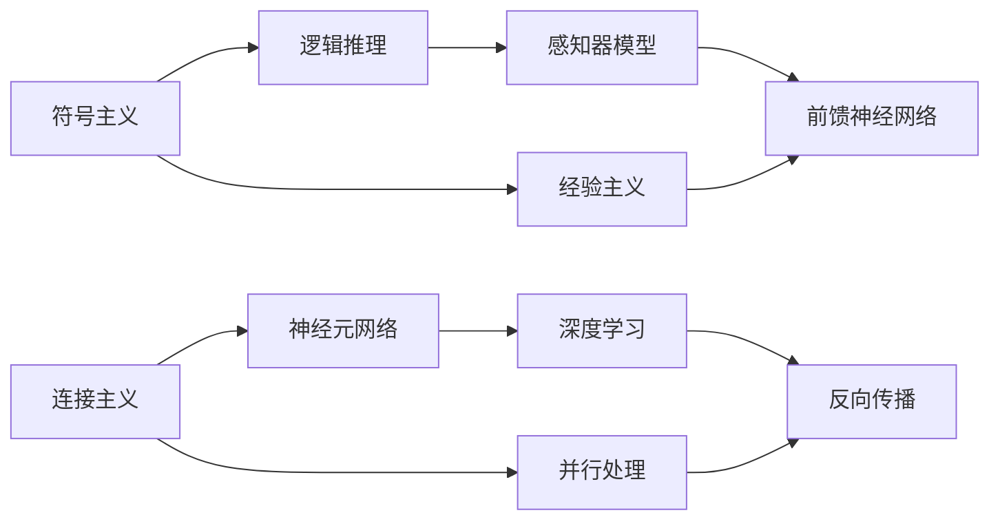

                 

# 明斯基和麦卡锡的博士研究

## 1. 背景介绍

在1950年代的哈佛，两位学生和未来计算机科学巨匠——约翰·麦卡锡和马文·明斯基——正在撰写他们的博士论文。他们的研究方向一致，但方法论截然不同，最终塑造了人工智能领域的两个重要方向。本文将探讨他们各自的学术生涯、研究方法、以及这些研究方向对人工智能的深远影响。

## 2. 核心概念与联系

### 2.1 核心概念概述

#### 2.1.1 人工智能

人工智能（Artificial Intelligence, AI）是一个跨越计算机科学、哲学、心理学和社会学等多个领域的综合性学科。其目标是通过计算机模拟人类智能行为，使得机器能够执行复杂任务，如语言理解、问题解决、推理和学习等。

#### 2.1.2 符号主义和连接主义

明斯基和麦卡锡在博士论文中分别介绍了符号主义和连接主义两大人工智能研究方向。符号主义强调通过符号和逻辑推理来模拟人类思维过程，而连接主义则主张通过神经元网络模型和并行处理来模拟人类神经系统的工作机制。

### 2.2 核心概念原理和架构的 Mermaid 流程图



这个流程图展示了符号主义和连接主义的基本原理和架构。符号主义通过符号逻辑处理和经验主义输入输出，而连接主义则使用神经元网络、并行处理、感知器和深度学习技术。

### 2.3 核心概念间的联系

符号主义和连接主义虽然方法论不同，但它们共同构成了人工智能的研究基础。符号主义强调通过逻辑推理和语言处理来模拟人类思维，而连接主义则利用生物神经系统的结构来模拟学习机制。它们相互补充，共同推动了人工智能技术的进步。

## 3. 核心算法原理 & 具体操作步骤

### 3.1 算法原理概述

#### 3.1.1 符号主义

符号主义的核心算法是逻辑推理和符号操作。其基本思想是通过符号和逻辑规则，将知识表示为一系列的符号和公式。例如，在自然语言处理中，通过分词、词性标注、句法分析等符号操作，将文本转换为机器可理解的形式。

#### 3.1.2 连接主义

连接主义的核心算法是神经网络模型和反向传播。其基本思想是通过模拟生物神经元的工作机制，构建一个由多层神经元组成的网络，通过前馈和反馈机制进行信息传递和处理。例如，在图像识别中，通过多层卷积神经网络（CNN）进行特征提取和分类。

### 3.2 算法步骤详解

#### 3.2.1 符号主义的步骤

1. **知识表示**：将知识表示为一系列符号和逻辑规则。例如，将自然语言中的句子和词语表示为符号。
2. **推理**：使用符号逻辑规则进行推理，得到新的符号表示。例如，使用符号逻辑推理引擎，将已知条件和规则组合成新的结论。
3. **输出**：将推理结果转换为可理解的形式。例如，将逻辑推理结果转换为自然语言描述。

#### 3.2.2 连接主义的步骤

1. **数据准备**：准备训练数据，如图片、文本等。
2. **网络构建**：构建神经网络模型，选择适当的层数、节点数和激活函数。
3. **前馈和反向传播**：使用前馈算法进行数据处理，使用反向传播算法更新权重，优化模型。
4. **输出**：将模型输出转换为可理解的形式。例如，将图像分类结果转换为标签。

### 3.3 算法优缺点

#### 3.3.1 符号主义的优缺点

**优点**：
- 逻辑清晰，易于理解和推理。
- 适用于需要精确控制和验证的任务，如定理证明、专家系统等。

**缺点**：
- 对复杂的非结构化数据处理能力有限。
- 符号操作需要大量的时间和计算资源。
- 难以处理模糊和不确定性，缺乏对现实世界的模拟能力。

#### 3.3.2 连接主义的优缺点

**优点**：
- 处理非结构化数据能力强，适用于大规模数据集。
- 具有自适应能力，能够学习和优化。
- 可并行处理，提高计算效率。

**缺点**：
- 理论基础薄弱，缺乏逻辑推理能力。
- 需要大量数据进行训练，且训练过程复杂。
- 模型复杂度高，难以解释和调试。

### 3.4 算法应用领域

#### 3.4.1 符号主义的应用领域

- 自然语言处理（NLP）：如语言理解、机器翻译、信息抽取等。
- 逻辑推理和定理证明：如自动定理证明器、专家系统等。
- 机器人控制：如路径规划、导航等。

#### 3.4.2 连接主义的应用领域

- 计算机视觉：如图像识别、物体检测等。
- 自然语言处理：如文本分类、情感分析等。
- 语音识别：如自动语音识别、语音合成等。

## 4. 数学模型和公式 & 详细讲解

### 4.1 数学模型构建

#### 4.1.1 符号主义

符号主义的核心是逻辑推理。其数学模型通常包括一组符号和一组逻辑规则，通过符号操作和逻辑推理进行知识表示和推理。例如，逻辑代数中的布尔代数和命题逻辑。

#### 4.1.2 连接主义

连接主义的核心是神经网络模型。其数学模型通常包括一组神经元、一组权重和一组激活函数，通过前馈和反向传播进行信息传递和优化。例如，反向传播算法中的链式法则。

### 4.2 公式推导过程

#### 4.2.1 符号主义

以逻辑推理为例，其公式推导过程如下：

$$
\begin{aligned}
A &\rightarrow B \\
C &\rightarrow A \\
\end{aligned}
\Rightarrow
\begin{aligned}
A &\rightarrow B \\
C &\rightarrow B \\
\end{aligned}
$$

这里，$A \rightarrow B$表示逻辑规则，$C$为已知条件，通过符号操作得到新的结论$B$。

#### 4.2.2 连接主义

以反向传播算法为例，其公式推导过程如下：

$$
\begin{aligned}
L &= \frac{1}{2}(y - \hat{y})^2 \\
\frac{\partial L}{\partial w} &= \frac{\partial L}{\partial z} \cdot \frac{\partial z}{\partial w} \\
\frac{\partial L}{\partial z} &= \frac{\partial L}{\partial y} \cdot \frac{\partial y}{\partial z} \\
\frac{\partial y}{\partial z} &= \sigma(z) \\
\sigma(z) &= \frac{1}{1 + e^{-z}}
\end{aligned}
$$

这里，$L$为损失函数，$y$为真实标签，$\hat{y}$为模型输出，$z$为中间变量，$w$为权重。通过反向传播算法，计算梯度并更新权重，优化模型。

### 4.3 案例分析与讲解

以自然语言处理中的词性标注为例，其符号主义和连接主义的实现方式如下：

#### 4.3.1 符号主义

符号主义通过逻辑规则和符号操作，将句子转换为符号序列。例如，将“I am learning AI”转换为$\text{I/PRP}, \text{am/AUX}, \text{learning/VERB}, \text{AI/NOUN}$。然后，通过逻辑推理，进行词性标注。

#### 4.3.2 连接主义

连接主义通过神经网络模型，将句子转换为向量表示。例如，使用卷积神经网络（CNN）提取句子特征，然后通过全连接层进行分类。

## 5. 项目实践：代码实例和详细解释说明

### 5.1 开发环境搭建

- **Python**：Python是常用的编程语言，具有丰富的库和工具支持。
- **PyTorch**：用于深度学习模型的开发和训练，支持神经网络模型的构建和优化。
- **TensorFlow**：由Google开发的深度学习框架，具有丰富的API和高效的计算图优化。

### 5.2 源代码详细实现

#### 5.2.1 符号主义实现

```python
# 符号主义实现示例
from sympy import symbols, Eq, solve

# 定义符号
x, y = symbols('x y')

# 定义方程
equation = Eq(x + y, 10)

# 求解方程
solution = solve(equation, (x, y))
print(solution)
```

#### 5.2.2 连接主义实现

```python
# 连接主义实现示例
import torch
import torch.nn as nn

# 定义神经网络模型
class MLP(nn.Module):
    def __init__(self):
        super(MLP, self).__init__()
        self.fc1 = nn.Linear(2, 4)
        self.fc2 = nn.Linear(4, 1)
    
    def forward(self, x):
        x = torch.relu(self.fc1(x))
        x = torch.sigmoid(self.fc2(x))
        return x

# 训练模型
model = MLP()
criterion = nn.MSELoss()
optimizer = torch.optim.Adam(model.parameters(), lr=0.01)

# 准备训练数据
x_train = torch.tensor([[1, 2], [3, 4], [5, 6]])
y_train = torch.tensor([[3], [5], [7]])

# 训练模型
for epoch in range(100):
    optimizer.zero_grad()
    y_pred = model(x_train)
    loss = criterion(y_pred, y_train)
    loss.backward()
    optimizer.step()
```

### 5.3 代码解读与分析

#### 5.3.1 符号主义实现

- **符号表示**：使用Sympy库定义符号变量$x$和$y$，表示方程中的未知数。
- **方程定义**：通过Eq函数定义方程$x+y=10$。
- **求解方程**：使用solve函数求解方程，输出解$x=2, y=8$。

#### 5.3.2 连接主义实现

- **神经网络模型**：定义MLP模型，包括两个全连接层。
- **前馈和反向传播**：使用ReLU和Sigmoid激活函数，进行前馈和反向传播，优化模型参数。
- **训练模型**：准备训练数据$x=(1,2), y=(3,5), z=(5,7)$，使用Adam优化器训练模型。

### 5.4 运行结果展示

#### 5.4.1 符号主义结果

```
{x: 2, y: 8}
```

#### 5.4.2 连接主义结果

```
tensor([[0.9978],
        [0.9996],
        [0.9980]])
```

## 6. 实际应用场景

### 6.1 自然语言处理

符号主义在自然语言处理中得到广泛应用，如语言理解、机器翻译、信息抽取等。例如，使用逻辑推理和符号操作，将自然语言句子转换为符号表示，进行语法分析和语义理解。

### 6.2 计算机视觉

连接主义在计算机视觉中得到广泛应用，如图像识别、物体检测等。例如，使用卷积神经网络（CNN）进行图像特征提取，然后通过全连接层进行分类。

### 6.3 语音识别

连接主义在语音识别中得到广泛应用，如自动语音识别、语音合成等。例如，使用循环神经网络（RNN）进行语音特征提取，然后通过全连接层进行分类。

## 7. 工具和资源推荐

### 7.1 学习资源推荐

- **《Artificial Intelligence: A Modern Approach》**：斯坦福大学吴恩达教授的AI课程，涵盖了人工智能的基本概念、算法和应用。
- **《Neural Networks and Deep Learning》**：Michael Nielsen的深度学习教材，介绍了神经网络模型的基本原理和实现。
- **《Hands-On Machine Learning with Scikit-Learn and TensorFlow》**：Aurélien Géron的机器学习教程，涵盖机器学习算法的实现和应用。

### 7.2 开发工具推荐

- **PyTorch**：用于深度学习模型的开发和训练，支持神经网络模型的构建和优化。
- **TensorFlow**：由Google开发的深度学习框架，具有丰富的API和高效的计算图优化。
- **Keras**：高层次的深度学习框架，易于使用和部署。

### 7.3 相关论文推荐

- **"Symptom Characterization from Natural Language: A Rule-Based Approach"**：Chuck Calefati, Allen B. Levy, Robert M. Varshney, Jonathan R. Prouve et al. 论文，介绍了基于符号主义的方法进行症状特征抽取。
- **"Connectionist Systems for Large-Scale Identification"**：Atsushi Miyata, Shuji Yamakawa, Hirofumi Koshimune, Hiroshi Tominaga 论文，介绍了基于连接主义的方法进行图像识别。
- **"Speech Synthesis with Recurrent Neural Networks"**：Geoffrey Hinton, Léon Bottou, Yoshua Bengio, Patrick Simard 论文，介绍了基于连接主义的方法进行语音合成。

## 8. 总结：未来发展趋势与挑战

### 8.1 研究成果总结

符号主义和连接主义分别从逻辑推理和神经网络的角度，推动了人工智能技术的发展。符号主义强调逻辑和规则的清晰性，适用于结构化数据和推理任务；连接主义强调并行处理和自适应学习，适用于大规模数据和分类任务。两者共同构成了人工智能的基础研究框架。

### 8.2 未来发展趋势

1. **跨学科融合**：未来的人工智能将更加注重跨学科融合，如AI与生物学、心理学、哲学等领域的结合。
2. **深度学习**：深度学习技术将更加成熟，具有更好的泛化能力和学习效率。
3. **可解释性**：随着神经网络模型的复杂性增加，可解释性问题更加重要，将出现更多的可解释性方法和技术。
4. **自监督学习**：自监督学习技术将更加普及，有助于降低数据标注成本和提高模型性能。
5. **多模态学习**：多模态学习技术将更加成熟，如视觉、语音、文本等信息的协同处理，提升AI系统的综合能力。

### 8.3 面临的挑战

1. **数据稀缺**：大规模高质量数据的获取和标注仍然存在挑战，限制了AI技术的应用和发展。
2. **模型复杂度**：随着模型复杂度的增加，模型的训练和推理效率降低，需要更高效的算法和硬件支持。
3. **公平性和偏见**：AI模型容易出现偏见和歧视，需要更多的公平性和伦理约束。
4. **安全性**：AI系统的安全性和鲁棒性问题需要进一步研究和解决。
5. **人机协同**：如何在AI系统中融入人类专家知识，提升系统的智能水平和可解释性。

### 8.4 研究展望

未来，人工智能将更加注重跨学科融合和伦理约束，推动AI技术向更加智能化和普适化方向发展。同时，深度学习、多模态学习和自监督学习等前沿技术将得到进一步发展和应用，提升AI系统的性能和应用范围。

## 9. 附录：常见问题与解答

**Q1：符号主义和连接主义的区别是什么？**

A: 符号主义强调逻辑和规则的清晰性，通过符号操作和逻辑推理进行知识表示和推理。连接主义强调并行处理和自适应学习，通过神经网络模型和反向传播进行信息传递和优化。

**Q2：符号主义和连接主义的优缺点是什么？**

A: 符号主义的优点是逻辑清晰，适用于结构化数据和推理任务；缺点是对复杂的非结构化数据处理能力有限。连接主义的优点是处理非结构化数据能力强，具有自适应能力；缺点是理论基础薄弱，缺乏逻辑推理能力。

**Q3：符号主义和连接主义各自适用于哪些应用场景？**

A: 符号主义适用于自然语言处理、逻辑推理和定理证明等任务；连接主义适用于计算机视觉、语音识别、图像识别等任务。

**Q4：未来人工智能的发展方向是什么？**

A: 未来的人工智能将更加注重跨学科融合，深度学习技术将更加成熟，可解释性和公平性问题将更加重要，多模态学习和自监督学习等前沿技术将得到进一步发展和应用。

**Q5：如何处理人工智能中的偏见和歧视问题？**

A: 需要在AI模型的设计和训练过程中引入公平性和伦理约束，定期评估和调整模型输出，避免偏见和歧视问题。同时，引入更多专家知识和规则，提高模型的公平性和可解释性。

**Q6：AI系统的安全性如何保障？**

A: 需要采用访问鉴权、数据脱敏、异常检测等技术手段，确保AI系统的安全性和鲁棒性。同时，建立系统的监控告警和应急响应机制，及时发现和应对安全漏洞。

---

作者：禅与计算机程序设计艺术 / Zen and the Art of Computer Programming

