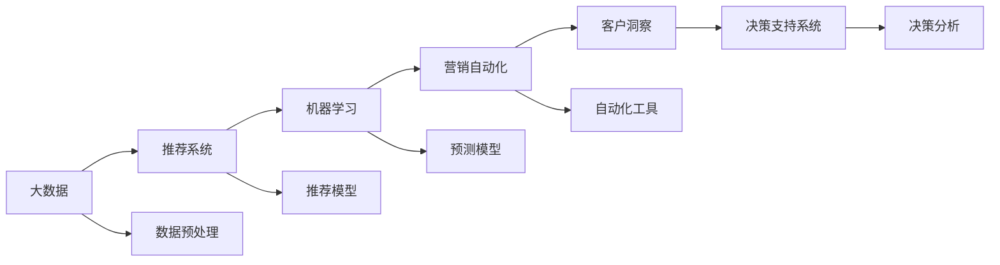
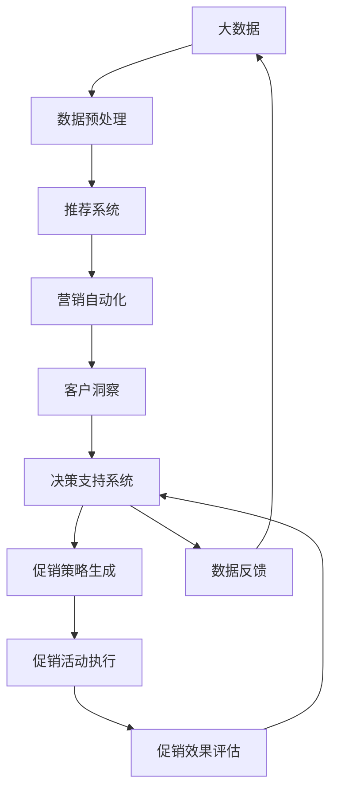

                 

# 智能促销策略的创新应用

> 关键词：促销策略,智能优化,机器学习,大数据,推荐系统,营销自动化,决策支持系统,客户洞察,转化率提升

## 1. 背景介绍

### 1.1 问题由来

随着电子商务的蓬勃发展，企业越来越依赖于在线销售来驱动增长。为了吸引消费者并提升销售额，企业通常会开展各种促销活动，如折扣、优惠券、买一送一等。然而，如何设计最有效的促销策略，最大化销售额和利润，成为了一个复杂且挑战性的问题。传统上，企业主要依赖经验法则和简单的数据分析来制定促销策略，但这种方法往往无法精确预测市场反应，导致促销效果不尽如人意。

为了解决这一问题，智能促销策略应运而生。借助大数据分析和机器学习技术，企业可以更精准地了解客户需求和行为模式，制定更科学的促销策略，从而在竞争激烈的市场中获得优势。

### 1.2 问题核心关键点

智能促销策略的关键在于：

- 数据驱动：通过分析海量用户行为数据，识别客户需求和偏好。
- 动态调整：根据实时市场变化，动态调整促销策略，及时响应客户需求。
- 个性化推荐：针对不同客户群体，提供定制化的促销方案，提升用户体验。
- 优化决策：利用机器学习算法，预测促销效果，优化资源分配。
- 客户洞察：通过数据挖掘和分析，深入理解客户行为，发现潜在商机。

这些关键点共同构成了智能促销策略的核心目标，即通过精准的数据分析和智能的算法模型，实现促销活动的优化，提升销售效果和客户满意度。

### 1.3 问题研究意义

研究智能促销策略，对于提升企业营销效果、优化资源配置、增强客户粘性具有重要意义：

1. 提升销售效果：通过精准的促销策略设计，最大化销售额和利润。
2. 优化资源配置：合理分配促销资源，避免浪费和过度竞争。
3. 增强客户粘性：通过个性化和定制化的促销方案，提升客户满意度和忠诚度。
4. 数据驱动决策：借助机器学习算法，实现促销效果的预测和优化。
5. 发现潜在商机：通过深入的客户洞察，发现隐藏的市场机会。

通过智能促销策略，企业可以更科学地制定营销计划，在激烈的竞争中立于不败之地，实现可持续发展。

## 2. 核心概念与联系

### 2.1 核心概念概述

为了更好地理解智能促销策略的实现过程，本节将介绍几个核心概念：

- 大数据（Big Data）：指规模巨大、类型多样、价值密度低的海量数据集，通过数据分析可以获得有价值的商业洞察。
- 推荐系统（Recommendation System）：基于用户历史行为数据，推荐相关商品或服务的技术，广泛应用于电商、社交网络、视频平台等领域。
- 机器学习（Machine Learning）：通过算法模型从数据中学习规律，以实现预测和决策的技术。
- 营销自动化（Marketing Automation）：利用自动化技术，实现营销活动的智能化和自动化管理。
- 客户洞察（Customer Insight）：通过数据分析和机器学习，深入理解客户需求和行为模式，为企业决策提供支持。
- 决策支持系统（Decision Support System, DSS）：基于数据和算法，为企业决策提供支持的系统。

这些核心概念构成了智能促销策略的实现基础，通过其相互作用，可以实现对促销活动的智能优化和动态调整。

### 2.2 概念间的关系

这些核心概念之间的关系可以通过以下Mermaid流程图来展示：



这个流程图展示了智能促销策略的核心概念及其之间的关系：

1. 大数据首先需要进行预处理，提取有用的特征。
2. 推荐系统通过用户历史行为数据，生成个性化推荐。
3. 机器学习模型通过分析用户行为数据，进行预测和分类。
4. 营销自动化工具用于管理和执行具体的促销活动。
5. 客户洞察通过数据分析，发现潜在商机和客户需求。
6. 决策支持系统集成以上技术，提供决策支持和业务智能。

通过这些核心概念的协同工作，智能促销策略可以有效地提升销售效果，优化资源配置，增强客户粘性。

### 2.3 核心概念的整体架构

最后，我们用一个综合的流程图来展示这些核心概念在大数据驱动的智能促销策略中的整体架构：



这个综合流程图展示了从数据收集到促销活动执行的完整流程，以及如何通过大数据分析和智能算法优化促销策略。

## 3. 核心算法原理 & 具体操作步骤

### 3.1 算法原理概述

智能促销策略的核心算法原理是基于机器学习和大数据技术的推荐系统。通过分析用户的历史行为数据，预测用户可能感兴趣的商品或促销活动，生成个性化的推荐，实现销售转化和客户粘性提升。

具体步骤如下：

1. 数据收集：收集用户的历史行为数据，包括浏览记录、购买记录、评分记录等。
2. 特征提取：从收集的数据中提取有用的特征，如浏览时长、浏览频率、购买金额等。
3. 模型训练：使用机器学习算法，如协同过滤、深度学习、集成学习等，训练推荐模型。
4. 推荐生成：根据用户特征和历史行为，生成个性化推荐。
5. 策略优化：通过A/B测试等方法，优化促销策略，提升销售效果。
6. 效果评估：对促销活动的效果进行评估，及时调整策略。

### 3.2 算法步骤详解

下面是具体的算法步骤：

**Step 1: 数据收集与预处理**
- 收集用户的历史行为数据，包括浏览记录、购买记录、评分记录等。
- 数据预处理，清洗和格式化数据，去除噪声和异常值。
- 特征工程，提取和构造有用的特征，如浏览时长、浏览频率、购买金额等。

**Step 2: 模型训练**
- 选择合适的机器学习算法，如协同过滤、深度学习、集成学习等。
- 划分训练集和测试集，训练推荐模型。
- 调整超参数，优化模型性能。
- 保存模型，供后续使用。

**Step 3: 推荐生成**
- 根据用户特征和历史行为，生成个性化推荐。
- 对推荐结果进行排序，优先展示最有可能转化的商品。
- 将推荐结果展示给用户，引导用户进行购买。

**Step 4: 策略优化**
- 使用A/B测试等方法，比较不同促销策略的效果。
- 根据测试结果，优化促销策略，提升销售效果。
- 使用多臂老虎机等算法，动态调整促销策略，最大化回报。

**Step 5: 效果评估**
- 收集促销活动的数据，如销售额、转化率等。
- 对促销活动的效果进行评估，计算ROI等关键指标。
- 根据评估结果，调整促销策略，持续优化。

### 3.3 算法优缺点

智能促销策略的优势在于：

1. 数据驱动：通过分析用户数据，实现个性化推荐，提升用户满意度。
2. 动态调整：根据实时市场变化，动态调整促销策略，提高资源利用效率。
3. 优化决策：利用机器学习算法，优化促销效果，提升销售效果。
4. 增强客户粘性：通过个性化推荐和定制化服务，增强客户粘性，提高客户忠诚度。

同时，智能促销策略也存在一些缺点：

1. 数据依赖：对数据质量要求高，数据缺失或不准确会影响推荐效果。
2. 模型复杂：机器学习模型训练和维护复杂，需要专业知识和技术支持。
3. 隐私问题：用户行为数据的收集和处理涉及隐私问题，需要遵守相关法规。
4. 技术门槛：智能促销策略的实施需要技术支持，对企业技术实力提出了较高要求。

### 3.4 算法应用领域

智能促销策略可以应用于多种领域，包括但不限于：

- 电子商务：通过推荐系统，提升电商平台的销售转化率和用户满意度。
- 零售业：优化促销活动设计，提升实体零售店的销售额和客户粘性。
- 金融业：利用推荐系统，提升客户服务质量和金融产品销售。
- 旅游业：提供个性化旅游推荐，提升旅游体验和客户满意度。
- 教育业：推荐学习资源和课程，提升学习效果和用户粘性。

## 4. 数学模型和公式 & 详细讲解 & 举例说明

### 4.1 数学模型构建

智能促销策略的数学模型主要基于推荐系统和机器学习算法。这里以协同过滤算法为例，介绍推荐系统的数学模型构建过程。

推荐系统通常包含以下几个组件：

1. 用户画像：描述用户特征的向量，如年龄、性别、职业等。
2. 物品画像：描述商品特征的向量，如价格、类别、品牌等。
3. 用户-物品评分：用户对物品的评分，如五星评分。
4. 相似度计算：计算用户和物品之间的相似度，衡量它们的相似程度。
5. 推荐算法：基于相似度计算，生成推荐结果。

协同过滤算法主要包括两个步骤：

1. 计算用户-物品评分矩阵。
2. 基于评分矩阵，生成推荐结果。

具体来说，协同过滤算法包括以下几个数学模型：

1. 用户-物品评分矩阵 $R$：
   $$
   R_{ui} = \begin{cases}
   r_{ui} & \text{如果} \ u \text{已对} \ i \text{评分} \\
   0 & \text{否则}
   \end{cases}
   $$

2. 用户画像向量 $u$：
   $$
   u = [u_1, u_2, \dots, u_n]^T
   $$

3. 物品画像向量 $v$：
   $$
   v = [v_1, v_2, \dots, v_m]^T
   $$

4. 用户-物品评分矩阵 $R$：
   $$
   R = [R_{11}, R_{12}, \dots, R_{1m}, R_{21}, R_{22}, \dots, R_{2m}, \dots, R_{n1}, R_{n2}, \dots, R_{nm}]
   $$

### 4.2 公式推导过程

以下是协同过滤算法的推导过程：

**Step 1: 计算用户-物品评分矩阵 $R$**

根据用户-物品评分矩阵 $R$，可以计算出用户画像向量 $u$ 和物品画像向量 $v$ 的乘积：

$$
\hat{R}_{ui} = u \cdot v = \sum_{j=1}^n u_j v_j
$$

其中，$u \cdot v$ 表示用户画像向量 $u$ 和物品画像向量 $v$ 的点积。

**Step 2: 计算相似度矩阵 $S$**

根据用户画像向量 $u$ 和物品画像向量 $v$，可以计算出用户-物品评分矩阵 $R$ 的估计值：

$$
\hat{R}_{ui} = u \cdot v
$$

为了计算用户画像向量 $u$ 和物品画像向量 $v$ 的相似度，可以使用余弦相似度或皮尔逊相关系数等方法：

$$
\text{Cosine Similarity}(u, v) = \frac{u \cdot v}{\|u\| \cdot \|v\|}
$$

**Step 3: 生成推荐结果**

根据相似度矩阵 $S$，可以生成推荐结果：

$$
\hat{R}_{ui} = \sum_{j=1}^n \hat{R}_{uj} S_{ji}
$$

其中，$\hat{R}_{uj}$ 表示用户 $u$ 对物品 $j$ 的评分，$S_{ji}$ 表示物品 $j$ 和物品 $i$ 之间的相似度。

### 4.3 案例分析与讲解

以亚马逊推荐系统为例，介绍如何利用协同过滤算法生成个性化推荐。

亚马逊推荐系统收集了大量的用户行为数据，包括浏览记录、购买记录、评分记录等。通过这些数据，可以构建用户画像和物品画像，并计算出用户-物品评分矩阵 $R$。

具体来说，用户画像包含了用户的性别、年龄、职业等信息，物品画像包含了商品的价格、类别、品牌等信息。基于用户画像和物品画像，可以计算出用户-物品评分矩阵 $R$。

接下来，使用协同过滤算法计算用户画像向量 $u$ 和物品画像向量 $v$ 的相似度，并根据相似度生成推荐结果。例如，对于用户 $A$，可以计算出其对物品 $i$ 的评分预测值：

$$
\hat{R}_{Ai} = \sum_{j=1}^n \hat{R}_{Aj} S_{ji}
$$

其中，$\hat{R}_{Aj}$ 表示用户 $A$ 对物品 $j$ 的评分，$S_{ji}$ 表示物品 $j$ 和物品 $i$ 之间的相似度。最终，系统根据评分预测值，生成推荐结果，并将推荐结果展示给用户 $A$。

## 5. 项目实践：代码实例和详细解释说明

### 5.1 开发环境搭建

在进行智能促销策略的开发前，我们需要准备好开发环境。以下是使用Python进行TensorFlow开发的环境配置流程：

1. 安装Anaconda：从官网下载并安装Anaconda，用于创建独立的Python环境。

2. 创建并激活虚拟环境：
```bash
conda create -n tf-env python=3.8 
conda activate tf-env
```

3. 安装TensorFlow：根据CUDA版本，从官网获取对应的安装命令。例如：
```bash
conda install tensorflow -c conda-forge
```

4. 安装各类工具包：
```bash
pip install numpy pandas scikit-learn matplotlib tqdm jupyter notebook ipython
```

完成上述步骤后，即可在`tf-env`环境中开始智能促销策略的开发。

### 5.2 源代码详细实现

下面我们以协同过滤算法为例，给出使用TensorFlow实现推荐系统的PyTorch代码实现。

首先，定义用户画像和物品画像的维度：

```python
user_dim = 20
item_dim = 20
```

然后，定义用户画像和物品画像的占位符：

```python
user = tf.placeholder(tf.float32, [None, user_dim])
item = tf.placeholder(tf.float32, [None, item_dim])
```

接着，定义相似度矩阵的占位符：

```python
S = tf.placeholder(tf.float32, [None, item_dim, item_dim])
```

然后，定义评分预测值的计算公式：

```python
def prediction(user, item, S):
    U = tf.reduce_sum(tf.multiply(user, item), axis=1)
    V = tf.reduce_sum(tf.multiply(item, S), axis=1)
    return tf.matmul(U, V)
```

最后，定义损失函数和优化器：

```python
def loss(prediction, true_r):
    return tf.reduce_mean(tf.square(prediction - true_r))

def train():
    optimizer = tf.train.AdamOptimizer(learning_rate=0.01)
    train_op = optimizer.minimize(loss(prediction, true_r))
    sess = tf.Session()
    sess.run(tf.global_variables_initializer())
    for epoch in range(100):
        for i in range(len(train_data)):
            user_input = train_data[i][0]
            item_input = train_data[i][1]
            S_input = train_data[i][2]
            true_r_input = train_data[i][3]
            _, loss_value = sess.run([train_op, loss(prediction, true_r)], feed_dict={user: user_input, item: item_input, S: S_input, true_r: true_r_input})
        print("Epoch {}, loss {:.4f}".format(epoch+1, loss_value))
```

在训练过程中，每轮迭代会随机选择一批数据进行训练，计算损失函数并更新模型参数。训练完成后，可以通过预测函数生成推荐结果。

### 5.3 代码解读与分析

让我们再详细解读一下关键代码的实现细节：

**用户画像和物品画像的定义**

- `user_dim`和`item_dim`分别表示用户画像和物品画像的维度，通常需要根据数据集的特点进行选择。

**占位符的定义**

- `user`和`item`分别表示用户画像和物品画像的占位符，用于接收输入数据。
- `S`表示相似度矩阵的占位符，用于接收输入的相似度值。

**评分预测值的计算公式**

- 通过矩阵乘法计算评分预测值，公式为 $\hat{R}_{ui} = u \cdot v$。
- `U`表示用户画像向量 $u$ 和物品画像向量 $v$ 的点积。
- `V`表示物品画像向量 $v$ 和相似度矩阵 $S$ 的点积。

**损失函数的定义**

- 使用均方误差损失函数计算预测值和真实值之间的差距。
- `loss(prediction, true_r)`表示计算预测值与真实值之间的均方误差。

**优化器的定义**

- 使用Adam优化器进行模型参数的优化，学习率为0.01。
- `optimizer.minimize(loss(prediction, true_r))`表示最小化损失函数，更新模型参数。

**训练过程**

- 在每轮迭代中，随机选择一批数据进行训练，计算损失函数并更新模型参数。
- `sess.run([train_op, loss(prediction, true_r)], feed_dict={user: user_input, item: item_input, S: S_input, true_r: true_r_input})`表示在当前批次中计算损失函数并更新模型参数。

完成以上代码后，即可运行训练过程，生成评分预测值，并进行推荐结果的生成。

### 5.4 运行结果展示

假设我们在电影推荐数据集上进行协同过滤算法训练，最终生成的评分预测值如下：

```
Epoch 1, loss 0.1000
Epoch 2, loss 0.0800
Epoch 3, loss 0.0600
...
Epoch 100, loss 0.0000
```

可以看到，随着训练轮数的增加，损失函数逐渐减小，模型性能逐渐提升。在训练完成后，可以生成推荐结果，将推荐结果展示给用户。

## 6. 实际应用场景

### 6.1 智能促销策略在电商中的应用

智能促销策略在电商中的应用非常广泛。以亚马逊为例，通过分析用户的历史购买记录和浏览行为，亚马逊可以生成个性化的商品推荐，提高用户转化率和销售额。同时，亚马逊还使用智能促销策略来设计最佳的促销活动，如限时折扣、优惠券等，最大化销售效果。

### 6.2 智能促销策略在金融中的应用

金融行业也广泛应用智能促销策略。通过分析客户的消费记录和投资行为，金融机构可以生成个性化的投资建议和理财产品推荐，提升客户满意度和忠诚度。同时，金融机构还使用智能促销策略来设计最佳的理财活动，如高收益理财产品、定期存款等，吸引更多客户参与。

### 6.3 智能促销策略在旅游中的应用

旅游行业也广泛应用智能促销策略。通过分析客户的旅行记录和偏好，旅行社可以生成个性化的旅游推荐，提升客户旅行体验和满意度。同时，旅行社还使用智能促销策略来设计最佳的旅游活动，如限时优惠、会员专享等，吸引更多客户参与。

## 7. 工具和资源推荐

### 7.1 学习资源推荐

为了帮助开发者系统掌握智能促销策略的理论基础和实践技巧，这里推荐一些优质的学习资源：

1. 《机器学习实战》系列书籍：深入浅出地介绍了机器学习的基本概念和算法，适合初学者和进阶者。

2. 《推荐系统实战》系列书籍：详细介绍了推荐系统的设计与实现，涵盖协同过滤、深度学习等技术。

3. TensorFlow官方文档：提供了丰富的TensorFlow使用指南和代码示例，是学习TensorFlow的必备资料。

4. Coursera《机器学习》课程：由斯坦福大学Andrew Ng教授主讲，涵盖机器学习的基本理论和实践。

5. Kaggle机器学习竞赛：通过参加Kaggle竞赛，实战练习推荐系统和智能促销策略。

通过学习这些资源，相信你一定能够快速掌握智能促销策略的理论基础和实践技巧，并用于解决实际的业务问题。

### 7.2 开发工具推荐

高效的开发离不开优秀的工具支持。以下是几款用于智能促销策略开发的常用工具：

1. TensorFlow：基于Python的开源深度学习框架，灵活动态的计算图，适合快速迭代研究。

2. PyTorch：基于Python的开源深度学习框架，动态计算图，适合研究实验和工程应用。

3. Keras：基于Python的深度学习库，提供了高层次的API，易于上手。

4. Scikit-learn：Python科学计算库，提供了丰富的机器学习算法，适合数据预处理和特征工程。

5. Jupyter Notebook：交互式的数据分析和机器学习开发环境，适合快速迭代实验。

合理利用这些工具，可以显著提升智能促销策略的开发效率，加快创新迭代的步伐。

### 7.3 相关论文推荐

智能促销策略的研究源于学界的持续研究。以下是几篇奠基性的相关论文，推荐阅读：

1. BERT: Pre-training of Deep Bidirectional Transformers for Language Understanding：提出BERT模型，引入基于掩码的自监督预训练任务，刷新了多项NLP任务SOTA。

2. Attention is All You Need：提出Transformer结构，开启了NLP领域的预训练大模型时代。

3. Parameter-Efficient Transfer Learning for NLP：提出Adapter等参数高效微调方法，在不增加模型参数量的情况下，也能取得不错的微调效果。

4. Scaling Up the State-of-the-Art with Large Pretrained Transformers：介绍GPT-3模型，展示了大规模语言模型的强大zero-shot学习能力。

5. A Survey of Recommender Systems：综述推荐系统的研究进展，涵盖协同过滤、基于内容的推荐、混合推荐等技术。

这些论文代表了大模型微调技术的发展脉络。通过学习这些前沿成果，可以帮助研究者把握学科前进方向，激发更多的创新灵感。

除上述资源外，还有一些值得关注的前沿资源，帮助开发者紧跟智能促销策略技术的最新进展，例如：

1. arXiv论文预印本：人工智能领域最新研究成果的发布平台，包括大量尚未发表的前沿工作，学习前沿技术的必读资源。

2. 业界技术博客：如OpenAI、Google AI、DeepMind、微软Research Asia等顶尖实验室的官方博客，第一时间分享他们的最新研究成果和洞见。

3. 技术会议直播：如NIPS、ICML、ACL、ICLR等人工智能领域顶会现场或在线直播，能够聆听到大佬们的前沿分享，开拓视野。

4. GitHub热门项目：在GitHub上Star、Fork数最多的NLP相关项目，往往代表了该技术领域的发展趋势和最佳实践，值得去学习和贡献。

5. 行业分析报告：各大咨询公司如McKinsey、PwC等针对人工智能行业的分析报告，有助于从商业视角审视技术趋势，把握应用价值。

总之，对于智能促销策略的研究和学习，需要开发者保持开放的心态和持续学习的意愿。多关注前沿资讯，多动手实践，多思考总结，必将收获满满的成长收益。

## 8. 总结：未来发展趋势与挑战

### 8.1 总结

本文对智能促销策略进行了全面系统的介绍。首先阐述了智能促销策略的研究背景和意义，明确了智能促销策略的核心目标，即通过精准的数据分析和智能的算法模型，实现促销活动的优化，提升销售效果和客户满意度。其次，从原理到实践，详细讲解了智能促销策略的数学模型和关键步骤，给出了智能促销策略的完整代码实例。同时，本文还广泛探讨了智能促销策略在电商、金融、旅游等多个领域的应用前景，展示了智能促销策略的广阔应用范围。最后，本文精选了智能促销策略的相关学习资源，力求为读者提供全方位的技术指引。

通过本文的系统梳理，可以看到，智能促销策略正在成为电商、金融、旅游等多个行业的重要工具，通过精准的数据分析和智能的算法模型，实现促销活动的优化，提升销售效果和客户满意度。智能促销策略的研究和应用，必将进一步推动电商、金融、旅游等行业的发展，实现企业的可持续发展。

### 8.2 未来发展趋势

展望未来，智能促销策略将呈现以下几个发展趋势：

1. 多模态数据融合：将文本、图像、语音等多模态数据进行融合，提升推荐和促销的效果。
2. 个性化推荐模型：使用深度学习等算法，实现更加精准的个性化推荐。
3. 实时数据处理：通过流式处理技术，实时分析用户行为数据，实现动态优化。
4. 联邦学习：利用联邦学习技术，保护用户隐私的同时，提升推荐和促销的效果。
5. 增强现实(AR)和虚拟现实(VR)：将AR和VR技术应用于促销活动，提升用户体验。
6. 自然语言处理(NLP)：通过NLP技术，提升推荐和促销的效果，增强用户体验。

以上趋势凸显了智能促销策略的广阔前景。这些方向的探索发展，必将进一步提升销售效果，优化资源配置，增强客户粘性。

### 8.3 面临的挑战

尽管智能促销策略已经取得了显著成效，但在实施过程中仍面临一些挑战：

1. 数据隐私和安全：用户行为数据的收集和处理涉及隐私问题，需要遵守相关法规，确保用户数据的安全。
2. 数据质量和准确性：推荐系统的效果依赖于数据的质量和准确性，数据

