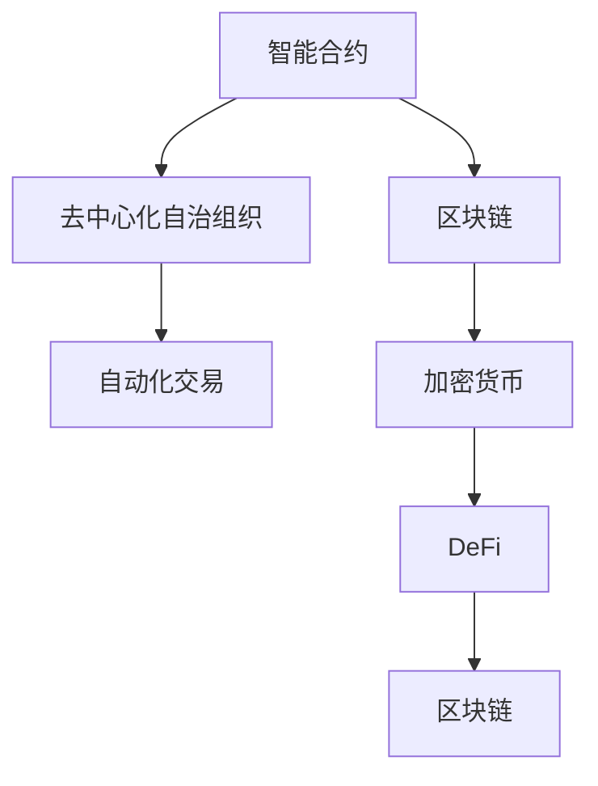
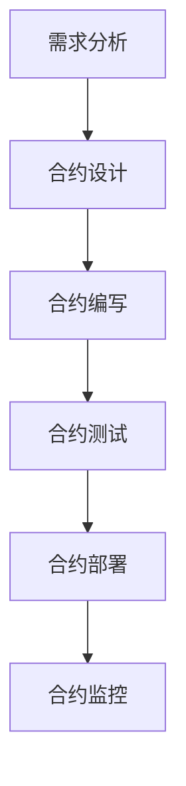
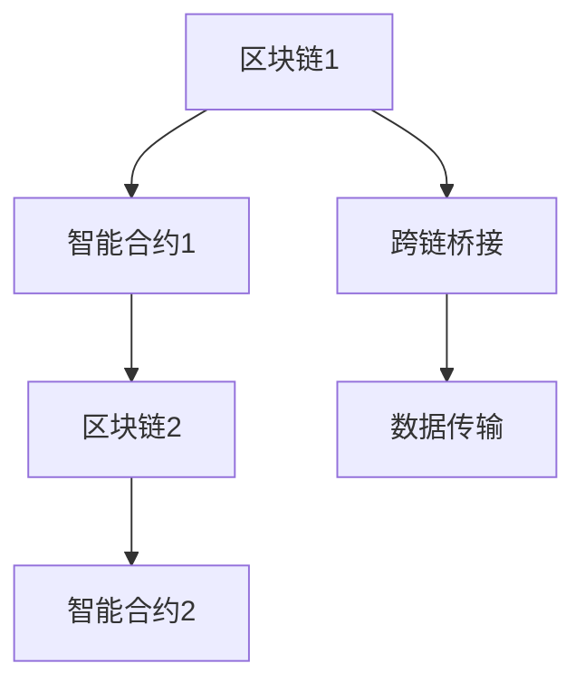
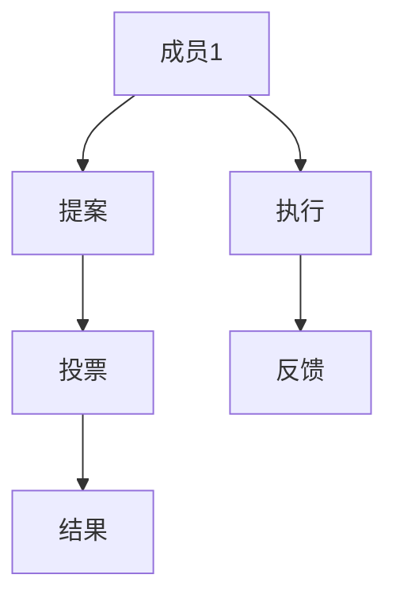
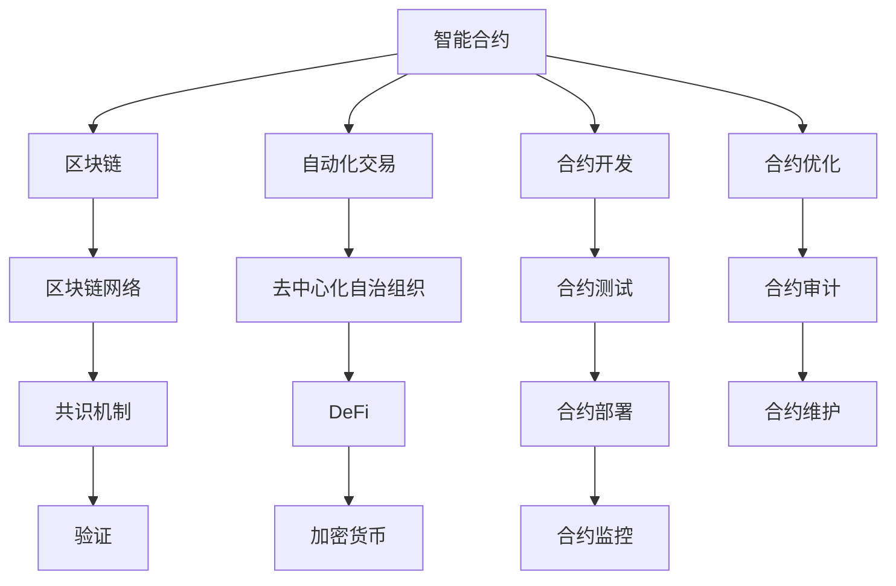

                 

# 智能合约创业：自动化交易的未来

> 关键词：智能合约,区块链,去中心化自治组织,自动化交易,加密货币,DeFi

## 1. 背景介绍

### 1.1 问题由来

随着区块链技术的不断成熟和普及，智能合约（Smart Contracts）作为一种自动化执行代码的部署方式，逐渐成为数字金融领域的重要应用场景。通过区块链技术的去中心化和不可篡改特性，智能合约能够在无需中介机构参与的情况下，自动执行各种交易合同，如借贷、抵押、保险等。

然而，智能合约的实际应用仍面临诸多挑战：

1. **高门槛**：传统的智能合约开发需要具备深厚的加密货币和区块链知识，同时需要较高的编程水平。
2. **安全性**：智能合约的漏洞常常成为黑客攻击的目标，导致巨额资产损失。
3. **易用性**：复杂的智能合约代码难以被非技术人员理解和应用，限制了其普及。
4. **互操作性**：不同区块链平台之间的智能合约代码互不兼容，限制了跨链操作。

智能合约创业，就是在这些背景下应运而生。通过提供智能合约开发、测试、部署及维护的全流程解决方案，旨在降低智能合约应用的门槛，提高其安全性，增强其易用性，从而促进区块链技术在金融、供应链、物联网等更多领域的广泛应用。

## 2. 核心概念与联系

### 2.1 核心概念概述

为更好地理解智能合约创业的核心概念和它们之间的关系，本节将介绍几个关键概念：

- **智能合约**：一种嵌入区块链中的可执行代码，能够在满足特定条件时自动执行相应操作，如转账、贷款、合同签订等。智能合约通过代码实现自动化交易，减少中介机构介入，降低交易成本，提高效率。

- **区块链**：一种去中心化的分布式账本技术，通过区块链技术，智能合约能够在无中介的情况下进行验证和执行。区块链的透明、不可篡改特性，确保了智能合约的安全性和可信度。

- **去中心化自治组织（DAO）**：一种通过智能合约管理资产和决策的组织形式，DAO通过编程逻辑自动执行组织决策，无需中介机构参与。DAO的权力结构去中心化，决策透明公正。

- **自动化交易**：通过智能合约自动执行的金融交易行为，如借贷、兑换、分红等。自动化交易大大简化了金融操作，提高了资金利用效率。

- **加密货币**：智能合约的底层交易单位，通常采用比特币、以太坊等区块链平台的代币。加密货币的安全性是智能合约安全的基础。

- **DeFi**：去中心化金融，通过智能合约实现传统金融服务的功能，如借贷、保险、结算等。DeFi旨在通过区块链技术，重新构建金融系统的底层架构，实现更高效的金融服务。

这些核心概念通过以下Mermaid流程图展示它们之间的关系：



这个流程图展示了智能合约与区块链、DeFi等概念的紧密联系：

1. 智能合约依托于区块链技术，通过不可篡改的分布式账本，实现自动化的交易执行。
2. 去中心化自治组织（DAO）通过智能合约实现决策和资产管理，是一种重要的智能合约应用。
3. 自动化交易是智能合约的核心应用场景，能够实现无中介的金融操作。
4. 加密货币作为智能合约的底层交易单位，保障了交易的安全性和不可篡改性。
5. DeFi通过智能合约实现传统金融服务，是智能合约的重要应用方向。

### 2.2 概念间的关系

这些核心概念之间存在着紧密的联系，构成了智能合约创业的基本生态系统。我们通过几个Mermaid流程图来展示这些概念之间的关系。

#### 2.2.1 智能合约的开发流程



这个流程图展示了智能合约开发的完整流程：

1. 首先进行需求分析，明确合约的目标和功能。
2. 基于需求分析设计合约逻辑，编写合约代码。
3. 对编写的合约进行测试，确保逻辑正确、无漏洞。
4. 将通过测试的合约部署到区块链网络中。
5. 对部署后的合约进行监控，确保其正常运行。

#### 2.2.2 智能合约的互操作性



这个流程图展示了智能合约在不同区块链平台之间的互操作性：

1. 智能合约部署在某个区块链平台（如以太坊）。
2. 如果需要与另一个区块链平台（如EOS）进行互操作，则需要通过跨链桥接技术实现数据传输。
3. 跨链桥接通过智能合约实现不同区块链平台之间的数据交换，保证交易的顺利进行。

#### 2.2.3 去中心化自治组织的决策逻辑



这个流程图展示了DAO的决策逻辑：

1. 成员提出提案，描述其希望执行的操作。
2. 提案提交到DAO智能合约中，所有成员进行投票表决。
3. 根据投票结果，智能合约执行相应的操作。
4. 执行结果反馈给成员，确保决策的透明度和公正性。

### 2.3 核心概念的整体架构

最后，我们用一个综合的流程图来展示这些核心概念在大规模智能合约创业中的整体架构：



这个综合流程图展示了从智能合约开发到实际应用的全过程：

1. 智能合约依托于区块链网络，实现自动化交易。
2. 自动化交易通过智能合约实现无中介的金融操作，是智能合约的核心应用场景。
3. 去中心化自治组织（DAO）通过智能合约实现决策和资产管理。
4. DeFi通过智能合约实现传统金融服务的功能。
5. 加密货币作为智能合约的底层交易单位，保障了交易的安全性和不可篡改性。
6. 智能合约开发流程包括需求分析、合约设计、合约编写、合约测试、合约部署、合约监控。
7. 合约优化和合约审计是为了确保智能合约的稳定性和安全性。
8. 合约维护是智能合约长期运行的重要保障。

通过这些流程图，我们可以更清晰地理解智能合约创业过程中各个概念的关系和作用，为后续深入讨论具体的开发流程和优化方法奠定基础。

## 3. 核心算法原理 & 具体操作步骤
### 3.1 算法原理概述

智能合约创业的核心算法原理，主要围绕智能合约的开发、测试、部署和优化展开。其核心思想是通过编程实现智能合约的功能，通过区块链技术确保合约的执行和数据的安全性和透明性，同时通过不断优化和维护，提升合约的稳定性和效率。

### 3.2 算法步骤详解

智能合约创业的算法步骤主要包括以下几个关键环节：

**Step 1: 需求分析与合约设计**

- 与客户沟通，明确合约的目标和功能需求。
- 根据需求设计合约的基本逻辑，确定需要实现的操作和数据。

**Step 2: 编写与测试合约**

- 根据合约设计，使用Solidity、Solidity-like语言等编写智能合约代码。
- 对编写的合约进行单元测试，确保逻辑正确。
- 对合约进行集成测试，确保所有操作和数据处理无误。

**Step 3: 合约部署与验证**

- 将通过测试的合约代码部署到区块链网络中。
- 对部署的合约进行初始化，确保其状态正确。
- 使用区块链浏览器和工具对合约进行验证，确保其安全性和透明性。

**Step 4: 合约监控与优化**

- 对合约的运行状态进行监控，及时发现和修复漏洞。
- 根据合约的使用情况，进行优化和升级，确保合约性能最优。
- 定期进行合约审计，确保合约逻辑和数据安全。

**Step 5: 合约维护与迭代**

- 根据用户反馈和市场需求，对合约进行迭代和优化。
- 更新合约代码和逻辑，确保其符合最新的技术标准和安全要求。
- 确保合约的稳定性和可靠性，提升用户体验。

### 3.3 算法优缺点

智能合约创业的算法具有以下优点：

- **自动化与效率**：智能合约通过编程实现自动化交易，减少了中介机构的介入，提高了交易效率。
- **透明与安全**：区块链技术的去中心化和不可篡改特性，保证了智能合约的透明性和安全性。
- **低成本**：智能合约减少了传统金融中介机构的成本，提高了资金的利用效率。
- **灵活性与可扩展性**：智能合约可以根据市场需求进行灵活调整和扩展，适应不同的业务场景。

同时，智能合约创业的算法也存在一些缺点：

- **技术门槛高**：智能合约的开发需要具备深厚的加密货币和区块链知识，同时需要较高的编程水平。
- **安全风险**：智能合约的漏洞常常成为黑客攻击的目标，导致巨额资产损失。
- **互操作性差**：不同区块链平台之间的智能合约代码互不兼容，限制了跨链操作。
- **法律与监管问题**：智能合约的自动化交易行为需要考虑法律和监管问题，可能面临法律风险。

### 3.4 算法应用领域

智能合约创业的算法广泛应用于多个领域，包括但不限于：

- **金融领域**：智能合约在借贷、保险、资产管理等方面有广泛应用。
- **供应链管理**：智能合约实现供应链的自动化交易和数据管理。
- **物联网**：智能合约实现物联网设备的自动化控制和数据交换。
- **游戏和娱乐**：智能合约实现游戏道具的交易和管理。
- **公共服务**：智能合约用于公共服务的自动化管理，如投票、合同签订等。

这些领域展示了智能合约创业的广阔应用前景，随着技术的不断成熟和普及，智能合约将会在更多行业得到广泛应用。

## 4. 数学模型和公式 & 详细讲解 & 举例说明

### 4.1 数学模型构建

智能合约创业的数学模型主要围绕智能合约的编程逻辑和数据处理展开。其数学模型构建如下：

设智能合约的输入为 $x$，输出为 $y$，则智能合约的数学模型可以表示为：

$$ y = f(x) $$

其中，$f(x)$ 为智能合约的逻辑函数，表示根据输入 $x$ 计算出输出 $y$。

### 4.2 公式推导过程

智能合约的逻辑函数 $f(x)$ 可以通过编程实现。例如，在Solidity语言中，可以通过if-else语句、函数调用、数组操作等实现逻辑函数。以下是一个简单的智能合约逻辑函数的公式推导过程：

假设智能合约的输入 $x$ 为一个整数，输出 $y$ 为布尔类型，表示是否满足某个条件。则智能合约的逻辑函数可以表示为：

$$ y = \begin{cases} 
    true & \text{if } x > 100 \\
    false & \text{otherwise}
\end{cases} $$

在Solidity语言中，该逻辑函数可以表示为：

```solidity
function isGreaterThan100(uint256 x) public pure returns (bool result) {
    result = x > 100;
    return result;
}
```

### 4.3 案例分析与讲解

假设我们要开发一个智能合约，用于判断某个账户是否持有足够的资金进行交易。我们可以使用以下数学模型：

$$ y = \begin{cases} 
    true & \text{if } balance(x) >= 100 \\
    false & \text{otherwise}
\end{cases} $$

其中，$balance(x)$ 表示账户 $x$ 的资金余额。

在Solidity语言中，该智能合约的代码可以表示为：

```solidity
pragma solidity ^0.8.0;

contract Account {
    uint256 public balance;
    
    constructor(uint256 _balance) {
        balance = _balance;
    }
    
    function withdraw(uint256 amount) public returns (bool result) {
        result = balance >= amount;
        if (result) {
            balance -= amount;
        }
        return result;
    }
}
```

通过该智能合约，我们可以实现账户余额的查询和交易的自动化处理。

## 5. 项目实践：代码实例和详细解释说明
### 5.1 开发环境搭建

在进行智能合约创业项目实践前，我们需要准备好开发环境。以下是使用Solidity进行智能合约开发的环境配置流程：

1. 安装Solidity：从官网下载并安装Solidity，或使用npm包管理器安装。

2. 创建Solidity项目：在项目根目录下创建一个sol文件和一个合约文件，例如MyContract.sol。

3. 编写智能合约代码：在MyContract.sol文件中编写智能合约的代码，例如：

```solidity
pragma solidity ^0.8.0;

contract MyContract {
    uint256 public value;
    
    constructor(uint256 _value) {
        value = _value;
    }
    
    function getValue() public view returns (uint256) {
        return value;
    }
}
```

4. 编译智能合约代码：使用Solidity编译器编译智能合约代码，生成字节码文件。

5. 部署智能合约：将生成的字节码文件部署到区块链网络中。

6. 调用智能合约函数：使用以太钱包或合约调用工具调用智能合约函数，执行合约操作。

### 5.2 源代码详细实现

我们以一个简单的智能合约——储值合约（Savings Contract）为例，介绍智能合约的编写和部署过程。

首先，创建MySavings.sol文件，编写合约代码：

```solidity
pragma solidity ^0.8.0;

contract MySavings {
    uint256 public balance;
    
    constructor(uint256 _initialBalance) {
        balance = _initialBalance;
    }
    
    function deposit(uint256 _amount) public payable {
        balance += _amount;
    }
    
    function withdraw(uint256 _amount) public {
        require(_amount <= balance, "Insufficient balance.");
        balance -= _amount;
    }
    
    function getBalance() public view returns (uint256) {
        return balance;
    }
}
```

该合约实现了一个简单的储值功能，用户可以存款、取款，同时可以查看当前余额。

然后，使用Solidity编译器编译该合约：

```bash
solc --output-directory build MySavings.sol
```

生成的build目录中包含MySavings合约的字节码文件。

最后，使用合约部署工具（如Truffle、Remix等）将合约部署到区块链网络中。这里以Truffle为例：

1. 安装Truffle：从官网下载并安装Truffle，或使用npm包管理器安装。

2. 创建Truffle项目：在项目根目录下创建一个truffle.json文件，配置项目相关的网络信息。

3. 编译合约：在Truffle命令行下执行编译命令，生成build/contracts目录中的合约字节码文件。

4. 部署合约：在Truffle命令行下使用migrations/deploy.js文件部署合约。

```javascript
const MySavings = artifacts.require("MySavings");

module.exports = function(deployer) {
  deployer.deploy(MySavings, 100);
};
```

该代码将MySavings合约部署到以太坊主网，初始余额为100以太币。

### 5.3 代码解读与分析

下面我们详细解读一下关键代码的实现细节：

**MySavings.sol**：
- `constructor`方法：初始化合约，设置初始余额。
- `deposit`方法：用户可以向合约账户存款。
- `withdraw`方法：用户可以向合约账户取款。
- `getBalance`方法：用户可以查询当前余额。

**truffle.js**：
- `deployer.deploy(MySavings, 100)`：将MySavings合约部署到以太坊主网，初始余额为100以太币。

**migrations/deploy.js**：
- 该文件包含了合约部署的逻辑，通过`deployer`对象实现合约的部署。

### 5.4 运行结果展示

假设我们成功将MySavings合约部署到以太坊主网，可以使用以太钱包（如MetaMask）调用合约函数，进行存款、取款和查询余额操作。以下是一个简单的示例：

1. 使用MetaMask连接到以太坊主网，导入私钥。

2. 在合约地址处输入合约地址，点击"Interact"按钮，进入合约交互界面。

3. 点击"deposit"按钮，输入存款金额，点击"Transaction"按钮进行存款操作。

4. 点击"withdraw"按钮，输入取款金额，点击"Transaction"按钮进行取款操作。

5. 点击"getBalance"按钮，查询当前余额，查看存款和取款后的余额。

通过该示例，我们可以看到，通过智能合约，我们实现了以太币的自动化管理，简化了金融操作的流程，提高了资金利用效率。

## 6. 实际应用场景
### 6.1 金融借贷

智能合约在金融借贷场景中有着广泛的应用。传统的金融借贷流程繁琐，需要经过复杂的审批和中介机构介入。而智能合约可以通过编程实现自动化的借贷流程，提高借贷效率，降低交易成本。

具体实现上，可以通过智能合约实现借贷双方的资金交易和还款管理。借贷双方可以在智能合约中设定借贷条件和还款规则，一旦条件满足，智能合约自动执行资金转移。同时，智能合约还可以记录借贷双方的还款记录，确保借贷过程的透明性和可追溯性。

### 6.2 供应链金融

供应链金融是智能合约创业的重要应用方向。智能合约可以实现供应链的自动化管理，通过编程实现供应链的各个环节的操作。

例如，在采购环节，智能合约可以实现采购订单的自动化生成和执行，确保供应链各方的信息透明和数据共享。在支付环节，智能合约可以自动触发支付操作，确保资金流转的及时性和安全性。在物流环节，智能合约可以自动记录物流信息，确保货物流转的可追溯性。

### 6.3 公共服务

智能合约在公共服务领域也有着广泛的应用。智能合约可以实现政府和民众之间的自动化互动，提高公共服务的效率和透明度。

例如，在选民投票环节，智能合约可以实现选民的身份验证和投票操作，确保投票过程的公正性和透明性。在合同签订环节，智能合约可以实现合同的自动化管理，确保合同的执行和履行。在公共资源的分配和管理环节，智能合约可以实现资源的自动分配和调度，确保资源的公平和效率。

### 6.4 未来应用展望

随着区块链技术的不断成熟和普及，智能合约在金融、供应链、物联网、公共服务等领域的应用前景将更加广阔。未来，智能合约创业将面临更多的机遇和挑战：

1. **跨链互操作**：实现不同区块链平台之间的智能合约互操作，拓展智能合约的跨链应用场景。
2. **多链融合**：实现多种区块链平台的融合，构建更灵活、安全的智能合约生态系统。
3. **去中心化自治组织**：发展去中心化自治组织（DAO），实现组织决策的自动化和透明化。
4. **共识机制创新**：探索新的共识机制，提高智能合约的安全性和鲁棒性。
5. **隐私保护**：实现智能合约的隐私保护，保护用户数据的机密性和安全性。
6. **法律与监管**：研究智能合约的法律与监管问题，确保智能合约的合法性和合规性。

通过不断探索和创新，智能合约创业将为区块链技术的发展注入新的活力，推动区块链技术在更多领域的应用。

## 7. 工具和资源推荐
### 7.1 学习资源推荐

为了帮助开发者系统掌握智能合约创业的理论基础和实践技巧，这里推荐一些优质的学习资源：

1. **Solidity官方文档**：Solidity语言官方文档，提供了Solidity语言的基础语法和标准库，是学习智能合约开发的基础。

2. **Truffle官方文档**：Truffle开发框架官方文档，提供了Truffle项目的配置、部署、测试等详细指南，是智能合约开发的重要工具。

3. **Ethereum Developer Handbook**：以太坊开发者手册，提供了以太坊区块链的详细技术和应用指南，是理解智能合约创业的重要参考资料。

4. **《Solidity智能合约开发实战》**：一本系统介绍Solidity智能合约开发实践的书籍，涵盖了智能合约的编写、测试、部署等各个环节。

5. **《区块链与智能合约》**：一本全面介绍区块链和智能合约技术的书籍，适合深入了解智能合约创业的理论基础和实际应用。

通过对这些资源的学习实践，相信你一定能够快速掌握智能合约创业的理论基础和实践技巧，并用于解决实际的区块链应用问题。

### 7.2 开发工具推荐

高效的开发离不开优秀的工具支持。以下是几款用于智能合约创业开发的常用工具：

1. **Solidity**：以太坊官方推出的智能合约编程语言，提供了丰富的数据类型和函数库。

2. **Truffle**：以太坊智能合约开发框架，提供了项目配置、合约测试、合约部署等功能，是智能合约开发的必备工具。

3. **Remix IDE**：以太坊智能合约开发工具，提供了合约编辑、测试、部署等功能，支持Solidity代码的实时编译和执行。

4. **Web3.js**：以太坊开发库，提供了以太坊交互的API接口，支持智能合约的调用和数据读取。

5. **MetaMask**：以太坊钱包，支持智能合约的调用、交易等操作，方便用户进行智能合约交互。

6. **Ganache**：以太坊本地测试网络，支持智能合约的本地测试和调试，方便开发者进行智能合约的迭代和优化。

合理利用这些工具，可以显著提升智能合约创业的开发效率，加快创新迭代的步伐。

### 7.3 相关论文推荐

智能合约创业的研究源于学界的持续研究。以下是几篇奠基性的相关论文，推荐阅读：

1. **"Smart Contracts: Blockchains, Autonomy and Code"**：以太坊联合创始人Vitalik Buterin撰写的论文，介绍了智能合约的原理和应用场景，是智能合约创业的重要理论基础。

2. **"Ethereum and the Web3.0"**：以太坊联合创始人Vitalik Buterin撰写的文章，介绍了以太坊和Web3.0的概念和技术，是理解智能合约创业的重要参考资料。

3. **"The Decentralized Economy: The Promise of Blockchain"**：以太坊联合创始人Vitalik Buterin撰写的文章，介绍了区块链和智能合约在经济中的应用，是智能合约创业的重要理论来源。

4. **"A Decentralized Autonomous Organization"**：以太坊联合创始人Vitalik Buterin撰写的论文，介绍了去中心化自治组织的概念和应用，是智能合约创业的重要参考方向。

5. **"Consensus in the Blockchain"**：以太坊联合创始人Vitalik Buterin撰写的论文，介绍了区块链的共识机制，是智能合约创业的重要理论支持。

这些论文代表了大语言模型微调技术的发展脉络。通过学习这些前沿成果，可以帮助研究者把握学科前进方向，激发更多的创新灵感。

除上述资源外，还有一些值得关注的前沿资源，帮助开发者紧跟智能合约创业的最新进展，例如：

1. **arXiv论文预印本**：人工智能领域最新研究成果的发布平台，包括大量尚未发表的前沿工作，学习前沿技术的必读资源。

2. **业界技术博客**：如以太坊、Polkadot、Tezos等顶尖实验室的官方博客，第一时间分享他们的最新研究成果和洞见。

3. **技术会议直播**：如Ethereum Conference、ICO London、Blockchain Conference等区块链技术会议的现场或在线直播，能够聆听到专家们的最新分享，开拓视野。

4. **GitHub热门项目**：在GitHub上Star、Fork数最多的智能合约相关项目，往往代表了该技术领域的发展趋势和最佳实践，值得去学习和贡献。

5. **行业分析报告**：各大咨询公司如McKinsey、PwC等针对区块链和智能合约的行业分析报告，有助于从商业视角审视技术趋势，把握应用价值。

总之，对于智能合约创业的学习和实践，需要开发者保持开放的心态和持续学习的意愿。多关注前沿资讯，多动手实践，多思考总结，必将收获满满的成长收益。

## 8. 总结：未来发展趋势与挑战
### 8.1 总结

本文对智能合约创业进行了全面系统的介绍。首先阐述了智能合约创业的背景和意义，明确了智能合约在自动化交易、去中心化自治组织等方向的应用价值。其次，从原理到实践，详细讲解了智能合约的开发、测试、部署和优化等关键环节，给出了智能合约开发的完整代码实例。同时，本文还探讨了智能合约在金融、供应链、物联网等领域的实际应用场景，展示了智能合约创业的广阔前景。

通过本文的系统梳理，可以看到，智能合约创业作为一种全新的金融科技应用，正在逐步改变传统金融服务的运行模式，提升金融操作的效率和安全性。伴随区块链技术的不断成熟，智能合约的应用将更加广泛，成为区块链技术落地的重要推动力。

### 8.2 未来发展趋势

展望未来，智能合约创业将呈现以下几个发展趋势：

1. **自动化程度提升**：智能合约将进一步提升自动化程度，涵盖更多的金融操作和业务流程。
2. **去中心化

