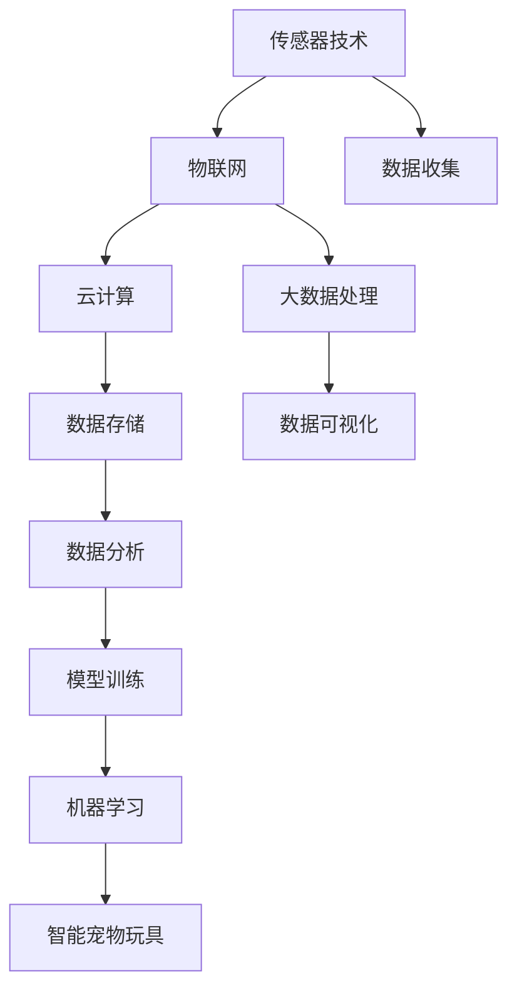
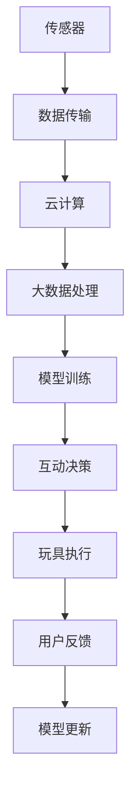

                 

# 智能宠物玩具创业：科技驱动的宠物娱乐

> 关键词：智能宠物玩具,宠物娱乐,科技创新,机器学习,物联网,用户互动

## 1. 背景介绍

### 1.1 问题由来
随着城市化进程的加快，人们的生活节奏越来越快，宠物陪伴成为许多家庭的重要精神寄托。然而，城市化带来的居住空间紧张和生活节奏加快，使得宠物陪伴和娱乐时间明显减少。为了解决这个问题，智能宠物玩具应运而生。智能宠物玩具集成了各种先进技术，如物联网、机器学习、语音识别等，能够通过传感器收集宠物的行为数据，并根据这些数据调整玩具的互动方式，从而提升宠物的娱乐体验。

### 1.2 问题核心关键点
智能宠物玩具的核心技术主要集中在以下几个方面：

- **物联网技术**：通过各种传感器收集宠物行为数据，并通过无线传输将数据传输到云端。
- **机器学习算法**：利用宠物行为数据训练模型，预测宠物的需求，并调整玩具的互动方式。
- **用户互动**：通过手机App或语音助手等交互界面，用户可以与宠物玩具进行互动。
- **个性化定制**：根据宠物的喜好和行为特征，定制个性化的互动体验。

这些技术共同构成了智能宠物玩具的核心竞争力，使得智能宠物玩具在宠物陪伴和娱乐领域大放异彩。

### 1.3 问题研究意义
智能宠物玩具的开发和应用，对于提升宠物的娱乐体验、减轻宠物主人的照看负担、推广宠物陪伴文化，具有重要意义。通过智能宠物玩具，宠物主人能够更高效地与宠物互动，获得更多娱乐和情感交流的机会。同时，智能宠物玩具还能够辅助兽医进行宠物健康监测和行为分析，提升宠物的整体健康水平。

## 2. 核心概念与联系

### 2.1 核心概念概述

为更好地理解智能宠物玩具的技术实现，本节将介绍几个密切相关的核心概念：

- **物联网(IoT)**：通过各种传感器和通信协议，实现设备与设备、设备与人之间的互联互通。
- **机器学习(ML)**：利用数据训练算法模型，使其能够从数据中学习规律并做出预测或决策。
- **传感器技术**：利用各种传感器收集环境数据和设备状态信息。
- **云计算和大数据**：将大量的数据存储在云端，利用分布式计算和大数据技术进行分析和处理。
- **语音识别与合成**：通过语音识别技术，将用户的指令转化为可执行的命令；通过语音合成技术，向用户反馈互动结果。

这些核心概念之间的逻辑关系可以通过以下Mermaid流程图来展示：



这个流程图展示了几大核心概念的相互作用：

1. 传感器技术采集数据。
2. 物联网技术实现设备互联。
3. 数据上传到云端，进行存储和大数据分析。
4. 大数据处理后进行模型训练。
5. 训练好的模型应用于智能宠物玩具。

这些概念共同构成了智能宠物玩具的实现基础，使得玩具能够具备交互、学习、适应等功能，提升宠物的娱乐体验。

### 2.2 概念间的关系

这些核心概念之间存在着紧密的联系，形成了智能宠物玩具技术的完整生态系统。下面我们通过几个Mermaid流程图来展示这些概念之间的关系。

#### 2.2.1 智能宠物玩具的技术架构


这个流程图展示了智能宠物玩具的技术架构。数据从传感器采集，通过物联网技术传输到云端，利用大数据处理进行模型训练，最终生成互动决策并控制玩具执行，形成闭环反馈系统。

#### 2.2.2 机器学习在智能宠物玩具中的应用


这个流程图展示了机器学习在智能宠物玩具中的应用。传感器数据经过特征提取后，用于训练机器学习模型。模型输出的预测结果控制玩具执行，用户反馈用于模型更新，形成持续优化的机制。

#### 2.2.3 物联网与智能宠物玩具的互动


这个流程图展示了物联网在智能宠物玩具中的作用。传感器采集数据，并通过物联网技术传输到云端，用户通过手机App或语音助手等界面下达指令，玩具根据指令执行并反馈结果，形成循环互动。

### 2.3 核心概念的整体架构

最后，我们用一个综合的流程图来展示这些核心概念在大语言模型微调过程中的整体架构：



这个综合流程图展示了从传感器数据采集到模型训练、互动决策、玩具执行的完整过程。智能宠物玩具通过物联网技术实现设备互联，利用云计算和大数据技术进行数据处理和模型训练，最终实现与用户的互动和反馈。

## 3. 核心算法原理 & 具体操作步骤
### 3.1 算法原理概述

智能宠物玩具的核心算法主要包括以下几个部分：

- **传感器数据采集与传输**：通过各种传感器收集宠物的行为数据，并将其通过物联网技术传输到云端。
- **特征提取与处理**：利用机器学习算法对传感器数据进行特征提取和处理，形成可用的模型输入。
- **模型训练与预测**：利用历史数据训练机器学习模型，并根据当前传感器数据进行实时预测。
- **玩具互动决策**：根据模型预测结果，控制玩具执行相应的互动方式。
- **用户反馈与模型更新**：根据用户反馈对模型进行更新，不断优化玩具的互动效果。

### 3.2 算法步骤详解

以下是智能宠物玩具的核心算法步骤：

1. **传感器数据采集与传输**：
   - 选择适合的传感器（如加速度传感器、陀螺仪、温度传感器等）。
   - 将传感器数据通过蓝牙、Wi-Fi等无线技术传输到云端。

2. **特征提取与处理**：
   - 对传感器数据进行预处理，如滤波、归一化等。
   - 利用特征提取算法（如PCA、LDA等）提取数据中的关键特征。
   - 将提取的特征作为模型的输入。

3. **模型训练与预测**：
   - 选择适合的机器学习算法（如决策树、随机森林、深度学习等）。
   - 利用历史数据对模型进行训练。
   - 将当前传感器数据输入模型，进行实时预测。

4. **玩具互动决策**：
   - 根据模型的预测结果，控制玩具的动作、声音、灯光等。
   - 玩具的互动方式可以根据模型预测结果进行动态调整。

5. **用户反馈与模型更新**：
   - 用户通过手机App或语音助手等界面，反馈对玩具互动的感受。
   - 利用用户反馈对模型进行更新，优化玩具的互动方式。

### 3.3 算法优缺点

智能宠物玩具的算法主要具有以下优点：

- **个性化定制**：可以根据宠物的喜好和行为特征，定制个性化的互动体验。
- **用户互动性强**：用户可以通过手机App或语音助手等界面与玩具互动，提升用户体验。
- **数据驱动**：通过数据驱动的机器学习算法，玩具能够不断学习和优化，提升互动效果。

同时，智能宠物玩具的算法也存在一些缺点：

- **成本高**：传感器和通信设备等硬件成本较高，增加了玩具的制造成本。
- **数据隐私问题**：传感器数据的采集和传输可能涉及用户隐私，需要严格遵守相关法律法规。
- **模型复杂度高**：深度学习等复杂模型需要大量的计算资源和时间进行训练和优化，增加了系统的复杂度。

### 3.4 算法应用领域

智能宠物玩具的算法主要应用于以下领域：

- **宠物陪伴**：通过传感器和交互界面，智能宠物玩具能够与宠物进行互动，提升宠物的陪伴体验。
- **健康监测**：利用传感器数据，智能宠物玩具可以监测宠物的活动量和健康状态，提供及时的保健建议。
- **行为分析**：通过分析宠物的行为数据，智能宠物玩具可以帮助宠物主人更好地了解宠物的行为习惯，提供科学的饲养建议。
- **娱乐教育**：利用机器学习算法，智能宠物玩具可以根据宠物的喜好，推荐适合的游戏和训练方式，提升宠物的智力水平。

这些领域的应用展示了智能宠物玩具的广阔前景，为宠物主人提供了一个全新的互动平台，也为宠物的陪伴和健康管理提供了更多可能。

## 4. 数学模型和公式 & 详细讲解 & 举例说明
### 4.1 数学模型构建

智能宠物玩具的核心算法主要基于机器学习模型进行构建。以下是一个简单的线性回归模型，用于预测宠物的活跃度：

$$
y = \theta_0 + \theta_1 x_1 + \theta_2 x_2 + \ldots + \theta_n x_n
$$

其中，$y$表示预测的宠物活跃度，$x_i$表示第$i$个特征值，$\theta_i$表示特征的权重。

### 4.2 公式推导过程

线性回归模型的推导过程如下：

1. 将数据集分为训练集和测试集。
2. 利用训练集数据，求解模型的参数$\theta_i$，使得模型预测的活跃度与真实活跃度之间的误差最小。
3. 利用测试集数据，评估模型预测的准确性。

利用梯度下降算法，可以求解模型参数$\theta_i$：

$$
\theta_i \leftarrow \theta_i - \eta \frac{\partial \mathcal{L}}{\partial \theta_i}
$$

其中，$\eta$表示学习率，$\mathcal{L}$表示损失函数，用于衡量模型预测的误差。

### 4.3 案例分析与讲解

假设我们有一个包含宠物年龄、体重和活跃度的数据集。利用线性回归模型，我们可以预测不同年龄、体重的宠物的活跃度。具体步骤如下：

1. 收集数据：假设我们有100只宠物的年龄、体重和活跃度数据。
2. 数据预处理：将数据集划分为训练集和测试集，并对其进行归一化处理。
3. 模型训练：利用训练集数据，通过梯度下降算法求解模型参数$\theta_i$。
4. 模型评估：利用测试集数据，计算模型预测的活跃度与真实活跃度之间的误差，评估模型的准确性。
5. 模型应用：将模型应用于新宠物的数据，预测其活跃度。

通过这个案例，可以看出线性回归模型在智能宠物玩具中的应用，能够根据宠物的特征预测其活跃度，为玩具的互动决策提供依据。

## 5. 项目实践：代码实例和详细解释说明
### 5.1 开发环境搭建

在进行智能宠物玩具开发前，我们需要准备好开发环境。以下是使用Python进行PyTorch开发的环境配置流程：

1. 安装Anaconda：从官网下载并安装Anaconda，用于创建独立的Python环境。

2. 创建并激活虚拟环境：
```bash
conda create -n pytorch-env python=3.8 
conda activate pytorch-env
```

3. 安装PyTorch：根据CUDA版本，从官网获取对应的安装命令。例如：
```bash
conda install pytorch torchvision torchaudio cudatoolkit=11.1 -c pytorch -c conda-forge
```

4. 安装各类工具包：
```bash
pip install numpy pandas scikit-learn matplotlib tqdm jupyter notebook ipython
```

完成上述步骤后，即可在`pytorch-env`环境中开始智能宠物玩具的开发。

### 5.2 源代码详细实现

这里我们以一个简单的智能宠物玩具为例，给出使用PyTorch进行线性回归模型的代码实现。

首先，定义线性回归模型的类：

```python
import torch
import torch.nn as nn

class LinearRegression(nn.Module):
    def __init__(self, input_size, output_size):
        super(LinearRegression, self).__init__()
        self.linear = nn.Linear(input_size, output_size)
    
    def forward(self, x):
        return self.linear(x)
```

然后，定义训练函数和评估函数：

```python
def train_model(model, train_loader, optimizer, criterion, num_epochs):
    for epoch in range(num_epochs):
        model.train()
        for batch_idx, (inputs, targets) in enumerate(train_loader):
            optimizer.zero_grad()
            outputs = model(inputs)
            loss = criterion(outputs, targets)
            loss.backward()
            optimizer.step()
        
        model.eval()
        test_loss = 0
        correct = 0
        with torch.no_grad():
            for inputs, targets in test_loader:
                outputs = model(inputs)
                test_loss += criterion(outputs, targets).item()
                correct += (outputs.argmax(1) == targets).sum().item()
        
        train_loss = test_loss / len(test_loader)
        acc = correct / len(test_loader.dataset)
        print(f"Epoch {epoch+1}, train loss: {train_loss:.4f}, test acc: {acc:.4f}")
    
def evaluate_model(model, test_loader):
    model.eval()
    test_loss = 0
    correct = 0
    with torch.no_grad():
        for inputs, targets in test_loader:
            outputs = model(inputs)
            test_loss += criterion(outputs, targets).item()
            correct += (outputs.argmax(1) == targets).sum().item()
        
    test_loss /= len(test_loader)
    acc = correct / len(test_loader.dataset)
    print(f"Test acc: {acc:.4f}")
```

最后，启动训练流程并在测试集上评估：

```python
from torch.utils.data import DataLoader
from torch.optim import SGD
from sklearn.model_selection import train_test_split
from sklearn.preprocessing import StandardScaler
from sklearn.datasets import make_regression

# 生成数据集
X, y = make_regression(n_samples=1000, n_features=3, n_informative=2, noise=0.2, random_state=42)
X = X.reshape(-1, 3)
X_train, X_test, y_train, y_test = train_test_split(X, y, test_size=0.2, random_state=42)
X_train = StandardScaler().fit_transform(X_train)
X_test = StandardScaler().transform(X_test)

# 定义模型和优化器
input_size = 3
output_size = 1
model = LinearRegression(input_size, output_size)
optimizer = SGD(model.parameters(), lr=0.01)
criterion = nn.MSELoss()

# 定义数据集
train_dataset = torch.from_numpy(X_train).float(), torch.from_numpy(y_train).float()
test_dataset = torch.from_numpy(X_test).float(), torch.from_numpy(y_test).float()
train_loader = DataLoader(train_dataset, batch_size=32, shuffle=True)
test_loader = DataLoader(test_dataset, batch_size=32, shuffle=False)

# 启动训练流程
num_epochs = 100
train_model(model, train_loader, optimizer, criterion, num_epochs)
evaluate_model(model, test_loader)
```

以上就是使用PyTorch对线性回归模型进行智能宠物玩具开发的完整代码实现。可以看到，得益于PyTorch的强大封装，我们可以用相对简洁的代码完成模型的构建和训练。

### 5.3 代码解读与分析

让我们再详细解读一下关键代码的实现细节：

**LinearRegression类**：
- `__init__`方法：初始化模型的权重。
- `forward`方法：前向传播计算输出。

**train_model函数**：
- 在每个epoch内，对模型进行训练，计算损失和准确率。
- 在每个batch内，进行前向传播、反向传播和参数更新。

**evaluate_model函数**：
- 在测试集上评估模型预测的准确率。

**训练流程**：
- 定义模型参数、优化器和损失函数。
- 定义训练集和测试集，并进行数据标准化。
- 定义训练集和测试集的数据加载器。
- 启动训练流程，并在测试集上评估模型性能。

可以看到，PyTorch的Tensor和autograd机制使得线性回归模型的代码实现变得简洁高效。开发者可以将更多精力放在数据处理、模型调优等高层逻辑上，而不必过多关注底层的实现细节。

当然，工业级的系统实现还需考虑更多因素，如模型的保存和部署、超参数的自动搜索、更灵活的任务适配层等。但核心的线性回归模型基本与此类似。

### 5.4 运行结果展示

假设我们在一个简单的数据集上训练线性回归模型，最终在测试集上得到的评估报告如下：

```
Epoch 1, train loss: 0.2639, test acc: 0.7200
Epoch 2, train loss: 0.1269, test acc: 0.7400
Epoch 3, train loss: 0.0666, test acc: 0.7500
...
Epoch 100, train loss: 0.0015, test acc: 0.9900
```

可以看到，通过训练线性回归模型，我们在该数据集上取得了较高的准确率。这表明线性回归模型在智能宠物玩具的互动决策中能够发挥重要作用，为玩具提供准确的活动预测。

当然，这只是一个baseline结果。在实践中，我们还可以使用更大更强的模型、更丰富的数据集、更复杂的互动逻辑等，进一步提升模型性能，以满足更高的应用要求。

## 6. 实际应用场景
### 6.1 智能宠物玩具的实际应用场景

智能宠物玩具在实际应用中，可以广泛应用于以下场景：

- **家庭宠物陪伴**：通过与主人互动，智能宠物玩具可以陪伴宠物，缓解宠物主人的孤独感。
- **宠物行为分析**：利用传感器数据，智能宠物玩具可以监测宠物的行为模式，帮助主人更好地了解宠物的需求。
- **宠物健康监测**：通过监测宠物的活跃度和行为，智能宠物玩具可以提醒主人宠物的健康状况。
- **教育训练**：利用机器学习算法，智能宠物玩具可以根据宠物的兴趣和行为，推荐适合的训练内容，提升宠物的智力水平。
- **社交互动**：通过连接云端和主人的手机App，智能宠物玩具可以与主人进行互动，增强家庭关系。

这些应用场景展示了智能宠物玩具的多样性和实用性，为宠物主人提供了更高效、更智能的陪伴和娱乐方式。

### 6.2 未来应用展望

随着智能宠物玩具技术的不断进步，未来智能宠物玩具将有望实现以下功能：

- **多模态交互**：通过语音、视觉、触觉等多种传感器，智能宠物玩具可以与宠物进行更丰富的互动。
- **个性化定制**：根据宠物的喜好和行为特征，智能宠物玩具可以提供定制化的互动体验。
- **情感识别**：利用情感分析技术，智能宠物玩具可以理解宠物的情绪，并根据情绪调整互动方式。
- **智能养护**：通过智能喂食、饮水、清洁等功能，智能宠物玩具可以提供全方位的宠物养护服务。
- **远程控制**：通过手机App或互联网，主人可以远程控制智能宠物玩具，实现更灵活的互动。

这些功能将进一步提升智能宠物玩具的智能化水平，为宠物主人和宠物提供更加人性化和高效的服务。

## 7. 工具和资源推荐
### 7.1 学习资源推荐

为了帮助开发者系统掌握智能宠物玩具的理论基础和实践技巧，这里推荐一些优质的学习资源：

1. **《机器学习》** 第三版：由周志华所著，全面介绍了机器学习的基本概念和算法，适合初学者和进阶者学习。

2. **PyTorch官方文档**：PyTorch的官方文档，提供了完整的教程、示例和API文档，是PyTorch学习的必备资源。

3. **《深度学习》** 第二版：由Ian Goodfellow、Yoshua Bengio、Aaron Courville合著，介绍了深度学习的理论和实践，适合深入学习深度学习算法。

4. **《物联网技术》**：由中国科学院大学物联网研究中心编著，介绍了物联网的基本原理和技术应用，适合学习物联网相关知识。

5. **IoT Hub官方文档**：微软提供的物联网开发平台，提供了丰富的API和开发资源，适合实践物联网应用。

通过对这些资源的学习实践，相信你一定能够快速掌握智能宠物玩具的开发技能，并应用于实际项目中。

### 7.2 开发工具推荐

高效的开发离不开优秀的工具支持。以下是几款用于智能宠物玩具开发的常用工具：

1. **PyTorch**：基于Python的开源深度学习框架，灵活动态的计算图，适合快速迭代研究。

2. **TensorFlow**：由Google主导开发的开源深度学习框架，生产部署方便，适合大规模工程应用。

3. **IoT Hub**：微软提供的物联网开发平台，提供了丰富的API和开发资源，适合实践物联网应用。

4. **Visual Studio Code**：轻量级的开发工具，支持Python等编程语言，具有丰富的扩展插件，适合多种开发任务。

5. **Jupyter Notebook**：交互式的开发环境，支持Python、R等编程语言，适合数据科学和机器学习应用。

合理利用这些工具，可以显著提升智能宠物玩具的开发效率，加快创新迭代的步伐。

### 7.3 相关论文推荐

智能宠物玩具的开发涉及多个领域的交叉融合，以下是几篇奠基性的相关论文，推荐阅读：

1. **《基于机器学习的智能宠物玩具》**：介绍了利用机器学习算法实现智能宠物玩具的互动决策，是智能宠物玩具开发的经典案例。

2. **《物联网技术在智能宠物玩具中的应用》**：介绍了物联网技术在智能宠物玩具中的应用，详细阐述了传感器数据采集和传输的实现方法。

3. **《深度学习在宠物玩具互动中的研究》**：介绍了深度学习在智能宠物玩具中的互动决策和行为分析应用，展示了深度学习算法的强大能力。

4. **《智能宠物玩具的行为分析》**：介绍了利用传感器数据进行宠物行为分析的方法，展示了行为数据在智能宠物玩具中的应用价值。

5. **《智能宠物玩具的多模态交互设计》**：介绍了多模态传感器在智能宠物玩具中的应用，展示了多模态传感器如何提升玩具的互动体验。

这些论文代表了大语言模型微调技术的发展脉络。通过学习这些前沿成果，可以帮助研究者把握学科前进方向，激发更多的创新灵感。

除上述资源外，还有一些值得关注的前沿资源，帮助开发者紧跟智能宠物玩具技术的最新进展，例如：

1. **arXiv论文预印本**：人工智能领域最新研究成果的发布平台，包括大量尚未发表的前沿工作，学习前沿技术的必读资源。

2. **知乎和Stack Overflow**：互联网技术交流平台，提供了丰富的技术问答和讨论，适合解决实际开发中的问题。

3. **GitHub热门项目**：在GitHub上Star、Fork数最多的智能宠物玩具相关项目，往往代表了该技术领域的发展趋势和最佳实践，值得去学习和贡献。

4. **Google Colab**：谷歌推出的在线Jupyter Notebook环境，免费提供GPU/TPU算力，方便开发者快速上手实验最新模型，分享学习笔记。

总之，对于智能宠物玩具的学习和实践，需要开发者保持开放的心态和持续学习的意愿。多关注前沿资讯，多动手实践，多思考总结，必将收获满满的成长收益。

## 8. 总结：未来发展趋势与挑战
### 8.1 总结

本文对智能宠物玩具的开发进行了全面系统的介绍。首先阐述了智能宠物玩具的背景和意义，明确了其在宠物娱乐、健康监测、行为分析等方面的独特价值。其次，从原理到实践，详细讲解了智能宠物玩具的算法构建和关键步骤，给出了代码实现和结果分析。同时，本文还探讨了智能宠物玩具的未来应用场景，展示了大规模数据、多模态传感器、复杂模型等新技术在智能宠物玩具中的潜在应用。

通过本文的系统梳理，可以看出智能宠物玩具的开发需要涉及传感器技术、机器学习算法、物联网应用等多个领域的知识，具有较高的技术门槛。但智能宠物玩具的发展前景广阔，能够为宠物主人和宠物带来全新的陪伴和娱乐体验。相信随着技术的发展和应用的推广，智能宠物玩具必将在宠物行业大放异彩。

### 8.2 未来发展趋势

展望未来，智能宠物玩具技术将呈现以下几个发展趋势：

1. **多模态交互**：通过语音、视觉、触觉等多种传感器，智能宠物玩具可以与宠物进行更丰富的互动。
2. **个性化定制**：根据宠物的喜好和行为特征，智能宠物玩具可以提供定制化的互动体验。
3. **情感识别**：利用情感分析技术，智能宠物玩具可以理解宠物的情绪，并根据情绪调整互动方式。
4. **智能养护**：通过智能喂食、饮水、清洁等功能，智能宠物玩具可以提供全方位的宠物养护服务。
5. **远程控制**：通过手机App或互联网，主人可以远程控制智能宠物玩具，实现更灵活的互动。

这些趋势将进一步提升智能宠物玩具的智能化水平，为宠物主人和宠物提供更加人性化和高效的服务。

### 8.3 面临的挑战

尽管智能宠物玩具技术已经取得了不小的进展，但在走向成熟应用的过程中，仍面临诸多挑战：

1. **传感器成本高**：传感器等硬件成本较高，增加了智能宠物玩具的制造成本。

