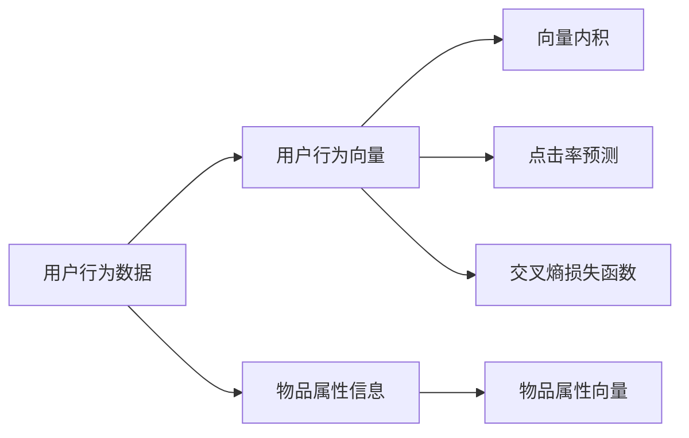

                 

# 智能推荐系统：AI个性化推荐的实现

> 关键词：智能推荐系统,个性化推荐,协同过滤,深度学习,强化学习,交叉熵损失函数,向量内积,点击率预测,神经网络模型

## 1. 背景介绍

### 1.1 问题由来

随着互联网的迅猛发展，在线内容的多样性日益丰富，用户可以轻松接触到海量的商品、服务、文章、视频等内容。然而，面对如此丰富的信息，用户往往难以从中筛选出真正感兴趣的内容，容易陷入信息过载和碎片化阅读的困境。

个性化推荐系统应运而生，它通过分析用户的行为数据和偏好信息，为用户推荐最适合的个性化内容，从而提升用户体验和满意度，促进内容消费和用户粘性。个性化推荐系统已经成为电商、视频、新闻、社交媒体等众多互联网应用的核心功能之一。

### 1.2 问题核心关键点

个性化推荐系统的主要挑战在于：

- **高效推荐**：需要在海量数据中快速找到用户感兴趣的内容，减少推荐延迟。
- **精准匹配**：能够理解用户偏好，给出真正符合其兴趣的推荐。
- **动态更新**：能够实时响应用户兴趣变化，动态更新推荐内容。
- **隐私保护**：保护用户数据隐私，避免个人信息泄露。

目前，个性化推荐系统的主流范式包括协同过滤、深度学习、强化学习等。协同过滤算法利用用户历史行为数据和用户群体相似度，生成推荐列表；深度学习算法通过构建用户-物品共现矩阵，利用神经网络模型学习用户偏好；强化学习算法通过模拟用户行为，实时调整推荐策略，提升推荐效果。

本文聚焦于基于深度学习方法的个性化推荐系统，旨在通过一系列算法和模型优化，提升推荐系统的性能和可解释性。

### 1.3 问题研究意义

研究个性化推荐系统，对于提升互联网应用的用户体验、促进内容消费、推动数字化转型，具有重要意义：

- **提升用户体验**：通过精准的个性化推荐，用户可以快速找到感兴趣的优质内容，降低信息获取成本，提升满意度。
- **促进内容消费**：推荐系统能够引导用户发现更多相关内容，提高用户停留时间和消费频次，推动内容消费增长。
- **推动数字化转型**：个性化推荐系统已经成为许多传统企业数字化转型的重要工具，帮助企业更好地理解和连接用户，提升业务效率和市场竞争力。

本文通过详细介绍基于深度学习的个性化推荐算法，希望能为互联网应用开发者提供深入的技术指导，推动AI推荐技术落地应用，实现更多现实价值。

## 2. 核心概念与联系

### 2.1 核心概念概述

为更好地理解基于深度学习的个性化推荐系统，本节将介绍几个密切相关的核心概念：

- **个性化推荐系统**：利用用户历史行为和偏好信息，为用户推荐合适的内容的系统。主要分为基于协同过滤和基于模型的方法。
- **协同过滤**：利用用户历史行为数据和用户群体相似度，生成推荐列表。包括基于用户的协同过滤和基于物品的协同过滤。
- **深度学习**：基于神经网络模型的推荐方法，利用用户行为数据和物品属性信息，学习用户偏好。
- **强化学习**：通过模拟用户行为，实时调整推荐策略，提升推荐效果。
- **点击率预测**：预测用户点击推荐内容的概率，是推荐系统评估的重要指标。
- **向量内积**：利用用户行为向量和物品属性向量计算内积，衡量用户对物品的兴趣。
- **神经网络模型**：包括多层感知机(MLP)、卷积神经网络(CNN)、循环神经网络(RNN)、注意力机制(Attention)等，用于构建推荐模型。
- **交叉熵损失函数**：用于度量推荐模型预测和真实标签之间的差异，是推荐系统中常用的损失函数。

这些核心概念之间的逻辑关系可以通过以下Mermaid流程图来展示：

```mermaid
graph TB
    A[个性化推荐系统] --> B[协同过滤]
    A --> C[深度学习]
    A --> D[强化学习]
    B --> E[基于用户的协同过滤]
    B --> F[基于物品的协同过滤]
    C --> G[多层感知机(MLP)]
    C --> H[卷积神经网络(CNN)]
    C --> I[循环神经网络(RNN)]
    C --> J[注意力机制(Attention)]
    D --> K[模拟用户行为]
    D --> L[实时调整推荐策略]
    E --> M[用户历史行为数据]
    F --> N[物品属性信息]
    G --> O[用户行为向量]
    G --> P[物品属性向量]
    G --> Q[点击率预测]
    G --> R[交叉熵损失函数]
```

这个流程图展示了个性化推荐系统的核心概念及其之间的关系：

1. 个性化推荐系统通过协同过滤、深度学习和强化学习等方法，为用户提供精准的推荐。
2. 协同过滤利用用户历史行为数据和用户群体相似度，生成推荐列表。
3. 深度学习通过构建用户-物品共现矩阵，利用神经网络模型学习用户偏好。
4. 强化学习通过模拟用户行为，实时调整推荐策略，提升推荐效果。
5. 点击率预测是推荐系统评估的重要指标。
6. 向量内积利用用户行为向量和物品属性向量计算内积，衡量用户对物品的兴趣。
7. 神经网络模型包括多层感知机(MLP)、卷积神经网络(CNN)、循环神经网络(RNN)、注意力机制(Attention)等，用于构建推荐模型。
8. 交叉熵损失函数用于度量推荐模型预测和真实标签之间的差异，是推荐系统中常用的损失函数。

### 2.2 概念间的关系

这些核心概念之间存在着紧密的联系，形成了个性化推荐系统的完整生态系统。下面我们通过几个Mermaid流程图来展示这些概念之间的关系。

#### 2.2.1 个性化推荐系统的范式

```mermaid
graph TB
    A[个性化推荐系统] --> B[协同过滤]
    A --> C[深度学习]
    A --> D[强化学习]
    B --> E[基于用户的协同过滤]
    B --> F[基于物品的协同过滤]
    C --> G[多层感知机(MLP)]
    C --> H[卷积神经网络(CNN)]
    C --> I[循环神经网络(RNN)]
    C --> J[注意力机制(Attention)]
    D --> K[模拟用户行为]
    D --> L[实时调整推荐策略]
    E --> M[用户历史行为数据]
    F --> N[物品属性信息]
    G --> O[用户行为向量]
    G --> P[物品属性向量]
    G --> Q[点击率预测]
    G --> R[交叉熵损失函数]
```

这个流程图展示了个性化推荐系统的三种主要范式：协同过滤、深度学习和强化学习。协同过滤利用用户历史行为数据和用户群体相似度，生成推荐列表。深度学习通过构建用户-物品共现矩阵，利用神经网络模型学习用户偏好。强化学习通过模拟用户行为，实时调整推荐策略，提升推荐效果。

#### 2.2.2 点击率预测的数学模型



这个流程图展示了点击率预测的基本数学模型。通过计算用户行为向量和物品属性向量的内积，生成预测概率。交叉熵损失函数用于度量预测结果和真实标签之间的差异，是推荐系统中常用的损失函数。

#### 2.2.3 神经网络模型的结构

```mermaid
graph TB
    A[用户行为数据] --> B[用户行为向量]
    A --> C[物品属性信息]
    C --> D[物品属性向量]
    B --> E[多层感知机(MLP)]
    E --> F[点击率预测]
    B --> G[卷积神经网络(CNN)]
    G --> H[点击率预测]
    B --> I[循环神经网络(RNN)]
    I --> J[点击率预测]
    B --> K[注意力机制(Attention)]
    K --> L[点击率预测]
```

这个流程图展示了不同类型的神经网络模型结构。多层感知机(MLP)、卷积神经网络(CNN)、循环神经网络(RNN)、注意力机制(Attention)等模型都可以用于构建推荐系统，用于学习用户偏好和生成推荐结果。

### 2.3 核心概念的整体架构

最后，我们用一个综合的流程图来展示这些核心概念在个性化推荐系统中的整体架构：

```mermaid
graph TB
    A[用户行为数据] --> B[用户行为向量]
    A --> C[物品属性信息]
    C --> D[物品属性向量]
    B --> E[多层感知机(MLP)]
    E --> F[点击率预测]
    B --> G[卷积神经网络(CNN)]
    G --> H[点击率预测]
    B --> I[循环神经网络(RNN)]
    I --> J[点击率预测]
    B --> K[注意力机制(Attention)]
    K --> L[点击率预测]
    E --> M[协同过滤]
    G --> N[协同过滤]
    I --> O[协同过滤]
    F --> P[强化学习]
    H --> Q[强化学习]
    J --> R[强化学习]
    L --> S[强化学习]
    P --> T[点击率预测]
    Q --> U[点击率预测]
    R --> V[点击率预测]
    S --> W[点击率预测]
    T --> X[协同过滤]
    U --> Y[协同过滤]
    V --> Z[协同过滤]
    W --> $[点击率预测]
```

这个综合流程图展示了从用户行为数据到最终推荐结果的完整流程。用户行为数据和物品属性信息，通过神经网络模型学习用户偏好，协同过滤方法生成推荐列表，交叉熵损失函数用于度量预测结果和真实标签之间的差异。强化学习实时调整推荐策略，提升推荐效果。最终，点击率预测结果用于评估推荐系统性能。

## 3. 核心算法原理 & 具体操作步骤
### 3.1 算法原理概述

基于深度学习的个性化推荐系统，主要利用用户历史行为数据和物品属性信息，构建用户行为向量和物品属性向量，利用神经网络模型学习用户偏好，生成推荐列表。核心思想是：

1. 收集用户历史行为数据和物品属性信息，构建用户行为向量和物品属性向量。
2. 利用神经网络模型，学习用户偏好，生成推荐概率。
3. 通过交叉熵损失函数，度量预测结果和真实标签之间的差异，优化模型参数。
4. 利用协同过滤方法和强化学习，实时调整推荐策略，提升推荐效果。

形式化地，假设用户行为数据为 $X=\{x_i\}_{i=1}^N$，物品属性信息为 $Y=\{y_j\}_{j=1}^M$，神经网络模型为 $M_{\theta}$。用户行为向量和物品属性向量分别为 $u_i=\{u_{i,k}\}_{k=1}^K$ 和 $v_j=\{v_{j,l}\}_{l=1}^{L}$。点击率预测模型为 $P_{\theta}(u,v)$，交叉熵损失函数为 $\mathcal{L}(\theta)$，协同过滤方法为 $\mathcal{S}$，强化学习策略为 $\mathcal{RL}$。则推荐系统的工作流程如下：

1. 构建用户行为向量和物品属性向量：
$$
u_i = M_{\theta}(x_i), v_j = M_{\theta}(y_j)
$$

2. 生成推荐概率：
$$
\hat{y} = P_{\theta}(u,v) = \sigma(\sum_{k=1}^K \sum_{l=1}^L u_{i,k}v_{j,l})
$$

3. 计算交叉熵损失函数：
$$
\mathcal{L}(\theta) = -\frac{1}{N}\sum_{i=1}^N \sum_{j=1}^M [y_{i,j}\log \hat{y}_{i,j} + (1-y_{i,j})\log (1-\hat{y}_{i,j})]
$$

4. 利用协同过滤方法和强化学习，实时调整推荐策略：
$$
\mathcal{S} = \mathcal{S}(\mathcal{L}(\theta)), \mathcal{RL} = \mathcal{RL}(\mathcal{S})
$$

5. 通过交叉熵损失函数，优化模型参数：
$$
\theta \leftarrow \theta - \eta \nabla_{\theta}\mathcal{L}(\theta)
$$

其中 $\eta$ 为学习率，$\sigma$ 为激活函数，$\hat{y}_{i,j}$ 为预测点击率，$y_{i,j}$ 为真实标签。

### 3.2 算法步骤详解

基于深度学习的个性化推荐系统的主要步骤如下：

**Step 1: 数据收集与预处理**

1. 收集用户历史行为数据 $X=\{x_i\}_{i=1}^N$，包括浏览、点击、购买等行为记录。
2. 收集物品属性信息 $Y=\{y_j\}_{j=1}^M$，包括名称、描述、类别、价格等属性。
3. 对数据进行清洗、归一化等预处理，去除异常值和噪声。

**Step 2: 用户行为向量和物品属性向量构建**

1. 对用户历史行为数据进行编码，生成用户行为向量 $u_i$。
2. 对物品属性信息进行编码，生成物品属性向量 $v_j$。
3. 利用神经网络模型，学习用户行为向量和物品属性向量之间的关系，生成用户偏好向量 $p_i$。

**Step 3: 推荐概率计算**

1. 计算用户行为向量和物品属性向量的内积，生成预测点击率 $\hat{y}_{i,j}$。
2. 利用激活函数 $\sigma$，将预测点击率转换为推荐概率 $y_i$。

**Step 4: 交叉熵损失函数计算**

1. 利用真实标签 $y_{i,j}$ 和预测概率 $y_i$，计算交叉熵损失函数 $\mathcal{L}(\theta)$。
2. 通过反向传播算法，更新模型参数 $\theta$。

**Step 5: 协同过滤和强化学习**

1. 利用协同过滤方法 $\mathcal{S}$，生成推荐列表。
2. 利用强化学习策略 $\mathcal{RL}$，实时调整推荐策略。
3. 重复上述步骤，直到推荐策略收敛或达到预设迭代轮数。

### 3.3 算法优缺点

基于深度学习的个性化推荐系统具有以下优点：

1. 高精度：深度学习模型能够学习复杂的非线性关系，能够更准确地预测用户点击概率。
2. 可解释性：通过特征选择和可视化技术，可以解释用户偏好的来源，提高推荐系统的透明度。
3. 泛化性强：深度学习模型具有较强的泛化能力，能够适应不同类型和规模的推荐场景。

同时，该算法也存在一些缺点：

1. 数据依赖性强：深度学习模型需要大量的用户行为数据和物品属性信息，难以应用于数据量较小的场景。
2. 训练时间长：深度学习模型通常需要较长的训练时间，难以实时响应推荐请求。
3. 过拟合风险高：深度学习模型容易过拟合，需要采用正则化技术进行控制。
4. 模型复杂度高：深度学习模型结构复杂，难以理解和调试。

尽管存在这些缺点，但基于深度学习的个性化推荐系统在推荐精度和用户体验方面，仍然具有不可替代的优势，值得深入研究和应用。

### 3.4 算法应用领域

基于深度学习的个性化推荐系统已经在多个领域得到广泛应用，包括但不限于：

- **电子商务**：通过推荐系统，帮助用户发现更多感兴趣的商品，提高转化率和销售额。
- **在线视频**：根据用户历史观看记录和评分，推荐相关视频内容，提升用户观看时间和满意度。
- **新闻资讯**：根据用户阅读历史和兴趣标签，推荐相关新闻文章，增加用户粘性和互动。
- **社交媒体**：根据用户互动行为，推荐相关内容和用户，增加用户活跃度和粘性。
- **金融服务**：通过推荐系统，帮助用户发现合适的理财产品和保险产品，提升用户体验和满意度。

除了上述这些领域外，个性化推荐系统还在智能家居、医疗健康、智能客服等多个场景中得到应用，为互联网应用提供了新的增长动力。

## 4. 数学模型和公式 & 详细讲解  
### 4.1 数学模型构建

本节将使用数学语言对基于深度学习的个性化推荐系统进行更加严格的刻画。

记用户行为数据为 $X=\{x_i\}_{i=1}^N$，物品属性信息为 $Y=\{y_j\}_{j=1}^M$，神经网络模型为 $M_{\theta}$，用户行为向量和物品属性向量分别为 $u_i=\{u_{i,k}\}_{k=1}^K$ 和 $v_j=\{v_{j,l}\}_{l=1}^{L}$，点击率预测模型为 $P_{\theta}(u,v)$，交叉熵损失函数为 $\mathcal{L}(\theta)$。

定义用户行为向量和物品属性向量的内积为 $\langle u,v \rangle = \sum_{k=1}^K \sum_{l=1}^L u_{i,k}v_{j,l}$，利用激活函数 $\sigma$ 将内积结果转换为推荐概率 $y_i = \sigma(\langle u,v \rangle)$。

交叉熵损失函数定义为：
$$
\mathcal{L}(\theta) = -\frac{1}{N}\sum_{i=1}^N \sum_{j=1}^M [y_{i,j}\log \sigma(\langle u_i,v_j \rangle) + (1-y_{i,j})\log (1-\sigma(\langle u_i,v_j \rangle))]
$$

其中 $y_{i,j}$ 为真实标签，$\sigma$ 为激活函数。

### 4.2 公式推导过程

以下我们以基于多层感知机(MLP)的推荐系统为例，推导交叉熵损失函数及其梯度的计算公式。

假设点击率预测模型 $P_{\theta}(u,v)$ 由多层感知机(MLP)构成，输入为 $u_i$ 和 $v_j$，输出为推荐概率 $y_i$，模型参数为 $\theta$。则模型输出可以表示为：
$$
y_i = \sigma(\langle u_i,v \rangle W)
$$

其中 $W$ 为权重矩阵。利用真实标签 $y_{i,j}$ 和预测概率 $y_i$，计算交叉熵损失函数：
$$
\mathcal{L}(\theta) = -\frac{1}{N}\sum_{i=1}^N \sum_{j=1}^M [y_{i,j}\log y_i + (1-y_{i,j})\log (1-y_i)]
$$

根据链式法则，损失函数对模型参数 $\theta$ 的梯度为：
$$
\frac{\partial \mathcal{L}(\theta)}{\partial \theta} = -\frac{1}{N}\sum_{i=1}^N \sum_{j=1}^M [y_{i,j}\frac{\partial y_i}{\partial \theta} - (1-y_{i,j})\frac{\partial (1-y_i)}{\partial \theta}]
$$

其中 $\frac{\partial y_i}{\partial \theta}$ 可以通过链式法则递归展开，利用反向传播算法高效计算。

在得到损失函数的梯度后，即可带入优化算法进行参数更新。通过梯度下降等优化算法，不断更新模型参数 $\theta$，最小化损失函数 $\mathcal{L}(\theta)$。重复上述过程直至收敛，最终得到适应特定推荐场景的最优模型参数 $\theta^*$。

### 4.3 案例分析与讲解

以电商平台的个性化推荐系统为例，具体分析推荐算法的设计和应用。

假设电商平台收集了用户的历史浏览、点击、购买记录，以及商品的属性信息（如价格、品牌、类别等）。我们通过神经网络模型 $M_{\theta}$，将用户历史行为数据编码为用户行为向量 $u_i$，将商品属性信息编码为物品属性向量 $v_j$。然后，利用多层感知机(MLP)构建点击率预测模型 $P_{\theta}(u,v)$，通过交叉熵损失函数 $\mathcal{L}(\theta)$ 优化模型参数。最终，将用户行为向量和物品属性向量输入到模型中，生成推荐概率 $y_i$，利用协同过滤方法生成推荐列表，并实时调整推荐策略。

### 4.4 代码实现

下面我们以基于多层感知机(MLP)的推荐系统为例，给出使用PyTorch的代码实现。

首先，定义推荐系统的数据处理函数：

```python
from torch import nn, optim, Tensor
import torch.nn.functional as F

class RecommendationModel(nn.Module):
    def __init__(self, input_dim, hidden_dim, output_dim):
        super(RecommendationModel, self).__init__()
        self.linear1 = nn.Linear(input_dim, hidden_dim)
        self.linear2 = nn.Linear(hidden_dim, output_dim)
        self.activation = nn.Sigmoid()
        
    def forward(self, user_vector, item_vector):
        user_vector = self.linear1(user_vector)
        user_vector = self.activation(user_vector)
        item_vector = self.linear2(item_vector)
        return self.activation(user_vector @ item_vector)
```

然后，定义推荐系统的训练函数：

```python
def train(model, data_loader, optimizer, loss_fn):
    model.train()
    for user_vector, item_vector, label in data_loader:
        optimizer.zero_grad()
        output = model(user_vector, item_vector)
        loss = loss_fn(output, label)
        loss.backward()
        optimizer.step()
```

最后，启动训练流程：

```python
model = RecommendationModel(input_dim, hidden_dim, output_dim)
optimizer = optim.Adam(model.parameters(), lr=learning_rate)
loss_fn = nn.BCELoss()

for epoch in range(num_epochs):
    train(model, data_loader, optimizer, loss_fn)
```

以上就是使用PyTorch实现基于多层感知机(MLP)的推荐系统的完整代码实现。可以看到，通过简单的神经网络模型设计，就可以构建一个基础的个性化推荐系统。

## 5. 项目实践：代码实例和详细解释说明
### 5.1 开发环境搭建

在进行推荐系统实践前，我们需要准备好开发环境。以下是使用Python进行PyTorch开发的环境配置流程：

1. 安装Anaconda：从官网下载并安装Anaconda，用于创建独立的Python环境。

2. 创建并激活虚拟环境：
```bash
conda create -n recommendation-env python=3.8 
conda activate recommendation-env
```

3. 安装PyTorch：根据CUDA版本，从官网获取对应的安装命令。例如：
```bash
conda install pytorch torchvision torchaudio cudatoolkit=11.1 -c pytorch -c conda-forge
```

4. 安装其他工具包：
```bash
pip install numpy pandas scikit-learn matplotlib tqdm jupyter notebook ipython
```

完成上述步骤后，即可在`recommendation-env`环境中开始推荐系统实践。

### 5.2 源代码详细实现

下面我们以基于多层感知机(MLP)的推荐系统为例，给出使用PyTorch的代码实现。

首先，定义推荐系统的数据处理函数：

```python
from torch import nn, optim, Tensor
import torch.nn.functional as F

class RecommendationModel(nn.Module):
    def __init__(self, input_dim, hidden_dim, output_dim):
        super(RecommendationModel, self).__init__()
        self.linear1 = nn.Linear(input_dim, hidden_dim)
        self.linear2 = nn.Linear(hidden_dim, output_dim)
        self.activation = nn.Sigmoid()
        
    def forward(self, user_vector, item_vector):
        user_vector = self.linear1(user_vector)
        user_vector = self.activation(user_vector)
        item_vector = self.linear2(item_vector)
        return self.activation(user_vector @ item_vector)
```

然后，定义推荐系统的训练函数：

```python
def train(model, data_loader, optimizer, loss_fn):
    model.train()
    for user_vector, item_vector, label in data_loader:
        optimizer.zero_grad()
        output = model(user_vector, item_vector)
        loss = loss_fn(output, label)
        loss.backward()
        optimizer.step()
```

最后，启动训练流程：

```python
model = RecommendationModel(input_dim, hidden_dim, output_dim)
optimizer = optim.Adam(model.parameters(), lr=learning_rate)
loss_fn = nn.BCELoss()

for epoch in range(num_epochs):
    train(model, data_loader, optimizer, loss_fn)
```

以上就是使用PyTorch实现基于多层感知机(MLP)的推荐系统的完整代码实现。可以看到，通过简单的神经网络模型设计，就可以构建一个基础的个性化推荐系统。

### 5.3 代码解读与分析

让我们再详细解读一下关键代码的实现细节：

**RecommendationModel类**：
- `__init__`方法：初始化神经网络模型，定义输入层、隐藏层和输出层的维度。
- `forward`方法：前向传播，计算推荐概率。

**train函数**：
- 在训练过程中，循环遍历数据集中的每个批次。
- 将用户行为向量和物品属性向量输入到模型中，生成推荐概率。
- 计算交叉熵损失函数。
- 利用优化算法更新模型参数。

**训练流程**：
- 定义总的epoch数和隐藏层维度。
- 定义学习率和损失函数。
- 在每个epoch内，重复训练函数，直到所有批次处理完毕。

可以看到，PyTorch配合深度学习框架，使得推荐系统的开发变得简洁高效。开发者可以将更多精力放在模型选择和优化上，而不必过多关注底层的实现细节。

当然，工业级的系统实现还需考虑更多因素，如模型的保存和部署

