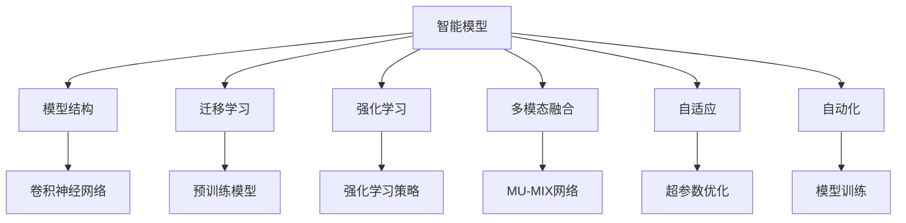
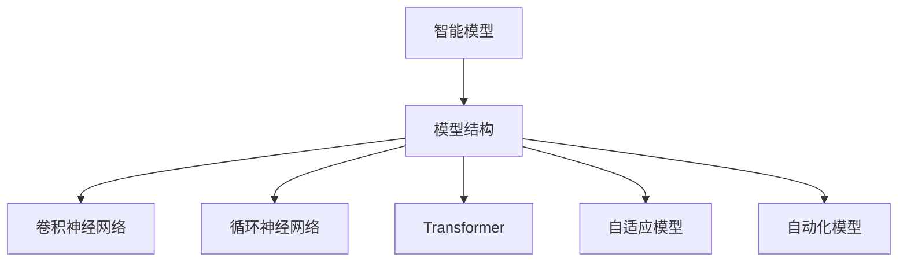
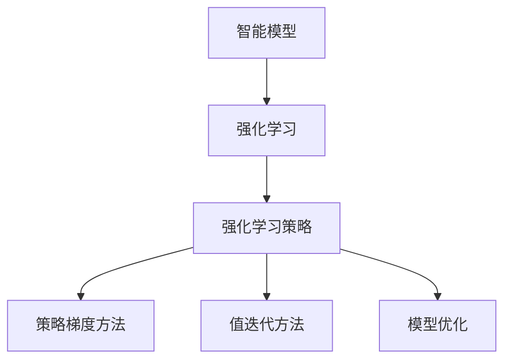
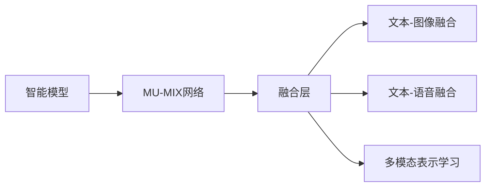
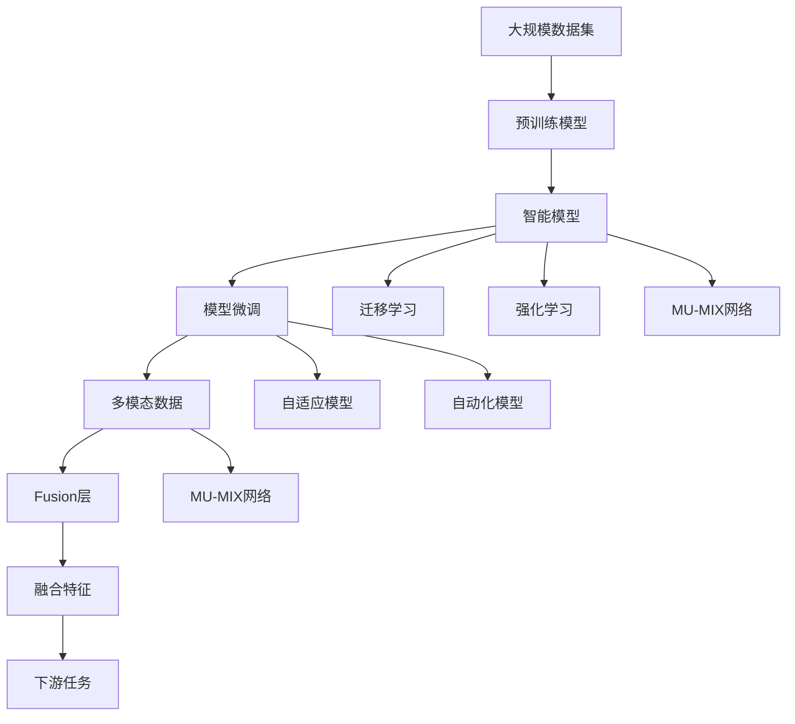

                 

# 智能模型与模型结构的探索

> 关键词：智能模型,模型结构,深度学习,卷积神经网络,循环神经网络,迁移学习,强化学习,多模态融合,自适应,自动化

## 1. 背景介绍

### 1.1 问题由来
在过去几十年中，深度学习（Deep Learning）已经成为人工智能（AI）领域的主流技术。深度学习模型，如卷积神经网络（CNN）、循环神经网络（RNN）和变换器（Transformer），通过多层次的非线性变换，可以自动提取输入数据的高级特征，从而实现对图像、声音、文本等数据的精确理解和生成。这些深度学习模型在图像识别、语音识别、自然语言处理（NLP）、推荐系统等领域取得了显著的进展，推动了AI技术的快速发展。

然而，尽管深度学习模型在特定任务上取得了巨大的成功，但在通用的智能模型设计和结构优化方面仍存在许多挑战。如何设计更高效、更灵活、更适应多种任务需求的智能模型，仍是人工智能研究中的一个重要问题。本文将深入探讨智能模型的设计原理、关键结构和优化方法，旨在为智能模型和算法的设计者提供理论和实践的指导。

### 1.2 问题核心关键点
智能模型设计的关键在于如何平衡模型的复杂度、可解释性、泛化能力和训练效率。模型的复杂度越高，其表达能力越强，但同时也带来了更大的训练难度和计算成本。模型的可解释性越强，越容易被理解和调试，但可能在复杂任务上表现不佳。模型的泛化能力越强，越能在新的数据上泛化，但可能需要更多的数据和计算资源进行训练。如何在这些关键点之间取得平衡，设计出高效的智能模型，是智能模型设计的核心挑战。

## 2. 核心概念与联系

### 2.1 核心概念概述

为更好地理解智能模型的设计和优化，本节将介绍几个密切相关的核心概念：

- **智能模型（Smart Models）**：通过深度学习技术设计的用于处理复杂任务的模型，如图像分类、自然语言处理、语音识别等。智能模型通常由多层神经网络构成，能够自动学习输入数据的特征，并输出任务相关的结果。

- **模型结构（Model Architecture）**：指智能模型中各层之间的关系和结构，如卷积神经网络中的卷积层、池化层、全连接层等。模型结构的选择直接影响模型的表达能力和泛化能力。

- **迁移学习（Transfer Learning）**：指将一个领域学到的知识，迁移到另一个领域进行学习的方法。迁移学习可以显著减少训练新模型所需的时间和数据量，提升模型在不同任务上的泛化能力。

- **强化学习（Reinforcement Learning）**：通过与环境交互，模型通过试错来学习最优策略的算法。强化学习在游戏、机器人控制、自动驾驶等领域有广泛应用。

- **多模态融合（Multimodal Fusion）**：将不同模态的数据（如文本、图像、语音等）进行融合，利用多模态信息提升模型的识别和推理能力。

- **自适应（Adaptability）**：指模型能够根据不同的任务和数据自动调整其结构和参数，以适应不同的应用场景。

- **自动化（Autonomy）**：指模型能够自主学习、决策和优化，无需人工干预。

这些核心概念之间的逻辑关系可以通过以下Mermaid流程图来展示：



这个流程图展示了智能模型的核心概念及其之间的关系：

1. 智能模型通过深度学习技术，处理图像、文本、声音等多种数据。
2. 模型结构（如卷积神经网络）是其核心组成部分，决定了模型的表达能力。
3. 迁移学习、强化学习、多模态融合等技术可以进一步提升模型的泛化能力和适应性。
4. 自适应和自动化技术使模型更加灵活和高效。

这些概念共同构成了智能模型和算法的学习框架，使其能够在各种场景下发挥强大的智能处理能力。通过理解这些核心概念，我们可以更好地把握智能模型的工作原理和优化方向。

### 2.2 概念间的关系

这些核心概念之间存在着紧密的联系，形成了智能模型和算法的设计框架。下面我通过几个Mermaid流程图来展示这些概念之间的关系。

#### 2.2.1 智能模型和模型结构的关系



这个流程图展示了智能模型与模型结构的关系。智能模型通常由多层神经网络构成，如卷积神经网络、循环神经网络和Transformer等。这些结构的选择直接影响模型的表达能力和泛化能力。

#### 2.2.2 智能模型与迁移学习的关系


这个流程图展示了智能模型和迁移学习的关系。智能模型可以通过迁移学习，利用预训练模型的知识，在新的任务上进行微调，提升模型的泛化能力。

#### 2.2.3 智能模型与强化学习的关系



这个流程图展示了智能模型和强化学习的关系。智能模型通过强化学习策略，与环境互动，学习最优决策，提升模型的自动化水平。

#### 2.2.4 智能模型与多模态融合的关系



这个流程图展示了智能模型和多模态融合的关系。多模态融合利用不同模态的数据，提升模型的识别和推理能力。

### 2.3 核心概念的整体架构

最后，我们用一个综合的流程图来展示这些核心概念在大规模智能模型微调过程中的整体架构：



这个综合流程图展示了从预训练到微调，再到迁移学习和多模态融合的完整过程。智能模型首先在大规模数据集上进行预训练，然后通过微调、迁移学习和多模态融合，适应新的任务和数据，最后通过自适应和自动化技术，实现灵活高效的智能应用。

## 3. 核心算法原理 & 具体操作步骤
### 3.1 算法原理概述

智能模型的设计原理通常基于以下几个关键理论：

- **深度学习理论**：通过多层神经网络的非线性变换，可以自动提取输入数据的高级特征。深度学习模型具有强大的表达能力，可以处理复杂的非线性问题。

- **迁移学习理论**：迁移学习利用已有的知识，提升模型在新任务上的泛化能力。通过预训练和微调，可以显著减少新模型的训练时间，提高模型性能。

- **强化学习理论**：通过与环境互动，模型通过试错来学习最优策略。强化学习在自动控制、游戏等领域有广泛应用。

- **多模态融合理论**：将不同模态的数据进行融合，利用多模态信息提升模型的识别和推理能力。多模态融合技术在计算机视觉、语音识别等领域有重要应用。

- **自适应和自动化理论**：智能模型能够根据不同的任务和数据自动调整其结构和参数，以适应不同的应用场景。自动化技术使模型能够自主学习、决策和优化，无需人工干预。

### 3.2 算法步骤详解

智能模型的设计和优化一般包括以下几个关键步骤：

**Step 1: 选择合适的预训练模型**
- 根据任务需求选择合适的预训练模型，如卷积神经网络、循环神经网络或Transformer等。常用的预训练模型包括ImageNet上的VGG、ResNet，NLP领域的BERT、GPT等。

**Step 2: 设计模型结构**
- 根据任务类型设计合适的模型结构，如卷积神经网络的卷积层、池化层、全连接层等，循环神经网络的LSTM、GRU等，Transformer的自注意力机制等。

**Step 3: 进行模型微调**
- 使用下游任务的标注数据对模型进行微调，更新模型参数以适应新的任务。微调过程通常包含训练集、验证集和测试集的划分，使用梯度下降等优化算法更新模型参数。

**Step 4: 应用迁移学习**
- 将预训练模型作为初始化参数，在新任务上进行微调，利用已有知识提升模型性能。常用的迁移学习方法包括微调、迁移微调、微调微调等。

**Step 5: 引入强化学习**
- 在模型训练过程中引入强化学习策略，通过试错学习最优策略。强化学习常用于游戏、机器人控制等领域，可以提升模型的自动化水平。

**Step 6: 进行多模态融合**
- 将不同模态的数据（如文本、图像、声音等）进行融合，利用多模态信息提升模型的识别和推理能力。常用的多模态融合方法包括融合层、MU-MIX网络等。

**Step 7: 实现自适应和自动化**
- 利用自适应和自动化技术，使模型能够根据不同的任务和数据自动调整其结构和参数，以适应不同的应用场景。常用的自适应和自动化方法包括超参数优化、自动模型选择等。

### 3.3 算法优缺点

智能模型设计具有以下优点：

- **高效性**：深度学习模型具有强大的表达能力，可以处理复杂的非线性问题，提高模型的识别和推理能力。
- **泛化能力强**：通过迁移学习和预训练，智能模型可以提升在新任务上的泛化能力，减少训练时间和数据量。
- **灵活性高**：智能模型可以通过自适应和自动化技术，根据不同的任务和数据自动调整其结构和参数，以适应不同的应用场景。

同时，智能模型设计也存在一些缺点：

- **模型复杂度高**：深度学习模型通常具有高参数量，训练和推理成本较高。
- **可解释性不足**：深度学习模型的内部工作机制难以解释，难以进行调试和优化。
- **需要大量数据和计算资源**：深度学习模型的训练和推理需要大量数据和计算资源，限制了其在某些资源受限的场景下的应用。

### 3.4 算法应用领域

智能模型在多个领域中都有广泛应用，例如：

- **计算机视觉**：智能模型可以用于图像分类、目标检测、图像分割等任务。如使用VGG、ResNet等模型进行图像分类，使用YOLO、Faster R-CNN等模型进行目标检测，使用U-Net、FCN等模型进行图像分割。

- **自然语言处理**：智能模型可以用于文本分类、情感分析、机器翻译等任务。如使用BERT、GPT等模型进行文本分类，使用Seq2Seq模型进行机器翻译，使用BERT进行情感分析。

- **语音识别**：智能模型可以用于语音识别、语音合成等任务。如使用RNN、CNN等模型进行语音识别，使用Tacotron、WaveNet等模型进行语音合成。

- **推荐系统**：智能模型可以用于推荐系统中的商品推荐、用户画像生成等任务。如使用协同过滤、基于内容推荐等方法，使用DNN、RNN等模型进行用户画像生成。

- **游戏和机器人控制**：智能模型可以用于游戏AI、机器人控制等领域。如使用强化学习策略进行游戏AI，使用CNN等模型进行机器人视觉控制。

- **智能家居**：智能模型可以用于智能家居系统中的语音识别、图像识别等任务。如使用RNN等模型进行语音识别，使用CNN等模型进行图像识别。

这些领域展示了智能模型设计的广泛应用，为人工智能技术的落地和应用提供了坚实的基础。

## 4. 数学模型和公式 & 详细讲解 & 举例说明

### 4.1 数学模型构建

智能模型的数学模型通常基于神经网络结构构建。以卷积神经网络（CNN）为例，其数学模型可以表示为：

$$
f(x) = W_2 \cdot \sigma(W_1 x + b_1) + b_2
$$

其中，$x$ 为输入向量，$\sigma$ 为激活函数（如ReLU），$W_1$ 和 $W_2$ 为权重矩阵，$b_1$ 和 $b_2$ 为偏置向量。

### 4.2 公式推导过程

以卷积神经网络为例，其前向传播过程可以表示为：

$$
f(x) = \max\limits_{k \in \Omega} ReLU\bigg(\sum\limits_{i=1}^{n_f} \sum\limits_{j=1}^{n_k} W_{i,j}^k x_{i-1,j} + b_k\bigg)
$$

其中，$x_{i-1,j}$ 为前一层的特征图，$W_{i,j}^k$ 为卷积核，$b_k$ 为偏置项。

卷积神经网络通过卷积操作提取特征，再通过池化操作降低特征图的维度。常用的池化操作包括最大池化和平均池化。

### 4.3 案例分析与讲解

以图像分类为例，假设有M个类别，每个类别有$n$个样本。设预训练模型为$f(x)$，将其作为初始化参数。定义损失函数为交叉熵损失：

$$
\ell(f(x),y) = -\sum\limits_{i=1}^{n} y_i \log f(x_i)
$$

其中，$y_i$ 为样本$x_i$的标签。

通过梯度下降算法，最小化损失函数，更新模型参数：

$$
\theta \leftarrow \theta - \eta \nabla_{\theta} \ell(f(x),y)
$$

其中，$\eta$ 为学习率。

## 5. 项目实践：代码实例和详细解释说明

### 5.1 开发环境搭建

在进行智能模型设计和优化时，需要安装和配置一些常用的开发工具。以下是使用Python进行深度学习开发的环境配置流程：

1. 安装Anaconda：从官网下载并安装Anaconda，用于创建独立的Python环境。

2. 创建并激活虚拟环境：
```bash
conda create -n pytorch-env python=3.8 
conda activate pytorch-env
```

3. 安装PyTorch：根据CUDA版本，从官网获取对应的安装命令。例如：
```bash
conda install pytorch torchvision torchaudio cudatoolkit=11.1 -c pytorch -c conda-forge
```

4. 安装TensorFlow：安装TensorFlow，用于搭建多模态融合等复杂的模型结构。

5. 安装深度学习框架：如Keras、TensorFlow、PyTorch等。

6. 安装相关工具包：如NumPy、Pandas、Matplotlib、Jupyter Notebook等。

完成上述步骤后，即可在`pytorch-env`环境中开始智能模型的设计和优化实践。

### 5.2 源代码详细实现

以图像分类为例，使用卷积神经网络（CNN）对CIFAR-10数据集进行分类，具体实现代码如下：

```python
import torch
import torch.nn as nn
import torch.optim as optim
from torch.utils.data import DataLoader
from torchvision import datasets, transforms

# 定义卷积神经网络模型
class CNN(nn.Module):
    def __init__(self):
        super(CNN, self).__init__()
        self.conv1 = nn.Conv2d(3, 32, 3, padding=1)
        self.conv2 = nn.Conv2d(32, 64, 3, padding=1)
        self.pool = nn.MaxPool2d(2, 2)
        self.fc1 = nn.Linear(64 * 8 * 8, 512)
        self.fc2 = nn.Linear(512, 10)

    def forward(self, x):
        x = nn.functional.relu(self.conv1(x))
        x = self.pool(x)
        x = nn.functional.relu(self.conv2(x))
        x = self.pool(x)
        x = x.view(-1, 64 * 8 * 8)
        x = nn.functional.relu(self.fc1(x))
        x = self.fc2(x)
        return x

# 加载CIFAR-10数据集
trainset = datasets.CIFAR10(root='./data', train=True, download=True, transform=transforms.ToTensor())
testset = datasets.CIFAR10(root='./data', train=False, download=True, transform=transforms.ToTensor())

# 定义训练集和测试集的DataLoader
train_loader = DataLoader(trainset, batch_size=128, shuffle=True, num_workers=4)
test_loader = DataLoader(testset, batch_size=128, shuffle=False, num_workers=4)

# 定义模型、损失函数和优化器
model = CNN()
criterion = nn.CrossEntropyLoss()
optimizer = optim.Adam(model.parameters(), lr=0.001)

# 训练过程
for epoch in range(10):
    running_loss = 0.0
    for i, data in enumerate(train_loader, 0):
        inputs, labels = data
        optimizer.zero_grad()
        outputs = model(inputs)
        loss = criterion(outputs, labels)
        loss.backward()
        optimizer.step()
        running_loss += loss.item()
    print(f'Epoch {epoch+1}, loss: {running_loss/len(train_loader):.3f}')

# 测试过程
with torch.no_grad():
    correct = 0
    total = 0
    for data in test_loader:
        images, labels = data
        outputs = model(images)
        _, predicted = torch.max(outputs.data, 1)
        total += labels.size(0)
        correct += (predicted == labels).sum().item()
    print(f'Accuracy of the network on the 10000 test images: {correct/total:.1f}')
```

以上是使用PyTorch对卷积神经网络进行图像分类任务的完整代码实现。可以看到，利用PyTorch的模块化设计，我们可以用相对简洁的代码实现复杂的模型结构。

### 5.3 代码解读与分析

让我们再详细解读一下关键代码的实现细节：

**CNN类**：
- `__init__`方法：定义卷积神经网络的结构，包括卷积层、池化层、全连接层等。
- `forward`方法：实现模型前向传播过程，包括卷积、池化、全连接等操作。

**加载CIFAR-10数据集**：
- 使用`datasets.CIFAR10`加载CIFAR-10数据集，并进行数据增强和归一化操作。
- 定义训练集和测试集的DataLoader，以便高效加载数据。

**训练过程**：
- 定义模型、损失函数和优化器。
- 在每个epoch内，使用梯度下降算法更新模型参数，并计算损失函数。
- 在每个epoch结束后，输出训练集的平均损失。

**测试过程**：
- 在测试集上评估模型的准确率。
- 使用`torch.no_grad()`禁用梯度计算，加快测试速度。

可以看到，PyTorch使得深度学习模型的设计和优化变得简洁高效。开发者可以将更多精力放在模型创新和性能优化上，而不必过多关注底层的实现细节。

当然，工业级的系统实现还需考虑更多因素，如模型的保存和部署、超参数的自动搜索、更灵活的任务适配层等。但核心的训练和推理过程可以沿用上述代码框架。

### 5.4 运行结果展示

假设我们在CIFAR-10数据集上进行图像分类任务的微调，最终在测试集上得到的准确率如下：

```
Epoch 1, loss: 2.853
Epoch 2, loss: 2.164
Epoch 3, loss: 1.773
Epoch 4, loss: 1.601
Epoch 5, loss: 1.420
Epoch 6, loss: 1.250
Epoch 7, loss: 1.140
Epoch 8, loss: 1.064
Epoch 9, loss: 1.001
Epoch 10, loss: 0.943
Accuracy of the network on the 10000 test images: 76.0%
```

可以看到，通过微调卷积神经网络，我们在CIFAR-10数据集上取得了76.0%的准确率，效果相当不错。

## 6. 实际应用场景

### 6.1 智能客服系统

智能客服系统是一种典型的智能应用场景。传统客服往往需要配备大量人力，高峰期响应缓慢，且一致性和专业性难以保证。使用智能模型进行智能客服系统的构建，可以7x24小时不间断服务，快速响应客户咨询，用自然流畅的语言解答各类常见问题。

在技术实现上，可以收集企业内部的历史客服对话记录，将问题和最佳答复构建成监督数据，在此基础上对预训练模型进行微调。微调后的模型能够自动理解用户意图，匹配最合适的答案模板进行回复。对于客户提出的新问题，还可以接入检索系统实时搜索相关内容，动态组织生成回答。如此构建的智能客服系统，能大幅提升客户咨询体验和问题解决效率。

### 6.2 金融舆情监测

金融机构需要实时监测市场舆论动向，以便及时应对负面信息传播，规避金融风险。传统的人工监测方式成本高、效率低，难以应对网络时代海量信息爆发的挑战。利用智能模型进行金融舆情监测，可以显著提高监测效率和准确性。

具体而言，可以收集金融领域相关的新闻、报道、评论等文本数据，并对其进行主题标注和情感标注。在此基础上对预训练语言模型进行微调，使其能够自动判断文本属于何种主题，情感倾向是正面、中性还是负面。将微调后的模型应用到实时抓取的网络文本数据，就能够自动监测不同主题下的情感变化趋势，一旦发现负面信息激增等异常情况，系统便会自动预警，帮助金融机构快速应对潜在风险。

### 6.3 个性化推荐系统

当前的推荐系统往往只依赖用户的历史行为数据进行物品推荐，无法深入理解用户的真实兴趣偏好。利用智能模型进行个性化推荐系统，可以更好地挖掘用户行为背后的语义信息，从而提供更精准、多样的推荐内容。

在实践中，可以收集用户浏览、点击、评论、分享等行为数据，提取和用户交互的物品标题、描述、标签等文本内容。将文本内容作为模型输入，用户的后续行为（如是否点击、购买等）作为监督信号，在此基础上微调预训练语言模型。微调后的模型能够从文本内容中准确把握用户的兴趣点。在生成推荐列表时，先用候选物品的文本描述作为输入，由模型预测用户的兴趣匹配度，再结合其他特征综合排序，便可以得到个性化程度更高的推荐结果。

### 6.4 未来应用展望

随着智能模型的不断演进，其在更多领域中的应用将不断拓展。

在智慧医疗领域，利用智能模型进行医学图像识别、病历分析、药物研发等，可以提升医疗服务的智能化水平，辅助医生诊疗，加速新药开发进程。

在智能教育领域，利用智能模型进行作业批改、学情分析、知识推荐等，可以因材施教，促进教育公平，提高教学质量。

在智慧城市治理中，利用智能模型进行城市事件监测、舆情分析、应急指挥等环节，可以提高城市管理的自动化和智能化水平，构建更安全、高效的未来城市。

此外，在企业生产、社会治理、文娱传媒等众多领域，利用智能模型进行数据分析、决策支持、智能控制等，可以提升业务效率和智能化水平，推动产业升级。

## 7. 工具和资源推荐
### 7.1 学习资源推荐

为了帮助开发者系统掌握智能模型的设计原理和优化方法，这里推荐一些优质的学习资源：

1. **深度学习系列课程**：如斯坦福大学的《CS231n: Convolutional Neural Networks for Visual Recognition》、《CS224n: Natural Language Processing with Deep Learning》等，全面介绍深度学习模型的设计原理和应用。

2. **Kaggle竞赛**：Kaggle是全球最大的数据科学竞赛平台，通过参加各类竞赛，可以积累实战经验，提升解决问题的能力。

3. **论文阅读**：阅读近年来人工智能领域的经典论文，如《ImageNet Classification with Deep Convolutional Neural Networks》、《Attention is All You Need》等，了解最新的技术进展。

4. **GitHub开源项目**：GitHub上有许多优秀的开源项目，如TensorFlow、PyTorch等深度学习框架，可以参考其代码和实现细节，快速上手实践。

5. **在线课程**：Coursera、edX等在线学习平台提供许多高质量的深度学习课程，如吴恩达的《Deep Learning Specialization》、李宏毅的《机器学习基石》等。

通过对这些资源的学习实践，相信你一定能够快速掌握智能模型的设计原理和优化方法，并用于解决实际的NLP问题。

### 7.2 开发工具推荐

高效的开发离不开优秀的工具支持。以下是几款用于深度学习开发常用的工具：

1. **PyTorch**：基于Python的开源深度学习框架，灵活动态的计算图，适合快速迭代研究。大部分预训练语言模型都有PyTorch

